This is my collection, or gallery, of Tikz Art.  The official Tikz
Gallery is on [TeXample.net](http://www.texample.net/tikz/examples/). A
interesting exposition of Tikz features is done in
<http://tug.ctan.org/info/visualtikz/VisualTikZ.pdf>. The official
manual is available at
<http://linorg.usp.br/CTAN/graphics/pgf/base/doc/pgfmanual.pdf>.

There are 244 Tikz figures in this gallery.  Most of them were
done to teach statistics, inspired by content on the web or done from
the scratch.  Also, a lot were caught in the web and copied with few
modifications (I run tests on it).

I use [ktikz editor](https://apps.ubuntu.com/cat/applications/ktikz/) to
edit these Tikz files.

This repository is maintained in to Git Version Control and is hosted on
[GitHub](https://github.com/walmes/Tikz).

If you want to reproduce these figures, do not forget of seeing the
corresponding preamble that list all tikz libraries used:
[TIKZ_PREAMBLE.pgs](https://github.com/walmes/Tikz/blob/master/src/TIKZ_PREAMBLE.pgs).

The figures are in file file order.  A page with all figures displayed
in on <http://www.leg.ufpr.br/~walmes/Tikz/> (updated less frequently).

Some useful tutorials or galleries:

  * <https://tobiw.de/en/teotm/tikz-adventskalender>.
  * <http://math.et.info.free.fr/TikZ/bdd/TikZ-Impatient.pdf>.
  * <http://www.mat.ufpb.br/lenimar/introtikz.pdf>.


****


  * [agronomia.pgf](https://github.com/walmes/Tikz/blob/master/src/agronomia.pgf)

```tex
\begin{tikzpicture}

  % \fill[red] (0, 0) circle (1pt);
  % \draw (0, 0) --
  % ++(0.375, 0) --
  % ++(60:2) --
  % ++(-0.5, 0) --
  % ++(-120:0.5) --
  % ++(-1.25, 0) --
  % ++(120:0.5) --
  % ++(-0.5, 0) --
  % ++(-60:2) --
  % cycle;

  \begin{scope}
    \foreach \angle in {0, 60, ..., 300} {
      \begin{scope}[rotate = \angle, shift = {(0, 1)}]
        \draw[draw = none, fill = green!40!black]
          (0, 0) --
          ++(0.375, 0) --
          ++(60:2) --
          ++(-0.5, 0) --
          ++(-120:0.5) --
          ++(-1.25, 0) --
          ++(120:0.5) --
          ++(-0.5, 0) --
          ++(-60:2) --
          cycle;
      \end{scope}
    }
  \end{scope}

  \begin{scope}[yshift = 0cm, xshift = 5.5cm, scale = 0.5]

    \foreach \angle in {0, 60, 120} {
      \begin{scope}[rotate = \angle, shift = {(0, 1)}]
        \draw[draw = none, fill = green!40!black]
          (0, 0) --
          ++(0.375, 0) --
          ++(60:2) --
          ++(-0.5, 0) --
          ++(-120:0.5) --
          ++(-1.25, 0) --
          ++(120:0.5) --
          ++(-0.5, 0) --
          ++(-60:2) --
          cycle;
      \end{scope}
    }

    \begin{scope}[xshift = 2cm]
      \foreach \angle in {180, 240, 300} {
        \begin{scope}[rotate = \angle, shift = {(0, 1)}]
          \draw[draw = none, fill = green!40!black]
            (0, 0) --
            ++(0.375, 0) --
            ++(60:2) --
            ++(-0.5, 0) --
            ++(-120:0.5) --
            ++(-1.25, 0) --
            ++(120:0.5) --
            ++(-0.5, 0) --
            ++(-60:2) --
            cycle;
        \end{scope}
      }
    \end{scope}

    \node[color = green!40!black] at (0.75, 0.25) {\huge\it PET};
    \node[color = green!40!black] at (0.95, -0.65) {\it Agronomia};
    \node[color = green!40!black] at (0.2, -1.35) {\it UFGD};

  \end{scope}

\end{tikzpicture}
```
****

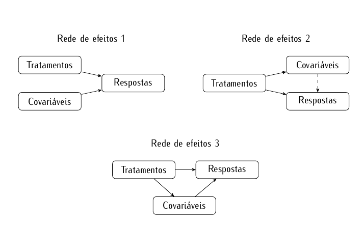

  * [analise-covarianca-efeitos.pgf](https://github.com/walmes/Tikz/blob/master/src/analise-covarianca-efeitos.pgf)

```tex
\begin{tikzpicture}[%
  auto, > = stealth',
  node distance = 0.0ex and 2em,
  pil/.style = {->},
  punkt/.style = {
    rectangle,
    rounded corners = 3pt,
    draw = black,
    text width = 5.5em,
    minimum height = 1.75em,
    text centered}
  ]

\def\tratamentos{Tratamentos}
\def\respostas{Respostas}
\def\covariaveis{Covari{\' a}veis}
\def\rede{Rede de efeitos}

\begin{scope}
  \node[punkt] (y1) {Respostas};
  \node[punkt, above left = of y1] (t1) {\tratamentos};
  \node[punkt, below left = of y1] (x1) {Covari{\' a}veis};
  \path[pil] (t1) edge (y1);
  \path[pil] (x1) edge (y1);
  \node[fit = (t1)(x1)(y1), above, yshift = 1em] (fit1) {Rede de efeitos 1};
\end{scope}

\begin{scope}[xshift = 3.5cm]
  \node[punkt] (t3) {\tratamentos};
  \node[punkt, below right = of t3] (y3) {\respostas};
  \node[punkt, above right = of t3] (x3) {\covariaveis};
  \path[pil] (t3) edge (y3);
  \path[pil] (t3) edge (x3);
  \path[pil, dashed] (x3) edge (y3);
  \node[fit = (t3)(x3)(y3), above, yshift = 1em] (fit3) {\rede{} 2};
\end{scope}

\begin{scope}[xshift = 3.25cm, yshift = -3cm]
  \node[punkt] (y2) {\respostas};
  \node[punkt, left = of y2] (t2) {\tratamentos};
  \node[punkt, below left = 1.75em and -2em of y2] (x2) {\covariaveis};
  \path[pil] (t2) edge (y2);
  \path[pil] (x2) edge (y2);
  \path[pil] (t2) edge (x2);
  \node[fit = (t2)(x2)(y2), above, yshift = 1em] (fit2) {\rede{} 3};
\end{scope}

\end{tikzpicture}%
```
****

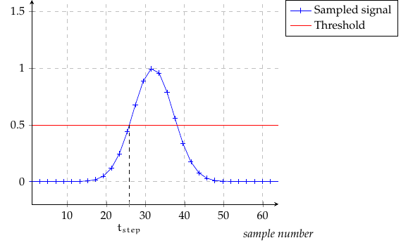

  * [anotacoes_intersecao.pgf](https://github.com/walmes/Tikz/blob/master/src/anotacoes_intersecao.pgf)

```tex
%% http://tex.stackexchange.com/questions/129571/add-variable-tick-in-axis

\makeatletter
\def\markxof#1{
  \pgf@process{#1}
  \pgfmathparse{
    \pgf@x/\pgfplotsunitxlength+
    \pgfplots@data@scale@trafo@SHIFT@x)/10^\pgfplots@data@scale@trafo@EXPONENT@x}
}
\makeatother

\pgfplotsset{
  every axis/.append style={font=\small},
  mystyle/.style={%
    clip=true,
    axis x line=bottom,
    axis y line=left,
    xmin=1, xmax=64,
    samples =32,
    ymax = 1.6, ymin  = -0.2}
}

\begin{tikzpicture}
  \begin{axis}[
    mystyle,
    grid = major,
    grid style={dashed},
    xlabel={\emph{sample number}},
    xlabel style={at={(1,-0.2)}, anchor=south},
    legend cell align=left,
    legend pos=outer north east]

    \addplot[name path global=one,blue,mark=+,domain=1:64]
      {exp(-log10(2)/(8^2/4)*(\x-32)^2)};
    \addplot[name path global=two,red,domain=1:64] {0.5};
    \path [name intersections={of=one and two, name=i}];
    \pgfplotsextra{
      \path (i-1) \pgfextra{\markxof{i-1}\xdef\mytick{\pgfmathresult}};
    }
    \path let \p1=($(i-1)$) in (\x1,\y1);
    \draw[dashed] (i-1) -- ($(axis cs:0,-0.2)!(i-1)!(axis cs:64,-.2)$);
    \legend{Sampled signal, Threshold}
  \end{axis}

  \begin{axis}[
    mystyle,
    xtick=\empty, ytick=\empty,
    extra x ticks={\mytick},
    extra x tick labels={$t_{step}$},
    extra x tick style={
      xticklabel style={yshift=-10}
    }]
  \end{axis}
\end{tikzpicture} 
```
****

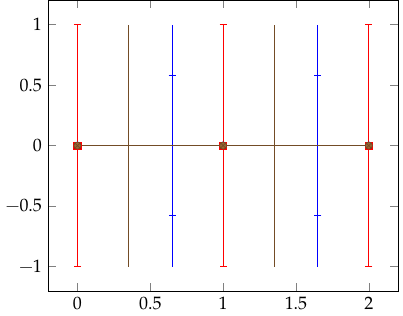

  * [barras_erro.pgf](https://github.com/walmes/Tikz/blob/master/src/barras_erro.pgf)

```tex
%% http://tex.stackexchange.com/questions/69445/using-pgfplots-why-do-i-get-undefined-control-sequence-when-trying-to-use-a-f

\begin{tikzpicture}
  \begin{axis}
    \foreach \x/\y in {a/-1cm, b/0cm, c/1cm} {
      \edef\temp{
        \noexpand\addplot+[
          every error bar/.append style={xshift=\y},
          every node/.style={xshift=\y},
          error bars/y dir=both,
          error bars/y explicit]
      }
      \temp
      coordinates {
        (0, 0) +- (0, 1)
        (1, 0) +- (0, 1)
        (2, 0) +- (0, 1)
      };
    }
  \end{axis}
\end{tikzpicture}
```
****

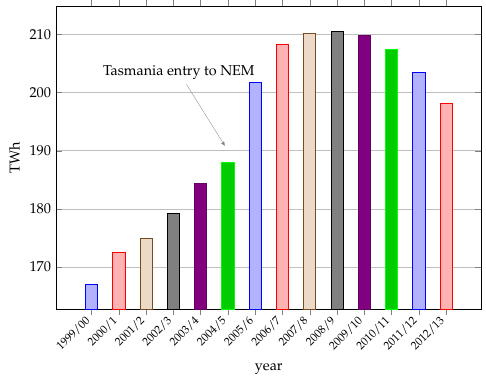

  * [barras.pgf](https://github.com/walmes/Tikz/blob/master/src/barras.pgf)

```tex
\pgfplotsset{
  select row/.style={
    x filter/.code={\ifnum\coordindex=#1\else\def\pgfmathresult{}\fi}
  }
}

\pgfplotstableread[col sep=comma,header=false]{
  1999/00,167.1
  2000/1,172.5
  2001/2,175
  2002/3,179.3
  2003/4,184.4
  2004/5,188
  2005/6,201.7
  2006/7,208.3
  2007/8,210.2
  2008/9,210.5
  2009/10,209.8
  2010/11,207.5
  2011/12,203.4
  2012/13,198.2
  % 2013/14(YTD),97
}\datatable

\begin{tikzpicture}[scale=0.8]
  \begin{axis}[
    % title=Australia's Primary Energy Consumption by sector - 2012,
    ybar, bar shift=0pt,
    enlarge y limits=0.1,
    % xmin=0,
    xtick={0,...,13},
    xticklabels from table={\datatable}{0},
    ymajorgrids = true,
    bar width=3mm, 
    width=12cm, height=9cm, 
    xlabel={year},
    ylabel={TWh},
    x tick label style={font=\footnotesize,rotate=45, anchor=east},
    nodes near coords align={horizontal}]

    \pgfplotsinvokeforeach{0,...,13}{
      \addplot table [x expr=\coordindex, select row=#1] {\datatable};
    }
    \node[
      pin={[pin distance=1cm, pin edge={<-,>=stealth'},
        shift={(-1.2cm,0.5cm)}]
      Tasmania entry to NEM}] at (axis cs:5,190) {};
  \end{axis}
\end{tikzpicture}
```
****

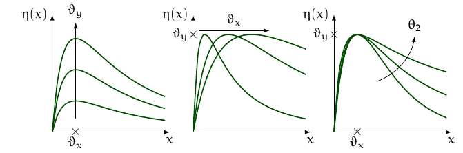

  * [bleasdale_nelder_rep.pgf](https://github.com/walmes/Tikz/blob/master/src/bleasdale_nelder_rep.pgf)

```tex
\def\xs{0.6}
\def\ys{1}
\def\ty{2.5}
\def\tx{1}
\def\tc{0.3}

\begin{tikzpicture}[xscale=\xs, yscale=\ys, >=latex]
  \begin{scope}
    \draw[->] (0,0) -- (5,0) node[below] {$x$};
    \draw[->] (0,0) -- (0,3) node[left] {$\eta(x)$};
    \foreach \tty in {0.8,1.6,2.4}
    \draw[color=green!30!black, thick, smooth]
      plot[id=x, domain=0:4.8]
      function{\tty*(x/\tx)*(1-\tc*(1-x/\tx))**(-1/\tc)};
    \draw[->,xshift=\tx cm] (0,0.35) -- (0,2.8)
      node[above] {$\vartheta_y$};
    \draw (\tx,0) node {$\times$} node[below] {$\vartheta_x$};
  \end{scope}
  \begin{scope}[xshift=6cm]
    \draw[->] (0,0) -- (5,0) node[below] {$x$};
    \draw[->] (0,0) -- (0,3) node[left] {$\eta(x)$};
    \foreach \ttx in {0.5,1.5,2.5}
    \draw[color=green!30!black, thick, smooth]
      plot[id=x, domain=0:4.8]
      function{\ty*(x/\ttx)*(1-\tc*(1-x/\ttx))**(-1/\tc)};
    \draw[->,xshift=0.25cm,yshift=0.1cm] (0,\ty) -- (3,\ty)
      node[midway,above] {$\vartheta_x$};
    \draw (0, \ty) node {$\times$} node[left] {$\vartheta_y$};
  \end{scope}
  \begin{scope}[xshift=12cm]
    \draw[->] (0,0) -- (5,0) node[below] {$x$};
    \draw[->] (0,0) -- (0,3) node[left] {$\eta(x)$};
    \foreach \ttc in {0.05,0.3,0.55}
    \draw[color=green!30!black, thick, smooth]
      plot[id=x, domain=0:4.8]
      function{\ty*(x/\tx)*(1-\ttc*(1-x/\tx))**(-1/\ttc)};
    \draw[->,xscale=1/\xs, yscale=1/\ys] (1.1,1.3) arc (290:350:1.5cm)
      node[above] {$\theta_2$};
    \draw (0, \ty) node {$\times$} node[left] {$\vartheta_y$};
    \draw (\tx,0) node {$\times$} node[below] {$\vartheta_x$};
  \end{scope}
\end{tikzpicture}
```
****


  * [bouma.pgf](https://github.com/walmes/Tikz/blob/master/src/bouma.pgf)

```tex
\begin{tikzpicture}[scale=2.2, >=latex]
  % preenchimentos
  \draw[draw=none, fill=gray!15] (0,0) -- (0,1.5) -- 
    plot[id=x, domain=0:1] function{1+2*(x-0.5)**2} -- (1,0);
  \draw[draw=none, fill=gray!15] (-1,-0.75) rectangle (2,0.13);
  \draw[draw=none, fill=gray!25]
    (1,1.52) arc (0:-180:0.5cm and 0.2cm) --
    plot[id=x, domain=0:1] function{1+2*(x-0.5)**2};
  \draw[draw=none, fill=gray!40] (0.5,1.52) ellipse (0.5cm and 0.2cm);

  % laterais do tubo
  \draw (-1,0.15) -- (-1,-0.75) -- (2,-0.75) -- (2,0.2);
  \draw (0,0) -- (0,2);
  \draw (1,0) -- (1,2);
  \draw[yshift=2cm, dashed] (0,0) -- (0,0.15);
  \draw[yshift=2cm, dashed] (1,0) -- (1,0.15);
  \draw[dashed] (0,0) -- (0,-0.15);
  \draw[dashed] (1,0) -- (1,-0.15);

  % parabola e elipses
  \draw plot[id=x, domain=0:1, samples=50, smooth]
    function{1+2*(x-0.5)**2};
  \draw[dashed] (0.5,2) ellipse (0.5cm and 0.2cm);
  \draw[dashed] (1,1.52) arc (0:180:0.5cm and 0.2cm);
  \draw (0,1.52) arc (180:360:0.5cm and 0.2cm);

  % chaves
  \draw [xshift=1.1cm, decorate, decoration={brace, amplitude=4pt}]
    (0,1) -- (0,0.1) node [black,midway,right=5pt] {$h$};
  \draw [yshift=-0.15cm, decorate, decoration={brace, amplitude=4pt}]
    (0.5,0) -- (0,0) node [black,midway,below=5pt] {$r$};

  % angulo
  \draw[<->,yshift=-0.5cm] (1,1.55) arc (270:246:0.5cm and 0.5cm);
  \path (1,1.52)++(255:0.5) node[below] {$\alpha$};

  % setas do menisco
  \path[yshift=-0.5cm,xshift=-0.24cm,->, draw=black]
    (0.5,1.52)++(0:0.5 and 0.2) -- ++(0.5,1);
  \path[yshift=-0cm,xshift=-1.0cm,->, draw=black]
    (0.5,1.52)++(0:0.5 and 0.2) -- ++(-0.25,0.5);
  \path[->, draw=black] (0.5,1.52)++(45:0.5 and 0.2) -- ++(0.15,0.55);
  \path[->, draw=black] (0.5,1.52)++(90:0.5 and 0.2) -- ++(0.0,0.58);
  \path[->, draw=black] (0.5,1.52)++(135:0.5 and 0.2) -- ++(-0.15,0.55);
  \path[->, draw=black] (0.5,1.52)++(225:0.5 and 0.2) -- ++(-0.15,0.4);
  \path[->, draw=black] (0.5,1.52)++(315:0.5 and 0.2) -- ++(0.15,0.4);
  \path[->, draw=black] (0.5,1.52)++(270:0.5 and 0.2) -- ++(0.0,0.38);
  % \draw[color=gray!10] (0.5,2) ellipse (0.75cm and 0.3cm);

  % setas grossas
  \draw[->, line width=3pt] (0.5,0.8) -- ++(0,-0.5)
    node[below] {$\pi r^2 h\rho g$};
  \draw[->, line width=3pt] (0.5,2.4) -- ++(0,0.5)
    node[above] {$2\pi r \gamma \cos(\alpha)$};

  % setas com textos
  \path[xshift=2pt, yshift=-2pt, ->, draw]
    (1,1.52)++(255:0.5) to[out=0, in=180] ++(0.3,0.3)
    node[anchor=west, text ragged, text width=3cm]
    {\^angulo entre o menisco e a parede do tubo capilar};
  \path[xshift=5.5pt, yshift=-2pt, ->, draw]
    (1.1,0.5) to[out=270, in=180] ++(0.2,-0.15)
    node[anchor=west, text ragged, text width=2cm] {ascens\~ao};
  \path[xshift=2pt, yshift=-5pt, ->, draw]
    (0.25,-0.15) to[out=0, in=180] ++(0.3,-0.2)
    node[anchor=west, text ragged, text width=3cm]
    {raio do tubo capilar};

  \begin{scope}[xshift=3.25cm, yshift=-0.75cm, scale=1.25]
    % base
    \draw[draw=none, fill=gray!40] (-0.5,0) rectangle (1.5,0.7);
    \draw (-0.5,0.75) -- (-0.5,0) -- (1.5,0) -- (1.5,0.75);

    % preenchimento
    \draw[draw=none, fill=gray!40] (0,0.5) --
      plot[id=x, domain=0:0.45, smooth]
      function{0.8+1*(x-0.225)**2} --
      plot[id=x, domain=0.45:0.70, smooth]
      function{1.25+2*(x-0.575)**2} --
      plot[id=x, domain=0.70:0.80, smooth]
      function{2+4*(x-0.75)**2} --
      plot[id=x, domain=0.8:0.85, smooth]
      function{2.45+8*(x-0.825)**2} -- 
      plot[id=x, domain=0.85:1, smooth]
      function{1.6+3*(x-0.925)**2} -- (1,0.5);

    % tubos
    \draw (0,0.5) -- ++(0,2);
    \draw (0.45,0.5) -- ++(0,2);
    \draw (0.70,0.5) -- ++(0,2);
    \draw (0.80,0.5) -- ++(0,2);
    \draw (0.85,0.5) -- ++(0,2);
    \draw (1,0.5) -- ++(0,2);
  \end{scope}
\end{tikzpicture}
```
****

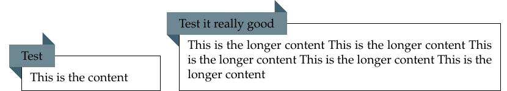

  * [caixa_texto1.pgf](https://github.com/walmes/Tikz/blob/master/src/caixa_texto1.pgf)

```tex
% http://tex.stackexchange.com/questions/22406/how-to-make-a-textbox-with-this-tikz-code

\xdefinecolor{mycolor}{RGB}{62,96,111} % Neutral Blue
\colorlet{bancolor}{mycolor}
% \def\bancolor{mycolor}

\newenvironment{mybox}[3][]{%
  \begin{tikzpicture}[#1]%
    \def\myboxname{#3}%
    % good options: minimum height, minimum width
    \node [draw, inner sep=1.5ex, text width=#2, align=justify]
      (BOXCONTENT) \bgroup\rule{0pt}{3ex}\ignorespaces
  }{%
    \egroup;
    \node [right, inner xsep=1em, fill=bancolor!75, outer sep=0pt,
      text height=2ex, text depth=.5ex] (BOXNAME) 
      at ([shift={(-1em,0pt)}]BOXCONTENT.north west) {\myboxname};
    \fill[bancolor] (BOXNAME.north east) -- +(-1em,1em)
      -- +(-1em,0) -- cycle;
    \fill[bancolor] (BOXNAME.south west) -- +(1em,-1em)
      -- +(1em,0) -- cycle;
  \end{tikzpicture}
}

\begin{mybox}{10em}{Test}
  This is the content
\end{mybox}

\begin{mybox}{25em}{Test it really good}
  This is the longer content
  This is the longer content
  This is the longer content
  This is the longer content
  This is the longer content
\end{mybox}
```
****

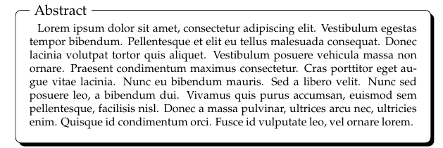

  * [caixa_texto2.pgf](https://github.com/walmes/Tikz/blob/master/src/caixa_texto2.pgf)

```tex
% https://blog.karssen.org/2009/09/14/using-tikz-to-generate-an-abstract-box-in-latex/

\tikzset{
  abstractbox/.style={
    draw=black, fill=white, rectangle, 
    inner sep=10pt, style=rounded corners,
    drop shadow={fill=black, opacity=1}
  },
  abstracttitle/.style={fill=white}
}

\newcommand{\boxabstract}[2][fill=white]{
  \begin{tikzpicture}
    \node [abstractbox, #1] (box)
    {\begin{minipage}{0.80\linewidth}
        \setlength{\parindent}{2mm} % Indentar.
        \footnotesize #2
      \end{minipage}};
    \node[abstracttitle, right=10pt] at (box.north west) {Abstract};
    \node[draw=none, fit=(box)] {};
  \end{tikzpicture}
}

\boxabstract{
  Lorem ipsum dolor sit amet, consectetur adipiscing elit. Vestibulum
  egestas tempor bibendum. Pellentesque et elit eu tellus malesuada
  consequat. Donec lacinia volutpat tortor quis aliquet. Vestibulum
  posuere vehicula massa non ornare. Praesent condimentum maximus
  consectetur. Cras porttitor eget augue vitae lacinia. Nunc eu bibendum
  mauris. Sed a libero velit. Nunc sed posuere leo, a bibendum
  dui. Vivamus quis purus accumsan, euismod sem pellentesque, facilisis
  nisl. Donec a massa pulvinar, ultrices arcu nec, ultricies
  enim. Quisque id condimentum orci. Fusce id vulputate leo, vel ornare
  lorem.
}
```
****

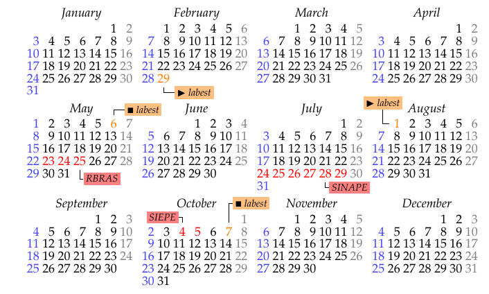

  * [calendario2016.pgf](https://github.com/walmes/Tikz/blob/master/src/calendario2016.pgf)

```tex
\makeatletter
% Define our own style
\tikzstyle{week list sunday}=[
  % Note that we cannot extend from week list,
  % the execute before day scope is cumulative
  execute before day scope={%
    \ifdate{day of month=1}{\ifdate{equals=\pgfcalendarbeginiso}{}{
        % On first of month, except when first date in calendar.
        \pgfmathsetlength{\pgf@y}{\tikz@lib@cal@month@yshift}%
        \pgftransformyshift{-\pgf@y}
      }}{}%
  },
  execute at begin day scope={%
    % Because for TikZ Monday is 0 and Sunday is 6,
    % we can't directly use \pgfcalendercurrentweekday,
    % but instead we define \c@pgf@counta (basically) as:
    % (\pgfcalendercurrentweekday + 1) % 7
    \pgfmathsetlength\pgf@x{\tikz@lib@cal@xshift}%
    \ifnum\pgfcalendarcurrentweekday=6
    \c@pgf@counta=0
    \else
    \c@pgf@counta=\pgfcalendarcurrentweekday
    \advance\c@pgf@counta by 1
    \fi
    \pgf@x=\c@pgf@counta\pgf@x
    % Shift to the right position for the day.
    \pgftransformxshift{\pgf@x}
  },
  execute after day scope={
    % Week is done, shift to the next line.
    \ifdate{Saturday}{
      \pgfmathsetlength{\pgf@y}{\tikz@lib@cal@yshift}%
      \pgftransformyshift{-\pgf@y}
    }{}%
  },
  % This should be defined, glancing from the source code.
  tikz@lib@cal@width=7
]
\tikzoption{day headings}{\tikzstyle{day heading}=[#1]}
\tikzstyle{day heading}=[]
\tikzstyle{day letter headings}=[
  execute before day scope={\ifdate{day of month=1}{%
      \pgfmathsetlength{\pgf@ya}{\tikz@lib@cal@yshift}%
      \pgfmathsetlength\pgf@xa{\tikz@lib@cal@xshift}%
      \pgftransformyshift{-\pgf@ya}
      \foreach \d/\l in {0/D,1/S,2/T,3/Q,4/Q,5/S,6/S} {
        \pgf@xa=\d\pgf@xa%
        \pgftransformxshift{\pgf@xa}%
        \pgftransformyshift{\pgf@ya}%
        \node[every day, day heading]{\tiny\l};%
      } 
    }{}%
  }%
]
\makeatother

\tikzstyle{labest}=[font=\footnotesize, fill=orange!50, inner sep=2pt]
\tikzstyle{evento}=[font=\footnotesize, fill=red!50, inner sep=2pt]

% The actual calendar is now rather easy:
\begin{tikzpicture}[
  every calendar/.style={
    month label above centered,
    % day letter headings,
    month text={\textit{\%mt}},
    if={(Sunday) [blue!75]},
    if={(Saturday) [black!50]},
    week list sunday,
    day yshift=1em, day xshift=1.25em}]

  % % Layout 3 colunas e 4 linhas.
  % \matrix[column sep=0.1em, row sep=0.2em] {
  %   \calendar[dates=2016-01-01 to 2016-01-last]; &
  %   \calendar[dates=2016-02-01 to 2016-02-last]
  %     if (equals=02-29) [orange]; &
  %   \calendar[dates=2016-03-01 to 2016-03-last]; \\
  %   \calendar[dates=2016-04-01 to 2016-04-last]; &
  %   \calendar[dates=2016-05-01 to 2016-05-last]
  %     if (between=05-23 and 05-25) [red]
  %     if (equals=05-06) [orange]; &
  %   \calendar[dates=2016-06-01 to 2016-06-last]; \\
  %   \calendar[dates=2016-07-01 to 2016-07-last]
  %     if (between=07-24 and 07-29) [red]; &
  %   \calendar[dates=2016-08-01 to 2016-08-last]; &
  %   \calendar[dates=2016-09-01 to 2016-09-last]; \\
  %   \calendar[dates=2016-10-01 to 2016-10-last]
  %     if (between=10-04 and 10-05) [red]; &
  %   \calendar[dates=2016-11-01 to 2016-11-last]; &
  %   \calendar[dates=2016-12-01 to 2016-12-last]; \\
  % };

  % Layout 4 colunas e 3 linhas.
  \matrix[column sep=0.1em, row sep=0em] {
    \calendar[dates=2016-01-01 to 2016-01-last]; &
    \calendar (Fev) [dates=2016-02-01 to 2016-02-last]
      if (equals=02-29) [orange]; &
    \calendar[dates=2016-03-01 to 2016-03-last]; &
    \calendar[dates=2016-04-01 to 2016-04-last]; \\
    \calendar (Mai) [dates=2016-05-01 to 2016-05-last]
      if (between=05-23 and 05-25) [red]
      if (equals=05-06) [orange]; &
    \calendar[dates=2016-06-01 to 2016-06-last]; &
    \calendar (Jul) [dates=2016-07-01 to 2016-07-last]
      if (between=07-24 and 07-29) [red]; &
    \calendar (Ago) [dates=2016-08-01 to 2016-08-last]
      if (equals=08-01) [orange]; \\
    \calendar[dates=2016-09-01 to 2016-09-last]; &
    \calendar (Out) [dates=2016-10-01 to 2016-10-last]
      if (between=10-04 and 10-05) [red]
      if (equals=10-07) [orange]; &
    \calendar[dates=2016-11-01 to 2016-11-last]; &
    \calendar[dates=2016-12-01 to 2016-12-last]; \\
  };

  \draw[black] (Fev-2016-02-29) |- +(0.3,-0.4)
    node [labest, right] {$\blacktriangleright$ \textit{labest}};
  \draw[black] (Mai-2016-05-06) |- +(0.3,0.4)
    node [labest, right] {{\tiny $\blacksquare$} \textit{labest}};
  \draw[black] (Ago-2016-08-01) -| +(-0.4,0.4)
    node [labest, above] {$\blacktriangleright$ \textit{labest}};
  \draw[black] (Out-2016-10-07) |- +(0.1,0.8)
    node [labest, right] {{\tiny $\blacksquare$} \textit{labest}};

  \draw[black] (Mai-2016-05-25) |- +(0.1,-0.5)
    node [evento, right] {\textit{RBRAS}};
  \draw[black] (Jul-2016-07-28) |- +(0.1,-0.4)
    node [evento, right] {\textit{SINAPE}};
  \draw[black] (Out-2016-10-04) |- +(-0.1,0.4)
    node [evento, left] {\textit{SIEPE}};

\end{tikzpicture}
```
****

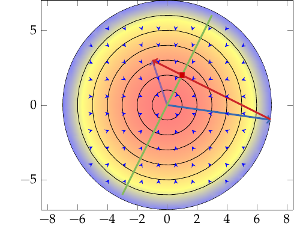

  * [campo_alvo.pgf](https://github.com/walmes/Tikz/blob/master/src/campo_alvo.pgf)

```tex
% http://tex.stackexchange.com/questions/159408/plotting-multivariable-functions-with-dependent-variables-in-domain

\xdefinecolor{lightgrey}{RGB}{220,220,220}
\xdefinecolor{goldenrod}{RGB}{255,223,66}
\xdefinecolor{newblue}{RGB}{57,106,177}
\xdefinecolor{newred}{RGB}{204,37,41}
\xdefinecolor{newgreen}{RGB}{132,186,91}
\xdefinecolor{newpurple}{RGB}{144,103,167}

\begin{tikzpicture}[scale=1.2]
  \begin{axis}[axis equal, view={0}{90}]
    \addplot3[surf, shader=interp, opacity=0.5,
      domain=-7:7, point meta min=1] {(50-x^2-y^2)};
    \addplot [domain=0:2*pi,samples=50]
      ({cos(deg(x))},{sin(deg(x))});
    \addplot [domain=0:2*pi,samples=50]
      ({2*cos(deg(x))},{2*sin(deg(x))});
    \addplot [domain=0:2*pi,samples=50]
      ({3*cos(deg(x))},{3*sin(deg(x))});
    \addplot [domain=0:2*pi,samples=50]
      ({4*cos(deg(x))},{4*sin(deg(x))});
    \addplot [domain=0:2*pi,samples=50]
      ({5*cos(deg(x))},{5*sin(deg(x))});
    \addplot [domain=0:2*pi,samples=50]
      ({6*cos(deg(x))},{6*sin(deg(x))});
    \addplot [domain=0:2*pi,samples=50]
      ({7*cos(deg(x))},{7*sin(deg(x))});
    \addplot [newpurple,double=newpurple,->]
      plot coordinates {
        (0,0)
        (-1,3)
      };
    \addplot [newblue,double=newblue,->]
      plot coordinates {
        (0,0)
        (7,-1)
      };
    \addplot [newred,double=newred,->]
      plot coordinates {
        (7,-1)
        (-1,3)
      };
    \addplot+[newred,double=newred]
      plot coordinates {
        (1,2)
      };
    \addplot [newgreen,double=newgreen]
      plot coordinates {
        (-3,-6)
        (3,6)
      };
    \addplot3 [blue,/pgfplots/quiver,
      quiver/u=-x/50,
      quiver/v=-y/50,
      quiver/scale arrows=0.1,
      -stealth,samples=10] {1};
    \fill [white] (rel axis cs:0,0)
      rectangle (rel axis cs:1,1) (axis cs:0,0) circle [radius=7];         
  \end{axis}
\end{tikzpicture}
```
****

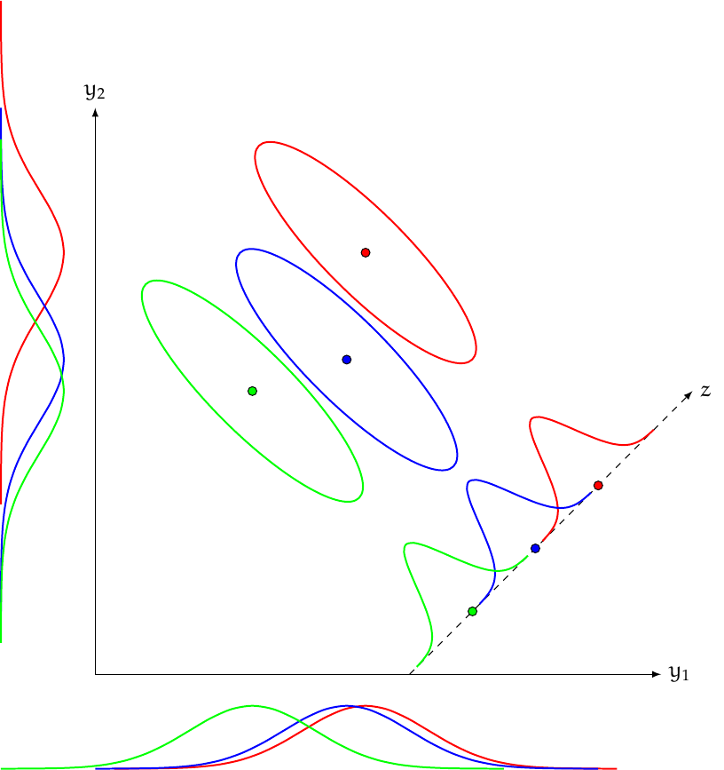

  * [canonical_discriminant.pgf](https://github.com/walmes/Tikz/blob/master/src/canonical_discriminant.pgf)

```tex
\begin{tikzpicture}[>=latex]

\def\ellip{ellipse (2.4cm and 0.65cm)}%

% The x and y-axis.
\draw[->] (0, 0) -- (9, 0) node[right] {$y_1$};
\draw[->] (0, 0) -- (0, 9) node[above] {$y_2$};

% The z-axis.
\draw[->, dashed] (5, 0) 
  coordinate (b_1) -- +(4.5, 4.5) coordinate (b_2) node[right] {$z$};

% Loop over a 3-level factor.
\foreach \x/\y/\col in {4.3/6.7/red, 4.0/5.0/blue, 2.5/4.5/green} {

  % Draw the ellipses.
  \draw [thick, \col, xshift = \x cm, yshift = \y cm, rotate = -45]  \ellip;

  % Projection on x-axis.
  \draw[thick, color = \col, smooth, xshift = \x cm, yshift = -1.5cm]
    plot [id = x, domain = -4:4] function{exp(-(x-0)**2/2)};

  % Projection on y-axis.
  \draw[thick, color = \col, smooth, rotate = 90, xshift = \y cm, yshift = 1.5cm]
    plot [id = x, domain = -4:4] function{-exp(-(x-0)**2/2)};

  \draw [draw = none] (\x, \y) coordinate (a_1) -- +(5, -5) coordinate (a_2);

  % Define the coordinate `c` as the intersection of segments.
  \coordinate (c) at (intersection of a_1--a_2 and b_1--b_2);

  % Draw points.
  \draw[fill = \col] (c) circle (2pt);
  \draw[fill = \col] (\x, \y) circle (2pt);

%   \draw [gray] let \p{c} = (c) in (\x{c}, \y{c}) -- (0, 0);
%   \draw [gray] let \p{c} = (c) in node [anchor=west] at (\x{c}, \y{c}) {\x{c} -- \y{c}};

  % Projection on the first canonical dimension ou z1-axis.
  \draw [draw = \col, thick, smooth] let \p{c} = (c) in 
    plot [id = x,
          domain = -1.25:1.25,
          yshift = \y{c},
          xshift = \x{c},
          rotate = 45] function{1.5*exp(-(x-0)**2/0.25)};

}

\draw[draw = none] (-2, -2) rectangle (10.25, 11.25);

\end{tikzpicture}%
```
****

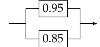

  * [circuito_paralelo.pgf](https://github.com/walmes/Tikz/blob/master/src/circuito_paralelo.pgf)

```tex
\tikzset{
  >=stealth',
  node distance=2mm and 3mm,
  every node/.style={draw},
}

\begin{tikzpicture}
  \coordinate (c0) at (1.5,0);
  \coordinate (x1) at ($(-0.8,0)+(c0)$);
  \coordinate (x0) at ($(-0.5,0)+(x1)$);
  \coordinate (x2) at ($(0.8,0)+(c0)$);
  \coordinate (x3) at ($(0.5,0)+(x2)$);
  \node (r1) [above=of c0] {0.95};
  \draw[->] (x0) -- (x1) |- (r1) -| (x2) -- (x3);
  \node (r2) [below=of c0] {0.85};
  \draw (x1) |- (r2) -| (x2);
\end{tikzpicture}
```
****

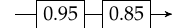

  * [circuito_serie.pgf](https://github.com/walmes/Tikz/blob/master/src/circuito_serie.pgf)

```tex
\tikzset{
  >=stealth',
  node distance=2mm and 3mm,
  every node/.style={draw},
}

\begin{tikzpicture}
  \node (s1) at (0,0) {0.95};
  \node (s2) [right=of s1] {0.85};
  \draw (s1) -- (s2);
  \draw (s1) -- ++(-0.8,0);
  \draw [->] (s2) -- ++(0.8,0);
\end{tikzpicture}
```
****

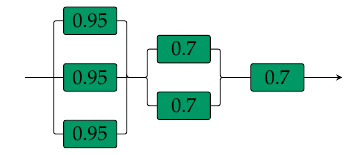

  * [circuitos_mistos1.pgf](https://github.com/walmes/Tikz/blob/master/src/circuitos_mistos1.pgf)

```tex
\def\ABC{0.95}
\def\DEF{0.7}

\tikzset{
  >=stealth,
  terminal/.style={rectangle, minimum size=6mm, draw=black},
  point/.style={coordinate},
  draw=black,
  mtx/.style={
    matrix of nodes,
    column sep=7mm, row sep=0mm,
    nodes={draw, outer sep=5pt, fill=green!60!blue,
      text width=2em, text centered}
  },
  every path/.style={rounded corners=1pt}
}

\begin{tikzpicture}
  \matrix[mtx] (Y) {
    \ABC &      & \\
         & \DEF & \\
    \ABC &      & \DEF \\
         & \DEF & \\
    \ABC &      & \\
  };
  \begin{scope}[on background layer]
    \path[draw] (Y-3-1.east) -- (Y-3-1.west) -- ++(-0.5, 0);
    \path[->, draw]
    (Y-3-1.west)
    |- (Y-1-1.east)
    |- (Y-3-1.east)
    -| (Y-2-2.west) -- (Y-2-2.east)
    |- (Y-3-3.west) -- (Y-3-3.east) -- ++(0.5,0);
    \path[draw]
    (Y-3-1.west)
    |- (Y-5-1.east)
    |- (Y-3-1.east)
    -| (Y-4-2.west) -- (Y-4-2.east)
    |- (Y-3-3.west) -- (Y-3-3.east);
  \end{scope}
\end{tikzpicture} 
```
****

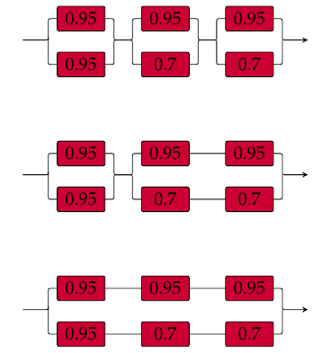

  * [circuitos_mistos2.pgf](https://github.com/walmes/Tikz/blob/master/src/circuitos_mistos2.pgf)

```tex
\def\ABC{0.95}
\def\DEF{0.7}

\tikzset{
  >=stealth,
  draw=black,
  every path/.style={rounded corners=1pt},
  terminal/.style={rectangle, minimum size=6mm, draw=black},
  point/.style={coordinate},
  mtx/.style={
    matrix of nodes,
    column sep=7mm, row sep=4mm,
    nodes={draw, outer sep=5pt, fill=red!80!blue,
      text width=2em, text centered}
  },
}

\begin{tikzpicture}

  \matrix[mtx] (Y) {
    \ABC & \ABC & \ABC \\
    \ABC & \DEF & \DEF \\
  };
  \begin{scope}[on background layer]
    \path[->, draw]
    (Y-1-1.south west)
    |- (Y-1-1.east)
    |- (Y-1-2.south west)
    |- (Y-1-2.east)
    |- (Y-1-3.south west)
    |- (Y-1-3.east)
    |- (Y-1-3.south east) -- ++(0.5,0);
    \path[draw]
    (Y-1-3.south east)
    |- (Y-2-3.west)
    |- (Y-1-2.south east)
    |- (Y-2-2.west)
    |- (Y-1-1.south east)
    |- (Y-2-1.west)
    |- (Y-1-1.south west) -- ++(-0.5,0);
  \end{scope}

  \matrix[mtx, below=of Y] (Z) {
    \ABC & \ABC & \ABC \\
    \ABC & \DEF & \DEF \\
  };
  \begin{scope}[on background layer]
    \path[->, draw]
    (Z-1-1.south west)
    |- (Z-1-1.east)
    |- (Z-1-2.south west)
    |- (Z-1-3.east)
    |- (Z-1-3.south east) -- ++(0.5,0);
    \path[draw]
    (Z-1-3.south east)
    |- (Z-2-2.west)
    |- (Z-1-1.south east)
    |- (Z-2-1.west)
    |- (Z-1-1.south west) -- ++(-0.5,0);
  \end{scope}

  \matrix[mtx, below=of Z] (X) {
    \ABC & \ABC & \ABC \\
    \ABC & \DEF & \DEF \\
  };
  \begin{scope}[on background layer]
    \path[->, draw]
    (X-1-1.south west)
    |- (X-1-3.east)
    |- (X-1-3.south east) -- ++(0.5,0);
    \path[draw]
    (X-1-3.south east)
    |- (X-2-1.west)
    |- (X-1-1.south west) -- ++(-0.5,0);
  \end{scope}

\end{tikzpicture} 
```
****


  * [circulo-trigon.pgf](https://github.com/walmes/Tikz/blob/master/src/circulo-trigon.pgf)

```tex
\begin{tikzpicture}[
  very thick,
  scale = 10,
  every node/.style = {scale = 3},
  >=latex']
\def\lim{1.2}
\draw[->] (-\lim, 0) -- (\lim, 0);
\draw[->] (0, -\lim) -- (0, \lim);
\draw (0, 0) circle (1cm);
\draw (0, 0 ) -- node [above, sloped, pos = 0.5] {$v$} (0.65, 0.45) circle (0.3pt);
\draw[dashed] (0.65, 0.45) -- (0.65, 0) node[below] {$u_1$};
\draw[dashed] (0.65, 0.45) -- (0, 0.45) node[left] {$u_2$};
\draw (0.2, 0) arc (0:35:0.2) node[pos = 0.7, right] {$\theta$};
\end{tikzpicture}
```
****

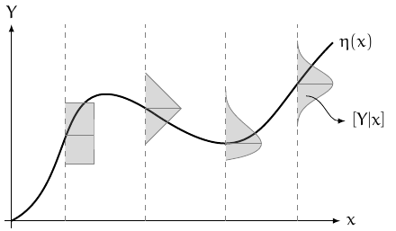

  * [conceito_regressao.pgf](https://github.com/walmes/Tikz/blob/master/src/conceito_regressao.pgf)

```tex
\begin{tikzpicture}[domain=-0.25:9, scale=0.7, >=latex]
  % \draw[very thin,color=gray!30] (-1.1,-1.1) grid (12.1,7.1);
  \draw[->] (-0.2,0) -- (9.2,0) node[right] {$x$};
  \draw[->] (0,-0.2) -- (0,5.5) node[above] {$Y$};

  \begin{scope}[line width=1pt]
    \coordinate (a1) at (0,0);
    \coordinate (a2) at (4,3);
    \coordinate (a3) at (9,5);
    \draw (a1) ..controls (2,1) and (1,5).. (a2);
    \draw (a2) ..controls (7,1) and (7,3).. (a3);
    \node[right] at (a3) {$\eta(x)$};
  \end{scope}

  \begin{scope}[
    color=gray, fill opacity=0.3, fill=gray, smooth, domain=-1:1]

    \def\x{1.5}; \def\y{2.4};
    \filldraw[xshift=\x cm, yshift=\y cm]
      (0,-0.8) -| (0.8,0) |- (0,0.9);
    \draw (\x,\y) -- ++(0.8,0);
    \draw[dashed] (\x,0) -- ++(0,5.5);

    \def\x{3.75}; \def\y{3.15};
    \filldraw[xshift=\x cm, yshift=\y cm]
      (0,-1) -- (1,0) -- (0,1);
    \draw (\x,\y) -- ++(1,0);
    \draw[dashed] (\x,0) -- ++(0,5.5);

    \def\x{6}; \def\y{2.7};
    \filldraw[xshift=\x cm, yshift=\y cm]
      plot[id=x, rotate=-90]
      function{0.55*(1+x)**3*(1-x)**0.9};
    \draw (\x,2.17) -- ++(1,0);
    \draw[dashed] (\x,0) -- ++(0,5.3);

    \def\x{8}; \def\y{3.85};
    \filldraw[xshift=\x cm, yshift=\y cm]
      plot[id=x, rotate=-90, domain=-1.2:1.2]
      function{exp(-(x)**2/0.29)};
    \draw (\x,\y) -- ++(1,0);
    \draw[dashed] (\x,0) -- ++(0,5.5);

  \end{scope}

  \coordinate (a) at (8.25,3.5);
  \node (b) at (10,2.8) {$[Y|x]$};
  \draw (a) edge[out=0, in=180,->] (b);

\end{tikzpicture}
```
****

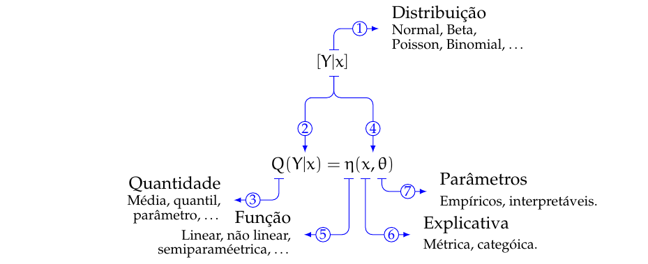

  * [conceitoregressao_modelo.pgf](https://github.com/walmes/Tikz/blob/master/src/conceitoregressao_modelo.pgf)

```tex
\tikzstyle{mybox} = [draw=gray!50, fill=gray!20, very thick, rectangle, inner sep=7pt, inner ysep=7pt]
\tikzstyle{bola} = [circle, draw, near end, fill=white, inner sep=0.5pt, font=\footnotesize]
\tikzstyle{nodedir} = [right, text width=4cm, align=flush left, color=black]
\tikzstyle{nodeesq} = [left, text width=4cm, align=flush right, color=black]

\begin{tikzpicture}[%overlay, 
                    remember picture,
                    scale=0.7, rounded corners=4pt,
                    bla/.style={color=blue, 
                    thin, shorten >=4pt, shorten <=4pt, |-latex}]

\newcommand{\tm}[1]{
  \tikz[remember picture, overlay]
  \node[anchor=south west] (#1) {};} % setas 
\newcommand{\tmc}[2]{
  \tikz[remember picture, overlay]
  \node[xshift=#2 ex, yshift=0.5 ex] (#1) {};} 

\def\hd{1};
\def\vd{1.5};

\node {
\begin{minipage}{10cm}
\begin{eqnarray*}
  [\tmc{Y}{1}Y\tmc{pipe1}{0.3}|\tm{x}x]\\
\end{eqnarray*}

\begin{eqnarray*}
  \tmc{Q}{1}Q(Y\tmc{pipe2}{0.3}|x) =
    \tmc{eta}{0.5}\eta(\tmc{x}{0.5}x \tmc{comma}{0.3}, \tmc{theta}{0.5}\theta)
\end{eqnarray*}
\end{minipage}
};

\draw[bla] (pipe1) |- +(\vd,\hd)
  node[nodedir] {Distribui\c{c}\~ao \\ \footnotesize{Normal, Beta, \\[-1ex] Poisson, Binomial, \ldots}}
  node[bola] {1};

\draw[bla] (pipe1) |- ++(-0.5,-1) -| (pipe2) node[bola] {2};
\draw[bla] (Q) |- +(-\vd,-\hd)
  node[nodeesq] {Quantidade\\ \footnotesize{M\'edia, quantil, \\[-1ex] par\^ametro, \ldots}}
  node[bola] {3};

\draw[bla] (pipe1) |- ++(0.5,-1) -| (comma) node[bola] {4};

\draw[bla] (eta) |- +(-\vd,-\hd-1)
  node[nodeesq] {Fun\c{c}\~ao\\ \footnotesize{Linear, n\~ao linear, \\[-1ex] semiparam\'eetrica, \ldots}}
  node[bola] {5};

\draw[bla] (x) |- +(\vd,-\hd-1)
  node[nodedir] {Explicativa\\ \footnotesize{M\'etrica, categ\'oica.}}
  node[bola] {6};

\draw[bla] (theta) |- +(\vd,-\hd+0.25)
  node[nodedir] {Par\^ametros \\ \footnotesize{Emp\'iricos, interpret\'aveis.}}
  node[bola] {7};

\end{tikzpicture}
```
****

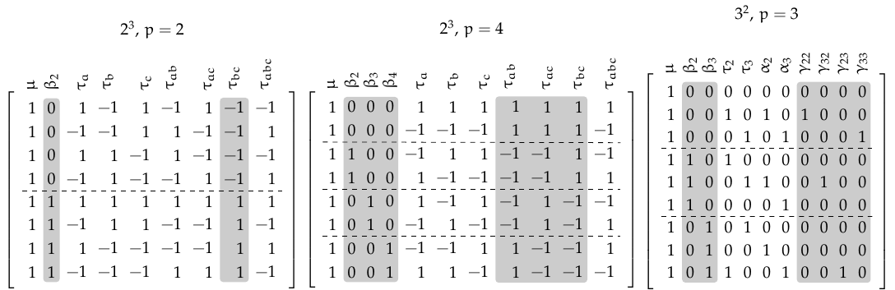

  * [confundimento.pgf](https://github.com/walmes/Tikz/blob/master/src/confundimento.pgf)

```tex
\tikzset{
  mtx/.style={
    matrix of math nodes,
    left delimiter={[}, right delimiter={]}
  },
  hlt/.style={opacity=0.2, line width=4 mm, line cap=round},
  hltr/.style={opacity=0.2, rounded corners=2pt, inner sep=-1pt},
  txt/.style={rotate=90, right}
}

%-----------------------------------------------------------------------
% Experimento fatorial 2^3 em dois blocos, ou 2^{3-1}.

\begin{tikzpicture}

  \matrix (X) at (2,2) [mtx, nodes={anchor=east}] {
    1 & 0 & 1  & -1 & 1  & -1 & 1  & -1 & -1 \\ 
    1 & 0 & -1 & -1 & 1  & 1  & -1 & -1 & 1  \\ 
    1 & 0 & 1  & 1  & -1 & 1  & -1 & -1 & -1 \\ 
    1 & 0 & -1 & 1  & -1 & -1 & 1  & -1 & 1  \\ 
    1 & 1 & 1  & 1  & 1  & 1  & 1  & 1  & 1  \\ 
    1 & 1 & -1 & 1  & 1  & -1 & -1 & 1  & -1 \\ 
    1 & 1 & 1  & -1 & -1 & -1 & -1 & 1  & 1  \\ 
    1 & 1 & -1 & -1 & -1 & 1  & 1  & 1  & -1 \\ 
  };

  %% Efeitos.
  \node[txt] at (X-1-1.north) {$\mu$};
  \node[txt] at (X-1-2.north) {$\beta_2$};
  \node[txt] at (X-1-3.north) {$\tau_a$};
  \node[txt] at (X-1-4.north) {$\tau_b$};
  \node[txt] at (X-1-5.north) {$\tau_c$};
  \node[txt] at (X-1-6.north) {$\tau_{ab}$};
  \node[txt] at (X-1-7.north) {$\tau_{ac}$};
  \node[txt] at (X-1-8.north) {$\tau_{bc}$};
  \node[txt] at (X-1-9.north) {$\tau_{abc}$};

  %% Colunas de efeitos.
  \node[hltr, fill=black, fit=(X-1-2)(X-8-2)] {};
  \node[hltr, fill=black, fit=(X-1-8)(X-8-8)] {};

  %% Divisoes.
  \draw[dashed] (X-4-1.south west) -- (X-4-9.south east);

  %% Descricao.
  \node[above=of X] {$2^3,\, p=2$};

\end{tikzpicture}

%-----------------------------------------------------------------------
% Experimento fatorial 2^3 em dois blocos, ou 2^{3-1}.

\begin{tikzpicture}

  \matrix (X) at (2,2) [mtx, nodes={anchor=east}] {
    1 & 0 & 0 & 0 & 1  & 1  & 1  & \phantom{-}1 & 1  & 1  & 1  \\ 
    1 & 0 & 0 & 0 & -1 & -1 & -1 & 1            & 1  & 1  & -1 \\ 
    1 & 1 & 0 & 0 & -1 & 1  & 1  & -1           & -1 & 1  & -1 \\ 
    1 & 1 & 0 & 0 & 1  & -1 & -1 & -1           & -1 & 1  & 1  \\ 
    1 & 0 & 1 & 0 & 1  & -1 & 1  & -1           & 1  & -1 & -1 \\ 
    1 & 0 & 1 & 0 & -1 & 1  & -1 & -1           & 1  & -1 & 1  \\ 
    1 & 0 & 0 & 1 & -1 & -1 & 1  & 1            & -1 & -1 & 1  \\ 
    1 & 0 & 0 & 1 & 1  & 1  & -1 & 1            & -1 & -1 & -1 \\ 
  };

  %% Colunas de efeitos.
  \node[hltr, fill=black, fit=(X-1-2)(X-8-4)] {};
  \node[hltr, fill=black, fit=(X-1-8)(X-8-10)] {};

  %% Divisoes.
  \draw[dashed] (X-2-1.south west) -- (X-2-11.south east);
  \draw[dashed] (X-4-1.south west) -- (X-4-11.south east);
  \draw[dashed] (X-6-1.south west) -- (X-6-11.south east);

  %% Nomes dos efeitos.
  \node[txt] at (X-1-1.north) {$\mu$};
  \node[txt] at (X-1-2.north) {$\beta_2$};
  \node[txt] at (X-1-3.north) {$\beta_3$};
  \node[txt] at (X-1-4.north) {$\beta_4$};
  \node[txt] at (X-1-5.north) {$\tau_a$};
  \node[txt] at (X-1-6.north) {$\tau_b$};
  \node[txt] at (X-1-7.north) {$\tau_c$};
  \node[txt] at (X-1-8.north) {$\tau_{ab}$};
  \node[txt] at (X-1-9.north) {$\tau_{ac}$};
  \node[txt] at (X-1-10.north) {$\tau_{bc}$};
  \node[txt] at (X-1-11.north) {$\tau_{abc}$};

  %% Descricao.
  \node[above=of X] {$2^3,\, p=4$};

\end{tikzpicture}

%-----------------------------------------------------------------------
% Experimento fatorial 3^2 em tres blocos (confundimento parcial).

\begin{tikzpicture}

  \matrix (X) at (2,2) [mtx, nodes={anchor=east}] {
    1 & 0 & 0 & 0 & 0 & 0 & 0 & 0 & 0 & 0 & 0 \\ 
    1 & 0 & 0 & 1 & 0 & 1 & 0 & 1 & 0 & 0 & 0 \\ 
    1 & 0 & 0 & 0 & 1 & 0 & 1 & 0 & 0 & 0 & 1 \\ 
    1 & 1 & 0 & 1 & 0 & 0 & 0 & 0 & 0 & 0 & 0 \\ 
    1 & 1 & 0 & 0 & 1 & 1 & 0 & 0 & 1 & 0 & 0 \\ 
    1 & 1 & 0 & 0 & 0 & 0 & 1 & 0 & 0 & 0 & 0 \\ 
    1 & 0 & 1 & 0 & 1 & 0 & 0 & 0 & 0 & 0 & 0 \\ 
    1 & 0 & 1 & 0 & 0 & 1 & 0 & 0 & 0 & 0 & 0 \\ 
    1 & 0 & 1 & 1 & 0 & 0 & 1 & 0 & 0 & 1 & 0 \\ 
  };

  %% Colunas de efeitos.
  \node[hltr, fill=black, fit=(X-1-2)(X-9-3)] {};
  \node[hltr, fill=black, fit=(X-1-8)(X-9-11)] {};

  %% Divisoes.
  \draw[dashed] (X-3-1.south west) -- (X-3-11.south east);
  \draw[dashed] (X-6-1.south west) -- (X-6-11.south east);

  %% Nomes dos efeitos.
  \node[txt] at (X-1-1.north) {$\mu$};
  \node[txt] at (X-1-2.north) {$\beta_2$};
  \node[txt] at (X-1-3.north) {$\beta_3$};
  \node[txt] at (X-1-4.north) {$\tau_{2}$};
  \node[txt] at (X-1-5.north) {$\tau_{3}$};
  \node[txt] at (X-1-6.north) {$\alpha_{2}$};
  \node[txt] at (X-1-7.north) {$\alpha_{3}$};
  \node[txt] at (X-1-8.north) {$\gamma_{22}$};
  \node[txt] at (X-1-9.north) {$\gamma_{32}$};
  \node[txt] at (X-1-10.north) {$\gamma_{23}$};
  \node[txt] at (X-1-11.north) {$\gamma_{33}$};

  %% Descricao.
  \node[above=of X] {$3^2,\, p=3$};

\end{tikzpicture}
```
****

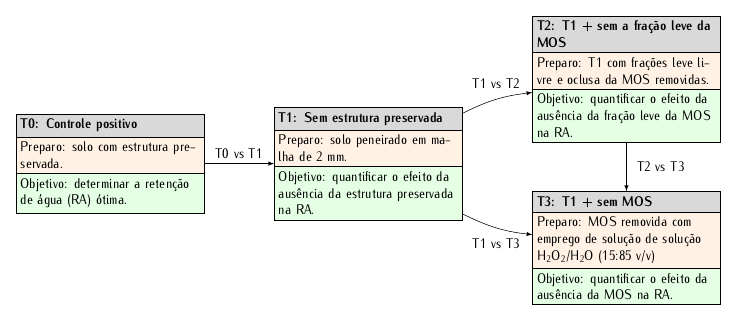

  * [contrastes-planejados.pgf](https://github.com/walmes/Tikz/blob/master/src/contrastes-planejados.pgf)

```tex
\begin{tikzpicture}[%
  box/.style = {
    rectangle split,
    rectangle split parts = 3,
    rectangle split part fill = {
      gray!30,
      orange!10!white,
      green!10!white},
    draw,
    text width = 4.5cm},
  every path/.style = {->, > = latex},
  ]

  \node[box] (t0)
  {\textbf{T0: Controle positivo}
    \nodepart{second}
    Preparo: solo com estrutura preservada.
    \nodepart{third}
    Objetivo: determinar a reten{\c c}{\~a}o de {\'a}gua (RA) {\'o}tima.
  };

  \node[box, right = 5em of t0] (t1)
  {\textbf{T1: Sem estrutura preservada}
    \nodepart{second}
    Preparo: solo peneirado em malha de 2 mm.
    \nodepart{third}
    Objetivo: quantificar o efeito da aus{\^e}ncia da estrutura
    preservada na RA.
  };

  \node[box, above right = 2em and 5em of t1, anchor = 180] (t2)
  {\textbf{T2: T1 + sem a fra{\c c}{\~a}o leve da MOS}
    \nodepart{second}
    Preparo: T1 com fra{\c c}{\~o}es leve livre e oclusa da MOS
    removidas.
    \nodepart{third}
    Objetivo: quantificar o efeito da aus{\^e}ncia da fra{\c c}{\~a}o
    leve da MOS na RA.
  };

  \node[box, below right = 2em and 5em of t1, anchor = 180] (t3)
  {\textbf{T3: T1 + sem MOS}
    \nodepart{second}
    Preparo: MOS removida com emprego de solu{\c c}{\~a}o de
    solu{\c c}{\~a}o H$_2$O$_2$/H$_2$O (15:85 v/v)
    \nodepart{third}
    Objetivo: quantificar o efeito da aus{\^e}ncia da MOS na RA.
  };

  \path (t0) edge node[above] {T0 vs T1} (t1);
  \path (t1) edge[bend left = 10] node[above = 1ex] {T1 vs T2} (t2);
  \path (t1) edge[bend right = 10] node[below = 1ex] {T1 vs T3} (t3);
  \path (t2) edge node[right = 1ex] {T2 vs T3} (t3);

\end{tikzpicture}%
```
****

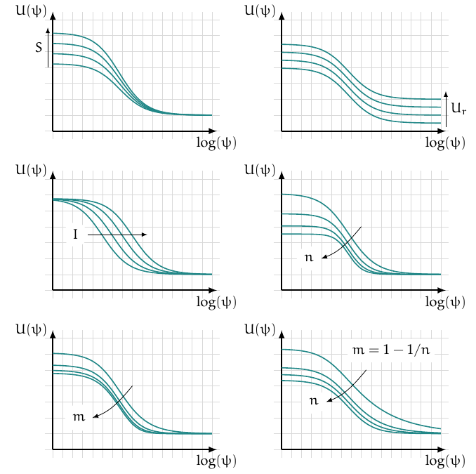

  * [cra_parametros_SI.pgf](https://github.com/walmes/Tikz/blob/master/src/cra_parametros_SI.pgf)

```tex
\def\f1{0.8}
\def\xs{0.5}
\def\ys{4}

\begin{tikzpicture}[domain=-3:5, xscale=\xs, yscale=\ys, >=latex]
  \def\tr{0.1}
  \def\ts{0.6}
  \def\al{1.3}
  \def\n{1.6}
  \def\m{0.9}
  \def\I{0.3506}
  \def\ti{0.4071}
  \def\S{-0.1340}
  \def\Sangle{-42}

  \draw[very thin,color=gray!30] (-3-0.2/\xs,0-0.2/\ys)
    grid[xstep=0.5, ystep=0.1] (5+0.2/\xs,0.7+0.2/\ys);
  % \node at (6,1) {van Genuchten reparametrizado para $S$ e $I$};
  \draw[->, line width=1pt] (-3,0) -- (5.25,0)
    node[below] {$\log(\psi)$};
  \draw[->, line width=1pt] (-3,0) -- (-3,0.75)
    node[left] {$U(\psi)$};
  \foreach \SS in {-0.125,-0.15,-0.175,-0.2}
  \draw[color=darkgreen, thick, smooth] plot[id=x, domain=-3:5]
    function{\tr-\SS*(1+1/\m)**(\m+1)/(\n*(1+exp(\n*(x-\I))/\m)**\m)};
  \draw[->,xshift=-3.25cm] (0,0.4) -- (0,0.65) node[midway,left] {$S$};

  \begin{scope}[xshift=11.5cm]
    \draw[very thin,color=gray!30] (-3-0.2/\xs,0-0.2/\ys)
      grid[xstep=0.5, ystep=0.1] (5+0.2/\xs,0.7+0.2/\ys);
    \draw[->, line width=1pt] (-3,0) -- (5.25,0)
      node[below] {$\log(\psi)$};
    \draw[->, line width=1pt] (-3,0) -- (-3,0.75)
      node[left] {$U(\psi)$};
    \foreach \ttr in {0.05,0.1,0.15,0.2}
    \draw[color=darkgreen, thick, smooth] plot[id=x, domain=-3:5]
      function{\ttr-\S*(1+1/\m)**(\m+1)/(\n*(1+exp(\n*(x-\I))/\m)**\m)};
    \draw[->,xshift=5.25cm] (0,0.025) -- (0,0.25)
      node[midway,right] {$U_r$};
  \end{scope}

  \begin{scope}[xshift=0cm, yshift=-1cm]
    \draw[very thin,color=gray!30] (-3-0.2/\xs,0-0.2/\ys)
      grid[xstep=0.5, ystep=0.1] (5+0.2/\xs,0.7+0.2/\ys);
    \draw[->, line width=1pt] (-3,0) -- (5.25,0)
      node[below] {$\log(\psi)$};
    \draw[->, line width=1pt] (-3,0) -- (-3,0.75)
      node[left] {$U(\psi)$};
    \foreach \II in {-0.5,0,0.5,1}
    \draw[color=darkgreen, thick, smooth] plot[id=x, domain=-3:5]
      function{\tr-(\S-0.05)*(1+1/\m)**(\m+1)/
        (\n*(1+exp(\n*(x-\II))/\m)**\m)};
    \draw[<-] (1.75,0.35) -- ++(-3,0)
      node[left,circle,fill=white] {$I$};
  \end{scope}

  \begin{scope}[xshift=11.5cm, yshift=-1cm]
    \draw[very thin,color=gray!30] (-3-0.2/\xs,0-0.2/\ys)
      grid[xstep=0.5, ystep=0.1] (5+0.2/\xs,0.7+0.2/\ys);
    \draw[->, line width=1pt] (-3,0) -- (5.25,0)
      node[below] {$\log(\psi)$};
    \draw[->, line width=1pt] (-3,0) -- (-3,0.75)
      node[left] {$U(\psi)$};
    \foreach \nn in {1.5,2,2.5,3}
    \draw[color=darkgreen, thick, smooth] plot[id=x, domain=-3:5]
      function{\tr-(\S-0.05)*(1+1/\m)**(\m+1)/
        (\nn*(1+exp(\nn*(x-\I))/\m)**\m)};
    \path[->] (1,0.4) edge[bend left=3]
      node[at end, left,circle,fill=white] {$n$} (-1,0.2);
  \end{scope}

  \begin{scope}[xshift=0cm, yshift=-2cm]
    \draw[very thin,color=gray!30] (-3-0.2/\xs,0-0.2/\ys)
      grid[xstep=0.5, ystep=0.1] (5+0.2/\xs,0.7+0.2/\ys);
    \draw[->, line width=1pt] (-3,0) -- (5.25,0)
      node[below] {$\log(\psi)$};
    \draw[->, line width=1pt] (-3,0) -- (-3,0.75)
      node[left] {$U(\psi)$};
    \foreach \mm in {0.75,1.25,1.75,2.25}
    \draw[color=darkgreen, thick, smooth] plot[id=x, domain=-3:5]
      function{\tr-(\S-0.05)*(1+1/\mm)**(\mm+1)/
        (\n*(1+exp(\n*(x-\I))/\mm)**\mm)};
    \path[->] (1,0.4) edge[bend left=3]
      node[at end, left,circle,fill=white] {$m$} (-1,0.2);
  \end{scope}

  \begin{scope}[xshift=11.5cm, yshift=-2cm]
    \draw[very thin,color=gray!30] (-3-0.2/\xs,0-0.2/\ys)
      grid[xstep=0.5, ystep=0.1] (5+0.2/\xs,0.7+0.2/\ys);
    \draw[->, line width=1pt] (-3,0) -- (5.25,0)
      node[below] {$\log(\psi)$};
    \draw[->, line width=1pt] (-3,0) -- (-3,0.75)
      node[left] {$U(\psi)$};
    \foreach \nn in {1.5,2.25,3,3.75}
    \draw[color=darkgreen, thick, smooth] plot[id=x, domain=-3:5]
      function{\tr-\S*(1+1/(1-1/\nn))**(2-1/\nn)/
        (\n*(1+exp(\n*(x-\I))/(1-1/\nn))**(1-1/\nn))};
    \path[->] (1.25,0.5) edge[bend left=3]
      node[at end, left,circle,fill=white] {$n$} ++(-2,-0.2);
    \node[anchor=base,rectangle,fill=white] (i) at (2.5,0.6)
      {$m=1-1/n$};
  \end{scope}

\end{tikzpicture}
```
****

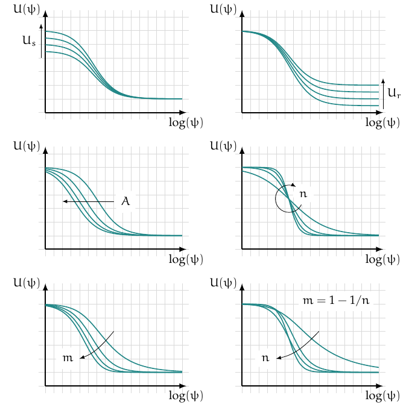

  * [cra_parametros.pgf](https://github.com/walmes/Tikz/blob/master/src/cra_parametros.pgf)

```tex
\def\f1{0.8}
\def\xs{0.5}
\def\ys{4}

\begin{tikzpicture}[domain=-3:5, xscale=\xs, yscale=\ys, >=latex]
  \def\tr{0.1}
  \def\ts{0.6}
  \def\al{1.3}
  \def\n{1.6}
  \def\m{0.9}
  \def\I{0.3506}
  \def\ti{0.4071}
  \def\S{-0.1340}
  \def\Sangle{-42}

  \draw[very thin,color=gray!30] (-3-0.2/\xs,0-0.2/\ys)
    grid[xstep=0.5, ystep=0.1] (5+0.2/\xs,0.7+0.2/\ys);
  % \node at (6,1) {van Genuchten original};
  \draw[->, line width=1pt] (-3,0) -- (5.25,0)
    node[below] {$\log(\psi)$};
  \draw[->, line width=1pt] (-3,0) -- (-3,0.75)
    node[left] {$U(\psi)$};
  \foreach \tts in {0.45,0.5,0.55,0.6}
  \draw[color=darkgreen, thick, smooth] plot[id=x, domain=-3:5]
    function{\tr+(\tts-\tr)/(1+(\al*exp(x))**\n)**(\m)};
  \draw[->,xshift=-3.25cm] (0,0.4) -- (0,0.65)
    node[midway,left] {$U_s$};

  \begin{scope}[xshift=11.5cm]
    \draw[very thin,color=gray!30] (-3-0.2/\xs,0-0.2/\ys)
      grid[xstep=0.5, ystep=0.1] (5+0.2/\xs,0.7+0.2/\ys);
    \draw[->, line width=1pt] (-3,0) -- (5.25,0)
      node[below] {$\log(\psi)$};
    \draw[->, line width=1pt] (-3,0) -- (-3,0.75)
      node[left] {$U(\psi)$};
    \foreach \ttr in {0.05,0.1,0.15,0.2}
    \draw[color=darkgreen, thick, smooth] plot[id=x, domain=-3:5]
      function{\ttr+(\ts-\ttr)/(1+(\al*exp(x))**\n)**(\m)};
    \draw[->,xshift=5.25cm] (0,0.025) -- (0,0.25)
      node[midway,right] {$U_r$};
  \end{scope}

  \begin{scope}[xshift=0cm, yshift=-1cm]
    \draw[very thin,color=gray!30] (-3-0.2/\xs,0-0.2/\ys)
      grid[xstep=0.5, ystep=0.1] (5+0.2/\xs,0.7+0.2/\ys);
    \draw[->, line width=1pt] (-3,0) -- (5.25,0)
      node[below] {$\log(\psi)$};
    \draw[->, line width=1pt] (-3,0) -- (-3,0.75)
      node[left] {$U(\psi)$};
    \foreach \all in {1,2,3,4}
    \draw[color=darkgreen, thick, smooth] plot[id=x, domain=-3:5]
      function{\tr+(\ts-\tr)/(1+(\all*exp(x))**\n)**(\m)};
    \draw[->] (1,0.35) node[right,circle,fill=white] {$A$} -- ++(-3,0);
  \end{scope}

  \begin{scope}[xshift=11.5cm, yshift=-1cm]
    \draw[very thin,color=gray!30] (-3-0.2/\xs,0-0.2/\ys)
      grid[xstep=0.5, ystep=0.1] (5+0.2/\xs,0.7+0.2/\ys);
    \draw[->, line width=1pt] (-3,0) -- (5.25,0)
      node[below] {$\log(\psi)$};
    \draw[->, line width=1pt] (-3,0) -- (-3,0.75)
      node[left] {$U(\psi)$};
    \foreach \nn in {1,2,3,4}
    \draw[color=darkgreen, thick, smooth] plot[id=x, domain=-3:5]
    function{\tr+(\ts-\tr)/(1+(\al*exp(x))**\nn)**(\m)};
    \draw[->] (-0.45,0.37)++(1,0) arc (0:-300:0.8 and 0.1)
      node[below right,circle,fill=white] {$n$};
  \end{scope}

  \begin{scope}[xshift=0cm, yshift=-2cm]
    \draw[very thin,color=gray!30] (-3-0.2/\xs,0-0.2/\ys)
      grid[xstep=0.5, ystep=0.1] (5+0.2/\xs,0.7+0.2/\ys);
    \draw[->, line width=1pt] (-3,0) -- (5.25,0)
      node[below] {$\log(\psi)$};
    \draw[->, line width=1pt] (-3,0) -- (-3,0.75)
      node[left] {$U(\psi)$};
    \foreach \mm in {0.5,1,1.5,2}
    \draw[color=darkgreen, thick, smooth] plot[id=x, domain=-3:5]
      function{\tr+(\ts-\tr)/(1+(\al*exp(x))**\n)**(\mm)};
    \path[->] (1,0.4) edge[bend left=3]
      node[at end, left,circle,fill=white] {$m$} (-1,0.2);
  \end{scope}

  \begin{scope}[xshift=11.5cm, yshift=-2cm]
    \draw[very thin,color=gray!30] (-3-0.2/\xs,0-0.2/\ys)
      grid[xstep=0.5, ystep=0.1] (5+0.2/\xs,0.7+0.2/\ys);
    \draw[->, line width=1pt] (-3,0) -- (5.25,0)
      node[below] {$\log(\psi)$};
    \draw[->, line width=1pt] (-3,0) -- (-3,0.75)
      node[left] {$U(\psi)$};
    \foreach \nn in {1.5,2,2.5,3}
    \draw[color=darkgreen, thick, smooth] plot[id=x, domain=-3:5]
      function{\tr+(\ts-\tr)/(1+(\al*exp(x))**\nn)**(1-1/\nn)};
    \path[->] (1.5,0.4) edge[bend left=3]
      node[at end, left,circle,fill=white] {$n$} (-1,0.2);
    \node[anchor=base,rectangle,fill=white] (i) at (2.5,0.6)
      {$m=1-1/n$};
  \end{scope}

\end{tikzpicture}
```
****

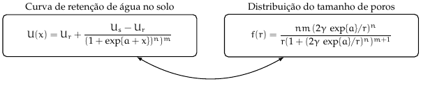

  * [cra-distporos.pgf](https://github.com/walmes/Tikz/blob/master/src/cra-distporos.pgf)

```tex
\tikzset{state/.style={
    rectangle, rounded corners, draw=black, thick, minimum height=2em,
    minimum width=7cm, inner sep=10pt, text centered,
  },
}

\begin{tikzpicture}[->, >=latex, line width=0.75pt]
  \node[state] (cra) {
    $U(x) = U_r+\displaystyle\frac{U_s-U_r}{(1+\exp\{a+x\})^n)^m}$\\
  };
  \node[above of=cra] {Curva de reten\c{c}\~{a}o de \'{a}gua no solo};
  \node[state, right of=cra, node distance=8cm]
  (dist) {
    $f(r) = \displaystyle\frac{nm\, (2\gamma\,\exp\{a\}/r)^n}{
      r(1+(2\gamma\,\exp\{a\}/r)^n)^{m+1}}$\\
  };
  \node[above of=dist] {Distribui\c{c}\~{a}o do tamanho de poros};
  \path (cra) edge[<->, bend right=30] node[below] {} (dist);
\end{tikzpicture}
```
****

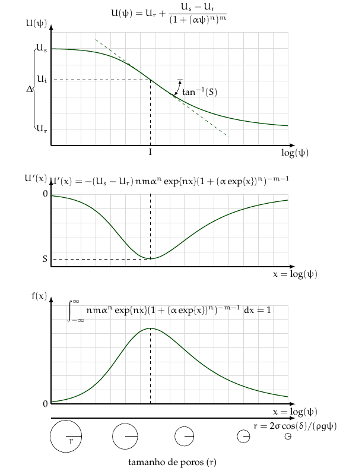

  * [cra-vg-derivadas.pgf](https://github.com/walmes/Tikz/blob/master/src/cra-vg-derivadas.pgf)

```tex
% http://www.texample.net/tikz/examples/free-body-diagrams/

\def\tr{0.1}
\def\ts{0.6}
\def\al{1.3}
\def\n{1.6}
\def\I{0.3506} % -log(al)+log(m)/n = -log(al)+log(1-1/n)/n
\def\ti{0.4071}
\def\S{-0.1340}
\def\Sangle{-42}
\def\f1{0.8}

\begin{tikzpicture}[domain=-3:5, xscale=1.1, yscale=6, >=latex]
  \draw[very thin,color=gray!30] (-3,0)
    grid[xstep=0.5, ystep=0.1] (5,0.7);
  \draw[->, line width=1pt] (-3,0) -- (5.25,0)
    node[below] {$\log(\psi)$};
  \draw[->, line width=1pt] (-3,0) -- (-3,0.75)
    node[left] {$U(\psi)$};
  \draw[color=green!30!black, thick, smooth]
    plot[id=x, domain=-3:5]
    function{\tr+(\ts-\tr)/(1+(\al*exp(x))**\n)**(1-1/\n)};
  \node[left] (tr) at (-3,\tr) {$U_r$};
  \node[left] (ts) at (-3,\ts) {$U_s$};
  \draw[dashed] (\I,0) node[below] {$I$} -- (\I,\ti) -- (-3,\ti)
    node[left] {$U_i$};
  \draw[color=green!30!black, dashed]
    plot[id=x, domain=-1.5:3]
    function{\ti+\S*(x-\I)};
  \draw [decorate,decoration={brace,amplitude=4pt}]
    (-3.5,\tr) -- (-3.5,\ts) node [black,midway,left] {$\Delta$};
  \draw[|<->|] (\I,\ti)++(1,0) arc (0:\Sangle:0.8 and 0.15);
  \path (\I,\ti)++(0.5*1.5\Sangle/8:1)
    node[right=-1pt] {$\tan^{-1}(S)$};
  \node[anchor=base] (vg) at (1,0.8)
    {$U(\psi) = U_r+\displaystyle\frac{U_s-U_r}{(1+(\alpha\psi)^n)^m}$};

  \begin{scope}[yshift=-0.3cm,domain=-3:5, >=latex, yscale=3]
    \draw[very thin,color=gray!30] (-3,-0.15)
      grid[xstep=0.5, ystep=0.03] (5,0);
    \draw[->, line width=1pt] (-3,-0.15) -- (5.25,-0.15)
      node[below] {$x=\log(\psi)$};
    \draw[->, line width=1pt] (-3,-0.15) -- (-3,0.03)
      node[left] {$U'(x)$};
    \draw[color=green!30!black, thick, smooth]
      plot[id=x, domain=-3:5]
      function{-(\ts-\tr)*\n*(1-1/\n)*\al**\n*exp(\n*x)*
        (1+(\al*exp(x))**\n)**(-1+1/\n-1)} node[right] {};
    \node[left] (z) at (-3,0) {$0$};
    \draw[dashed] (\I,0) -- (\I,\S) -- (-3,\S) node[left] {$S$};
    \node[anchor=base] (dvg) at (1,0.02)
      {$U'(x) = -(U_s-U_r) \,n m\alpha^n
        \exp\{nx\}(1+(\alpha\exp\{x\})^n)^{-m-1}$};
  \end{scope}

  \begin{scope}[yshift=-1.6cm,domain=-3:5, >=latex, yscale=1.75]
    \draw[very thin,color=gray!30] (-3,0)
      grid[xstep=0.5, ystep=0.05] (5,0.35);
    \draw[->, line width=1pt] (-3,0) -- (5.25,0)
      node[below] {$x=\log(\psi)$};
    \draw[->, line width=1pt] (-3,-0.05) -- (5.25,-0.05)
      node[below] {$r=2\sigma\cos(\delta)/(\rho g \psi)$};
    \draw[->, line width=1pt] (-3,0) -- (-3,0.38) node[left] {$f(x)$};
    \draw[color=green!30!black, thick, smooth]
      plot[id=x, domain=-3:5]
      function{\n*(1-1/\n)*\al**\n*exp(\n*x)*
        (1+(\al*exp(x))**\n)**(-1+1/\n-1)};
    \node[left] (z) at (-3,0) {$0$};
    \node[anchor=base] (inte) at (1,0.32)
      {$\displaystyle\int_{-\infty}^{\infty} nm\alpha^n
        \exp\{nx\}(1+(\alpha\exp\{x\})^n)^{-m-1}\,\, dx=1$};
    \draw[dashed] (\I,0) -- (\I,-2*\S);
  \end{scope}

  \begin{scope}[yshift=-1.8cm, xshift=-0.5cm, xscale=8, yscale=1.5]
    \foreach \r/\x in {10/-2, 8/0, 6/2, 4/4, 2/5.5} {
      \draw (\x/8,0) circle (\r/150);
      \draw (\x/8,0) -- ++(\r/150,0);
    }
    \node[below right] (r) at (-2/8,0) {$r$};
    \node[anchor=base] (d) at (0.2,-0.12) {tamanho de poros ($r$)};
  \end{scope}
\end{tikzpicture}
```
****

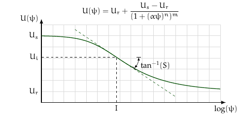

  * [cra-vg.pgf](https://github.com/walmes/Tikz/blob/master/src/cra-vg.pgf)

```tex
\def\tr{0.1}
\def\ts{0.6}
\def\al{1.3}
\def\n{1.6}
\def\I{0.3506}
\def\ti{0.4071}
\def\S{-0.1340}
\def\Sangle{-42}
\def\f1{0.8}

\begin{tikzpicture}[domain=-3:5, xscale=1, yscale=5, >=latex]
  \draw[very thin,color=gray!30] (-3,0)
    grid[xstep=0.5, ystep=0.1] (5,0.7);
  \draw[->, line width=1pt] (-3,0) -- (5.25,0)
    node[below] {$\log(\psi)$};
  \draw[->, line width=1pt] (-3,0) -- (-3,0.75)
    node[left] {$U(\psi)$};
  \draw[color=green!30!black, thick, smooth]
    plot[id=x, domain=-3:5]
    function{\tr+(\ts-\tr)/(1+(\al*exp(x))**\n)**(1-1/\n)};
  \node[left] (tr) at (-3,\tr) {$U_r$};
  \node[left] (ts) at (-3,\ts) {$U_s$};
  \draw[dashed] (\I,0) node[below] {$I$} -- (\I,\ti) -- (-3,\ti)
    node[left] {$U_i$};
  \draw[color=green!30!black, dashed]
    plot[id=x, domain=-1.5:3]
    function{\ti+\S*(x-\I)};
  \draw[|<->|] (\I,\ti)++(1,0) arc (0:\Sangle:0.8 and 0.15);
  \path (\I,\ti)++(0.5*1.5\Sangle/8:1)
    node[right=-1pt] {$\tan^{-1}(S)$};
  \node[anchor=base] (vg) at (1,0.8)
    {$U(\psi) = U_r+\displaystyle\frac{U_s-U_r}{(1+(\alpha\psi)^n)^m}$};
\end{tikzpicture}
```
****

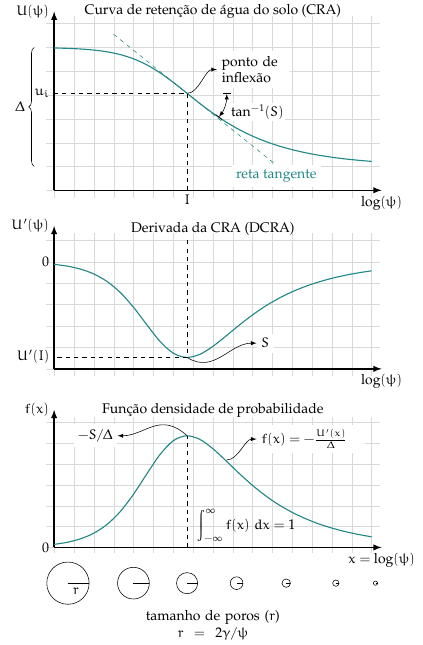

  * [cra.pgf](https://github.com/walmes/Tikz/blob/master/src/cra.pgf)

```tex
\def\xs{1}
\def\ys{6}

\begin{tikzpicture}[domain=-3:5, xscale=\xs, yscale=\ys, >=latex]
  % definicoes dos valores dos parametros e outras quantidades
  \def\tr{0.1}
  \def\ts{0.6}
  \def\al{1.3}
  \def\n{1.6}
  \def\I{0.3506}
  \def\ti{0.4071}
  \def\S{-0.1340}
  \def\Sangle{-42}
  \def\f1{0.8}

  % CRA
  % grid e eixos
  \draw[very thin,color=gray!30] (-3-0.2/\xs,0-0.2/\ys)
    grid[xstep=0.5, ystep=0.1] (5+0.2/\xs,0.7+0.2/\ys);
  \draw[->, line width=1pt] (-3,0) -- (5.25,0)
    node[below] {$\log(\psi)$};
  \draw[->, line width=1pt] (-3,0) -- (-3,0.75)
    node[left] {$U(\psi)$};
  % funcao
  \draw[color=darkgreen, thick, smooth] plot[id=x, domain=-3:5]
    function{\tr+(\ts-\tr)/(1+(\al*exp(x))**\n)**(1-1/\n)};
  % textos e chave
  \draw[dashed] (\I,0) node[below] {$I$} -- (\I,\ti) -- (-3,\ti)
    node[left] {$u_i$};
  \draw [decorate, decoration={brace, amplitude=4pt}]
    (-3.5,\tr) -- (-3.5,\ts) node [black,midway,left=3pt] {$\Delta$};
  % texto
  \path[->, draw]
    (\I,\ti) to[out=0, in=180] ++(0.75,0.1)
    node[anchor=west, text ragged, text width=1.6cm, fill=white]
    {ponto de inflex\~ao};
  \node[above] at (1,0.7)
    {Curva de reten\c{c}\~ao de {\'a}gua do solo (CRA)};

  % parametro S
  \draw[color=darkgreen, dashed] plot[id=x, domain=-1.5:2.6]
    function{\ti+\S*(x-\I)} node[below, fill=white] {reta tangente};
  \draw[|<->|] (\I,\ti)++(1,0) arc (0:\Sangle:0.8 and 0.15);
  \path (\I,\ti)++(0.5*1.5\Sangle/8:1)
    node[right=2pt, fill=white, inner sep=1pt] {$\tan^{-1}(S)$};

  % DRCA
  \def\ys{3}
  \begin{scope}[yshift=-0.3cm, domain=-3:5, >=latex, yscale=\ys]
    \draw[very thin,color=gray!30] (-3-0.2/\xs,-0.15-0.15*0.2/\ys)
      grid[xstep=0.5, ystep=0.03] (5+0.2/\xs,0.03+0.15*0.2/\ys);
    \draw[->, line width=1pt] (-3,-0.15) -- (5.25,-0.15)
      node[below] {$\log(\psi)$};
    \draw[->, line width=1pt] (-3,-0.15) -- (-3,0.05)
      node[left] {$U'(\psi)$};
    \draw[color=darkgreen, thick, smooth] plot[id=x, domain=-3:5]
      function{-(\ts-\tr)*\n*(1-1/\n)*\al**\n*exp(\n*x)*
        (1+(\al*exp(x))**\n)**(-1+1/\n-1)};
    \node[left] at (-3,0) {$0$};
    \draw[dashed] (\I,0.03) -- (\I,\S) -- (-3,\S) node[left] {$U'(I)$};
    \path[->, draw]
      (\I,\S) to[out=-2, in=180] ++(1.75,0.02)
      node[anchor=west, fill=white] {$S$};
    \node[above] at (1,0.03) {Derivada da CRA (DCRA)};
  \end{scope}

  % funcao densidade 
  \def\ys{1.75}
  \begin{scope}[yshift=-1.5cm,domain=-3:5, >=latex, yscale=\ys]
    \draw[very thin,color=gray!30] (-3-0.2/\xs,0-0.025/\ys)
      grid[xstep=0.5, ystep=0.05] (5+0.2/\xs,0.3+0.025/\ys);
    \draw[->, line width=1pt] (-3,0) -- (5.25,0)
      node[below] {$x=\log(\psi)$};
    \draw[->, line width=1pt] (-3,0) -- (-3,0.33) node[left] {$f(x)$};
    \draw[color=darkgreen, thick, smooth] plot[id=x, domain=-3:5]
      function{\n*(1-1/\n)*\al**\n*exp(\n*x)*
        (1+(\al*exp(x))**\n)**(-1+1/\n-1)};
    \node[left] at (-3,0) {$0$};
    \node[above] at (1,0.3) {Fun\c{c}\~ao densidade de probabilidade};
    \draw[dashed] (\I,0) -- (\I,-2*\S);
    \path[->, draw]
      (\I+1,0.21) to[out=0, in=180] ++(0.75,0.05)
      node[anchor=west, text ragged, text width=2.5cm, fill=white]
      {$f(x) = -\frac{U'(x)}{\Delta}$};
    \path[->, draw]
      (\I,-\S*2) to[out=175, in=0] ++(-1.75,0)
      node[anchor=east, fill=white] {$-S/\Delta$};
    \node[above] at (\I+1.5, 0)
      {$\displaystyle\int_{-\infty}^{\infty} f(x)\,\, dx=1$};
  \end{scope}

  % raios
  \begin{scope}[yshift=-1.65cm, xscale=8, yscale=1.33]
    \node[below right] at (\I-2.75cm/8,0) {$r$};
    \node[below, text centered, text width=12em] at (1/8,-0.07)
    {tamanho de poros ($r$)\\ $r = 2\gamma/\psi$};
    \foreach \r/\x in {
      10/\I-2.75cm, 7.5/\I-1.1cm, 5/\I, 3/\I+1.5cm,
      2/\I+2.75cm, 1.5/\I+4cm, 1/\I+5cm}{
      \draw (\x/8,0) circle (\r/150);
      \draw (\x/8,0) -- ++(\r/150,0);
    }
  \end{scope}
\end{tikzpicture}
```
****

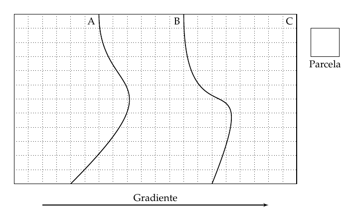

  * [croqui-campo.pgf](https://github.com/walmes/Tikz/blob/master/src/croqui-campo.pgf)

```tex
\begin{tikzpicture}

\draw[draw, step = 0.5, dotted] (0, 0) grid (10, 6);
\draw [thick] (0, 0) rectangle (10, 6) node [below left] {C};
\draw [thick] (7, 0) .. controls +(2, 5) and +(0, -5) .. (6, 6) node [below left] {B};
\draw [thick] (2, 0) .. controls +(4, 4) and +(0, -3) .. (3, 6) node [below left] {A};
\node [draw, rectangle, minimum width = 1cm, minimum height = 1cm] (parc) at (11, 5) {};
\node [below] at (parc.south) {Parcela};
\draw [thick, ->, >=latex'] (1, -0.75) -- node [above] {Gradiente} +(8, 0);

\draw[draw = none] (-0.5, -1) rectangle (12, 6.5);

\end{tikzpicture}
```
****

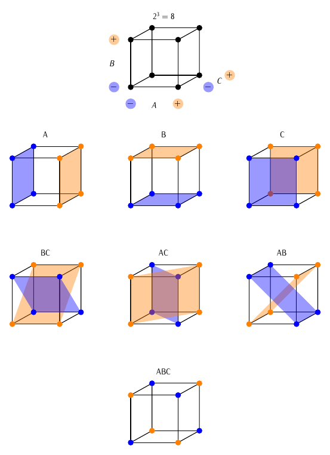

  * [cubos_fatoriais_efeitos.pgf](https://github.com/walmes/Tikz/blob/master/src/cubos_fatoriais_efeitos.pgf)

```tex
\begin{tikzpicture}[%
  scale = 2,
  ->,
  thick,
  z = {(0.45, 0.25)},
  node distance = 2em,
  vertex/.style = {circle, minimum size = 5pt, inner sep = 0pt,
    draw = black, fill = black},
  axial/.style = {rectangle, minimum size = 20pt,
    inner sep = 0pt, fill = gray!30},
  edge/.style = {draw, thick, -, black},
  rotu/.style = {midway},
  sinal/.style = {inner sep = 1pt, thin, opacity = 0.4,
    fill = blue, circle, text opacity = 1},
  pointminus/.style = {draw = blue, fill = blue},
  pointplus/.style = {draw = orange, fill = orange},
  faceminus/.style = {blue, opacity = 0.4},
  faceplus/.style = {orange, opacity = 0.4}
  ]

  \def\dist{0.1}
  \def\cube{
    % Vertices.
    \coordinate (v0) at (0, 0, 0);
    \coordinate (v1) at (0, 1, 0);
    \coordinate (v2) at (1, 0, 0);
    \coordinate (v3) at (1, 1, 0);
    \coordinate (v4) at (0, 0, 1);
    \coordinate (v5) at (0, 1, 1);
    \coordinate (v6) at (1, 0, 1);
    \coordinate (v7) at (1, 1, 1);

    % Edges.
    \draw[edge] (v0) -- (v1) -- (v3) -- (v2) -- (v0);
    \draw[edge] (v0) -- (v4) -- (v5) -- (v1);
    \draw[edge] (v2) -- (v6) -- (v7) -- (v3);
    \draw[edge] (v4) -- (v6);
    \draw[edge] (v5) -- (v7);
  } % \cube

  % A effect.
  \begin{scope}[]
    \cube{};
    \foreach \i in {0,...,7}{ \draw[fill= black] (v\i) circle (1.5pt); }
    \node at (0.25, 1.25, 1) {$2^3 = 8$};

    % Axis text.
    \path (v0) -- node[midway, below=1.5em] {$A$} (v2);
    \path (v0) -- node[midway, left=1.5em] {$B$} (v1);
    \path (v2) -- node[midway, right=3em] {$C$} (v6);

    % Axis text.
    \node[below of=v0, sinal, fill = blue] {$-$};
    \node[below of=v2, sinal, fill = orange] {$+$};
    \node[left of=v0, sinal, fill = blue] {$-$};
    \node[left of=v1, sinal, fill = orange] {$+$};
    \node[right = 3em of v2, sinal, fill = blue] {$-$};
    \node[right = 3em of v6, sinal, fill = orange] {$+$};
  \end{scope}

  % A effect.
  \begin{scope}[xshift = -2.5cm, yshift = -2.5cm]
    \cube{};
    \fill[faceminus]
    (v0.center) -- (v1.center) -- (v5.center) -- (v4.center) -- cycle;
    \foreach \i in {0, 1, 5, 4}{
      \draw[pointminus] (v\i) circle (1.5pt); }
    \fill[faceplus]
    (v2.center) -- (v3.center) -- (v7.center) -- (v6.center) -- cycle;
    \foreach \i in {2, 3, 7, 6}{
      \draw[pointplus] (v\i) circle (1.5pt); }
    \node at (0.25, 1.25, 1) {A};
  \end{scope}

  % B effect.
  \begin{scope}[xshift = 0.0cm, yshift = -2.5cm]
    \cube{};
    \fill[faceminus]
    (v0.center) -- (v4.center) -- (v6.center) -- (v2.center) -- cycle;
    \foreach \i in {0, 4, 6, 2}{
      \draw[pointminus] (v\i) circle (1.5pt); }
    \fill[faceplus]
    (v1.center) -- (v5.center) -- (v7.center) -- (v3.center) -- cycle;
    \foreach \i in {1, 5, 7, 3}{
      \draw[pointplus] (v\i) circle (1.5pt); }
    \node at (0.25, 1.25, 1) {B};
  \end{scope}

  % C effect.
  \begin{scope}[xshift = 2.5cm, yshift = -2.5cm]
    \cube{};
    \fill[faceplus]
    (v4.center) -- (v5.center) -- (v7.center) -- (v6.center) -- cycle;
    \foreach \i in {4, 5, 7, 6}{
      \draw[pointplus] (v\i) circle (1.5pt); }
    \fill[faceminus]
    (v0.center) -- (v1.center) -- (v3.center) -- (v2.center) -- cycle;
    \foreach \i in {0, 1, 3, 2}{
      \draw[pointminus] (v\i) circle (1.5pt); }
    \node at (0.25, 1.25, 1) {C};
  \end{scope}

  % A:B effect.
  \begin{scope}[xshift = -2.5cm, yshift = -5cm]
    \cube{};
    \fill[faceplus]
    (v0.center) -- (v5.center) -- (v7.center) -- (v2.center) -- cycle;
    \foreach \i in {0, 5, 7, 2}{
      \draw[pointplus] (v\i) circle (1.5pt); }
    \fill[faceminus]
    (v1.center) -- (v4.center) -- (v6.center) -- (v3.center) -- cycle;
    \foreach \i in {1, 4, 6, 3}{
      \draw[pointminus] (v\i) circle (1.5pt); }
    \node at (0.25, 1.25, 1) {BC};
  \end{scope}

  % A:C effect.
  \begin{scope}[xshift = 0.0cm, yshift = -5cm]
    \cube{};
    \fill[faceminus]
    (v2.center) -- (v4.center) -- (v5.center) -- (v3.center) -- cycle;
    \foreach \i in {2, 4, 5, 3}{
      \draw[pointminus] (v\i) circle (1.5pt); }
    \fill[faceplus]
    (v0.center) -- (v6.center) -- (v7.center) -- (v1.center) -- cycle;
    \foreach \i in {0, 6, 7, 1}{
      \draw[pointplus] (v\i) circle (1.5pt); }
    \node at (0.25, 1.25, 1) {AC};
  \end{scope}

  % B:C effect.
  \begin{scope}[xshift = 2.5cm, yshift = -5cm]
    \cube{};
    \fill[faceplus]
    (v0.center) -- (v3.center) -- (v7.center) -- (v4.center) -- cycle;
    \foreach \i in {0, 3, 7, 4}{
      \draw[pointplus] (v\i) circle (1.5pt); }
    \fill[faceminus]
    (v1.center) -- (v5.center) -- (v6.center) -- (v2.center) -- cycle;
    \foreach \i in {1, 5, 6, 2}{
      \draw[pointminus] (v\i) circle (1.5pt); }
    \node at (0.25, 1.25, 1) {AB};
  \end{scope}

  \begin{scope}[xshift = 0.0cm, yshift = -7.5cm]
    \cube{};

    % \draw[blue]
    % (v0.center) -- (v5.center) -- (v6.center) -- cycle;
    % \draw[blue]
    % (v0.center) -- (v3.center) -- (v5.center) -- cycle;
    % \draw[blue]
    % (v3.center) -- (v5.center) -- (v6.center) -- cycle;
    % \draw[blue]
    % (v0.center) -- (v3.center) -- (v6.center) -- cycle;
    %
    % \draw[orange]
    % (v1.center) -- (v2.center) -- (v7.center) -- cycle;
    % \draw[orange]
    % (v1.center) -- (v2.center) -- (v4.center) -- cycle;
    % \draw[orange]
    % (v2.center) -- (v4.center) -- (v7.center) -- cycle;
    % \draw[orange]
    % (v1.center) -- (v4.center) -- (v7.center) -- cycle;

    \foreach \i in {1, 2, 7, 4}{
      \draw[pointplus] (v\i) circle (1.5pt); }
    \foreach \i in {0, 5, 6, 3}{
      \draw[pointminus] (v\i) circle (1.5pt); }
    \node at (0.25, 1.25, 1) {ABC};
  \end{scope}

\end{tikzpicture}%
```
****

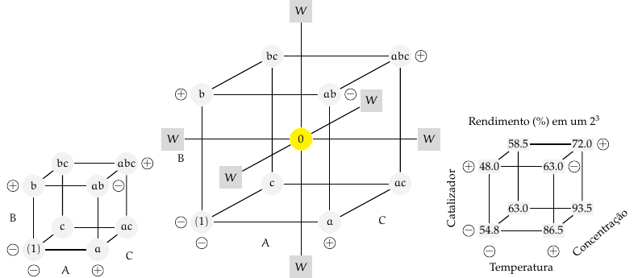

  * [cubos_fatoriais.pgf](https://github.com/walmes/Tikz/blob/master/src/cubos_fatoriais.pgf)

```tex
\tikzset{
  vertex/.style={
    circle, minimum size=20pt, inner sep=0pt, fill=gray!10},
  axial/.style={
    rectangle, minimum size=20pt, inner sep=0pt, fill=gray!30},
  edge/.style={draw,thick,-,black},
  rotu/.style={midway},
  sinal/.style={draw, circle, inner sep=0pt, thin}
}

\def\dist{0.4}
\begin{tikzpicture}[
  scale=2, ->, thick, z={(0.45,0.35)}, node distance=0.65cm]
  \node[vertex] (v0) at (0,0,0) {$(1)$};
  \node[vertex] (v1) at (0,1,0) {$b$};
  \node[vertex] (v2) at (1,0,0) {$a$};
  \node[vertex] (v3) at (1,1,0) {$ab$};
  \node[vertex] (v4) at (0,0,1) {$c$};
  \node[vertex] (v5) at (0,1,1) {$bc$};
  \node[vertex] (v6) at (1,0,1) {$ac$};
  \node[vertex] (v7) at (1,1,1) {$abc$};
  \draw[edge] (v0) -- (v1) node[rotu, left=\dist] {$B$} -- 
    (v3) -- (v2) -- (v0) node[rotu, below=\dist] {$A$};
  \draw[edge] (v0) -- (v4) -- (v5) -- (v1);
  \draw[edge] (v2) -- (v6)
    node[rotu, below right=\dist] {$C$} -- (v7) -- (v3);
  \draw[edge] (v4) -- (v6); \draw[edge] (v5) -- (v7);
  \node[sinal, below of=v0] {$-$};
  \node[sinal, left of=v0] {$-$};
  \node[sinal, left of=v1] {$+$};
  \node[sinal, below of=v2] {$+$};
  \node[sinal, right of=v3] {$-$};
  \node[sinal, right of=v7] {$+$};
\end{tikzpicture}

\def\dist{0.4}
\def\ax{2}
\begin{tikzpicture}[
  scale=2, ->, thick, z={(0.55,0.3)}, node distance=0.65cm]
  \node[vertex, fill=yellow] (c0) at (0,0,0) {$0$};
  \node[vertex] (v0) at (-1,-1,-1) {$(1)$};
  \node[vertex] (v1) at (-1,1,-1) {$b$};
  \node[vertex] (v2) at (1,-1,-1) {$a$};
  \node[vertex] (v3) at (1,1,-1) {$ab$};
  \node[vertex] (v4) at (-1,-1,1) {$c$};
  \node[vertex] (v5) at (-1,1,1) {$bc$};
  \node[vertex] (v6) at (1,-1,1) {$ac$};
  \node[vertex] (v7) at (1,1,1) {$abc$};
  \node[axial] (a1) at (-\ax,0,0) {$W$};
  \node[axial] (a2) at (\ax,0,0) {$W$};
  \node[axial] (a3) at (0,-\ax,0) {$W$};
  \node[axial] (a4) at (0,\ax,0) {$W$};
  \node[axial] (a5) at (0,0,-\ax) {$W$};
  \node[axial] (a6) at (0,0,\ax) {$W$};
  \draw[edge] (v0) -- (v1) node[rotu, left=\dist] {$B$} -- 
    (v3) -- (v2) -- (v0) node[rotu, below=\dist] {$A$};
  \draw[edge] (v0) -- (v4) -- (v5) -- (v1);
  \draw[edge] (v2) -- (v6)
    node[rotu, below right=\dist] {$C$} -- (v7) -- (v3);
  \draw[edge] (v4) -- (v6); \draw[edge] (v5) -- (v7);
  \draw[edge] (a1) -- (c0) --(a2);
  \draw[edge] (a3) -- (c0) --(a4);
  \draw[edge] (a5) -- (c0) --(a6);
  \node[sinal, below of=v0] {$-$};
  \node[sinal, left of=v0] {$-$};
  \node[sinal, left of=v1] {$+$};
  \node[sinal, below of=v2] {$+$};
  \node[sinal, right of=v3] {$-$};
  \node[sinal, right of=v7] {$+$};
\end{tikzpicture}

\begin{tikzpicture}[
  scale=2, ->, thick, z={(0.45,0.35)}, node distance=0.65cm,
  vertex/.style={
    rectangle, minimum size=12pt, inner sep=1pt, fill=gray!10
  }]
  \node[text centered] (title) at (0.7,1.7,0)
    {Rendimento (\%) em um $2^3$};
  \node[vertex] (v0) at (0,0,0) {$54.8$};
  \node[vertex] (v1) at (0,1,0) {$48.0$};
  \node[vertex] (v2) at (1,0,0) {$86.5$};
  \node[vertex] (v3) at (1,1,0) {$63.0$};
  \node[vertex] (v4) at (0,0,1) {$63.0$};
  \node[vertex] (v5) at (0,1,1) {$58.5$};
  \node[vertex] (v6) at (1,0,1) {$93.5$};
  \node[vertex] (v7) at (1,1,1) {$72.0$};
  \draw[edge] (v0) -- (v1)
    node[rotu, rotate=90, yshift=1.2cm] {Catalizador} -- 
    (v3) -- (v2) -- (v0) node[rotu, below=0.9cm] {Temperatura};
  \draw[edge] (v0) -- (v4) -- (v5) -- (v1);
  \draw[edge] (v2) -- (v6)
    node[rotu, rotate=40, yshift=-1cm, xshift=0.5cm]
    {Concentra\c{c}\~ao} -- (v7) -- (v3);
  \draw[edge] (v4) -- (v6); \draw[edge] (v5) -- (v7);
  \node[sinal, below of=v0] {$-$};
  \node[sinal, left of=v0] {$-$};
  \node[sinal, left of=v1] {$+$};
  \node[sinal, below of=v2] {$+$};
  \node[sinal, right of=v3] {$-$};
  \node[sinal, right of=v7] {$+$};
\end{tikzpicture}
```
****

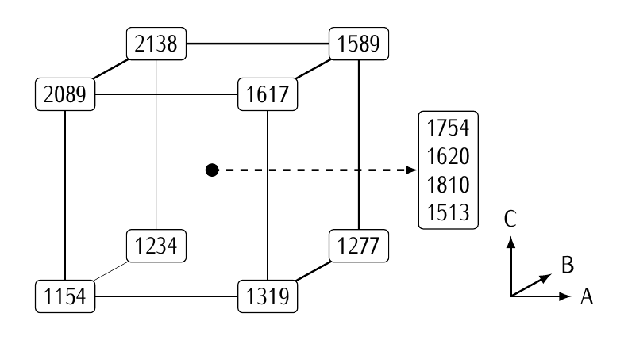

  * [cubos-fatoriais-2a3-pontos-centrais.pgf](https://github.com/walmes/Tikz/blob/master/src/cubos-fatoriais-2a3-pontos-centrais.pgf)

```tex
\begin{tikzpicture}[%
  node distance = 4ex,
  scale = 3,
  thick,
  > = latex,
  z = {(0.45, 0.25)},
  edge/.style = {draw, thick, -, black},
  sinal/.style = {inner sep = 1pt, thin, opacity = 0.4,
    fill = blue, circle, text opacity = 1},
  mtx/.style = {
%     matrix of math nodes,
    matrix of nodes,
    every node/.style = {
      anchor = base,
      text width = 2em,
      text height = 1em,
      align = center,
    }
  },
  ]

  \def\dist{0.1}
  \def\cube{

    % Vertices.
    \coordinate (v0) at (0, 0, 0);
    \coordinate (v1) at (0, 1, 0);
    \coordinate (v2) at (1, 0, 0);
    \coordinate (v3) at (1, 1, 0);
    \coordinate (v4) at (0, 0, 1);
    \coordinate (v5) at (0, 1, 1);
    \coordinate (v6) at (1, 0, 1);
    \coordinate (v7) at (1, 1, 1);

    \coordinate (v8) at (0.5, 0.5, 0.5);

    % Edges.
    \draw[edge] (v0) -- (v1) -- (v3) -- (v2) -- (v0);
    \draw[edge] (v0) -- (v4) -- (v5) -- (v1);
    \draw[edge] (v2) -- (v6) -- (v7) -- (v3);
    \draw[edge] (v4) -- (v6);
    \draw[edge] (v5) -- (v7);

    % Points.
    \foreach \i in {0, 1, ..., 8}{ \draw[fill = black] (v\i) circle (0.8pt); }

  } % \cube

  \begin{scope}[xshift = 2.2cm, ->, > = latex]
    \draw (0, 0, 0) -- +(0.3, 0, 0) node[right] {A};
    \draw (0, 0, 0) -- +(0, 0.3, 0) node[above] {B};
    \draw (0, 0, 0) -- +(0, 0, 0.45) node[above, anchor = -150] {C};
  \end{scope}

  \begin{scope}[]
    \cube{};

    \coordinate (cube1top) at (0.25, 1.5, 1);

    \foreach \i/\y in {0/10, 1/10, 2/10, 3/10, 4/10, 5/10, 6/10, 7/10}{
      \node[fill = white, draw, rectangle] at (v\i) {\y}; 
    }

    \node[xshift = 3.5cm, align = left] (pc) at (v8) {10\\ 10\\ 10\\ 10};

   \draw[dashed] (pc) -- (v8);

  \end{scope}

\end{tikzpicture}%
```
****

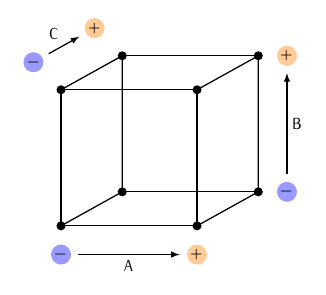

  * [cubos-fatoriais-2a3.pgf](https://github.com/walmes/Tikz/blob/master/src/cubos-fatoriais-2a3.pgf)

```tex
\begin{tikzpicture}[%
  node distance = 4ex,
  scale = 3,
  thick,
  > = latex,
  z = {(0.45, 0.25)},
  edge/.style = {draw, thick, -, black},
  sinal/.style = {inner sep = 1pt, thin, opacity = 0.4,
    fill = blue, circle, text opacity = 1},
  mtx/.style = {
%     matrix of math nodes,
    matrix of nodes,
    every node/.style = {
      anchor = base,
      text width = 2em,
      text height = 1em,
      align = center,
    }
  },
  ]

  \def\dist{0.1}
  \def\cube{

    % Vertices.
    \coordinate (v0) at (0, 0, 0);
    \coordinate (v1) at (0, 1, 0);
    \coordinate (v2) at (1, 0, 0);
    \coordinate (v3) at (1, 1, 0);
    \coordinate (v4) at (0, 0, 1);
    \coordinate (v5) at (0, 1, 1);
    \coordinate (v6) at (1, 0, 1);
    \coordinate (v7) at (1, 1, 1);

    % Edges.
    \draw[edge] (v0) -- (v1) -- (v3) -- (v2) -- (v0);
    \draw[edge] (v0) -- (v4) -- (v5) -- (v1);
    \draw[edge] (v2) -- (v6) -- (v7) -- (v3);
    \draw[edge] (v4) -- (v6);
    \draw[edge] (v5) -- (v7);

    % Points.
    \foreach \i in {0, 1, ..., 7}{ \draw[fill = black] (v\i) circle (0.8pt); }

    % Axis text.
    \node[below of = v0, sinal, fill = blue] (Alow) {$-$};
    \node[below of = v2, sinal, fill = orange] (Ahig) {$+$};
    \path[draw, ->, shorten <= 1ex, shorten >= 1ex] (Alow) -- node[below] {A} (Ahig);

%     \node[left of = v0, sinal, fill = blue] (Blow) {$-$};
%     \node[left of = v1, sinal, fill = orange] (Bhig) {$+$};
%     \path[draw, ->, shorten <= 1ex, shorten >= 1ex] (Blow) -- node[left] {B} (Bhig);

    \node[right of = v6, sinal, fill = blue] (Blow) {$-$};
    \node[right of = v7, sinal, fill = orange] (Bhig) {$+$};
    \path[draw, ->, shorten <= 1ex, shorten >= 1ex] (Blow) -- node[right] {B} (Bhig);

%     \node[below right = of v2, sinal, fill = blue] (Clow) {$-$};
%     \node[below right = of v6, sinal, fill = orange] (Chig) {$+$};
%     \path[draw, ->, shorten <= 1ex, shorten >= 1ex] (Clow) -- node[below right] {C} (Chig);

    \node[above left = of v1, sinal, fill = blue] (Clow) {$-$};
    \node[above left = of v5, sinal, fill = orange] (Chig) {$+$};
    \path[draw, ->, shorten <= 1ex, shorten >= 1ex] (Clow) -- node[above left] {C} (Chig);

  } % \cube

  \begin{scope}[]
    \cube{};
    \coordinate (cube1top) at (0.25, 1.5, 1);
  \end{scope}

\end{tikzpicture}%
```
****


  * [cubos-fatoriais-2a4.pgf](https://github.com/walmes/Tikz/blob/master/src/cubos-fatoriais-2a4.pgf)

```tex
\begin{tikzpicture}[%
  node distance = 4ex,
  scale = 3,
  thick,
  > = latex,
  z = {(0.45, 0.25)},
  edge/.style = {draw, thick, -, black},
  sinal/.style = {inner sep = 1pt, thin, opacity = 0.4,
    fill = blue, circle, text opacity = 1},
  mtx/.style = {
%     matrix of math nodes,
    matrix of nodes,
    every node/.style = {
      anchor = base,
      text width = 2em,
      text height = 1em,
      align = center,
    }
  },
  ]

  \def\dist{0.1}
  \def\cube{

    % Vertices.
    \coordinate (v0) at (0, 0, 0);
    \coordinate (v1) at (0, 1, 0);
    \coordinate (v2) at (1, 0, 0);
    \coordinate (v3) at (1, 1, 0);
    \coordinate (v4) at (0, 0, 1);
    \coordinate (v5) at (0, 1, 1);
    \coordinate (v6) at (1, 0, 1);
    \coordinate (v7) at (1, 1, 1);

    % Edges.
    \draw[edge] (v0) -- (v1) -- (v3) -- (v2) -- (v0);
    \draw[edge] (v0) -- (v4) -- (v5) -- (v1);
    \draw[edge] (v2) -- (v6) -- (v7) -- (v3);
    \draw[edge] (v4) -- (v6);
    \draw[edge] (v5) -- (v7);

    % Points.
    \foreach \i in {0, 1, ..., 7}{ \draw[fill = black] (v\i) circle (0.8pt); }

    % Axis text.
    \node[below of = v0, sinal, fill = blue] (Alow) {$-$};
    \node[below of = v2, sinal, fill = orange] (Ahig) {$+$};
    \path[draw, ->, shorten <= 1ex, shorten >= 1ex] (Alow) -- node[below] {A} (Ahig);

%     \node[left of = v0, sinal, fill = blue] (Blow) {$-$};
%     \node[left of = v1, sinal, fill = orange] (Bhig) {$+$};
%     \path[draw, ->, shorten <= 1ex, shorten >= 1ex] (Blow) -- node[left] {B} (Bhig);

    \node[right of = v6, sinal, fill = blue] (Blow) {$-$};
    \node[right of = v7, sinal, fill = orange] (Bhig) {$+$};
    \path[draw, ->, shorten <= 1ex, shorten >= 1ex] (Blow) -- node[right] {B} (Bhig);

%     \node[below right = of v2, sinal, fill = blue] (Clow) {$-$};
%     \node[below right = of v6, sinal, fill = orange] (Chig) {$+$};
%     \path[draw, ->, shorten <= 1ex, shorten >= 1ex] (Clow) -- node[below right] {C} (Chig);

    \node[above left = of v1, sinal, fill = blue] (Clow) {$-$};
    \node[above left = of v5, sinal, fill = orange] (Chig) {$+$};
    \path[draw, ->, shorten <= 1ex, shorten >= 1ex] (Clow) -- node[above left] {C} (Chig);

  } % \cube

  \begin{scope}[]
    \cube{};
    \coordinate (cube1top) at (0.25, 1.5, 1);
    \coordinate (cube1lef) at (-0.5, 0.5, 0);
  \end{scope}

  \begin{scope}[xshift = 2.8cm]
    \cube{};
    \coordinate (cube2) at (0.25, 1.5, 1);
  \end{scope}

  \begin{scope}[node distance = 4ex]
    \draw[edge, color = gray] (cube1top) |- ++(0, 0.1) -| (cube2);
    \node[above = of cube1top, sinal, fill = blue] (Dlow) {$-$};
    \node[above = of cube2, sinal, fill = orange] (Dhig) {$+$};
    \path[draw, ->, shorten <= 10ex, shorten >= 10ex] (Dlow) -- node[above] {D} (Dhig);
  \end{scope}

\end{tikzpicture}%
ift = -2.5cm]
    \cube{};
    \coordinate (cube3) at (-0.5, 0.5, 0);
  \end{scope}

  \begin{scope}[xshift = 2.8cm, yshift = -2.5cm]
    \cube{};
  \end{scope}

  \begin{scope}[node distance = 4ex]
    \draw[edge, color = gray] (cube3) -| ++(-0.1, 0) |- (cube1lef);
    \node[left = of cube1lef, sinal, fill = orange] (Ehig) {$+$};
    \node[left = of cube3, sinal, fill = blue] (Elow) {$-$};
    \path[draw, ->, shorten <= 10ex, shorten >= 10ex] (Elow) -- node[left] {E} (Ehig);
  \end{scope}

\end{tikzpicture}%
```
****

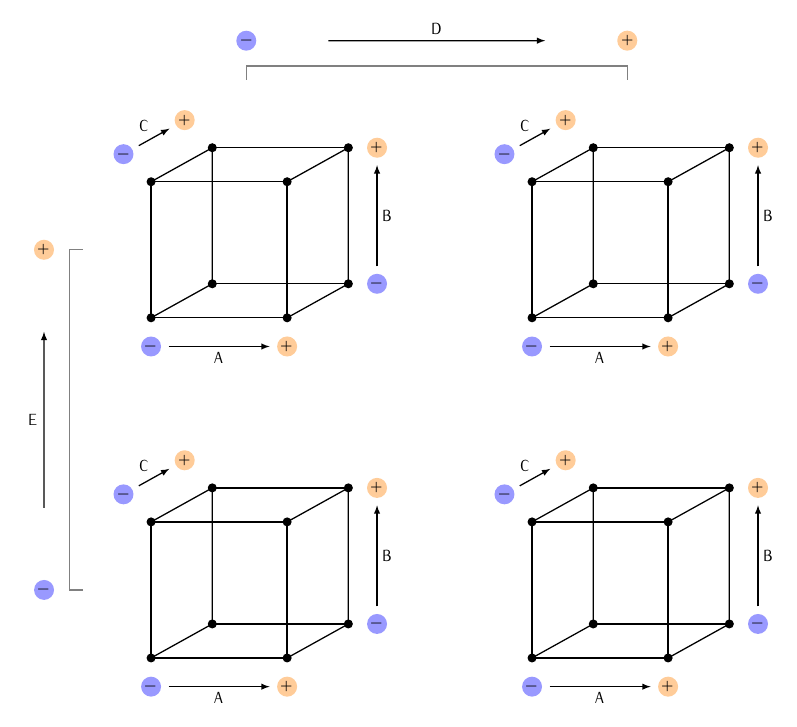

  * [cubos-fatoriais-2a5.pgf](https://github.com/walmes/Tikz/blob/master/src/cubos-fatoriais-2a5.pgf)

```tex
\begin{tikzpicture}[%
  node distance = 4ex,
  scale = 3,
  thick,
  > = latex,
  z = {(0.45, 0.25)},
  edge/.style = {draw, thick, -, black},
  sinal/.style = {inner sep = 1pt, thin, opacity = 0.4,
    fill = blue, circle, text opacity = 1},
  mtx/.style = {
%     matrix of math nodes,
    matrix of nodes,
    every node/.style = {
      anchor = base,
      text width = 2em,
      text height = 1em,
      align = center,
    }
  },
  ]

  \def\dist{0.1}
  \def\cube{

    % Vertices.
    \coordinate (v0) at (0, 0, 0);
    \coordinate (v1) at (0, 1, 0);
    \coordinate (v2) at (1, 0, 0);
    \coordinate (v3) at (1, 1, 0);
    \coordinate (v4) at (0, 0, 1);
    \coordinate (v5) at (0, 1, 1);
    \coordinate (v6) at (1, 0, 1);
    \coordinate (v7) at (1, 1, 1);

    % Edges.
    \draw[edge] (v0) -- (v1) -- (v3) -- (v2) -- (v0);
    \draw[edge] (v0) -- (v4) -- (v5) -- (v1);
    \draw[edge] (v2) -- (v6) -- (v7) -- (v3);
    \draw[edge] (v4) -- (v6);
    \draw[edge] (v5) -- (v7);

    % Points.
    \foreach \i in {0, 1, ..., 7}{ \draw[fill = black] (v\i) circle (0.8pt); }

    % Axis text.
    \node[below of = v0, sinal, fill = blue] (Alow) {$-$};
    \node[below of = v2, sinal, fill = orange] (Ahig) {$+$};
    \path[draw, ->, shorten <= 1ex, shorten >= 1ex] (Alow) -- node[below] {A} (Ahig);

%     \node[left of = v0, sinal, fill = blue] (Blow) {$-$};
%     \node[left of = v1, sinal, fill = orange] (Bhig) {$+$};
%     \path[draw, ->, shorten <= 1ex, shorten >= 1ex] (Blow) -- node[left] {B} (Bhig);

    \node[right of = v6, sinal, fill = blue] (Blow) {$-$};
    \node[right of = v7, sinal, fill = orange] (Bhig) {$+$};
    \path[draw, ->, shorten <= 1ex, shorten >= 1ex] (Blow) -- node[right] {B} (Bhig);

%     \node[below right = of v2, sinal, fill = blue] (Clow) {$-$};
%     \node[below right = of v6, sinal, fill = orange] (Chig) {$+$};
%     \path[draw, ->, shorten <= 1ex, shorten >= 1ex] (Clow) -- node[below right] {C} (Chig);

    \node[above left = of v1, sinal, fill = blue] (Clow) {$-$};
    \node[above left = of v5, sinal, fill = orange] (Chig) {$+$};
    \path[draw, ->, shorten <= 1ex, shorten >= 1ex] (Clow) -- node[above left] {C} (Chig);

  } % \cube

  \begin{scope}[]
    \cube{};
    \coordinate (cube1top) at (0.25, 1.5, 1);
    \coordinate (cube1lef) at (-0.5, 0.5, 0);
  \end{scope}

  \begin{scope}[xshift = 2.8cm]
    \cube{};
    \coordinate (cube2) at (0.25, 1.5, 1);
  \end{scope}

  \begin{scope}[node distance = 4ex]
    \draw[edge, color = gray] (cube1top) |- ++(0, 0.1) -| (cube2);
    \node[above = of cube1top, sinal, fill = blue] (Dlow) {$-$};
    \node[above = of cube2, sinal, fill = orange] (Dhig) {$+$};
    \path[draw, ->, shorten <= 10ex, shorten >= 10ex] (Dlow) -- node[above] {D} (Dhig);
  \end{scope}

  \begin{scope}[yshift = -2.5cm]
    \cube{};
    \coordinate (cube3) at (-0.5, 0.5, 0);
  \end{scope}

  \begin{scope}[xshift = 2.8cm, yshift = -2.5cm]
    \cube{};
  \end{scope}

  \begin{scope}[node distance = 4ex]
    \draw[edge, color = gray] (cube3) -| ++(-0.1, 0) |- (cube1lef);
    \node[left = of cube1lef, sinal, fill = orange] (Ehig) {$+$};
    \node[left = of cube3, sinal, fill = blue] (Elow) {$-$};
    \path[draw, ->, shorten <= 10ex, shorten >= 10ex] (Elow) -- node[left] {E} (Ehig);
  \end{scope}

\end{tikzpicture}%
```
****

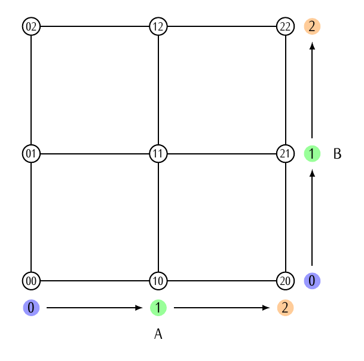

  * [cubos-fatoriais-3a2.pgf](https://github.com/walmes/Tikz/blob/master/src/cubos-fatoriais-3a2.pgf)

```tex
\begin{tikzpicture}[%
  node distance = 4ex,
  scale = 3,
  thick,
  > = latex,
  z = {(0.45, 0.25)},
  edge/.style = {draw, thick, -, black},
  axispath/.style = {draw, ->, shorten <= 1ex, shorten >= 1ex},
  sinal/.style = {inner sep = 1pt, thin, opacity = 0.4,
    fill = blue, circle, text opacity = 1},
  ]

  \def\cube{

    \foreach \x in {0, 1, 2} {
      \foreach \y in {0, 1, 2} {
        \coordinate (v\x\y) at (\x, \y);
        % \draw[fill = black] (v\x\y\z) circle (0.8pt);
        \node[draw, circle, inner sep = 0.2ex,
          fill = white, font = \footnotesize] at (v\x\y) {\x\y};
      }
    }

    \begin{scope}[on background layer]
      \foreach \u in {0, 1, 2} {
        \draw[edge] (v0\u) -- (v2\u);
        \draw[edge] (v\u0) -- (v\u2);
      }
    \end{scope}

    % Axis text.
    \node[below of = v00, sinal, fill = blue] (Alow) {$0$};
    \node[below of = v10, sinal, fill = green, label = {[below = 1ex]-90:A}] (Amid) {$1$};
    \node[below of = v20, sinal, fill = orange] (Ahig) {$2$};
    \path[axispath] (Alow) edge (Amid) (Amid) edge (Ahig);

    \node[right of = v20, sinal, fill = blue] (Blow) {$0$};
    \node[right of = v21, sinal, fill = green, label = {[right = 1ex]0:B}] (Bmid) {$1$};
    \node[right of = v22, sinal, fill = orange] (Bhig) {$2$};
    \path[axispath] (Blow) edge (Bmid) (Bmid) edge (Bhig);

  } % \cube

  \begin{scope}[]
    \cube{};
  \end{scope}

\end{tikzpicture}%
```
****

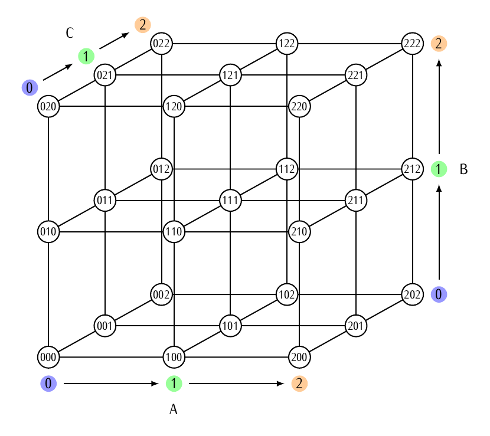

  * [cubos-fatoriais-3a3.pgf](https://github.com/walmes/Tikz/blob/master/src/cubos-fatoriais-3a3.pgf)

```tex
\begin{tikzpicture}[%
  node distance = 4ex,
  scale = 3,
  thick,
  > = latex,
  z = {(0.4, 0.25)},
  edge/.style = {draw, thick, -, black},
  axispath/.style = {draw, ->, shorten <= 1ex, shorten >= 1ex},
  sinal/.style = {inner sep = 1pt, thin, opacity = 0.4,
    fill = blue, circle, text opacity = 1},
  ]

  \def\cube{

    \foreach \x in {0, 1, 2} {
      \foreach \y in {0, 1, 2} {
        \foreach \z in {0, 1, 2} {
          \coordinate (v\x\y\z) at (\x, \y, \z);
          % \draw[fill = black] (v\x\y\z) circle (0.8pt);
          \node[draw, circle, inner sep = 0.2ex,
            fill = white, font = \footnotesize] at (v\x\y\z) {\x\y\z};
        }
      }
    }

    \begin{scope}[on background layer]
      \foreach \y in {0, 1, 2} {
        \draw[edge] (v0\y0) -- (v0\y2) -- (v2\y2) -- (v2\y0) -- cycle;
        \draw[edge] (v1\y0) -- (v1\y2);
        \draw[edge] (v0\y1) -- (v2\y1);
      }
      \foreach \x in {0, 1, 2} {
        \foreach \z in {0, 1, 2} {
          \draw[edge] (v\x0\z) -- (v\x2\z);
        }
      }
    \end{scope}

    % Axis text.
    \node[below of = v000, sinal, fill = blue] (Alow) {$0$};
    \node[below of = v100, sinal, fill = green, label = {[below = 1ex]-90:A}] (Amid) {$1$};
    \node[below of = v200, sinal, fill = orange] (Ahig) {$2$};
    \path[axispath] (Alow) edge (Amid) (Amid) edge (Ahig);

    \node[right of = v202, sinal, fill = blue] (Blow) {$0$};
    \node[right of = v212, sinal, fill = green, label = {[right = 1ex]0:B}] (Bmid) {$1$};
    \node[right of = v222, sinal, fill = orange] (Bhig) {$2$};
    \path[axispath] (Blow) edge (Bmid) (Bmid) edge (Bhig);

    \node[above left of = v020, sinal, fill = blue] (Clow) {$0$};
    \node[above left of = v021, sinal, fill = green, label = {[above left = 1ex]105:C}] (Cmid) {$1$};
    \node[above left of = v022, sinal, fill = orange] (Chig) {$2$};
    \path[axispath] (Clow) edge (Cmid) (Cmid) edge (Chig);

  } % \cube

  \begin{scope}[]
    \cube{};
  \end{scope}

  \begin{scope}[]
    \cube{};
  \end{scope}

\end{tikzpicture}%
```
****

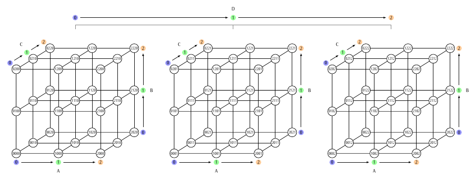

  * [cubos-fatoriais-3a4.pgf](https://github.com/walmes/Tikz/blob/master/src/cubos-fatoriais-3a4.pgf)

```tex
\begin{tikzpicture}[%
  node distance = 4ex,
  scale = 3,
  thick,
  > = latex,
  z = {(0.4, 0.25)},
  edge/.style = {draw, thick, -, black},
  axispath/.style = {draw, ->, shorten <= 1ex, shorten >= 1ex},
  sinal/.style = {inner sep = 1pt, thin, opacity = 0.4,
    fill = blue, circle, text opacity = 1},
  ]

  \newcommand{\cube}[1]{

    \foreach \x in {0, 1, 2} {
      \foreach \y in {0, 1, 2} {
        \foreach \z in {0, 1, 2} {
          \coordinate (v\x\y\z) at (\x, \y, \z);
%             \draw[fill = black] (v\x\y\z) circle (0.8pt);
          \node[draw, circle, inner sep = 0.2ex,
            fill = white, font = \footnotesize] at (v\x\y\z) {\x\y\z#1};
        }
      }
    }

    \begin{scope}[on background layer]
      \foreach \y in {0, 1, 2} {
        \draw[edge] (v0\y0) -- (v0\y2) -- (v2\y2) -- (v2\y0) -- cycle;
        \draw[edge] (v1\y0) -- (v1\y2);
        \draw[edge] (v0\y1) -- (v2\y1);
      }
      \foreach \x in {0, 1, 2} {
        \foreach \z in {0, 1, 2} {
          \draw[edge] (v\x0\z) -- (v\x2\z);
        }
      }
    \end{scope}

    % Axis text.
    \node[below of = v000, sinal, fill = blue] (Alow) {$0$};
    \node[below of = v100, sinal, fill = green, label = {[below = 1ex]-90:A}] (Amid) {$1$};
    \node[below of = v200, sinal, fill = orange] (Ahig) {$2$};
    \path[axispath] (Alow) edge (Amid) (Amid) edge (Ahig);

    \node[right of = v202, sinal, fill = blue] (Blow) {$0$};
    \node[right of = v212, sinal, fill = green, label = {[right = 1ex]0:B}] (Bmid) {$1$};
    \node[right of = v222, sinal, fill = orange] (Bhig) {$2$};
    \path[axispath] (Blow) edge (Bmid) (Bmid) edge (Bhig);

    \node[above left of = v020, sinal, fill = blue] (Clow) {$0$};
    \node[above left of = v021, sinal, fill = green, label = {[above left = 1ex]105:C}] (Cmid) {$1$};
    \node[above left of = v022, sinal, fill = orange] (Chig) {$2$};
    \path[axispath] (Clow) edge (Cmid) (Cmid) edge (Chig);

  } % \cube

  \begin{scope}[]
    \cube{0};
    \coordinate (cube0) at (1, 2.7, 1);
  \end{scope}

  \begin{scope}[xshift = 3.75cm]
    \cube{1};
    \coordinate (cube1) at (1, 2.7, 1);
  \end{scope}

  \begin{scope}[xshift = 7.50cm]
    \cube{2};
    \coordinate (cube2) at (1, 2.7, 1);
  \end{scope}

  \begin{scope}[node distance = 4ex]
    \draw[edge, color = gray] (cube0) |- ++(0, 0.1) -| (cube1);
    \draw[edge, color = gray] (cube1) |- ++(0, 0.1) -| (cube2);
    \node[above = of cube0, sinal, fill = blue] (Dlow) {$0$};
    \node[above = of cube1, sinal, fill = green, label = {[above = 1ex]90:D}] (Dmid) {$1$};
    \node[above = of cube2, sinal, fill = orange] (Dhig) {$2$};
    \path[axispath] (Dlow) edge (Dmid) (Dmid) edge (Dhig);
  \end{scope}

\end{tikzpicture}%
```
****

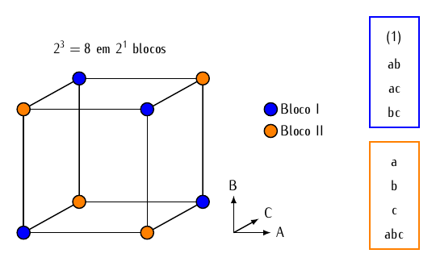

  * [cubos-fatoriais-confundimento-2a3-em-2-blocos.pgf](https://github.com/walmes/Tikz/blob/master/src/cubos-fatoriais-confundimento-2a3-em-2-blocos.pgf)

```tex
\begin{tikzpicture}[%
  scale = 3,
  thick,
  z = {(0.45, 0.25)},
  edge/.style = {draw, thick, -, black},
  mtx/.style = {
%     matrix of math nodes,
    matrix of nodes,
    every node/.style = {
      anchor = base,
      text width = 2em,
      text height = 1em,
      align = center,
    }
  },
  ]

  \def\dist{0.1}
  \def\cube{
    % Vertices.
    \coordinate (v0) at (0, 0, 0);
    \coordinate (v1) at (0, 1, 0);
    \coordinate (v2) at (1, 0, 0);
    \coordinate (v3) at (1, 1, 0);
    \coordinate (v4) at (0, 0, 1);
    \coordinate (v5) at (0, 1, 1);
    \coordinate (v6) at (1, 0, 1);
    \coordinate (v7) at (1, 1, 1);

    % Edges.
    \draw[edge] (v0) -- (v1) -- (v3) -- (v2) -- (v0);
    \draw[edge] (v0) -- (v4) -- (v5) -- (v1);
    \draw[edge] (v2) -- (v6) -- (v7) -- (v3);
    \draw[edge] (v4) -- (v6);
    \draw[edge] (v5) -- (v7);

  } % \cube

  \begin{scope}[xshift = 1.7cm, ->, > = latex]
    \draw (0, 0, 0) -- +(0.3, 0, 0) node[right] {A};
    \draw (0, 0, 0) -- +(0, 0.3, 0) node[above] {B};
    \draw (0, 0, 0) -- +(0, 0, 0.45) node[above, anchor = -150] {C};
  \end{scope}

  \begin{scope}[]
    \cube{};
    \foreach \i in {0, 3, 5, 6}{ \draw[fill = blue] (v\i) circle (1.5pt); }
    \foreach \i in {1, 2, 4, 7}{ \draw[fill = orange] (v\i) circle (1.5pt); }
    \node at (0.25, 1.25, 1) {$2^3 = 8$ em $2^1$ blocos};
  \end{scope}

  \begin{scope}[xshift = 2cm, yshift = 1cm]
    \coordinate (b1) at (0, 0);
    \coordinate (b2) at (0, -0.5em);
    \draw[fill = blue] (b1) circle (1.5pt) node[right = 0.7ex] {Bloco I};
    \draw[fill = orange] (b2) circle (1.5pt) node[right = 0.7ex] {Bloco II};
  \end{scope}

  \begin{scope}[xshift = 3cm, yshift= 1.3cm]
    \matrix (B1) at (0, 0) [mtx] {
      (1) \\ ab \\ ac \\ bc \\
    };
    \matrix (B2) [mtx, below = 1em of B1] {
      a \\ b \\ c \\ abc \\
    };
    \node[draw, color = blue, fit = (B1-1-1)(B1-4-1)] {};
    \node[draw, color = orange, fit = (B2-1-1)(B2-4-1)] {};
  \end{scope}

\end{tikzpicture}%
```
****

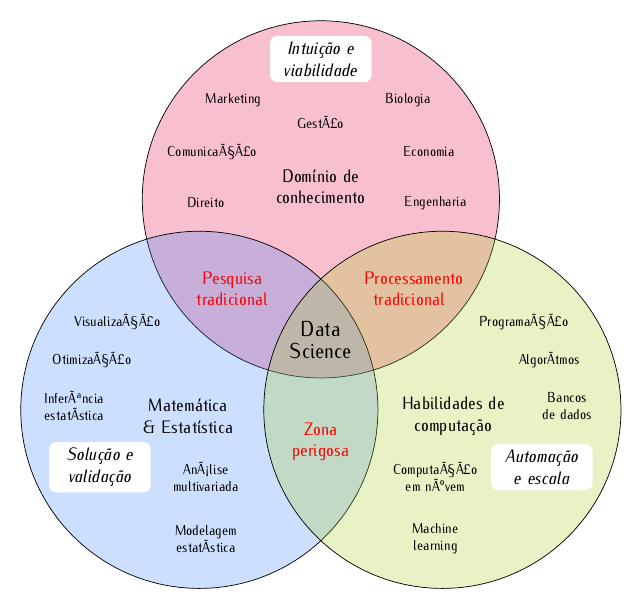

  * [data-science-venn-1.pgf](https://github.com/walmes/Tikz/blob/master/src/data-science-venn-1.pgf)

```tex
% References:
% https://www.oreilly.com/library/view/python-data-science/9781491912126/assets/pyds_00in01.png
% https://i.pinimg.com/originals/ca/4d/02/ca4d0248ae5831b0e9b0a2da9f7ba4e3.png
% https://www.altius.co.uk/app/uploads/2018/07/data-science-venn-diagram.jpg
% https://i.pinimg.com/originals/fc/61/40/fc61405983965a5ce1bea0e8a353d6f2.png
% https://4.bp.blogspot.com/-G6EgWv_i9ns/V-FxPixL_tI/AAAAAAAAMHk/LQN1JN8lc9MnKuD-G_2PY6a9c0MEcyeDwCLcB/s1600/datascience_skills_venn_diagram2.png
% https://www.researchgate.net/publication/313020352/figure/fig7/AS:455507778510851@1485612925120/The-Venn-diagram-for-data-science-graphic-by-author-based-on-Conway-2010_W640.jpg
%
% TODO: https://www.researchgate.net/publication/313020352_Think_big_learning_contexts_algorithms_and_data_science/figures?lo=1
\begin{tikzpicture}[%
  every path/.style = {
   ->,
   > = stealth, 
   rounded corners},
  state/.style = {
    fill = white,
    text centered
  },
  node distance=1.25cm]

  \definecolor{color1}{HTML}{E7AD00}
  \definecolor{color2}{HTML}{A5CC19}
  \definecolor{color3}{HTML}{33B29A}
  \definecolor{color4}{HTML}{3380FF}
  \definecolor{color5}{HTML}{9033FF}
  \definecolor{color6}{HTML}{E5003D}

\begin{scope}[
  opacity = 1,
  fill opacity = 0.25,
  text opacity = 1,
  text width = 6em,
  text centered]

  \def\firstcircle{(90:2.75cm) circle (3.5cm)}
  \def\secondcircle{(210:2.75cm) circle (3.5cm)}
  \def\thirdcircle{(330:2.75cm) circle (3.5cm)}
  \draw [fill = color6] \firstcircle;
  \draw [fill = color4] \secondcircle;
  \draw [fill = color2] \thirdcircle;

\end{scope}

\begin{scope}[minimum width = 1em, text width = 5.0em, text centered]

  \node[state] (int) at ( 90:5.5) {\emph{Intui{\c c}{\~ a}o e viabilidade}};
  \node[state] (val) at (210:5.0) {\emph{Solu{\c c}{\~ a}o e valida{\c c}{\~ a}o}};
  \node[state] (aut) at (-30:5.0) {\emph{Automa{\c c}{\~ a}o e escala}};

  \node (con) at (90:3) {Dom{\' i}nio de\\ conhecimento};
  \node (est) at (210:3) {Matem{\' a}tica \& Estat{\' i}stica};
  \node[text width = 7em] (hac) at (-30:3) {Habilidades de\\ computa{\c c}{\~ a}o};

  \node[color = red] (sof) at (30:2) {Processamento tradicional};
  \node[color = red] (pes) at (150:2) {Pesquisa tradicional};
  \node[color = red] (mac) at (-90:2) {Zona perigosa};

  \node (ds) at (0:0) {\large Data Science};

\end{scope}

\begin{scope}[
  every node/.style = {
    text centered,
    font = \footnotesize,
    text width = 5em
  }]

  \node at ( 50:3.50) {Engenharia};
  \node at (130:3.50) {Direito};
  \node at ( 70:5.00) {Biologia};
  \node at (110:5.00) {Marketing};
  \node at ( 60:4.25) {Economia};
  \node at (120:4.25) {Comunica{\c c}{\~a}o};
  \node at ( 90:4.25) {Gest{\~a}o};

  \node at ( 05:4.0) {Programa{\c c}{\~a}o};
  \node at (-05:4.5) {Algor{\'\i}tmos};
  \node at (-15:5.0) {Bancos de dados};
  \node at (-50:3.5) {Computa{\c c}{\~a}o em n{\'u}vem};
  \node at (-60:4.5) {Machine learning};

  \node at (175:4.0) {Visualiza{\c c}{\~a}o};
  \node at (185:4.5) {Otimiza{\c c}{\~a}o};
  \node at (195:5.0) {Infer{\^e}ncia estat{\'\i}stica};
  \node at (230:3.5) {An{\'a}lise multivariada};
  \node at (240:4.5) {Modelagem estat{\'\i}stica};

\end{scope}

\end{tikzpicture}%
```
****

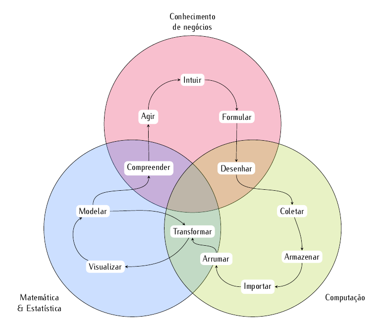

  * [data-science-venn-2.pgf](https://github.com/walmes/Tikz/blob/master/src/data-science-venn-2.pgf)

```tex
\begin{tikzpicture}[
  every path/.style = {
   ->,
   > = stealth, 
   rounded corners},
  state/.style = {
    fill = white,
    text centered
  },
  node distance=1.25cm]

  \definecolor{color1}{HTML}{E7AD00}
  \definecolor{color2}{HTML}{A5CC19}
  \definecolor{color3}{HTML}{33B29A}
  \definecolor{color4}{HTML}{3380FF}
  \definecolor{color5}{HTML}{9033FF}
  \definecolor{color6}{HTML}{E5003D}

\begin{scope}[
  opacity = 1,
  fill opacity = 0.25,
  text opacity = 1,
  text width = 6em,
  text centered]

  \def\firstcircle{(90:2.75cm) circle (3.5cm)}
  \def\secondcircle{(210:2.75cm) circle (3.5cm)}
  \def\thirdcircle{(330:2.75cm) circle (3.5cm)}
  \draw [fill = color6] \firstcircle
    node [above = 10em] {Conhecimento de neg{\' o}cios};
  \draw [fill = color4] \secondcircle
    node [below left = 10em] {Matem{\' a}tica \& Estat{\' i}stica};
  \draw [fill = color2] \thirdcircle
    node [below right = 10em] {Computa{\c c}{\~a}o};

\end{scope}

\begin{scope}

  \node[state] (intuir) at (90:4.5) {Intuir};
  \node[state] (formular) at (60:3.5) {Formular};
  \node[state] (desenhar) at (30:2) {Desenhar};
  \node[state] (coletar)  at (-10:4)  {Coletar};
  \node[state] (armazenar) at (-30:5) {Armazenar};
  \node[state] (importar) at (-55:4.5) {Importar};
  \node[state] (manipular) at (-70:2.75) {Arrumar};
  \node[state] (transformar) at (-90:1.5) {Transformar};
  \node[state] (visualizar) at (-140:4.5) {Visualizar};
  \node[state] (modelar) at (-170:4) {Modelar};
  \node[state] (comunicar) at (150:2) {Compreender};
  \node[state] (agir) at (120:3.5) {Agir};

  \path[draw] (formular) edge[out=-90, in=90] (desenhar);
  \path[draw] (desenhar) edge[out=-90, in=90] (coletar);
  \path[draw] (coletar) edge[out=-70, in=90] (armazenar);
  \path[draw] (armazenar) edge[out=-90, in=0] (importar);
  \path[draw] (importar) edge[out=180, in=-90] (manipular);
  \path[draw] (manipular) edge[out=90, in=-90] (transformar);
  \path[draw] (transformar) edge[out=-120, in=0] (visualizar);
  \path[draw] (visualizar) edge[out=160, in=210] (modelar);
  \path[draw] (modelar) edge[out=0, in=140] (transformar);
  \path[draw] (modelar) edge[out=90, in=-90] (comunicar);
  \path[draw] (comunicar) edge[out=90, in=-90] (agir);
  \path[draw] (agir) edge[out=90, in=180] (intuir);
  \path[draw] (intuir) edge[out=0, in=90] (formular);

\end{scope}

\end{tikzpicture}%
```
****

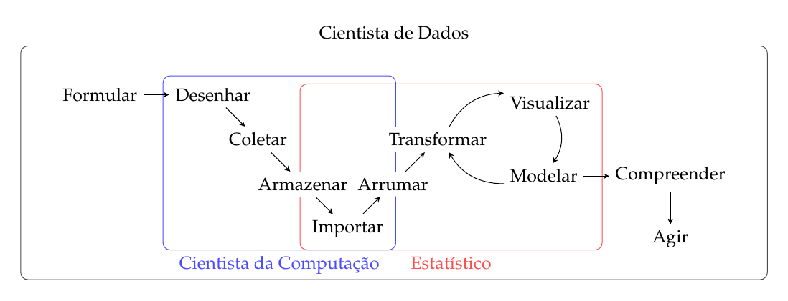

  * [data-science-workflow.pgf](https://github.com/walmes/Tikz/blob/master/src/data-science-workflow.pgf)

```tex
\tikzset{
  every path/.style = {
   ->,
   > = stealth, 
   rounded corners},
  state/.style = {
    fill = white,
    text centered
  },
  node distance=1.25cm,
  hlt/.style = {opacity = 0.7, line cap = round}
}%

\begin{tikzpicture}

  \node[state] (formular) {Formular};
  \node[state, right = 0.5cm of formular] (desenhar) {Desenhar};
  \node[state, below right of = desenhar] (coletar) {Coletar};
  \node[state, below right of = coletar] (armazenar) {Armazenar};
  \node[state, below right of = armazenar] (importar) {Importar};
  \node[state, above right of = importar] (manipular) {Arrumar};
  \node[state, above right of = manipular] (transformar) {Transformar};
  \node[state, above right = 0.3cm of transformar] (visualizar) {Visualizar};
  \node[state, below right = 0.3cm of transformar] (modelar) {Modelar};
  \node[state, right = 0.5cm of modelar] (comunicar) {Compreender};
  \node[state, below of = comunicar] (agir) {Agir};

  \path[draw] (formular) -- (desenhar);
  \path[draw] (desenhar) -- (coletar);
  \path[draw] (coletar) -- (armazenar);
  \path[draw] (armazenar) -- (importar);
  \path[draw] (importar) -- (manipular);
  \path[draw] (manipular) -- (transformar);

%   \path[draw] (transformar) edge[out=90, in=180] (visualizar);
%   \path[draw] (visualizar) edge[out=0, in=90] (modelar);
%   \path[draw] (modelar) edge[out=270, in=270] (transformar);

  \path[draw] (transformar) edge[bend left=30] (visualizar);
  \path[draw] (visualizar) edge[bend left=30] (modelar);
  \path[draw] (modelar) edge[bend left=30] (transformar);

  \path[draw] (modelar) -- (comunicar);
  \path[draw] (comunicar) -- (agir);

  \begin{pgfonlayer}{background}
  \node[hlt, 
    draw = blue,
%     fill = blue,
    fit = (desenhar)(importar),
    label = {[blue!70]below:Cientista da Computa{\c c}{\~a}o}] {};
  \node[hlt, 
    draw = red,
%     fill = red,
    fit = (importar)(visualizar),
    label = {[red!70]below:Estat{\'i}stico}] {};
  \node[hlt, 
    inner sep = 2em,
    draw = black, 
    fill = none,
    fit = (formular)(importar)(comunicar), 
    label = above:Cientista de Dados] {};
  \end{pgfonlayer}

\end{tikzpicture}%
```
****

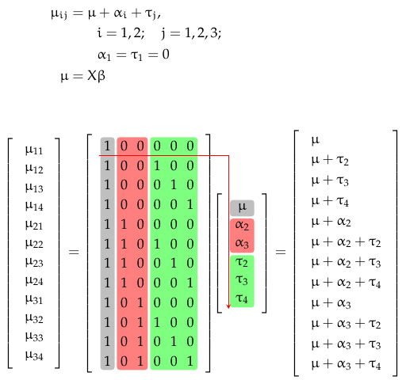

  * [dbc_matricial.pgf](https://github.com/walmes/Tikz/blob/master/src/dbc_matricial.pgf)

```tex
\tikzset{
  mtx/.style={
    matrix of math nodes,
    left delimiter={[}, right delimiter={]}
  },
  hlt/.style={opacity=0.1, line width=4 mm, line cap=round},
  hltr/.style={opacity=0.5, rounded corners=2pt, inner sep=-1pt}
}

\begin{tikzpicture}

  \matrix[mtx] (X) at (2,2) {
    1 & 0 & 0 & 0 & 0 & 0 \\ 
    1 & 0 & 0 & 1 & 0 & 0 \\ 
    1 & 0 & 0 & 0 & 1 & 0 \\ 
    1 & 0 & 0 & 0 & 0 & 1 \\ 
    1 & 1 & 0 & 0 & 0 & 0 \\ 
    1 & 1 & 0 & 1 & 0 & 0 \\ 
    1 & 1 & 0 & 0 & 1 & 0 \\ 
    1 & 1 & 0 & 0 & 0 & 1 \\ 
    1 & 0 & 1 & 0 & 0 & 0 \\ 
    1 & 0 & 1 & 1 & 0 & 0 \\ 
    1 & 0 & 1 & 0 & 1 & 0 \\ 
    1 & 0 & 1 & 0 & 0 & 1 \\ 
  };

  \matrix[mtx, left=of X] (E) {
    \mu_{11} \\ \mu_{12} \\ \mu_{13} \\ \mu_{14} \\
    \mu_{21} \\ \mu_{22} \\ \mu_{23} \\ \mu_{24} \\
    \mu_{31} \\ \mu_{32} \\ \mu_{33} \\ \mu_{34} \\
  };

  \matrix[mtx, nodes={minimum width=4ex}, right=3ex of X] (beta) { 
    \mu \\ \alpha_2 \\ \alpha_3 \\ \tau_2 \\ \tau_3 \\ \tau_4 \\
  };

  \matrix[mtx, nodes={anchor=west}, right=of beta] (mu) {
    \mu \\
    \mu+\tau_2 \\
    \mu+\tau_3 \\
    \mu+\tau_4 \\
    \mu+\alpha_2 \\
    \mu+\alpha_2+\tau_2 \\
    \mu+\alpha_2+\tau_3 \\
    \mu+\alpha_2+\tau_4 \\
    \mu+\alpha_3 \\
    \mu+\alpha_3+\tau_2 \\
    \mu+\alpha_3+\tau_3 \\
    \mu+\alpha_3+\tau_4 \\
  };

  \draw[-stealth, color=red] (X-1-1.south west) -| (beta-6-1.south west);

  \node at ($(E.east)!0.5!(X.west)$) {$=$};%
  \node at ($(beta.east)!0.5!(mu.west)$) {$=$};%

  \node[above=of X, text width=5cm] {% <- importante!
    $\begin{aligned}
      \mu_{ij} &= \mu+\alpha_i+\tau_j,\\
      &\qquad i=1,2;\quad j=1,2,3;\\
      &\qquad \alpha_1 = \tau_1 = 0\\
      \mu &= X\beta
    \end{aligned}$
  };

  \begin{scope}[on background layer]
    \node[hltr, fill=gray, fit=(beta-1-1)] {};
    \node[hltr, fill=red, fit=(beta-2-1)(beta-3-1)] {};
    \node[hltr, fill=green, fit=(beta-4-1)(beta-6-1)] {};
    \node[hltr, fill=gray, fit=(X-1-1)(X-12-1)] {};
    \node[hltr, fill=red, fit=(X-1-2)(X-12-3)] {};
    \node[hltr, fill=green, fit=(X-1-4)(X-12-6)] {};
  \end{scope}

\end{tikzpicture}
```
****

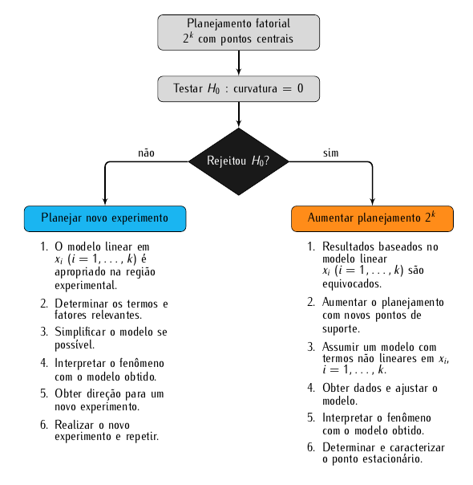

  * [decision-about-curvature.pgf](https://github.com/walmes/Tikz/blob/master/src/decision-about-curvature.pgf)

```tex
\begin{tikzpicture}[
  decision/.style = {
    diamond,
    aspect = 1.5,
    draw,
    fill = gray!20!black,
    text = white,
    text width = 6em,
    text centered,
    inner sep = 1pt},
  block/.style = {
    rectangle,
    draw,
    fill = gray!30!white,
    minimum height = 2em,
    text height = 1.5ex,
    % text depth = 0.25ex,
    text width = 12em,
    text centered,
    rounded corners},
  line/.style = {
    draw,
    -latex',
    line width = 1pt,
    rounded corners}]

  \renewcommand{\baselinestretch}{0.75}

  \node (box1) [block] {Planejamento fatorial $2^k$ com pontos centrais};
  \node (box2) [block, below = 2em of box1] {Testar $H_0: \text{curvatura} = 0$};
  \node (dec1) [decision, below = 2em of box2] {Rejeitou $H_0$?};
  \node (ace) [block, fill = cyan!90!white, below left = 3em of dec1] {Planejar novo experimento};
  \node (rej) [block, fill = orange!90!white, below right = 3em of dec1] {Aumentar planejamento $2^k$};

  \path [line] (box1) -- (box2);
  \path [line] (box2) -- (dec1);
  \path [line] (dec1) -| node [above, pos = 0.25] {n{\~a}o} (ace);
  \path [line] (dec1) -| node [above, pos = 0.25 ] {sim} (rej);

  \node[below = 1ex of ace, align = left] {
    \begin{minipage}{12.5em}
      \begin{flushleft}
        \begin{enumerate}
        \itemsep0em
        \item O modelo linear em $x_i\,\, (i = 1, \ldots, k)$ {\'e} apropriado na regi{\~a}o experimental.
        \item Determinar os termos e fatores relevantes.
        \item Simplificar o modelo se poss{\'\i}vel.
        \item Interpretar o fen{\^o}meno com o modelo obtido.
        \item Obter dire{\c c}{\~a}o para um novo experimento.
        \item Realizar o novo experimento e repetir.
        \end{enumerate}
      \end{flushleft}
    \end{minipage}
  };

  \node[below = 1ex of rej, align = left] {
    \begin{minipage}{12.5em}
      \begin{flushleft}
        \begin{enumerate}
        \itemsep0em
        \item Resultados baseados no modelo linear $x_i\,\, (i = 1, \ldots, k)$ s{\~a}o equivocados.
        \item Aumentar o planejamento com novos pontos de suporte.
        \item Assumir um modelo com termos n{\~a}o lineares em $x_i$, $i = 1, \ldots, k$.
        \item Obter dados e ajustar o modelo.
        \item Interpretar o fen{\^o}meno com o modelo obtido.
        \item Determinar e caracterizar o ponto estacion{\'a}rio.
        \end{enumerate}
      \end{flushleft}
    \end{minipage}
  };

\end{tikzpicture}%
```
****

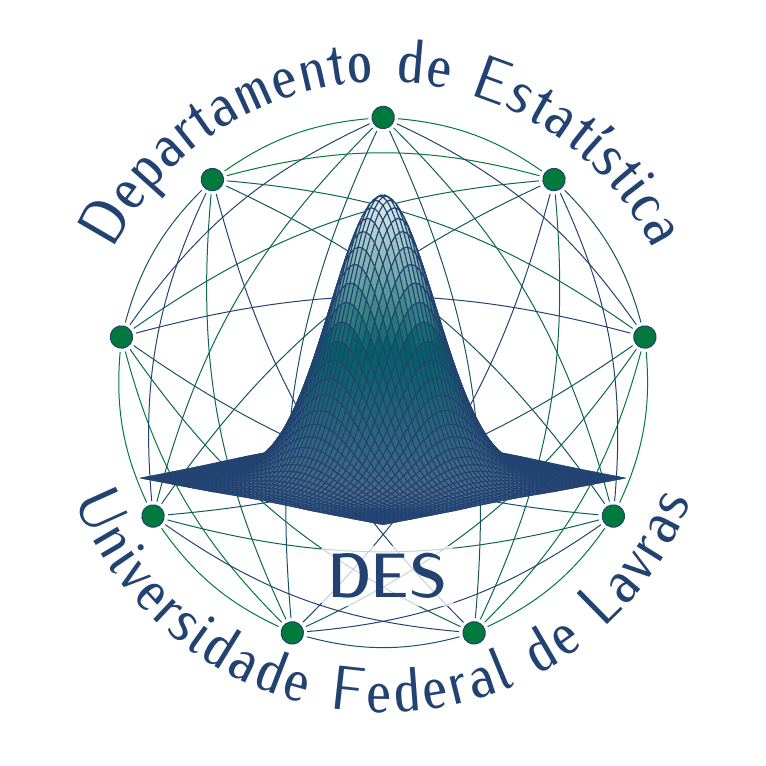

  * [des-ufla-2.pgf](https://github.com/walmes/Tikz/blob/master/src/des-ufla-2.pgf)

```tex
%-----------------------------------------------------------------------
%
% Logo do departamento de Estatística da UFLA · DES. O DES tem o
% programa de pós graduação em Estatística e Experimentação
% Agropecuária.
%
% O logo foi elaborado em parceria com o Prof. Daniel F. Ferreira que
% começou os esboços.  A ideia da normal bivariada é do Prof. Daniel. A
% ideia de adicionar o grafo é minha. A lógica foi de usar a normal
% bivariada para representar a Estatística e o grafo para representar a
% Experimentação Agropecuária.
%
% O grafo é ligação entre os tratamentos do mesmo bloco em um
% delineamento látice reticulado 3 x 3. Neste delineamento são 4
% repetições dos tratamentos (r = 4), cada uma delas com 3 blocos (b =
% 3) de tamanho 3 (v = 3) para acomodar os 9 tratamentos (t = 9). Cada
% par de tratamento ocorre junto uma vez no experimento.
%
%-----------------------------------------------------------------------

%-----------------------------------------------------------------------
%
% library(tidyverse)
%
% # x <- scan()
% # dput(x)
%
% # Os dados do delineamento.
% trt <- c(1, 2, 3, 4, 5, 6, 7, 8, 9, 1, 4, 7, 2, 5, 8, 3, 6, 9, 1, 5, 9,
%          7, 2, 6, 4, 8, 3, 1, 8, 6, 4, 2, 9, 7, 5, 3)
% da <- data.frame(rpt = gl(4, 9),
%                  blc = gl(12, 3),
%                  trt = trt)
% da
%
% # Quebra nas rpt/blc para criar as conexões.
% da <- da %>%
%     group_by(rpt, blc) %>%
%     do(con = {
%         x <- t(combn(x = sort(.$trt), m = 2))
%         colnames(x) <- c("from", "to")
%         as.data.frame(x)
%     }) %>%
%     unnest()
%
% # Interpola o verde a azul da criar cores intermediárias.
% ufla_cols <- colorRampPalette(colors = c("#00793C", "#224271"))(4)
% col_defs <- sprintf("\\definecolor{ufla_color%s}{HTML}{%s}",
%                     LETTERS[seq_along(ufla_cols)],
%                     gsub("#", "", my_cols))
% cat(col_defs, sep = "\n")
%
% # Cria as conexões em Tikz.
% txt <- with(da,
%             sprintf("\\path (u%d) edge[bend %s = \\bend, color = %s] (u%d);",
%                     from,
%                     ifelse((to - from) > 4, "left", "right"),
%                     sprintf("ufla_color%s", LETTERS[rpt]),
%                     to))
% cat(txt, sep = "\n")
%
%-----------------------------------------------------------------------
\begin{tikzpicture}%

  % 00793C é o verde UFLA.
  % 224271 é o azul UFLA.
  \definecolor{ufla_green}{HTML}{00793C}
  \definecolor{ufla_blue}{HTML}{224271}

  \begin{scope}[
    scale = .5,
    auto = left,
    every node/.style = {circle, fill = black!20}
    ]

    \def\treatments{9}
    \def\theangle{360/\treatments}

    \begin{scope}[rotate = 0.25 * \theangle]

      \foreach \x in {1, ..., \treatments} {
        \coordinate (u\x) at (\x * \theangle:7.5);
        \draw[color = ufla_blue, fill = ufla_green]
        (u\x) circle [radius = 0.9em];
      }

    \end{scope}

    % Reticulado quadrado 3 x 3. Definido no código R.
    \def\bend{15}

    \definecolor{ufla_colorA}{HTML}{00793C}
    \definecolor{ufla_colorB}{HTML}{0B664D}
    \definecolor{ufla_colorC}{HTML}{16545F}
    \definecolor{ufla_colorD}{HTML}{224271}

    \begin{scope}[
      draw = ufla_blue,
      shorten <= 0.6em,
      shorten >= 0.6em
      ]

      \path (u1) edge[bend right = \bend, color = ufla_colorA] (u2);
      \path (u1) edge[bend right = \bend, color = ufla_colorA] (u3);
      \path (u2) edge[bend right = \bend, color = ufla_colorA] (u3);
      \path (u4) edge[bend right = \bend, color = ufla_colorA] (u5);
      \path (u4) edge[bend right = \bend, color = ufla_colorA] (u6);
      \path (u5) edge[bend right = \bend, color = ufla_colorA] (u6);
      \path (u7) edge[bend right = \bend, color = ufla_colorA] (u8);
      \path (u7) edge[bend right = \bend, color = ufla_colorA] (u9);
      \path (u8) edge[bend right = \bend, color = ufla_colorA] (u9);
      \path (u1) edge[bend right = \bend, color = ufla_colorB] (u4);
      \path (u1) edge[bend left = \bend, color = ufla_colorB] (u7);
      \path (u4) edge[bend right = \bend, color = ufla_colorB] (u7);
      \path (u2) edge[bend right = \bend, color = ufla_colorB] (u5);
      \path (u2) edge[bend left = \bend, color = ufla_colorB] (u8);
      \path (u5) edge[bend right = \bend, color = ufla_colorB] (u8);
      \path (u3) edge[bend right = \bend, color = ufla_colorB] (u6);
      \path (u3) edge[bend left = \bend, color = ufla_colorB] (u9);
      \path (u6) edge[bend right = \bend, color = ufla_colorB] (u9);
      \path (u1) edge[bend right = \bend, color = ufla_colorC] (u5);
      \path (u1) edge[bend left = \bend, color = ufla_colorC] (u9);
      \path (u5) edge[bend right = \bend, color = ufla_colorC] (u9);
      \path (u2) edge[bend right = \bend, color = ufla_colorC] (u6);
      \path (u2) edge[bend left = \bend, color = ufla_colorC] (u7);
      \path (u6) edge[bend right = \bend, color = ufla_colorC] (u7);
      \path (u3) edge[bend right = \bend, color = ufla_colorC] (u4);
      \path (u3) edge[bend left = \bend, color = ufla_colorC] (u8);
      \path (u4) edge[bend right = \bend, color = ufla_colorC] (u8);
      \path (u1) edge[bend left = \bend, color = ufla_colorD] (u6);
      \path (u1) edge[bend left = \bend, color = ufla_colorD] (u8);
      \path (u6) edge[bend right = \bend, color = ufla_colorD] (u8);
      \path (u2) edge[bend right = \bend, color = ufla_colorD] (u4);
      \path (u2) edge[bend left = \bend, color = ufla_colorD] (u9);
      \path (u4) edge[bend left = \bend, color = ufla_colorD] (u9);
      \path (u3) edge[bend right = \bend, color = ufla_colorD] (u5);
      \path (u3) edge[bend right = \bend, color = ufla_colorD] (u7);
      \path (u5) edge[bend right = \bend, color = ufla_colorD] (u7);

    \end{scope}

    % Referências.
    % \draw circle [radius = 7.5cm];
    % \draw (-4, 0) -- (4, 0);
    % \draw (0, -4) -- (0, 4);

  \end{scope}

  \begin{scope}[
    xshift = -3.43cm,
    yshift = -2.0cm
    ]

    \begin{axis}[
      domain   = -2.3:2.3,
      domain y = -2.3:2.3,
      view = {-45}{12},
      % xlabel=$\beta_0$,
      % ylabel=$\beta_1$,
      % zlabel={$SSE(\beta_0, \beta_1)$},
      zmin = -0,
      xticklabels = \empty,
      yticklabels = \empty,
      zticklabels = \empty,
      axis lines = none,
      declare function = {mu1 = 0;},
      declare function = {mu2 = 0;},
      declare function = {sigma1 = 1.0;},
      declare function = {sigma2 = 1.0;},
      declare function = {
        bivar(\ma,\sa,\mb,\sb)=
        1/(2*pi*\sa*\sb)*exp(-((x-\ma)^2/\sa^2+(y-\mb)^2/\sb^2))/2;
      }
      ]

      \addplot3 [
      surf,
      % samples = 10,
      samples = 60,
      % opacity = 0.75,
      faceted color = ufla_blue,
      colormap = {blueblack}{
       color = (ufla_blue!80!white)
       color = (ufla_green!80!blue)
       color = (ufla_green!90!blue!10!white)},
      ] {bivar(mu1, sigma1, mu2, sigma2)};

      % Linhas de referencia.
      % \draw (axis cs:-3,  0, 0) -- (axis cs: 3, 0, 0);
      % \draw (axis cs: 0, -3, 0) -- (axis cs: 0, 3, 0);

    \end{axis}

  \end{scope}

  \def\radius{4.25}

  % Contornos de referencia.
  % \draw[gray] circle (\radius);
  % \draw[gray] circle (4.65);

 \path [
  postaction = {
    decorate,
    decoration = {
      raise = -0ex,
      text along path,
      reverse path,
      text align = center,
      text color = ufla_blue,
      text={|\Huge|Departamento de Estat{\'i}stica}
    }
  }] (0:\radius cm) arc (0:180:\radius cm);

  \path [
  postaction = {
    decorate,
    decoration = {
      raise = -2ex,
      text along path,
      reverse path,
      text align = center,
      text color = ufla_blue,
      text={|\Huge|Universidade Federal de Lavras}
    }
  }] (-0:1.02*\radius cm) arc (-0:-180:1.02*\radius cm);

  \node[
  font = \Huge\scshape\bfseries,
  color = ufla_blue,
  text opacity = 1,
  fill opacity = 0.75,
  fill = white,
  rectangle,
  rounded corners = 3pt] at (0.06, -2.72) {DES};

  \draw[white] circle (5);

\end{tikzpicture}%
```
****


  * [dest.pgf](https://github.com/walmes/Tikz/blob/master/src/dest.pgf)

```tex
\def\textangle{3.3}%

\begin{tikzpicture}[
  % scale = 0.5,
  shape1/.style = {
    draw = none, xshift = 0cm,    yshift = 0cm,    scale = 1},
  shape2/.style = {
    draw = none, xshift = 0.44cm, yshift = -0.1cm, scale = 1.26},
  shape3/.style = {
    draw = none, xshift = 0.88cm, yshift = -0.2cm, scale = 1.52}
  ]

  \def\arcs{%
    (0, 0) arc (-21:76:1.8cm and 2.05cm) --
    +(-0.97, -0.78) arc (83:4:2.52cm and 2.1cm)
  }

  % Colors.
  \definecolor{col1}{HTML}{BFB9D1}%
  \definecolor{col2}{HTML}{8072A3}%
  \definecolor{col3}{HTML}{2A0E72}%

  % \node {\includegraphics[width=7cm]{labestData.png}};

  % Help circles and axes.
  % \foreach \a in {0, 120, 240}{
  % \draw [blue, rotate = \a] (0, 0) -- (-0.14, 0.85);
  % \draw [red, rotate = \a] (0, 0) -- (2.06, -1.1);
  % };
  % \draw [red] (0, 0) circle (2.33cm);
  % \draw [blue] (0, 0) circle (0.86cm);

  \begin{scope}[
    xshift = 2.06cm, yshift = -1.1cm
    ]
    \draw [fill = col3, shape3] \arcs;
    \draw [fill = col1, shape2] \arcs;
    \draw [fill = col2, shape1] \arcs;
  \end{scope}

  \begin{scope}[
    rotate around = {120:(0, 0)},
    xshift = 2.06cm, yshift = -1.1cm
    ]
    \draw [fill = col3, shape3] \arcs;
    \draw [fill = col2, shape2] \arcs;
    \draw [fill = col1, shape1] \arcs;
  \end{scope}

  \begin{scope}[
    rotate around = {240:(0, 0)},
    xshift = 2.06cm, yshift = -1.1cm
    ]
    \draw [fill = col1, shape3] \arcs;
    \draw [fill = col2, shape2] \arcs;
    \draw [fill = col3, shape1] \arcs;
  \end{scope}

%   \node at (0,-3.8) {\huge \textcolor{col3}{DEST/UFPR}};

% \draw[
%   draw = none, very thick,
%   postaction = {decorate},
%   decoration = {text along path,
%     text = {|\large|Departamento de Estat{\'i}stica {$\boldsymbol{\cdot}$} UFPR},
%   text align = center,
%   text color = col3}]
%   (180:\textangle) arc [start angle = 180, end angle = 0, radius = \textangle];

\draw[
  draw = none, very thick,
  postaction = {decorate},
  decoration = {text along path,
    text = {|\large|Departamento de Estat{\'i}stica {$\boldsymbol{\cdot}$} UFPR},
  text align = center,
  text color = col3}]
  (180:\textangle+0.3) arc [start angle = -180, end angle = 0, radius = \textangle+0.3];

% \draw[draw = gray] circle (\textangle+0.5);

\end{tikzpicture}%
```
****

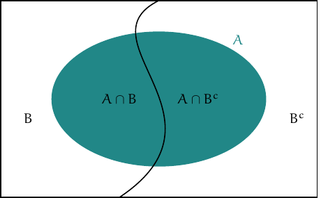

  * [diagrama_venn1.pgf](https://github.com/walmes/Tikz/blob/master/src/diagrama_venn1.pgf)

```tex
\begin{tikzpicture}
  % \draw[thick] (0,0) -- (0,5) -- (8,5) -- (8,0) -- (0,0);
  \draw[thick] (0,0) rectangle (8,5);
  \draw[thick, color=darkgreen, fill] (4,2.5) ellipse (2.7cm and 1.7cm);
  \draw[thick] (3,0) .. controls (6,2) and (2,4) .. (4,5);
  \node (n1) at (6,4) {\textcolor{darkgreen}{$A$}};
  \node (n2) at (0.7,2) {$B$};
  \node (n2) at (3,2.5) {$A\cap B$};
  \node (n2) at (5,2.5) {$A\cap B^c$};
  \node (n3) at (7.5,2) {$B^c$};
\end{tikzpicture}
```
****

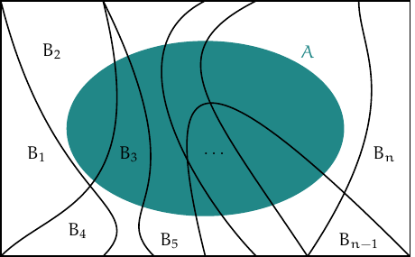

  * [diagrama_venn2.pgf](https://github.com/walmes/Tikz/blob/master/src/diagrama_venn2.pgf)

```tex
\begin{tikzpicture}
  \draw[thick] (0,0) rectangle (8,5);
  \draw[thick, color=darkgreen, fill] (4,2.5) ellipse (2.7cm and 1.7cm);
  \draw[thick] (0,0) .. controls (1,1) and (3,1) .. (2,5);
  \draw[thick] (0,5) .. controls (1,1) and (3,1) .. (2,0);
  \draw[thick] (3,0) .. controls (2,1) and (4,1) .. (2,5);
  \draw[thick] (4,5) .. controls (2,4) and (4,1) .. (5,0);
  \draw[thick] (4,0) .. controls (3,4) and (4,4) .. (8,0);
  \draw[thick] (5,5) .. controls (3,4) and (4,3) .. (6,0);
  \draw[thick] (7,5) .. controls (7,4) and (8,3) .. (6,0);
  \node (n1) at (6,4) {\textcolor{darkgreen}{$A$}};
  \node (n2) at (0.7,2) {$B_1$};
  \node (n3) at (1,4) {$B_2$};
  \node (n2) at (2.5,2) {$B_3$};
  \node (n3) at (1.5,0.5) {$B_4$};
  \node (n2) at (3.3,0.3) {$B_5$};
  \node (n3) at (4.2,2) {$\cdots$};
  \node (n2) at (7,0.3) {$B_{n-1}$};
  \node (n3) at (7.5,2) {$B_n$};
\end{tikzpicture}
```
****

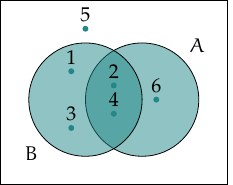

  * [diagrama_venn3.pgf](https://github.com/walmes/Tikz/blob/master/src/diagrama_venn3.pgf)

```tex
\begin{tikzpicture}[
  scale=0.5,
  mycircle/.style={
    draw, circle, fill=darkgreen, fill opacity=0.5, minimum width=2cm
  }]
  % \draw[help lines] (0,0) grid (8,6);
  \draw (0,0) rectangle (8,6.5);
  \node[mycircle, label={[anchor=north]above right:$A$}] at (5,3) {};
  \node[mycircle, label={[anchor=north]below left:$B$}] at (3,3) {};
  \fill[darkgreen] (2.5,4) circle (3pt) node [above, color=black] {$1$};
  \fill[darkgreen] (2.5,2) circle (3pt) node [above, color=black] {$3$};
  \fill[darkgreen] (5.5,3) circle (3pt) node [above, color=black] {$6$};
  \fill[darkgreen] (4,2.5) circle (3pt) node [above, color=black] {$4$};
  \fill[darkgreen] (4,3.5) circle (3pt) node [above, color=black] {$2$};
  \fill[darkgreen] (3,5.5) circle (3pt) node [above, color=black] {$5$};
\end{tikzpicture}
```
****

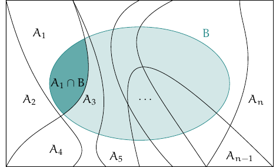

  * [diagrama_venn4.pgf](https://github.com/walmes/Tikz/blob/master/src/diagrama_venn4.pgf)

```tex
\def\first{(4,2.5) ellipse (2.7cm and 1.7cm)}
\def\second{
  (0,0) .. controls (1,2) and (3.5,1) .. (2,5) -- (0,5) -- (0,0)}
\begin{tikzpicture}
  \fill[fill=darkgreen!20] \first;
  \begin{scope}
    \clip \first;
    \fill[fill=darkgreen!70] \second;
  \end{scope}
  \node (e1) at (1.85,2.5) {$A_1\cap B$};
  \draw (0,0) rectangle (8,5);
  \draw[color=darkgreen] \first;
  \draw \second;
  \draw (0,5) .. controls (1,1) and (3,1) .. (2,0);
  \draw (3,0) .. controls (2,1) and (4,1) .. (2,5);
  \draw (4,5) .. controls (2,4) and (4,1) .. (5,0);
  \draw (4,0) .. controls (3,4) and (4,4) .. (8,0);
  \draw (5,5) .. controls (3,4) and (4,3) .. (6,0);
  \draw (7,5) .. controls (7,4) and (8,3) .. (6,0);
  \node (n1) at (6,4) {\textcolor{darkgreen}{$B$}};
  \node (n2) at (0.7,2) {$A_2$}; \node (n3) at (1,4) {$A_1$};
  \node (n2) at (2.5,2) {$A_3$}; \node (n3) at (1.5,0.5) {$A_4$};
  \node (n2) at (3.3,0.3) {$A_5$}; \node (n3) at (4.2,2) {$\cdots$};
  \node (n2) at (7,0.3) {$A_{n-1}$}; \node (n3) at (7.5,2) {$A_n$};
\end{tikzpicture}
```
****

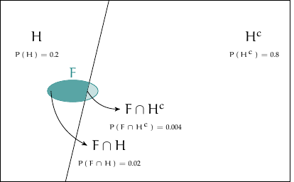

  * [diagrama_venn5.pgf](https://github.com/walmes/Tikz/blob/master/src/diagrama_venn5.pgf)

```tex
\begin{tikzpicture}[node distance=0.8cm, scale=0.9]
  \def\evA{(1.8,0) -- (3,5) -- (0,5) -- (0,0)}
  \def\evB{(2,2.5) ellipse (0.7cm and 0.3cm)}
  \draw (0,0) -- (0,5) -- (8,5) -- (8,0) -- (0,0);
  \draw[color=darkgreen, fill=darkgreen!25] \evB;
  \draw \evA;
  \begin{scope}
    \clip \evA;
    \fill[fill=darkgreen!75] \evB;
  \end{scope}
  \node (n1) at (2,3) {\textcolor{darkgreen}{$F$}};
  \node (n2) at (1,4) {$H$} node[below of=n2,
  label={\tiny$P(H)=0.2$}]{};
  \node (n3) at (7,4) {$H^c$} node[below of=n3,
  label={\tiny$P(H^c)=0.8$}]{};
  \node (q1) at (3,1) {$F\cap H$} node[below of=q1,
  label={\tiny$P(F\cap H)=0.02$}]{};
  \node (q2) at (4,2) {$F\cap H^c$} node[below of=q2,
  label={\tiny$P(F\cap H^c)=0.004$}]{};
  \path[->,>=stealth'] (1.4,2.5) edge[bend right] node [left] {}
  (q1.west) (2.4,2.5) edge[bend right] node [left] {} (q2.west);
\end{tikzpicture}
```
****

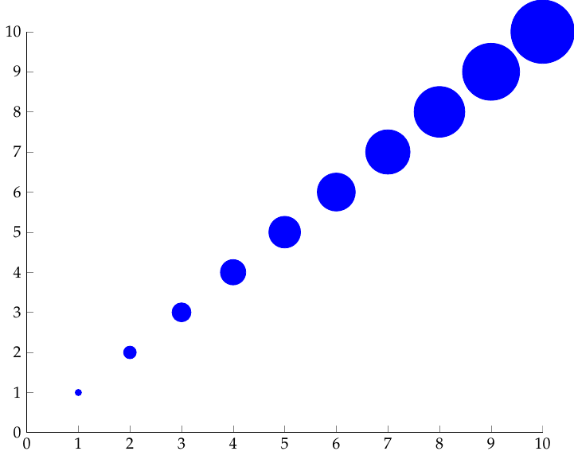

  * [dispersao_filecontents.pgf](https://github.com/walmes/Tikz/blob/master/src/dispersao_filecontents.pgf)

```tex
\begin{filecontents*}{temp.dat}
  1   1   100
  2   2   200
  3   3   300
  4   4   400
  5   5   500
  6   6   600
  7   7   700
  8   8   800
  9   9   900
  10  10  1000
\end{filecontents*}

\begin{tikzpicture}
  \begin{axis}[%
    width=4.5in,
    height=3.5in,
    scale only axis,
    xmin=0,
    xmax=10,
    ymin=0,
    ymax=10,
    axis x line*=bottom,
    axis y line*=left]
    \addplot[%
    scatter=true,
    only marks,
    mark=*,
    color=blue,
    point meta=explicit symbolic,
    scatter/@pre marker code/.style={
      /tikz/mark size=\pgfplotspointmeta/50},
    scatter/@post marker code/.style={}
    ] table [meta index=2] {temp.dat};
  \end{axis}
\end{tikzpicture}%
```
****

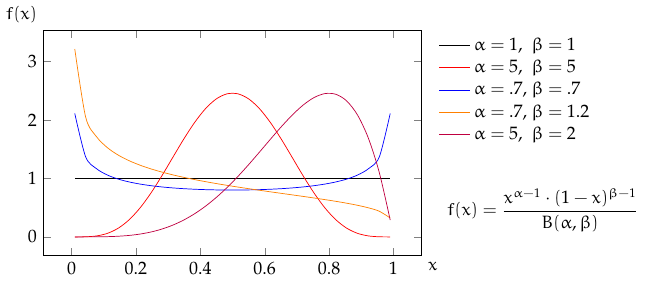

  * [dist_beta.pgf](https://github.com/walmes/Tikz/blob/master/src/dist_beta.pgf)

```tex
\begin{tikzpicture}[
  declare function={
    gamma(\z) =
    (2.506628274631*sqrt(1/\z)+0.20888568*(1/\z)^(1.5)+
    0.00870357*(1/\z)^(2.5)-(174.2106599*(1/\z)^(3.5))/25920-
    (715.6423511*(1/\z)^(4.5))/1244160)*exp((-ln(1/\z)-1)*\z);
  },
  declare function={
    beta(\a,\b) = gamma(\a)*gamma(\b)/gamma(\a+\b);
  },
  declare function={
    betapdf(\x,\a,\b) = \x^(\a-1)*(1-\x)^(\b-1)/beta(\a,\b);
  }]

  \begin{axis}[
    width=9cm, height=6cm,
    samples=30,
    xlabel=$x$, ylabel=$f(x)$,
    xlabel style={at={(1,0)}, anchor=north west},
    ylabel style={rotate=-90, at={(0,1)}, anchor=south east},
    legend style={draw=none, fill=none},
    domain=0.01:0.99,
    legend pos=outer north east,
    legend cell align=left,
    clip=false]

    \addplot[smooth] {betapdf(x,1,1)};
    \addlegendentry{$\alpha=1$, $\phantom{.}\beta=1$};

    \addplot[smooth, red] {betapdf(x,5,5)};
    \addlegendentry{$\alpha=5$, $\phantom{.}\beta=5$};

    \addplot[smooth, blue] {betapdf(x,.7,.7)};
    \addlegendentry{$\alpha=.7$, $\beta=.7$};

    \addplot[smooth, orange] {betapdf(x,.7,1.2)};
    \addlegendentry{$\alpha=.7$, $\beta=1.2$};

    \addplot[smooth, purple] {betapdf(x,5,2)};
    \addlegendentry{$\alpha=5$, $\phantom{.}\beta=2$};

    \node[anchor=west] at (axis description cs: 1.05, 0.2)
    {$f(x) = \dfrac{x^{\alpha-1}\cdot(1-x)^{\beta-1}}{
        B(\alpha, \beta)}$};

  \end{axis}
\end{tikzpicture}
```
****

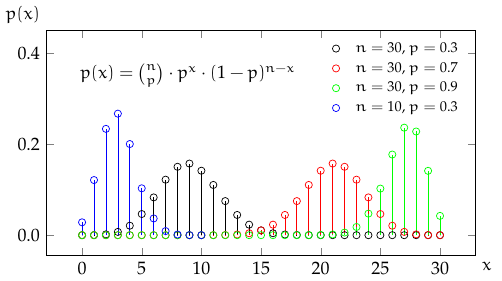

  * [dist_binom.pgf](https://github.com/walmes/Tikz/blob/master/src/dist_binom.pgf)

```tex
\begin{tikzpicture}[
  declare function={
    binompf(\k,\n,\p)=\n!/(\k!*(\n-\k)!)*\p^\k*(1-\p)^(\n-\k);
  },
  hplot/.style={ycomb, mark=o}]

  \begin{axis}[
    width=10cm, height=6cm,
    xlabel=$x$, ylabel=$p(x)$,
    xlabel style={at={(1,0)}, anchor=north west},
    ylabel style={rotate=-90, at={(0,1)}, anchor=south east},
    legend style={draw=none, fill=none, font=\footnotesize},
    legend cell align=left,
    ymax=0.45,
    samples at={0,1,...,30},
    yticklabel style={
      /pgf/number format/fixed,
      /pgf/number format/fixed zerofill,
      /pgf/number format/precision=1
    }]

    \addplot[hplot] {binompf(x, 30, 0.3)};
    \addlegendentry{$n=30$, $p=0.3$}

    \addplot[hplot, red] {binompf(x, 30, 0.7)};
    \addlegendentry{$n=30$, $p=0.7$}

    \addplot[hplot, green] {binompf(x, 30, 0.9)};
    \addlegendentry{$n=30$, $p=0.9$}

    \addplot[hplot, blue, samples at={0,1,...,10}]
    {binompf(x, 10, 0.3)};
    \addlegendentry{$n=10$, $p=0.3$}

    \node at (axis description cs: 0.33, 0.8)
    {$p(x) = \binom{n}{p}\cdot p^x \cdot (1-p)^{n-x} $};

  \end{axis}
\end{tikzpicture}
```
****

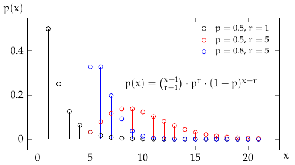

  * [dist_bneg.pgf](https://github.com/walmes/Tikz/blob/master/src/dist_bneg.pgf)

```tex
\begin{tikzpicture}[
  declare function={
    binom(\n,\x)=(\n!)/(\x!*(\n-\x)!);
  },
  declare function={
    bnegpf(\k,\p,\r)=(binom(\k-1, \r-1))*\p^(\r)*(1-\p)^(\k-\r);
  },
  hplot/.style={ycomb, mark=o}]

  \begin{axis}[
    width=10cm, height=6cm,
    xlabel=$x$, ylabel=$p(x)$,
    xlabel style={at={(1,0)}, anchor=north west},
    ylabel style={rotate=-90, at={(0,1)}, anchor=south east},
    legend style={draw=none, fill=none, font=\footnotesize},
    legend cell align=left]

    \addplot[hplot, samples at={1,2,...,21}]
    {bnegpf(x, 0.5, 1)};
    \addlegendentry{$p=0.5$, $r=1$}

    \addplot[hplot, samples at={5,6,...,21}, red]
    {bnegpf(x, 0.5, 5)};
    \addlegendentry{$p=0.5$, $r=5$}

    \addplot[hplot, samples at={5,6,...,21}, blue]
    {bnegpf(x, 0.8, 5)};
    \addlegendentry{$p=0.8$, $r=5$}

    \node at (axis description cs: 0.65, 0.5)
    {$p(x) = \binom{x-1}{r-1} \cdot p^r \cdot (1-p)^{x-r}$};

  \end{axis}
\end{tikzpicture}
```
****

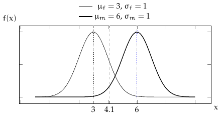

  * [dist_duas_normais.pgf](https://github.com/walmes/Tikz/blob/master/src/dist_duas_normais.pgf)

```tex
\begin{tikzpicture}[
  declare function={
    normalpdf(\x,\mu,\sigma)=
    (2*3.1415*\sigma^2)^(-0.5)*exp(-(\x-\mu)^2/(2*\sigma^2));
  }]

  \def\muA{3}
  \def\muB{6}
  \def\sA{1}
  \def\sB{1}
  \def\k{4.1}
  \def\xmin{-1}
  \def\xmax{10}
  \def\ymin{-0.01}
  \def\ymax{0.43}

  \begin{axis}[
    width=10cm, height=5cm,
    samples=50,
    domain=\xmin:\xmax,
    xlabel=$x$, ylabel=$f(x)$,
    xlabel style={at={(1,0)}, anchor=north west},
    ylabel style={rotate=-90, at={(0,1)}, anchor=south east},
    xticklabels=\empty,
    yticklabels=\empty,
    extra x ticks={\k,\muA,\muB},
    extra x tick labels={\k,\muA,\muB},
    extra tick style={grid=major, color=black, dashed, thick},
    legend style={draw=none, fill=none},
    every axis legend/.append style={at={(0.5,1.03)}, anchor=south}]

    \addplot [smooth] {normalpdf(x,\muA,\sA)};
    \addlegendentry{$\mu_f=\muA$, $\sigma_f=\sA$};
    \addplot [smooth, thick] {normalpdf(x,\muB,\sB)};
    \addlegendentry{$\mu_m=\muB$, $\sigma_m=\sB$};
    \addplot [ycomb, mark=o, samples at={\muA}, dotted]
      {normalpdf(x,\muA,\sA)};
    \addplot [ycomb, mark=o, samples at={\muB}, dotted, blue]
      {normalpdf(x,\muB,\sB)};
  \end{axis}
\end{tikzpicture}
```
****

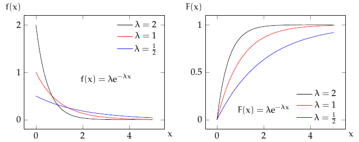

  * [dist_expon.pgf](https://github.com/walmes/Tikz/blob/master/src/dist_expon.pgf)

```tex
\pgfplotsset{
  myplot/.style={
    width=7cm, height=6cm,
    samples=50, domain=0:5, smooth, no marks,
    xlabel=$x$,
    xlabel style={at={(1,0)}, anchor=north west},
    ylabel style={rotate=-90, at={(0,1)}, anchor=south east},
    legend style={draw=none, fill=none},
    % title={Distribui\c{c}\~{a}o Exponencial}
  }
}

\begin{tikzpicture}[
  declare function={
    exppdf(\x,\lambda) = \lambda*exp(-\lambda*\x);
  },
  declare function={
    expcdf(\x,\lambda) = 1-exp(-\lambda*\x);
  }]

  \begin{axis}[myplot, ylabel=$f(x)$]
    \addplot[color=black] {exppdf(x,2)};
    \addlegendentry{$\lambda=2$};
    \addplot[color=red] {exppdf(x,1)};
    \addlegendentry{$\lambda=1$};
    \addplot[color=blue] {exppdf(x,0.5)};
    \addlegendentry{$\lambda=\frac{1}{2}$};
    \node[rotate=0] at (axis cs: 3,  0.85)
    {$f(x) = \displaystyle \lambda \text{e}^{-\lambda x}$};
  \end{axis}

  \begin{axis}[myplot, xshift=7cm, ylabel=$F(x)$, legend pos=south east]
    \addplot[color=black] {expcdf(x,2)};
    \addlegendentry{$\lambda=2$};
    \addplot[color=red] {expcdf(x,1)};
    \addlegendentry{$\lambda=1$};
    \addplot[color=blue] {expcdf(x,0.5)};
    \addlegendentry{$\lambda=\frac{1}{2}$};
    \node at (axis cs: 2,  0.1)
    {$F(x) = \displaystyle \lambda \text{e}^{-\lambda x}$};
  \end{axis}

\end{tikzpicture}
```
****

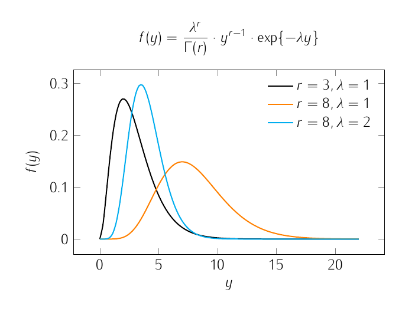

  * [dist_gamma.pgf](https://github.com/walmes/Tikz/blob/master/src/dist_gamma.pgf)

```tex
\begin{tikzpicture}[
  declare function={
    gamma(\z) =
    (2.506628274631*sqrt(1/\z)+0.20888568*(1/\z)^(1.5)+
    0.00870357*(1/\z)^(2.5)-(174.2106599*(1/\z)^(3.5))/25920-
    (715.6423511*(1/\z)^(4.5))/1244160)*exp((-ln(1/\z)-1)*\z);
  },
  declare function={
    gammapdf(\x,\a,\b) = (\b^\a)*\x^(\a-1)*exp(-\b*\x)/gamma(\a);
  }]

  \begin{axis}[
    width=9cm, height=6cm,
    samples=80, no marks, smooth,
    xlabel=$x$, ylabel=$f(x)$,
    xlabel style={at={(1,0)}, anchor=north west},
    ylabel style={rotate=-90, at={(0,1)}, anchor=south east},
    legend style={draw=none, fill=none},
    domain=0:22]

    \addplot[black] {gammapdf(x,3,1)};
    \addlegendentry{$\alpha=3, \beta=1$}

    \addplot[blue] {gammapdf(x,8,1)};
    \addlegendentry{$\alpha=8, \beta=1$}

    \addplot[red] {gammapdf(x,8,2)};
    \addlegendentry{$\alpha=8, \beta=2$}

    \node[anchor=east] at (axis description cs: 1,  0.5)
    {$f(x) = \dfrac{\beta^{\alpha}}{\Gamma(\alpha)}\cdot
      x^{\alpha-1} \cdot \text{e}^{-\beta x}$};

  \end{axis}
\end{tikzpicture}
```
****

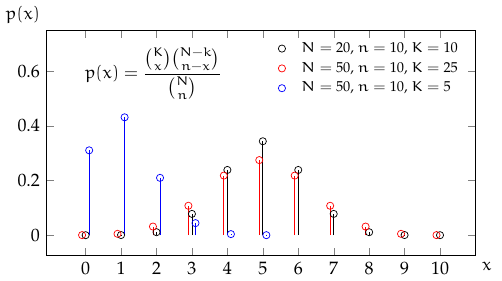

  * [dist_hiper.pgf](https://github.com/walmes/Tikz/blob/master/src/dist_hiper.pgf)

```tex
\begin{tikzpicture}[
  declare function={
    binom(\n,\x) = (\n!)/(\x!*(\n-\x)!);
  },
  declare function={
    hiperpf(\x,\N,\n,\K) = binom(\K, \x)*binom(\N-\K, \n-\x)/binom(\N, \n);
  },
  hplot/.style={ycomb, mark=o}]

  \begin{axis}[
    width=10cm, height=6cm,
    xlabel=$x$, ylabel=$p(x)$,
    xlabel style={at={(1,0)}, anchor=north west},
    ylabel style={rotate=-90, at={(0,1)}, anchor=south east},
    legend style={draw=none, fill=none, font=\footnotesize},
    legend cell align=left,
    xtick={0,1,...,10},
    ymax=0.75]

    \addplot[hplot, samples at={0,1,...,10}]
    (x, {hiperpf(x, 20, 10, 10)});
    \addlegendentry{$N=20$, $n=10$, $K=10$}

    \addplot[hplot, samples at={0,1,...,10}, red]
    (x-0.1, {hiperpf(x, 50, 10, 25)});
    \addlegendentry{$N=50$, $n=10$, $K=25$}

    \addplot[hplot, samples at={0,1,...,5}, blue]
    (x+0.1, {hiperpf(x, 50, 10, 5)});
    \addlegendentry{$N=50$, $n=10$, $K=5$}

    \node[anchor=north] at (axis description cs: 0.25, 0.95)
    {$p(x) = \dfrac{\binom{K}{x} \binom{N-k}{n-x}}{\binom{N}{n}}$};

  \end{axis}
\end{tikzpicture}
```
****

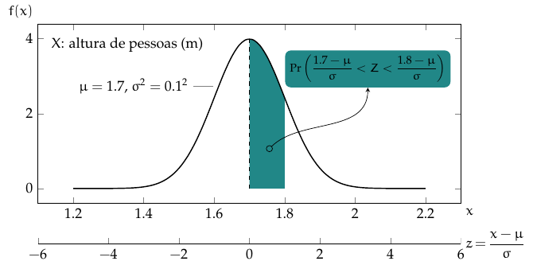

  * [dist_normal_pad.pgf](https://github.com/walmes/Tikz/blob/master/src/dist_normal_pad.pgf)

```tex
\pgfplotsset{
  myplot/.style={
    width=12cm, height=6cm,
    samples=50, smooth, no marks,
    xlabel=$x$, ylabel=$f(x)$,
    xlabel style={at={(1,0)}, anchor=north west},
    ylabel style={rotate=-90, at={(0,1)}, anchor=south east},
    legend style={draw=none, fill=none}
  }
}

\begin{tikzpicture}[
  >=stealth,
  every node/.style={rounded corners},
  declare function={
    normalpdf(\x,\mu,\sigma)=
    (2*pi*\sigma^2)^(-0.5)*exp(-(\x-\mu)^2/(2*\sigma^2));
  },
  hplot/.style={ycomb, mark=o, dashed}]

  \begin{axis}[myplot, xmin=1.1, xmax=2.3]

    \addplot[domain=1.7:1.8, draw=none, fill=darkgreen]
    {normalpdf(x,1.7,0.1)} \closedcycle;
    \addplot[smooth, thick, domain=1.2:2.2]
    {normalpdf(x,1.7,0.1)}
    node[pos=0.35, pin={left:$\mu=1.7$, $\sigma^2=0.1^2$}] {};
    \addplot[hplot, samples at={1.7}] {normalpdf(x,1.7,0.1)};
    
    \node[anchor=north west] at (axis description cs: 0.02, 0.95)
    {$X$: altura de pessoas (m)};

    \coordinate (p0) at (axis cs: 1.75, 1);
    \node[fill=darkgreen, draw=none] (p1)
    at (axis description cs: 0.78, 0.75)
    {\footnotesize $\displaystyle \Pr\left(\frac{1.7-\mu}{\sigma}<
        Z<\frac{1.8-\mu}{\sigma}\right)$};
    \path[o->] (p0) edge[out=45, in=-90] (p1);

  \end{axis}

  \begin{scope}[yshift=-1cm]
    \begin{axis}[
      myplot,
      hide y axis,
      axis x line*=bottom,
      xlabel=$z{\,=\,}\dfrac{x-\mu}{\sigma}$,
      xlabel style={at={(1,0)}, anchor=west},
      domain=-4:4,
      xmin=-6, xmax=6]
      \addplot[draw=none] {x};
    \end{axis}
  \end{scope}

\end{tikzpicture}
```
****

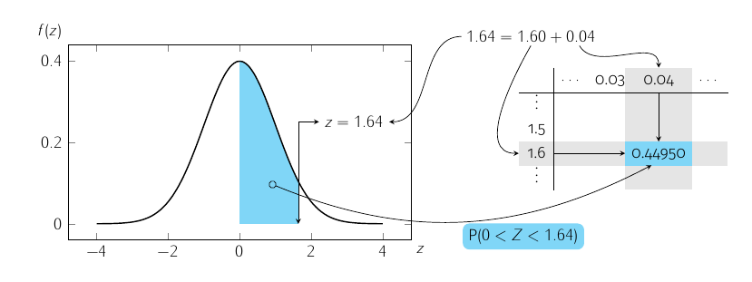

  * [dist_normal_tab.pgf](https://github.com/walmes/Tikz/blob/master/src/dist_normal_tab.pgf)

```tex
\tikzset{ 
  >=stealth,
  table/.style={
    matrix of nodes,
    nodes={align=center},
    minimum height=1.5em,
    minimum width=1em,
    text depth=0.1ex,
    text height=1.2ex,
    nodes in empty cells,
    column 4/.style={
      nodes={text width=3.5em, fill=gray!20, rounded corners=false}
    },
    row 4/.style={
      nodes={fill=gray!20, rounded corners=false}
    }
  }
}

\pgfplotsset{
  myplot/.style={
    width=9cm, height=6cm,
    samples=50, smooth, no marks,
    xlabel style={at={(1,0)}, anchor=north west},
    ylabel style={rotate=-90, at={(0,1)}, anchor=south east},
    legend style={draw=none, fill=none},
    legend pos={north west}
  }
}

\begin{tikzpicture}[
  declare function={
    normalpdf(\x,\mu,\sigma)=
    (2*3.1415*\sigma^2)^(-0.5)*exp(-(\x-\mu)^2/(2*\sigma^2));
  }]

  \begin{scope}
    \begin{axis}[
      myplot,
      domain=-4:4,
      xlabel=$z$, ylabel=$f(z)$,
      title={Densidade da Normal Padr\~{a}o ($Z$)}]

      \addplot[domain=0:1.64, draw=none, fill=darkgreen]
      {normalpdf(x,0,1)} \closedcycle;
      \addplot[thick] {normalpdf(x,0,1)};
      % \addlegendentry{$\mu=0$, $\sigma^2=1$}
      \coordinate (p0) at (axis cs: 0.82,0.1);
      \draw[<->] (axis cs: 1.64,  0) |- (axis cs: 2.2, 0.25)
      node[right] {$z =1.64$};
    \end{axis}
  \end{scope}

  \begin{scope}[
    xshift=11cm, yshift=2.9cm,
    every node/.style={rounded corners}]

    \matrix[table, text width=1.5em] (first) {
                   & $\cdots$ & 0.03 & \textbf{0.04}                          & $\cdots$ \\
      $\vdots$     &          &      &                                        &          \\ 
      1.5          &          &      &                                        &          \\
      \textbf{1.6} &          &      & \node[black, fill=darkgreen]{0.44950}; &          \\
      $\vdots$     &          &      &                                        &          \\
    };

    \draw (first-1-2.north west) -- (first-5-2.south west);
    \draw (first-1-1.south west) -- (first-1-5.south east);
    \draw[->] (first-1-4) -- (first-4-4);
    \draw[->] (first-4-1) -- (first-4-4);

    \path[o->] (p0) edge[bend right=25]
    node[below=1pt, fill=darkgreen,
    draw=none, anchor=north west] {$\Pr(0<Z<z)$}
    (first-4-4.-140);

    \node[above of=first-1-3] {Tabela da Normal Padr\~{a}o};

  \end{scope}
\end{tikzpicture}
```
****

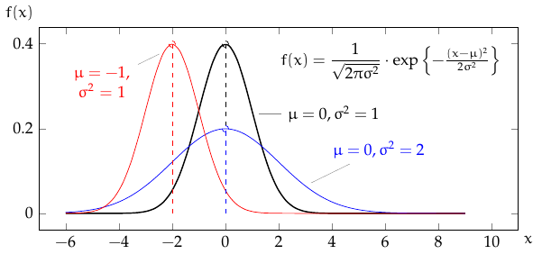

  * [dist_normal.pgf](https://github.com/walmes/Tikz/blob/master/src/dist_normal.pgf)

```tex
\begin{tikzpicture}[
  declare function={
    normalpdf(\x,\mu,\sigma)=
    (2*3.1415*\sigma^2)^(-0.5)*exp(-(\x-\mu)^2/(2*\sigma^2));
  },
  hplot/.style={ycomb, mark=o, dashed}]

  \begin{axis}[
    width=12cm, height=6cm,
    samples=50,
    xlabel=$x$, ylabel=$f(x)$,
    xlabel style={at={(1,0)}, anchor=north west},
    ylabel style={rotate=-90, at={(0,1)}, anchor=south east},
    legend style={draw=none, fill=none},
    domain=-6:9,
    legend cell align=left,
    xmin=-7, xmax=11]

    \addplot [smooth, thick] {normalpdf(x,0,1)}
    node[pos=0.47, pin={right:$\mu=0,\sigma^2=1$}] {};
    \addplot [smooth, blue] {normalpdf(x,0,2)}
    node[pos=0.6, pin={45:$\mu=0,\sigma^2=2$}] {};
    \addplot [smooth, red] {normalpdf(x,-2,1)}
    node[pos=0.25, pin={[text centered, text width=8ex]
      200:$\mu=-1$, $\sigma^2=1$}] {};

    \addplot [hplot, samples at={0}] {normalpdf(x,0,1)};
    \addplot [hplot, samples at={0}, blue] {normalpdf(x,0,2)};
    \addplot [hplot, samples at={-2}, red] {normalpdf(x,-2,1)};

    \node[anchor=north east] at (axis description cs: 0.975,  0.95)
    {$f(x) = \dfrac{1}{\sqrt{2\pi\sigma^2}}\cdot 
      \exp\left\{-\frac{(x-\mu)^2}{2\sigma^2}\right\}$};

  \end{axis}
\end{tikzpicture}
```
****

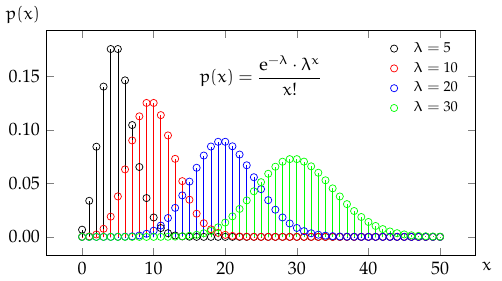

  * [dist_pois.pgf](https://github.com/walmes/Tikz/blob/master/src/dist_pois.pgf)

```tex
\begin{tikzpicture}[
  declare function={
    poispf(\k,\l) = exp(-\l)*(\l^\k)/(\k!);
  },
  hplot/.style={ycomb, mark=o}]

  \begin{axis}[
    width=10cm, height=6cm,
    xlabel=$x$, ylabel=$p(x)$,
    xlabel style={at={(1,0)}, anchor=north west},
    ylabel style={rotate=-90, at={(0,1)}, anchor=south east},
    legend style={draw=none, fill=none, font=\footnotesize},
    legend cell align=left,
    samples at={0,1,...,50},
    yticklabel style={
      /pgf/number format/fixed,
      /pgf/number format/fixed zerofill,
      % /pgf/number format/precision=2
    }]

    \addplot[hplot, black] {poispf(x, 5)};
    \addlegendentry{$\lambda=5$}
    \addplot[hplot, red] {poispf(x, 10)};
    \addlegendentry{$\lambda=10$}
    \addplot[hplot, blue] {poispf(x, 20)};
    \addlegendentry{$\lambda=20$}
    \addplot[hplot, green] {poispf(x, 30)};
    \addlegendentry{$\lambda=30$}

    \node at (axis description cs: 0.5, 0.8)
    {$p(x) = \dfrac{\text{e}^{-\lambda}\cdot \lambda^x}{x!}$};

  \end{axis}
\end{tikzpicture}
```
****

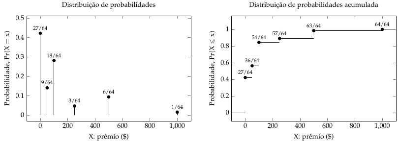

  * [dist_prob.pgf](https://github.com/walmes/Tikz/blob/master/src/dist_prob.pgf)

```tex
% No R:
% x <- c(0,50,100,250,500,1000);
% num <- c(27,9,18,3,6,1);
% den <- 64; px <- num/den
% data.frame(x=x, px=px, PX=cumsum(px),
% f=sprintf("%i/%i", num, den),
% F=sprintf("%i/%i", cumsum(num), den))

\pgfplotsset{
  myplot/.style={
    xlabel=$X$: pr\^emio (\$),
    ylabel=Probabilidade,
    width=10cm, height=7cm,
    mark=*,
    nodes near coords,
    point meta=explicit symbolic, % permite usar a 3 coluna como label.
    every node near coord/.append style={font=\footnotesize},
    nodes near coords align={vertical}
  }
}

\pgfplotstableread{
  i    x       px       PX     f     F
  1    0 0.421875 0.421875 27/64 27/64
  2   50 0.140625 0.562500  9/64 36/64
  3  100 0.281250 0.843750 18/64 54/64
  4  250 0.046875 0.890625  3/64 57/64
  5  500 0.093750 0.984375  6/64 63/64
  6 1000 0.015625 1.000000  1/64 64/64
}\distrprob

\begin{tikzpicture}
  \begin{axis}[
    myplot,
    ymin=-0.03,
    enlarge x limits=0.1,
    enlarge y limits={upper, value=0.2},
    ylabel={Probabilidade, $\Pr(X=x)$},
    title={Distribui\c{c}\~{a}o de probabilidades}]

    \addplot[thick, black, ycomb] table[x=x, y=px, meta=f] \distrprob;
  \end{axis}

  \begin{scope}[xshift=10.5cm]
    \begin{axis}[
      myplot,
      ymin=-0.1,
      enlarge x limits=0.1,
      enlarge y limits={upper, value=0.15},
      ylabel={Probabilidade, $\Pr(X\leq x)$},
      title={Distribui\c{c}\~{a}o de probabilidades acumulada}]

      \addplot[thick, black, const plot, jump mark left]
      table[x=x, y=PX, meta=F] \distrprob;
      \draw[gray] (axis cs: -100, 0) -- (axis cs: 0, 0);
      \draw[gray] (axis cs: 1000, 1) -- (axis cs: 1100, 1);
    \end{axis}
  \end{scope}
\end{tikzpicture}
```
****

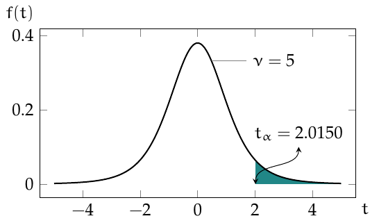

  * [dist_t_quantil.pgf](https://github.com/walmes/Tikz/blob/master/src/dist_t_quantil.pgf)

```tex
% http://tex.stackexchange.com/questions/80345/student-t-distribution-with-tikz

\begin{tikzpicture}[
  >=stealth,
  declare function={
    gamma(\z)=
    (2.506628274631*sqrt(1/\z)+0.20888568*(1/\z)^(1.5)+
    0.00870357*(1/\z)^(2.5)-(174.2106599*(1/\z)^(3.5))/25920-
    (715.6423511*(1/\z)^(4.5))/1244160)*exp((-ln(1/\z)-1)*\z);
  },
  declare function={
    student(\x,\n)=
    gamma((\n+1)/2)/(sqrt(\n*pi)*
    gamma(\n/2))*((1+(\x*\x)/\n)^(-(\n+1)/2));
  },
  declare function={
    normalpdf(\x,\mu,\sigma)=
    (2*3.1415*\sigma^2)^(-0.5)*exp(-(\x-\mu)^2/(2*\sigma^2));
  }]

  \begin{axis}[
    width=8cm, height=5cm,
    samples=30,
    xlabel=$t$, ylabel=$f(t)$,
    xlabel style={at={(1,0)}, anchor=north west},
    ylabel style={rotate=-90, at={(0,1)}, anchor=south east},
    legend style={draw=none, fill=none},
    domain=-5:5, xmin=-5.5, xmax=5.5]

    %% Quantil para \nu=5 e \alpha=0.05
    \addplot[domain=2.015:5, draw=none, fill=darkgreen, samples=30]
    {student(x,5)} \closedcycle;

    \addplot[smooth, thick, samples=100] {student(x,5)}
    node[pos=0.55, anchor=mid west, xshift=2em,
    append after command={
      (\tikzlastnode.west) edge [thin, gray] +(-2em,0)}]
    {$\nu=5$};

    \path[<->, draw] (axis cs: 2.015, 0.0) to[out=90, in=-90]
    (axis description cs: 0.82, 0.3) node[above] {$t_{\alpha}=2.0150$};

  \end{axis}
\end{tikzpicture}
```
****

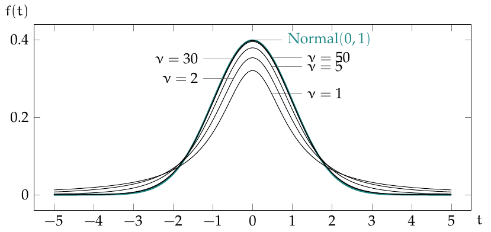

  * [dist_t.pgf](https://github.com/walmes/Tikz/blob/master/src/dist_t.pgf)

```tex
% http://tex.stackexchange.com/questions/80345/student-t-distribution-with-tikz

\begin{tikzpicture}[
  declare function={
    gamma(\z)=
    (2.506628274631*sqrt(1/\z)+0.20888568*(1/\z)^(1.5)+
    0.00870357*(1/\z)^(2.5)-(174.2106599*(1/\z)^(3.5))/25920-
    (715.6423511*(1/\z)^(4.5))/1244160)*exp((-ln(1/\z)-1)*\z);
  },
  declare function={
    student(\x,\n)=
    gamma((\n+1)/2)/(sqrt(\n*pi)*
    gamma(\n/2))*((1+(\x*\x)/\n)^(-(\n+1)/2));
  },
  declare function={
    normalpdf(\x,\mu,\sigma)=
    (2*3.1415*\sigma^2)^(-0.5)*exp(-(\x-\mu)^2/(2*\sigma^2));
  }]

  \begin{axis}[
    width=12cm, height=6cm,
    samples=30,
    xlabel=$t$, ylabel=$f(t)$,
    xlabel style={at={(1,0)}, anchor=north west},
    ylabel style={rotate=-90, at={(0,1)}, anchor=south east},
    legend style={draw=none, fill=none},
    domain=-5:5,
    xmin=-5.5, xmax=5.5]

    \addplot[very thick, color=darkgreen, samples=200]
    {normalpdf(x,0,1)} node [pos=0.50, anchor=mid west, xshift=2em,
    append after command={
      (\tikzlastnode.west) edge [thin, gray] +(-2em,0)}]
    {$\text{Normal}(0,1)$};

    \pgfplotsinvokeforeach{1,5,50}{
      \addplot[thin, samples=200] {student(x,#1)}
      node [pos=0.55, anchor=mid west, xshift=2em,
      append after command={
        (\tikzlastnode.west) edge [thin, gray] +(-2em,0)}]
      {$\nu=#1$};
    }

    \pgfplotsinvokeforeach{2,30}{
      \addplot[thin, samples=200] {student(x,#1)}
      node [pos=0.45, anchor=mid east, xshift=-2em,
      append after command={
        (\tikzlastnode.east) edge [thin, gray] +(2em,0)}]
      {$\nu=#1$};
    }
    
  \end{axis}
\end{tikzpicture}
```
****


  * [dist_unifcont.pgf](https://github.com/walmes/Tikz/blob/master/src/dist_unifcont.pgf)

```tex
\pgfplotsset{
  myplot/.style={
    width=7cm, height=6cm,
    samples=10, domain=0:5, no marks,
    xlabel=$x$,
    xlabel style={at={(1,0)}, anchor=north west},
    ylabel style={rotate=-90, at={(0,1)}, anchor=south east},
    legend style={draw=none, fill=none},
    % title={Distribui\c{c}\~{a}o Exponencial}
  }
}

\begin{tikzpicture}[
  declare function={
    unifpdf(\x,\a,\b) = 1/(\b-\a);
  },
  declare function={
    unifcdf(\x,\a,\b) =
    0+(\x>=\a)*(\x<=\b)*(\x-\a)/(\b-\a)+1*(\x>\b);
  }]

  \begin{axis}[
    myplot,
    ymax=1.1, ymin=-0.1,
    ylabel=$f(x)$]

    \addplot[smooth, domain=0:3]
    {unifpdf(x,0,3)};
    \addlegendentry{$a=0$, $\hphantom{-}b=2$};

    \addplot[smooth, domain=-1:1, color=red]
    {unifpdf(x,-1,1)};
    \addlegendentry{$a=-1$, $b=1$};

    \addplot[ycomb, mark=o, samples at={0,3}, dashed]
    {unifpdf(x,0,3)};
    \addplot[ycomb, mark=o, samples at={-1,1}, dashed, color=red]
    {unifpdf(x,-1,1)};

    \node at (axis cs: -0.15,  0.65)
    {$f(x) = \displaystyle \frac{1}{b-a}$};

  \end{axis}

  \begin{axis}[
    myplot, xshift=7cm,
    samples=10,
    ylabel=$F(x)$]

    \addplot [samples at={-1.5,0,3,3.2}]
    {unifcdf(x,0,3)};
    \addplot [samples at={-1.5,-1,1,3.2}, color=red]
    {unifcdf(x,-1,1)};

    \node at (axis cs: 2,  0.15)
    {$F(x) = \displaystyle \frac{x-a}{b-a}$};

  \end{axis}
\end{tikzpicture}
```
****


  * [dist_unifdis.pgf](https://github.com/walmes/Tikz/blob/master/src/dist_unifdis.pgf)

```tex
\begin{tikzpicture}[
  declare function={
    unifdispf(\k,\n)=1/\n;
  },
  hplot/.style={ycomb, mark=o}]

  \begin{axis}[
    width=8cm, height=6cm,
    xlabel=$x$, ylabel=$p(x)$,
    xlabel style={at={(1,0)}, anchor=north west},
    ylabel style={rotate=-90, at={(0,1)}, anchor=south east},
    legend style={draw=none, fill=none, font=\footnotesize},
    legend cell align=left,
    ymin=-0.02, ymax=0.25,
    xtick={1,2,...,10},
    ytick={0, 0.1, 0.166},
    yticklabels={0,$\frac{1}{10}$,$\frac{1}{6}$}]

    \addplot[hplot, samples at={1,2,...,6}]
      (x-0.07, {unifdispf(x, 6)});
    \addlegendentry{$n=6$};
    \addplot[hplot, samples at={1,2,...,10}, red]
      (x+0.07, {unifdispf(x, 10)});
    \addlegendentry{$n=10$};
    \node at (axis description cs: 0.5, 0.85) {$p(x) = \frac{1}{n}$};
  \end{axis}
\end{tikzpicture}
```
****

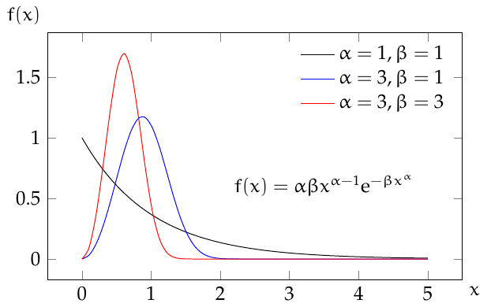

  * [dist_weibull.pgf](https://github.com/walmes/Tikz/blob/master/src/dist_weibull.pgf)

```tex
\begin{tikzpicture}[
  declare function={
    weibullpdf(\x,\a,\b) = \b*\a*\x^(\a-1)*exp(-\b*\x^(\a));
  }]

  \begin{axis}[
    width=9cm, height=6cm,
    samples=50, smooth, domain=0:5,
    xlabel=$x$, ylabel=$f(x)$,
    xlabel style={at={(1,0)}, anchor=north west},
    ylabel style={rotate=-90, at={(0,1)}, anchor=south east},
    legend style={draw=none, fill=none}]

    \addplot[black] {weibullpdf(x,1,1)};
    \addlegendentry{$\alpha=1, \beta=1$};

    \addplot[blue] {weibullpdf(x,3,1)};
    \addlegendentry{$\alpha=3, \beta=1$};

    \addplot[red] {weibullpdf(x,3,3)};
    \addlegendentry{$\alpha=3, \beta=3$};

    \node at (axis cs: 3.5,  0.6)
    {$f(x) = \alpha\beta x^{\alpha-1} \text{e}^{-\beta x^{\alpha}}$};
  \end{axis}
\end{tikzpicture}
```
****

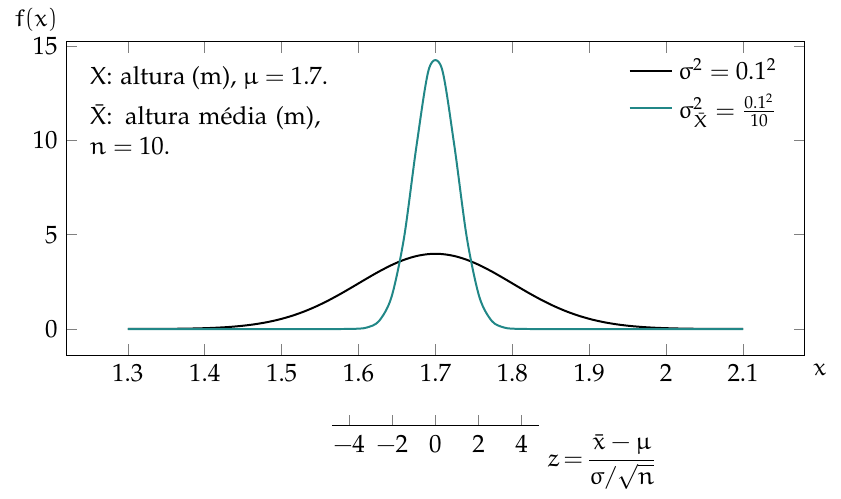

  * [dist_X_barX_Z.pgf](https://github.com/walmes/Tikz/blob/master/src/dist_X_barX_Z.pgf)

```tex
\pgfplotsset{
  myplot/.style={
    width=12cm, height=6cm,
    xlabel=$x$, ylabel=$f(x)$,
    samples=50,
    xlabel style={at={(1,0)}, anchor=north west},
    ylabel style={rotate=-90, at={(0,1)}, anchor=south east},
    legend style={draw=none, fill=none},
  }
}

\begin{tikzpicture}[>=stealth,
  every node/.style={rounded corners},
  declare function={
    normalpdf(\x,\mu,\sigma)=
    (2*3.1415*\sigma^2)^(-0.5)*exp(-(\x-\mu)^2/(2*\sigma^2));
  }]

  \begin{axis}[myplot]
    % `forget plot` evita que seja feita legenda.
    % \addplot[domain=1.6:1.8, draw=none, fill=gray!10!darkgreen, fill
    % opacity=0.5, forget plot]
    % {normalpdf(x,1.7,0.0276)} \closedcycle;

    \addplot[smooth, thick, domain=1.3:2.1]
    {normalpdf(x,1.7,0.1)};
    \addlegendentry[align=center]{$\sigma^2=0.1^2$}

    \addplot[smooth, thick, domain=1.3:2.1, color=darkgreen]
    {normalpdf(x,1.7,0.0276)};
    \addlegendentry[align=center]{$\sigma^2_{\bar{X}}=\frac{0.1^2}{10}$}

    \node[anchor=north west] at (axis description cs: 0.02, 0.95)
    {$X$: altura (m), $\mu=1.7$.};
    \node[anchor=north west, text width=3.5cm]
    at (axis description cs: 0.02, 0.83)
    {$\bar{X}$: altura m\'{e}dia (m), $n=10$.};
  \end{axis}

  % z-axis.
  \begin{scope}[yshift=-1cm, xshift=3.75cm]
    \begin{axis}[myplot,
      width=4.5cm, height=2cm,
      hide y axis,
      axis x line*=bottom,
      xlabel=$z{\,=\,}\dfrac{\bar{x}-\mu}{\sigma/\sqrt{n}}$,
      domain=-4:4]
      \addplot[draw=none] {x};
    \end{axis}
  \end{scope}
\end{tikzpicture}
```
****

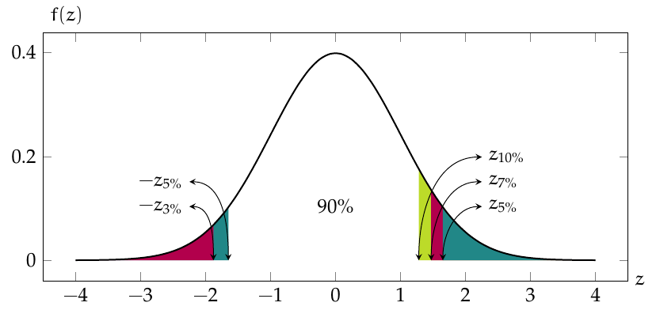

  * [dist_Z_IC95.pgf](https://github.com/walmes/Tikz/blob/master/src/dist_Z_IC95.pgf)

```tex
\pgfplotsset{
  myplot/.style={
    width=12cm, height=6cm,
    xlabel=$z$, ylabel=$f(z)$,
    samples=50,
    xlabel style={at={(1,0)}, anchor=west},
    ylabel style={rotate=-90, at={(0,1)}, anchor=south west},
    legend style={draw=none, fill=none},
    xmin=-4.5, xmax=4.5
  }
}

\begin{tikzpicture}[>=stealth,
  every node/.style={rounded corners},
  declare function={
    normalpdf(\x,\mu,\sigma)=
    (2*3.1415*\sigma^2)^(-0.5)*exp(-(\x-\mu)^2/(2*\sigma^2));
  }]

  \begin{axis}[myplot]

    \addplot[smooth, domain=-4:-1.65, draw=none, fill=darkgreen]
    {normalpdf(x,0,1)} \closedcycle;
    \addplot[smooth, domain=-4:-1.88, draw=none, fill=red!70!blue]
    {normalpdf(x,0,1)} \closedcycle;
    \addplot[smooth, domain=4:1.28, draw=none, fill=darkgreen!30!yellow]
    {normalpdf(x,0,1)} \closedcycle;
    \addplot[smooth, domain=4:1.47, draw=none, fill=red!70!blue]
    {normalpdf(x,0,1)} \closedcycle;
    \addplot[smooth, domain=4:1.65, draw=none, fill=darkgreen]
    {normalpdf(x,0,1)} \closedcycle;

    \addplot[smooth, thick, domain=-4:4] {normalpdf(x,0,1)};

    \path[<->, draw] (axis cs: -1.65,0) to[out=90, in=0]
    (axis description cs: 0.25,0.4) node[left] {$-z_{5\%}$};
    \path[<->, draw] (axis cs: 1.65,0) to[out=90, in=180]
    (axis description cs: 0.75,0.3) node[right] {$z_{5\%}$};

    \path[<->, draw] (axis cs: -1.88,0) to[out=90, in=0]
    (axis description cs: 0.25,0.3) node[left] {$-z_{3\%}$};
    \path[<->, draw] (axis cs: 1.47,0) to[out=90, in=180]
    (axis description cs: 0.75,0.4) node[right] {$z_{7\%}$};
    \path[<->, draw] (axis cs: 1.28,0) to[out=90, in=180]
    (axis description cs: 0.75,0.5) node[right] {$z_{10\%}$};

    \node at (axis description cs: 0.5,0.3) {$90\%$};

  \end{axis}
\end{tikzpicture}
```
****

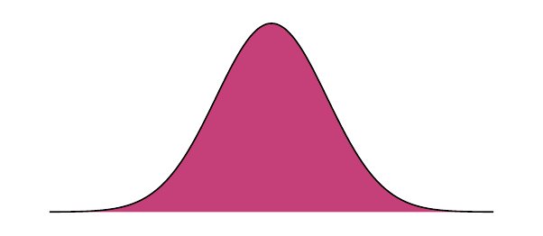

  * [dist-gaussian.pgf](https://github.com/walmes/Tikz/blob/master/src/dist-gaussian.pgf)

```tex
\def\zright{1.645}%
\def\muzero{0}%
\def\muone{-1.95}%
\pgfplotsset{%
  myplot/.style={
    width=12cm,
    height=6cm,
%     xlabel=$z$, ylabel=$f(z)$,
    samples=50,
    legend style={draw=none, fill=none},
  }%
}%
\begin{tikzpicture}[%
  >=stealth,
  every node/.style={rounded corners},
  Red/.style={
    draw=none, text opacity=1, fill=red!70!blue, fill opacity=0.75
  },
  declare function={
    normalpdf(\x,\mu,\sigma)=
    (2*3.1415*\sigma^2)^(-0.5)*exp(-(\x-\mu)^2/(2*\sigma^2));
  }]

  \begin{axis}[myplot, hide axis]
    \addplot[Red, draw, smooth, thick, domain=-4:4]
      {normalpdf(x,0,1)};
  \end{axis}
\end{tikzpicture}%
```
****

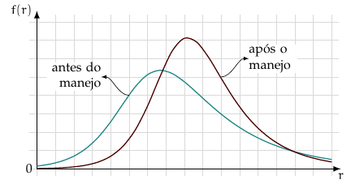

  * [efeito_manejo.pgf](https://github.com/walmes/Tikz/blob/master/src/efeito_manejo.pgf)

```tex
\def\xs{1}
\def\ys{10}

\begin{tikzpicture}[xscale=\xs, yscale=\ys, >=latex]
  % definicoes dos valores dos parametros e outras quantidades
  \def\al{1.3}
  \def\all{0.5}
  \def\n{1.6}
  \def\nn{1.9}

  % grid, eixos e anotacoes
  \draw[very thin,color=gray!30] (-3-0.2/\xs,0-0.2/\ys)
    grid[xstep=0.5, ystep=0.05] (5+0.2/\xs,0.4+0.2/\ys);
  \draw[->, line width=1pt] (-3,0) -- (5.25,0) node[below] {$r$};
  \draw[->, line width=1pt] (-3,0) -- (-3,0.43) node[left] {$f(r)$};
  \node[left] at (-3,0) {$0$};

  % funcoes
  \draw[color=darkgreen, thick, smooth] plot[id=x, domain=-3:5]
    function{\n*(1-1/\n)*\al**\n*exp(\n*x)*
      (1+(\al*exp(x))**\n)**(-1+1/\n-1)};
  \draw[color=red!30!black, thick, smooth] plot[id=x, domain=-3:5]
    function{\nn*(1-1/\nn)*\all**\nn*exp(\nn*x)*
      (1+(\all*exp(x))**\nn)**(-1+1/\nn-1)};

  % textos
  \path[->, draw] (-0.5,0.2) to[out=180, in=0] ++(-0.75,0.05)
    node[anchor=east, text ragged left, text width=9ex,
    fill=white, inner sep=0pt]
    {antes do manejo};
  \path[->, draw] (2,0.25) to[out=0, in=180] ++(0.75,0.05)
    node[anchor=west, text ragged, text width=8ex,
    fill=white, inner sep=0pt]
    {ap\'os o manejo};
\end{tikzpicture}  
```
****

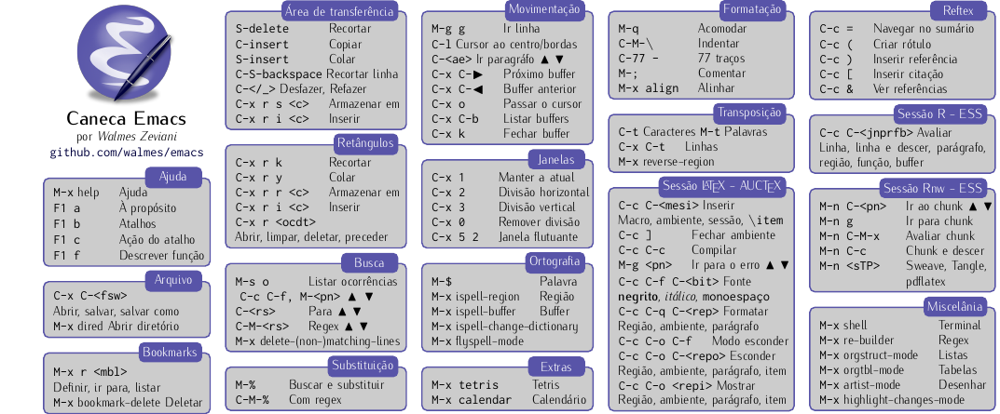

  * [emacs_mug.pgf](https://github.com/walmes/Tikz/blob/master/src/emacs_mug.pgf)

```tex
\definecolor{emacsroxo}{HTML}{5854A8}
\definecolor{emacsazul}{HTML}{00003D}

\fontfamily{iwonalc} %% iwona ligth condensed
\changefontsizes[11pt]{8pt}
\renewcommand{\baselinestretch}{0.85}
\newcommand{\cc}{\cellcolor[gray]{0.9}}
\newcommand{\mc}[3]{\multicolumn{#1}{#2}{\cc #3}}
\newcommand{\md}[3]{\multicolumn{#1}{#2}{#3}}

\tikzset{
  mybox/.style={
    draw=emacsroxo, thick, rectangle,
    fill=gray!40,
    rounded corners=3pt, inner sep=0pt, inner ysep=1pt,
    anchor=north west
  },
  fancytitle/.style={
    fill=emacsroxo, text=white,
    %% text width=0.5*\d,
    minimum width=1.2cm, minimum height=1.5em,
    rounded corners=3pt, left=5pt
  },
  bx/.style={draw}
}

\begin{tikzpicture}[node distance=0.3cm, scale=1]
  \def\d{3.5cm}
  \def\cred{%
    \begin{minipage}{\d}
      \begin{center}
        \includegraphics[width=2.2cm]{/home/walmes/Dropbox/tikz/mugs/carbon-emacs-icon.png}\\
        {\Large \textbf{Caneca Emacs}}\\
        por \textit{Walmes Zeviani}\\
        \textcolor{emacsazul}{\texttt{github.com/walmes/emacs}}
      \end{center}
    \end{minipage}
  }
  \def\ajuda{%
    \begin{minipage}{\d}
      \begin{tabular}{ll}\vspace{-6pt}            \\
        % {\tt F1}     & Ajuda                    \\
        {\tt M-x} help & Ajuda                    \\
        {\tt F1 a}     & \`{A} prop\'{o}sito      \\
        {\tt F1 b}     & Atalhos                  \\
        {\tt F1 c}     & A\c{c}\~{a}o do atalho   \\
        {\tt F1 f}     & Descrever fun\c{c}\~{a}o \\
      \end{tabular}
    \end{minipage}
  }
  \def\arquivo{%
    \begin{minipage}{\d}
      \begin{tabular}{ll}\vspace{-6pt}                 \\
        % {\tt C-x C-f} & Abrir                        \\
        % {\tt C-x C-s} & Salvar                       \\
        % {\tt C-x C-w} & Salvar como                  \\
        \md{2}{l}{\tt C-x C-<fsw>}                     \\
        \md{2}{l}{Abrir, salvar, salvar como}          \\
        \md{2}{l}{{\tt M-x} dired ~ Abrir diret\'orio} \\
      \end{tabular}
    \end{minipage}
  }
  \def\book{
    \begin{minipage}{\d}
      \begin{tabular}{ll}\vspace{-3pt}                \\
        % {\tt C-x r m} & Definir                     \\
        % {\tt C-x r b} & Ir para                     \\
        % {\tt C-x r l} & Listar                      \\
        \md{2}{l}{\tt M-x r <mbl>}                    \\
        \md{2}{l}{Definir, ir para, listar}           \\
        \md{2}{l}{{\tt M-x} bookmark-delete~~Deletar} \\
      \end{tabular}
    \end{minipage}
  }
  \def\area{%
    \begin{minipage}{\d}
      \begin{tabular}{ll}\vspace{-3pt}                  \\
        {\tt S-delete}    & Recortar                    \\
        {\tt C-insert}    & Copiar                      \\
        {\tt S-insert}    & Colar                       \\
        \md{2}{l}{{\tt C-S-backspace}  ~Recortar linha} \\
        \md{2}{l}{{\tt C-</\_>} ~~ Desfazer, Refazer}   \\
        {\tt C-x r s <c>} & Armazenar em                \\
        {\tt C-x r i <c>} & Inserir                     \\
      \end{tabular}
    \end{minipage}
  }
  \def\retangulos{
    \begin{minipage}{\d}
      \begin{tabular}{ll}\vspace{-3pt}   \\
        {\tt C-x r k}     & Recortar     \\
        % {\tt C-x r M-w} & Copiar       \\ %% nao existe copiar retangulo
        {\tt C-x r y}     & Colar        \\
        {\tt C-x r r <c>} & Armazenar em \\
        {\tt C-x r i <c>} & Inserir      \\
        \md{2}{l}{\tt C-x r <ocdt>}      \\
        \md{2}{l}{Abrir, limpar, deletar, preceder}
      \end{tabular}
    \end{minipage}
  }
  \def\formatacao{
    \begin{minipage}{\d}
      \begin{tabular}{ll}\vspace{-3pt}         \\
        {\tt M-q}              & Acomodar      \\
        {\tt C-M-$\backslash$} & Indentar      \\
        {\tt C-77 -}           & 77 tra\c{c}os \\
        {\tt M-;}              & Comentar      \\
        {\tt M-x align}        & Alinhar       \\
      \end{tabular}
    \end{minipage}
  }
  \def\orto{
    \begin{minipage}{\d}
      \begin{tabular}{ll}\vspace{-3pt}\\
        {\tt M-\$}              & Palavra             \\
        {\tt M-x} ispell-region & Regi\~ao              \\
        {\tt M-x} ispell-buffer & Buffer              \\
        \md{2}{l}{{\tt M-x} ispell-change-dictionary} \\
        \md{2}{l}{{\tt M-x} flyspell-mode}            \\
      \end{tabular}
    \end{minipage}
  }
  \def\movi{
    \begin{minipage}{\d}
      \begin{tabular}{ll}\vspace{-3pt}                                                 \\
        {\tt M-g g}                       & Ir linha                                   \\
        % \md{2}{l}{{\tt M-x} goto-char ~~Ir coluna}                                   \\
        \md{2}{l}{{\tt C-l} ~~Cursor ao centro/bordas}                                 \\
        \md{2}{l}{{\tt C-<ae>} ~~Ir paragr\'afo $\blacktriangle$ $\blacktriangledown$} \\
        {\tt C-x C-$\blacktriangleright$} & Pr\'oximo buffer                           \\
        {\tt C-x C-$\blacktriangleleft$}  & Buffer anterior                            \\
        {\tt C-x o}                       & Passar o cursor                            \\
        {\tt C-x C-b}                     & Listar buffers                             \\
        {\tt C-x k}                       & Fechar buffer                              \\
      \end{tabular}
    \end{minipage}
  }
  \def\busca{
    \begin{minipage}{\d}
      \begin{tabular}{ll}\vspace{-3pt}                                           \\
        {\tt M-s o}    & Listar ocorr\^encias                                    \\
        \md{2}{l}{~~~\tt C-c C-f, M-<pn>  $\blacktriangle$ $\blacktriangledown$} \\ 
        {\tt C-<rs>}   & Para $\blacktriangle$ $\blacktriangledown$              \\
        {\tt C-M-<rs>} & Regex $\blacktriangle$ $\blacktriangledown$             \\
        % \md{2}{l}{{\tt M-x} (un)highlight-regexp}                              \\
        \md{2}{l}{{\tt M-x} delete-(non-)matching-lines}                         \\
      \end{tabular}
    \end{minipage}
  }
  \def\subist{
    \begin{minipage}{\d}
      \begin{tabular}{ll}\vspace{-3pt}     \\
        {\tt M-\%}   & Buscar e substituir \\
        {\tt C-M-\%} & Com regex           \\ %\hline
      \end{tabular}
    \end{minipage}
  }
  \def\janelas{
    \begin{minipage}{\d}
      \begin{tabular}{ll}\vspace{-3pt}       \\
        {\tt C-x 1}   & Manter a atual       \\
        {\tt C-x 2}   & Divis\~ao horizontal \\
        {\tt C-x 3}   & Divis\~ao vertical   \\
        {\tt C-x 0}   & Remover divis\~ao    \\
        {\tt C-x 5 2} & Janela flutuante     \\
      \end{tabular}
    \end{minipage}
  }
  \def\sessaor{
    \begin{minipage}{\d}
      \begin{tabular}{ll}\vspace{-3pt}             \\
        \md{2}{l}{{\tt C-c C-<jnprfb>} ~~ Avaliar} \\
        \md{2}{p{3.5cm}}{Linha, linha e descer, par\'agrafo, regi\~ao, fun\c{c}\~ao,
        buffer}                                    \\
      % {\tt C-c C-j} & Linha                      \\
      % {\tt C-c C-n} & Linha e descer             \\
      % {\tt C-c C-p} & Par\'agrafo                \\
      % {\tt C-c C-r} & Regi\~ao                   \\
      % {\tt C-c C-f} & Fun\c{c}\~ao               \\
      \end{tabular}
    \end{minipage}
  }
  \def\sessaornw{
    \begin{minipage}{\d}
      \begin{tabular}{lp{2cm}}\vspace{-3pt}                                  \\
        % {\tt M-n C-p}  & Chunk acima                                       \\
        % {\tt M-n C-n}  & Chunk abaixo                                      \\
        {\tt M-n C-<pn>} & Ir ao chunk $\blacktriangle$ $\blacktriangledown$ \\
        {\tt M-n g}      & Ir para chunk                                     \\
        {\tt M-n C-M-x}  & Avaliar chunk                                     \\
        {\tt M-n C-c}    & Chunk e descer                                    \\
        {\tt M-n <sTP>}  & Sweave, Tangle, \newline pdflatex                 \\
        % {\tt M-n <ru>} & knit, purl \newline (*ess-knitr.el)               \\
      \end{tabular}
    \end{minipage}
  }
  \def\sessaolatex{
    \begin{minipage}{\d}
      \begin{tabular}{ll}\vspace{-3pt}                                           \\
        % {\tt C-c C-m}   & Inserir macro                                        \\
        % {\tt C-c C-e}   & Inserir ambiente                                     \\
        % {\tt C-c C-j}   & Inserir \verb|\item|                                 \\
        \md{2}{l}{{\tt C-c C-<mesi>} ~~Inserir}                                  \\
        \md{2}{l}{Macro, ambiente, sess\~ao, $\backslash{}$\texttt{item}}        \\
        {\tt C-c ]}       & Fechar ambiente                                      \\
        {\tt C-c C-c}     & Compilar                                             \\
        {\tt M-g <pn>}    & Ir para o erro $\blacktriangle$ $\blacktriangledown$ \\
      \end{tabular}
      \begin{tabular}{ll}
        \md{2}{l}{{\tt C-c C-f C-<bit>} ~~Fonte}                                 \\
        \md{2}{l}{\textbf{negrito}, \textit{it\'alico}, \texttt{monoespa\c{c}o}} \\
        \md{2}{l}{{\tt C-c C-q C-<rep>} ~~Formatar}                              \\
        \md{2}{l}{Regi\~ao, ambiente, par\'agrafo}                               \\
        {\tt C-c C-o C-f} & Modo esconder                                        \\
        \md{2}{l}{{\tt C-c C-o C-<repo>} ~~Esconder}                             \\
        \md{2}{l}{Regi\~ao, ambiente, par\'agrafo, item}                         \\
        \md{2}{l}{{\tt C-c C-o <repi>} ~~Mostrar}                                \\
        \md{2}{l}{Regi\~ao, ambiente, par\'agrafo, item}                         \\
      \end{tabular}
    \end{minipage}
  }
  \def\reftex{
    \begin{minipage}{\d}
      \begin{tabular}{ll}\vspace{-3pt}       \\
        {\tt C-c =}  & Navegar no sum\'ario  \\
        {\tt C-c (}  & Criar r\'otulo        \\
        {\tt C-c )}  & Inserir refer\^encia  \\
        {\tt C-c [}  & Inserir cita\c{c}\~ao \\
        {\tt C-c \&} & Ver refer\^encias     \\
      \end{tabular}
    \end{minipage}
  }
  \def\trans{
    \begin{minipage}{\d}
      \begin{tabular}{ll}\vspace{-3pt}                       \\
        \md{2}{l}{{\tt C-t} Caracteres ~ {\tt M-t} Palavras} \\
        {\tt C-x C-t} & Linhas                               \\
        \md{2}{l}{{\tt M-x} reverse-region}                  \\
      \end{tabular}
    \end{minipage}
  }
  \def\extra{
    \begin{minipage}{\d}
      \begin{tabular}{ll}\vspace{-3pt}    \\
        {\tt M-x tetris}   & Tetris       \\
        {\tt M-x calendar} & Calend\'ario \\
      \end{tabular}
    \end{minipage}
  }

  \def\misc{
    \begin{minipage}{\d}
      \begin{tabular}{ll}\vspace{-3pt}               \\
        {\tt M-x} shell          & Terminal          \\
        {\tt M-x} re-builder     & Regex             \\
        {\tt M-x} orgstruct-mode & Listas            \\
        {\tt M-x} orgtbl-mode    & Tabelas           \\
        % {\tt M-x z}            & Repete a\c{c}\~ao \\
        {\tt M-x} artist-mode    & Desenhar          \\
        \md{2}{l}{{\tt M-x} highlight-changes-mode}  \\
      \end{tabular}
    \end{minipage}
  }

  % \draw[fill=gray] rectangle (20,-9);
  % \draw[help lines, gray] (-0.1, -0.1) grid (20.1, 9.1);

  %% Simbolo Emacs com creditos.
  \node[draw=none, anchor=north west] (cred) at (0,9) {\cred};
  \node[mybox, below=of cred] (ajuda) {\ajuda};
  \node[mybox, below=of ajuda] (arquivo) {\arquivo};
  \node[mybox, below=of arquivo] (book) {\book};

  \renewcommand{\baselinestretch}{0.815}
  \def\d{3.8cm}
  \node[mybox, right=6pt of cred.39, anchor=north west] (area) {\area};
  \node[mybox, below=of area] (retangulos) {\retangulos};
  \node[mybox, below=of retangulos] (busca) {\busca};
  \node[mybox, below=of busca] (subist) {\subist};

  \renewcommand{\baselinestretch}{0.815}
  \def\d{3.6cm}
  \node[mybox, right=of area.north east, anchor=north west]
    (movi) {\movi};
  \node [mybox, below=of movi] (janela) {\janelas};
  \node [mybox, below=of janela] (orto) {\orto};
  \node [mybox, below=of orto] (extra) {\extra};

  \renewcommand{\baselinestretch}{0.81}
  \def\d{3.9cm}
  \node[mybox, right=of movi.north east, anchor=north west]
    (formatacao) {\formatacao};
  \node[mybox, below=of formatacao] (trans) {\trans};
  \node[mybox, below=of trans] (latex) {\sessaolatex};

  \renewcommand{\baselinestretch}{0.815}
  \def\d{3.9cm}
  \node[mybox, right=of formatacao.north east, anchor=north west]
    (reftex) {\reftex};
  \node[mybox, below=of reftex] (R) {\sessaor};
  \node[mybox, below=of R] (Rnw) {\sessaornw};
  \node[mybox, below=of Rnw] (misc) {\misc};

  \node[fancytitle] at (ajuda.north east) {Ajuda};
  \node[fancytitle] at (arquivo.north east) {Arquivo};
  \node[fancytitle] at (area.north east)
    {\'{A}rea de transfer{\^e}ncia};
  \node[fancytitle] at (retangulos.north east) {Ret{\^a}ngulos};
  \node[fancytitle] at (formatacao.north east) {Formata\c{c}\~{a}o};
  \node[fancytitle] at (orto.north east) {Ortografia};
  \node[fancytitle] at (book.north east) {Bookmarks};
  \node[fancytitle] at (movi.north east) {Movimenta\c{c}\~{a}o};
  \node[fancytitle] at (busca.north east) {Busca};
  \node[fancytitle] at (subist.north east) {Substitui\c{c}\~{a}o};
  \node[fancytitle] at (janela.north east) {Janelas};
  \node[fancytitle] at (R.north east) {Sess\~{a}o R - ESS};
  \node[fancytitle] at (Rnw.north east) {Sess\~{a}o Rnw - ESS};
  \node[fancytitle] at (latex.north east)
    {Sess\~ao \LaTeX{} - AUC\TeX{}};
  \node[fancytitle] at (reftex.north east) {Reftex};
  \node[fancytitle] at (trans.north east) {Transposi\c{c}\~{a}o};
  \node[fancytitle] at (extra.north east) {Extras};
  \node[fancytitle] at (misc.north east) {Miscel{\^a}nia};

\end{tikzpicture}
```
****

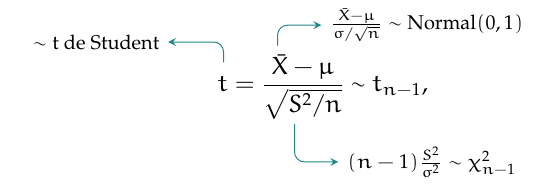

  * [eqn_estat_t.pgf](https://github.com/walmes/Tikz/blob/master/src/eqn_estat_t.pgf)

```tex
\def\hd{0.7}
\def\vd{0.7}
\newcommand{\tm}[1]{\tikz[overlay, anchor=base] \node[red] (#1) {};}

\tikzstyle{every picture}+=[remember picture]

\begin{tikzpicture}[
  >=stealth,
  every path/.style={->, color=darkgreen, thin, rounded corners},
  every node/.style={color=black},
  bx/.style={
    % text width=2.5cm,
    font=\footnotesize,
    minimum height=4ex},
  bxl/.append style={bx,
    left,
    align=flush right},
  bxr/.append style={bx,
    right,
    align=flush left}]

  \node {$\tm{Z}t = \dfrac{\tm{bX}\bar{X}-\mu}{\sqrt{\tm{S}S^2/n}}
    \sim t_{n-1},$};
  \draw (Z)+(0.5ex,2.5ex) |- +(-\vd,\hd)
  node[bxl] {$\sim \text{t de Student}$};
  \draw (bX)+(0.5ex,2.5ex) |- +(\vd,\hd)
  node[bxr] {$\frac{\bar{X}-\mu}{\sigma/\sqrt{n}}\sim
    \text{Normal}(0,1)$};
  \draw (S)+(0.5ex,-1ex) |- +(\vd,-\hd)
  node[bxr] {$(n-1)\frac{S^2}{\sigma^2}\sim \chi^2_{n-1}$};
\end{tikzpicture}
```
****

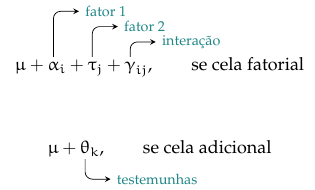

  * [eqn_fatadi.pgf](https://github.com/walmes/Tikz/blob/master/src/eqn_fatadi.pgf)

```tex
\tikzstyle{every picture}+=[remember picture]
\newcommand{\nann}[2]{%
  \tikz[baseline] {%
    \node[%
    anchor=base,%
    inner sep=0pt,%
    outer sep=0pt,%
    % fill=green%
    ] (#1) {#2};%
  }%
}

\begin{tikzpicture}[
  every path/.style={rounded corners, shorten <=3pt, >=stealth},
  every node/.style={rounded corners=false},
  ann/.style={font=\footnotesize, color=darkgreen}]

  \node (fat) {
    $\mu+
    \nann{a}{$\alpha$}_{i}+
    \nann{t}{$\tau$}_{j}+
    \nann{g}{$\gamma$}_{ij},
    \qquad \text{se cela fatorial}$
  };
  \path[->, draw] (a.north) |- ++(0.5,1)
    node[ann,right] {fator 1};
  \path[->, draw] (t.north) |- ++(0.5,0.7)
    node[ann,right] {fator 2};
  \path[->, draw] (g.north) |- ++(0.5,0.4)
    node[ann,right] {intera\c{c}\~ao};

  \node[below=of fat] (adi) {
    $\mu+
    \nann{th}{$\theta$}_{k},
    \qquad \text{se cela adicional}$
  };
  \path[->, draw] (th.south) |- ++(0.5,-0.5)
    node[ann,right] {testemunhas};

\end{tikzpicture}
```
****

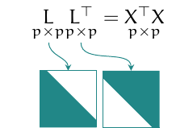

  * [eqn_LU.pgf](https://github.com/walmes/Tikz/blob/master/src/eqn_LU.pgf)

```tex
\newcommand{\tm}[1]{\tikz[overlay, anchor=base] \node[red] (#1) {};}
\tikzstyle{every picture}+=[remember picture]
\tikzset{ 
  >=stealth,
  every path/.style={->, color=darkgreen, thin},
  every node/.style={color=black},
  node distance=0.5cm
}

\begin{tikzpicture}
  \node at (0.9,-0.3)
  {$\tm{l}\underset{p\times p}{L}
    \tm{u}\underset{p\times p}{L^\top} =
    \tm{xx}\underset{p\times p}{X^\top X}$};
  \begin{scope}[yshift=-1.25cm]
    \node (a) at (0,0) {};
    \node[right=of a] (b) {};
    \node[below=of b] (c) {};
    \node[below=of a] (d) {};
    \draw[-, darkgreen]
    (a.north west) -| (c.south east);
    \fill[darkgreen]
    (a.north) -| (d.south west) -| (c.east) -- cycle;
    \path[draw] (l)+(1.8ex,-2ex)
    to[out=-90, in=90] ($(a.north)!0.5!(b.north)$);
    \node (a) at (1.1,0) {};
    \node[right=of a] (b) {};
    \node[below=of b] (c) {};
    \node[below=of a] (d) {};
    \fill[darkgreen]
    (a.west) |- (b.north east) |- (c.south) -- cycle;
    \draw[-, darkgreen]
    (a.north west) |- (c.south east);
    \path[draw] (u)+(1.7ex,-2ex)
    to[out=-90, in=90] ($(a.north)!0.5!(b.north)$);
  \end{scope}
\end{tikzpicture}
```
****

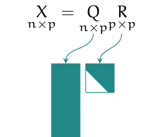

  * [eqn_QR.pgf](https://github.com/walmes/Tikz/blob/master/src/eqn_QR.pgf)

```tex
\newcommand{\tm}[1]{\tikz[overlay, anchor=base] \node[red] (#1) {};}
\tikzstyle{every picture}+=[remember picture]
\tikzset{ 
  >=stealth,
  every path/.style={->, color=darkgreen, thin},
  every node/.style={color=black},
  node distance=0.5cm
}

\begin{tikzpicture}
  \node at (0.5,-0)
  {$\tm{x}\underset{n\times p}{X} =
    \tm{q}\underset{n\times p}{Q}
    \tm{r}\underset{p\times p}{R}$};
  \begin{scope}[xshift=0mm, yshift=-1cm]
    \node (a) at (0,0) {};
    \node[right=1mm of a] (b) {};
    \node[below=1cm of b] (c) {};
    \node[below=1cm of a] (d) {};
    \fill[darkgreen]
    (a.north west) -| (c.south east) -| (a.north west);
    \path[draw] (q)+(1.8ex,-2ex)
    to[out=-90, in=90] ($(a.north)!0.5!(b.north)$);
    \node (a) at (0.7,0) {};
    \node[right=1mm of a] (b) {};
    \node[below=1mm of b] (c) {};
    \node[below=of a] (d) {};
    \fill[darkgreen]
    (a.west) |- (b.north east) |- (c.south) -- cycle;
    \draw[-, darkgreen]
    (a.north west) |- (c.south east);
    \path[draw] (r)+(1.7ex,-2ex)
    to[out=-90, in=90] ($(a.north)!0.5!(b.north)$);
  \end{scope}
\end{tikzpicture}
```
****

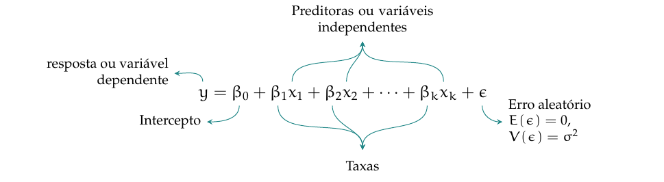

  * [eqn_regmult.pgf](https://github.com/walmes/Tikz/blob/master/src/eqn_regmult.pgf)

```tex
\def\hd{0.5}
\def\vd{0.5}
\newcommand{\tm}[1]{\tikz[overlay, anchor=base] \node[red] (#1) {};}
\tikzstyle{every picture}+=[remember picture]

\begin{tikzpicture}[
  >=stealth,
  every path/.style={->, color=darkgreen, thin, rounded corners},
  every node/.style={color=black},
  bx/.style={text width=3cm, font=\footnotesize, minimum height=4ex},
  bxl/.append style={bx, left, align=flush right},
  bxr/.append style={bx, right, align=flush left}]

  \node {
    $\tm{y}y =
    \tm{b0}\beta_0+
    \tm{b1}\beta_1
    \tm{x1}x_1+
    \tm{b2}\beta_2
    \tm{x2}x_2+\cdots+
    \tm{bk}\beta_k
    \tm{xk}x_k+
    \tm{er}\epsilon$
  };

  \node[bx, align=center] (preds) at (0.4,1.5)
  {Preditoras ou vari\'aveis\\ independentes};
  \node[bx, align=center] (tx) at (0.4,-1.5) {Taxas};

  \path[draw] (y)+(0.5ex,2ex) to[out=90, in=0] +(-\vd,\hd)
  node[bxl] {resposta ou vari\'avel dependente};
  \path[draw] (x1)+(0.5ex,2ex) to[out=90, in=-90] (preds);
  \path[draw] (x2)+(0.5ex,2ex) to[out=90, in=-90] (preds);
  \path[draw] (xk)+(0.5ex,2ex) to[out=90, in=-90] (preds);
  \path[draw] (b1)+(1ex,-1ex) to[out=-90, in=90] (tx);
  \path[draw] (b2)+(1ex,-1ex) to[out=-90, in=90] (tx);
  \path[draw] (bk)+(1ex,-1ex) to[out=-90, in=90] (tx);
  \path[draw] (b0)+(1ex,-1ex) to[out=-90, in=0] +(-\vd,-\hd)
  node[bxl] {Intercepto};
  \path[draw] (er)+(0.5ex,-1ex) to[out=-90, in=180] +(\vd,-\hd)
  node[bxr] {Erro aleat\'orio $E(\epsilon) = 0$,\\
    $V(\epsilon) = \sigma^ 2$};

\end{tikzpicture}
```
****

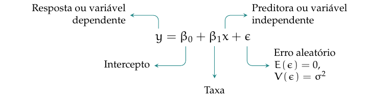

  * [eqn_regsimples.pgf](https://github.com/walmes/Tikz/blob/master/src/eqn_regsimples.pgf)

```tex
\def\hd{0.7}
\def\vd{0.7}
\newcommand{\tm}[1]{\tikz[overlay, anchor=base] \node[red] (#1) {};}
\tikzstyle{every picture}+=[remember picture]

\begin{tikzpicture}[
  >=stealth,
  every path/.style={->, color=darkgreen, thin, rounded corners},
  every node/.style={color=black},
  bx/.style={text width=3cm, font=\footnotesize, minimum height=4ex},
  bxl/.append style={bx, left, align=flush right},
  bxr/.append style={bx, right, align=flush left}]

  \node {
    $\tm{y}y =
    \tm{b0}\beta_0+
    \tm{b1}\beta_1
    \tm{x}x+
    \tm{er}\epsilon$
  };

  \draw (y)+(0.5ex,2ex) |- +(-\vd,\hd) node[bxl]
  {Resposta ou vari\'avel dependente}; 
  \draw (x)+(0.5ex,2ex) |- +(\vd,\hd) node[bxr]
  {Preditora ou vari\'avel independente};
  \draw (b0)+(1ex,-1ex) |- +(-\vd,-\hd) node[bxl]
  {Intercepto};
  \draw (b1)+(1ex,-1ex) -- +(1ex,-1.5*\hd)
  node[bxr, below, align=center]
  {Taxa};
  \draw (er)+(0.5ex,-1ex) |- +(\vd,-\hd) node[bxr]
  {Erro aleat\'orio $E(\epsilon) = 0$,\\ $V(\epsilon) = \sigma^2$};

\end{tikzpicture}
```
****

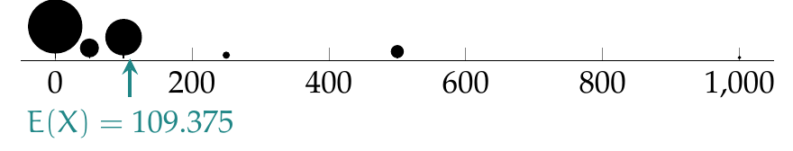

  * [esperanca.pgf](https://github.com/walmes/Tikz/blob/master/src/esperanca.pgf)

```tex
\pgfplotsset{
  myplot/.style={
    width=10cm, height=7cm,
    mark=*,
    nodes near coords,
    point meta=explicit symbolic, % permite usar a 3 coluna como label.
    every node near coord/.append style={font=\footnotesize},
    nodes near coords align={vertical}
  }
}

\pgfplotstableset{
  create on use/new/.style={
    create col/expr={\thisrow{px}*30}
  }
}

\begin{filecontents*}{distrprob.dat}
  i    x       px       PX     f     F
  1    0 0.421875 0.421875 27/64 27/64
  2   50 0.140625 0.562500  9/64 36/64
  3  100 0.281250 0.843750 18/64 54/64
  4  250 0.046875 0.890625  3/64 57/64
  5  500 0.093750 0.984375  6/64 63/64
  6 1000 0.015625 1.000000  1/64 64/64
\end{filecontents*}

\begin{tikzpicture}[>=stealth]
  \begin{axis}[
    myplot,
    hide y axis,
    axis x line*=bottom,
    xmin=0, xmax=1000,
    domain=0:1000,
    height=2.0cm,
    enlarge x limits=0.05,
    clip=false]

    \addplot[
      scatter, only marks, ycomb,
      visualization depends on=\thisrow{px} \as\wtwo,
      scatter/@pre marker code/.append style={
        /tikz/mark size=\wtwo*20}
    ] table [x=x, y=px] {distrprob.dat};

    \draw[<-, very thick, darkgreen] (axis cs: 109.375, 0) --
    (axis cs: 109.375, -0.5) node[below] {$E(X) = 109.375$};

  \end{axis}
\end{tikzpicture}
```
****

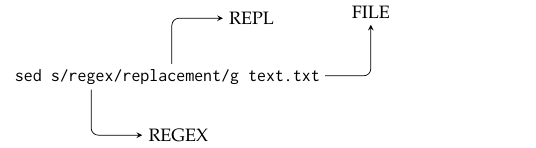

  * [explicacao.pgf](https://github.com/walmes/Tikz/blob/master/src/explicacao.pgf)

```tex
\tikzstyle{every picture}+=[remember picture]
\newcommand{\nann}[2]{%
  \tikz[baseline] {%
    \node[%
    anchor=base,%
    inner sep=0pt,%
    outer sep=0pt,%
    % fill=green%
    ] (#1) {#2};%
  }%
}

\begin{tikzpicture}[
  every path/.style={rounded corners, shorten <=3pt, >=stealth},
  every node/.style={rounded corners=false}]

  \node {
    \begin{minipage}{10cm}
      {\tt sed s/\nann{regex}{regex}/\nann{repl}{replacement}/g \nann{txt}{text.txt}}
    \end{minipage}
  };
  \path[->, draw] (regex.south) |- ++(1,-1) node[right] {REGEX};
  \path[->, draw] (repl.north) |- ++(1,1) node[right] {REPL};
  \path[->, draw] (txt.east) -| ++(1,1) node[above] {FILE};
\end{tikzpicture}
```
****

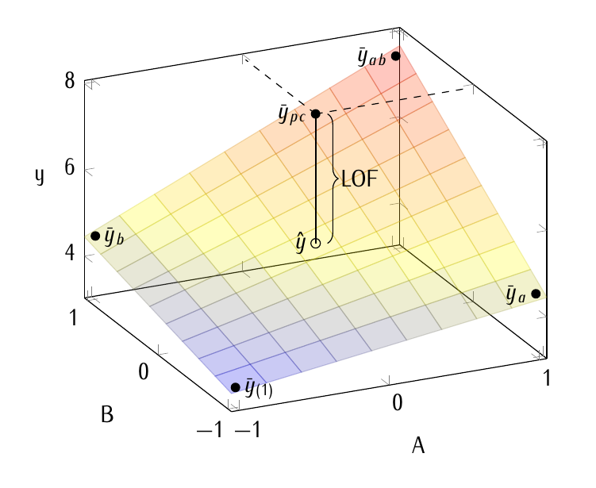

  * [factorial-2k-lack-of-fit.pgf](https://github.com/walmes/Tikz/blob/master/src/factorial-2k-lack-of-fit.pgf)

```tex
\usetikzlibrary{decorations.pathreplacing}%
\begin{tikzpicture}
  \begin{axis}[
    samples = 10,
    view = {-25}{30},
    xtick = {-1, 0, 1},
    ytick = {-1, 0, 1},
    % ztick = {0},
    xlabel = A,
    ylabel = B,
    zlabel = y,
    zlabel style = {rotate = -90}]

    \addplot3[surf, domain = -1.05:1.05, opacity = 0.25] {5 + x + y + 0.5 * x * y};
    \draw[thick] (axis cs: 0, 0, 5) -- (axis cs: 0, 0, 8);
    \draw[dashed] (axis cs: 0, 0, 8) -- (axis cs: 1, 0, 8);
    \draw[dashed] (axis cs: 0, 0, 8) -- (axis cs: 0, 1, 8);
    \fill (axis cs: 0,  0, 8.0) circle (2pt) node[left] {$\bar{y}_{pc}$};

    \draw (axis cs: 0,  0, 5.0) circle (2pt) node[left] {$\hat{y}$};
    \fill (axis cs:-1, -1, 3.5) circle (2pt) node[right] {$\bar{y}_{(1)}$};
    \fill (axis cs:-1,  1, 4.5) circle (2pt) node[right] {$\bar{y}_{b}$};
    \fill (axis cs: 1, -1, 4.5) circle (2pt) node[left] {$\bar{y}_{a}$};
    \fill (axis cs: 1,  1, 7.5) circle (2pt) node[left] {$\bar{y}_{ab}$};

    \draw [decorate, -, decoration = {brace, amplitude = 1ex},
      xshift = 5pt, yshift = 0pt] (axis cs: 0,  0, 8) -- (axis cs: 0,  0, 5) 
      node [midway, xshift = 2pt, anchor = west] {LOF};

  \end{axis}
\end{tikzpicture}
```
****

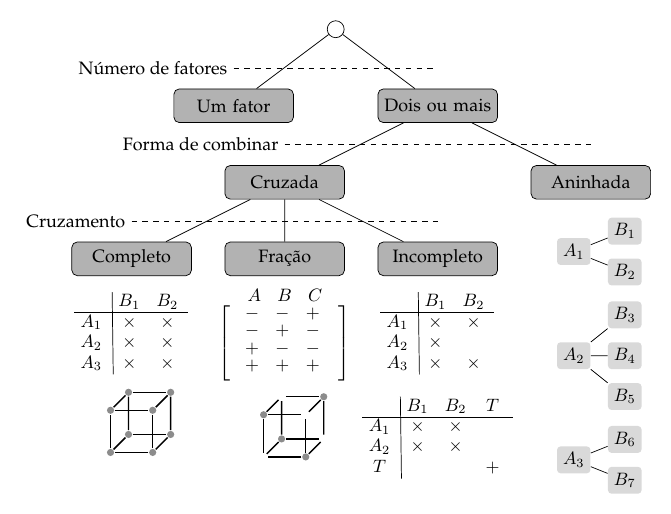

  * [factorials.pgf](https://github.com/walmes/Tikz/blob/master/src/factorials.pgf)

```tex
\tikzset{%
  basic/.style={draw, text width=2cm, %drop shadow, 
    rectangle, minimum
    height=4ex},
  root/.style={basic, rounded corners=2pt, align=center, fill=gray!30},
  level 2/.style={basic, rounded corners=3pt, align=center,
    fill=gray!60, text width=6em},
  level 3/.style={basic, align=center, fill=gray, text width=16em},
  table/.style={
    matrix of nodes,
    % matrix of math nodes,
    nodes={align=center},
    % minimum height=1.5em,
    minimum width=2em,
    text depth=0ex,
    text height=1ex,
    nodes in empty cells
  },
  vertex/.style={circle, minimum size=4pt, inner sep=1pt, fill=gray!90},
  edge/.style={draw, -, black}
}%

\begin{tikzpicture}[%
  level 1/.append style={sibling distance=40mm},
  level 2/.append style={sibling distance=60mm},
  level 3/.append style={sibling distance=30mm},
  edge from parent/.style={-, draw},
  >=stealth]

  \node[draw, circle] (ini) {}
  child {
    node[level 2] (um) {Um fator}
  }
  child {
    node[level 2] (dois) {Dois ou mais}
    child {
      node[level 2] (cru) {Cruzada}
      child {node[level 2] (com) {Completo}}
      child {node[level 2] (fra) {Fra{\c c}{\~a}o}}
      child {node[level 2] (inc) {Incompleto}}
    }
    child {
      node[level 2] (ani) {Aninhada}
    }
  };

  \draw[dashed] ($(um.90)+(0,0.4)$)  node[left] {N\'umero de fatores} -- ($(dois.90)+(0,0.4)$);
  \draw[dashed] ($(cru.90)+(0,0.4)$) node[left] {Forma de combinar} -- ($(ani.90)+(0,0.4)$);
  \draw[dashed] ($(com.90)+(0,0.4)$) node[left] {Cruzamento} -- ($(inc.90)+(0,0.4)$);

 \begin{scope}
    \matrix[table, below=2mm of com] (tbcom) {
            & $B_1$    & $B_2$    \\
      $A_1$ & $\times$ & $\times$ \\ 
      $A_2$ & $\times$ & $\times$ \\ 
      $A_3$ & $\times$ & $\times$ \\ 
    };
    \draw (tbcom-1-2.north west) -- (tbcom-4-2.south west);
    \draw (tbcom-2-1.north west) -- (tbcom-2-3.north east);
    \matrix[table, below=2mm of inc] (tbinc) {
            & $B_1$    & $B_2$    \\
      $A_1$ & $\times$ & $\times$ \\ 
      $A_2$ & $\times$ &          \\ 
      $A_3$ & $\times$ & $\times$ \\ 
    };
    \draw (tbinc-1-2.north west) -- (tbinc-4-2.south west);
    \draw (tbinc-2-1.north west) -- (tbinc-2-3.north east);
    \matrix[table, below=2mm of tbinc] (tbadi) {
            & $B_1$    & $B_2$    & $T$ \\
      $A_1$ & $\times$ & $\times$ &     \\ 
      $A_2$ & $\times$ & $\times$ &     \\ 
      $T$   &          &          & $+$ \\ 
    };
    \draw (tbadi-1-2.north west) -- (tbadi-4-2.south west);
    \draw (tbadi-2-1.north west) -- (tbadi-2-4.north east);
    \matrix[
    matrix of nodes,
    nodes={align=center},
    text height=0.5ex,
    nodes in empty cells,
    below=5mm of fra,
    left delimiter = {[}, right delimiter = {]}] (tbfra) {
      $-$ & $-$ & $+$ \\
      $-$ & $+$ & $-$ \\
      $+$ & $-$ & $-$ \\
      $+$ & $+$ & $+$ \\
    };
    \node[above] at (tbfra-1-1.north) {$A$};
    \node[above] at (tbfra-1-2.north) {$B$};
    \node[above] at (tbfra-1-3.north) {$C$};
  \end{scope}

  \begin{scope}[thick, z={(0.45,0.35)}, node distance=0.5cm]
    \coordinate[below=1cm of tbcom] (centro);
    \node[vertex, below left=of centro] (v0) {};
    \node[vertex, above left=of centro] (v1) {};
    \node[vertex, below right=of centro] (v2) {};
    \node[vertex, above right=of centro] (v3) {};
    \node[vertex, above right=2ex of v0] (v4) {};
    \node[vertex, above right=2ex of v1] (v5) {};
    \node[vertex, above right=2ex of v2] (v6) {};
    \node[vertex, above right=2ex of v3] (v7) {};
    \draw[edge] (v0) -- (v1) -- (v3) -- (v2) -- (v0);
    \draw[edge] (v0) -- (v4) -- (v5) -- (v1);
    \draw[edge] (v2) -- (v6) -- (v7) -- (v3);
    \draw[edge] (v4) -- (v6);
    \draw[edge] (v5) -- (v7);
  \end{scope}

  \begin{scope}[thick, z={(0.45,0.35)}, node distance=0.5cm]
    \coordinate[below=1cm of tbfra] (centro);
    \node[vertex, fill=white, below left=of centro] (v0) {};
    \node[vertex, above left=of centro] (v1) {};
    \node[vertex, below right=of centro] (v2) {};
    \node[vertex, fill=white, above right=of centro] (v3) {};
    \node[vertex, above right=2ex of v0] (v4) {};
    \node[vertex, fill=white, above right=2ex of v1] (v5) {};
    \node[vertex, fill=white, above right=2ex of v2] (v6) {};
    \node[vertex, above right=2ex of v3] (v7) {};
    \draw[edge] (v0) -- (v1) -- (v3) -- (v2) -- (v0);
    \draw[edge] (v0) -- (v4) -- (v5) -- (v1);
    \draw[edge] (v2) -- (v6) -- (v7) -- (v3);
    \draw[edge] (v4) -- (v6);
    \draw[edge] (v5) -- (v7);
  \end{scope}

  \begin{scope}[
    grow=right,
    cx/.style={rounded corners=2pt, thin, align=center, fill=gray!30},
    level 1/.append style={sibling distance=8mm, level distance=10mm},
    edge from parent/.style={-, draw}]
    \coordinate[below=.75cm of ani] (anip);
    \node[cx, below left=0mm and 0mm of anip] (A1) {$A_1$}
    child {node[cx] {$B_2$}}
    child {node[cx] {$B_1$}};
    \node[cx, below=15mm of A1] (A2) {$A_2$}
    child {node[cx] {$B_5$}}
    child {node[cx] {$B_4$}}
    child {node[cx] {$B_3$}};
    \node[cx, below=15mm of A2] (A3) {$A_3$}
    child {node[cx] {$B_7$}}
    child {node[cx] {$B_6$}};

  \end{scope}

\end{tikzpicture}%
```
****

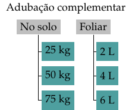

  * [fat_anin_regular.pgf](https://github.com/walmes/Tikz/blob/master/src/fat_anin_regular.pgf)

```tex
\def\d{1.35}

\begin{tikzpicture}[
  yscale=0.6,
  node distance=1 and 0.5,
  fator1/.style={%
    fill=gray!50},
  fator2/.style={%
    fill=darkgreen!80, minimum height=1.8em},
  profator2/.style={%
    grow=down, xshift=0.1cm, solid, anchor=west,
    edge from parent path={
      (\tikzparentnode.south) |- (\tikzchildnode.west)
    },
  },
  level1/.style ={level distance=\d cm},
  level2/.style ={level distance=2*\d cm},
  level3/.style ={level distance=3*\d cm},
  level 1/.style={sibling distance=1cm, level distance=0.5cm}]

  \node[fator1] (A1) {No solo}
    child [profator2, level1] {node[fator2] {25 kg}}
    child [profator2, level2] {node[fator2] {50 kg}}
    child [profator2, level3] {node[fator2] {75 kg}};
  \node[fator1, right=of A1] (A2) {Foliar}
    child [profator2, level1] {node[fator2] {2 L}}
    child [profator2, level2] {node[fator2] {4 L}}
    child [profator2, level3] {node[fator2] {6 L}};
  \node at ($(A1)!0.5!(A2)+(0,1)$) {Aduba\c{c}\~ao complementar};
\end{tikzpicture}
```
****


  * [fatadi_arranjo_herbi.pgf](https://github.com/walmes/Tikz/blob/master/src/fatadi_arranjo_herbi.pgf)

```tex
\def\d{1cm}
\def\k{1.4}

\begin{tikzpicture}[
  yscale=0.6,
  node distance=1 and 0.5,
  fator1/.style={%
    fill=gray!50, text width=2.5cm, text centered, minimum height=3em},
  fator2/.style={%
    fill=darkgreen!80, text width=1.5cm, text centered},
  profator2/.style={%
    grow=down, xshift=-0.2cm, solid, %anchor=west,
    edge from parent path={
      (\tikzparentnode.south west) |- (\tikzchildnode.west)
    },
  },
  level1/.style ={level distance=1.5cm},
  level2/.style ={level distance=2.5cm},
  level3/.style ={level distance=3.5cm}]

  \node[fator1] (H1) {Herbic\'{i}da\\ A}
    child [profator2, level1] {node[fator2] {1 L}}
    child [profator2, level2] {node[fator2] {2 L}}
    child [profator2, level3] {node[fator2] {3 L}};
  \node[fator1, right=of H1] (H2) {Herbic\'{i}da\\ B}
    child [profator2, level1] {node[fator2] {1 L}}
    child [profator2, level2] {node[fator2] {2 L}}
    child [profator2, level3] {node[fator2] {3 L}};
  \node[fator1, right=of H2] (Tm)
    {Sem herbic\'ida \\ \textbf{Sem} capina};
  \node[fator1, right=of Tm] (TM)
    {Sem herbic\'ida \\ \textbf{Com} capina};
  \draw (H1) |- ($(H2)+(0,\k)$);
  \draw (H2) |- ($(Tm)+(0,\k)$);
  \draw (Tm) |- ($(TM)+(0,\k)$) -- (TM);
\end{tikzpicture}
```
****

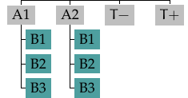

  * [fatadi_arranjo.pgf](https://github.com/walmes/Tikz/blob/master/src/fatadi_arranjo.pgf)

```tex
\def\d{1cm}
\def\k{0.6}

\begin{tikzpicture}[
  yscale=0.6,
  node distance=1 and 0.5,
  fator1/.style={%
    fill=gray!50},
  fator2/.style={%
    fill=darkgreen!80},
  profator2/.style={%
    grow=down, xshift=0.1cm, solid, anchor=west,
    edge from parent path={
      (\tikzparentnode.south) |- (\tikzchildnode.west)
    },
  },
  level1/.style ={level distance=1cm},
  level2/.style ={level distance=2cm},
  level3/.style ={level distance=3cm},
  level 1/.style={sibling distance=1cm, level distance=0.5cm}]

  \node[fator1] (A1) {A1}
    child [profator2, level1] {node[fator2] {B1}}
    child [profator2, level2] {node[fator2] {B2}}
    child [profator2, level3] {node[fator2] {B3}};
  \node[fator1, right=of A1] (A2) {A2}
    child [profator2, level1] {node[fator2] {B1}}
    child [profator2, level2] {node[fator2] {B2}}
    child [profator2, level3] {node[fator2] {B3}};
  \node[fator1, right=of A2] (Tm) {$T-$};
  \node[fator1, right=of Tm] (TM) {$T+$};
  \draw (A1) |- ($(A2)+(0,\k)$);
  \draw (A2) |- ($(Tm)+(0,\k)$);
  \draw (Tm) |- ($(TM)+(0,\k)$) -- (TM);
\end{tikzpicture}
```
****

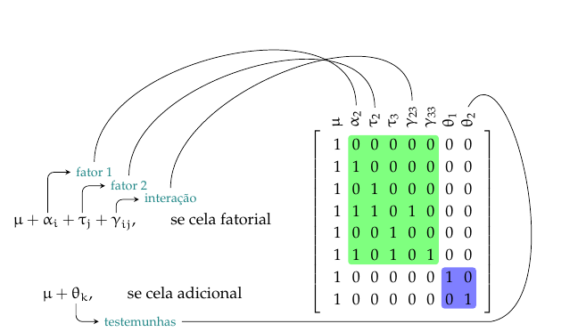

  * [fatadi_matricial_simples.pgf](https://github.com/walmes/Tikz/blob/master/src/fatadi_matricial_simples.pgf)

```tex
\tikzstyle{every picture}+=[remember picture]
\newcommand{\nann}[2]{%
  \tikz[baseline] {%
    \node[%
    anchor=base,%
    inner sep=0pt,%
    outer sep=0pt,%
    ] (#1) {#2};%
  }%
}

\begin{tikzpicture}[
  >=stealth,
  mtx/.style={
    matrix of math nodes,
    left delimiter={[}, right delimiter={]}
  },
  hlt/.style={
    draw=red, thick, outer sep=0pt, inner sep=0pt, rounded corners,
    inner sep=-1pt
  },
  hltr/.style={opacity=0.5, rounded corners=2pt, inner sep=-1pt},
  rpath/.style={<->, draw, rounded corners},
  epath/.style={draw, ->, rounded corners, shorten <=3pt, >=stealth},
  every node/.style={rounded corners=false},
  ann/.style={font=\footnotesize, color=darkgreen}]

  \node (fat) {
    $\mu+
    \nann{a}{$\alpha$}_{i}+
    \nann{t}{$\tau$}_{j}+
    \nann{g}{$\gamma$}_{ij},
    \qquad \text{se cela fatorial}$
  };

  \path[epath] (a.north) |- ++(0.5,1)
    node[ann,right] (fa) {fator 1};
  \path[epath] (t.north) |- ++(0.5,0.7)
    node[ann,right] (ft) {fator 2};
  \path[epath] (g.north) |- ++(0.5,0.4)
    node[ann,right] (fg) {intera\c{c}\~ao};

  \node[below=of fat] (adi) {
    $\mu+
    \nann{th}{$\theta$}_{k},
    \qquad \text{se cela adicional}$
  };

  \path[epath] (th.south) |- ++(0.5,-0.5)
    node[ann,right] (tt) {testemunhas};

  \matrix[mtx, right=of fat] (X) {
    1 & 0 & 0 & 0 & 0 & 0 & 0 & 0 \\ 
    1 & 1 & 0 & 0 & 0 & 0 & 0 & 0 \\ 
    1 & 0 & 1 & 0 & 0 & 0 & 0 & 0 \\ 
    1 & 1 & 1 & 0 & 1 & 0 & 0 & 0 \\ 
    1 & 0 & 0 & 1 & 0 & 0 & 0 & 0 \\ 
    1 & 1 & 0 & 1 & 0 & 1 & 0 & 0 \\ 
    1 & 0 & 0 & 0 & 0 & 0 & 1 & 0 \\ 
    1 & 0 & 0 & 0 & 0 & 0 & 0 & 1 \\
  };

  \begin{scope}[on background layer]
    \node[hltr, fill=blue, fit=(X-7-7)(X-8-8)] {};
    \node[hltr, fill=green, fit=(X-1-2)(X-6-6)] {};
    % \node[hltr, fill=green, fit=(X-1-2)(X-16-4)] {};
    % \node[hltr, fill=blue, fit=(X-1-5)(X-16-8)] {};
    % \node[hltr, fill=yellow, fit=(X-1-9)(X-16-20)] {};
  \end{scope}

  \foreach \col/\th in {
    1/$\mu$,2/$\alpha_2$,3/$\tau_2$,4/$\tau_3$,
    5/$\gamma_{23}$,6/$\gamma_{33}$,7/$\theta_1$,8/$\theta_2$
  }{
    \node[right, rotate=90, font=\tt]
      (p\col) at (X-1-\col.north) {\th};
  }

  \draw (fa) to[out=90, in=90] (p2.east);
  \draw (ft) to[out=90, in=90] (p3.east);
  \draw (fg) to[out=90, in=90] (p5.east);
  % \draw (tt) .. controls (X-8-8.south east) and +(5,-5) .. (p7.east);
  \draw (tt) to[out=0, in=180] ($(X-8-8.south)+(0.5,-0.25)$)
  to[out=10, in=60] (p8.east);

\end{tikzpicture}
```
****

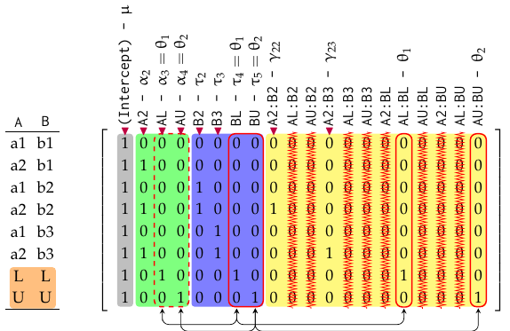

  * [fatadi_matricial.pgf](https://github.com/walmes/Tikz/blob/master/src/fatadi_matricial.pgf)

```tex
\begin{tikzpicture}[
  >=stealth,
  mtx/.style={
    matrix of math nodes,
    % row sep=0ex, column sep=0em, text height=1ex,
    left delimiter={[}, right delimiter={]}
  },
  hlt/.style={
    draw=red, thick, outer sep=0pt, inner sep=0pt,
    rounded corners, inner sep=-1pt
  },
  hltr/.style={opacity=0.5, rounded corners=2pt, inner sep=-1pt},
  rpath/.style={<->, draw, rounded corners}]

  \matrix[mtx] (X) at (0,0) {
    1 & 0 & 0 & 0 & 0 & 0 & 0 & 0 & 0 & 0 & 0 & 0 & 0 & 0 & 0 & 0 & 0 & 0 & 0 & 0 \\ 
    1 & 1 & 0 & 0 & 0 & 0 & 0 & 0 & 0 & 0 & 0 & 0 & 0 & 0 & 0 & 0 & 0 & 0 & 0 & 0 \\ 
    1 & 0 & 0 & 0 & 1 & 0 & 0 & 0 & 0 & 0 & 0 & 0 & 0 & 0 & 0 & 0 & 0 & 0 & 0 & 0 \\ 
    1 & 1 & 0 & 0 & 1 & 0 & 0 & 0 & 1 & 0 & 0 & 0 & 0 & 0 & 0 & 0 & 0 & 0 & 0 & 0 \\ 
    1 & 0 & 0 & 0 & 0 & 1 & 0 & 0 & 0 & 0 & 0 & 0 & 0 & 0 & 0 & 0 & 0 & 0 & 0 & 0 \\ 
    1 & 1 & 0 & 0 & 0 & 1 & 0 & 0 & 0 & 0 & 0 & 1 & 0 & 0 & 0 & 0 & 0 & 0 & 0 & 0 \\ 
    1 & 0 & 1 & 0 & 0 & 0 & 1 & 0 & 0 & 0 & 0 & 0 & 0 & 0 & 0 & 1 & 0 & 0 & 0 & 0 \\ 
    1 & 0 & 0 & 1 & 0 & 0 & 0 & 1 & 0 & 0 & 0 & 0 & 0 & 0 & 0 & 0 & 0 & 0 & 0 & 1 \\ 
  };

  \foreach \col/\th in {
    1/(Intercept) - $\mu$,
    2/A2 - $\alpha_2$,
    3/AL - $\alpha_3 = \theta_1$,
    4/AU - $\alpha_4 = \theta_2$,
    5/B2 - $\tau_2$,
    6/B3 - $\tau_3$,
    7/BL - $\tau_4 = \theta_1$,
    8/BU - $\tau_5 = \theta_2$,
    9/A2:B2 - $\gamma_{22}$,
    10/AL:B2,
    11/AU:B2,
    12/A2:B3 - $\gamma_{23}$,
    13/AL:B3,
    14/AU:B3,
    15/A2:BL,
    16/AL:BL - $\theta_1$,
    17/AU:BL,
    18/A2:BU,
    19/AL:BU,
    20/AU:BU - $\theta_2$
  }{
    \node[right, rotate=90, font=\tt] at (X-1-\col.north) {\th};
  }

  \begin{scope}[on background layer]
    \node[hltr, fill=gray, fit=(X-1-1)(X-8-1)] {};
    \node[hltr, fill=green, fit=(X-1-2)(X-8-4)] {};
    \node[hltr, fill=blue, fit=(X-1-5)(X-8-8)] {};
    \node[hltr, fill=yellow, fit=(X-1-9)(X-8-20)] {};
  \end{scope}

  \node[hlt, dashed, fit=(X-1-3)(X-8-4)] {};
  \node[hlt, fit=(X-1-7)(X-8-8)] {};
  \node[hlt, fit=(X-1-16)(X-8-16)] {};
  \node[hlt, fit=(X-1-20)(X-8-20)] {};

  \path[rpath] (X-8-3) |- ++(0,-0.6) -| (X-8-7);
  \path[rpath] (X-8-7) |- ++(0,-0.6) -| (X-8-16);
  \path[rpath] (X-8-4) |- ++(0,-0.75) -| (X-8-8);
  \path[rpath] (X-8-8) |- ++(0,-0.75) -| (X-8-20);

  \foreach \col in {10,11,13,14,15,17,18,19}{
    \draw[red, snake, segment length=2pt]
      (X-1-\col.north) -- (X-8-\col.south);
  }

  \foreach \col in {1,...,6,9,12}{
    \node[purple] at (X-1-\col.north)
      {\footnotesize $\blacktriangledown$};
  }

  \matrix[left=of X, matrix of nodes] (da) {
    \hline
    a1 & b1 \\ 
    a2 & b1 \\ 
    a1 & b2 \\ 
    a2 & b2 \\ 
    a1 & b3 \\ 
    a2 & b3 \\ 
    L & L \\ 
    U & U \\ \hline\\
  };

  \foreach \col/\th in {1/A, 2/B}{
    \node[above, rotate=0, font=\tt] at (da-1-\col.north) {\th};
  }

  \begin{scope}[on background layer]
    \node[hltr, fill=orange, fit=(da-7-1)(da-8-2)] {};
  \end{scope}

\end{tikzpicture}
```
****

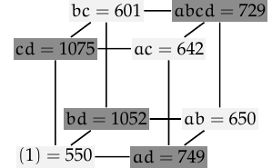

  * [fatorial_fracionado.pgf](https://github.com/walmes/Tikz/blob/master/src/fatorial_fracionado.pgf)

```tex
\tikzstyle{vertex1}=[
  rectangle, minimum size=12pt, inner sep=1pt, fill=gray!10]
\tikzstyle{vertex2}=[
  rectangle, minimum size=12pt, inner sep=1pt, fill=gray!90]
\tikzstyle{edge}=[draw,thick,-,black]

\begin{tikzpicture}[
  xscale=2.2, yscale=2.1, ->, thick,
  z={(0.45,0.35)}, node distance=0.65cm]
  \node[vertex1] (v0) at (0,0,0) {$(1) = 550$};
  \node[vertex2] (v1) at (0,1,0) {$cd = 1075$};
  \node[vertex2] (v2) at (1,0,0) {$ad = 749$};
  \node[vertex1] (v3) at (1,1,0) {$ac = 642$};
  \node[vertex2] (v4) at (0,0,1) {$bd = 1052$};
  \node[vertex1] (v5) at (0,1,1) {$bc = 601$};
  \node[vertex1] (v6) at (1,0,1) {$ab = 650$};
  \node[vertex2] (v7) at (1,1,1) {$abcd = 729$};
  \draw[edge] (v0) -- (v1) -- (v3) -- (v2) -- (v0);
  \draw[edge] (v0) -- (v4) -- (v5) -- (v1);
  \draw[edge] (v2) -- (v6) -- (v7) -- (v3);
  \draw[edge] (v4) -- (v6); \draw[edge] (v5) -- (v7);
\end{tikzpicture}
```
****

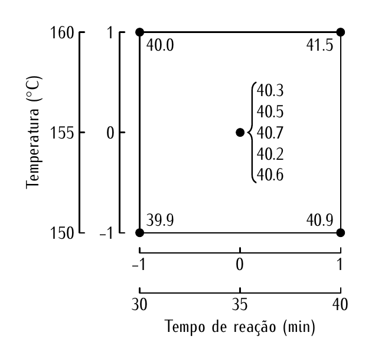

  * [fatorial_ponto_central-2a2.pgf](https://github.com/walmes/Tikz/blob/master/src/fatorial_ponto_central-2a2.pgf)

```tex
% Figure 6-35, page 273 in MONTGOMERY, D. C. Design and analysis of experiments. 5th ed. New York: John Wiley & Sons, 2001.
\usetikzlibrary{decorations.pathreplacing}%
\begin{tikzpicture}[%
  xscale = 2,
  yscale = 2,
  thick,
  line cap = round]

  \coordinate (1) at (-1, -1);
  \node[anchor = south west] at (1) {39.9};

  \coordinate (a) at (1, -1);
  \node[anchor = south east] at (a) {40.9};

  \coordinate (b) at (-1, 1);
  \node[anchor = north west] at (b) {40.0};

  \coordinate (ab) at (1, 1);
  \node[anchor = north east] at (ab) {41.5};

  \draw (1) -- (a) -- (ab) -- (b) -- (1);

  \coordinate (pc) at (0, 0);
  \node[xshift = 5.5pt, anchor = west, align = left]
    at (pc) {40.3\\ 40.5\\ 40.7\\ 40.2\\ 40.6};
  \draw [decorate, -, decoration = {brace, amplitude = 1ex},
    xshift = 4.5pt, yshift = 0pt] (0, -0.5) -- (0, 0.5);

  \foreach \p in {1, a, b, ab, pc} {
    \fill (\p) circle (1.25pt);
  }

  \begin{scope}[yshift = -1.2cm]
    \draw (-1, 0) -- (1, 0);
    \foreach \x in {-1, 0, 1} {
      \draw (\x, 0) -- (\x, 0.05) node[below = 2pt] {\x};
    }
  \end{scope}

  \begin{scope}[yshift = -1.6cm]
    \draw (-1, 0) -- (1, 0);
    \foreach \x/\a in {-1/30, 0/35, 1/40} {
      \draw (\x, 0) -- (\x, 0.05) node[below = 2pt] {\a};
    }
    \node at (0, -0.35) {Tempo de rea{\c c}{\~ a}o (min)};
  \end{scope}

  \begin{scope}[xshift = -1.2cm]
    \draw (0, -1) -- (0, 1);
    \foreach \y in {-1, 0, 1} {
      \draw (0, \y) -- (0.05, \y) node[left = 2pt] {\y};
    }
  \end{scope}

  \begin{scope}[xshift = -1.6cm]
    \draw (0, -1) -- (0, 1);
    \foreach \y/\a in {-1/150, 0/155, 1/160} {
      \draw (0, \y) -- (0.05, \y) node[left = 2pt] {\a};
    }
    \node[rotate = 90] at (-0.45, 0) {Temperatura ($^\circ$C)};
  \end{scope}

\end{tikzpicture}%
```
****

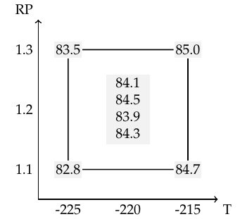

  * [fatorial_ponto_central.pgf](https://github.com/walmes/Tikz/blob/master/src/fatorial_ponto_central.pgf)

```tex
\def\dist{1.5}
\tikzstyle{vertex1}=[
  rectangle, minimum size=12pt, inner sep=1pt, fill=gray!10]
\tikzstyle{edge}=[draw,thick,-,black]

\begin{tikzpicture}[
  xscale=1.5, yscale=1.5, ->, thick, node distance=0.65cm]
  \draw[<->] (-\dist,\dist) node[above left] {RP} |-
    (\dist,-\dist) node[below right] {T};
  \node[left] at (-\dist,-1) {1.1};
  \node[left] at (-\dist,0) {1.2};
  \node[left] at (-\dist,1) {1.3};
  \node[below] at (-1,-\dist) {-225};
  \node[below] at (0,-\dist) {-220};
  \node[below] at (1,-\dist) {-215};
  \node[vertex1] (1) at (-1,-1) {$82.8$};
  \node[vertex1] (a) at (1,-1) {$84.7$};
  \node[vertex1] (b) at (-1,1) {$83.5$};
  \node[vertex1] (ab) at (1,1) {$85.0$};
  \node[vertex1] (0) at (0,0) {
    \begin{tabular}{c}
      84.1 \\ 84.5 \\ 83.9 \\ 84.3
    \end{tabular}
  };
  \draw[edge] (1) -- (a) -- (ab) -- (b) -- (1);
\end{tikzpicture}
```
****

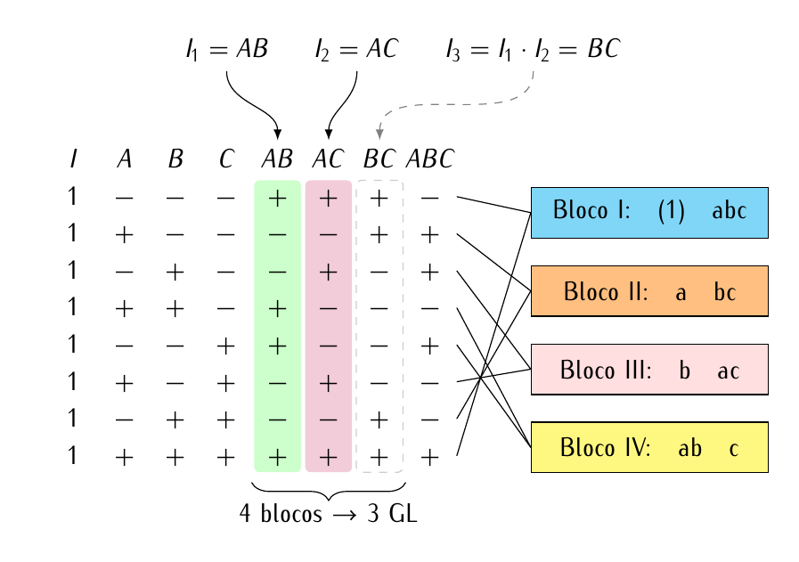

  * [fatorial-2a3-confundimento-ab-ac.pgf](https://github.com/walmes/Tikz/blob/master/src/fatorial-2a3-confundimento-ab-ac.pgf)

```tex
\usetikzlibrary{decorations.pathreplacing}%
\begin{tikzpicture}[%
  mtx/.style = {
    matrix of math nodes,
    % left delimiter = {[},
    % right delimiter = {]},
    nodes = {
      text width = 1.25em,
      text height = 1.5ex,
      align = center,
    }
  },
  edge/.style = {draw, line cap = round, line join = round},
  hltr/.style = {opacity = 0.2, rounded corners = 2pt, inner sep = -1pt},
  txtup/.style = {rotate = 0, above},
  txtbt/.style = {yshift = -1ex}
  ]

  \def\cube{

    \foreach \x in {0, 1} {
      \foreach \y in {0, 1} {
        \foreach \z in {0, 1} {
          \coordinate (v\x\y\z) at (\x, \y, \z);
        }
      }
    }

    \begin{scope}[on background layer]
      \foreach \y in {0, 1} {
        \draw[edge] (v0\y0) -- (v1\y0) -- (v1\y1) -- (v0\y1) -- cycle;
      }
      \foreach \x in {0, 1} {
        \foreach \z in {0, 1} {
          \draw[edge] (v\x0\z) -- (v\x1\z);
        }
      }
    \end{scope}

  } % \cube

  \begin{scope}[->, > = latex]

    \matrix (X) [mtx] {
      1 & - & - & - & + & + & + & - \\
      1 & + & - & - & - & - & + & + \\
      1 & - & + & - & - & + & - & + \\
      1 & + & + & - & + & - & - & - \\
      1 & - & - & + & + & - & - & + \\
      1 & + & - & + & - & + & - & - \\
      1 & - & + & + & - & - & + & - \\
      1 & + & + & + & + & + & + & + \\
    };

    \foreach \col/\lab in {1/I, 2/A, 3/B, 4/C, 5/AB, 6/AC, 7/BC, 8/ABC} {
      \node[txtup] (\lab) at (X-1-\col.north) {$\lab$};
    }

    \node[above = 4em of X-1-4] (I1) {$I_1 = AB$};
    \node[right = 1em of I1] (I2) {$I_2 = AC$};
    \node[right = 1em of I2] (I3) {$I_3 = I_1\cdot I_2 = BC$};

    \path (I1) edge[out = -90, in = 90] (AB);
    \path (I2) edge[out = -90, in = 90] (AC);
    \path[gray, dashed] (I3) edge[out = -90, in = 90] (BC);

    \draw [decorate, -, decoration = {brace, amplitude = 1.5ex}]
    ($(X-8-7.south east) + (0, -0.1)$) -- ($(X-8-5.south west) + (0, -0.1)$)
    node [midway, yshift = -1ex, anchor = north] {4 blocos $\rightarrow$ 3 GL};

  \end{scope}

  \begin{scope}[on background layer]
    \node[hltr, fill = green, fit = (X-1-5)(X-8-5)] {};
    \node[hltr, fill = purple, fit = (X-1-6)(X-8-6)] {};
    \node[hltr, draw, dashed, fit = (X-1-7)(X-8-7)] {};
  \end{scope}

  \newcommand{\experimentalpoint}[1]{
    \draw[fill = \mycol] (#1) circle (2.5pt);
  }

  \begin{scope}[inner sep = 1ex]

    \begin{scope}[scale = 0.75, xshift = 10.5cm, yshift = 3cm]
      \node[draw, fill = cyan!50!white] (bl1) at (-3.5, 0.2) {
        \begin{minipage}[c][1em]{8em}
          \begin{center}
            Bloco I:\quad (1)\quad abc
          \end{center}
        \end{minipage}
      };
      \cube{}
      \def\mycol{cyan!50!white}
      \experimentalpoint{v110};
      \experimentalpoint{v001};
    \end{scope}

    \begin{scope}[scale = 0.75, xshift = 10.5cm, yshift = 1cm]
      \node[draw, fill = orange!50!white] (bl2) at (-3.5, 0.2) {
        \begin{minipage}[c][1em]{8em}
          \begin{center}
            Bloco II:\quad a\quad bc
          \end{center}
        \end{minipage}
      };
      \cube{}
      \def\mycol{orange!50!white}
      \experimentalpoint{v101};
      \experimentalpoint{v010};
    \end{scope}

    \begin{scope}[scale = 0.75, xshift = 10.5cm, yshift = -1cm]
      \node[draw, fill = pink!50!white] (bl3) at (-3.5, 0.2) {
        \begin{minipage}[c][1em]{8em}
          \begin{center}
            Bloco III:\quad b\quad ac
          \end{center}
        \end{minipage}
      };
      \cube{}
      \def\mycol{pink!50!white}
      \experimentalpoint{v011};
      \experimentalpoint{v100};
    \end{scope}

    \begin{scope}[scale = 0.75, xshift = 10.5cm, yshift = -3cm]
      \node[draw, fill = yellow!50!white] (bl4) at (-3.5, 0.2) {
        \begin{minipage}[c][1em]{8em}
          \begin{center}
            Bloco IV:\quad ab\quad c
          \end{center}
        \end{minipage}
      };
      \cube{}
      \def\mycol{yellow!50!white}
      \experimentalpoint{v000};
      \experimentalpoint{v111};
    \end{scope}

  \end{scope}

  \foreach \line/\blc in {1/1, 8/1, 2/2, 7/2, 3/3, 6/3, 4/4, 5/4} {
    \path[draw] (X-\line-8.east) -- (bl\blc.west);
  }

\end{tikzpicture}%
```
****

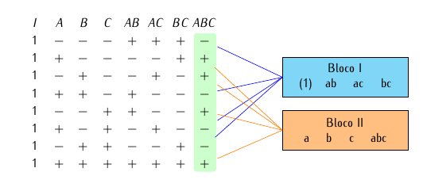

  * [fatorial-2a3-confundimento-abc.pgf](https://github.com/walmes/Tikz/blob/master/src/fatorial-2a3-confundimento-abc.pgf)

```tex
\begin{tikzpicture}[%
  mtx/.style = {
    matrix of math nodes,
    % left delimiter = {[},
    % right delimiter = {]},
    nodes = {
      text width = 1.25em,
      text height = 1.5ex,
      align = center,
    }
  },
  edge/.style = {draw, line cap = round, line join = round},
  hltr/.style = {opacity = 0.2, rounded corners = 2pt, inner sep = -1pt},
  txtup/.style = {rotate = 0, above},
  txtbt/.style = {yshift = -1ex}
  ]

  \def\cube{

    \foreach \x in {0, 1} {
      \foreach \y in {0, 1} {
        \foreach \z in {0, 1} {
          \coordinate (v\x\y\z) at (\x, \y, \z);
        }
      }
    }

    \begin{scope}[on background layer]
      \foreach \y in {0, 1} {
        \draw[edge] (v0\y0) -- (v1\y0) -- (v1\y1) -- (v0\y1) -- cycle;
      }
      \foreach \x in {0, 1} {
        \foreach \z in {0, 1} {
          \draw[edge] (v\x0\z) -- (v\x1\z);
        }
      }
    \end{scope}

  } % \cube

  \begin{scope}[->, > = latex]

    \matrix (X) [mtx] {
      1 & - & - & - & + & + & + & - \\
      1 & + & - & - & - & - & + & + \\
      1 & - & + & - & - & + & - & + \\
      1 & + & + & - & + & - & - & - \\
      1 & - & - & + & + & - & - & + \\
      1 & + & - & + & - & + & - & - \\
      1 & - & + & + & - & - & + & - \\
      1 & + & + & + & + & + & + & + \\
    };

    \foreach \col/\lab in {1/I, 2/A, 3/B, 4/C, 5/AB, 6/AC, 7/BC, 8/ABC} {
      \node[txtup] (\lab) at (X-1-\col.north) {$\lab$};
    }

    \node[above = 3em of X-1-8] (I1) {$I = ABC$};
    \path (I1) edge[out = -90, in = 90] (ABC);

    \draw [decorate, -, decoration = {brace, amplitude = 1.0ex}]
      ($(X-8-8.south east) + (0, -0.1)$) -- ($(X-8-8.south west) + (0, -0.1)$)
      node [midway, yshift = -1ex, anchor = north] {2 blocos $\rightarrow$ 1 GL};

  \end{scope}

  \begin{scope}[on background layer]
    \node[hltr, fill = green, fit = (X-1-8)(X-8-8)] {};
  \end{scope}

  \newcommand{\experimentalpoint}[1]{
    \draw[fill = \mycol] (#1) circle (2.5pt);
  }

  \begin{scope}[inner sep = 1ex]

    \begin{scope}[scale = 0.75, xshift = 11cm, yshift = 1cm]
      \node[draw, fill = cyan!50!white] (bl1) at (-3.5, 0.3) {
        \begin{minipage}[c][2.25em]{9em}
          \begin{center}
            Bloco I\\ (1)\quad ab \quad ac \quad bc
          \end{center}
        \end{minipage}
      };
      \cube{}
      \def\mycol{cyan!50!white}
      \experimentalpoint{v111};
      \experimentalpoint{v100};
      \experimentalpoint{v010};
      \experimentalpoint{v001};
    \end{scope}

    \begin{scope}[scale = 0.75, xshift = 11cm, yshift = -1.5cm]
      \node[draw, fill = orange!50!white] (bl2) at (-3.5, 0.3) {
        \begin{minipage}[c][2.25em]{9em}
          \begin{center}
            Bloco II\\ a \quad b \quad c \quad abc
          \end{center}
        \end{minipage}
      };
      \cube{}
      \def\mycol{orange!50!white}
      \experimentalpoint{v000};
      \experimentalpoint{v101};
      \experimentalpoint{v110};
      \experimentalpoint{v011};
    \end{scope}

    \foreach \line in {1, 4, 6, 7} {
      \path[draw, color = cyan] (X-\line-8.east) -- (bl1.west);
    }

    \foreach \line in {2, 3, 5, 8} {
      \path[draw, color = orange] (X-\line-8.east) -- (bl2.west);
    }

  \end{scope}

\end{tikzpicture}%
```
****

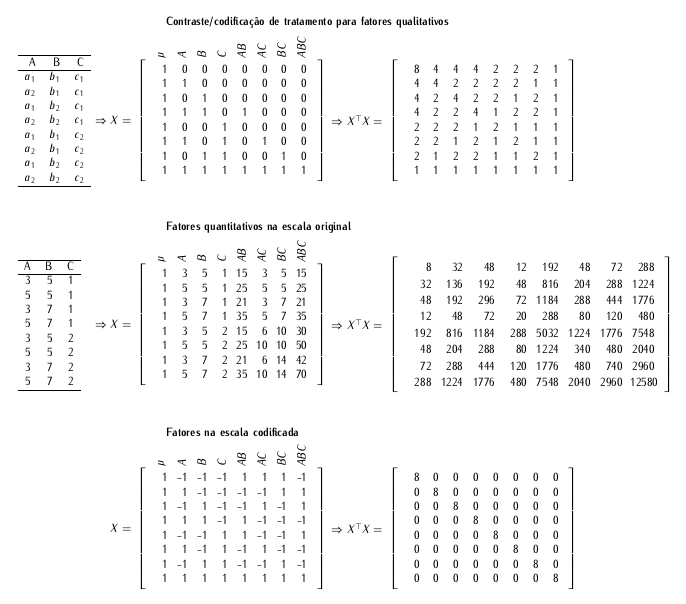

  * [fatorial-2k-codificacao.pgf](https://github.com/walmes/Tikz/blob/master/src/fatorial-2k-codificacao.pgf)

```tex
\begin{tikzpicture}[%
  mtx/.style = {
    matrix of math nodes,
    nodes in empty cells,
    left delimiter = {[},
    right delimiter = {]},
    every node/.style = {
      anchor = base,
      text width = 1em,
      text height = 1.2ex,
      align = right,
      anchor = base east
    }
  },
  hltr/.style = {opacity = 0.2, rounded corners = 2pt, inner sep = -1pt},
  txtup/.style = {rotate = 90, right},
  txtbt/.style = {yshift = -1ex}
]


% # Qualitative.
% da <- expand.grid(A = c("$a_1$", "$a_2$"),
%                   B = c("$b_1$", "$b_2$"),
%                   C = c("$c_1$", "$c_2$"),
%                   KEEP.OUT.ATTRS = FALSE)
% da
% 
% # Quantitative in the original scale.
% da <- expand.grid(A = c(3, 5),
%                   B = c(5, 7),
%                   C = c(1, 2),
%                   KEEP.OUT.ATTRS = FALSE)
% da
% 
% # Codified scale.
% da <- expand.grid(A = c(-1, 1),
%                   B = c(-1, 1),
%                   C = c(-1, 1),
%                   KEEP.OUT.ATTRS = FALSE)
% da
% 
% xtable::print.xtable(xtable::xtable(da, digits = 0),
%                      include.rownames = FALSE,
%                      # include.colnames = FALSE,
%                      only.contents = TRUE,
%                      sanitize.text.function = identity,
%                      comment = FALSE,
%                      hline.after = NULL)
% 
% X <- model.matrix(~A * B * C,
%                   data = da)
% 
% xtable::print.xtable(xtable::xtable(X, digits = 0),
%                      include.rownames = FALSE,
%                      include.colnames = FALSE,
%                      only.contents = TRUE,
%                      comment = FALSE,
%                      hline.after = NULL)
% 
% xtable::print.xtable(xtable::xtable(t(X) %*% X, digits = 0),
%                      include.rownames = FALSE,
%                      include.colnames = FALSE,
%                      only.contents = TRUE,
%                      comment = FALSE,
%                      hline.after = NULL)

\begin{scope}

  \matrix (X) [mtx] {
    1 & 0 & 0 & 0 & 0 & 0 & 0 & 0 \\ 
    1 & 1 & 0 & 0 & 0 & 0 & 0 & 0 \\ 
    1 & 0 & 1 & 0 & 0 & 0 & 0 & 0 \\ 
    1 & 1 & 1 & 0 & 1 & 0 & 0 & 0 \\ 
    1 & 0 & 0 & 1 & 0 & 0 & 0 & 0 \\ 
    1 & 1 & 0 & 1 & 0 & 1 & 0 & 0 \\ 
    1 & 0 & 1 & 1 & 0 & 0 & 1 & 0 \\ 
    1 & 1 & 1 & 1 & 1 & 1 & 1 & 1 \\ 
  };

  \node[left=1em of X] (Xequal) {$\Rightarrow X = $};
  \node[right=1em of X] (Xarrow) {$\Rightarrow X^\top X = $};

  \node[left = 2em of X, anchor = east] (tb) {
  \begin{minipage}{3cm}
  \begin{tabular}{rrr}
  \hline
    A & B & C \\ \hline
    $a_1$ & $b_1$ & $c_1$ \\ 
    $a_2$ & $b_1$ & $c_1$ \\ 
    $a_1$ & $b_2$ & $c_1$ \\ 
    $a_2$ & $b_2$ & $c_1$ \\ 
    $a_1$ & $b_1$ & $c_2$ \\ 
    $a_2$ & $b_1$ & $c_2$ \\ 
    $a_1$ & $b_2$ & $c_2$ \\ 
    $a_2$ & $b_2$ & $c_2$ \\ \hline
  \end{tabular}
  \end{minipage}
  };

  \matrix (XX) [mtx, right=1em of Xarrow] {
  8 & 4 & 4 & 4 & 2 & 2 & 2 & 1 \\ 
  4 & 4 & 2 & 2 & 2 & 2 & 1 & 1 \\ 
  4 & 2 & 4 & 2 & 2 & 1 & 2 & 1 \\ 
  4 & 2 & 2 & 4 & 1 & 2 & 2 & 1 \\ 
  2 & 2 & 2 & 1 & 2 & 1 & 1 & 1 \\ 
  2 & 2 & 1 & 2 & 1 & 2 & 1 & 1 \\ 
  2 & 1 & 2 & 2 & 1 & 1 & 2 & 1 \\ 
  1 & 1 & 1 & 1 & 1 & 1 & 1 & 1 \\ 
  };

  \node[above=2.5em of X-1-1, anchor = south west, align = left] {
    \textbf{Contraste/codifica{\c c}{\~ a}o de tratamento para fatores qualitativos}
  };

  % Efeitos.
  \node[txtup] at (X-1-1.north) {$\mu$};
  \node[txtup] at (X-1-2.north) {$A$};
  \node[txtup] at (X-1-3.north) {$B$};
  \node[txtup] at (X-1-4.north) {$C$};
  \node[txtup] at (X-1-5.north) {$AB$};
  \node[txtup] at (X-1-6.north) {$AC$};
  \node[txtup] at (X-1-7.north) {$BC$};
  \node[txtup] at (X-1-8.north) {$ABC$};

\end{scope}

\begin{scope}[yshift = -6cm]

  \matrix (X) [mtx] {
  1 & 3 & 5 & 1 & 15 & 3 & 5 & 15 \\ 
  1 & 5 & 5 & 1 & 25 & 5 & 5 & 25 \\ 
  1 & 3 & 7 & 1 & 21 & 3 & 7 & 21 \\ 
  1 & 5 & 7 & 1 & 35 & 5 & 7 & 35 \\ 
  1 & 3 & 5 & 2 & 15 & 6 & 10 & 30 \\ 
  1 & 5 & 5 & 2 & 25 & 10 & 10 & 50 \\ 
  1 & 3 & 7 & 2 & 21 & 6 & 14 & 42 \\ 
  1 & 5 & 7 & 2 & 35 & 10 & 14 & 70 \\ 
  };

  \node[left=1em of X] (Xequal) {$\Rightarrow X = $};
  \node[right=1em of X] (Xarrow) {$\Rightarrow X^\top X = $};

  \node[left = 2em of X, anchor = east] (tb) {
  \begin{minipage}{3cm}
  \begin{tabular}{rrr}
  \hline
    A & B & C \\ \hline
    3 & 5 & 1 \\ 
    5 & 5 & 1 \\ 
    3 & 7 & 1 \\ 
    5 & 7 & 1 \\ 
    3 & 5 & 2 \\ 
    5 & 5 & 2 \\ 
    3 & 7 & 2 \\ 
    5 & 7 & 2 \\ \hline
  \end{tabular}
  \end{minipage}
  };

  \matrix (XX) [mtx, right=1em of Xarrow,
    every node/.style = {text width = 2em, align = right},
  ] {
  8 & 32 & 48 & 12 & 192 & 48 & 72 & 288 \\ 
  32 & 136 & 192 & 48 & 816 & 204 & 288 & 1224 \\ 
  48 & 192 & 296 & 72 & 1184 & 288 & 444 & 1776 \\ 
  12 & 48 & 72 & 20 & 288 & 80 & 120 & 480 \\ 
  192 & 816 & 1184 & 288 & 5032 & 1224 & 1776 & 7548 \\ 
  48 & 204 & 288 & 80 & 1224 & 340 & 480 & 2040 \\ 
  72 & 288 & 444 & 120 & 1776 & 480 & 740 & 2960 \\ 
  288 & 1224 & 1776 & 480 & 7548 & 2040 & 2960 & 12580 \\ 
 };

  \node[above=2.5em of X-1-1, anchor = south west, align = left] {
    \textbf{Fatores quantitativos na escala original}
  };

  % Efeitos.
  \node[txtup] at (X-1-1.north) {$\mu$};
  \node[txtup] at (X-1-2.north) {$A$};
  \node[txtup] at (X-1-3.north) {$B$};
  \node[txtup] at (X-1-4.north) {$C$};
  \node[txtup] at (X-1-5.north) {$AB$};
  \node[txtup] at (X-1-6.north) {$AC$};
  \node[txtup] at (X-1-7.north) {$BC$};
  \node[txtup] at (X-1-8.north) {$ABC$};

\end{scope}

\begin{scope}[yshift = -12cm]

  \matrix (X) [mtx] {
  1 & -1 & -1 & -1 & 1 & 1 & 1 & -1 \\ 
  1 & 1 & -1 & -1 & -1 & -1 & 1 & 1 \\ 
  1 & -1 & 1 & -1 & -1 & 1 & -1 & 1 \\ 
  1 & 1 & 1 & -1 & 1 & -1 & -1 & -1 \\ 
  1 & -1 & -1 & 1 & 1 & -1 & -1 & 1 \\ 
  1 & 1 & -1 & 1 & -1 & 1 & -1 & -1 \\ 
  1 & -1 & 1 & 1 & -1 & -1 & 1 & -1 \\ 
  1 & 1 & 1 & 1 & 1 & 1 & 1 & 1 \\ 
  };

  \node[left=1em of X] (Xequal) {$X = $};
  \node[right=1em of X] (Xarrow) {$\Rightarrow X^\top X = $};

  \matrix (XX) [mtx, right=1em of Xarrow] {
  8 & 0 & 0 & 0 & 0 & 0 & 0 & 0 \\ 
  0 & 8 & 0 & 0 & 0 & 0 & 0 & 0 \\ 
  0 & 0 & 8 & 0 & 0 & 0 & 0 & 0 \\ 
  0 & 0 & 0 & 8 & 0 & 0 & 0 & 0 \\ 
  0 & 0 & 0 & 0 & 8 & 0 & 0 & 0 \\ 
  0 & 0 & 0 & 0 & 0 & 8 & 0 & 0 \\ 
  0 & 0 & 0 & 0 & 0 & 0 & 8 & 0 \\ 
  0 & 0 & 0 & 0 & 0 & 0 & 0 & 8 \\ 
 };

  \node[above=2.5em of X-1-1, anchor = south west, align = left] {
    \textbf{Fatores na escala codificada}
  };

  % Efeitos.
  \node[txtup] at (X-1-1.north) {$\mu$};
  \node[txtup] at (X-1-2.north) {$A$};
  \node[txtup] at (X-1-3.north) {$B$};
  \node[txtup] at (X-1-4.north) {$C$};
  \node[txtup] at (X-1-5.north) {$AB$};
  \node[txtup] at (X-1-6.north) {$AC$};
  \node[txtup] at (X-1-7.north) {$BC$};
  \node[txtup] at (X-1-8.north) {$ABC$};

\end{scope}

\end{tikzpicture}%
```
****

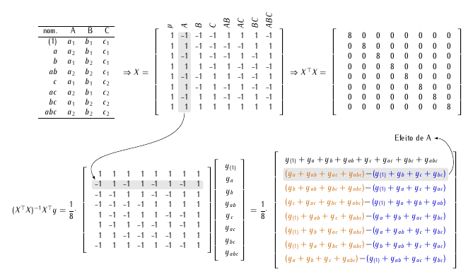

  * [fatorial-2k-efeito.pgf](https://github.com/walmes/Tikz/blob/master/src/fatorial-2k-efeito.pgf)

```tex
\begin{tikzpicture}[%
  mtx/.style = {
    matrix of math nodes,
    nodes in empty cells,
    left delimiter = {[},
    right delimiter = {]},
    every node/.style = {
      anchor = base,
      text width = 1em,
      text height = 1.2ex,
      align = right,
      anchor = base east
    }
  },
  every path/.style = {> = latex},
  hltr/.style = {opacity = 0.2, rounded corners = 2pt, inner sep = -1pt},
  txtup/.style = {rotate = 90, right},
  txtbt/.style = {yshift = -1ex}
]


% # Qualitative.
% da <- expand.grid(A = c("$a_1$", "$a_2$"),
%                   B = c("$b_1$", "$b_2$"),
%                   C = c("$c_1$", "$c_2$"),
%                   KEEP.OUT.ATTRS = FALSE)
% da
% 
% # Quantitative in the original scale.
% da <- expand.grid(A = c(3, 5),
%                   B = c(5, 7),
%                   C = c(1, 2),
%                   KEEP.OUT.ATTRS = FALSE)
% da
% 
% # Codified scale.
% da <- expand.grid(A = c(-1, 1),
%                   B = c(-1, 1),
%                   C = c(-1, 1),
%                   KEEP.OUT.ATTRS = FALSE)
% da
% 
% xtable::print.xtable(xtable::xtable(da, digits = 0),
%                      include.rownames = FALSE,
%                      # include.colnames = FALSE,
%                      only.contents = TRUE,
%                      sanitize.text.function = identity,
%                      comment = FALSE,
%                      hline.after = NULL)
% 
% X <- model.matrix(~A * B * C,
%                   data = da)
% 
% xtable::print.xtable(xtable::xtable(X, digits = 0),
%                      include.rownames = FALSE,
%                      include.colnames = FALSE,
%                      only.contents = TRUE,
%                      comment = FALSE,
%                      hline.after = NULL)
% 
% xtable::print.xtable(xtable::xtable(t(X) %*% X, digits = 0),
%                      include.rownames = FALSE,
%                      include.colnames = FALSE,
%                      only.contents = TRUE,
%                      comment = FALSE,
%                      hline.after = NULL)

\begin{scope}

  \matrix (X) [mtx] {
  1 & -1 & -1 & -1 & 1 & 1 & 1 & -1 \\ 
  1 & 1 & -1 & -1 & -1 & -1 & 1 & 1 \\ 
  1 & -1 & 1 & -1 & -1 & 1 & -1 & 1 \\ 
  1 & 1 & 1 & -1 & 1 & -1 & -1 & -1 \\ 
  1 & -1 & -1 & 1 & 1 & -1 & -1 & 1 \\ 
  1 & 1 & -1 & 1 & -1 & 1 & -1 & -1 \\ 
  1 & -1 & 1 & 1 & -1 & -1 & 1 & -1 \\ 
  1 & 1 & 1 & 1 & 1 & 1 & 1 & 1 \\ 
  };

  \node[left=1em of X] (Xequal) {$\Rightarrow X = $};
  \node[right=1em of X] (Xarrow) {$\Rightarrow X^\top X = $};

  \node[left = 2em of X, anchor = east] (tb) {
  \begin{minipage}{4.25cm}
  \begin{tabular}{rrrr}
  \hline
  nom. & A & B & C \\ \hline
  $(1)$ & $a_1$ & $b_1$ & $c_1$ \\ 
  $a$   & $a_2$ & $b_1$ & $c_1$ \\ 
  $b$   & $a_1$ & $b_2$ & $c_1$ \\ 
  $ab$  & $a_2$ & $b_2$ & $c_1$ \\ 
  $c$   & $a_1$ & $b_1$ & $c_2$ \\ 
  $ac$  & $a_2$ & $b_1$ & $c_2$ \\ 
  $bc$  & $a_1$ & $b_2$ & $c_2$ \\ 
  $abc$ & $a_2$ & $b_2$ & $c_2$ \\ \hline
  \end{tabular}
  \end{minipage}
  };

  \matrix (XX) [mtx, right=1em of Xarrow] {
  8 & 0 & 0 & 0 & 0 & 0 & 0 & 0 \\ 
  0 & 8 & 0 & 0 & 0 & 0 & 0 & 0 \\ 
  0 & 0 & 8 & 0 & 0 & 0 & 0 & 0 \\ 
  0 & 0 & 0 & 8 & 0 & 0 & 0 & 0 \\ 
  0 & 0 & 0 & 0 & 8 & 0 & 0 & 0 \\ 
  0 & 0 & 0 & 0 & 0 & 8 & 0 & 0 \\ 
  0 & 0 & 0 & 0 & 0 & 0 & 8 & 0 \\ 
  0 & 0 & 0 & 0 & 0 & 0 & 0 & 8 \\ 
  };

  % Efeitos.
  \node[txtup] at (X-1-1.north) {$\mu$};
  \node[txtup] at (X-1-2.north) {$A$};
  \node[txtup] at (X-1-3.north) {$B$};
  \node[txtup] at (X-1-4.north) {$C$};
  \node[txtup] at (X-1-5.north) {$AB$};
  \node[txtup] at (X-1-6.north) {$AC$};
  \node[txtup] at (X-1-7.north) {$BC$};
  \node[txtup] at (X-1-8.north) {$ABC$};

  \begin{scope}[on background layer]
    \node[hltr, fill = gray, fit = (X-1-2) (X-8-2)] {};
  \end{scope}

  \matrix (Xtrans) [mtx, below = 6em of X, xshift = -3cm] {
  1 & 1 & 1 & 1 & 1 & 1 & 1 & 1 \\ 
  -1 & 1 & -1 & 1 & -1 & 1 & -1 & 1 \\ 
  -1 & -1 & 1 & 1 & -1 & -1 & 1 & 1 \\ 
  -1 & -1 & -1 & -1 & 1 & 1 & 1 & 1 \\ 
  1 & -1 & -1 & 1 & 1 & -1 & -1 & 1 \\ 
  1 & -1 & 1 & -1 & -1 & 1 & -1 & 1 \\ 
  1 & 1 & -1 & -1 & -1 & -1 & 1 & 1 \\ 
  -1 & 1 & 1 & -1 & 1 & -1 & -1 & 1 \\ 
  };

  \begin{scope}[on background layer]
    \node[hltr, fill = gray, fit = (Xtrans-2-1) (Xtrans-2-8)] {};
  \end{scope}

  \path[->] (X-8-2) edge[out = -90, in = 120] (Xtrans-2-1);

  \matrix (y) [mtx, right = 1.5em of Xtrans] {
  $y_{(1)}$ \\ 
  $y_{a}$ \\ 
  $y_{b}$ \\ 
  $y_{ab}$ \\ 
  $y_{c}$ \\ 
  $y_{ac}$ \\ 
  $y_{bc}$ \\ 
  $y_{abc}$ \\ 
  };

  \node[left = 1em of Xtrans] {$(X^\top X)^{-1} X^\top y = \displaystyle \frac{1}{8} \cdot$};
  \node[right = 1em of y] (Xy) {$ = \displaystyle \frac{1}{8} \cdot$};

  \matrix (beta) [mtx, right = 1em of Xy, every node/.style = {text width = 19em}] {
  $y_{(1)} + y_{a} + y_{b} + y_{ab} + y_{c} + y_{ac} + y_{bc} + y_{abc}$\\
  $\textcolor{orange!80!black}{(y_{a} + y_{ab} + y_{ac} + y_{abc})} - \textcolor{blue!80!black}{(y_{(1)} + y_{b} + y_{c} + y_{bc})}$\\
  $\textcolor{orange!80!black}{(y_{b} + y_{ab} + y_{bc} + y_{abc})} - \textcolor{blue!80!black}{(y_{(1)} + y_{a} + y_{c} + y_{ac})}$\\
  $\textcolor{orange!80!black}{(y_{c} + y_{ac} + y_{bc} + y_{abc})} - \textcolor{blue!80!black}{(y_{(1)} + y_{a} + y_{b} + y_{ab})}$\\
  $\textcolor{orange!80!black}{(y_{(1)} + y_{ab} + y_{c} + y_{abc})} - \textcolor{blue!80!black}{(y_{a} + y_{b} + y_{ac} + y_{bc})}$\\
  $\textcolor{orange!80!black}{(y_{(1)} + y_{b} + y_{ac} + y_{abc})} - \textcolor{blue!80!black}{(y_{a} + y_{ab} + y_{c} + y_{bc})}$\\
  $\textcolor{orange!80!black}{(y_{(1)} + y_{a} + y_{bc} + y_{abc})} - \textcolor{blue!80!black}{(y_{b} + y_{ab} + y_{c} + y_{ac})}$\\
  $\textcolor{orange!80!black}{(y_{a} + y_{b} + y_{c} + y_{abc})} - \textcolor{blue!80!black}{(y_{(1)} + y_{ab} + y_{ac} + y_{bc})}$\\
  };

  \node (ef) at ($(beta-2-1.east) + (-1.5, 1.5)$) {Efeito de A};
  \path[->] (beta-2-1.east) edge[out = 45, in = 0] (ef);

  \begin{scope}[on background layer]
    \node[hltr, fill = gray, fit = (beta-2-1) (beta-2-1)] {};
  \end{scope}

\end{scope}

\end{tikzpicture}%
```
****

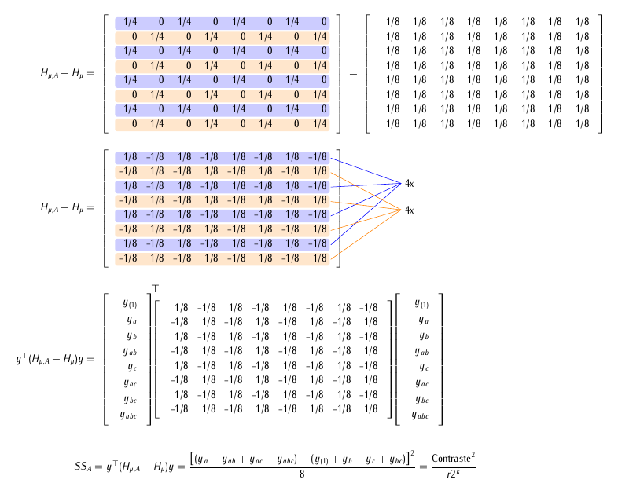

  * [fatorial-2k-soma-de-quadrado.pgf](https://github.com/walmes/Tikz/blob/master/src/fatorial-2k-soma-de-quadrado.pgf)

```tex
\begin{tikzpicture}[%
  mtx/.style = {
    matrix of math nodes,
    nodes in empty cells,
    left delimiter = {[},
    right delimiter = {]},
    every node/.style = {
      anchor = base,
      text width = 1.8em,
      text height = 1.2ex,
      align = right,
      anchor = base east
    }
  },
  every path/.style = {> = latex},
  hltr/.style = {opacity = 0.2, rounded corners = 2pt, inner sep = -1pt},
  txtup/.style = {rotate = 90, right},
  txtbt/.style = {yshift = -1ex}
]

\begin{scope}

  \matrix (H1) [mtx] {
  1/4 & 0 & 1/4 & 0 & 1/4 & 0 & 1/4 & 0 \\ 
  0 & 1/4 & 0 & 1/4 & 0 & 1/4 & 0 & 1/4 \\ 
  1/4 & 0 & 1/4 & 0 & 1/4 & 0 & 1/4 & 0 \\ 
  0 & 1/4 & 0 & 1/4 & 0 & 1/4 & 0 & 1/4 \\ 
  1/4 & 0 & 1/4 & 0 & 1/4 & 0 & 1/4 & 0 \\ 
  0 & 1/4 & 0 & 1/4 & 0 & 1/4 & 0 & 1/4 \\ 
  1/4 & 0 & 1/4 & 0 & 1/4 & 0 & 1/4 & 0 \\ 
  0 & 1/4 & 0 & 1/4 & 0 & 1/4 & 0 & 1/4 \\ 
  };

  \node[left = 1em of H1] {$H_{\mu, A} - H_{\mu} = $};
  \node[right = 1em of H1] (H1minusH0) {$ - $};

  \matrix (H0) [mtx, right = 1em of H1minusH0] {
  1/8 & 1/8 & 1/8 & 1/8 & 1/8 & 1/8 & 1/8 & 1/8 \\ 
  1/8 & 1/8 & 1/8 & 1/8 & 1/8 & 1/8 & 1/8 & 1/8 \\ 
  1/8 & 1/8 & 1/8 & 1/8 & 1/8 & 1/8 & 1/8 & 1/8 \\ 
  1/8 & 1/8 & 1/8 & 1/8 & 1/8 & 1/8 & 1/8 & 1/8 \\ 
  1/8 & 1/8 & 1/8 & 1/8 & 1/8 & 1/8 & 1/8 & 1/8 \\ 
  1/8 & 1/8 & 1/8 & 1/8 & 1/8 & 1/8 & 1/8 & 1/8 \\ 
  1/8 & 1/8 & 1/8 & 1/8 & 1/8 & 1/8 & 1/8 & 1/8 \\ 
  1/8 & 1/8 & 1/8 & 1/8 & 1/8 & 1/8 & 1/8 & 1/8 \\ 
  };

  \matrix (H1H0) [mtx, below = 1em of H1] {
  1/8 & -1/8 & 1/8 & -1/8 & 1/8 & -1/8 & 1/8 & -1/8 \\ 
  -1/8 & 1/8 & -1/8 & 1/8 & -1/8 & 1/8 & -1/8 & 1/8 \\ 
  1/8 & -1/8 & 1/8 & -1/8 & 1/8 & -1/8 & 1/8 & -1/8 \\ 
  -1/8 & 1/8 & -1/8 & 1/8 & -1/8 & 1/8 & -1/8 & 1/8 \\ 
  1/8 & -1/8 & 1/8 & -1/8 & 1/8 & -1/8 & 1/8 & -1/8 \\ 
  -1/8 & 1/8 & -1/8 & 1/8 & -1/8 & 1/8 & -1/8 & 1/8 \\ 
  1/8 & -1/8 & 1/8 & -1/8 & 1/8 & -1/8 & 1/8 & -1/8 \\ 
  -1/8 & 1/8 & -1/8 & 1/8 & -1/8 & 1/8 & -1/8 & 1/8 \\ 
  };

  \node[left = 1em of H1H0] {$H_{\mu, A} - H_{\mu} = $};

  \node (times1) at (6, -3.5) {4x};
  \node[below = 1em of times1] (times2) {4x};
  \foreach \x in {1,3,...,7} {
     \path[color = blue] (H1H0-\x-8.east) edge (times1.west);
  }
  \foreach \x in {2,4,...,8} {
     \path[color = orange] (H1H0-\x-8.east) edge (times2.west);
  }

  \begin{scope}[on background layer]
    \node[hltr, fill = blue, fit = (H1-1-1) (H1-1-8)] {};
    \node[hltr, fill = orange, fit = (H1-2-1) (H1-2-8)] {};
    \node[hltr, fill = blue, fit = (H1-3-1) (H1-3-8)] {};
    \node[hltr, fill = orange, fit = (H1-4-1) (H1-4-8)] {};
    \node[hltr, fill = blue, fit = (H1-5-1) (H1-5-8)] {};
    \node[hltr, fill = orange, fit = (H1-6-1) (H1-6-8)] {};
    \node[hltr, fill = blue, fit = (H1-7-1) (H1-7-8)] {};
    \node[hltr, fill = orange, fit = (H1-8-1) (H1-8-8)] {};
  \end{scope}

  \begin{scope}[on background layer]
    \node[hltr, fill = blue, fit = (H1H0-1-1) (H1H0-1-8)] {};
    \node[hltr, fill = orange, fit = (H1H0-2-1) (H1H0-2-8)] {};
    \node[hltr, fill = blue, fit = (H1H0-3-1) (H1H0-3-8)] {};
    \node[hltr, fill = orange, fit = (H1H0-4-1) (H1H0-4-8)] {};
    \node[hltr, fill = blue, fit = (H1H0-5-1) (H1H0-5-8)] {};
    \node[hltr, fill = orange, fit = (H1H0-6-1) (H1H0-6-8)] {};
    \node[hltr, fill = blue, fit = (H1H0-7-1) (H1H0-7-8)] {};
    \node[hltr, fill = orange, fit = (H1H0-8-1) (H1H0-8-8)] {};
  \end{scope}

  \begin{scope}

  \matrix (yH1H0y) [mtx, below = 2.5em of H1H0, xshift = 1.64cm] {
  1/8 & -1/8 & 1/8 & -1/8 & 1/8 & -1/8 & 1/8 & -1/8 \\ 
  -1/8 & 1/8 & -1/8 & 1/8 & -1/8 & 1/8 & -1/8 & 1/8 \\ 
  1/8 & -1/8 & 1/8 & -1/8 & 1/8 & -1/8 & 1/8 & -1/8 \\ 
  -1/8 & 1/8 & -1/8 & 1/8 & -1/8 & 1/8 & -1/8 & 1/8 \\ 
  1/8 & -1/8 & 1/8 & -1/8 & 1/8 & -1/8 & 1/8 & -1/8 \\ 
  -1/8 & 1/8 & -1/8 & 1/8 & -1/8 & 1/8 & -1/8 & 1/8 \\ 
  1/8 & -1/8 & 1/8 & -1/8 & 1/8 & -1/8 & 1/8 & -1/8 \\ 
  -1/8 & 1/8 & -1/8 & 1/8 & -1/8 & 1/8 & -1/8 & 1/8 \\ 
  };

  \matrix (yH) [mtx, left = 1.5em of yH1H0y] {
  $y_{(1)}$ \\ 
  $y_{a}$ \\ 
  $y_{b}$ \\ 
  $y_{ab}$ \\ 
  $y_{c}$ \\ 
  $y_{ac}$ \\ 
  $y_{bc}$ \\ 
  $y_{abc}$ \\ 
  };

  \node[left = 1em of yH] {$y^\top (H_{\mu, A} - H_{\mu}) y = $};

  \node at ($(yH-1-1) + (0.9, 0.5)$) {$\top$};

  \matrix (Hy) [mtx, right = 1.5em of yH1H0y] {
  $y_{(1)}$ \\ 
  $y_{a}$ \\ 
  $y_{b}$ \\ 
  $y_{ab}$ \\ 
  $y_{c}$ \\ 
  $y_{ac}$ \\ 
  $y_{bc}$ \\ 
  $y_{abc}$ \\ 
  };

  \end{scope}

  \begin{scope}[yshift = -12.5cm, xshift = 1.7cm]

  \node {
    $
    SS_{A} = y^\top (H_{\mu, A} - H_{\mu}) y = 
    \displaystyle\frac{ 
      \left[ (y_{a} + y_{ab} + y_{ac} + y_{abc}) - (y_{(1)} + y_{b} + y_{c} + y_{bc})
      \right]^2}{
      8} = \frac{\text{Contraste}^2}{r2^k}
    $
  };

  \end{scope}

\end{scope}

\end{tikzpicture}%
```
****

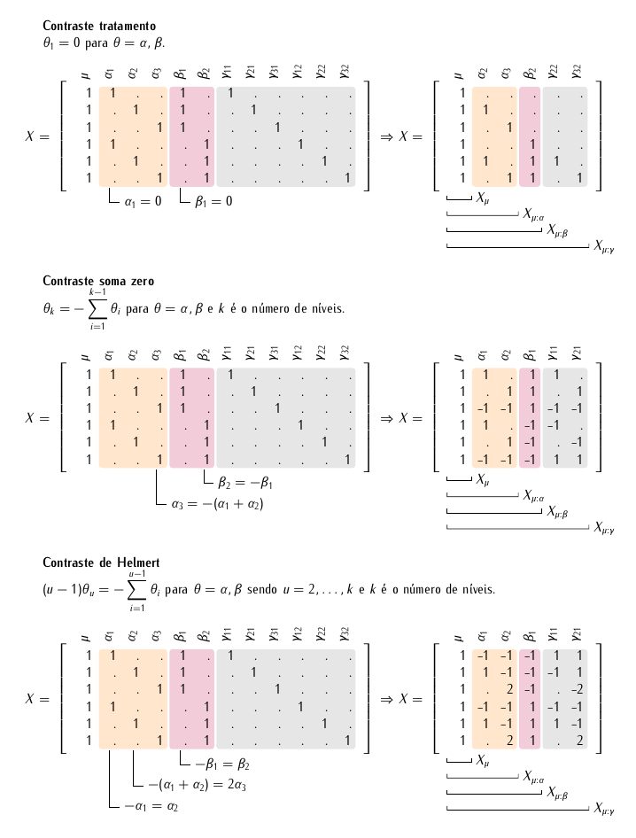

  * [fatorial-duplo-contrastes.pgf](https://github.com/walmes/Tikz/blob/master/src/fatorial-duplo-contrastes.pgf)

```tex
\begin{tikzpicture}[%
  mtx/.style = {
    matrix of math nodes,
    nodes in empty cells,
    left delimiter = {[},
    right delimiter = {]},
    every node/.style = {
      anchor = base,
      text width = 1em,
      text height = 1.2ex,
      align = right,
      anchor = base east
    }
  },
  hltr/.style = {opacity = 0.2, rounded corners = 2pt, inner sep = -1pt},
  txtup/.style = {rotate = 90, right},
  txtbt/.style = {yshift = -1ex}
]

\begin{scope}

  \matrix (X) at (0, 0) [mtx] {
    1 & 1 & . & . & 1 & . & 1 & . & . & . & . & . \\
    1 & . & 1 & . & 1 & . & . & 1 & . & . & . & . \\
    1 & . & . & 1 & 1 & . & . & . & 1 & . & . & . \\
    1 & 1 & . & . & . & 1 & . & . & . & 1 & . & . \\
    1 & . & 1 & . & . & 1 & . & . & . & . & 1 & . \\
    1 & . & . & 1 & . & 1 & . & . & . & . & . & 1 \\
  };

  \node[left=1em of X] (Xequal) {$X = $};
  \node[right=1em of X] (Xarrow) {$\Rightarrow X = $};

  \node[above=5em of Xequal, anchor = south west, align = left] {
    \textbf{Contraste tratamento}\\
    $\theta_1 = 0$ para $\theta = \alpha, \beta$.
  };

  % Efeitos.
  \node[txtup] at (X-1-1.north) {$\mu$};
  \node[txtup] at (X-1-2.north) {$\alpha_1$};
  \node[txtup] at (X-1-3.north) {$\alpha_2$};
  \node[txtup] at (X-1-4.north) {$\alpha_3$};
  \node[txtup] at (X-1-5.north) {$\beta_1$};
  \node[txtup] at (X-1-6.north) {$\beta_2$};
  \node[txtup] at (X-1-7.north) {$\gamma_{11}$};
  \node[txtup] at (X-1-8.north) {$\gamma_{21}$};
  \node[txtup] at (X-1-9.north) {$\gamma_{31}$};
  \node[txtup] at (X-1-10.north) {$\gamma_{12}$};
  \node[txtup] at (X-1-11.north) {$\gamma_{22}$};
  \node[txtup] at (X-1-12.north) {$\gamma_{32}$};

  % Restricoes.
  \draw (X-6-2.south) |- +(0.25, -1em) node[right] {$\alpha_1 = 0$};
  \draw (X-6-5.south) |- +(0.25, -1em) node[right] {$\beta_1 = 0$};

  % Colunas de efeitos.
  \begin{scope}[on background layer]
  \node[hltr, fill = orange, fit = (X-1-2)(X-6-4)] {};
  \node[hltr, fill = purple, fit = (X-1-5)(X-6-6)] {};
  \node[hltr, fill = gray,   fit = (X-1-7)(X-6-12)] {};
  \end{scope}

  \matrix (XX) [mtx, right = 1em of Xarrow] {
  1 & . & . & . & . & . \\ 
  1 & 1 & . & . & . & . \\ 
  1 & . & 1 & . & . & . \\ 
  1 & . & . & 1 & . & . \\ 
  1 & 1 & . & 1 & 1 & . \\ 
  1 & . & 1 & 1 & . & 1 \\ 
  };

  % Efeitos.
  \node[txtup] at (XX-1-1.north) {$\mu$};
  \node[txtup] at (XX-1-2.north) {$\alpha_2$};
  \node[txtup] at (XX-1-3.north) {$\alpha_3$};
  \node[txtup] at (XX-1-4.north) {$\beta_2$};
  \node[txtup] at (XX-1-5.north) {$\gamma_{22}$};
  \node[txtup] at (XX-1-6.north) {$\gamma_{32}$};

  % Colunas de efeitos.
  \begin{scope}[on background layer]
  \node[hltr, fill = orange, fit = (XX-1-2)(XX-6-3)] {};
  \node[hltr, fill = purple, fit = (XX-1-4)(XX-6-4)] {};
  \node[hltr, fill = gray,   fit = (XX-1-5)(XX-6-6)] {};
  \end{scope}

  \draw ($(XX-6-1.west)+(0, -.40)$) |- +(0, -0.1) -- ($(XX-6-1.east)+(0, -.50)$) node[right] {$X_{\mu}$} -- +(0, 0.1);

  \draw ($(XX-6-1.west)+(0, -.80)$) |- +(0, -0.1) -- ($(XX-6-3.east)+(0, -.90)$) node[right] {$X_{\mu:\alpha}$} -- +(0, 0.1);
  \draw ($(XX-6-1.west)+(0, -1.2)$) |- +(0, -0.1) -- ($(XX-6-4.east)+(0, -1.3)$) node[right] {$X_{\mu:\beta}$} -- +(0, 0.1);
  \draw ($(XX-6-1.west)+(0, -1.6)$) |- +(0, -0.1) -- ($(XX-6-6.east)+(0, -1.7)$) node[right] {$X_{\mu:\gamma}$} -- +(0, 0.1);

\end{scope}


\begin{scope}[yshift = -7cm]

  \matrix (X) at (0, 0) [mtx] {
    1 & 1 & . & . & 1 & . & 1 & . & . & . & . & . \\
    1 & . & 1 & . & 1 & . & . & 1 & . & . & . & . \\
    1 & . & . & 1 & 1 & . & . & . & 1 & . & . & . \\
    1 & 1 & . & . & . & 1 & . & . & . & 1 & . & . \\
    1 & . & 1 & . & . & 1 & . & . & . & . & 1 & . \\
    1 & . & . & 1 & . & 1 & . & . & . & . & . & 1 \\
  };

  \node[left=1em of X] (Xequal) {$X = $};
  \node[right=1em of X] (Xarrow) {$\Rightarrow X = $};

  \node[above=5em of Xequal, anchor = south west, align = left] {
    \textbf{Contraste soma zero}\\
    $\theta_k = -\displaystyle\sum_{i = 1}^{k - 1} \theta_i$ para $\theta = \alpha, \beta$
    e $k$ {\' e} o n{\' u}mero de n{\' i}veis.
  };

  % Efeitos.
  \node[txtup] at (X-1-1.north) {$\mu$};
  \node[txtup] at (X-1-2.north) {$\alpha_1$};
  \node[txtup] at (X-1-3.north) {$\alpha_2$};
  \node[txtup] at (X-1-4.north) {$\alpha_3$};
  \node[txtup] at (X-1-5.north) {$\beta_1$};
  \node[txtup] at (X-1-6.north) {$\beta_2$};
  \node[txtup] at (X-1-7.north) {$\gamma_{11}$};
  \node[txtup] at (X-1-8.north) {$\gamma_{21}$};
  \node[txtup] at (X-1-9.north) {$\gamma_{31}$};
  \node[txtup] at (X-1-10.north) {$\gamma_{12}$};
  \node[txtup] at (X-1-11.north) {$\gamma_{22}$};
  \node[txtup] at (X-1-12.north) {$\gamma_{32}$};

  % Restricoes.
  \draw (X-6-4.south) |- +(0.25, -2.5em) node[right] {$\alpha_3 = -(\alpha_1 + \alpha_2)$};
  \draw (X-6-6.south) |- +(0.25, -1em) node[right] {$\beta_2 = -\beta_1$};

  % Colunas de efeitos.
  \begin{scope}[on background layer]
  \node[hltr, fill = orange, fit = (X-1-2)(X-6-4)] {};
  \node[hltr, fill = purple, fit = (X-1-5)(X-6-6)] {};
  \node[hltr, fill = gray,   fit = (X-1-7)(X-6-12)] {};
  \end{scope}

  \matrix (XX) [mtx, right = 1em of Xarrow] {
  1 & 1 & . & 1 & 1 & . \\ 
  1 & . & 1 & 1 & . & 1 \\ 
  1 & -1 & -1 & 1 & -1 & -1 \\ 
  1 & 1 & . & -1 & -1 & . \\ 
  1 & . & 1 & -1 & . & -1 \\ 
  1 & -1 & -1 & -1 & 1 & 1 \\ 
  };

  % Efeitos.
  \node[txtup] at (XX-1-1.north) {$\mu$};
  \node[txtup] at (XX-1-2.north) {$\alpha_1$};
  \node[txtup] at (XX-1-3.north) {$\alpha_2$};
  \node[txtup] at (XX-1-4.north) {$\beta_1$};
  \node[txtup] at (XX-1-5.north) {$\gamma_{11}$};
  \node[txtup] at (XX-1-6.north) {$\gamma_{21}$};

  % Colunas de efeitos.
  \begin{scope}[on background layer]
  \node[hltr, fill = orange, fit = (XX-1-2)(XX-6-3)] {};
  \node[hltr, fill = purple, fit = (XX-1-4)(XX-6-4)] {};
  \node[hltr, fill = gray,   fit = (XX-1-5)(XX-6-6)] {};
  \end{scope}

  \draw ($(XX-6-1.west)+(0, -.40)$) |- +(0, -0.1) -- ($(XX-6-1.east)+(0, -.50)$) node[right] {$X_{\mu}$} -- +(0, 0.1);

  \draw ($(XX-6-1.west)+(0, -.80)$) |- +(0, -0.1) -- ($(XX-6-3.east)+(0, -.90)$) node[right] {$X_{\mu:\alpha}$} -- +(0, 0.1);
  \draw ($(XX-6-1.west)+(0, -1.2)$) |- +(0, -0.1) -- ($(XX-6-4.east)+(0, -1.3)$) node[right] {$X_{\mu:\beta}$} -- +(0, 0.1);
  \draw ($(XX-6-1.west)+(0, -1.6)$) |- +(0, -0.1) -- ($(XX-6-6.east)+(0, -1.7)$) node[right] {$X_{\mu:\gamma}$} -- +(0, 0.1);

\end{scope}


\begin{scope}[yshift = -14cm]

  \matrix (X) at (0, 0) [mtx] {
    1 & 1 & . & . & 1 & . & 1 & . & . & . & . & . \\
    1 & . & 1 & . & 1 & . & . & 1 & . & . & . & . \\
    1 & . & . & 1 & 1 & . & . & . & 1 & . & . & . \\
    1 & 1 & . & . & . & 1 & . & . & . & 1 & . & . \\
    1 & . & 1 & . & . & 1 & . & . & . & . & 1 & . \\
    1 & . & . & 1 & . & 1 & . & . & . & . & . & 1 \\
  };

  \node[left=1em of X] (Xequal) {$X = $};
  \node[right=1em of X] (Xarrow) {$\Rightarrow X = $};

  \node[above=5em of Xequal, anchor = south west, align = left] {
    \textbf{Contraste de Helmert}\\
    $(u - 1) \theta_u = -\displaystyle\sum_{i = 1}^{u - 1} \theta_i$ para $\theta = \alpha, \beta$
    sendo $u = 2, \ldots, k$ e $k$ {\' e} o n{\' u}mero de n{\' i}veis.
  };

  % Efeitos.
  \node[txtup] at (X-1-1.north) {$\mu$};
  \node[txtup] (alpha1) at (X-1-2.north) {$\alpha_1$};
  \node[txtup] (alpha2) at (X-1-3.north) {$\alpha_2$};
  \node[txtup] at (X-1-4.north) {$\alpha_3$};
  \node[txtup] (beta1) at (X-1-5.north) {$\beta_1$};
  \node[txtup] at (X-1-6.north) {$\beta_2$};
  \node[txtup] at (X-1-7.north) {$\gamma_{11}$};
  \node[txtup] at (X-1-8.north) {$\gamma_{21}$};
  \node[txtup] at (X-1-9.north) {$\gamma_{31}$};
  \node[txtup] at (X-1-10.north) {$\gamma_{12}$};
  \node[txtup] at (X-1-11.north) {$\gamma_{22}$};
  \node[txtup] at (X-1-12.north) {$\gamma_{32}$};

  % Restricoes.
  \draw (X-6-2.south) |- +(0.25, -4.0em) node[right] {$-\alpha_1 = \alpha_2$};
  \draw (X-6-3.south) |- +(0.25, -2.5em) node[right] {$-(\alpha_1 + \alpha_2) = 2\alpha_3$};
  \draw (X-6-5.south) |- +(0.25, -1.0em) node[right] {$-\beta_1 = \beta_2$};

  % Colunas de efeitos.
  \begin{scope}[on background layer]
  \node[hltr, fill = orange, fit = (X-1-2)(X-6-4)] {};
  \node[hltr, fill = purple, fit = (X-1-5)(X-6-6)] {};
  \node[hltr, fill = gray,   fit = (X-1-7)(X-6-12)] {};
  \end{scope}

  \matrix (XX) [mtx, right = 1em of Xarrow] {
    1 & -1 & -1 & -1 & 1 & 1 \\
    1 & 1 & -1 & -1 & -1 & 1 \\
    1 & . & 2 & -1 & . & -2 \\
    1 & -1 & -1 & 1 & -1 & -1 \\
    1 & 1 & -1 & 1 & 1 & -1 \\
    1 & . & 2 & 1 & . & 2 \\
  };

  % Efeitos.
  \node[txtup] at (XX-1-1.north) {$\mu$};
  \node[txtup] at (XX-1-2.north) {$\alpha_1$};
  \node[txtup] at (XX-1-3.north) {$\alpha_2$};
  \node[txtup] at (XX-1-4.north) {$\beta_1$};
  \node[txtup] at (XX-1-5.north) {$\gamma_{11}$};
  \node[txtup] at (XX-1-6.north) {$\gamma_{21}$};

  % Colunas de efeitos.
  \begin{scope}[on background layer]
  \node[hltr, fill = orange, fit = (XX-1-2)(XX-6-3)] {};
  \node[hltr, fill = purple, fit = (XX-1-4)(XX-6-4)] {};
  \node[hltr, fill = gray,   fit = (XX-1-5)(XX-6-6)] {};
  \end{scope}

  \draw ($(XX-6-1.west)+(0, -.40)$) |- +(0, -0.1) -- ($(XX-6-1.east)+(0, -.50)$) node[right] {$X_{\mu}$} -- +(0, 0.1);

  \draw ($(XX-6-1.west)+(0, -.80)$) |- +(0, -0.1) -- ($(XX-6-3.east)+(0, -.90)$) node[right] {$X_{\mu:\alpha}$} -- +(0, 0.1);
  \draw ($(XX-6-1.west)+(0, -1.2)$) |- +(0, -0.1) -- ($(XX-6-4.east)+(0, -1.3)$) node[right] {$X_{\mu:\beta}$} -- +(0, 0.1);
  \draw ($(XX-6-1.west)+(0, -1.6)$) |- +(0, -0.1) -- ($(XX-6-6.east)+(0, -1.7)$) node[right] {$X_{\mu:\gamma}$} -- +(0, 0.1);

\end{scope}

\end{tikzpicture}%
```
****

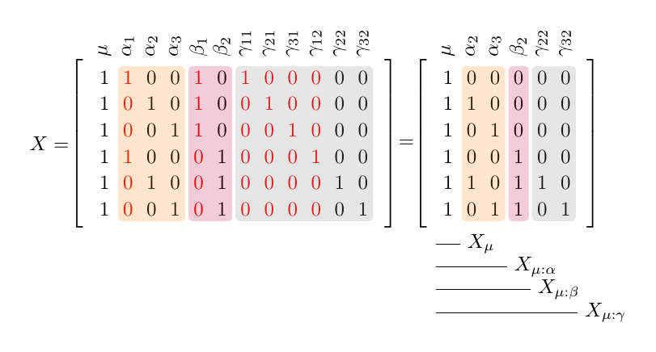

  * [fatorial-duplo.pgf](https://github.com/walmes/Tikz/blob/master/src/fatorial-duplo.pgf)

```tex
\begin{tikzpicture}[%
  mtx/.style = {
    matrix of math nodes,
    left delimiter = {[},
    right delimiter = {]}
  },
  hltr/.style = {opacity = 0.2, rounded corners = 2pt, inner sep = -1pt},
  txtup/.style = {rotate = 90, right},
  txtbt/.style = {yshift = -1ex}
]

  \matrix (X) at (0, 0) [mtx, nodes = {anchor = east}] {
 1 & \textcolor{red}{1} & 0 & 0 & \textcolor{red}{1} & 0 & \textcolor{red}{1} & \textcolor{red}{0} & \textcolor{red}{0} & \textcolor{red}{0} & 0 & 0 \\ 
  1 & \textcolor{red}{0} & 1 & 0 & \textcolor{red}{1} & 0 & \textcolor{red}{0} & \textcolor{red}{1} & \textcolor{red}{0} & \textcolor{red}{0} & 0 & 0 \\ 
  1 & \textcolor{red}{0} & 0 & 1 & \textcolor{red}{1} & 0 & \textcolor{red}{0} & \textcolor{red}{0} & \textcolor{red}{1} & \textcolor{red}{0} & 0 & 0 \\ 
  1 & \textcolor{red}{1} & 0 & 0 & \textcolor{red}{0} & 1 & \textcolor{red}{0} & \textcolor{red}{0} & \textcolor{red}{0} & \textcolor{red}{1} & 0 & 0 \\ 
  1 & \textcolor{red}{0} & 1 & 0 & \textcolor{red}{0} & 1 & \textcolor{red}{0} & \textcolor{red}{0} & \textcolor{red}{0} & \textcolor{red}{0} & 1 & 0 \\ 
  1 & \textcolor{red}{0} & 0 & 1 & \textcolor{red}{0} & 1 & \textcolor{red}{0} & \textcolor{red}{0} & \textcolor{red}{0} & \textcolor{red}{0} & 0 & 1 \\ 
  };

  \node[left=1ex of X] {$X = $};
  \node[right=1ex of X] {$=$};

  % Efeitos.
  \node[txtup] at (X-1-1.north) {$\mu$};
  \node[txtup] at (X-1-2.north) {$\alpha_1$};
  \node[txtup] at (X-1-3.north) {$\alpha_2$};
  \node[txtup] at (X-1-4.north) {$\alpha_3$};
  \node[txtup] at (X-1-5.north) {$\beta_1$};
  \node[txtup] at (X-1-6.north) {$\beta_2$};
  \node[txtup] at (X-1-7.north) {$\gamma_{11}$};
  \node[txtup] at (X-1-8.north) {$\gamma_{21}$};
  \node[txtup] at (X-1-9.north) {$\gamma_{31}$};
  \node[txtup] at (X-1-10.north) {$\gamma_{12}$};
  \node[txtup] at (X-1-11.north) {$\gamma_{22}$};
  \node[txtup] at (X-1-12.north) {$\gamma_{32}$};

  % Colunas de efeitos.
  \node[hltr, fill = orange, fit = (X-1-2)(X-6-4)] {};
  \node[hltr, fill = purple, fit = (X-1-5)(X-6-6)] {};
  \node[hltr, fill = gray,   fit = (X-1-7)(X-6-12)] {};

  \matrix (XX) [mtx, right = 5ex of X, nodes = {anchor = east}] {
  1 & 0 & 0 & 0 & 0 & 0 \\ 
  1 & 1 & 0 & 0 & 0 & 0 \\ 
  1 & 0 & 1 & 0 & 0 & 0 \\ 
  1 & 0 & 0 & 1 & 0 & 0 \\ 
  1 & 1 & 0 & 1 & 1 & 0 \\ 
  1 & 0 & 1 & 1 & 0 & 1 \\ 
  };

  % Efeitos.
  \node[txtup] at (XX-1-1.north) {$\mu$};
  \node[txtup] at (XX-1-2.north) {$\alpha_2$};
  \node[txtup] at (XX-1-3.north) {$\alpha_3$};
  \node[txtup] at (XX-1-4.north) {$\beta_2$};
  \node[txtup] at (XX-1-5.north) {$\gamma_{22}$};
  \node[txtup] at (XX-1-6.north) {$\gamma_{32}$};

  % Colunas de efeitos.
  \node[hltr, fill = orange, fit = (XX-1-2)(XX-6-3)] {};
  \node[hltr, fill = purple, fit = (XX-1-4)(XX-6-4)] {};
  \node[hltr, fill = gray,   fit = (XX-1-5)(XX-6-6)] {};

  \draw ($(XX-6-1.west)+(0, -.60)$) -- ($(XX-6-1.east)+(0, -.60)$) node[right] {$X_{\mu}$};
  \draw ($(XX-6-1.west)+(0, -1.0)$) -- ($(XX-6-3.east)+(0, -1.0)$) node[right] {$X_{\mu:\alpha}$};
  \draw ($(XX-6-1.west)+(0, -1.4)$) -- ($(XX-6-4.east)+(0, -1.4)$) node[right] {$X_{\mu:\beta}$};
  \draw ($(XX-6-1.west)+(0, -1.8)$) -- ($(XX-6-6.east)+(0, -1.8)$) node[right] {$X_{\mu:\gamma}$};

\end{tikzpicture}%
```
****

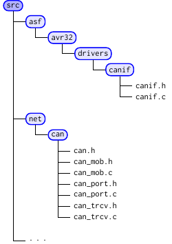

  * [file_tree.pgf](https://github.com/walmes/Tikz/blob/master/src/file_tree.pgf)

```tex
% http://tex.stackexchange.com/questions/23647/drawing-a-directory-listing-a-la-the-tree-command-in-tikz

\tikzset{
  every node/.style={
    thick, anchor=west, rounded corners,
    font={\scriptsize\ttfamily}, inner sep=2.5pt},
  selected/.style={draw=blue,fill=blue!10},
  root/.style={selected, fill=blue!30}
}

\begin{tikzpicture}[%
  scale=.7,
  grow via three points={
    one child at (0.5,-0.65) and two children
    at (0.5,-0.65) and (0.5,-1.1)
  },
  edge from parent path={
    (\tikzparentnode.south) |- (\tikzchildnode.west)
  }]

  \node [root] {src}
  child { node [selected] {asf}
    child { node [selected] {avr32}
      child { node [selected] {drivers}
        child { node [selected] {canif}
          child { node {canif.h}}
          child { node {canif.c}}
        }
      }
    }
  }       
  child { node at (0,-3.5) [selected] {net}
    child { node [selected] {can}
      child { node {can.h}}
      child { node {can\_mob.h}}
      child { node {can\_mob.c}}
      child { node {can\_port.h}}
      child { node {can\_port.c}}
      child { node {can\_trcv.h}}
      child { node {can\_trcv.c}}
    }
  }
  child { node at (0,-8) {\dots}};
\end{tikzpicture}
```
****

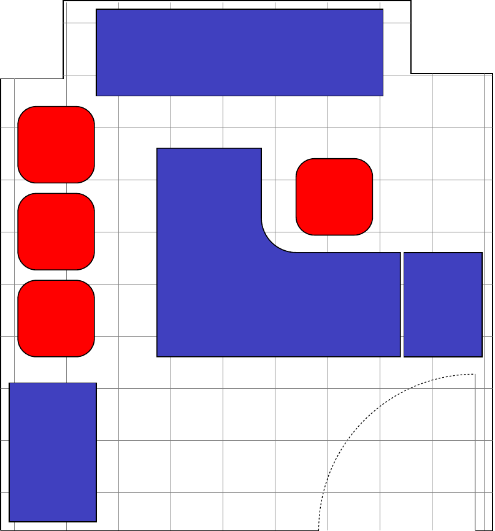

  * [floor-plan.pgf](https://github.com/walmes/Tikz/blob/master/src/floor-plan.pgf)

```tex
\def\cont{(0, 0)
%   -- (18.3, 0) arc (180:90:9)
%   -- +(0, -9)
%   -- +(0.5, -9) %circle (2pt)
  -- (28.3, 0)
  -- (28.3, 26.3) %circle (2pt)
  -- +(-4.7, 0)
  -- +(-4.7, 4.2)
  -- (3.6, 30.5)
  -- +(0, -4.5)
  -- +(-3.6, -4.5)
  -- (0, 0)}%

% \begin{tikzpicture}
%
%   % Room's border.
%   \draw[ultra thick] \cont;
%
%   % Clip the floor.
%   \begin{scope}
%     \clip \cont;
%     \draw [xshift = 0.8cm, yshift=2.2cm, step=3, gray]
%     (-0.8, -2.2) grid (27.5, 28.2);
%   \end{scope}
%
%   \begin{scope}[xshift = 0.5cm, yshift = 0.5cm]
%     % Bookcase.
%     \draw[fill = gray] (0, 0) rectangle (8, 5);
%   \end{scope}
%
%   \begin{scope}[xshift = 6cm, yshift = 11cm]
%     % Desk.
%     \draw[fill = gray] (0, 0)
%     -- (12, 0)
%     -- (12, 14)
%     -- (6, 14)
%     -- (6, 8) arc (0:-90:2)
%     -- (0, 6)
%     -- cycle;
%     % Drawer.
%     \draw[fill = gray] (6, 14.2) -- +(6, 0) -- +(6, 4.5)
%     -- +(0, 4.5) -- cycle;
%   \end{scope}
%
%   \begin{scope}[xshift = 22.8cm, yshift = 9.3cm]
%     % Low cupboard.
%     \draw[fill = gray] (0, 0) rectangle (5, 16.5);
%   \end{scope}
%
% \end{tikzpicture}

\begin{tikzpicture}[
  furniture/.style = {
    ultra thick,
    fill = gray!50!blue
  }]

  % Room's border.
  \draw[ultra thick] \cont;

  % Draw the door.
  \draw[very thick, dashed] (18.3, 0) arc (180:90:9);
  \draw[very thick] (18.3 + 9, 0) -- +(0, 9);
  \draw[ultra thick, white] (18.3, 0) -- +(9, 0);

  % Cliping the floor.
  \begin{scope}
    \clip \cont;
    \draw [xshift = 0.8cm, yshift=2.2cm, step=3, gray]
    (-0.8, -2.2) grid (27.5, 28.2);
  \end{scope}

  \begin{scope}[xshift = 0.5cm, yshift = 8.5cm, rotate = -90]
    % Bookcase.
    \draw[furniture] (0, 0) rectangle (8, 5);
  \end{scope}

  \begin{scope}[xshift = 9cm, yshift = 22cm, rotate = -90]
    % Desk.
    \draw[furniture] (0, 0)
    -- (12, 0)
    -- (12, 14)
    -- (6, 14)
    -- (6, 8) arc (0:-90:2)
    -- (0, 6)
    -- cycle;
    % Drawer.
    \draw[furniture] (6, 14.2) -- +(6, 0) -- +(6, 4.5) --
    +(0, 4.5) -- cycle;
  \end{scope}

  \begin{scope}[xshift = 22cm, yshift = 25cm, rotate = 90]
    % Low cupboard.
    \draw[furniture] (0, 0) rectangle (5, 16.5);
  \end{scope}

  \begin{scope}[
    chair/.style = {
      ultra thick,
      fill = red,
      rounded corners = 3em
    }]
    % Chairs.
    \draw[xshift = 17cm, yshift = 17cm, chair]
    (0, 0) rectangle (4.4, 4.4);
    \draw[xshift = 1cm, yshift = 20cm, chair]
    (0, 0) rectangle (4.4, 4.4);
    \draw[xshift = 1cm, yshift = 15cm, chair]
    (0, 0) rectangle (4.4, 4.4);
    \draw[xshift = 1cm, yshift =10cm, chair]
    (0, 0) rectangle (4.4, 4.4);
  \end{scope}

\end{tikzpicture}
```
****

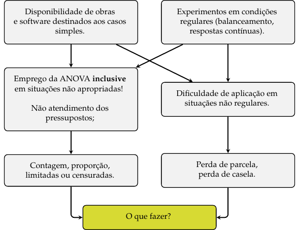

  * [fluxograma_experimental.pgf](https://github.com/walmes/Tikz/blob/master/src/fluxograma_experimental.pgf)

```tex
\newenvironment{cminipage}[1][5cm]{%
  \begin{minipage}{#1}
    \begin{center}
    }{%
    \end{center}
  \end{minipage}
}

\tikzset{
  % ->, >=stealth,
  % line width=2.75pt,
  every path/.style={->, >=stealth, very thick, rounded corners},
  state/.style={
    rectangle, rounded corners,
    draw=black, fill=gray!10, thick,
    minimum height=2em, inner sep=10pt, text centered
  }
}

\begin{tikzpicture}
  \node[state] (L1) {
    \begin{cminipage}[5cm]
      Disponibilidade de obras\\ e software destinados aos casos simples.
    \end{cminipage}
  };
  \node[state, right=of L1] (R1) {
    \begin{cminipage}[5cm]
      Experimentos em condi\c{c}\~oes regulares
      (balanceamento, respostas cont\'inuas).
    \end{cminipage}
  };
  \node[state, below=of L1] (L2) {
    \begin{cminipage}[5cm]
      Emprego da ANOVA \textbf{inclusive} em situa{\c c}\~oes
      n\~ao apropriadas! \newline \newline
      N\~ao atendimento dos pressupostos;
    \end{cminipage}
  };
  \node[state, right=of L2] (R2) {
    \begin{cminipage}[5cm]
      Dificuldade de aplica\c{c}\~ao em situa\c{c}\~aes n\~ao regulares.
    \end{cminipage}
  };
  \node[state, below=of L2] (L3) {
    \begin{cminipage}[5cm]
      Contagem, propor\c{c}\~ao,\\ limitadas ou censuradas.
    \end{cminipage}
  };
  \node[state, right=of L3] (R3) {
    \begin{cminipage}[5cm]
      Perda de parcela,\\ perda de casela.
    \end{cminipage}
  };
  \node[state, fill=yellow!80!darkgreen,
  below=1.5cm of $(L3.east)!0.5!(R3.west)$] (C) {
    \begin{cminipage}[5cm]
      O que fazer?
    \end{cminipage}
  };
  \path[draw] (L1) -- (L2);
  \path[draw] (R1) -- (L2);
  \path[draw] (L1) -- (R2);
  \path[draw] (R1) -- (R2);
  \path[draw] (L2) -- (L3);
  \path[draw] (R2) -- (R3);
  \path[draw] (L3)  |- (C);
  \path[draw] (R3) |- (C);
\end{tikzpicture}
```
****

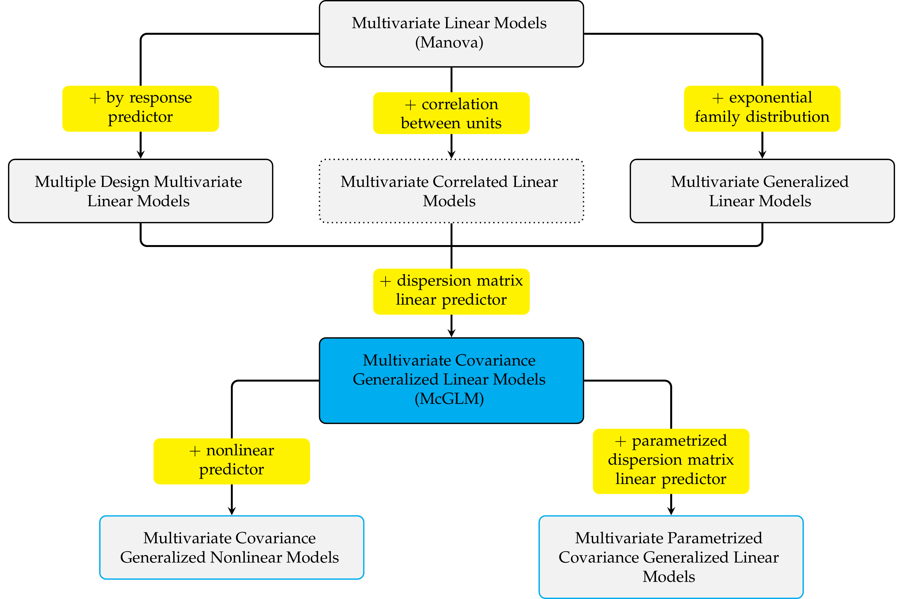

  * [fluxograma_modelos_multivariados.pgf](https://github.com/walmes/Tikz/blob/master/src/fluxograma_modelos_multivariados.pgf)

```tex
\newenvironment{cminipage}[1][5cm]{%
  \begin{minipage}{#1}
    \begin{center}
    }{%
    \end{center}
  \end{minipage}
}

\tikzset{
  every path/.style = {
   ->,
   > = stealth, 
   very thick,
   rounded corners},
  state/.style = {
    rectangle,
    rounded corners,
    draw=black,
    fill=gray!10,
    thick,
    minimum height=2em,
    inner sep=10pt,
    text centered
  },
  note/.style = {
    fill = yellow,
    text width = 3.2cm,
    text centered,
  },
  node distance=2cm and 1cm,
}

\begin{tikzpicture}

  \node[state] (manova) {
    \begin{cminipage}[5cm]
      Multivariate Linear Models (Manova)
    \end{cminipage}
  };

  \node[state, below left=of manova] (mdmlm) {
    \begin{cminipage}[5cm]
      Multiple Design
      Multivariate Linear Models
    \end{cminipage}
  };

  \node[state, dotted, below=of manova] (mclm) {
    \begin{cminipage}[5cm]
      Multivariate Correlated Linear Models
    \end{cminipage}
  };

  \node[state, below right=of manova] (mglm) {
    \begin{cminipage}[5cm]
      Multivariate Generalized\\ Linear Models
    \end{cminipage}
  };

  \coordinate [below=0.5cm of mclm] (union);

  \node[state, below=of union, fill = cyan] (mcglm) {
    \begin{cminipage}[5cm]
      Multivariate Covariance\\ Generalized Linear Models \\ (McGLM)
    \end{cminipage}
  };

  \node[state, draw = cyan, below left=2cm and -1cm of mcglm] (mcgnlm) {
    \begin{cminipage}[5cm]
      Multivariate Covariance Generalized Nonlinear Models
    \end{cminipage}
  };

  \node[state, draw = cyan, below right=2cm and -1cm of mcglm] (mcpglm) {
    \begin{cminipage}[5cm]
      Multivariate Parametrized Covariance Generalized Linear Models
    \end{cminipage}
  };

  \path[draw] (manova) -| node [note, pos = 0.8] {$+$ by response predictor} (mdmlm);
  \path[draw] (manova) -- node [note, pos = 0.5] {$+$ correlation between units} (mclm);
  \path[draw] (manova) -| node [note, pos = 0.8] {$+$ exponential family distribution} (mglm);

  \path[draw, -] (mdmlm) |- (union);
  \path[draw, -] (mclm) |- (union);
  \path[draw, -] (mglm) |- (union);
  \path[draw] (union) -- node [note, fill = yellow] {$+$ dispersion matrix linear predictor} (mcglm);

  \path[draw] (mcglm) -| node [note, pos = 0.8] {$+$ nonlinear predictor} (mcgnlm);
  \path[draw] (mcglm) -| node [note, pos = 0.8] {$+$ parametrized dispersion matrix linear predictor} (mcpglm);

\end{tikzpicture}
```
****

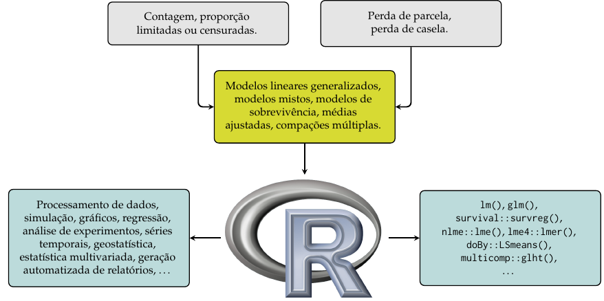

  * [fluxograma_solucao.pgf](https://github.com/walmes/Tikz/blob/master/src/fluxograma_solucao.pgf)

```tex
\def\widthmini{5cm}

\newenvironment{cminipage}[1][5cm]{%
  \begin{minipage}{#1}
    \begin{center}
    }{%
    \end{center}
  \end{minipage}
}

\tikzset{
  % ->, >=stealth,
  % line width=2.75pt,
  every path/.style={->, >=stealth, very thick, rounded corners},
  state/.style={
    rectangle, rounded corners,
    draw=black, fill=gray!20, thick,
    minimum height=2em, inner sep=10pt, text centered
  }
}

\begin{tikzpicture}
  \node[state] (L3) {
    \begin{cminipage}[5cm]
      Contagem, propor\c{c}\~{a}o\\ limitadas ou censuradas.
    \end{cminipage}
  };
  \node[state, right=of L3] (R3) {
    \begin{cminipage}[5cm]
      Perda de parcela,\\
      perda de casela.
    \end{cminipage}
  };
  \node[state, fill=yellow!80!darkgreen,
  below=1.5cm of $(L3.east)!0.5!(R3.west)$] (C) {
    \begin{cminipage}[5cm]
      Modelos lineares generalizados, modelos mistos,
      modelos de sobreviv\^{e}ncia,
      m\'{e}dias ajustadas, compa\c{c}\~oes m\'{u}ltiplas.
    \end{cminipage}
  };
  \node[below=of C] (R) {
    \begin{cminipage}[5cm]
      \includegraphics[width=5cm]{/home/walmes/Dropbox/tikz/Rlogo.png}
    \end{cminipage}
  };
  \node[state, fill=darkgreen!30!white, right=of R] (E) {
    \begin{cminipage}[5cm]
      \texttt{lm()}, \texttt{glm()}, \texttt{survival::survreg()},
      \texttt{nlme::lme()}, \texttt{lme4::lmer()},
      \texttt{doBy::LSmeans()}, \texttt{multicomp::glht()},\\ \ldots
    \end{cminipage}
  };
  \node[state, fill=darkgreen!30!white, left=of R] (F) {
    \begin{cminipage}[5cm]
      Processamento de dados, simula\c{c}\~ao, gr\'{a}ficos,
      regress\~{a}o, an\'{a}lise de experimentos,
      s\'{e}ries temporais, geostat\'{i}stica,
      estat\'{i}stica multivariada,
      gera\c{c}\~{a}o automatizada de relat\'{o}rios,
      \ldots
    \end{cminipage}
  };
  \path[draw] (L3)  |- (C);
  \path[draw] (R3) |- (C);
  \path[draw] (C) -- (R);
  \path[draw] (R) -- (E);
  \path[draw] (R) -- (F);
\end{tikzpicture}
```
****

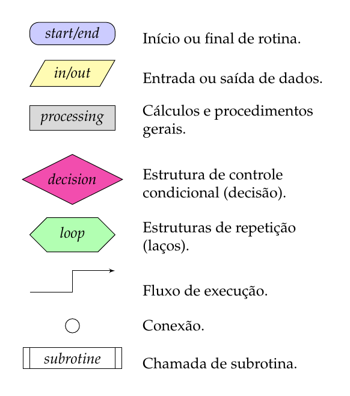

  * [fluxograms.pgf](https://github.com/walmes/Tikz/blob/master/src/fluxograms.pgf)

```tex
% https://tex.stackexchange.com/questions/87945/tikz-picture-shapes
\tikzset{%
  pth/.style = {
    draw,
    ->,
    > = latex',
  },
  start-end/.style = {
    draw,
    fill = blue!20!white,
    rectangle,
    rounded corners=6pt,
    minimum width=2cm,
  },
  input/.style = {% requires library shapes.geometric
    draw,
    fill = yellow!30!white,
    trapezium,
    trapezium left angle = 60,
    trapezium right angle = 120,
  },
  operation/.style = {
    draw,
    fill = gray!30!white,
    rectangle,
    minimum width = 3.5cm,
  },
  loop/.style = {% requires library shapes.misc
    draw,
    fill = green!30!white,
    chamfered rectangle,
    chamfered rectangle xsep = 2cm
  },
  decision/.style = {% requires library shapes.geometric
    draw,
    fill = magenta!70!white,
    diamond,
    aspect = 2
  },
  decision/.default = 1,
  print/.style = {% requires library shapes.symbols
    draw,
    tape,
    tape bend top = none
  },
  connection/.style = {
    draw,
    circle,
    radius = 5pt,
  },
  process rectangle outer width/.initial = 0.15cm,
  predefined process/.style = {
    rectangle,
    draw,
    append after command = {
      \pgfextra{
        \draw
        ($(\tikzlastnode.north west) - (0, 0.5\pgflinewidth)$) --
        ($(\tikzlastnode.north west) - (\pgfkeysvalueof{/tikz/process
          rectangle outer width}, 0.5\pgflinewidth)$) --
        ($(\tikzlastnode.south west) + (-\pgfkeysvalueof{/tikz/process
          rectangle outer width}, +0.5\pgflinewidth)$) --
        ($(\tikzlastnode.south west) + (0, 0.5\pgflinewidth)$);
        \draw
        ($(\tikzlastnode.north east) - (0, 0.5\pgflinewidth)$) --
        ($(\tikzlastnode.north east) + (\pgfkeysvalueof{/tikz/process
          rectangle outer width}, -0.5\pgflinewidth)$) --
        ($(\tikzlastnode.south east) + (\pgfkeysvalueof{/tikz/process
          rectangle outer width}, 0.5\pgflinewidth)$) --
        ($(\tikzlastnode.south east) + (0, 0.5\pgflinewidth)$);
      }
    },
    minimum width = 2cm,
    align = center
  },
  predefined process/.default = 1.75cm,
  man op/.style = {% requires library shapes.geometric
    draw,
    trapezium,
    shape border rotate = 180,
    text width = 2cm,
    align = center,
  },
  extract/.style = {
    draw,
    isosceles triangle,
    isosceles triangle apex angle = 60,
    shape border rotate = 90
  },
  merge/.style = {
    draw,
    isosceles triangle,
    isosceles triangle apex angle = 60,
    shape border rotate = -90
  },
}%

\begin{tikzpicture}%

\matrix (m) [matrix of nodes,
             column sep = 1em,
             row sep = 0.75em,
             column 2/.style={anchor=west}]{
   \node[start-end] {\it start/end}; &
   \node {In\'icio ou final de rotina.}; \\
   \node[input, minimum width=2cm] {\it in/out}; &
   \node {Entrada ou sa\'ida de dados.}; \\
   \node[operation, minimum width=2cm] {\it processing}; &
   \node[align=left] {C\'alculos e procedimentos\\ gerais.};\\
   \node[decision, minimum width=2cm] {\it decision}; &
   \node[align=left] {Estrutura de controle\\ condicional (decis\~ ao).};\\
   \node[loop, minimum width=2cm]{\it loop}; &
   \node[align=left] {Estruturas de repeti\c c\~ao\\ (la\c cos).};\\
   \path[pth] (-1, 0) -| (0, 0.5) |- (1, 0.5); &
   \node {Fluxo de execu\c c\~ao.};\\
   \node[connection] {}; &
   \node {Conex\~ao.};\\
   \node[predefined process] {\it subrotine}; &
   \node {Chamada de subrotina.};\\
 };

\end{tikzpicture}%
```
****

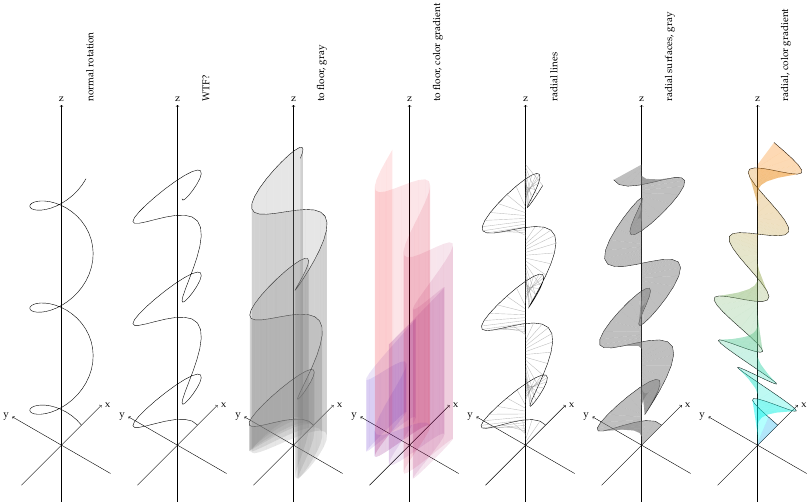

  * [fun_3d.pgf](https://github.com/walmes/Tikz/blob/master/src/fun_3d.pgf)

```tex
% http://tex.stackexchange.com/questions/61475/tikz-how-to-draw-a-sine-curve-in-3d

\begin{tikzpicture}[
  x={(0.707cm,0.707cm)},
  z={(0cm,1cm)},
  y={(-0.866cm,0.5cm)}]

  \draw[->] (-2,0,0) -- (2,0,0) node[right] {x};
  \draw[->] (0,-2,0) -- (0,2,0) node[left] {y};
  \draw[->] (0,0,-2) -- (0,0,12) node[above] {z};
  \draw (1,0,0)
    \foreach \z in {0,0.1,...,10}{
      -- ({cos(\z*100)},{sin(\z*100)},{\z})
    };
  \node[rotate=90,right=1cm] at (0,0,12) {normal rotation};
\end{tikzpicture}

\begin{tikzpicture}[
  x={(0.707cm,0.707cm)},
  z={(0cm,1cm)},
  y={(-0.866cm,0.5cm)}]

  \draw[->] (-2,0,0) -- (2,0,0) node[right] {x};
  \draw[->] (0,-2,0) -- (0,2,0) node[left] {y};
  \draw[->] (0,0,-2) -- (0,0,12) node[above] {z};
  \draw (1,0,0)
    \foreach \z in {0,0.1,...,10}{
      -- ({cos(\z*200)},{sin(\z*100)},{\z})
    };
  \node[rotate=90,right=1cm] at (0,0,12) {WTF?};
\end{tikzpicture}

\begin{tikzpicture}[
  x={(0.707cm,0.707cm)},
  z={(0cm,1cm)},
  y={(-0.866cm,0.5cm)}]

  \draw[->] (-2,0,0) -- (2,0,0) node[right] {x};
  \draw[->] (0,-2,0) -- (0,2,0) node[left] {y};
  \draw[->] (0,0,-2) -- (0,0,12) node[above] {z};
  \draw (1,0,0)
    \foreach \z in {0,0.1,...,10}{
      -- ({cos(\z*189)},{sin(\z*91)},{\z})
    };
    \foreach \z in {0,0.1,...,9.9}{
      \fill[gray,opacity=0.2]
      ({cos(\z*189)},{sin(\z*91)},0) -- 
      ({cos(\z*189)},{sin(\z*91)},{\z}) --
      ({cos((\z+0.1)*189)},{sin((\z+0.1)*91)},{\z+0.1}) --
      ({cos((\z+0.1)*189)},{sin((\z+0.1)*91)},0) -- cycle;
    }
  \node[rotate=90,right=1cm] at (0,0,12) {to floor, gray};
\end{tikzpicture}

\begin{tikzpicture}[
  x={(0.707cm,0.707cm)},
  z={(0cm,1cm)},
  y={(-0.866cm,0.5cm)}]

  \draw[->] (-2,0,0) -- (2,0,0) node[right] {x};
  \draw[->] (0,-2,0) -- (0,2,0) node[left] {y};
  \draw[->] (0,0,-2) -- (0,0,12) node[above] {z};
  \foreach \z in {0,0.1,...,9.9}{
    \pgfmathtruncatemacro{\mycolorpercentage}{\z/0.099}
    \fill[red!\mycolorpercentage!blue,opacity=0.1]
      ({cos(\z*210)},{sin(\z*42)},0) --
      ({cos(\z*210)},{sin(\z*42)},{\z}) --
      ({cos((\z+0.1)*210)},{sin((\z+0.1)*42)},{\z+0.1}) --
      ({cos((\z+0.1)*210)},{sin((\z+0.1)*42)},0) -- cycle;
  }
  \node[rotate=90,right=1cm] at (0,0,12) {to floor, color gradient};
\end{tikzpicture}

\begin{tikzpicture}[
  x={(0.707cm,0.707cm)},
  z={(0cm,1cm)},
  y={(-0.866cm,0.5cm)}]

  \draw[->] (-2,0,0) -- (2,0,0) node[right] {x};
  \draw[->] (0,-2,0) -- (0,2,0) node[left] {y};
  \draw[->] (0,0,-2) -- (0,0,12) node[above] {z};
  \draw (1,0,0)
    \foreach \z in {0,0.1,...,10}{
      -- ({cos(\z*207)},{sin(\z*101)},{\z})
    };
  \foreach \z in {0,0.1,...,10}{
    \draw[opacity=0.5,gray]
      ({cos(\z*207)},{sin(\z*101)},{\z}) -- (0,0,\z);
  }
  \node[rotate=90,right=1cm] at (0,0,12) {radial lines};
\end{tikzpicture}

\begin{tikzpicture}[
  x={(0.707cm,0.707cm)},
  z={(0cm,1cm)},
  y={(-0.866cm,0.5cm)}]

  \draw[->] (-2,0,0) -- (2,0,0) node[right] {x};
  \draw[->] (0,-2,0) -- (0,2,0) node[left] {y};
  \draw[->] (0,0,-2) -- (0,0,12) node[above] {z};
  \draw (1,0,0)
    \foreach \z in {0,0.1,...,10}{
      -- ({cos(\z*237)},{sin(\z*111)},{\z})
    };
  \foreach \z in {0,0.1,...,9.9}{
    \fill[opacity=0.5,gray]
    (0,0,\z) --
    ({cos(\z*237)},{sin(\z*111)},{\z}) --
    ({cos((\z+0.1)*237)},{sin((\z+0.1)*111)},{(\z+0.1)}) --
    (0,0,{(\z+0.1)}) -- cycle;
  }
  \node[rotate=90,right=1cm] at (0,0,12) {radial surfaces, gray};
\end{tikzpicture}

\begin{tikzpicture}[
  x={(0.707cm,0.707cm)},
  z={(0cm,1cm)},
  y={(-0.866cm,0.5cm)}]

  \draw[->] (-2,0,0) -- (2,0,0) node[right] {x};
  \draw[->] (0,-2,0) -- (0,2,0) node[left] {y};
  \draw[->] (0,0,-2) -- (0,0,12) node[above] {z};
  \draw (1,0,0)
    \foreach \z in {0,0.1,...,10}{
      -- ({cos(\z*37)},{sin(\z*219)},{\z})
    };
  \foreach \z in {0,0.1,...,9.9}{
    \pgfmathtruncatemacro{\mycolorpercentage}{\z/0.099}
    \fill[opacity=0.3,orange!\mycolorpercentage!cyan]
      (0,0,\z) --
      ({cos(\z*37)},{sin(\z*219)},{\z}) --
      ({cos((\z+0.1)*37)},{sin((\z+0.1)*219)},{(\z+0.1)}) --
      (0,0,{(\z+0.1)}) -- cycle;
  }
  \node[rotate=90,right=1cm] at (0,0,12) {radial, color gradient};
\end{tikzpicture}
```
****

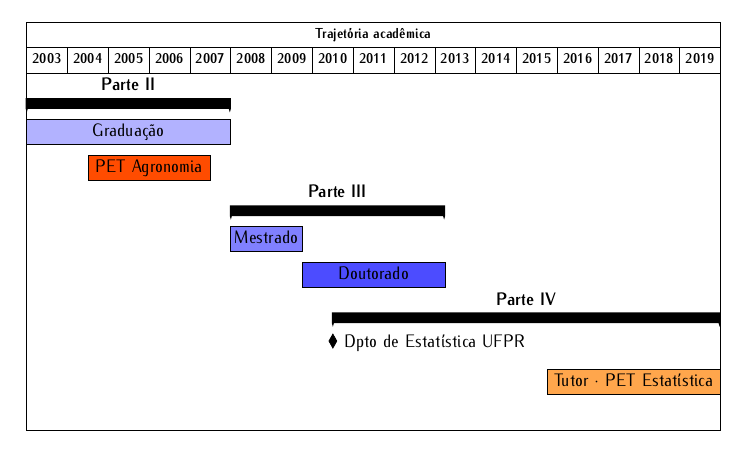

  * [gantt-chart-walmes.pgf](https://github.com/walmes/Tikz/blob/master/src/gantt-chart-walmes.pgf)

```tex
% Based on: https://tex.stackexchange.com/questions/209241/gantt-chart-using-pgfgantt-with-years-divided-into-quarters
\begin{ganttchart}[%Specs
     y unit title = 0.5cm,
     y unit chart = 0.7cm,
     x unit = 0.2cm,
%      vgrid,
%      hgrid,
     title height = 1,
%     title/.style={fill=none},
     title label font = \bfseries\footnotesize,
%      bar/.style = {fill = orange},
     bar height = 0.7,
%   progress label text={},
     group right shift = 0,
     group top shift = 0.7,
     group height = .3,
     group peaks width = {0.2},
     milestone inline label node/.append style = {below right = -3mm and 1mm, font = \rm, fill = white},
     inline]{1}{68}
    %labels
    \gantttitle{Trajet\'oria acad\^emica}{68}\\  % title 1
    \gantttitle[]{2003}{4}
    \gantttitle[]{2004}{4}
    \gantttitle[]{2005}{4}
    \gantttitle[]{2006}{4}
    \gantttitle[]{2007}{4}
    \gantttitle[]{2008}{4}
    \gantttitle[]{2009}{4}
    \gantttitle[]{2010}{4}
    \gantttitle[]{2011}{4}
    \gantttitle[]{2012}{4}
    \gantttitle[]{2013}{4}
    \gantttitle[]{2014}{4}
    \gantttitle[]{2015}{4}
    \gantttitle[]{2016}{4}
    \gantttitle[]{2017}{4}
    \gantttitle[]{2018}{4}
    \gantttitle[]{2019}{4} \\
    % Setting group if any

    \ganttgroup[inline = true]{Parte II}{1}{20} \\ 
    \ganttbar[inline = true, bar/.append style = {fill = blue!30!white}]{Gradua\c c\~ao}{1}{20}\\
    \ganttbar[inline = true, bar/.append style = {fill = orange!60!red}]{PET Agronomia}{7}{18}\\
    \ganttgroup[inline = true]{Parte III}{21}{41} \\ 
    \ganttbar[inline = true, bar/.append style = {fill = blue!50!white}]{Mestrado}{21}{27}\\
    \ganttbar[inline = true, bar/.append style = {fill = blue!70!white}]{Doutorado}{28}{41}\\
    \ganttgroup[inline = true]{Parte IV}{31}{68} \\ 
    \ganttmilestone[inline = true]{Dpto de Estat\'istica UFPR}{30} \\       
    \ganttbar[inline = true, bar/.append style = {fill = orange!70!white}]{Tutor · PET Estat\'istica}{52}{68}\\

\end{ganttchart}
```
****

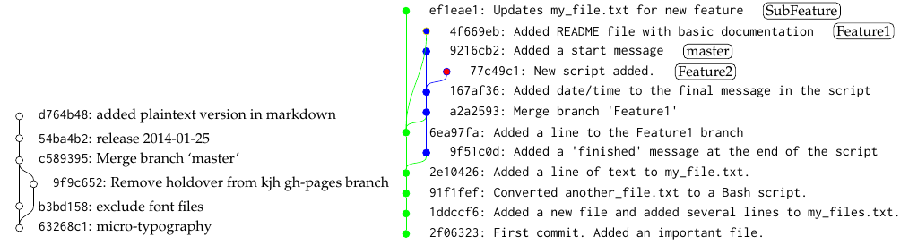

  * [git_log.pgf](https://github.com/walmes/Tikz/blob/master/src/git_log.pgf)

```tex
% http://tex.stackexchange.com/questions/125244/how-can-i-produce-the-history-graph-of-a-git-repository-in-latex

% Nesse link existe script python que faz a arte em tikz a partir da saida
% `git log --graph --oneline`.

% gitgraph.txt contains raw output of: $ git log --graph --oneline
\begin{filecontents}{gitgraph.txt}
* d764b48 added plaintext version in markdown
* 54ba4b2 release 2014-01-25
*   c589395 Merge branch 'master'
|\
| * 9f9c652 Remove holdover from kjh gh-pages branch
* | b3bd158 exclude font files
|/
* 63268c1 micro-typography
\end{filecontents}

\newcommand\commit[2]{
  \node[commit] (#1) {}; \node[clabel] at (#1) {\texttt{#1}: #2};
}
\newcommand\ghost[1]{
  \coordinate (#1);
}
\newcommand\connect[2]{
  \path (#1) to[out=90,in=-90] (#2);
}

\begin{tikzpicture}
  \tikzstyle{commit}=[draw, circle, fill=white, inner sep=0pt,minimum size=5pt]
  \tikzstyle{clabel}=[right, outer sep=1em]
  \tikzstyle{every path}=[draw]
  % Nao pode ter espaco entre '1em,between origins'.
  \matrix [column sep={1em,between origins}, row sep=\lineskip] {
    \commit{d764b48}{added plaintext version in markdown} & \\
    \commit{54ba4b2}{release 2014-01-25} & \\
    \commit{c589395}{Merge branch `master'} & \\
    & \commit{9f9c652}{Remove holdover from kjh gh-pages branch} \\
    \commit{b3bd158}{exclude font files} & \ghost{branch1} \\
    \commit{63268c1}{micro-typography} & \\
  };
  \connect{63268c1}{b3bd158};
  \connect{63268c1}{branch1};
  \connect{branch1}{9f9c652};
  \connect{b3bd158}{c589395};
  \connect{9f9c652}{c589395};
  \connect{c589395}{54ba4b2};
  \connect{54ba4b2}{d764b48};
\end{tikzpicture}

\begin{tikzpicture}
  \tikzstyle{commit}=[draw,circle,fill=white,inner sep=0pt,minimum size=5pt]
  \tikzstyle{every path}=[draw]
  \tikzstyle{branch}=[draw,rectangle,rounded corners=3,fill=white,inner sep=2pt,minimum size=5pt]
  \node[commit, green, fill=green] (ef1eae1) at (0.0,0) {};
  \node[right,xshift=10] (label_ef1eae1) at (ef1eae1.east)
  {\verb!ef1eae1: Updates my_file.txt for new feature!};
  \node[commit, yellow, fill=blue] (4f669eb) at (0.5,-0.5) {};
  \node[right,xshift=10] (label_4f669eb) at (4f669eb.east)
  {\verb!4f669eb: Added README file with basic documentation!};
  \node[commit, blue, fill=blue] (9216cb2) at (0.5,-1.0) {};
  \node[right,xshift=10] (label_9216cb2) at (9216cb2.east)
  {\verb!9216cb2: Added a start message!};
  \node[commit, blue, fill=red] (77c49c1) at (1.0,-1.5) {};
  \node[right,xshift=10] (label_77c49c1) at (77c49c1.east)
  {\verb!77c49c1: New script added.!};
  \node[commit, blue, fill=blue] (167af36) at (0.5,-2.0) {};
  \node[right,xshift=10] (label_167af36) at (167af36.east)
  {\verb!167af36: Added date/time to the final message in the script!};
  \path[blue] (167af36) to[out=90,in=-90] (9216cb2);
  \path[blue] (167af36) to[out=90,in=-90] (77c49c1);
  \node[commit, blue, fill=blue] (a2a2593) at (0.5,-2.5) {};
  \node[right,xshift=10] (label_a2a2593) at (a2a2593.east)
  {\verb!a2a2593: Merge branch 'Feature1'!};
  \path[blue] (a2a2593) to[out=90,in=-90] (167af36);
  \node[commit, green, fill=green] (6ea97fa) at (0.0,-3.0) {};
  \node[right,xshift=10] (label_6ea97fa) at (6ea97fa.east)
  {\verb!6ea97fa: Added a line to the Feature1 branch!};
  \path[green] (6ea97fa) to[out=90,in=-90] (ef1eae1);
  \path[green] (6ea97fa) to[out=90,in=-90] (4f669eb);
  \path[green] (6ea97fa) to[out=90,in=-90] (a2a2593);
  \node[commit, blue, fill=blue] (9f51c0d) at (0.5,-3.5) {};
  \node[right,xshift=10] (label_9f51c0d) at (9f51c0d.east)
  {\verb!9f51c0d: Added a 'finished' message at the end of the script!};
  \path[blue] (9f51c0d) to[out=90,in=-90] (a2a2593);
  \node[commit, green, fill=green] (2e10426) at (0.0,-4.0) {};
  \node[right,xshift=10] (label_2e10426) at (2e10426.east)
  {\verb!2e10426: Added a line of text to my_file.txt.!};
  \path[green] (2e10426) to[out=90,in=-90] (6ea97fa);
  \path[green] (2e10426) to[out=90,in=-90] (9f51c0d);
  \node[commit, green, fill=green] (91f1fef) at (0.0,-4.5) {};
  \node[right,xshift=10] (label_91f1fef) at (91f1fef.east)
  {\verb!91f1fef: Converted another_file.txt to a Bash script.!};
  \path[green] (91f1fef) to[out=90,in=-90] (2e10426);
  \node[commit, green, fill=green] (1ddccf6) at (0.0,-5.0) {};
  \node[right,xshift=10] (label_1ddccf6) at (1ddccf6.east)
  {\verb!1ddccf6: Added a new file and added several lines to my_files.txt.!};
  \path[green] (1ddccf6) to[out=90,in=-90] (91f1fef);
  \node[commit, green, fill=green] (2f06323) at (0.0,-5.5) {};
  \node[right,xshift=10] (label_2f06323) at (2f06323.east)
  {\verb!2f06323: First commit. Added an important file.!};
  \path[green] (2f06323) to[out=90,in=-90] (1ddccf6);
  \node[branch,right,xshift=10] (Feature1) at (label_4f669eb.east)
  {\lstinline{Feature1}};
  \node[branch,right,xshift=10] (Feature2) at (label_77c49c1.east)
  {\lstinline{Feature2}};
  \node[branch,right,xshift=10] (SubFeature) at (label_ef1eae1.east)
  {\lstinline{SubFeature}};
  \node[branch,right,xshift=10] (master) at (label_9216cb2.east)
  {\lstinline{master}};
\end{tikzpicture}
```
****

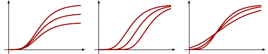

  * [gompertz_effect.pgf](https://github.com/walmes/Tikz/blob/master/src/gompertz_effect.pgf)

```tex
% http://stackoverflow.com/questions/2701902/standalone-diagrams-with-tikz
\def\ptsize{0.75pt}
\tikzset{
  mypoints/.style={fill=white,draw=black},
  pil/.style={->, shorten <=2pt, shorten >=2pt
  }
}%

\begin{tikzpicture}[>=latex, xscale=2, yscale=2]%
  \def\tha{1}; \def\thc{4}; \def\thi{0.6}; \def\thq{0.75}
  \node at (3.1, 1.8) {$f(x) = \theta_0 \exp\{-\exp\{\theta_1 (x - \theta_2)\}\} $};
  \begin{scope}
    \draw[->] (-0.1,0) -- +(1.8,0) node[below] {$x$};
    \draw[->] (0,-0.1) -- +(0,1.2) node[left] {$f(x)$};
    \foreach \a in {0,1,2}
    \draw[color=red!60!black, very thick, smooth, samples=100]
      plot[id=x, domain=0:1.6]
      function{(\tha-\a/5.0)*exp(-exp(-\thc*(x-\thi)))};
    \draw[->] (1.5,0.4) -- +(0,0.8) node[above] {$\theta_0$};
  \end{scope}
  \begin{scope}[xshift=2.3cm]
    \draw[->] (-0.1,0) -- +(1.8,0) node[below] {$x$};
    \draw[->] (0,-0.1) -- +(0,1.2) node[left] {$f(x)$};
    \foreach \c in {0,1,2}
    \draw[color=red!60!black, very thick, smooth, samples=100]
      plot[id=x, domain=0:1.6]
      function{\tha*exp(-exp(-(\thc-\c/1.0)*(x-\thi)))};
    \draw[->] (0.8,0.37) arc (0:280:0.2) node[right] {$\theta_1$};
  \end{scope}
  \begin{scope}[xshift=4.6cm]
    \draw[->] (-0.1,0) -- +(1.8,0) node[below] {$x$};
    \draw[->] (0,-0.1) -- +(0,1.2) node[left] {$f(x)$};
    \foreach \i in {0,1,2}
    \draw[color=red!60!black, very thick, smooth, samples=100]
      plot[id=x, domain=0:1.6]
      function{\tha*exp(-exp(-\thc*(x-(\thi+\i/5.0))))};
    \draw[->] (0.4,0.5) -- +(1,0) node[right] {$\theta_2$};
  \end{scope}
\end{tikzpicture}%
```
****

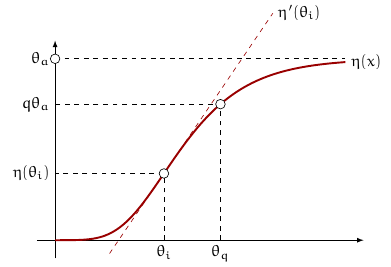

  * [gompertz.pgf](https://github.com/walmes/Tikz/blob/master/src/gompertz.pgf)

```tex
% http://stackoverflow.com/questions/2701902/standalone-diagrams-with-tikz
\def\ptsize{0.75pt}
\tikzset{
  mypoints/.style={fill=white,draw=black},
  pil/.style={->, shorten <=2pt, shorten >=2pt}
}

\begin{tikzpicture}[>=latex, xscale=4, yscale=4]
  \def\tha{1}; \def\thc{4}; \def\thi{0.6}; \def\thq{0.75}
  \draw[->] (-0.1,0) -- +(1.8,0);
  \draw[->] (0,-0.1) -- +(0,1.2);
  \draw[color=red!60!black, very thick, smooth, samples=100]
    plot[id=x, domain=0:1.6]
    function{\tha*exp(-exp(-\thc*(x-\thi)))}
    node[right, black] {$\eta(x)$};
  \draw[dashed, color=red!60!black, smooth, samples=100]
    plot[id=x, domain=0.3:1.2]
    function{\tha*exp(-1)+\tha*\thc*exp(-1)*
      (0-\thi)+\tha*\thc*exp(-1)*(x)}
    node[right, black] {$\eta'(\theta_i)$};
  \coordinate (xyi) at (\thi,\tha*exp{-1});
  \coordinate (xi) at (\thi,0);
  \coordinate (yi) at (0,\tha*exp{-1});
  \coordinate (xyf) at
    ($(0,\thq*\tha)+{-(1/\thc)*ln(-ln(\thq))+\thi}*(1,0)$);
  \coordinate (xf) at
    ($(0,0)+{-(1/\thc)*ln(-ln(\thq))+\thi}*(1,0)$);
  \coordinate (yf) at (0,\thq*\tha);
  \draw[dashed] (0,\tha) -- +(1.6,0);
  \fill[mypoints] (0,\tha) circle (\ptsize) node[left] {$\theta_a$};
  \draw[dashed] (xi) -- (xyi) -- (yi);
  \draw[dashed] (xf) -- (xyf) -- (yf);
  \fill[mypoints] (xyi) circle (\ptsize);
  \fill[mypoints] (xyf) circle (\ptsize);
  \node[below] at (xi) {$\theta_i$};
  \node[left] at (yi) {$\eta(\theta_i)$};
  \node[below] at (xf) {$\theta_q$};
  \node[left] at (yf) {$q\theta_a$};
\end{tikzpicture}
```
****

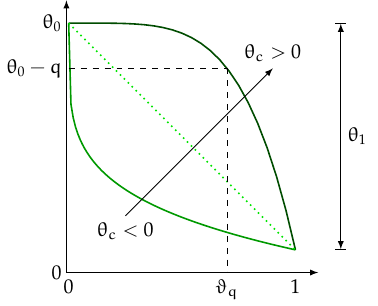

  * [herschel.pgf](https://github.com/walmes/Tikz/blob/master/src/herschel.pgf)

```tex
\begin{tikzpicture}[>=latex, xscale=4, yscale=4]
  \draw[<->] (-0.01,1.2) |- (1.1,0);
  \draw[-, color=green!30!black, thick]
    plot[id=x, domain=0:1]
    function{1.1-1*x**exp(1.5)} node[right] {};
  \draw[-, color=green!60!black, thick, samples=100]
    plot[id=x, domain=0:1]
    function{1.1-1*x**exp(-1.5)} node[right] {};
  \draw[-, color=green!90!black, thick, dotted]
    plot[id=x, domain=0:1]
    function{1.1-1*x**exp(0)} node[right] {};
  \node[left] at (0,1.1) {$\theta_0$};
  \node[below] at (0,0) {$0$};
  \node[left] at (0,0) {$0$};
  \node[below] at (1,0) {$1$};
  \draw[|<->|] (1.2,1.1) -- (1.2,1.1-1)
    node[midway, right] {$\theta_1$};
  \draw[->] (0.25,0.25) node[below] {$\theta_c<0$} -- (0.9,0.9)
    node[above] {$\theta_c>0$};
  \draw[-, dashed] (0,0.9)
    node[left] {$\theta_0-q$} -- +(0.7,0);
  \draw[-, dashed] (0.7,0.9) -- +(0,-0.9)
    node[below] {$\vartheta_q$};
\end{tikzpicture}
```
****

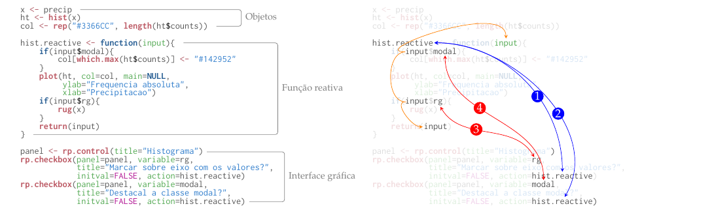

  * [hist_Checkbox.pgf](https://github.com/walmes/Tikz/blob/master/src/hist_Checkbox.pgf)

```tex
\tikzstyle{every picture}+=[remember picture]
\newcommand{\NANN}[2]{% caixa alta para facilitar encontrar.
  \tikz[baseline] {%
    \node[%
    anchor=base,%
    inner sep=0pt,%
    outer sep=0pt,%
    % fill=gray!90
    text opacity=1
    ] (#1) {#2};%
  }%
}

\tikzset{
  >=stealth,
  epath/.style={draw, <->, shorten <=1pt, shorten >=1pt},
  fpath/.style={
    draw, color=gray, rounded corners=2pt,
    shorten <=3pt, shorten >=3pt},
  cir/.style={draw, circle, fill, inner sep=0.5pt, text=white},
  dir/.style={near start, right, font=\footnotesize}
}

% HEY, PAY ATTENTION HERE!
\newif\ifopacity
%\opacitytrue  %% Descomente para texto transparente.
%\opacityfalse %% Ou descomente para texto forte.

%-----------------------------------------------------------------------

\opacityfalse % <- PAY ATTENTION HERE!
\ifopacity
  \tikzset{nodeR/.style={text opacity=0.2}}
\else
  \tikzset{nodeR/.style={text opacity=1}}
\fi	

\begin{tikzpicture}
\node[nodeR] (slider) at (0,0) {

\begin{minipage}{10cm}
\begin{knitrout}
\definecolor{shadecolor}{rgb}{0.969, 0.969, 0.969}\color{fgcolor}\begin{kframe}
\begin{alltt}
\hlstd{x} \hlkwb{<-} \hlstd{precip\NANN{pr1}{\phantom{1}}}
\hlstd{ht} \hlkwb{<-} \hlkwd{hist}\hlstd{(x)}
\hlstd{col} \hlkwb{<-} \hlkwd{rep}\hlstd{(}\hlstr{"#3366CC"}\hlstd{,} \hlkwd{length}\hlstd{(ht}\hlopt{$}\hlstd{counts))\NANN{pr2}{\phantom{1}}}

\hlstd{\NANN{hr1}{hist.reactive}} \hlkwb{<-} \hlkwa{function}\hlstd{(}\hlkwc{\NANN{in1}{input}}\hlstd{)\{\NANN{fc1}{\phantom{1}}}
    \hlkwa{if}\hlstd{(\NANN{in2}{input}}\hlopt{$}\hlstd{\NANN{mo1}{modal})\{}
        \hlstd{col[}\hlkwd{which.max}\hlstd{(ht}\hlopt{$}\hlstd{counts)]} \hlkwb{<-} \hlstr{"#142952"}
    \hlstd{\}}
    \hlkwd{plot}\hlstd{(ht,} \hlkwc{col}\hlstd{=col,} \hlkwc{main}\hlstd{=}\hlkwa{NULL}\hlstd{,}
         \hlkwc{ylab}\hlstd{=}\hlstr{"Frequencia absoluta"}\hlstd{,}
         \hlkwc{xlab}\hlstd{=}\hlstr{"Precipitacao"}\hlstd{)}
    \hlkwa{if}\hlstd{(\NANN{in3}{input}}\hlopt{$}\hlstd{\NANN{rg1}{rg})\{}
        \hlkwd{rug}\hlstd{(x)}
    \hlstd{\}}
    \hlkwd{return}\hlstd{(\NANN{in4}{input})}
\hlstd{\}\NANN{fc2}{\phantom{1}}}

\hlstd{panel} \hlkwb{<-} \hlkwd{rp.control}\hlstd{(}\hlkwc{title}\hlstd{=}\hlstr{"Histograma"}\hlstd{\NANN{wg1}{)}}
\hlkwd{rp.checkbox}\hlstd{(}\hlkwc{panel}\hlstd{=panel,} \hlkwc{variable}\hlstd{=\NANN{rg2}{rg},}
            \hlkwc{title}\hlstd{=}\hlstr{"Marcar sobre eixo com os valores?"}\hlstd{,}
            \hlkwc{initval}\hlstd{=}\hlnum{FALSE}\hlstd{,} \hlkwc{action}\hlstd{=\NANN{hr2}{hist.reactive})}
\hlkwd{rp.checkbox}\hlstd{(}\hlkwc{panel}\hlstd{=panel,} \hlkwc{variable}\hlstd{=\NANN{mo2}{modal},}
            \hlkwc{title}\hlstd{=}\hlstr{"Destacal a classe modal?"}\hlstd{,}
            \hlkwc{initval}\hlstd{=}\hlnum{FALSE}\hlstd{,} \hlkwc{action}\hlstd{=\NANN{hr3}{hist.reactive}\NANN{wg2}{)}}
\end{alltt}
\end{kframe}
\end{knitrout}
\end{minipage}

}; %% \node

\ifopacity
\path[blue, epath] (hr1) to[out=0, in=90]
  node[cir, pos=0.6] {1} (hr2);
\path[blue, epath] (hr1) to[out=0, in=60]
  node[cir, pos=0.6] {2} (hr3);

\path[red, epath] (rg1) to[out=-60, in=120]
  node[cir, pos=0.4] {3} (rg2);

\path[red, epath] (mo1) to[out=-90, in=90]
  node[cir, pos=0.4] {4} (mo2);

\path[orange, epath] (in1) to[out=90, in=180]
  (in2) to[out=180, in=180]
  (in3) to[out=180, in=180] (in4);
\else
\path[fpath] (pr1) -- ($(pr1)+(5,0)$) |-
  node[dir] {Objetos} (pr2);

\path[fpath] (fc1) -- ($(fc1)+(3,0)$) |-
  node[dir] {Fun\c{c}\~ao reativa} (fc2);

\path[fpath] (wg1) -- ($(wg1)+(2.5,0)$) |-
  node[dir] {Interface gr\'{a}fica} (wg2);
\fi	

\end{tikzpicture}

%-----------------------------------------------------------------------

\opacitytrue % <- PAY ATTENTION HERE!
\ifopacity
  \tikzset{nodeR/.style={text opacity=0.2}}
\else
  \tikzset{nodeR/.style={text opacity=1}}
\fi	

\begin{tikzpicture}
\node[nodeR] (slider) at (0,0){

\begin{minipage}{10cm}
\begin{knitrout}
\definecolor{shadecolor}{rgb}{0.969, 0.969, 0.969}\color{fgcolor}\begin{kframe}
\begin{alltt}
\hlstd{x} \hlkwb{<-} \hlstd{precip\NANN{pr1}{\phantom{1}}}
\hlstd{ht} \hlkwb{<-} \hlkwd{hist}\hlstd{(x)}
\hlstd{col} \hlkwb{<-} \hlkwd{rep}\hlstd{(}\hlstr{"#3366CC"}\hlstd{,} \hlkwd{length}\hlstd{(ht}\hlopt{$}\hlstd{counts))\NANN{pr2}{\phantom{1}}}

\hlstd{\NANN{hr1}{hist.reactive}} \hlkwb{<-} \hlkwa{function}\hlstd{(}\hlkwc{\NANN{in1}{input}}\hlstd{)\{\NANN{fc1}{\phantom{1}}}
    \hlkwa{if}\hlstd{(\NANN{in2}{input}}\hlopt{$}\hlstd{\NANN{mo1}{modal})\{}
        \hlstd{col[}\hlkwd{which.max}\hlstd{(ht}\hlopt{$}\hlstd{counts)]} \hlkwb{<-} \hlstr{"#142952"}
    \hlstd{\}}
    \hlkwd{plot}\hlstd{(ht,} \hlkwc{col}\hlstd{=col,} \hlkwc{main}\hlstd{=}\hlkwa{NULL}\hlstd{,}
         \hlkwc{ylab}\hlstd{=}\hlstr{"Frequencia absoluta"}\hlstd{,}
         \hlkwc{xlab}\hlstd{=}\hlstr{"Precipitacao"}\hlstd{)}
    \hlkwa{if}\hlstd{(\NANN{in3}{input}}\hlopt{$}\hlstd{\NANN{rg1}{rg})\{}
        \hlkwd{rug}\hlstd{(x)}
    \hlstd{\}}
    \hlkwd{return}\hlstd{(\NANN{in4}{input})}
\hlstd{\}\NANN{fc2}{\phantom{1}}}

\hlstd{panel} \hlkwb{<-} \hlkwd{rp.control}\hlstd{(}\hlkwc{title}\hlstd{=}\hlstr{"Histograma"}\hlstd{\NANN{wg1}{)}}
\hlkwd{rp.checkbox}\hlstd{(}\hlkwc{panel}\hlstd{=panel,} \hlkwc{variable}\hlstd{=\NANN{rg2}{rg},}
            \hlkwc{title}\hlstd{=}\hlstr{"Marcar sobre eixo com os valores?"}\hlstd{,}
            \hlkwc{initval}\hlstd{=}\hlnum{FALSE}\hlstd{,} \hlkwc{action}\hlstd{=\NANN{hr2}{hist.reactive})}
\hlkwd{rp.checkbox}\hlstd{(}\hlkwc{panel}\hlstd{=panel,} \hlkwc{variable}\hlstd{=\NANN{mo2}{modal},}
            \hlkwc{title}\hlstd{=}\hlstr{"Destacal a classe modal?"}\hlstd{,}
            \hlkwc{initval}\hlstd{=}\hlnum{FALSE}\hlstd{,} \hlkwc{action}\hlstd{=\NANN{hr3}{hist.reactive}\NANN{wg2}{)}}
\end{alltt}
\end{kframe}
\end{knitrout}
\end{minipage}

}; %% \node

\ifopacity
\path[blue, epath] (hr1) to[out=0, in=90]
  node[cir, pos=0.6] {1} (hr2);
\path[blue, epath] (hr1) to[out=0, in=60]
  node[cir, pos=0.6] {2} (hr3);

\path[red, epath] (rg1) to[out=-60, in=120]
  node[cir, pos=0.4] {3} (rg2);

\path[red, epath] (mo1) to[out=-90, in=90]
  node[cir, pos=0.4] {4} (mo2);

\path[orange, epath] (in1) to[out=90, in=180]
  (in2) to[out=180, in=180]
  (in3) to[out=180, in=180] (in4);
\else
\path[fpath] (pr1) -- ($(pr1)+(5,0)$) |-
  node[dir] {Objetos} (pr2);

\path[fpath] (fc1) -- ($(fc1)+(3,0)$) |-
  node[dir] {Fun\c{c}\~ao reativa} (fc2);

\path[fpath] (wg1) -- ($(wg1)+(2.5,0)$) |-
  node[dir] {Interface gr\'{a}fica} (wg2);
\fi	

\end{tikzpicture}
```
****

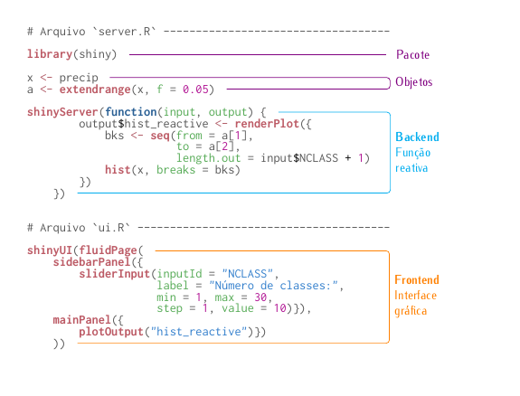

  * [hist_slider_shiny.pgf](https://github.com/walmes/Tikz/blob/master/src/hist_slider_shiny.pgf)

```tex
\tikzstyle{every picture}+=[remember picture]%
\newcommand{\NANN}[2]{% caixa alta para facilitar encontrar.
  \tikz[baseline] {%
    \node[
      anchor=base,%
      inner sep=0pt,%
      outer sep=0pt,%
      text opacity=1,%
    ] (#1) {#2};%
  }%
}%

\tikzset{%
  >=stealth,
  epath/.style={draw, <->, shorten <=1pt, shorten >=1pt},
  fpath/.style={draw, color=gray, rounded corners=2pt, shorten <=3pt, shorten >=3pt},
  cir/.style={draw, circle, fill, inner sep=0.5pt, text=white},
  dir/.style={near start, right, font=\footnotesize},
}%

\newif\ifopacity %
%\opacitytrue     % Descomente para texto transparente.
%\opacityfalse    % Ou descomente para texto forte.

\ifopacity %
  \tikzset{
     nodeR/.style={text opacity=0.2},
     fpath/.append style={color=white}}
\else %
  \tikzset{
     nodeR/.style={text opacity=1}}
\fi	%

\begin{tikzpicture}%

\node[nodeR] (slider) at (0,0)
{

\begin{minipage}{10cm}

\begin{knitrout}
\definecolor{shadecolor}{rgb}{0.969, 0.969, 0.969}\color{fgcolor}\begin{kframe}
\begin{alltt}

# Arquivo `server.R` -----------------------------------

\hlkwd{library}\hlstd{(shiny)\NANN{gw1}{\phantom{1}}}

\hlstd{x} \hlkwb{<-} \hlstd{precip\NANN{pr1}{\phantom{1}}}
\hlstd{a} \hlkwb{<-} \hlkwd{extendrange}\hlstd{(x,} \hlkwc{f}\hlstd{ = }\hlnum{0.05}\hlstd{)\NANN{pr2}{\phantom{1}}}

\hlkwd{\NANN{ss1}{shinyServer}}\hlstd{(}\hlkwa{function}\hlstd{(}\hlkwc{\NANN{in1}{input}}\hlstd{,} \hlkwc{\NANN{ou1}{output}}\hlstd{) \{\NANN{fc1}{\phantom{1}}}
        \hlstd{\NANN{ou2}{output}}\hlopt{$}\hlstd{\NANN{hr1}{hist_reactive}} \hlkwb{<-} \hlkwd{\NANN{rp1}{renderPlot}}\hlstd{(\{}
            \hlstd{bks} \hlkwb{<-} \hlkwd{seq}\hlstd{(\hlkwc{from} = a[}\hlnum{1}\hlstd{], 
                       \hlkwc{to} = a[}\hlnum{2}\hlstd{],}
                       \hlkwc{length.out}\hlstd{ = \NANN{in2}{input}}\hlopt{$}\hlstd{\NANN{nc1}{NCLASS}}\hlopt{ + }\hlnum{1}\hlstd{)}
            \hlkwd{\NANN{asd}{hist}}\hlstd{(x,} \hlkwc{breaks}\hlstd{ = bks}\hlstd{)}
        \hlstd{\})}
    \hlstd{\})\NANN{fc2}{\phantom{1}}}


# Arquivo `ui.R` ---------------------------------------

\hlkwd{\NANN{ss2}{shinyUI}}\hlstd{(}\hlkwd{fluidPage}\hlstd{(\NANN{wg1}{\phantom{1}}}
    \hlkwd{sidebarPanel}\hlstd{(}\{
        \hlkwd{\NANN{si1}{sliderInput}}\hlstd{(}\hlkwc{\NANN{ss43}{inputId}}\hlstd{ = }\hlstr{"\NANN{nc2}{NCLASS}"}\hlstd{,}
                    \hlkwc{label}\hlstd{ = }\hlstr{"N\'umero de classes:"}\hlstd{,}
                    \hlkwc{min}\hlstd{ = }\hlnum{1}\hlstd{,} \hlkwc{max}\hlstd{ = }\hlnum{30}\hlstd{,}
                    \hlkwc{step}\hlstd{ = }\hlnum{1}\hlstd{,} \hlkwc{value}\hlstd{ = }\hlnum{10}\hlstd{)}\}\hlstd{),}
    \hlkwd{mainPanel}\hlstd{(}\{
        \hlkwd{\NANN{rp2}{plotOutput}}\hlstd{(}\hlstr{"\NANN{hr2}{hist_reactive}"}\hlstd{)}\}\hlstd{)}
    \hlstd{)}\hlstd{)\NANN{wg2}{\phantom{1}}}

\end{alltt}
\end{kframe}
\end{knitrout}
\end{minipage}

}; %% \node

\path[fpath, color=violet] (gw1) -- ($(gw1)+(5.85,0)$) node[dir, right, at end] {Pacote};

\path[fpath, color=violet] (pr1) -- ($(pr1)+(6.25,0)$) |-
  node[dir] {Objetos} (pr2);

\path[fpath, color=cyan] (fc1) -- ($(fc1)+(2.6,0)$) |-
  node[dir, text width=1cm] {\textbf{Backend}\\ Fun\c{c}\~ao\\ reativa} (fc2);

\path[fpath, color=orange] (wg1) -- ($(wg1)+(5.25,0)$) |-
  node[dir, text width=1cm] {\textbf{Frontend}\\ Interface\\ gr\'{a}fica} (wg2);

\ifopacity

\path[red, epath] (nc1) to[out=-90, in=90]
  node[cir, pos=0.4] {1} (nc2);

\path[green, epath] (rp1) to[out=-100, in=90]
  node[cir, pos=0.4] {2} (rp2);

\path[blue, epath] (hr1) to[out=-100, in=100]
  node[cir, pos=0.4] {3} (hr2);

% \path[cyan, epath] (in1) to[out=60, in=120] (in2);
% \path[cyan, epath] (ou1) to[out=120, in=60] (ou2);

\fi

\end{tikzpicture}
```
****


  * [ibs.pgf](https://github.com/walmes/Tikz/blob/master/src/ibs.pgf)

```tex
% Para fazer o quadrado.
\newcommand{\thesquare}[3]{%
  \def\dmin{0.04}
  \def\dmax{0.96}
  \draw[xshift = #1, yshift = #2, fill = #3]
    (\dmin, \dmin) -- (\dmax, \dmin) --
    (\dmax, \dmax) -- (\dmin, \dmax) -- (\dmin, \dmin);
}%
%
% Definicao das cores.
\definecolor{v3}{HTML}{0071FD}%
\definecolor{v2}{HTML}{7FB7FF}%
\definecolor{v1}{HTML}{FFFFFF}%
%
\begin{tikzpicture}
  \def\dist{0cm}
  \thesquare{\dist}{2cm}{v3}
  \thesquare{\dist}{3cm}{v2}
  \thesquare{\dist}{4cm}{v1}

  \def\dist{1cm}
  \thesquare{\dist}{2cm}{v2}
  \thesquare{\dist}{3cm}{v1}
  \thesquare{\dist}{4cm}{v2}

  \def\dist{2cm}
  \thesquare{\dist}{2cm}{v1}
  \thesquare{\dist}{3cm}{v2}
  \thesquare{\dist}{4cm}{v3}

  \node[color = black] at (0.5, 4.5) {\Huge \textbf I};
  \node[color = black] at (1.5, 3.5) {\Huge \textbf B};
  \node[color = black] at (2.5, 2.5) {\Huge \textbf S};
\end{tikzpicture}%
```
****

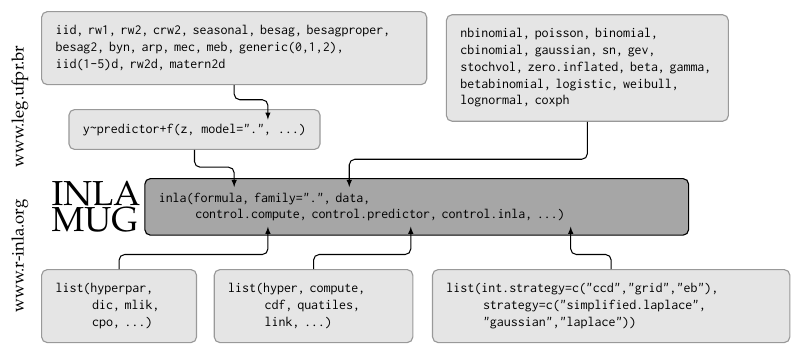

  * [inla_mug1.pgf](https://github.com/walmes/Tikz/blob/master/src/inla_mug1.pgf)

```tex
\tikzset{
  state/.style={
    rectangle, rounded corners, draw=gray!80, fill=gray!20, thick,
    minimum height=2em, inner sep=10pt, text centered},
  state2/.style={
    rectangle, rounded corners, draw=black, fill=gray!70, thick,
    minimum height=2em, inner sep=10pt, text centered}
}

\begin{tikzpicture}[->, >=latex, line width=0.75pt]
  \draw[fill=white, color=white] (-10.8,-4.5) rectangle (9.2,4.5);
  \node[text width=2cm] (mug) at (-8.6,-0.7) {\Huge INLA\\ MUG};
  \node[rotate=90] (site) at (-10.4,0) {
    \large  www.r-inla.org \hspace{3ex} www.leg.ufpr.br
  };
  \node[state2, text width=13cm, text ragged] (inla) at (-0.4,-0.7) {
    \texttt{inla(formula, family=".", data,
      \\ \hspace{5ex} control.compute, control.predictor, control.inla, ...)
    }\\
  };
  \node[state] (formula) at (-6,1.25) {
    \verb|y~predictor+f(z, model=".", ...)| \\
  };
  \node[state, text width=9cm, text ragged] (model) at (-5,3.3) {
    {\tt iid, rw1, rw2, crw2, seasonal,
      besag, besagproper, besag2, byn,
      arp, mec, meb, generic(0,1,2), iid(1-5)d, rw2d,
      matern2d}\\
  };
  \node[state, text width=6.4cm, text ragged] (family) at (3.9,2.8) {
    {\tt nbinomial, poisson, binomial, cbinomial, gaussian, sn, gev,
      stochvol, zero.inflated, beta, gamma, betabinomial, logistic,
      weibull, lognormal, coxph}\\
  };
  \node[state, text width=3.2cm, text ragged]
  (controlcompute) at (-7.9,-3.2) {
    {\tt list(hyperpar, \\ \hspace{5ex} dic,  mlik, \\ \hspace{5ex} cpo, ...)}\\
  };
  \node[state, text width=4.3cm, text ragged]
  (controlpredictor) at (-3,-3.2) {
    {\tt list(hyper, compute, \\ \hspace{5ex} cdf, quatiles,
      \\ \hspace{5ex} link, ...)}\\
  };
  \node[state, text width=8.3cm, text ragged]
  (controlinla) at (4.5,-3.2) {
    {\tt list(int.strategy=c("ccd","grid","eb"),\\
      \hspace{5ex} strategy=c("simplified.laplace",\\
      \hspace{5ex} "gaussian","laplace"))}\\
  };
  \draw[<-, rounded corners] (-5,-0.2) |- ++(-0.5,0.5) -| (formula);
  \draw[<-, rounded corners] (-4.15,1.5) |- ++(-0.5,0.5) -| (model);
  \draw[<-, rounded corners] (-2.1,-0.2) |- ++(0.5,0.7) -| (family);
  \draw[<-, rounded corners] (-4.15,-1.2) |- ++(-0.5,-0.7)
    -| (controlcompute);
  \draw[<-, rounded corners] (-0.55,-1.2) |- ++(-0.5,-0.7)
    -| (controlpredictor);
  \draw[<-, rounded corners] (3.48,-1.2) |- ++(0.5,-0.7)
    -| (controlinla);
\end{tikzpicture}
```
****

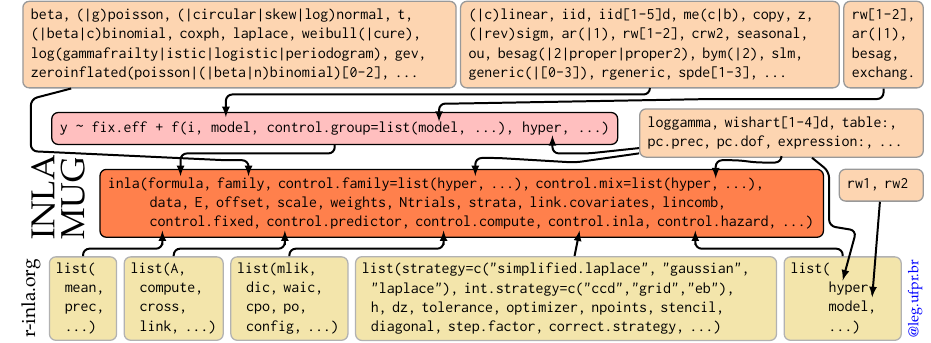

  * [inla_mug2.pgf](https://github.com/walmes/Tikz/blob/master/src/inla_mug2.pgf)

```tex
\definecolor{brown}{rgb}{1,0.5,0.3}
\definecolor{lightapricot}{RGB}{253,213,177}
\definecolor{apricotcream}{RGB}{243,229,171}

\tikzset{
  statei/.style={
    rectangle, rounded corners, draw=black, fill=brown, thick,
    minimum height=2em, inner sep=5pt, text centered},
  statef/.style={
    rectangle, rounded corners, draw=black, fill=pink, thick,
    minimum height=2em, inner sep=5pt, text centered},
  statem/.style={
    rectangle, rounded corners, draw=gray!80, fill=lightapricot, thick,
    minimum height=2em, inner sep=5pt, text centered},
  statec/.style={
    rectangle, rounded corners, draw=gray!60, fill=apricotcream, thick,
    minimum height=2em, inner sep=4pt, text centered}
}

\begin{tikzpicture}[->, >=latex, line width=0.75pt]
  \draw [fill=white, color=white] (-12.3,-3.8) rectangle (7.7,3.67);
  \node [rotate=90] (site) at (-12,-2.9)
    {\large r-inla.org};
  \node [rotate=90, color=blue, scale=0.9] (site) at (7.5,-2.9)
    {@leg.ufpr.br};
  \node [rotate=90, text width=1.7cm] (mug) at (-11.4,-0.75)
    {\huge  INLA\\ \vspace{0.1cm} MUG};

  \node [statei, text width=15.6cm, text ragged] (inla) at (-2.5,-0.8) {
    \texttt{inla(formula, family, control.family=list(hyper, ...),
      control.mix=list(hyper, ...), \\
      \hspace{5ex} data, E, offset, scale, weights, Ntrials,
      strata, link.covariates, lincomb,\\
      \hspace{5ex} control.fixed, control.predictor,
      control.compute, control.inla, control.hazard, ...)}\\
  };

  \node [statef] (formula) at (-5.3,0.85) {
    \verb|y ~ fix.eff + f(i, model, control.group=list(model, ...), hyper, ...)| \\
  };

  \node [statem, text width=9.2cm, text ragged] (family) at (-7.4,2.7) {
    {\tt beta, (|g)poisson, (|circular|skew|log)normal, t,
      (|beta|c)binomial, coxph, laplace, weibull(|cure),\\
      log(gammafrailty|istic|logistic|periodogram), gev,\\ % gamma(|count),\\
      zeroinflated(poisson|(|beta|n)binomial)[0-2], ...}\\
  };

  \node [statem, text width=8cm, text ragged] (model) at (1.65,2.7) {
    {\tt (|c)linear, iid, iid[1-5]d, me(c|b), copy, z,\\ 
      (|rev)sigm, ar(|1), rw[1-2], crw2, seasonal, \\
      ou, besag(|2|proper|proper2), bym(|2), slm,
      generic(|[0-3]), rgeneric, spde[1-3], ...}\\
  };

  \node [statem, text width=1.4cm, text ragged] (group) at (6.8,2.7) {
    {\tt rw[1-2], ar(|1), besag, exchang.}\\
  };

  \node [statem, text width=5.9cm, text ragged] (prior) at (4.55,0.75) {
    {\tt loggamma, wishart[1-4]d, table:,
      pc.prec, pc.dof, expression:, ...}\\
  };
  \node [statem, text width=1.5cm, text ragged]
  (hazard) at (6.75,-0.4) {
    {\tt rw1, rw2}\\
  };
  \node[statec, text width=1.2cm, text ragged]
  (controlfixed) at (-10.85,-2.9){
    {\tt list(\\
      \hspace{0.5ex} mean,\\
      \hspace{0.5ex} prec,\\
      \hspace{0.5ex} ...)}\\
  };

  \node[statec, text width=1.9cm, text ragged]
  (controlpredictor) at (-8.85,-2.9){
    {\tt list(A,\\
      \hspace{0.5ex} compute,\\
      \hspace{0.5ex} cross,\\
      \hspace{0.5ex} link, ...)}\\
  };
  \node[statec, text width=2.3cm, text ragged]
  (controlcompute) at (-6.3,-2.9){
    {\tt list(mlik,\\
      \hspace{0.5ex} dic, waic,\\
      \hspace{0.5ex} cpo, po,\\
      \hspace{0.5ex} config, ...)}\\
  };
  \node[statec, text width=9cm, text ragged]
  (controlinla) at (-.2,-2.9){
    {\tt list(strategy=c("simplified.laplace", "gaussian",\\
      \hspace{0.5ex}  "laplace"), int.strategy=c("ccd","grid","eb"),\\
      \hspace{0.5ex}  h, dz, tolerance, optimizer, npoints, stencil,\\
      \hspace{0.5ex}  diagonal, step.factor, correct.strategy, ...)}\\
  };
  \node[statec, text width=2.3cm, text ragged]
  (controlhazard) at (5.9,-2.9){
    {\tt list(\\
      \hspace{4.5ex} hyper,\\
      \hspace{4.5ex}  model,\\
      \hspace{4.5ex}  ...)}\\
  };
  \draw[<-, rounded corners, line width=1.25pt]
    (-7.7,1.1) |- ++(0.5,0.5) -| (model);
  \draw[<-, rounded corners, line width=1.25pt]
    (-3,1.0) |- ++(0.4,0.4) -- (3,1.5) -| (group);
  \draw[<-, rounded corners, line width=1.25pt]
    (-8.7,-0.2) |- ++(0.5,0.5) -| (formula);
  \draw[<-, rounded corners, line width=1.25pt]
    (-7.2,-0.2) |- ++(-0.5,0.35) --(-12,0.35) --(-12,1.5) -- (family);
  \draw[<-, rounded corners, line width=1.25pt]
    (-0.5,.7) |- ++(0.4,-0.4) -- (0.3,0.3) -- (prior);
  \draw[<-, rounded corners, line width=1.25pt]
    (-2.2,-0.2) |- ++(0.5,0.4) -- (0,0.1) -- (prior);
  \draw[<-, rounded corners, line width=1.25pt]
    (3.1,-0.25) |- ++(0.5,0.4) --(4,0.1) -| (prior);
  \draw[<-, rounded corners, line width=1.25pt]
    (5.9,-2.5) -- (6.2,-1.4) -- (5.6,-1.3) -- (5.6,-0.1) -- (prior);
  \draw[<-, rounded corners, line width=1.25pt]
    (6.55,-2.87) -- (hazard);
  \draw[<-, rounded corners, line width=1.25pt]
    (-9.1,-1.4) |- ++(0,-0.4) -| (controlfixed);
  \draw[<-, rounded corners, line width=1.25pt]
    (-6.4,-1.4) |- ++(0,-0.4) -| (controlpredictor);
  \draw[<-, rounded corners, line width=1.25pt]
    (-2.9,-1.4) |- ++(-0,-0.4) -| (controlcompute);
  \draw[<-, rounded corners, line width=1.25pt]
    (0.1,-1.4) -- (controlinla);
  \draw[<-, rounded corners, line width=1.25pt]
    (2.65,-1.4) |- ++(-0,-0.4) -| (controlhazard);
\end{tikzpicture}
```
****

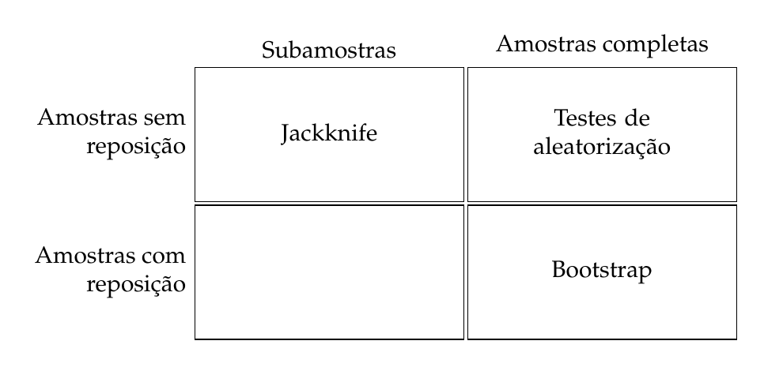

  * [jackknife-bootstrap-randomization.pgf](https://github.com/walmes/Tikz/blob/master/src/jackknife-bootstrap-randomization.pgf)

```tex
% http://www.tandfonline.com/doi/pdf/10.1207/S15327906MBR3404_2
% Joseph Lee Rodgers (1999). The Bootstrap, the Jackknife, and the
% Randomization Test: A Sampling Taxonomy, Multivariate Behavioral Research, 34:4, 441-456, 
% DOI: 10.1207/S15327906MBR3404_2
\begin{tikzpicture}[
  square/.style = {
    draw, 
    minimum width = 4cm,
    minimum height = 2cm,
    text width = 2.8cm, 
    text centered},
]

\node[square] (jack) {Jackknife};
\node[square, right = 0.25ex of jack] (rand) {Testes de aleatoriza{\c c}{\~a}o};
\node[square, below = 0.25ex of rand] (boot) {Bootstrap};
\node[square, below = 0.25ex of jack] (null) {};

\node at (jack.north) [above] {Subamostras};
\node at (rand.north) [above] {Amostras completas};
\node at (jack.west) [left, align = right] {Amostras sem\\ reposi{\c c}{\~a}o};
\node at (null.west) [left, align = right] {Amostras com\\ reposi{\c c}{\~a}o};

\end{tikzpicture}%
```
****


  * [leg-profs.pgf](https://github.com/walmes/Tikz/blob/master/src/leg-profs.pgf)

```tex
\newcommand{\leglogo}[3]{
  \draw[color=white!50!black, fill=white, line width=5pt] (0,0) circle (5cm);
  \draw[draw=none, fill=white!50!black] (-0.4,0.4) circle (4.2cm);
  \draw[draw=none, fill=orange] (1.9,0.5) circle (0.8cm);
  \draw node[font=\fontsize{165}{144}\selectfont, color=white] (#1) at (0,0) {leg};
  \node[right=2cm of #1.20, font=\fontsize{100}{0}\selectfont] (#1prof) {#2};
  \node[below=1cm of #1prof, font=\fontsize{60}{0}\selectfont] (#1email) {\texttt{#3@ufpr.br}};
  \node[fit={(-5.4, -5) (-5, 5) (#1prof) (#1email)}, inner sep=1cm, draw=gray, thick] (rect) {};
}

\begin{tikzpicture}
\def\numb{12}

\begin{scope}[yshift=-0*\numb cm]
\leglogo{elias}{Prof. Elias T. Krainski}{eliaskr}
\end{scope}


\begin{scope}[yshift=-1*\numb cm]
\leglogo{wagner}{Prof. Wagner H. Bonat}{wbonat}
\end{scope}

\begin{scope}[yshift=-2*\numb cm]
\leglogo{cesar}{Prof. Cesar A. Taconeli}{taconeli}
\end{scope}

\begin{scope}[yshift=-3*\numb cm]
\leglogo{fernando}{Prof. Fernando P. Mayer}{fernando.mayer}
\end{scope}

\begin{scope}[yshift=-4*\numb cm]
\leglogo{walmes}{Prof. Walmes M. Zeviani}{walmes}
\end{scope}

\begin{scope}[yshift=-5*\numb cm]
\leglogo{eduardo}{Prof. Eduardo V. Ferreira}{e.ferreira}
\end{scope}

\begin{scope}[yshift=-6*\numb cm]
\leglogo{silvia}{Profa. Silvia E. Shimakura}{silvia.shimakura}
\end{scope}


\begin{scope}[yshift=-7*\numb cm]
\leglogo{paulo}{Prof. Paulo Justiniano R. Jr}{paulojus}
\end{scope}

\begin{scope}[yshift=-8*\numb cm]
\leglogo{cesar}{Profa.  Fernanda B. Rizzato}{fernandab}
\end{scope}

\end{tikzpicture}
```
****


  * [leg.pgf](https://github.com/walmes/Tikz/blob/master/src/leg.pgf)

```tex
\def\outercircle{(0,0) circle (5cm)}%
\def\innercircle{(-0.4,0.4) circle (4.2cm)}%
\def\leg{%
  \node[font=\fontsize{165}{144}\selectfont, color=white]
  at (0,0) (leg) {leg}}%
\def\orangecircle{(1.9,0.5) circle (0.8cm)}%

\begin{tikzpicture}
  \draw[color=white!50!black, fill=white, line width=5pt]
  \outercircle;
  \draw[draw=none, fill=white!50!black] \innercircle;
  \draw[draw=none, fill=orange] \orangecircle;
  \leg;
\end{tikzpicture}%
```
****

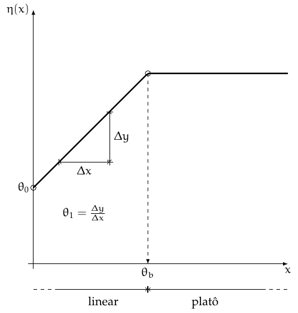

  * [linear_plato.pgf](https://github.com/walmes/Tikz/blob/master/src/linear_plato.pgf)

```tex
% \tikzstyle{aponta}=[-latex, dashed]
% \tikzstyle{eixos}=[-latex]
% \tikzstyle{fun}=[very thick]
\tikzset{%
  aponta/.style={-latex, dashed},
  eixos/.style={-latex},
  fun/.style={very thick}
}%

\begin{tikzpicture}[domain=0:10, xscale=0.75, yscale=0.75]%
  % \draw[very thin,color=gray!30] (0,0) grid (10,10);
  % \draw[draw=gray!30] (-1,-1) rectangle (11,11);
  \draw[eixos] (-0.2,0) -- (10,0) node[below] {$x$};
  \draw[-latex] (0,-0.2) -- (0,10) node[left] (E) {$\eta(x)$};

  \def\A{3}; \def\B{1}; \def\C{4.5};
  \draw[fun, color=green!60!black]
    plot[id=x, samples=100]
    function{\A+\B*x*(x<\C)+\B*\C*(x>\C)};

  \coordinate (b) at (\C,\A+\B*\C);
  \draw (0,\A) circle (3pt) node[left] {$\theta_0$};
  \draw (b) circle (3pt);
  \draw[aponta] (b) -- (\C,0) node[below] {$\theta_b$};
  \draw[|<->|] (1,4) -- (3,4)
    node[midway, below, fill=white] {$\Delta x$};
  \draw[|<->|] (3,4) -- (3,6)
    node[midway, right, fill=white] {$\Delta y$};
  \node[fill=white] (b1) at (2,2)
    {$\theta_1 = \frac{\Delta y}{\Delta x}$};

  \def\desc{-1}
  \draw[->|] (1,\desc) -- (\C,\desc)
    node[midway, below=3pt] {linear};
  \draw[dashed] (0,\desc) -- (1,\desc);
  \draw[|<-] (\C,\desc) -- (9,\desc)
    node[midway, below=3pt] {plat\^o};
  \draw[dashed] (9,\desc) -- (10,\desc);

\end{tikzpicture}%
```
****

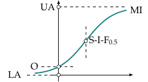

  * [logis.pgf](https://github.com/walmes/Tikz/blob/master/src/logis.pgf)

```tex
\def\ptsize{0.75pt}
\tikzset{
  mypoints/.style={fill=white, draw=black},
  pil/.style={->, shorten <=2pt, shorten >=2pt}
}

\begin{tikzpicture}[>=latex, xscale=2.5, yscale=2.5]
  \begin{scope}
    \def\thetas{5}; \def\thetav{0.4}
    \draw[->] (-0.1,0) -- +(1.2,0);
    \draw[->] (0,-0.1) -- +(0,1.2);
    \draw[-, color=darkgreen, very thick, samples=100]
    plot[id=x, domain=-0.35:1]
    function{1/(1+exp(-\thetas*(x-\thetav)))}
    node[right, color=black] {MI};
    \draw[dashed] (0,1) -- (1,1);
    \fill[mypoints] (0,1) circle (\ptsize) node[left] {UA};
    \draw[dashed] (0,0) -- (-0.5,0) node[left] {LA};
    \fill[mypoints] (0,0) circle (\ptsize);
    \draw[dashed] ($(-0.25,0)+1/(1+exp(\thetas*\thetav))*(0,1)$)
      node[left] {O} -- +(0.5,0);
    \fill[mypoints] ($(0,0)+1/(1+exp(\thetas*\thetav))*(0,1)$)
      circle (\ptsize);
    \draw[dashed] (\thetav,0.25) -- +(0,0.5);
    \fill[mypoints] (\thetav,0.5) circle (\ptsize)
      node[right] {S-I-F$_{0.5}$};
  \end{scope}
\end{tikzpicture}
```
****

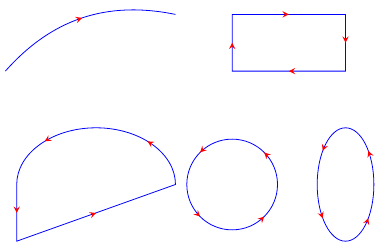

  * [marcacao.pgf](https://github.com/walmes/Tikz/blob/master/src/marcacao.pgf)

```tex
% http://tex.stackexchange.com/questions/3161/tikz-how-to-draw-an-arrow-in-the-middle-of-the-line

\tikzset{
  % style to apply some styles to each segment of a path
  on each segment/.style={
    decorate,
    decoration={
      show path construction,
      moveto code={},
      lineto code={
        \path [#1] (\tikzinputsegmentfirst) -- (\tikzinputsegmentlast);
      },
      curveto code={
        \path [#1] (\tikzinputsegmentfirst) .. controls
        (\tikzinputsegmentsupporta) and (\tikzinputsegmentsupportb) ..
        (\tikzinputsegmentlast);
      },
      closepath code={
        \path [#1]
        (\tikzinputsegmentfirst) -- (\tikzinputsegmentlast);
      },
    },
  },
  % style to add an arrow in the middle of a path
  mid arrow/.style={
    postaction={decorate,
      decoration={
        markings, mark=at position .5 with {\arrow[#1]{stealth}}
      }
    }
  },
}

\begin{tikzpicture}
  \path [draw=blue, postaction={on each segment={mid arrow=red}}]
  (.2,0) -- (3,1) arc (0:180:1.4 and 1) -- cycle
  (4,1) circle (.8)
  (6,1) ellipse (.5 and 1)
  (0,3) to [bend left] (3,4)
  (4,3) rectangle (6,4);
\end{tikzpicture}
```
****

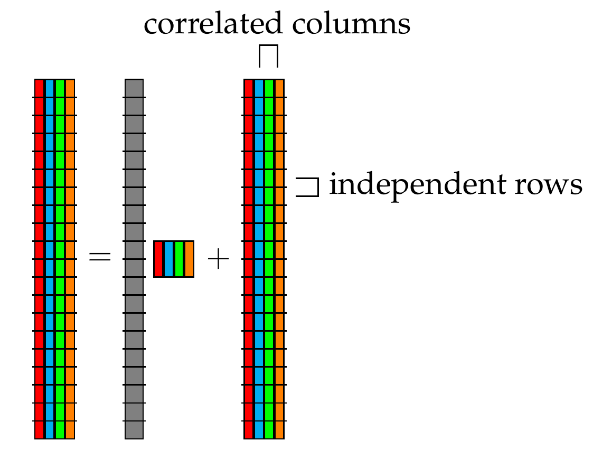

  * [matricial_manova_2.pgf](https://github.com/walmes/Tikz/blob/master/src/matricial_manova_2.pgf)

```tex
\newcommand{\matColumn}[2]{
  \draw [fill = #1, draw, thin] (0, 0) rectangle (#2)
}
\newcommand{\matColumnBorder}[2]{
  \draw [draw = #1] (0, 0) rectangle (#2)
}

% \DeclareMathOperator{\vect}{vec}
\makeatletter
\def\Vec{\mathop{\operator@font vec}\nolimits}
\makeatother

\begin{tikzpicture}[
  node distance=0.3cm,
  mtx/.style={
    matrix of math nodes,
    left delimiter={[},
    right delimiter={]}
  },
  mtn/.style={
    matrix of nodes
  },
  ]

\begin{scope}

  \matrix[mtn] (Y) {%
    \matColumn{red}{0.1, 4}; &
    \matColumn{cyan}{0.1, 4}; &
    \matColumn{green}{0.1, 4}; &
    \matColumn{orange}{0.1, 4}; \\
  };

  \matrix[mtn, right=of Y] (X) {%
    \matColumn{gray}{0.6, 4}; \\
  };

  \matrix[mtn, right=-4pt of X] (beta) {%
    \matColumn{red}{0.1, 0.6}; &
    \matColumn{cyan}{0.1, 0.6}; &
    \matColumn{green}{0.1, 0.6}; &
    \matColumn{orange}{0.1, 0.6}; \\
  };

  \matrix[mtn, right=of beta] (E) {%
    \matColumn{red}{0.1, 4}; &
    \matColumn{cyan}{0.1, 4}; &
    \matColumn{green}{0.1, 4}; &
    \matColumn{orange}{0.1, 4}; \\
  };

  \foreach \dy in {-1.9, -1.8, ..., 1.9}{
    \draw[very thin] ($(Y.west)+(0.1, \dy)$) -- ($(Y.east)+(-0.1, \dy)$);
    \draw[very thin] ($(X.west)+(0.1, \dy)$) -- ($(X.east)+(-0.1, \dy)$);
    \draw[very thin] ($(E.west)+(0.1, \dy)$) -- ($(E.east)+(-0.1, \dy)$);
  }

  \node at ($(Y.east)!0.5!(X.west)$) {$=$};%
  \node at ($(beta.east)!0.5!(E.west)$) {$+$};%

  \draw[draw = black] ($(E.east)+(0, 0.9)$) --
    +(0.25,0) |- node [pos = 0.25, anchor = west] {independent rows}
    +(0, -0.2);

  \draw[draw = black] ($(E.north)+(-0.05, 0)$) --
    +(0, 0.25) -| node [pos = 0.5, anchor = -90] {correlated columns}
    +(0.2, 0);

%   \node (rec1) [draw, fit = (Y) (E)] {};
%   \node [above=0cm of rec1] {$Y = XB + E$};

\end{scope}

\end{tikzpicture}
```
****

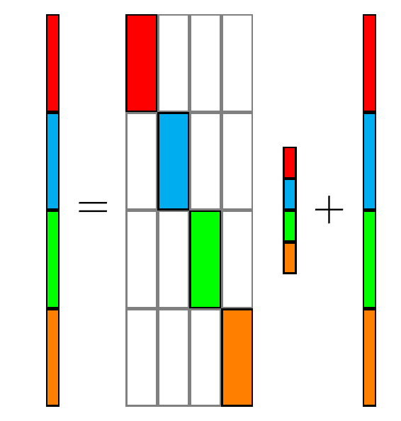

  * [matricial_manova_3.pgf](https://github.com/walmes/Tikz/blob/master/src/matricial_manova_3.pgf)

```tex
\newcommand{\matColumn}[2]{
  \draw [fill = #1, draw, thin] (0,0) rectangle (#2)
}
\newcommand{\matColumnBorder}[2]{
  \draw [draw = #1] (0,0) rectangle (#2)
}

% \DeclareMathOperator{\vect}{vec}
\makeatletter
\def\Vec{\mathop{\operator@font vec}\nolimits}
\makeatother

\begin{tikzpicture}[
  node distance=0.3cm,
  mtx/.style={
    matrix of math nodes,
    left delimiter={[},
    right delimiter={]}
  },
  mtn/.style={
    matrix of nodes
  },
  ]

\def\yw{0.1}
\def\yh{0.8}
\def\xw{0.25}
\def\xh{0.5}

\begin{scope}

  \matrix[mtn] (Y) {%
    \matColumn{red}{\yw, \yh}; \\
    \matColumn{cyan}{\yw, \yh}; \\
    \matColumn{green}{\yw, \yh}; \\
    \matColumn{orange}{\yw, \yh}; \\
  };

  \matrix[mtn, right=of Y] (X) {%
    \matColumn{red}{\xw,\yh}; &
    \matColumnBorder{gray}{\xw,\yh}; & 
    \matColumnBorder{gray}{\xw,\yh}; &
    \matColumnBorder{gray}{\xw,\yh}; \\
    \matColumnBorder{gray}{\xw,\yh}; &
    \matColumn{cyan}{\xw,\yh}; & 
    \matColumnBorder{gray}{\xw,\yh}; &
    \matColumnBorder{gray}{\xw,\yh}; \\
    \matColumnBorder{gray}{\xw,\yh}; &
    \matColumnBorder{gray}{\xw,\yh}; & 
    \matColumn{green}{\xw,\yh}; &
    \matColumnBorder{gray}{\xw,\yh}; \\
    \matColumnBorder{gray}{\xw,\yh}; &
    \matColumnBorder{gray}{\xw,\yh}; & 
    \matColumnBorder{gray}{\xw,\yh}; &
    \matColumn{orange}{\xw,\yh}; \\
  };

  \matrix[mtn, right=0.0cm of X] (beta) {%
    \matColumn{red}{\yw,\xw}; \\
    \matColumn{cyan}{\yw,\xw}; \\
    \matColumn{green}{\yw,\xw}; \\
    \matColumn{orange}{\yw,\xw}; \\
  };

  \matrix[mtn, right=of beta] (E) {%
    \matColumn{red}{\yw,\yh}; \\
    \matColumn{cyan}{\yw,\yh}; \\
    \matColumn{green}{\yw,\yh}; \\
    \matColumn{orange}{\yw,\yh}; \\
  };

  \node at ($(Y.east)!0.5!(X.west)$) {$=$};%
  \node at ($(beta.east)!0.5!(E.west)$) {$+$};%

%   \node (rec2) [draw, fit = (Y) (E)] {};
%   \node [above=0cm of rec2] {$\Vec(Y) = [\bigoplus_{i=1}^m X_i] \Vec(B) + \Vec(E)$};

\end{scope}

\end{tikzpicture}
```
****

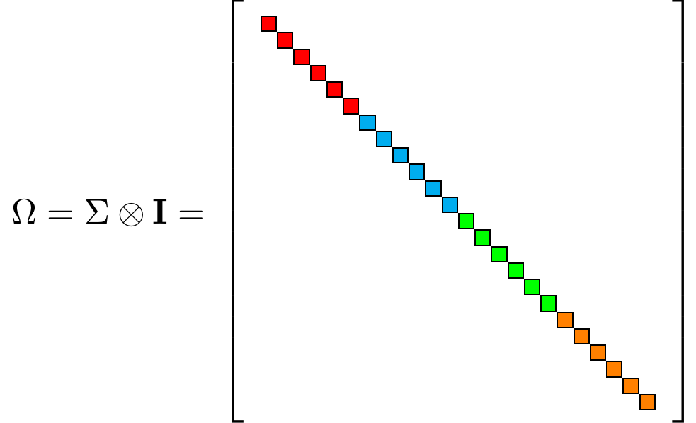

  * [matricial_manova_Omega.pgf](https://github.com/walmes/Tikz/blob/master/src/matricial_manova_Omega.pgf)

```tex
\newcommand{\matColumn}[1]{%
  \draw [fill = #1, draw, thin] (0, 0) rectangle (0.15, 0.15)
}%

\begin{tikzpicture}[
  node distance = 0.3cm,
  mtn/.style = {
    matrix of nodes,
    left delimiter = {[},
    right delimiter = {]}
  },
  ]

% R code to generate the content of the matrix.
% v <- sprintf("\\matColumn{%s};", c("red", "cyan", "green", "orange"))
% v <- rep(v, each = 6)
% d <- matrix("", length(v), length(v))
% diag(d) <- v
% print(xtable(d),
%       include.rownames = FALSE,
%       include.colnames = FALSE,
%       only.contents = TRUE,
%       hline.after = NULL,
%       sanitize.text.function = identity,
%       comment = FALSE)

  \matrix[mtn] (Y) {%
   \matColumn{red}; &  &  &  &  &  &  &  &  &  &  &  &  &  &  &  &  &  &  &  &  &  &  &  \\ 
   & \matColumn{red}; &  &  &  &  &  &  &  &  &  &  &  &  &  &  &  &  &  &  &  &  &  &  \\ 
   &  & \matColumn{red}; &  &  &  &  &  &  &  &  &  &  &  &  &  &  &  &  &  &  &  &  &  \\ 
   &  &  & \matColumn{red}; &  &  &  &  &  &  &  &  &  &  &  &  &  &  &  &  &  &  &  &  \\ 
   &  &  &  & \matColumn{red}; &  &  &  &  &  &  &  &  &  &  &  &  &  &  &  &  &  &  &  \\ 
   &  &  &  &  & \matColumn{red}; &  &  &  &  &  &  &  &  &  &  &  &  &  &  &  &  &  &  \\ 
   &  &  &  &  &  & \matColumn{cyan}; &  &  &  &  &  &  &  &  &  &  &  &  &  &  &  &  &  \\ 
   &  &  &  &  &  &  & \matColumn{cyan}; &  &  &  &  &  &  &  &  &  &  &  &  &  &  &  &  \\ 
   &  &  &  &  &  &  &  & \matColumn{cyan}; &  &  &  &  &  &  &  &  &  &  &  &  &  &  &  \\ 
   &  &  &  &  &  &  &  &  & \matColumn{cyan}; &  &  &  &  &  &  &  &  &  &  &  &  &  &  \\ 
   &  &  &  &  &  &  &  &  &  & \matColumn{cyan}; &  &  &  &  &  &  &  &  &  &  &  &  &  \\ 
   &  &  &  &  &  &  &  &  &  &  & \matColumn{cyan}; &  &  &  &  &  &  &  &  &  &  &  &  \\ 
   &  &  &  &  &  &  &  &  &  &  &  & \matColumn{green}; &  &  &  &  &  &  &  &  &  &  &  \\ 
   &  &  &  &  &  &  &  &  &  &  &  &  & \matColumn{green}; &  &  &  &  &  &  &  &  &  &  \\ 
   &  &  &  &  &  &  &  &  &  &  &  &  &  & \matColumn{green}; &  &  &  &  &  &  &  &  &  \\ 
   &  &  &  &  &  &  &  &  &  &  &  &  &  &  & \matColumn{green}; &  &  &  &  &  &  &  &  \\ 
   &  &  &  &  &  &  &  &  &  &  &  &  &  &  &  & \matColumn{green}; &  &  &  &  &  &  &  \\ 
   &  &  &  &  &  &  &  &  &  &  &  &  &  &  &  &  & \matColumn{green}; &  &  &  &  &  &  \\ 
   &  &  &  &  &  &  &  &  &  &  &  &  &  &  &  &  &  & \matColumn{orange}; &  &  &  &  &  \\ 
   &  &  &  &  &  &  &  &  &  &  &  &  &  &  &  &  &  &  & \matColumn{orange}; &  &  &  &  \\ 
   &  &  &  &  &  &  &  &  &  &  &  &  &  &  &  &  &  &  &  & \matColumn{orange}; &  &  &  \\ 
   &  &  &  &  &  &  &  &  &  &  &  &  &  &  &  &  &  &  &  &  & \matColumn{orange}; &  &  \\ 
   &  &  &  &  &  &  &  &  &  &  &  &  &  &  &  &  &  &  &  &  &  & \matColumn{orange}; &  \\ 
   &  &  &  &  &  &  &  &  &  &  &  &  &  &  &  &  &  &  &  &  &  &  & \matColumn{orange}; \\ 
  };

  \node [left=of Y] {$\Omega = \Sigma \otimes \mathbf{I} = $};

\end{tikzpicture}%
```
****

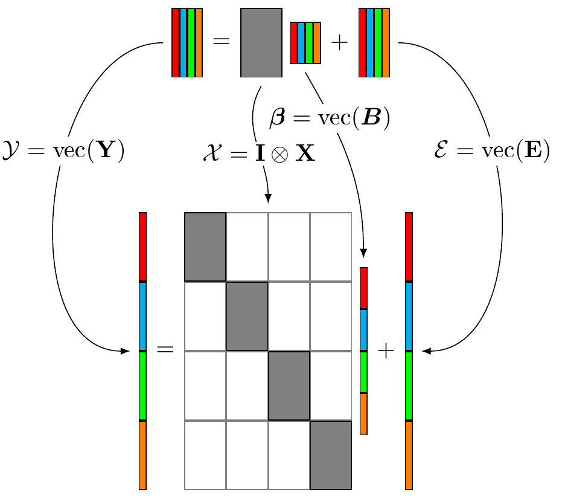

  * [matricial_manova_reshape.pgf](https://github.com/walmes/Tikz/blob/master/src/matricial_manova_reshape.pgf)

```tex
% ATTENTION: to proper render the \mathcal{}, comment ou the
% \usepackage{eulervm} in the preamble.

\newcommand{\matColumn}[2]{%
  \draw [fill = #2, draw, thin] (0, 0) rectangle (#1)
}%
\newcommand{\matColumnBorder}[2]{%
  \draw [draw = #2] (0, 0) rectangle (#1)
}%

% \DeclareMathOperator{\vect}{vec}
\makeatletter%
\def\Vec{\mathop{\operator@font vec}\nolimits}%
\makeatother%

\begin{tikzpicture}[
  node distance = 0.3cm,
  mtx/.style = {
    matrix of math nodes,
    left delimiter = {[},
    right delimiter = {]}
  },
  mtn/.style = {
    matrix of nodes
  },
  ]

\begin{scope}

  \def\yh{1}
  \def\yw{0.1}
  \def\xw{0.6}

  \matrix[mtn] (Y) {%
    \matColumn{\yw, \yh}{red}; &
    \matColumn{\yw, \yh}{cyan}; &
    \matColumn{\yw, \yh}{green}; &
    \matColumn{\yw, \yh}{orange}; \\
  };

  \matrix[mtn, right = of Y] (X) {%
    \matColumn{\xw, \yh}{gray}; \\
  };

  \matrix[mtn, right = -4pt of X] (beta) {%
    \matColumn{\yw, \xw}{red}; &
    \matColumn{\yw, \xw}{cyan}; &
    \matColumn{\yw, \xw}{green}; &
    \matColumn{\yw, \xw}{orange}; \\
  };

  \matrix[mtn, right = of beta] (E) {%
    \matColumn{\yw, \yh}{red}; &
    \matColumn{\yw, \yh}{cyan}; &
    \matColumn{\yw, \yh}{green}; &
    \matColumn{\yw, \yh}{orange}; \\
  };

  \node at ($(Y.east)!0.5!(X.west)$) {$=$};%
  \node at ($(beta.east)!0.5!(E.west)$) {$+$};%

  % \node (wide) [draw = gray, fit = (Y) (E)] {};
  % \node [above=0cm of rec1] {$Y = XB + E$};

\end{scope}

\begin{scope}[xshift = -0.65cm, yshift = -4.5cm]

  \def\yh{1}
  \def\yw{0.1}
  \def\xw{0.6}
  \def\zerom{\matColumnBorder{\xw, \yh}{gray};}

  \matrix[mtn] (vecY) {%
    \matColumn{\yw, \yh}{red}; \\
    \matColumn{\yw, \yh}{cyan}; \\
    \matColumn{\yw, \yh}{green}; \\
    \matColumn{\yw, \yh}{orange}; \\
  };

  \matrix[mtn, right = of vecY] (kronX) {%
    \matColumn{\xw, \yh}{gray}; &
    \zerom &
    \zerom &
    \zerom \\
    \zerom &
    \matColumn{\xw, \yh}{gray}; &
    \zerom &
    \zerom \\
    \zerom &
    \zerom &
    \matColumn{\xw, \yh}{gray}; &
    \zerom \\
    \zerom &
    \zerom &
    \zerom &
    \matColumn{\xw, \yh}{gray}; \\
  };

  \matrix[mtn, right = -4pt of kronX] (vecbeta) {%
    \matColumn{\yw, \xw}{red}; \\
    \matColumn{\yw, \xw}{cyan}; \\
    \matColumn{\yw, \xw}{green}; \\
    \matColumn{\yw, \xw}{orange}; \\
  };

  \matrix[mtn, right = of vecbeta] (vecE) {%
    \matColumn{\yw, \yh}{red}; \\
    \matColumn{\yw, \yh}{cyan}; \\
    \matColumn{\yw, \yh}{green}; \\
    \matColumn{\yw, \yh}{orange}; \\
  };

  \node at ($(vecY.east)!0.5!(kronX.west)$) {$=$};%
  \node at ($(vecbeta.east)!0.5!(vecE.west)$) {$+$};%

  % \node (long) [draw, fit = (vecY) (vecE)] {};

\end{scope}

\begin{scope}[
  every node/.style = {inner sep = 1pt, fill = white},
  every path/.style = {->, >=latex}]

  \path (Y.west) edge[out = 180, in = 180, pos = 0.4]
    node {$\mathcal{Y} = \text{vec}(\mathbf{Y})$}
    (vecY.west);%
  \path (X.south) edge[out = -120, in = 90, pos = 0.6]
    node {$\mathcal{X} = \mathbf{I} \otimes \mathbf{X}$}
    (kronX.north);%
  \path (beta.south) edge[out = -60, in = 90, pos=0.25]
    node {$\boldsymbol{\beta} = \text{vec}(\boldsymbol{B})$}
    (vecbeta.north);%
  \path (E.east) edge[out = 0, in = 0, pos = 0.4]
    node {$\mathcal{E} = \text{vec}(\mathbf{E})$}
    (vecE.east);%

\end{scope}

% \draw[thick, red] (-3, -7) rectangle (5.5, 1);

\end{tikzpicture}%
```
****

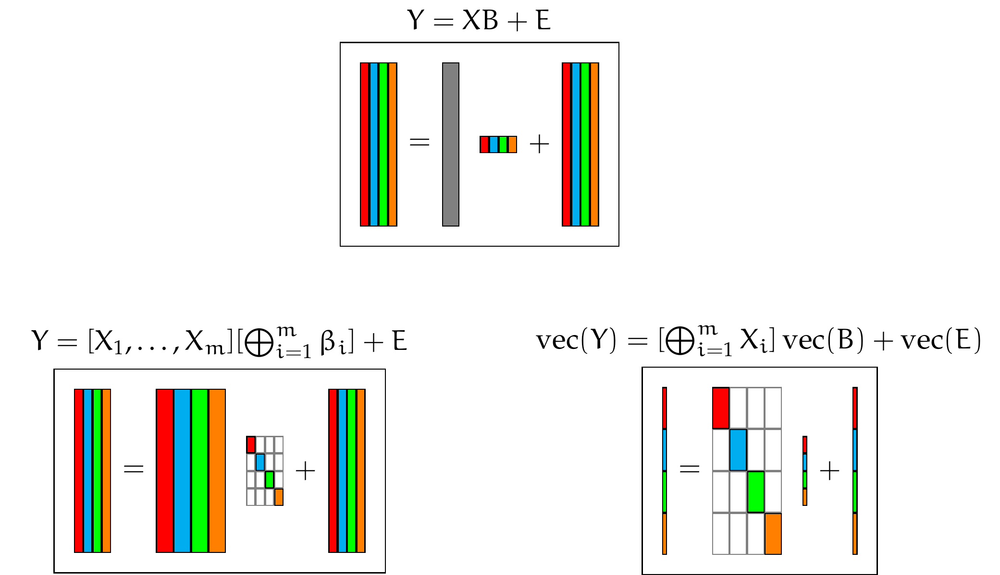

  * [matricial_manova.pgf](https://github.com/walmes/Tikz/blob/master/src/matricial_manova.pgf)

```tex
\newcommand{\matColumn}[2]{
  \draw [fill = #1, draw, thin] (0,0) rectangle (#2)
}
\newcommand{\matColumnBorder}[2]{
  \draw [draw = #1] (0,0) rectangle (#2)
}

% \DeclareMathOperator{\vect}{vec}
\makeatletter
\def\Vec{\mathop{\operator@font vec}\nolimits}
\makeatother

\begin{tikzpicture}[
  node distance=0.3cm,
  mtx/.style={
    matrix of math nodes,
    left delimiter={[},
    right delimiter={]}
  },
  mtn/.style={
    matrix of nodes
  },
  ]

\begin{scope}

  \matrix[mtn] (Y) {%
    \matColumn{red}{0.1,2}; &
    \matColumn{cyan}{0.1,2}; &
    \matColumn{green}{0.1,2}; &
    \matColumn{orange}{0.1,2}; \\
  };

  \matrix[mtn, right=of Y] (X) {%
    \matColumn{gray}{0.2,2}; \\
  };

  \matrix[mtn, right=0.0cm of X] (beta) {%
    \matColumn{red}{0.1,0.2}; &
    \matColumn{cyan}{0.1,0.2}; &
    \matColumn{green}{0.1,0.2}; &
    \matColumn{orange}{0.1,0.2}; \\
  };

  \matrix[mtn, right=of beta] (E) {%
    \matColumn{red}{0.1,2}; &
    \matColumn{cyan}{0.1,2}; &
    \matColumn{green}{0.1,2}; &
    \matColumn{orange}{0.1,2}; \\
  };

  \node at ($(Y.east)!0.5!(X.west)$) {$=$};%
  \node at ($(beta.east)!0.5!(E.west)$) {$+$};%

  \node (rec1) [draw, fit = (Y) (E)] {};
  \node [above=0cm of rec1] {$Y = XB + E$};

\end{scope}

\begin{scope}[xshift=3.5cm, yshift=-4cm]

  \matrix[mtn] (Y) {%
    \matColumn{red}{0.05,0.5}; \\
    \matColumn{cyan}{0.05,0.5}; \\
    \matColumn{green}{0.05,0.5}; \\
    \matColumn{orange}{0.05,0.5}; \\
  };

  \matrix[mtn, right=of Y] (X) {%
    \matColumn{red}{0.2,0.5}; &
    \matColumnBorder{gray}{0.2,0.5}; & 
    \matColumnBorder{gray}{0.2,0.5}; &
    \matColumnBorder{gray}{0.2,0.5}; \\
    \matColumnBorder{gray}{0.2,0.5}; &
    \matColumn{cyan}{0.2,0.5}; & 
    \matColumnBorder{gray}{0.2,0.5}; &
    \matColumnBorder{gray}{0.2,0.5}; \\
    \matColumnBorder{gray}{0.2,0.5}; &
    \matColumnBorder{gray}{0.2,0.5}; & 
    \matColumn{green}{0.2,0.5}; &
    \matColumnBorder{gray}{0.2,0.5}; \\
    \matColumnBorder{gray}{0.2,0.5}; &
    \matColumnBorder{gray}{0.2,0.5}; & 
    \matColumnBorder{gray}{0.2,0.5}; &
    \matColumn{orange}{0.2,0.5}; \\
  };

  \matrix[mtn, right=0.0cm of X] (beta) {%
    \matColumn{red}{0.05,0.2}; \\
    \matColumn{cyan}{0.05,0.2}; \\
    \matColumn{green}{0.05,0.2}; \\
    \matColumn{orange}{0.05,0.2}; \\
  };

  \matrix[mtn, right=of beta] (E) {%
    \matColumn{red}{0.05,0.5}; \\
    \matColumn{cyan}{0.05,0.5}; \\
    \matColumn{green}{0.05,0.5}; \\
    \matColumn{orange}{0.05,0.5}; \\
  };

  \node at ($(Y.east)!0.5!(X.west)$) {$=$};%
  \node at ($(beta.east)!0.5!(E.west)$) {$+$};%

  \node (rec2) [draw, fit = (Y) (E)] {};
  \node [above=0cm of rec2] {$\Vec(Y) = [\bigoplus_{i=1}^m X_i] \Vec(B) + \Vec(E)$};

\end{scope}

\begin{scope}[xshift = -3.5cm, yshift = -4cm]

  \matrix[mtn] (Y) {%
    \matColumn{red}{0.1,2}; &
    \matColumn{cyan}{0.1,2}; &
    \matColumn{green}{0.1,2}; &
    \matColumn{orange}{0.1,2}; \\
  };

  \matrix[mtn, right=of Y] (X) {%
    \matColumn{red}{0.2,2}; &
    \matColumn{cyan}{0.2,2}; &
    \matColumn{green}{0.2,2}; &
    \matColumn{orange}{0.2,2}; \\
  };

  \matrix[mtn, right=0.0cm of X] (beta) {%
    \matColumn{red}{0.1,0.2}; &
    \matColumnBorder{gray}{0.1,0.2}; &
    \matColumnBorder{gray}{0.1,0.2}; &
    \matColumnBorder{gray}{0.1,0.2}; \\
    \matColumnBorder{gray}{0.1,0.2}; &
    \matColumn{cyan}{0.1,0.2}; &
    \matColumnBorder{gray}{0.1,0.2}; &
    \matColumnBorder{gray}{0.1,0.2}; \\
    \matColumnBorder{gray}{0.1,0.2}; &
    \matColumnBorder{gray}{0.1,0.2}; &
    \matColumn{green}{0.1,0.2}; &
    \matColumnBorder{gray}{0.1,0.2}; \\
    \matColumnBorder{gray}{0.1,0.2}; &
    \matColumnBorder{gray}{0.1,0.2}; &
    \matColumnBorder{gray}{0.1,0.2}; &
    \matColumn{orange}{0.1,0.2}; \\
  };

  \matrix[mtn, right=of beta] (E) {%
    \matColumn{red}{0.1,2}; &
    \matColumn{cyan}{0.1,2}; &
    \matColumn{green}{0.1,2}; &
    \matColumn{orange}{0.1,2}; \\
  };

  \node at ($(Y.east)!0.5!(X.west)$) {$=$};%
  \node at ($(beta.east)!0.5!(E.west)$) {$+$};%

  \node (rec3) [draw, fit = (Y) (E)] {};
  \node [above=0cm of rec3] {$Y = [X_1,\ldots,X_m] [\bigoplus_{i=1}^m \beta_i] + E$};

\end{scope}

\end{tikzpicture}
```
****

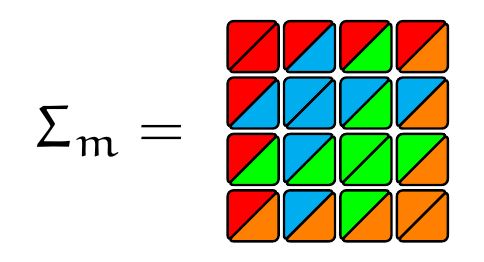

  * [matriz_covariancia.pgf](https://github.com/walmes/Tikz/blob/master/src/matriz_covariancia.pgf)

```tex
\newcommand{\upperTri}[2]{
  \draw [fill = #1, draw, rounded corners=1pt] (0, 0) |- (0.3, 0.3) -- cycle;
  \draw [fill = #2, draw, rounded corners=1pt] (0, 0) -| (0.3, 0.3) -- cycle;
}

\begin{tikzpicture}[
  node distance=0.3cm,
  mtn/.style={
    matrix of nodes,
    column sep = 0.5pt, 
    row sep = 0.5pt
  },
  ]

  \matrix[mtn] (Y) {%
    \upperTri{red}{red}; &
    \upperTri{red}{cyan}; &
    \upperTri{red}{green}; &
    \upperTri{red}{orange}; \\
    \upperTri{red}{cyan}; &
    \upperTri{cyan}{cyan}; &
    \upperTri{cyan}{green}; &
    \upperTri{cyan}{orange}; \\
    \upperTri{red}{green}; &
    \upperTri{cyan}{green}; &
    \upperTri{green}{green}; &
    \upperTri{green}{orange}; \\
    \upperTri{red}{orange}; &
    \upperTri{cyan}{orange}; &
    \upperTri{green}{orange}; &
    \upperTri{orange}{orange}; \\
  };

  \node [left=0cm of Y] {$\Sigma_m =$};%

\end{tikzpicture}
```
****

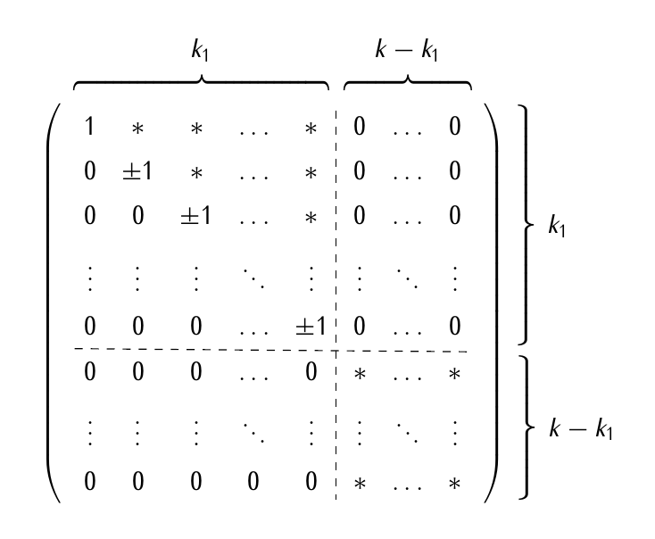

  * [matriz-particionada.pgf](https://github.com/walmes/Tikz/blob/master/src/matriz-particionada.pgf)

```tex
% https://tex.stackexchange.com/questions/431119/matrix-in-tikz-and-equation
\begin{tikzpicture}[
  baseline,
  label distance=10pt % added
]

\matrix [matrix of math nodes,left delimiter=(,right delimiter=),row sep=0.1cm,column sep=0.1cm] (m) {
      1 & *     &   *  & \dots & *   & 0 & \dots & 0 \\
      0 & \pm 1 &   *  & \dots & *   & 0 & \dots & 0 \\
      0 & 0     &\pm 1 & \dots & *   & 0 & \dots & 0 \\
      \vdots & \vdots & \vdots & \ddots & \vdots & \vdots & \ddots & \vdots\\
        0 &  0    & 0    &   \dots   &\pm 1& 0 & \dots & 0 \\
        0 &  0    & 0    &  \dots   & 0  & * & \dots & * \\
      \vdots & \vdots & \vdots & \ddots & \vdots & \vdots & \ddots & \vdots\\
      0 &  0    & 0    &   0   & 0   & * & \dots & *\\ };

\draw[dashed] ($0.5*(m-1-5.north east)+0.5*(m-1-6.north west)$) -- ($0.5*(m-8-6.south east)+0.5*(m-8-5.south west)$);

\draw[dashed] ($0.5*(m-5-1.south west)+0.5*(m-6-1.north west)$) -- ($0.5*(m-5-8.south east)+0.5*(m-6-8.north east)$);

\node[
  fit=(m-1-1)(m-1-5),
  inner xsep=0,
  above delimiter=\{,
  label=above:$k_1$
] {};

\node[
  fit=(m-1-6)(m-1-8),
  inner xsep=0,
  above delimiter=\{,
  label=above:$k-k_1$
 ] {};

\node[
  fit=(m-1-8)(m-5-8),
  inner xsep=15pt,inner ysep=0,
  right delimiter=\},
  label=right:$k_1$
] {};

\node[
  fit=(m-6-8)(m-8-8),
  inner xsep=15pt,inner ysep=0,
  right delimiter=\},
  label=right:$k-k_1$
] {};

\end{tikzpicture} 
```
****

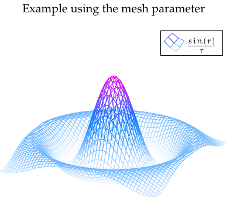

  * [mesh_3d.pgf](https://github.com/walmes/Tikz/blob/master/src/mesh_3d.pgf)

```tex
% https://www.sharelatex.com/learn/Pgfplots_package

\begin{tikzpicture}
  \begin{axis}[
    title=Example using the mesh parameter,
    hide axis,
    colormap/cool]
    \addplot3[mesh, samples=50, domain=-8:8]
      {sin(deg(sqrt(x^2+y^2)))/sqrt(x^2+y^2)};
    \addlegendentry{$\frac{sin(r)}{r}$}
  \end{axis}
\end{tikzpicture}
```
****

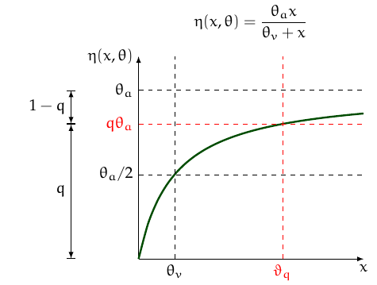

  * [michaelis_menten.pgf](https://github.com/walmes/Tikz/blob/master/src/michaelis_menten.pgf)

```tex
\def\xs{1}
\def\ys{1.5}
\def\A{2.5}
\def\V{0.8}
\def\q{0.8}
\def\dx{-1.5}

\begin{tikzpicture}[domain=0:5, xscale=\xs, yscale=\ys, >=latex]
  \begin{scope}
    \draw[->] (0,0) -- (5,0) node[below] {$x$};
    \draw[->] (0,0) -- (0,3) node[left] {$\eta(x,\theta)$};
    \draw[color=green!30!black, very thick, smooth]
      plot[id=x, domain=0:5]
      function{\A*x/(\V+x)};
    \draw[dashed] (0,\A)
      node[left] {$\theta_a$} -- (5,\A);
    \draw[dashed] (\V,0)
      node[below] {$\theta_v$} -- ++(0,3);
    \draw[dashed, color=red] (0,\q*\A)
      node[left] {$q\theta_a$} -- (5,\q*\A);
    \draw[dashed] (0,0.5*\A)
      node[left] {$\theta_a/2$} -- (5,0.5*\A);
    \draw[dashed, color=red] (\V+2.4,0)
      node[below] {$\vartheta_q$} -- ++(0,3);
    \draw[|<->|] (\dx,0) -- (\dx,\q*\A)
      node[midway, left] {$q$};
    \draw[|<->|] (\dx,\q*\A) -- (\dx,\A)
      node[midway, left] {$1-q$};
    \node at (2.5,3.5)
      {$\eta(x,\theta) =
        \displaystyle\frac{\theta_a x}{\theta_v +x}$};
  \end{scope}
\end{tikzpicture}
```
****

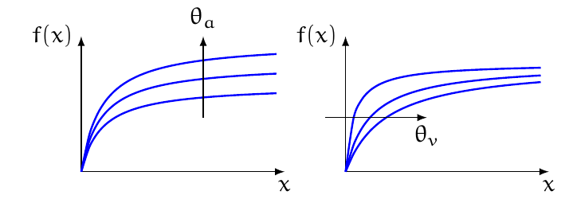

  * [michaelis_menten2.pgf](https://github.com/walmes/Tikz/blob/master/src/michaelis_menten2.pgf)

```tex
\def\xs{0.6}
\def\ys{0.8}

\def\thetaA{2}
\def\thetaV{0.5}


\begin{tikzpicture}[xscale=\xs, yscale=\ys, >=latex]
  \begin{scope}
    \draw[->] (0,0) -- (5,0) node[below] {$x$};
    \draw[->] (0,0) -- (0,2.5) node[left] {$f(x)$};
    \foreach \thetaAA in {1.6,2,2.4}
    \draw[color=blue, thick, smooth]
      plot[id=x, domain=0:4.8]
      function{\thetaAA * x/(\thetaV + x)};
    \draw[->] (3, 1) -- +(0, 1.5)
      node[above] {$\theta_a$};
  \end{scope}

  \begin{scope}[xshift=6.5cm]
    \draw[->] (0,0) -- (5,0) node[below] {$x$};
    \draw[->] (0,0) -- (0,2.5) node[left] {$f(x)$};
    \foreach \thetaVV in {0.2,0.6,1}
    \draw[color=blue, thick, smooth]
      plot[id=x, domain=0:4.8]
      function{\thetaA * x/(\thetaVV + x)};
    \draw[->] (-0.5, 1) -- +(2.5, 0)
      node[below] {$\theta_v$};
  \end{scope}
\end{tikzpicture}
```
****

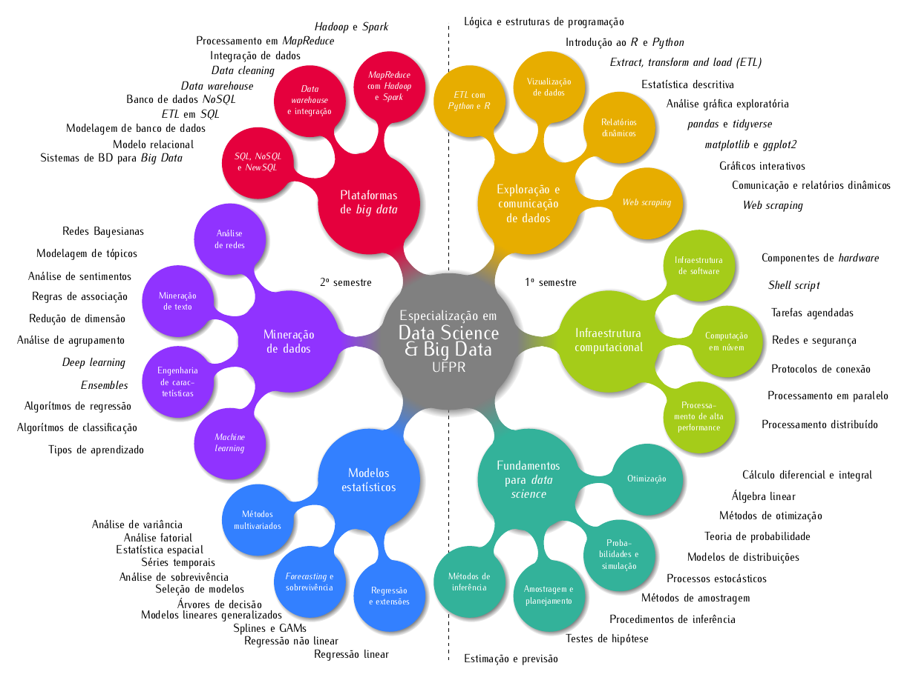

  * [mindmap-dsbd.pgf](https://github.com/walmes/Tikz/blob/master/src/mindmap-dsbd.pgf)

```tex
% To write mode detais next each circle.
\newcommand*{\info}[4][16.3]{%
  \node [annotation, #3, text width = #1em, inner sep = 1mm, draw] at (#2) {%
    \list{\tiny$\triangleright$}{
      \topsep=0pt
      \itemsep=0pt
      \parsep=0pt
      \parskip=0pt
      \labelwidth=8pt
      \leftmargin=8pt
      \itemindent=0pt
      \labelsep=2pt}%
    #4
    \endlist
  };
}%
% A boolean variable.
\newif\ifshow % Creates boolean variable.
\showtrue     % Set its value.
% The draw.
\begin{tikzpicture}

  % Paleta: http://www.perbang.dk/rgb/E5003D/
  \definecolor{color1}{HTML}{E7AD00}
  \definecolor{color2}{HTML}{A5CC19}
  \definecolor{color3}{HTML}{33B29A}
  \definecolor{color4}{HTML}{3380FF}
  \definecolor{color5}{HTML}{9033FF}
  \definecolor{color6}{HTML}{E5003D}

  \draw [dashed] (0, -27em) -- (0, 27em);
  \node at (30:10em) {1\textsuperscript{o} semestre};
  \node at (150:10em) {2\textsuperscript{o} semestre};

  \path[mindmap,
  concept color = gray,
  text = white,
  every node/.style = {concept, circular drop shadow, color = white},
  level 1 concept/.append style = {
    level distance = 13.5em,
    minimum size = 8.5em,
    inner sep = 2pt,
    font = \fontsize{11pt}{12pt}\selectfont},
  level 2 concept/.append style = {
    level distance = 10em,
    minimum size = 5.95em,
    sibling angle = 40},
  ]

  node [concept] {
    Especializa\c{c}\~{a}o em\\
    {\LARGE Data Science \& Big Data}\\
    UFPR} [clockwise from = 60]
  %------------------------------------------
  child [concept color = color1, black] {
%     node [concept] {Linguagens de\\ programa{\c c}{\~a}o} [clockwise from = -120]
    node [concept] {Explora{\c c}{\~a}o e comunica{\c c}{\~a}o de dados} [clockwise from = 120]
%     node [concept] {Compreens{\~a}o e comunica{\c c}{\~a}o de dados} [clockwise from = -120]
%     node [concept] {Descoberta e comunica{\c c}{\~a}o de dados} [clockwise from = -120]
    \ifshow
    child {
      node [concept] (pyprg) {\textit{ETL} com \textit{Python} e \textit{R}}
    }
    child {
      node [concept] (rprog) {Vizualiza{\c c}{\~a}o de dados}
    }
    child {
      node [concept] (manip) {Relat{\'o}rios din{\^a}micos}
    }
    child {
      node [concept] (manip) {\textit{Web scraping}}
    }
    \fi
  }
  %------------------------------------------
  child [concept color = color2, text = black] {
    node [concept] {Infraestrutura\\ computacional} [clockwise from = 40]
    \ifshow
    child {
      node [concept] {Infra\-estrutura de software}
    }
    child {
      node [concept] {Computa{\c c}{\~a}o em n{\'u}vem}
    }
    child {
      node [concept] {Processa\-mento de alta performance}
%       node [concept] {Computa{\c c}{\~ a}o de alta\\ performance}
    }
    \fi
  }
  %------------------------------------------
  child [concept color = color3, text = black] {
    node [concept] {Fundamentos para \textit{data science}} [clockwise from = 0]
    \ifshow
    child {
      node [concept] {Otimiza{\c c}{\~a}o}
    }
    child {
      node [concept] {Proba\-bilidades e simula{\c c}{\~a}o}
      % Processos estocasticos? Resampling methods?
    }
    child {
      node [concept] {Amostragem e\\ planejamento}
    }
    child {
%       node [concept] {\textit{Statistical learning} e m{\'e}todos de infer{\^e}ncia}
      node [concept] {M{\'e}todos de infer{\^e}ncia}
    }
    \fi
  }
  %------------------------------------------
  child [concept color = color4, text = black] {
    node [concept] {Modelos estat{\'\i}sticos} [clockwise from = -80]
    \ifshow
    child {
%       node [concept] {Regress{\~ a}o linear, não linear e extens{\~o}es}
      node [concept] {Regress{\~ a}o e extens{\~o}es}
    }
    child {
%       node [concept] {S{\' e}ries temporais e confiabilidade}
      node [concept] {\textit{Forecasting} e sobreviv{\^ e}ncia}
    }
    child {
%       node [concept] {Modelos preditivos e t{\' o}picos avan{\c c}ados}
      node [concept] {M{\' e}todos multivariados}
      % Modelo não lineares ou smooth.
      % Métodos multivariados.
    }
    \fi
  }
  %------------------------------------------
  child [concept color = color5, text = black] {
    node [concept] {Minera{\c c}{\~a}o de dados} [clockwise from = -120]
    \ifshow
    child {
      node [concept] {\textit{Machine learning}}
    }
    child {
      node [concept] {Engenharia de caractet{\'\i}sticas}
    }
    child {
      node [concept] {Minera{\c c}{\~a}o de texto}
    }
    child {
      node [concept] {An{\'a}lise de redes}
    }
    \fi
  }
  %------------------------------------------
  child [concept color = color6, text = black] {
    node [concept] {Plataformas de \textit{big data}} [clockwise from = 160]
    \ifshow
    child {
      node [concept] {\textit{SQL}, \textit{NoSQL} e \textit{NewSQL}}
    }
%     child {
%       node [concept] {\textit{Data cleaning}}
%     }
    child {
      node [concept] {\textit{Data warehouse} e integra{\c c}{\~a}o}
    }
    child {
      node [concept] {\textit{MapReduce} com \textit{Hadoop} e \textit{Spark}}
    }
    \fi
  }
  %------------------------------------------
  ; % <-- ATTENTION.

  % \info[7]{pyprg.west}{anchor = east}{%
  % \item Fundamentos da linguagem
  % \item Programa{\c c}{\~a}o com Numpy
  % \item Importa{\c c}{\~a}o de dados
  % }
  %   \info[7]{rprog.west}{anchor = east}{%
  % \item Fundamentos da linguagem
  % \item Programa{\c c}{\~a}o funcional
  % \item Importa{\c c}{\~a}o de dados
  % }
  %   \info[7]{manip.west}{anchor = east}{%
  %     % \item[] Seit 2008
  % \item Pandas e Matplotlib
  % \item Tidyverse e Ggplot
  % \item Gr{\' a}ficos interativos
  % }

%   \draw [color = gray!40] circle (27em);

% \draw[>->, >=latex] (0, 26.75em) [draw, color = gray, thick] arc (90:-265:26.75em);

\node at (88.000:27em) [anchor = west] {L{\'o}gica e estruturas de programa{\c c}{\~a}o};
\node at (69.277:27em) [anchor = west] {Introdu{\c c}{\~a}o ao \textit{R} e \textit{Python}};
\node at (60.601:27em) [anchor = west] {\textit{Extract, transform and load (ETL)}};
\node at (53.817:27em) [anchor = west] {Estat{\'\i}stica descritiva};
\node at (47.992:27em) [anchor = west] {An{\'a}lise gr{\'a}fica explorat{\'o}ria};
\node at (42.763:27em) [anchor = west] {\textit{pandas} e \textit{tidyverse}};
\node at (37.943:27em) [anchor = west] {\textit{matplotlib} e \textit{ggplot2}};
\node at (33.421:27em) [anchor = west] {Gr{\'a}ficos interativos};
\node at (29.124:27em) [anchor = west] {Comunica{\c c}{\~a}o e relat{\'o}rios din{\^a}micos};
\node at (25.000:27em) [anchor = west] {\textit{Web scraping}};
\node at (15.000:27em) [anchor = west] {Sistemas de alto desempenho};
\node at (9.936:27em) [anchor = west] {Linhas de comando};
\node at (4.949:27em) [anchor = west] {Tarefas agendadas};
\node at (0.000:27em) [anchor = west] {Redes e seguran{\c c}a};
\node at (-4.949:27em) [anchor = west] {Protocolos de conex{\~a}o};
\node at (-9.936:27em) [anchor = west] {Processamento em paralelo};
\node at (-15.000:27em) [anchor = west] {Processamento distribu{\'\i}do};
\node at (-25.000:27em) [anchor = west] {C{\'a}lculo diferencial e integral};
\node at (-29.124:27em) [anchor = west] {{\'A}lgebra linear};
\node at (-33.421:27em) [anchor = west] {M{\'e}todos de otimiza{\c c}{\~a}o};
\node at (-37.943:27em) [anchor = west] {Teoria de probabilidade};
\node at (-42.763:27em) [anchor = west] {Modelos de distribui{\c c}{\~o}es};
\node at (-47.992:27em) [anchor = west] {Processos estoc{\'a}sticos};
\node at (-53.817:27em) [anchor = west] {M{\'e}todos de amostragem};
\node at (-60.601:27em) [anchor = west] {Procedimentos de infer{\^e}ncia};
\node at (-69.277:27em) [anchor = west] {Testes de hip{\'o}tese};
\node at (-88.000:27em) [anchor = west] {Estima{\c c}{\~a}o e previs{\~a}o};
\node at (215.000:27em) [anchor = east] {An{\'a}lise de vari{\^a}ncia};
\node at (217.930:27em) [anchor = east] {An{\'a}lise fatorial};
\node at (220.982:27em) [anchor = east] {Estat{\'\i}stica espacial};
\node at (224.182:27em) [anchor = east] {S{\'e}ries temporais};
\node at (227.567:27em) [anchor = east] {An{\'a}lise de sobreviv{\^e}ncia};
\node at (231.187:27em) [anchor = east] {Sele{\c c}{\~a}o de modelos};
\node at (235.116:27em) [anchor = east] {{\'A}rvores de decis{\~a}o};
\node at (239.478:27em) [anchor = east] {Modelos lineares generalizados};
\node at (244.497:27em) [anchor = east] {Splines e GAMs};
\node at (250.680:27em) [anchor = east] {Regress{\~a}o n{\~a}o linear};
\node at (260.000:27em) [anchor = east] {Regress{\~a}o linear};
\node at (160.000:27em) [anchor = east] {Redes Bayesianas};
\node at (164.120:27em) [anchor = east] {Modelagem de t{\'o}picos};
\node at (168.158:27em) [anchor = east] {An{\'a}lise de sentimentos};
\node at (172.137:27em) [anchor = east] {Regras de associa{\c c}{\~a}o};
\node at (176.078:27em) [anchor = east] {Redu{\c c}{\~a}o de dimens{\~a}o};
\node at (180.000:27em) [anchor = east] {An{\'a}lise de agrupamento};
\node at (183.922:27em) [anchor = east] {\textit{Deep learning}};
\node at (187.863:27em) [anchor = east] {\textit{Ensembles}};
\node at (191.842:27em) [anchor = east] {Algor{\'\i}tmos de regress{\~a}o};
\node at (195.880:27em) [anchor = east] {Algor{\'\i}tmos de classifica{\c c}{\~a}o};
\node at (200.000:27em) [anchor = east] {Tipos de aprendizado};
\node at (100.000:27em) [anchor = east] {\textit{Hadoop} e \textit{Spark}};
\node at (110.096:27em) [anchor = east] {Processamento em \textit{MapReduce}};
\node at (116.693:27em) [anchor = east] {Integra{\c c}{\~a}o de dados};
\node at (122.034:27em) [anchor = east] {\textit{Data cleaning}};
\node at (126.675:27em) [anchor = east] {\textit{Data warehouse}};
\node at (130.857:27em) [anchor = east] {Banco de dados \textit{NoSQL}};
\node at (134.712:27em) [anchor = east] {\textit{ETL} em \textit{SQL}};
\node at (138.321:27em) [anchor = east] {Modelagem de banco de dados};
\node at (141.737:27em) [anchor = east] {Modelo relacional};
\node at (145.000:27em) [anchor = east] {Sistemas de BD para \textit{Big Data}};

\end{tikzpicture}
```
****

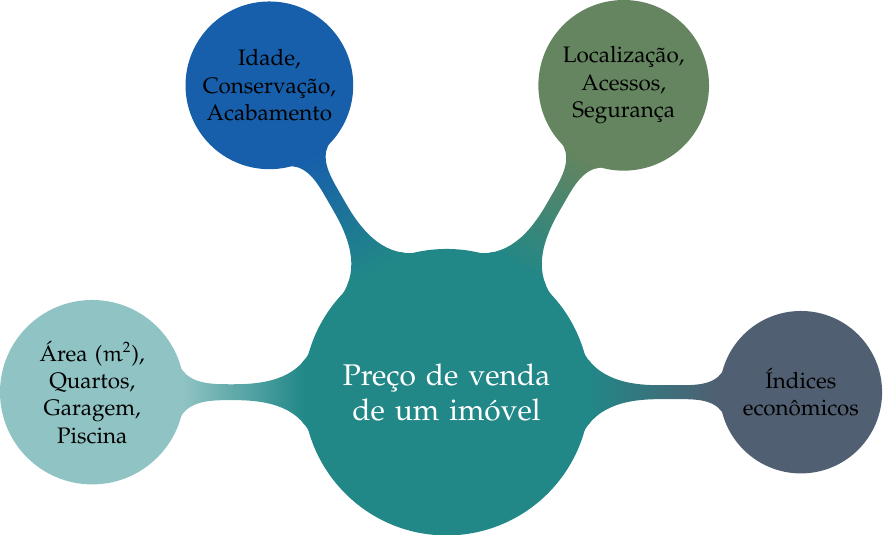

  * [mindmapImovel.pgf](https://github.com/walmes/Tikz/blob/master/src/mindmapImovel.pgf)

```tex
\begin{tikzpicture}
  \path[mindmap, concept color=darkgreen, text=white]
  node[concept] {Pre\c{c}o de venda de um im\'ovel} [clockwise from=180]
  child[concept color=darkgreen!50, black] {
    node[concept] {\'{A}rea ($m^2$), Quartos, Garagem, Piscina}
  }
  child[concept color=darkgreen!70!blue, black] {
    node[concept] {Idade, Conserva\c{c}\~ao, Acabamento}
  }
  child[concept color=darkgreen!70!orange, black] {
    node[concept] {Localiza\c{c}\~ao, Acessos, Seguran\c{c}a}
  }
  child[concept color=darkgreen!70!purple, black] {
    node[concept] {\'{I}ndices econ\^omicos}
  };
\end{tikzpicture}
```
****

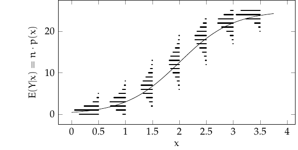

  * [modelo_binomial.pgf](https://github.com/walmes/Tikz/blob/master/src/modelo_binomial.pgf)

```tex
\def\hscale{-1.2}%
\def\size{25}%
\def\bzero{4}%
\def\bone{-2}%

\newcommand*{\ListXYvalues}{0.5, 1, 1.5, 2, 2.5, 3, 3.5}%
\newcommand*\pgfplotsinvokeforeachmacro[1]{%
  \expandafter\pgfplotsinvokeforeach\expandafter{#1}}%

\tikzset{%
  declare function={
    binompf(\k,\n,\p)=\n!/(\k!*(\n-\k)!)*\p^\k*(1-\p)^(\n-\k);
  },
  declare function={
    eta(\x,\bzero,\bone)=1/(1+exp(\bzero+\bone*\x));
  },
  hplot/.style={ycomb, mark=o, samples at={0,1,...,20}},
  vplot/.style={
    xcomb, no marks,
    very thick, line cap=round,
  },
  >=stealth,
  cx/.style={fill=white, font=\footnotesize},
  pth/.style={draw, ->, color=darkgreen},
  halves/.style={samples=30, fill opacity=0.5, draw=none}
}%

\pgfplotsset{%
  my plot/.code args={#1}{%
    \addplot [
      vplot,
      restrict x to domain=-1:-0.005,
      samples at={0, 1, ..., \size},
      shift={(axis direction cs: #1, 0)},
    ] ({\hscale*binompf(x, \size, 1/(1+exp(\bzero+\bone*#1)))}, x);
  }
}%

\begin{tikzpicture}%
  \begin{axis}[
    clip = false,
    width=7cm, height=7cm,
    xlabel=$x$,
%     ylabel={$\text{E}(Y|x) = n\cdot p(x)$},
    ylabel={$y$},
    xmin=-0.25]

    \addplot[domain=0:3.75, samples=30, smooth, orange, very thick]
      (x, {\size*eta(x, \bzero, \bone)});
    \pgfplotsinvokeforeachmacro\ListXYvalues{
      \pgfplotsset{my plot={#1}}
    }

  \foreach \x in {0.5, 1, ..., 3.5}{
    \edef\temp{
      \noexpand
      \draw [dotted, thin, gray] (\x, 0) -- (\x, \size);
    }
    \temp
  }

  \path[draw] (2, 30)
    node {\small $Y|x \sim \text{binomial}(n, p(x))$}
    edge[<-, out=-90, in=180] (1.75, 12.5);

  \end{axis}

\end{tikzpicture}%
```
****

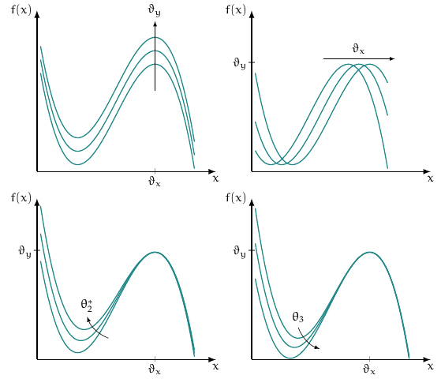

  * [modelo_cubico_rep.pgf](https://github.com/walmes/Tikz/blob/master/src/modelo_cubico_rep.pgf)

```tex
\def\xs{1}
\def\ys{1.5}

\begin{tikzpicture}[domain=0:5, xscale=\xs, yscale=\ys, >=latex]
  \def\ty{2}
  \def\tx{3.3}
  \def\tc{-1.2}
  \def\ta{-0.37}

  \draw[->, line width=1pt] (0,0) -- (5,0) node[below] {$x$};
  \draw[->, line width=1pt] (0,0) -- (0,3) node[left] {$f(x)$};
  \foreach \tty in {2,2.25,2.5}
  \draw[color=darkgreen, thick, smooth, samples=100]
    plot[id=x, domain=0.1:4.4]
    function{\tty+\tc*(x-\tx)**2+\ta*(x-\tx)**3};
  \draw[->,xshift=\tx cm] (0,1.5) -- (0,2.8)
    node[above] {$\vartheta_y$};
  \draw (\tx,0) node {\tiny $|$} node[below] {$\vartheta_x$};

  \begin{scope}[xshift=6cm]
    \draw[->, line width=1pt] (0,0) -- (5,0) node[below] {$x$};
    \draw[->, line width=1pt] (0,0) -- (0,3) node[left] {$f(x)$};
    \foreach \ttx in {2.7,3,3.3}
    \draw[color=darkgreen, thick, smooth, samples=100]
      plot[id=x, domain=0.1:3.8]
      function{\ty+\tc*(x-\ttx)**2+\ta*(x-\ttx)**3};
    \draw[->,xshift=2cm,yshift=0.1cm] (0,\ty) -- (2,\ty)
      node[midway,above] {$\vartheta_x$};
    \draw (0, \ty) node {--} node[left] {$\vartheta_y$};
  \end{scope}

  \begin{scope}[yshift=-3.5cm]
    \draw[->, line width=1pt] (0,0) -- (5,0) node[below] {$x$};
    \draw[->, line width=1pt] (0,0) -- (0,3) node[left] {$f(x)$};
    \foreach \ttc in {-1.1,-1.15,-1.2}
    \draw[color=darkgreen, thick, smooth, samples=100]
      plot[id=x, domain=0.1:4.4]
      function{\ty+\ttc*(x-\tx)**2+\ta*(x-\tx)**3};
    \draw[->,xscale=1/\xs, yscale=1/\ys] (2.0,0.6) arc (250:200:1cm)
      node[above] {$\theta_2^{*}$};
    \draw (0, \ty) node {--} node[left] {$\vartheta_y$};
    \draw (\tx,0) node {\tiny $|$} node[below] {$\vartheta_x$};
  \end{scope}

  \begin{scope}[yshift=-3.5cm, xshift=6cm]
    \draw[->, line width=1pt] (0,0) -- (5,0) node[below] {$x$};
    \draw[->, line width=1pt] (0,0) -- (0,3) node[left] {$f(x)$};
    \foreach \tta in {-0.36,-0.38,-0.40}
    \draw[color=darkgreen, thick, smooth, samples=100]
      plot[id=x, domain=0.1:4.4]
      function{\ty+\tc*(x-\tx)**2+\tta*(x-\tx)**3};
    \draw (0, \ty) node {--} node[left] {$\vartheta_y$};
    \draw[<-,xscale=1/\xs, yscale=1/\ys] (1.9,0.3) arc (250:200:1cm)
      node[above] {$\theta_3$};
    \draw (\tx,0) node {\tiny $|$} node[below] {$\vartheta_x$};
  \end{scope}

\end{tikzpicture}
```
****

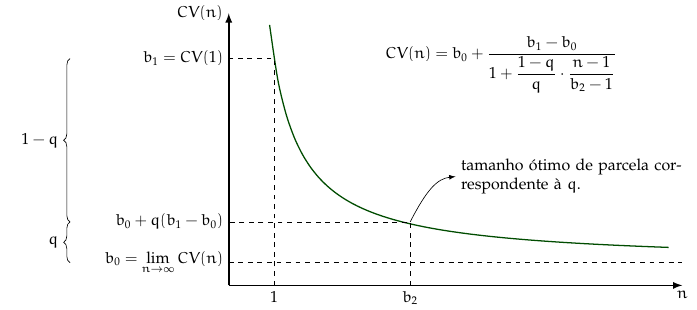

  * [modelo_decaimento_CV.pgf](https://github.com/walmes/Tikz/blob/master/src/modelo_decaimento_CV.pgf)

```tex
\def\bzero{0.1}
\def\bum{1}
\def\boti{4}
\def\dd{-3.5}

\begin{tikzpicture}[domain=1:8, xscale=1, yscale=5, >=latex]
  \draw[->, line width=1pt] (0,0) -- (10,0) node[below] {$n$};
  \draw[->, line width=1pt] (0,0) -- (0,1.2) node[left] {$CV(n)$};
  \draw[color=green!30!black, thick, smooth, samples=50]
    plot[id=x, domain=0.9:9.7]
    function{\bzero+(\bum-\bzero)/(1+((1-0.15)/0.15)*((x-1)/\boti))};
  \draw[dashed] (1,0) node[below] {$1$} |- (0,\bum)
    node[left] {$b_1 = CV(1)$};
  \draw[dashed] (0,\bzero) node[left]
    {$b_0 = \displaystyle\lim_{n\to\infty} CV(n)$} -- (10,\bzero);
  \draw[dashed] (\boti,0) node[below] {$b_2$} |- (0,0.28)
    node[left] {$b_0+q(b_1-b_0)$};
  \draw [decorate, decoration={brace,amplitude=4pt}]
    (\dd,0.1) -- (\dd,0.28) node [black,midway,left=4pt] {$q$};
  \draw [decorate, decoration={brace,amplitude=4pt}]
    (\dd,0.28) -- (\dd,1) node [black,midway,left=4pt] {$1-q$};
  \node[anchor=base, fill=white] (vg) at (6,1)
    {$\displaystyle CV(n) = b_0+\frac{b_1-b_0}{
        1+\displaystyle\frac{1-q}{q}\cdot\frac{n-1}{b_2-1}}$};
  \path[->] (\boti,0.28) edge[bend left=10]
    node [at end,right,fill=white, text width=5cm, text ragged]
    {tamanho {\'o}timo de parcela correspondente {\`a} $q$.} ++(1,0.2);
\end{tikzpicture}
```
****

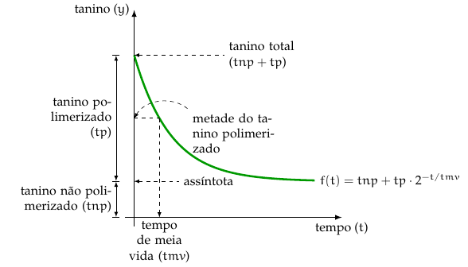

  * [modelo_decaimento.pgf](https://github.com/walmes/Tikz/blob/master/src/modelo_decaimento.pgf)

```tex
% http://stackoverflow.com/questions/2701902/standalone-diagrams-with-tikz
\def\ptsize{0.75pt}%
\tikzset{
  mypoints/.style={fill=white,draw=black},
  pil/.style={->, shorten <=2pt, shorten >=2pt}
}%
\begin{tikzpicture}[>=latex, xscale=5, yscale=5]
  \def\thetah{0.3}; \def\thetac{5.6}; %\def\thetac{-2.8}
  \draw[->, thick] (-0.05,0) -- +(1.2,0) node[below] {tempo ($t$)};
  \draw[->, thick] (0,-0.05) -- +(0,1.2) node[left] {tanino ($y$)};
  \def\bet{0.2}
  \def\alp{0.7}
  \def\v{0.14}
  \draw[-, color=green!60!black, ultra thick, samples=100]
    plot[id=x, domain=0:1]  
    function{\bet+\alp*2**(-x/\v)}
    node[color=black, right] {$f(t) = tnp+tp \cdot 2^{-t/\theta_{tmv}}$};
  \draw[|<->|] (-0.1,\bet) -- (-0.1,0.9)
    node[midway, left, text width=2cm, text ragged left]
    {tanino\\ polimerizado\\ ($\theta_{tp}$)};
  \draw[|<->|] (-0.1,0) -- (-0.1,\bet)
    node[midway, left, text width=3.2cm, text ragged left]
    {tanino n\~{a}o\\ polimerizado ($\theta_{tnp}$)};
  \draw[<-, dashed] (0,\bet) -- +(0.18,0) node[right, text width=2cm] {ass\'intota\\ inferior};
  \draw[<-, dashed] (0,\bet+\alp) -- +(0.5,0)
    node[right, text width=2cm] {tanino total\\ ($\theta_{tnp}+\theta_{tp}$)};
  \draw[->,dashed] (\v,\bet+0.5*\alp) -- (\v,0)
    node[below, text width=2cm, text centered]
    {tempo de meia vida ($\theta_{tmv}$)};
  \draw[dashed] (0,\bet+0.5*\alp) -- +(\v,0);
  \coordinate (a1) at (0.3,0.6);
  \path[<-, dashed] (0,\bet+0.5*\alp) edge[bend left=50] (a1);
  \node[below right, text width=3.25cm] at (a1)
    {metade do tanino polimerizado};
\end{tikzpicture}%
```
****

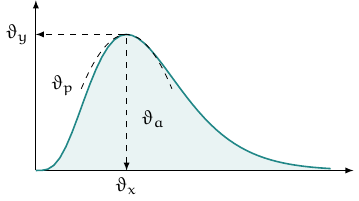

  * [modelo_lactacao_rep.pgf](https://github.com/walmes/Tikz/blob/master/src/modelo_lactacao_rep.pgf)

```tex
\begin{tikzpicture}[xscale=4, yscale=3, >=latex,  domain=0:1.3]
  \def\vy{0.8}; \def\vx{0.4}; \def\th{4}
  \filldraw[-, color=darkgreen!10, samples=50] plot[id=x]
    function{\vy*(x/\vx)**\th*exp(\th*(1-x/\vx))} -- (1.3,0);
  \draw[->] (0,0) -- (1.4,0);
  \draw[->] (0,0) -- (0,1);
  \draw[-, color=darkgreen, thick, samples=50] plot[id=x]
    function{\vy*(x/\vx)**\th*exp(\th*(1-x/\vx))};
  \draw[<->,dashed] (\vx,0) |- (0,\vy);
  \draw[dashed, color=black, smooth] plot[id=x, domain=0.2:0.6]
    function{\vy-8*(x-\vx)**2};
  \node[left] at (\vx-0.2, \vy-0.3) {$\vartheta_p$};
  \node[left] at (0,\vy) {$\vartheta_y$};
  \node[below] at (\vx,0) {$\vartheta_x$};
  \node[left] at (\vx+0.2,\vy-0.5) {$\vartheta_a$};
\end{tikzpicture}
```
****

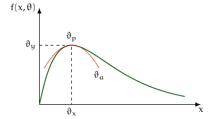

  * [modelo_lactacao.pgf](https://github.com/walmes/Tikz/blob/master/src/modelo_lactacao.pgf)

```tex
\def\bz{5}
\def\bo{1}
\def\bt{1}

\begin{tikzpicture}[domain=-3:5, xscale=1.2, yscale=1.2, >=latex]
  \draw[->, line width=1pt] (0,0) -- (5,0) node[below] {$x$};
  \draw[->, line width=1pt] (0,0) -- (0,3) node[left] {$f(x,\theta)$};
  \draw[color=green!30!black, thick, smooth]
    plot[id=x, domain=0:4.5]
    function{\bz*x**\bo*exp(-\bt*x)};
  \draw[dashed] (0, 1.85) node[left] {$\vartheta_y$} -| (\bo/\bt,0)
    node[below] {$\vartheta_x$};
  \draw[color=red!90!black, smooth]
    plot[id=x, domain=0.15:1.85]
    function{1.85-1*(x-\bo/\bt)**2}
    node[below, color=black] {$\vartheta_a$};
  \node[above] at (1, 1.85) {$\vartheta_p$};
\end{tikzpicture}
```
****

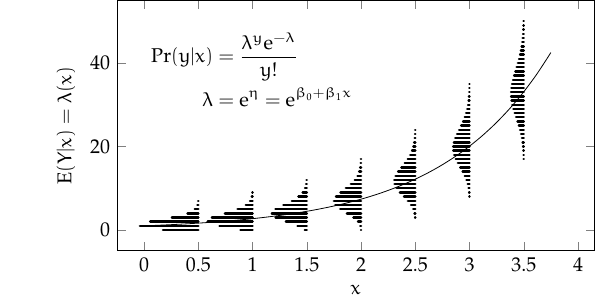

  * [modelo_poisson.pgf](https://github.com/walmes/Tikz/blob/master/src/modelo_poisson.pgf)

```tex
\def\hscale{-1.7}
\def\size{50}
\def\bzero{0}
\def\bone{1}

\newcommand*{\ListXYvalues}{0.5, 1, 1.5, 2, 2.5, 3, 3.5}
\newcommand*\pgfplotsinvokeforeachmacro[1]{
  \expandafter\pgfplotsinvokeforeach\expandafter{#1}}

\tikzset{
  declare function={
    poispf(\k,\l)=exp(-\l)*(\l^\k)/(\k!);
  },
  declare function={
    eta(\x,\bzero,\bone)=exp(\bzero+\bone*\x);
  },
  vplot/.style={
    xcomb, no marks,
    very thick, line cap=round,
  },
  >=stealth,
  cx/.style={fill=white, font=\footnotesize},
  pth/.style={draw, ->, color=darkgreen},
  halves/.style={samples=30, fill opacity=0.5, draw=none}
}

\pgfplotsset{
  my plot/.code args={#1}{%
    \addplot [
      vplot, restrict x to domain=-1:-0.001,
      samples at={0,1,...,\size},
      shift={(axis direction cs: #1, 0)},
    ] ({\hscale*poispf(x, exp(\bzero+\bone*#1))}, x);
  }
}

\begin{tikzpicture}
  \begin{axis}[
    width=10cm, height=6cm,
    xlabel=$x$,
    ylabel={$\text{E}(Y|x) = \lambda(x)$},
    xmin=-0.25]

    \addplot[domain=0:3.75, samples=30, smooth]
      (x, {eta(x, \bzero, \bone)});
    \node[anchor=north west]
    at (axis description cs: 0.05, 0.9){% <- importante!
      $\begin{aligned}
        \Pr(y|x) &= \dfrac{\lambda^y\text{e}^{-\lambda}}{y!}\\
        \lambda &= \text{e}^\eta = \text{e}^{\beta_0+\beta_1 x}
      \end{aligned}$
    };
    \pgfplotsinvokeforeachmacro\ListXYvalues{
      \pgfplotsset{my plot={#1}}
    }

  \end{axis}
\end{tikzpicture}
```
****

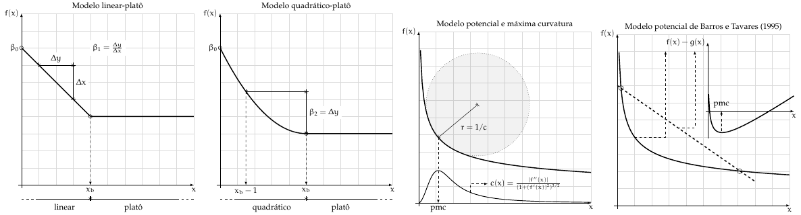

  * [modelo_tamanho_aamostra.pgf](https://github.com/walmes/Tikz/blob/master/src/modelo_tamanho_aamostra.pgf)

```tex
\tikzset{
  aponta/.style={-latex, dashed},
  eixos/.style={-latex},
  fun/.style={very thick}
}

\begin{tikzpicture}[domain=0:10, xscale=0.75, yscale=0.75]
  \draw[very thin,color=gray!30] (0,0) grid (10,10);
  \draw[eixos] (-0.2,0) -- (10,0) node[below] {$x$};
  \draw[-latex] (0,-0.2) -- (0,10) node[left] (E) {$f(x)$};
  \def\A{8}; \def\B{-1}; \def\C{4};
  \draw[fun]
    plot[id=x, samples=100] function{\A+\B*x*(x<\C)+\B*\C*(x>\C)};
  \coordinate (b) at (\C,\A+\B*\C);
  \draw (0,\A) circle (3pt) node[left] {$\beta_0$};
  \draw (b) circle (3pt);
  \draw[aponta] (b) -- (\C,0) node[below] {$x_b$};
  \draw[|<->|] (1,7) -- (3,7)
    node[midway, above, fill=white] {$\Delta y$};
  \draw[|<->|] (3,7) -- (3,5)
    node[midway, right, fill=white] {$\Delta x$};
  \node[fill=white] (b1) at (5,8)
    {$\beta_1 = \frac{\Delta y}{\Delta x}$};
  \def\desc{-0.8}
  \draw[->|] (1,\desc) -- (\C,\desc) node[midway, below=3pt] {linear};
  \draw[dashed] (0,\desc) -- (1,\desc);
  \draw[|<-] (\C,\desc) -- (9,\desc)
    node[midway, below=3pt] {plat{\^o}};
  \draw[dashed] (9,\desc) -- (10,\desc);
  \node[above] (titulo) at (5,10) {Modelo linear-plat{\^o}};
\end{tikzpicture}

\begin{tikzpicture}[domain=0:10, xscale=0.75, yscale=0.75]
  \draw[very thin,color=gray!30] (0,0) grid (10,10);
  \draw[eixos] (-0.2,0) -- (10,0) node[below] {$x$};
  \draw[-latex] (0,-0.2) -- (0,10) node[left] (E) {$f(x)$};
  \def\Y{3}; \def\X{5}; \def\C{0.2};
  \draw[fun] plot[id=x, samples=100] function{\Y+\C*(x-\X)**2*(x<\X)};
  \coordinate (b) at (\X,\Y);
  \draw (0,8) circle (3pt) node[left] {$\beta_0$};
  \draw (b) circle (3pt);
  \draw[aponta] (b) -- (\X,0) node[below] {$x_b$};
  \def\Xe{1.5}
  \coordinate (ye) at (\Xe,{\Y+\C*(\X-\Xe)^2});
  \draw[aponta] (ye) -- (\Xe,0) node[below] {$x_b-1$};
  \draw[|<->|] (ye) -- ++(\X-\Xe,0) node[midway, above, fill=white] {};
  \draw[|<->|] (\X,3) -- (\X,5.45)
    node[midway, right, fill=white] {$\beta_2 = \Delta y$};
  \def\desc{-0.8}
  \draw[->|] (1,\desc) -- (\X,\desc)
    node[midway, below=3pt] {quadr{\'a}tico};
  \draw[dashed] (0,\desc) -- (1,\desc);
  \draw[|<-] (\X,\desc) -- (9,\desc)
    node[midway, below=3pt] {plat{\^o}};
  \draw[dashed] (9,\desc) -- (10,\desc);
  \node[above] (titulo) at (5,10) {Modelo quadr{\'a}tico-plat{\^o}};
\end{tikzpicture}

\begin{tikzpicture}[domain=0:10, xscale=0.75, yscale=0.75]
  \draw[very thin,color=gray!30] (0,0) grid (10,10);
  \draw[eixos] (-0.2,0) -- (10,0) node[below] {$x$};
  \draw[-latex] (0,-0.2) -- (0,10) node[left] (E) {$f(x)$};
  \def\A{4}; \def\B{0.35};
  \draw[fun] plot[id=x, samples=100] function{\A*(x)**(-\B)};
  % \begin{scope}[yscale=1]
  %   \draw[fun, dashed]
  %     plot[id=x, samples=100]
  %     function{abs(-\A*\B*x**(-\B))/(1+(-\A*\B*(\B-1)*
  %       x**(-\B-2))**2)**(3/2)};
  %   \draw[fun, dashed]
  %     plot[id=x, samples=100]
  %     function{(abs(\A*(-\B)*(-\B-1)*x**(-\B-2)))/((1+(\A*(-\B)*
  %       x**(-\B-1))**2)**(3/2))};
  % \end{scope}
  \def\xmc{1.138}; \def\ymc{3.823}
  \draw[aponta] (\xmc,\ymc) -- (\xmc,0) node[below] {pmc}; 
  \coordinate (pmc) at (\xmc, \ymc);
  \begin{scope}[xshift=1pt, yshift=1pt]
    \draw[dotted, color=black, fill=gray, fill opacity=0.1]
      (pmc) arc (220:-135:3cm);
    \draw[|<->|] (pmc) -- ++(40:3)
      node [midway, below right] {$r=1/c$};
  \end{scope}
  \begin{scope}[yscale=5]
    \draw[thick] plot coordinates {
      (0.0526, 0.0046)
      (0.1053, 0.015)
      (0.1579, 0.0297)
      (0.2105, 0.0482)
      (0.2632, 0.0697)
      (0.3158, 0.0938)
      (0.3684, 0.1199)
      (0.4211, 0.1473)
      (0.4737, 0.1752)
      (0.5263, 0.2032)
      (0.5789, 0.2305)
      (0.6316, 0.2565)
      (0.6842, 0.2808)
      (0.7368, 0.3028)
      (0.7895, 0.3222)
      (0.8421, 0.3388)
      (0.8947, 0.3525)
      (0.9474, 0.3633)
      (1, 0.3711)
      (1, 0.3711)
      (1.069, 0.3773)
      (1.1379, 0.3793)
      (1.2069, 0.3775)
      (1.2759, 0.3727)
      (1.3448, 0.3653)
      (1.4138, 0.3559)
      (1.4828, 0.345)
      (1.5517, 0.333)
      (1.6207, 0.3204)
      (1.6897, 0.3074)
      (1.7586, 0.2943)
      (1.8276, 0.2812)
      (1.8966, 0.2683)
      (1.9655, 0.2558)
      (2, 0.2496)
      (2.0345, 0.2436)
      (2.1034, 0.2319)
      (2.1724, 0.2207)
      (2.2414, 0.21)
      (2.3103, 0.1998)
      (2.3793, 0.1902)
      (2.4211, 0.1846)
      (2.4483, 0.181)
      (2.5172, 0.1724)
      (2.5862, 0.1642)
      (2.6552, 0.1564)
      (2.7241, 0.1491)
      (2.7931, 0.1422)
      (2.8421, 0.1375)
      (2.8621, 0.1357)
      (2.931, 0.1296)
      (3, 0.1238)
      (3.2632, 0.1045)
      (3.6842, 0.0811)
      (4.1053, 0.0642)
      (4.5263, 0.0518)
      (4.9474, 0.0424)
      (5.3684, 0.0353)
      (5.7895, 0.0297)
      (6.2105, 0.0253)
      (6.6316, 0.0218)
      (7.0526, 0.0189)
      (7.4737, 0.0165)
      (7.8947, 0.0146)
      (8.3158, 0.0129)
      (8.7368, 0.0115)
      (9.1579, 0.0103)
      (9.5789, 0.0093)
      (10, 0.0084)
    };
    \coordinate (sai) at (3, 0.1238);
  \end{scope}
  \draw[aponta] (sai) |- ++(1,0.5) node[right]
    {$c(x) = \frac{|f''(x)|}{(1+(f'(x))^2)^{3/2}}$};
  \node[above] (titulo) at (5,10)
    {Modelo potencial e m{\'a}xima curvatura};
\end{tikzpicture}

\begin{tikzpicture}[domain=0:10, xscale=0.75, yscale=0.75]
  \draw[very thin,color=gray!30] (0,0) grid (10,10);
  \draw[eixos] (-0.2,0) -- (10,0) node[below] {$x$};
  \draw[-latex] (0,-0.2) -- (0,10) node[left] (E) {$f(x)$};
  \def\A{4}; \def\B{0.35};
  \draw[fun] plot[id=x, samples=100] function{\A*(x)**(-\B)};
  \def\C{7}; \def\D{-0.7};
  \draw[fun, dashed]
    plot[id=x, samples=100, domain=0:8] function{\C+\D*x};
  \draw (0.22,6.85) circle (4pt);
  \draw (7.1,2) circle (4pt);
  \draw[aponta] (1,\A) -| (2.8,9);
  \draw[aponta] (3.5,\C+\D*3.5) -| (4.5,9);
  \begin{scope}[xshift=5.25cm, yshift=5.5cm, scale=0.5]
    \draw[eixos] (-0.2,0) -- (10,0) node[below] {$x$};
    \draw[-latex] (0,-3.2) -- (0,8) node[left] (E) {$f(x)-g(x)$};
    \draw[aponta] (1.59,-2.3) -- (1.59,0) node[above] {pmc};
    \draw[fun] plot[id=x, samples=100] function{\A*(x)**(-\B)-\C-\D*x};
  \end{scope}
  \node[above] (titulo) at (5,10)
    {Modelo potencial de Barros e Tavares (1995)};
\end{tikzpicture}
```
****

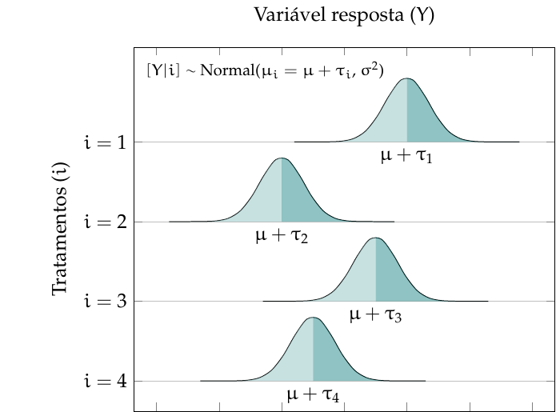

  * [modeloDIC1fator.pgf](https://github.com/walmes/Tikz/blob/master/src/modeloDIC1fator.pgf)

```tex
%% http://tex.stackexchange.com/questions/17638/pgfplots-foreach-equivalent-to-tikzs-with-multiple-variables-separated-by-a-sla

\def\hscale{-1}
\def\stderr{0.35}
\def\fromto{1.8}

\newcommand*{\ListXYvalues}{1/2, 2/0, 3/1.5, 4/0.5}
\newcommand*\pgfplotsinvokeforeachmacro[1]
{\expandafter\pgfplotsinvokeforeach\expandafter{#1}}

\tikzset{ 
  declare function={
    normal(\m,\s)=1/(2*\s*sqrt(pi))*exp(-(x-\m)^2/(2*\s^2));
  },
  >=stealth,
  cx/.style={fill=white, font=\footnotesize},
  pth/.style={draw, ->, color=darkgreen},
  halves/.style={samples=30, fill opacity=0.5, draw=none}
}

\pgfplotsset{
  my plot/.code args={#1/#2}{%
    \addplot[domain=-\fromto:\fromto]
    ({#1+\hscale*normal(0,\stderr)}, x+#2);
    \addplot[halves, domain=-\fromto:0, fill=darkgreen!50]
    ({#1+\hscale*normal(0,\stderr)}, x+#2) -- (axis cs: #1, #2);
    \addplot[halves, domain=0:\fromto, fill=darkgreen]
    ({#1+\hscale*normal(0,\stderr)}, x+#2) -- (axis cs: #1, #2);
    \node[rotate=90, below] at (axis cs: #1, #2) {$\mu+\tau_{#1}$};
  }
}

\begin{tikzpicture}[rotate=-90]
  \begin{axis}[
    width=8cm, height=9cm,
    xlabel=Tratamentos ($i$),
    ylabel=Vari\'{a}vel resposta ($Y$),
    x label style={rotate=180},
    xtick=\empty, xticklabels=\empty, yticklabels=\empty,
    extra x ticks={1,2,3,4},
    extra x tick labels={$i=1$,$i=2$,$i=3$,$i=4$},
    x tick label style={rotate=90, anchor=east},
    extra tick style={grid=major},
    samples=20, domain=-0:4, smooth]

    \node[cx, rotate=90, anchor=north west] (eq)
    at (axis description cs: 0.02, 0.01)
    {$[Y|i]\sim$ Normal($\mu_i=\mu+\tau_i$, $\sigma^2$)};

    \pgfplotsinvokeforeachmacro\ListXYvalues{
      \pgfplotsset{my plot={#1}}
    }

  \end{axis}
\end{tikzpicture}
```
****

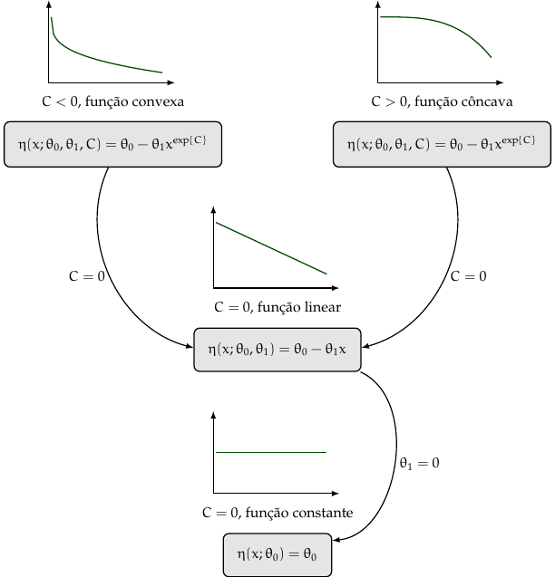

  * [modelos_encaixados1.pgf](https://github.com/walmes/Tikz/blob/master/src/modelos_encaixados1.pgf)

```tex
\tikzset{
  state/.style={
    rectangle, rounded corners, draw=black, fill=gray!20, thick,
    minimum height=2em, inner sep=10pt, text centered
  }
}

\begin{tikzpicture}[->, >=latex, line width=0.75pt]

  \node [state] (Cl0) {
    $\eta(x; \theta_0, \theta_1, C) =
    \theta_0-\theta_1 x^{\exp\{C\}}$\\
  };
  \node [state, yshift=0cm, right of=Cl0,
  node distance=8cm, anchor=center]
  (Cg0) {
    $\eta(x; \theta_0, \theta_1, C) = \theta_0-\theta_1 x^{\exp\{C\}}$\\
  };
  \node [state, yshift=-5cm, right of=Cl0,
  node distance=4cm, anchor=center]
  (Ce0) {
    $\eta(x; \theta_0, \theta_1) = \theta_0-\theta_1 x$\\
  };
  \node[state, yshift=0cm, below of=Ce0,
  node distance=5cm, anchor=center]
  (f1e0) {
    $\eta(x; \theta_0) = \theta_0$\\
  };

  \path
  (Cl0) edge[bend right=50]
    node[midway, left] {$C = 0$} (Ce0)
  (Cg0) edge[bend left=50]
    node[midway, right] {$C = 0$} (Ce0)
  (Ce0) edge[bend left=75]
    node[midway, right] {$\theta_1 = 0$} (f1e0);

  \begin{scope}[xshift=-1.5cm, yshift=1.5cm, xscale=3, yscale=2]
    \draw[<->] (-0.02,1) |- (1,0);
    \draw[-, color=green!30!black, thick, samples=50]
      plot[id=x, domain=0:0.9]
      function{0.8-0.7*x**exp(-1.2)};
    \node at (0.5, -0.25) {$C<0$, fun\c{c}\~ao convexa};
  \end{scope}

  \begin{scope}[xshift=6.5cm, yshift=1.5cm, xscale=3, yscale=2]
    \draw[<->] (-0.02,1) |- (1,0);
    \draw[-, color=green!30!black, thick, samples=50]
      plot[id=x, domain=0:0.9]
      function{0.8-0.7*x**exp(1.2)};
    \node at (0.5, -0.25) {$C>0$, fun\c{c}\~ao c\^oncava};
  \end{scope}

  \begin{scope}[xshift=2.5cm, yshift=-3.5cm, xscale=3, yscale=2]
    \draw[<->] (-0.02,1) |- (1,0);
    \draw[-, color=green!30!black, thick, samples=50]
      plot[id=x, domain=0:0.9]
      function{0.8-0.7*x};
    \node at (0.5, -0.25) {$C=0$, fun\c{c}\~ao linear};
  \end{scope}

  \begin{scope}[xshift=2.5cm, yshift=-8.5cm, xscale=3, yscale=2]
    \draw[<->] (-0.02,1) |- (1,0);
    \draw[-, color=green!30!black, thick, samples=50]
      plot[id=x, domain=0:0.9]
      function{0.5-0*x};
    \node at (0.5, -0.25) {$C=0$, fun\c{c}\~ao constante};
  \end{scope}

\end{tikzpicture}
```
****

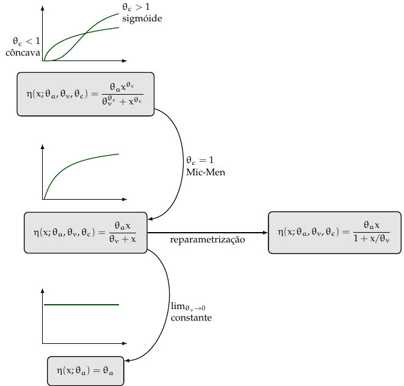

  * [modelos_encaixados2.pgf](https://github.com/walmes/Tikz/blob/master/src/modelos_encaixados2.pgf)

```tex
\tikzset{
  state/.style={
    rectangle, rounded corners, draw=black, fill=gray!20, thick,
    minimum height=2em, inner sep=10pt, text centered
  }
}

\begin{tikzpicture}[->, >=latex, line width=0.75pt]
  \node [state] (Cd0) {
    $\eta(x; \theta_a, \theta_v, \theta_c) =
    \displaystyle\frac{\theta_a x^{\theta_c}}{
      \theta_v^{\theta_c} +x^{\theta_c}}$
  };
  \node [state, yshift=0cm, below of=Cd0,
  node distance=5cm, anchor=center] (Ce0) {
    $\eta(x; \theta_a, \theta_v, \theta_c) =
    \displaystyle\frac{\theta_a x}{\theta_v +x}$
  };
  \node [state, yshift=0cm, below of=Ce0,
  node distance=5cm, anchor=center] (f1e0) {
    $\eta(x; \theta_a) = \theta_a$
  };
  
  \path
  (Cd0) edge[bend left=78]
    node[midway, right, align=left] {$\theta_c = 1$\\ Mic-Men} (Ce0)
  (Ce0) edge[bend left=75]
    node[midway, right, align=left] {$\lim_{\theta_v\to 0}$\\ constante}
  (f1e0);

  \node[state, yshift=0cm, right of=Ce0,
  node distance=9cm, anchor=center] (Ce1) {
    $\eta(x; \theta_a, \theta_v, \theta_c) =
    \displaystyle\frac{\theta_a x}{1+x/\theta_v}$
  };

  \path (Ce0) edge node[midway, below, align=left]
    {reparametriza\c{c}\~{a}o} (Ce1);

  \begin{scope}[xshift=-1.5cm, yshift=1.2cm, xscale=3, yscale=2]
    \draw[<->] (-0.02,1) |- (1,0);
    \draw[-, color=green!30!black, thick, samples=50]
      plot[id=x, domain=0:0.9]
      function{1*x**3/(0.5**3+x**3)};
    \node[align=right, left] at (0, 0.25)
      {$\theta_c<1$\\ c\^{o}ncava};
    \draw[-, color=green!30!black, thick, samples=50]
      plot[id=x, domain=0:0.9]
      function{1*x**(0.7)/(0.5**0.7+x**(0.7))};
    \node[align=left, right] at (0.9, 0.85)
      {$\theta_c>1$\\ sigm\'{o}ide};
  \end{scope}

  \begin{scope}[xshift=-1.5cm, yshift=-3.8cm, xscale=3, yscale=2]
    \draw[<->] (-0.02,1) |- (1,0);
    \draw[-, color=green!30!black, thick, samples=50]
      plot[id=x, domain=0:0.9]
      function{1*x**(1)/(0.2**1+x**(1))};
  \end{scope}

  \begin{scope}[xshift=-1.5cm, yshift=-9cm, xscale=3, yscale=2]
    \draw[<->] (-0.02,1) |- (1,0);
    \draw[-, color=green!30!black, thick, samples=50]
      plot[id=x, domain=0:0.9]
      function{0.7-0*x};
  \end{scope}

\end{tikzpicture}
```
****

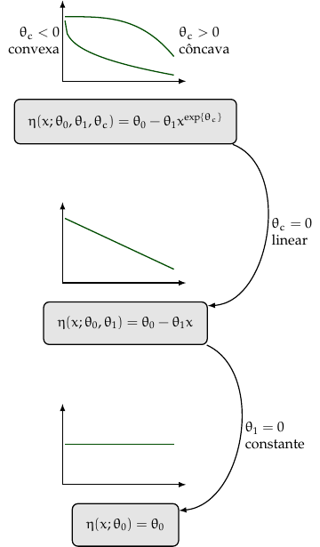

  * [modelos_encaixados3.pgf](https://github.com/walmes/Tikz/blob/master/src/modelos_encaixados3.pgf)

```tex
\tikzset{
  state/.style={
    rectangle, rounded corners, draw=black, fill=gray!20, thick,
    minimum height=2em, inner sep=10pt, text centered
  }
}

\begin{tikzpicture}[->, >=latex, line width=0.75pt]
  \node[state] (Cd0) {
    $\eta(x; \theta_0, \theta_1, \theta_c) =
    \theta_0-\theta_1 x^{\exp\{\theta_c\}}$
  };
  \node[state, yshift=0cm, below of=Cd0,
  node distance=5cm, anchor=center] (Ce0) {
    $\eta(x; \theta_0, \theta_1) = \theta_0-\theta_1 x$
  };
  \node[state, yshift=0cm, below of=Ce0,
  node distance=5cm, anchor=center] (f1e0) {
    $\eta(x; \theta_0) = \theta_0$
  };
  
  \path
  (Cd0) edge[bend left=78]
    node[midway, right, align=left] {$\theta_c = 0$\\ linear} (Ce0)
  (Ce0) edge[bend left=75]
    node[midway, right, align=left] {$\theta_1 = 0$\\ constante} (f1e0);

  \begin{scope}[xshift=-1.5cm, yshift=1cm, xscale=3, yscale=2]
    \draw[<->] (-0.02,1) |- (1,0);
    \draw[-, color=green!30!black, thick, samples=50]
      plot[id=x, domain=0:0.9]
      function{0.75-0.7*x**exp(-1)};
    \draw[-, color=green!30!black, thick, samples=50]
      plot[id=x, domain=0:0.9]
      function{0.8-0.7*x**exp(1.2)};
    \node[align=right, left] at (0, 0.5) {$\theta_c<0$\\ convexa};
    \node[align=left, right] at (0.9, 0.5) {$\theta_c>0$\\ c\^{o}ncava};
  \end{scope}

  \begin{scope}[xshift=-1.5cm, yshift=-4cm, xscale=3, yscale=2]
    \draw[<->] (-0.02,1) |- (1,0);
    \draw[-, color=green!30!black, thick, samples=50]
      plot[id=x, domain=0:0.9]
      function{0.8-0.7*x};
  \end{scope}

  \begin{scope}[xshift=-1.5cm, yshift=-9cm, xscale=3, yscale=2]
    \draw[<->] (-0.02,1) |- (1,0);
    \draw[-, color=green!30!black, thick, samples=50]
      plot[id=x, domain=0:0.9]
      function{0.5-0*x};
  \end{scope}

\end{tikzpicture}
```
****

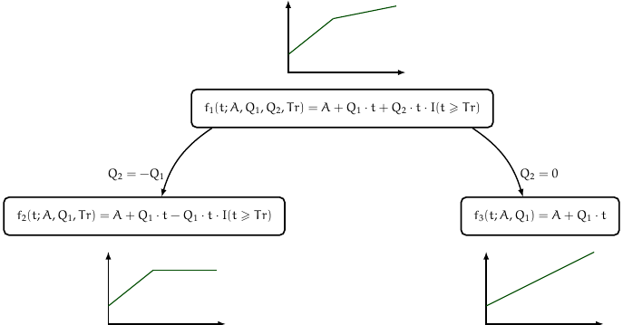

  * [modelos_encaixados4.pgf](https://github.com/walmes/Tikz/blob/master/src/modelos_encaixados4.pgf)

```tex
\tikzset{
  state/.style={
    rectangle,
    rounded corners,
    draw=black, very thick,
    minimum height=2em,
    inner sep=10pt,
    text centered,
  }
}

\begin{tikzpicture}[->, >=latex, line width=1pt]
  \node[state] (f1) {
    $f_1(t; A, Q_1, Q_2, Tr) =
    A+Q_1\cdot t+Q_2\cdot t\cdot I(t\geq Tr)$\\
  };
  \node [state, yshift=-3cm, left of=f1,
  node distance=5.5cm, anchor=center] (f2) {
    $f_2(t; A, Q_1, Tr) =
    A+Q_1\cdot t-Q_1\cdot t\cdot I(t\geq Tr)$\\
  };
  \node[state, yshift=-3cm, right of=f1,
  node distance=5.5cm, anchor=center] (f3) {
    $f_3(t; A, Q_1) = A+Q_1\cdot t$\\
  };
  \path
  (f1) edge[bend right=20]
    node[near end, left] {$Q_2 = -Q_1$} (f2)
  (f1) edge[bend left=20]
    node[near end, right] {$Q_2 = 0$} (f3);
  \begin{scope}[xshift=-1.5cm, yshift=1cm]
    \draw[<->] (0,2) |- (3.25,0);
    \draw[-, color=green!30!black, thick]
      plot[id=x, domain=0:1.25]
      function{0.5+0.8*x} node[right] {};
    \draw[-, color=green!30!black, thick]
      plot[id=x, domain=1.25:3]
      function{0.5+0.8*1.25+0.2*(x-1.25)} node[right] {};
  \end{scope}
  \begin{scope}[xshift=-6.5cm, yshift=-6cm]
    \draw[<->] (0,2) |- (3.25,0);
    \draw[-, color=green!30!black, thick]
      plot[id=x, domain=0:1.25]
      function{0.5+0.8*x} node[right] {};
    \draw[-, color=green!30!black, thick]
      plot[id=x, domain=1.25:3]
      function{0.5+0.8*1.25+0*(x-1.25)} node[right] {};
  \end{scope}
  \begin{scope}[xshift=4cm, yshift=-6cm]
    \draw[<->] (0,2) |- (3.25,0);
    \draw[-, color=green!30!black, thick]
      plot[id=x, domain=0:3]
      function{0.5+0.5*x} node[right] {};
  \end{scope}
\end{tikzpicture}
```
****

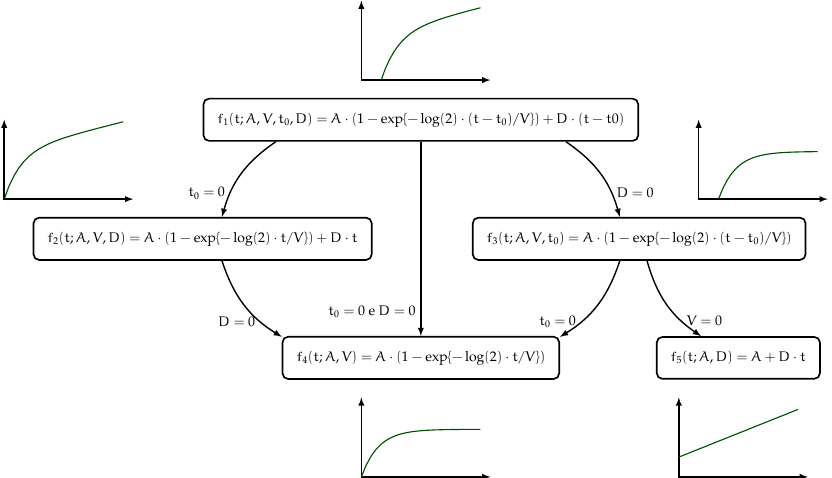

  * [modelos_encaixados5.pgf](https://github.com/walmes/Tikz/blob/master/src/modelos_encaixados5.pgf)

```tex
\tikzset{
  state/.style={
    rectangle, rounded corners, draw=black, very thick,
    minimum height=2em, inner sep=10pt, text centered,
  }
}

\begin{tikzpicture}[->, >=latex, line width=1pt]
  \node[state] (f1) {
    $f_1(t; A, V, t_0, D) =
    A\cdot(1-\exp\{-\log(2)\cdot(t-t_0)/V\})+D\cdot (t-t0)$\\
  };
  \node[state, yshift=-3cm, left of=f1,
  node distance=5.5cm, anchor=center] (f2) {
    $f_2(t; A, V, D) =
    A\cdot(1-\exp\{-\log(2)\cdot t/V\})+D\cdot t$\\
  };
  \node[state, yshift=-3cm, right of=f1,
  node distance=5.5cm, anchor=center] (f3) {
    $f_3(t; A, V, t_0) =
    A\cdot(1-\exp\{-\log(2)\cdot(t-t_0)/V\})$\\
  };
  \node[state, yshift=-3cm, right of=f2,
  node distance=5.5cm, anchor=center] (f4) {
    $f_4(t; A, V) =
    A\cdot(1-\exp\{-\log(2)\cdot t/V\})$\\
  };
  \node[state, yshift=-3cm, right of=f3,
  node distance=2.5cm, anchor=center] (f5) {
    $f_5(t; A, D) = A+D\cdot t$\\
  };
  \path
  (f1) edge[bend right=20] node[near end, left] {$t_0 = 0$} (f2)
  (f1) edge[bend left=20] node[near end, right] {$D = 0$} (f3)
  (f2) edge[bend right=20] node[near end, left] {$D=0$} (f4)
  (f3) edge[bend left=20] node[near end, left] {$t_0=0$} (f4)
  (f3) edge[bend right=20] node[near end, right] {$V=0$} (f5)
  (f1) edge node[very near end, left] {$t_0=0 \textrm{ e } D=0$} (f4);
  \begin{scope}[xshift=-1.5cm, yshift=1cm]
    \draw[<->] (0,2) |- (3.25,0);
    \draw[-, color=green!30!black, thick]
      plot[id=x, domain=0.5:3]
      function{1.2*(1-exp(-0.7*(x-0.5)/0.3))+0.25*(x-0.5)};
  \end{scope}
  \begin{scope}[xshift=-10.5cm, yshift=-2cm]
    \draw[<->] (0,2) |- (3.25,0);
    \draw[-, color=green!30!black, thick]
      plot[id=x, domain=0:3]
      function{1.2*(1-exp(-0.7*(x)/0.3))+0.25*(x)};
  \end{scope}
  \begin{scope}[xshift=7cm, yshift=-2cm]
    \draw[<->] (0,2) |- (3.25,0);
    \draw[-, color=green!30!black, thick]
      plot[id=x, domain=0.5:3]
      function{1.2*(1-exp(-0.7*(x-0.5)/0.3))};
  \end{scope}
  \begin{scope}[xshift=6.5cm, yshift=-9cm]
    \draw[<->] (0,2) |- (3.25,0);
    \draw[-, color=green!30!black, thick]
      plot[id=x, domain=0:3]
      function{0.5+0.4*x};
  \end{scope}
  \begin{scope}[xshift=-1.5cm, yshift=-9cm]
    \draw[<->] (0,2) |- (3.25,0);
    \draw[-, color=green!30!black, thick]
      plot[id=x, domain=0:3]
      function{1.2*(1-exp(-0.7*x/0.3))};
  \end{scope}
\end{tikzpicture}
```
****

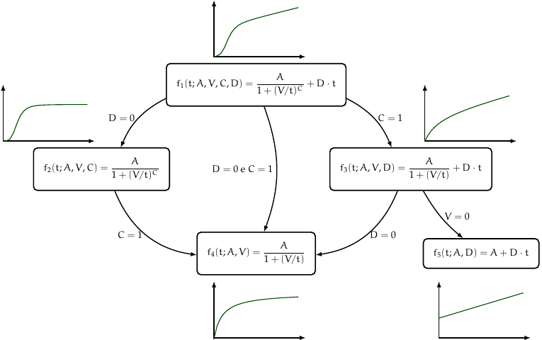

  * [modelos_encaixados6.pgf](https://github.com/walmes/Tikz/blob/master/src/modelos_encaixados6.pgf)

```tex
\tikzset{
  state/.style={
    rectangle, rounded corners, draw=black, very thick,
    minimum height=2em, inner sep=10pt, text centered,
  },
}

\begin{tikzpicture}[->, >=latex, line width=1pt]
  \node[state] (f1) {
    $f_1(t; A, V, C, D) = \displaystyle \frac{A}{1+(V/t)^C}+D\cdot t$
  };
  \node[state, yshift=-3cm, left of=f1,
  node distance=5.5cm, anchor=center] (f2) {
    $f_2(t; A, V, C) = \displaystyle \frac{A}{1+(V/t)^C}$
  };
  \node[state, yshift=-3cm, right of=f1,
  node distance=5.5cm, anchor=center] (f3) {
    $f_3(t; A, V, D) = \displaystyle \frac{A}{1+(V/t)}+D\cdot t$
  };
  \node[state, yshift=-3cm, right of=f2,
  node distance=5.5cm, anchor=center] (f4) {
    $f_4(t; A, V) = \displaystyle \frac{A}{1+(V/t)}$
  };
  \node[state, yshift=-3cm, right of=f3,
  node distance=2.5cm, anchor=center] (f5) {
    $f_5(t; A, D) = A+D\cdot t$\\
  };
  \path
  (f1) edge[bend right=20] node[midway, left] {$D = 0$} (f2)
  (f1) edge[bend left=20] node[midway, right] {$C = 1$} (f3)
  (f2) edge[bend right=30] node[midway, left] {$C = 1$} (f4)
  (f3) edge[bend left=30] node[midway, right] {$D = 0$} (f4)
  (f3) edge[bend right=10] node[midway, right] {$V = 0$} (f5)
  (f1) edge[bend left=20] node[midway, left]
    {$D = 0 \textrm{ e } C = 1$} (f4);
  \begin{scope}[xshift=-1.5cm, yshift=1cm]
    \draw[<->] (0,2) |- (3.25,0);
    \draw[-, color=green!30!black, thick]
      plot[id=x, domain=-0.01:3]
      function{1/(1+(0.5/x)**4)+0.25*x};
  \end{scope}
  \begin{scope}[xshift=-9cm, yshift=-2cm]
    \draw[<->] (0,2) |- (3.25,0);
    \draw[-, color=green!30!black, thick]
      plot[id=x, domain=-0.01:3]
      function{1.3/(1+(0.5/x)**4)};
  \end{scope}
  \begin{scope}[xshift=6cm, yshift=-2cm]
    \draw[<->] (0,2) |- (3.25,0);
    \draw[-, color=green!30!black, thick]
      plot[id=x, domain=-0.01:3]
      function{1/(1+(0.5/x))+0.25*x};
  \end{scope}
  \begin{scope}[xshift=-1.5cm, yshift=-9cm]
    \draw[<->] (0,2) |- (3.25,0);
    \draw[-, color=green!30!black, thick]
      plot[id=x, domain=-0.01:3]
      function{1.6/(1+(0.3/x))};
  \end{scope}
  \begin{scope}[xshift=6.5cm, yshift=-9cm]
    \draw[<->] (0,2) |- (3.25,0);
    \draw[-, color=green!30!black, thick]
      plot[id=x, domain=-0.01:3]
      function{0.7+0.3*x};
  \end{scope}
\end{tikzpicture}
```
****

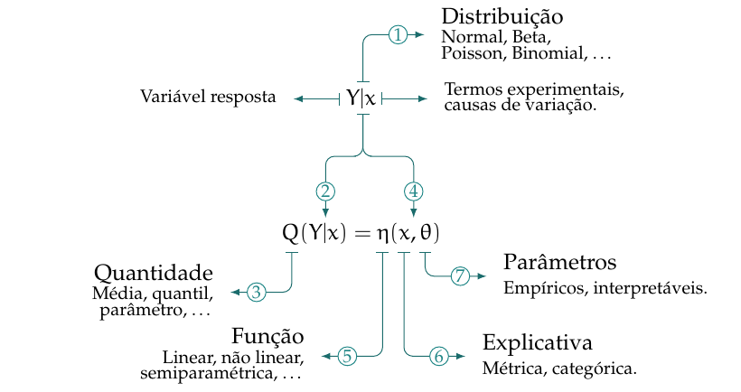

  * [modelos_regressao.pgf](https://github.com/walmes/Tikz/blob/master/src/modelos_regressao.pgf)

```tex
\def\hd{0.9}%
\def\vd{1.1}%
\newcommand{\tm}[1]{\tikz[overlay, anchor=base] \node[red] (#1) {};}%
\newcommand{\tmc}[2]{
  \tikz[overlay] \node[xshift=#2ex, yshift=1.25ex] (#1) {};
}%
\renewcommand{\baselinestretch}{0.9}%

\tikzstyle{every picture}+=[remember picture]%

\tikzset{% 
  rounded corners=4pt,
  every node/.style={color=black},
  every path/.style={
    color=darkgreen!80!black, thin,
    shorten >=4pt, shorten <=4pt, |-latex
  },
  mybox/.style={
    draw=gray!50, fill=gray!20, very thick, rectangle,
    inner sep=7pt, inner ysep=7pt
  },
  bola/.style={
    circle, draw, near end, inner sep=0.5pt, font=\footnotesize,
    color=darkgreen, fill=white,
  },
  nodedir/.style={right, text width=3.5cm, align=flush left},
  nodeesq/.style={left, text width=2.6cm, align=flush right}
}%

\begin{tikzpicture}%
  \node (eq1) {$\tmc{Y}{1}Y\tmc{pipe1}{0.3}|\tm{X}x$};
  \node[below=1.5cm of eq1] (eq2)
  {$\tmc{Q}{1}Q(Y\tmc{pipe2}{0.3}|x) =
    \tmc{eta}{0.5}\eta(\tmc{x}{0.5}x \tmc{comma}{0.3},
    \tmc{theta}{0.5}\theta)$};
  \draw (Y.220) -- ++(-1,0)
  node[nodeesq] {\footnotesize{Vari{\'a}vel resposta}};
  \draw (X.40) -- ++(1,0)
  node[nodedir] {
    \footnotesize{Fatores experimentais,\\
      [-1ex] causas de varia{\c c}{\~a}o.}
  };
  \draw[shorten <=1pt] (pipe1) |- +(\vd,\hd)
  node[nodedir] {
    Distribui{\c c}{\~a}o\\
    \footnotesize{Normal, binomial,\\
      [-1ex] Poisson, beta, \ldots}
  } node[bola] {1};
  \draw[shorten <=6pt] (pipe1) |- ++(-0.25,-1) -| (pipe2)
  node[bola] {2};
  \draw (Q) |- +(-\vd,-\hd)
  node[nodeesq] {
    Quantidade\\
    \footnotesize{M{\'e}dia, quantil,\\
      [-1ex] par{\^a}metro, \ldots}
  } node[bola] {3};
  \draw[shorten <=6pt] (pipe1) |- ++(0.25,-1) -| (comma)
  node[bola] {4};
  \draw (eta) |- +(-\vd,-\hd-1)
  node[nodeesq] {
    Fun{\c c}{\~a}o\\
    \footnotesize{Linear, n{\~a}o linear,\\
      [-1ex] semiparam{\'e}trica, \ldots}
  } node[bola] {5};
  \draw (x) |- +(\vd,-\hd-1)
  node[nodedir] {
    Explicativa\\
    \footnotesize{M{\'e}trica, categ{\'o}rica.}
  } node[bola] {6};
  \draw (theta) |- +(\vd,-\hd+0.25)
  node[nodedir] {
    Par{\^a}metros\\
    \footnotesize{Emp{\'\i}ricos, interpret{\'a}veis.}
  } node[bola] {7};
\end{tikzpicture}%
```
****

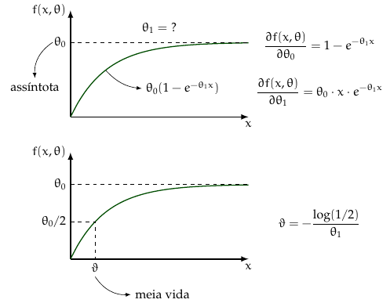

  * [monomolecular_deriv.pgf](https://github.com/walmes/Tikz/blob/master/src/monomolecular_deriv.pgf)

```tex
\def\ba{2.1}
\def\bb{1}

\begin{tikzpicture}[domain=-3:5, xscale=1, yscale=1, >=latex]
  \begin{scope}
    \draw[->, line width=1pt] (0,0) -- (5,0) node[below] {$x$};
    \draw[->, line width=1pt] (0,0) -- (0,3) node[left] {$f(x,\theta)$};
    \draw[color=green!30!black, thick, smooth]
      plot[id=x, domain=0:5]
      function{\ba*(1-exp(-\bb*x))};
    \draw[dashed] (0, \ba) node[left] {$\theta_0$} -- (5,\ba);
    \node (texto) at (2.5,2.5) {$\theta_1 =\,\, ?$};
    \path[->] (1,1.3) edge[bend right=20]
      node[at end, right] {$\theta_0(1-e^{-\theta_1x})$} +(1,-0.5);
    \path[->] (0-0.5,\ba) edge[bend right=30]
      node[at end, below] {ass\'intota} +(-0.5,-1);
    \node (der1) at (7,2)
      {$\displaystyle\frac{\partial f(x,\theta)}{
          \partial \theta_0} = 1-e^{-\theta_1 x}$};
    \node[below of=der1, node distance=1.3cm] (der2)
      {$\displaystyle\frac{\partial f(x,\theta)}{
          \partial \theta_1} = \theta_0\cdot x\cdot e^{-\theta_1 x}$};
  \end{scope}

  \begin{scope}[yshift=-4cm]
    \draw[->, line width=1pt] (0,0) -- (5,0) node[below] {$x$};
    \draw[->, line width=1pt] (0,0) -- (0,3) node[left] {$f(x,\theta)$};
    \draw[color=green!30!black, thick, smooth]
      plot[id=x, domain=0:5]
      function{\ba*(1-exp(-\bb*x))};
    \draw[dashed] (0, \ba) node[left] {$\theta_0$} -- (5,\ba);
    \draw[dashed] (0, \ba/2) node[left] {$\theta_0/2$} -| (0.693,0)
      node[below] {$\vartheta$};
    \node (der1) at (7,1)
      {$\vartheta=-\displaystyle\frac{\log(1/2)}{\theta_1}$};
    \path[->] (0.693,-0.5) edge[bend right=30]
      node[at end, right] {meia vida} +(1,-0.5);
  \end{scope}
\end{tikzpicture}
```
****

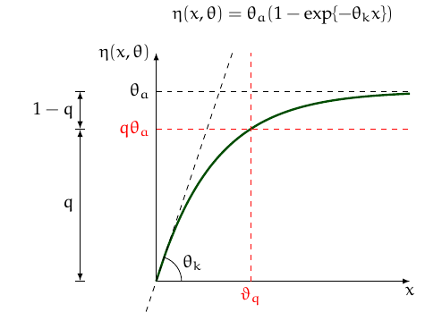

  * [monomolecular.pgf](https://github.com/walmes/Tikz/blob/master/src/monomolecular.pgf)

```tex
\def\xs{1}
\def\ys{1.5}
\def\A{2.5}
\def\V{0.8}
\def\q{0.8}
\def\dx{-1.5}

\begin{tikzpicture}[domain=0:5, xscale=\xs, yscale=\ys, >=latex]
  \begin{scope}
    \draw[->] (0,0) -- (5,0) node[below] {$x$};
    \draw[->] (0,0) -- (0,3) node[left] {$\eta(x,\theta)$};
    \draw[color=green!30!black, very thick, smooth]
      plot[id=x, domain=0:5] function{\A*(1-exp(-log(2)*x/\V))};
    \draw[dashed] (0,\A) node[left] {$\theta_a$} -- (5,\A);
    \draw[dashed, color=red] (0,\q*\A)
      node[left] {$q\theta_a$} -- (5,\q*\A);
    \draw[dashed, color=red] (\V+1.07,0)
      node[below] {$\vartheta_q$} -- ++(0,3);
    \draw[|<->|] (\dx,0) -- (\dx,\q*\A) node[midway, left] {$q$};
    \draw[|<->|] (\dx,\q*\A) -- (\dx,\A) node[midway, left] {$1-q$};
    \node at (2.5,3.5)
      {$\eta(x,\theta) = \theta_a (1-\exp\{-\theta_k x\})$};
    \draw[dashed] (-0.2,-0.4) -- (1.5,3);
    \draw (0.5,0) arc (0:70:0.5 and 0.33);
    \node[right] at (0.4,0.24) {$\theta_k$};
  \end{scope}
\end{tikzpicture}
```
****

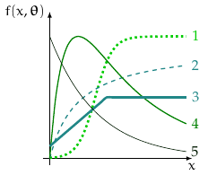

  * [naolinear5curvas.pgf](https://github.com/walmes/Tikz/blob/master/src/naolinear5curvas.pgf)

```tex
\begin{tikzpicture}
  \def\xs{0.7}; \def\ys{1.2}
  % Michaelis-Menten
  \def\A{2.3}; \def\V{1}
  % Logistico
  \def\Ass{2.5}; \def\xhaf{1.6}; \def\Scal{0.3}
  % Exponencial decaimento
  \def\Int{2.5}; \def\B{0.6}
  % Linear-plato
  \def\bz{0.25}; \def\bu{0.5}; \def\xb{2}
  % Bleasdale-Nelder
  \def\ty{2.5}; \def\tx{1}; \def\tc{0.2}
  \begin{scope}[xscale=\xs, yscale=\ys, >=latex, domain=0:4.8]
    \draw[->] (0-0.2*\ys,0) -- (5,0) node[below] {$x$};
    \draw[->] (0,0-0.2*\xs) -- (0,3)
      node[left] {$f(x,\boldsymbol{\theta})$};
    \draw[color=green!80!black, ultra thick, smooth, dotted]
      plot[id=x] function{\Ass/(1+exp(-(x-\xhaf)/\Scal))}
      node[right] {1};
    \draw[color=darkgreen, thick, smooth, dashed]
      plot[id=x] function{\A*x/(\V+x)}
      node[right] {2};
    \draw[color=green!50!black, thick, smooth]
      plot[id=x] function{\ty*(x/\tx)*(1-\tc*(1-x/\tx))**(-1/\tc)}
      node[right] {4};
    \draw[color=darkgreen, ultra thick, smooth]
      plot[id=x] function{\bz+\bu*x*(x<\xb)+\bu*\xb*(x>\xb)}
      node[right] {3};
    \draw[color=green!10!black, thin, smooth]
      plot[id=x] function{\Int*exp(-\B*x)}
      node[right] {5};
  \end{scope}
\end{tikzpicture}
```
****

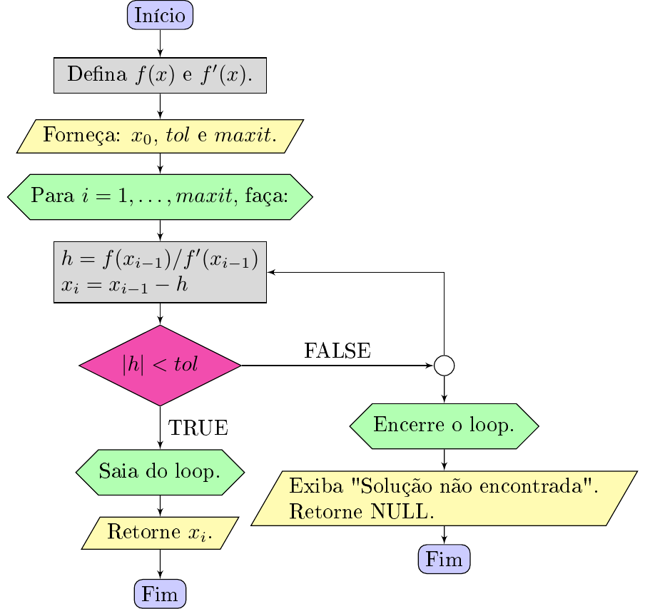

  * [newton.pgf](https://github.com/walmes/Tikz/blob/master/src/newton.pgf)

```tex
% https://tex.stackexchange.com/questions/87945/tikz-picture-shapes

\tikzset{%
  pth/.style = {
    draw,
    ->,
    > = latex',
  },
  start-end/.style = {
    draw,
    fill = blue!20!white,
    rectangle,
    rounded corners,
  },
  input/.style = {% requires library shapes.geometric
    draw,
    fill = yellow!30!white,
    trapezium,
    trapezium left angle = 60,
    trapezium right angle = 120,
  },
  operation/.style = {
    draw,
    fill = gray!30!white,
    rectangle,
    minimum width = 3.5cm,
  },
  loop/.style = {% requires library shapes.misc
    draw,
    fill = green!30!white,
    chamfered rectangle,
    chamfered rectangle xsep = 2cm
  },
  decision/.style = {% requires library shapes.geometric
    draw,
    fill = magenta!70!white,
    diamond,
    aspect = 2
  },
  decision/.default = 1,
  print/.style = {% requires library shapes.symbols
    draw,
    tape,
    tape bend top = none
  },
  connection/.style = {
    draw,
    circle,
    radius = 5pt,
  },
  process rectangle outer width/.initial = 0.15cm,
  predefined process/.style = {
    rectangle,
    draw,
    append after command = {
      \pgfextra{
        \draw
        ($(\tikzlastnode.north west) - (0, 0.5\pgflinewidth)$) --
        ($(\tikzlastnode.north west) - (\pgfkeysvalueof{/tikz/process
          rectangle outer width}, 0.5\pgflinewidth)$) --
        ($(\tikzlastnode.south west) + (-\pgfkeysvalueof{/tikz/process
          rectangle outer width}, +0.5\pgflinewidth)$) --
        ($(\tikzlastnode.south west) + (0, 0.5\pgflinewidth)$);
        \draw
        ($(\tikzlastnode.north east) - (0, 0.5\pgflinewidth)$) --
        ($(\tikzlastnode.north east) + (\pgfkeysvalueof{/tikz/process
          rectangle outer width}, -0.5\pgflinewidth)$) --
        ($(\tikzlastnode.south east) + (\pgfkeysvalueof{/tikz/process
          rectangle outer width}, 0.5\pgflinewidth)$) --
        ($(\tikzlastnode.south east) + (0, 0.5\pgflinewidth)$);
      }
    },
    text width = 3cm,
    align = center
  },
  predefined process/.default = 1.75cm,
  man op/.style = {% requires library shapes.geometric
    draw,
    trapezium,
    shape border rotate = 180,
    text width = 2cm,
    align = center,
  },
  extract/.style = {
    draw,
    isosceles triangle,
    isosceles triangle apex angle = 60,
    shape border rotate = 90
  },
  merge/.style = {
    draw,
    isosceles triangle,
    isosceles triangle apex angle = 60,
    shape border rotate = -90
  },
}

\begin{tikzpicture}

  % Example of each structure ---------------
  % \node[start-end] (start) {Start/End};
  % \node[below of = start,input](inp){Input};
  % \node[below of = inp,operation] (op) {Operation};
  % \node[below of = op,loop] (lp) {Loop};
  % \node[right = 10pt of lp,loop = 1.6] (lp2) {Preparation};
  % \node[below = 5pt of lp,decision] (dec) {Decision};
  % \node[right = 10pt of dec,decision = 1.6] (dec2) {Decision};
  % \node[right = 10pt of dec2,decision = 2.5] (dec3) {Decision};
  % \node[below = 5pt of dec,print] (pr) {Print};
  % \node[below = 10pt of pr,predefined process] (prproc) {Predefined process};
  % \node[below = 10pt of prproc,man op] (manop) {Manual Operation};
  % \node[below of = manop,connection, label = below:Connection] (con) {};
  % \node[below of = con,extract, label = below:Extract] (extr) {};
  % \node[below of = extr,merge, label = below:Merge] (mrg) {};

\begin{scope}
% Using a `for` loop.

  % Nodes -------------------------------------

  \node[start-end] (start) {In{\'i}cio};
  \node[below of = start, operation] (fx) {Defina $f(x)$ e $f'(x)$.};
  \node[below of = fx, input] (inp) {
    Forne{\c c}a: $x_0$, $tol$ e $maxit$.};
  \node[below of = inp, loop] (lp) {
    Para $i = 1,\dots,maxit$, fa{\c c}a:};
  \node[below = 1em of lp, operation, align = left] (calc) {
    $h = f(x_{i-1})/f'(x_{i-1})$\\
    $x_i = x_{i-1} - h$};
  \node[below = 1em of calc, decision] (tol) {$|h| < tol$};
  \node[below = 2em of tol, loop] (break) {Saia do loop.};
  \node[below of = break, input] (resul) {Retorne $x_i$.};
  \node[start-end, below of = resul] (end0) {Fim};

  \node[right = 9em of tol, connection] (con) {};
  \node[below of = con, loop] (out) {Encerre o loop.};
  \node[below = 1em of out, input, align = left] (notcon) {
    Exiba "Solu{\c c}{\~ a}o n{\~ a}o encontrada".\\
    Retorne NULL.
  };
  \node[start-end, below of = notcon] (end1) {Fim};

  % Paths -------------------------------------

  \path[pth] (start)  -- (fx);
  \path[pth] (fx)     -- (inp);
  \path[pth] (inp)    -- (lp);
  \path[pth] (lp)     -- (calc);
  \path[pth] (calc)   -- (tol);
  \path[pth] (tol)    -- node[right] {TRUE} (break);
  \path[pth] (break)  -- (resul);
  \path[pth] (resul)  -- (end0);
  \path[pth] (tol)    -- node[above] {FALSE} (con);
  \path[pth] (con)    |- (calc);
  \path[pth] (con)    -- (out);
  \path[pth] (out)    -- (notcon);
  \path[pth] (notcon) -- (end1);

\end{scope}

\begin{scope}[xshift = 11cm]
% Using a `while` loop.

  % Nodes -------------------------------------

  \node[start-end] (start) {In{\'i}cio};
  \node[below of = start, operation] (fx) {Defina $f(x)$ e $f'(x)$.};
  \node[below of = fx, input] (inp) {
    Forne{\c c}a: $x_0$, $tol$ e $maxit$.};
  \node[below of = inp, operation] (init-i) {Defina $i = 1$.};
  \node[below of = init-i, loop] (lp) {
    Enquanto $i \leq maxit$, fa{\c c}a:};
  \node[below = 1em of lp, operation, align = left] (calc) {
    $h = f(x_{i-1})/f'(x_{i-1})$\\
    $x_i = x_{i-1} - h$};
  \node[below = 1em of calc, decision] (tol) {$|h| < tol$};
  \node[below = 2em of tol, loop] (break) {Saia do loop.};
  \node[below of = break, input] (resul) {Retorne $x_i$.};
  \node[start-end, below of = resul] (end0) {Fim};

  \node[right = 9em of tol, connection] (con) {};
  \node[above of = con, operation] (incre) {$i = i + 1$};
  \node[below of = con, loop] (out) {Encerre o loop.};
  \node[below = 1em of out, input, align = left] (notcon) {
    Exiba "Solu{\c c}{\~ a}o n{\~ a}o encontrada".\\
    Retorne NULL.
  };
  \node[start-end, below of = notcon] (end1) {Fim};

  % Paths -------------------------------------

  \path[pth] (start)  -- (fx);
  \path[pth] (fx)     -- (inp);
  \path[pth] (inp)    -- (init-i);
  \path[pth] (init-i) -- (lp);
  \path[pth] (lp)     -- (calc);
  \path[pth] (calc)   -- (tol);
  \path[pth] (tol)    -- node[right] {TRUE} (break);
  \path[pth] (break)  -- (resul);
  \path[pth] (resul)  -- (end0);
  \path[pth] (tol)    -- node[above] {FALSE} (con);
  \path[pth] (con)    -- (incre);
  \path[pth] (incre)  |- (calc);
  \path[pth] (con)    -- (out);
  \path[pth] (out)    -- (notcon);
  \path[pth] (notcon) -- (end1);

\end{scope}

\end{tikzpicture}%
```
****

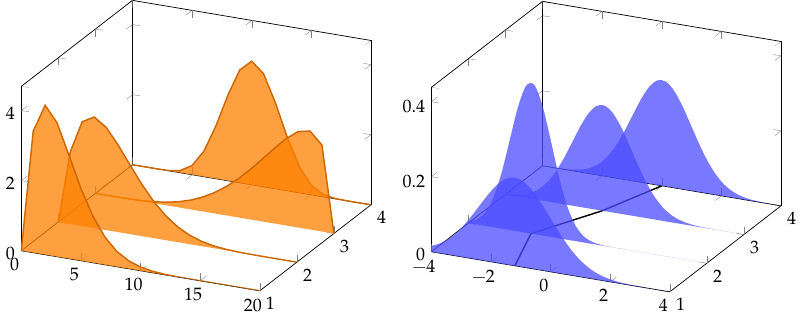

  * [normal_beta_3d.pgf](https://github.com/walmes/Tikz/blob/master/src/normal_beta_3d.pgf)

```tex
\begin{tikzpicture}
  \pgfplotstableread{
    plot1   plot2   plot3   plot4
    0       0       0       0
    3.466   2.058   0       0
    4.262   2.976   0.001   0
    3.822   3.168   0.006   0.008
    2.953   2.936   0.019   0.063
    2.065   2.492   0.046   0.265
    1.332   1.977   0.092   0.734
    0.797   1.478   0.164   1.508
    0.443   1.045   0.268   2.44
    0.228   0.698   0.412   3.219
    0.107   0.438   0.598   3.524
    0.046   0.256   0.831   3.219
    0.017   0.138   1.109   2.44
    0.006   0.067   1.429   1.508
    0.002   0.029   1.78    0.734
    0       0.01    2.141   0.265
    0       0.003   2.479   0.063
    0       0.001   2.736   0.008
    0       0       2.808   0
    0       0       2.465   0
    0       0       0       0
  }\dummydata

  \begin{axis}[
    samples=30,
    domain=-4:4,
    samples y=0, ytick={1,...,4},
    zmin=0,
    area plot/.style={
      fill opacity=0.75,
      draw=orange!80!black,thick,
      fill=orange,
      mark=none,
    }]

    \pgfplotsinvokeforeach{4,3,...,1}{
      \addplot3 [area plot]
        table [x expr=\coordindex, y expr=#1, z=plot#1]
        {\dummydata};
    }
  \end{axis}
\end{tikzpicture}

\begin{tikzpicture}[
  declare function={
    normal(\m,\s)=1/(2*\s*sqrt(pi))*exp(-(x-\m)^2/(2*\s^2));
  }]

  \begin{axis}[
    samples=30,
    domain=-4:4,
    samples y=0, ytick=data,
    zmin=0,
    area plot/.style={
      fill opacity=0.75,
      draw=none,
      fill=blue!70,
      mark=none,
      smooth
    }]

    \addplot3 [black, thick] table {
      0 4 0
      -0.75 3 0
      -1.9 2 0
      -1.2 1 0
    };

    \addplot3 [area plot] (x,4,{normal(0,1)});
    \addplot3 [area plot] (x,3,{normal(-0.75,1)}) -- (axis cs:-4,3,0);
    \addplot3 [area plot] (x,2,{normal(-1.9,0.7)}) -- (axis cs:-4,2,0);
    \addplot3 [area plot] (x,1,{normal(-1.2,1.2)}) -- (axis cs:-4,1,0);
  \end{axis}
\end{tikzpicture}
```
****

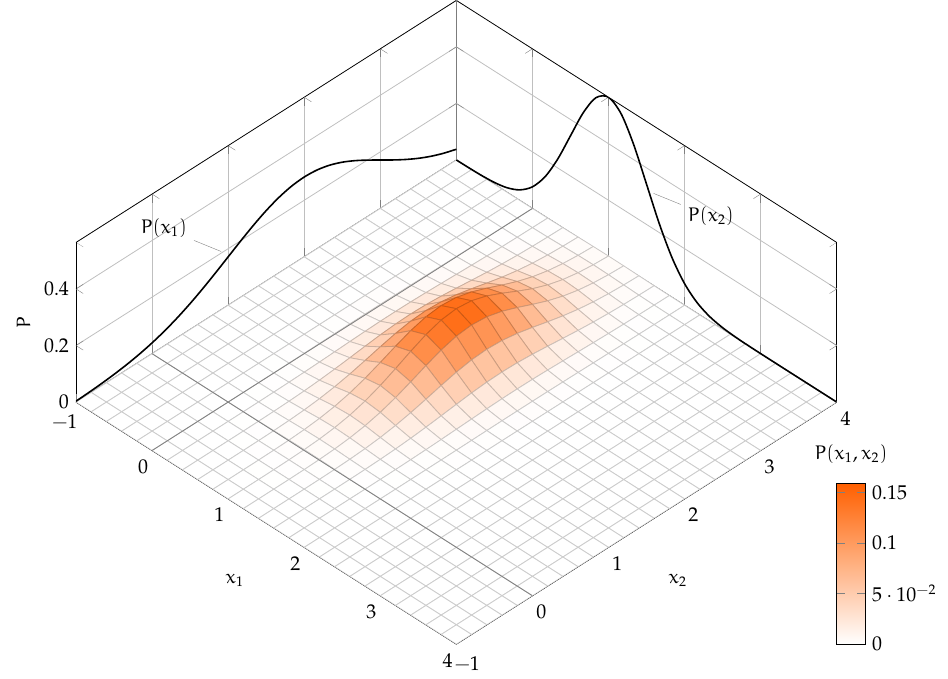

  * [normal_bivariada.pgf](https://github.com/walmes/Tikz/blob/master/src/normal_bivariada.pgf)

```tex
% http://pgfplots.net/tikz/examples/bivariate-normal-distribution/

\pgfplotsset{width=7cm,compat=1.8}
\pgfplotsset{%
  colormap={whitered}{color(0cm)=(white);
    color(1cm)=(orange!75!red)}
}

\begin{tikzpicture}[
  declare function={mu1=1;},
  declare function={mu2=2;},
  declare function={sigma1=0.5;},
  declare function={sigma2=1;},
  declare function={
    normal(\m,\s)=1/(2*\s*sqrt(pi))*exp(-(x-\m)^2/(2*\s^2));
  },
  declare function={
    bivar(\ma,\sa,\mb,\sb)=
    1/(2*pi*\sa*\sb)*exp(-((x-\ma)^2/\sa^2+(y-\mb)^2/\sb^2))/2;
  }]

  \begin{axis}[
    colormap name=whitered,
    width=15cm,
    view={45}{65},
    enlargelimits=false,
    grid=major,
    domain=-1:4,
    y domain=-1:4,
    samples=26,
    xlabel=$x_1$,
    ylabel=$x_2$,
    zlabel={$P$},
    colorbar,
    colorbar style={
      at={(1,0)},
      anchor=south west,
      height=0.25*\pgfkeysvalueof{/pgfplots/parent axis height},
      title={$P(x_1,x_2)$}
    }]

    \addplot3 [surf] {bivar(mu1, sigma1, mu2, sigma2)};
    \addplot3 [domain=-1:4, samples=31, samples y=0, thick, smooth]
      (x, 4, {normal(mu1, sigma1)});
    \addplot3 [domain=-1:4, samples=31, samples y=0, thick, smooth]
      (-1, x, {normal(mu2, sigma2)});

    \draw [black!50] (axis cs:-1,0,0) -- (axis cs:4,0,0);
    \draw [black!50] (axis cs:0,-1,0) -- (axis cs:0,4,0);

    \node at (axis cs:-1,1,0.18) [pin=165:$P(x_1)$] {};
    \node at (axis cs:1.5,4,0.32) [pin=-15:$P(x_2)$] {};
  \end{axis}
\end{tikzpicture}
```
****

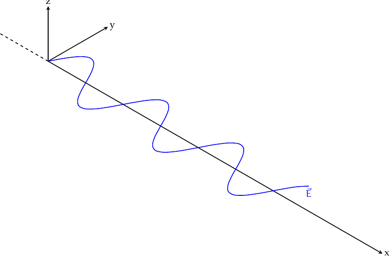

  * [onda_3d.pgf](https://github.com/walmes/Tikz/blob/master/src/onda_3d.pgf)

```tex
\begin{tikzpicture}[
  x={(0.866cm,-0.5cm)},
  y={(0.866cm,0.5cm)},
  z={(0cm,1cm)},
  scale=1.0,
  % Option for nice arrows
  >=stealth, %
  inner sep=0pt, outer sep=2pt,%
  axis/.style={thick,->},
  wave/.style={thick,color=#1,smooth},
  polaroid/.style={fill=black!60!white, opacity=0.3}]

  % Colors
  \colorlet{darkgreen}{green!50!black}
  \colorlet{lightgreen}{green!80!black}
  \colorlet{darkred}{red!50!black}
  \colorlet{lightred}{red!80!black}
  
  % Frame
  \coordinate (O) at (0, 0, 0);
  \draw[axis] (O) -- +(14, 0,   0) node [right] {x};
  \draw[axis] (O) -- +(0,  2.5, 0) node [right] {y};
  \draw[axis] (O) -- +(0,  0,   2) node [above] {z};
  \draw[thick,dashed] (-2,0,0) -- (O);

  % Electric field vectors
  \draw[wave=blue, variable=\x,samples at={0,0.25,...,10}]
    plot (\x,{sin(2*\x r)},0)node[anchor=north]{$\vec{E}$};
\end{tikzpicture}
```
****

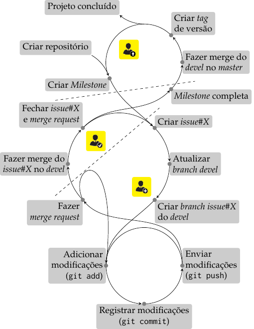

  * [PET_git_workflow.pgf](https://github.com/walmes/Tikz/blob/master/src/PET_git_workflow.pgf)

```tex
\begin{tikzpicture}[
  every path/.style={->, draw, >=stealth},
  proc/.style={rounded corners=2pt, fill=gray!40}]

  \def\radio{2}
  % \draw[gray!30] (0,0) circle (\radio cm);
  \coordinate (criaissue) at (45:\radio);
  \node[proc, above right] at (criaissue)
    {Criar \emph{issue\#X}};

  \coordinate (atuadevel) at (0:\radio);
  \node[proc, right, align=left] at (atuadevel)
    {Atualizar\\ \emph{branch devel}};

  \coordinate (criabranc) at (-45:\radio);
  \node[proc, below right, align=left] at (criabranc)
    {Criar \emph{branch issue\#X}\\ do \emph{devel}};

  \coordinate (mergerequ) at (-135:\radio);
  \node[proc, below left,  align=right] at (mergerequ)
    {Fazer\\ \emph{merge request}};

  \coordinate (mergeissu) at (180:\radio);
  \node[proc, left, align=right] at (mergeissu)
    {Fazer merge do\\ \emph{issue\#X} no \emph{devel}};

  \coordinate (fechaissu) at (135:\radio);
  \node[proc, above left, align=right] at (fechaissu)
    {Fechar \emph{issue\#X} \\ e \emph{merge request}};

  \foreach \s in {45,0,225,180}{
    \draw[black] (\s:\radio) arc ({\s}:{\s-42}:\radio cm);
  }
  \draw[black] (135:\radio) arc ({135}:{135-87}:\radio cm);

  \foreach \s in {
    criaissue,atuadevel,criabranc,mergerequ,mergeissu,fechaissu}{
    \draw[draw=none, fill=gray] (\s) circle (0.5 ex);
  }

  \begin{scope}[yshift=-4cm, xshift=1cm]
    \def\radio{1.5}
    % \draw[gray!30] (0,0) circle (\radio cm);
    \coordinate (gitadd) at (180:\radio);
    \node[proc, left, align=right] at (gitadd)
      {Adicionar\\ modifica\c{c}\~{o}es\\ (\texttt{git add})};

    \coordinate (gitcommit) at at (270:\radio);
    \node[proc, below, align=center] at (gitcommit)
      {Registrar modifica\c{c}\~{o}es\\ (\texttt{git commit})};

    \coordinate (gitpush) at at (0:\radio);
    \node[proc, right, align=left] at (gitpush)
      {Enviar\\ modifica\c{c}\~{o}es\\ (\texttt{git push})};

    \foreach \s in {180,270}{
      \draw[black] (\s:\radio) arc ({\s}:{\s+86}:\radio cm);
    }
    \draw[black] (0:\radio) arc ({0}:{0+176}:\radio cm);

    \foreach \s in {gitadd,gitcommit,gitpush}{
      \draw[draw=none, fill=gray] (\s) circle (0.5 ex);
    }
  \end{scope}

  \begin{scope}[yshift=4cm, xshift=1cm]
    \def\radio{1.5}
    % \draw[gray!30] (0,0) circle (\radio cm);

    \coordinate (complemiles) at (-45:\radio);
    \node[proc, below right] at (complemiles)
      {\emph{Milestone} completa};

    \coordinate (mergedevel) at (0:\radio);
    \node[proc, right, align=left] at (mergedevel)
      {Fazer merge do\\ \emph{devel} no \emph{master}};

    \coordinate (gittag) at (45:\radio);
    \node[proc, above right, align=left] at (gittag)
      {Criar \emph{tag}\\ de vers\~{a}o};

    \coordinate (criamiles) at (205:\radio);
    \node[proc, below left] at (criamiles)
      {Criar \emph{Milestone}};

    \foreach \s in {-45,0}{
      \draw[black] (\s:\radio) arc ({\s}:{\s+41}:\radio cm);
    }
    \draw[black] (45:\radio) arc ({45}:{45+156}:\radio cm);

    \foreach \s in {complemiles,mergedevel,gittag,criamiles}{
      \draw[draw=none, fill=gray] (\s) circle (0.5 ex);
    }

    \draw[-] (200:\radio) arc (20:60:\radio) node[proc, above left]
      {Criar reposit\'{o}rio};
    \draw[->] (90:\radio) arc (270:230:\radio) node[proc, above left]
      {Projeto conclu\'{i}do};
  \end{scope}

  \path[shorten <=2pt, shorten >=2pt, -]
    (mergerequ) .. controls (-2,0) and (0,1) .. (gitadd);
  \path[shorten <=2pt, shorten >=2pt, -]
    (criabranc) to[out=-135, in=90] (gitadd);
  \path[shorten <=2pt, shorten >=2pt]
    (gitpush) .. controls (2.5,-1.5) and (-0.25,-2.75) .. (mergerequ);
  \path[shorten <=2pt, shorten >=2pt]
    (fechaissu) to[out=45, in=225] (complemiles);
  \path[shorten <=2pt, shorten >=2pt, -]
    (criamiles) to[out=-65, in=135] (criaissue);

  \draw[-, dashed] (-2.5,-1.25) -- (1.6,2.2);
  \draw[-, dashed] (-2.5,2.5) -- (3,3.25);

  \def\size{1.2}
  \node[rounded corners=2pt, fill=yellow, align=center]
    (devel) at (0.9,-0.9)
    {\includegraphics[scale=\size]{/home/walmes/Dropbox/tikz/developer.png}};
  \node[rounded corners=2pt, fill=yellow, align=center]
    (master) at (-0.9,0.9)
    {\includegraphics[scale=\size]{/home/walmes/Dropbox/tikz/master.png}};
  \node[rounded corners=2pt, fill=yellow, align=center]
    (owner) at (0.4,4.5)
    {\includegraphics[scale=\size]{/home/walmes/Dropbox/tikz/owner.png}};

\end{tikzpicture}
```
****


  * [pet_logo1.pgf](https://github.com/walmes/Tikz/blob/master/src/pet_logo1.pgf)

```tex
\begin{tikzpicture}
  % Essas definicoes tem que ficar aqui para nao dar esaco extra.
  \def\vone{0.4}
  \def\fone{1.4}
  \def\vtwo{0.105}
  \def\ftwo{1.4}
  \def\thecircle{(0,0.75) circle (1cm)}
  \def\thelowergauss{
    plot[id=x, domain=-1:1]
    function{\fone*(2*pi*\vone)**(-0.5)*exp(-(x)**2/(2*\vone))}
    -- (1, -0.5) -- (-1,-0.5) -- cycle
  }
  \def\theuppergauss{
    plot[id=x, domain=-1:1]
    function{\ftwo*(2*pi*\vtwo)**(-0.5)*exp(-(x)**2/(2*\vtwo))}
    -- (1, -0.5) -- (-1,-0.5) -- cycle
  }

  \begin{scope}
    \fill[blue, rounded corners=5pt] (-1.5,-0.8) rectangle (1.5,2.2);
    \fill[white] \thecircle;
  \end{scope}
  \begin{scope}
    \clip \thecircle;
    \fill[samples=100, blue] \thelowergauss;
  \end{scope}
  \begin{scope}
    \clip \thecircle;
    \fill[samples=100, blue] \theuppergauss;
  \end{scope}
  \begin{scope}
    \clip \thecircle;
    \clip \thelowergauss;
    \fill[samples=100, white] \theuppergauss;
  \end{scope}
  \draw[blue] \thecircle;
  \begin{scope}[scale=1]
    \node[color=white, text width=3cm, text centered]
    at (0, -0.5) {\footnotesize PET Estat\'istica UFPR};
  \end{scope}
\end{tikzpicture}
```
****


  * [pet_logo2.pgf](https://github.com/walmes/Tikz/blob/master/src/pet_logo2.pgf)

```tex
\begin{tikzpicture}
  % Essas definicoes tem que ficar aqui para nao dar espaco extra.
  \def\vone{0.4}
  \def\fone{1.4}
  \def\vtwo{0.105}
  \def\ftwo{1.4}
  \def\thecircle{(0,0.75) circle (1cm)}  
  \def\thelowergauss{
    plot[id=x, domain=-1:1]
    function{\fone*(2*pi*\vone)**(-0.5)*exp(-(x)**2/(2*\vone))}
    -- (1, -0.5) -- (-1,-0.5) -- cycle
  }
  \def\theuppergauss{
    plot[id=x, domain=-1:1]
    function{\ftwo*(2*pi*\vtwo)**(-0.5)*exp(-(x)**2/(2*\vtwo))}
    -- (1, -0.5) -- (-1,-0.5) -- cycle
  }

  \draw[draw=none] (0,0.75) circle (1.5cm);
  \begin{scope}
    % Circulo azul.
    \fill[blue] \thecircle;
    % Gaussiana alta branca.
    \clip \thecircle;
    \fill[samples=100, white] \theuppergauss;
  \end{scope}
  % Gaussiana baixa branca.
  \begin{scope}
    \clip \thecircle;
    \fill[samples=100, white] \thelowergauss;
  \end{scope}
  % Gaussiana baixa azul.
  \begin{scope}
    \clip \theuppergauss;
    \clip \thecircle;
    \fill[samples=100, blue] \thelowergauss;
  \end{scope}

  % Contorno.
  \draw[blue, thin] \thecircle;

%   % Texto.
%   % \draw[yshift=0.75cm, red] (-0:1.2cm) arc (-0:180:1.2cm);
  \path [
%     draw = orange,
    yshift = 0.75cm,
    postaction = {decorate,
      decoration = {
        raise=-1ex,
        text along path,
        reverse path,
        text align = center,
        text color = blue,
        text={|\small|PET Estat{\'i}stica {$\cdot$} UFPR}
      }
    }] (-0:1.2cm) arc (-0:180:1.2cm);

\end{tikzpicture}
```
****

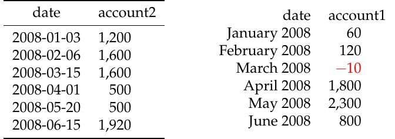

  * [pgfplotstable_pgfcalendar.pgf](https://github.com/walmes/Tikz/blob/master/src/pgfplotstable_pgfcalendar.pgf)

```tex
% \usepackage{siunitx} da conflito com formatacao de datas do
% \usepackage{pgfcalendar}.

\pgfplotstableread{
  date        account1  account2  account3
  2008-01-03  60        1200      400
  2008-02-06  120       1600      410
  2008-03-15  -10       1600      410
  2008-04-01  1800      500       410
  2008-05-20  2300      500       410
  2008-06-15  800       1920      410
}\accounts

% requires: \usepackage{pgfcalendar}

\pgfplotstableset{columns={date, account2}}
\pgfplotstabletypeset[
  every head row/.style={
    before row=\toprule,after row=\midrule},
  every last row/.style={
    after row=\bottomrule},
  columns/date/.style={string type},
  columns/account2/.style={fixed, dec sep align}]
\accounts

% Pacote siunitx tem conflito com o pgfcalendar. Eles nao podem
% coexistir no preambulo. O siunitx eh mais util e sera mantido.

\hspace{1cm}

\pgfplotstabletypeset[
  columns={date, account1},
  column type=r,
  columns/date/.style={date type={\monthname\ \year}},
  columns/account1/.style={
  fixed, dec sep align,
  fonts by sign={}{\color{red}}
  }]
\accounts
```
****

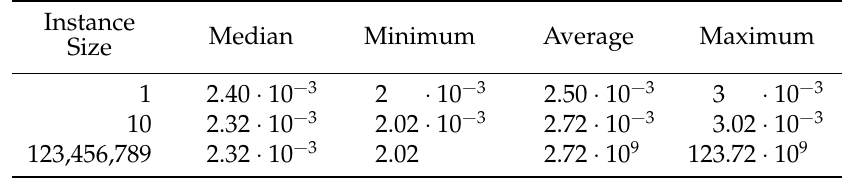

  * [pgfplotstable_sunitx.pgf](https://github.com/walmes/Tikz/blob/master/src/pgfplotstable_sunitx.pgf)

```tex
\pgfplotstableread{
  size        min         max         avg         med
  1           2e-03       3e-03       2.5e-03     2.4e-03
  10          2.02e-03    3.02e-03    2.72e-03    2.32e-03
  123456789   2.02        123.72e9    2.72e9      2.32e-03
}{\loadedtable}

% require \usepackage{sunitx}
\sisetup{
  math-rm=\mathrm,
  text-rm=\rmfamily,
  table-format=3.2e+3,
  round-precision=2,
  round-mode=places,
  scientific-notation=engineering,
  group-digits=integer,
  group-separator={,},
  exponent-product=\cdot,
}

\pgfplotstabletypeset[
  header=true,
  string type,
  multicolumn names,
  columns={size,med,min,avg,max},
  assign column name/.code={
    \pgfkeyssetvalue{/pgfplots/table/column name}{
      \multicolumn{1}{c}{\multirow{2}{*}{#1}}
    }
  },
  columns/size/.style={
    column name={\shortstack{Instance\\Size}},
    column type={S[scientific-notation=false, table-format=9]},
    int detect
  },
  columns/min/.style={column name=Minimum, column type=S},
  columns/avg/.style={column name=Average, column type=S},
  columns/med/.style={column name=Median, column type=S},
  columns/max/.style={column name=Maximum, column type=S},
  every head row/.style={
    before row=\toprule,
    after row=\\ \midrule
  },
  every last row/.style={after row=\bottomrule}]{\loadedtable}
```
****

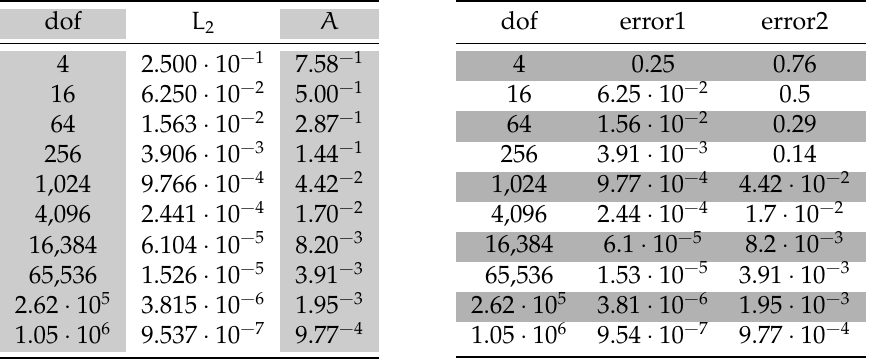

  * [pgfplotstable1.pgf](https://github.com/walmes/Tikz/blob/master/src/pgfplotstable1.pgf)

```tex
% requires \usepackage{booktabs,colortbl}

% Tabela em linha. Separador de campo eh o espaco.
\pgfplotstableread{
level   dof     error1  error2  info    grad(log(dof),log(error2))      quot(error1)    
1       4       2.50000000e-01  7.57858283e-01  48      0                   0   
2       16      6.25000000e-02  5.00000000e-01  25      -3.00000000e-01 4       
3       64      1.56250000e-02  2.87174589e-01  41      -3.99999999e-01 4       
4       256     3.90625000e-03  1.43587294e-01  8       -5.00000003e-01 4       
5       1024    9.76562500e-04  4.41941738e-02  22      -8.49999999e-01 4       
6       4096    2.44140625e-04  1.69802322e-02  46      -6.90000001e-01 4       
7       16384   6.10351562e-05  8.20091159e-03  40      -5.24999999e-01 4       
8       65536   1.52587891e-05  3.90625000e-03  48      -5.35000000e-01 3.99999999e+00  
9       262144  3.81469727e-06  1.95312500e-03  33      -5.00000000e-01 4.00000001e+00  
10      1048576 9.53674316e-07  9.76562500e-04  2       -5.00000000e-01 4.00000001e+00  
}\loadedtable

\pgfplotstabletypeset[
  columns={dof, error1, error2},
  columns/error1/.style={
    column name=$L_2$,
    sci, sci zerofill,
    precision=3
  },
  columns/error2/.style={
    column name=$A$,
    sci, sci zerofill, sci superscript,
    precision=2
  },
  every head row/.style={
    before row=\toprule,
    after row=\midrule
  },
  every last row/.style={
    after row=\bottomrule
  },
  every even column/.style={
    column type/.add={>{\columncolor[gray]{.8}}}{}
  }]\loadedtable

\hspace{1cm}

\pgfplotstabletypeset[
  columns={dof, error1, error2},
  every even row/.style={
    before row={\rowcolor[gray]{0.7}}
  },
  every head row/.style={
    before row=\toprule,after row=\midrule
  },
  every last row/.style={
    after row=\bottomrule
  }]\loadedtable
```
****

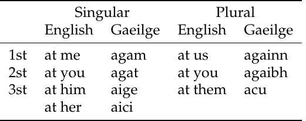

  * [pgfplotstable2.pgf](https://github.com/walmes/Tikz/blob/master/src/pgfplotstable2.pgf)

```tex
% \usepackage{booktabs}

\pgfplotstabletypeset[
  column type=l,
  every head row/.style={
    before row={%
      \toprule
      & \multicolumn{2}{c}{Singular}
      & \multicolumn{2}{c}{Plural}\\
    },
    after row=\midrule,
  },
  every last row/.style={
    after row=\bottomrule
  },
  columns/person/.style={column name=},
  columns/singGaeilge/.style={column name=Gaeilge},
  columns/pluralGaeilge/.style={column name=Gaeilge},
  columns/singEnglish/.style={column name=English},
  columns/pluralEnglish/.style={column name=English},
  col sep=&, row sep=\\, string type]{
  person & singEnglish & singGaeilge & pluralEnglish & pluralGaeilge \\
  1st    & at me       & agam        & at us         & againn        \\
  2st    & at you      & agat        & at you        & agaibh        \\
  3st    & at him      & aige        & at them       & acu           \\
         & at her      & aici        &               &               \\
}
```
****

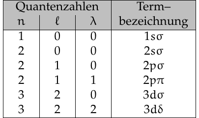

  * [pgfplotstable3.pgf](https://github.com/walmes/Tikz/blob/master/src/pgfplotstable3.pgf)

```tex
% A centered fixed-width-column.
\newcolumntype{C}{>{\centering\arraybackslash}p{6mm}}

\pgfplotstabletypeset[
  col sep=&, row sep=\\,
  every head row/.style={
    before row={
      \hline
      \rowcolor{lightgray}
      \multicolumn{3}{|>{\columncolor{lightgray}}c|}{Quantenzahlen} & Term--\\
      \rowcolor{lightgray}
    },
    after row=\hline,
  },
  every last row/.style={after row=\hline},
  columns/n/.style={column type=|C,column name=$n$},
  columns/l/.style={column type=|C,column name=$\ell$},
  columns/lambda/.style={column type=|C,column name=$\lambda$},
  columns/text/.style={column type=|c|,column name=bezeichnung,
    string type
  }]{
  n & l & lambda & text        \\
  1 & 0 & 0      & $1 s\sigma$ \\
  2 & 0 & 0      & $2 s\sigma$ \\
  2 & 1 & 0      & $2 p\sigma$ \\
  2 & 1 & 1      & $2 p \pi $  \\
  3 & 2 & 0      & $3 d\sigma$ \\
  3 & 2 & 2      & $3 d\delta$ \\
}
```
****

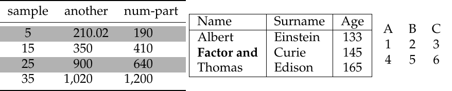

  * [pgfplotstable5.pgf](https://github.com/walmes/Tikz/blob/master/src/pgfplotstable5.pgf)

```tex
% http://tex.stackexchange.com/questions/131081/how-can-i-center-and-decimal-align-a-pgfplots-table

\begin{filecontents}{measurements.dat}
  sample num-bugs num-part other-measure another
  5       80      190        200        210.02
  15      520     410.00     430        350
  25      650     640        630.2      900
  35     1100     1200       1150       1020
\end{filecontents}

\pgfplotstabletypeset[
  assign column name/.code=\pgfkeyssetvalue{
    /pgfplots/table/column name}{{{#1}}},
  columns={sample, another, num-part},
  every head row/.style={
    before row={\toprule},
    after row={\midrule}
  },
  every last row/.style={
    after row={\bottomrule}
  },
  every even row/.style={
    before row={\rowcolor[gray]{0.7}}
  },
  columns/sample/.style={
    assign column name={Sample}, 
  },
  columns/another/.style={%
    assign column name={Another},
    dec sep align,
    precision=2
  }, 
  columns/num-part/.style={%
    assign column name={Num-Part},
    dec sep align,
  }]{measurements.dat}
  
%-----------------------------------------------------------------------
% http://tex.stackexchange.com/questions/86070/align-right-in-table-if-no-expression

\begin{filecontents*}{scientists.csv}
  name,surname,age
  Albert,Einstein,133
  Factor and,Curie,145 % add the word and just to illustrate
  Thomas,Edison,165
\end{filecontents*}

\pgfplotstabletypeset[
  col sep=comma,
  string type,
  columns/name/.style={
    column name=Name,
    column type={|l},
    string replace*={Factor}{\bfseries Factor}
  },
  columns/surname/.style={
    column name=Surname,
    column type={|l}
  },
  columns/age/.style={
    column name=Age,
    column type={|c|}
  },
  every head row/.style={
    before row=\hline,
    after row=\hline
  },
  every last row/.style={
    after row=\hline
  }]{scientists.csv}

%-----------------------------------------------------------------------

% The '%' is important. Otherwise, the newline here would delimit an
% (empty) row.
\pgfplotstabletypeset[skip first n=4]{% <- important!
  XYZ Format,
  Version 1.234
  Date 2010-09-01
  @author Mustermann
  A B C
  1 2 3
  4 5 6
}
```
****

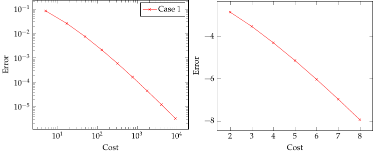

  * [plot_logaxis.pgf](https://github.com/walmes/Tikz/blob/master/src/plot_logaxis.pgf)

```tex
\begin{tikzpicture}
  \begin{loglogaxis}[
    xlabel=Cost,
    ylabel=Error]
    \addplot[color=red, mark=x] coordinates {
      (5,    8.31160034e-02)
      (17,   2.54685628e-02)
      (49,   7.40715288e-03)
      (129,  2.10192154e-03)
      (321,  5.87352989e-04)
      (769,  1.62269942e-04)
      (1793, 4.44248889e-05)
      (4097, 1.20714122e-05)
      (9217, 3.26101452e-06)
    };
    \legend{Case 1,Case 2}
  \end{loglogaxis}
\end{tikzpicture}

\begin{tikzpicture}
  \begin{axis}[
    xlabel=Cost,
    ylabel=Error]
    \addplot[color=red,mark=x] coordinates {
      (2,-2.8559703)
      (3,-3.5301677)
      (4,-4.3050655)
      (5,-5.1413136)
      (6,-6.0322865)
      (7,-6.9675052)
      (8,-7.9377747)
    };
  \end{axis}
\end{tikzpicture}
```
****

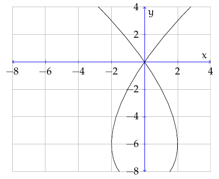

  * [plot_parametric.pgf](https://github.com/walmes/Tikz/blob/master/src/plot_parametric.pgf)

```tex
%% http://tex.stackexchange.com/questions/65719/plotting-parametric-curves

\pgfplotsset{
  every axis/.append style={
    axis x line=middle, % put the x axis in the middle
    axis y line=middle, % put the y axis in the middle
    axis line style={<->,color=blue}, % arrows on the axis
    xlabel={$x$}, % default put x on x-axis
    ylabel={$y$}, % default put y on y-axis
  }}

\begin{tikzpicture}
  \begin{axis}[
    xmin=-8,xmax=4,
    ymin=-8,ymax=4,
    grid=both]
    \addplot [domain=-3:3,samples=50] ({x^3-3*x},{3*x^2-9}); 
  \end{axis}
\end{tikzpicture}
```
****

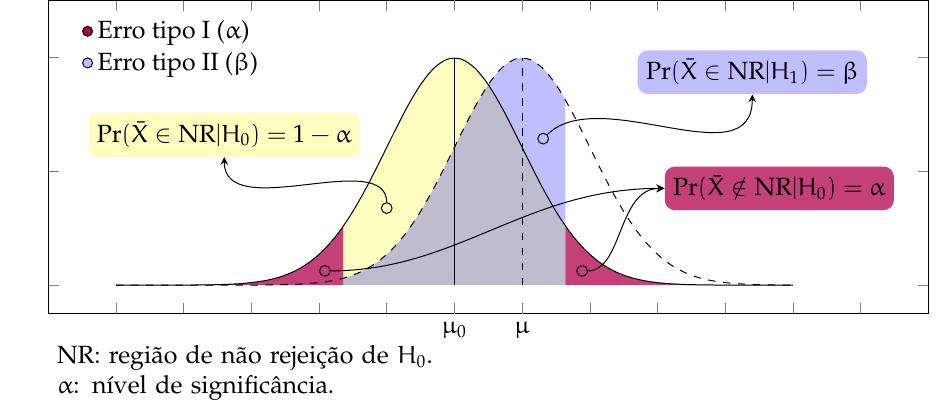

  * [poderTesteMedia.pgf](https://github.com/walmes/Tikz/blob/master/src/poderTesteMedia.pgf)

```tex
\def\zleft{-1.64}
\def\zright{1.64}
\def\muzero{0}
\def\muone{1}

\pgfplotsset{
  myplot/.style={
    width=14cm, height=6cm,
    % xlabel=$z$, ylabel=$f(z)$,
    samples=50,
    xmin=-6, xmax=7,
    ymax=0.5,
    xlabel style={at={(1,0)}, anchor=west},
    ylabel style={rotate=-90, at={(0,1)}, anchor=south west},
    legend style={draw=none, fill=none},
    xticklabels=\empty,
    yticklabels=\empty,
    legend pos=north west,
    legend cell align=left,
    clip=false, % Para anotar fora da area grafica.
    % extra tick style={grid=major}
  }
}

\begin{tikzpicture}[
  >=stealth,
  every node/.style={rounded corners},
  Red/.style={draw=none, text opacity=1, fill=red!70!blue, fill
    opacity=0.75},
  Yellow/.style={draw=none, text opacity=1, fill=yellow, fill
    opacity=0.25},
  Blue/.style={draw=none, text opacity=1, fill=blue, fill
    opacity=0.25},
  declare function={
    normalpdf(\x,\mu,\sigma) =
    (2*3.1415*\sigma^2)^(-0.5)*exp(-(\x-\mu)^2/(2*\sigma^2));
  }]

  \begin{axis}[
    myplot,
    extra x ticks={\muzero,\muone},
    extra x tick labels={$\mu_0$,$\mu$}]

    % Legenda.
    \addlegendentry{Erro tipo I ($\alpha$)}
    \addlegendimage{only marks, mark=*, fill=red!70!blue}
    \addlegendentry{Erro tipo II ($\beta$)}
    \addlegendimage{only marks, mark=*, fill=blue, fill opacity=0.25}

    % Regioes preenchidas.
    \addplot[Red, smooth, domain=-5:\zleft]
      {normalpdf(x,\muzero,1)} \closedcycle;
    \addplot[Red, smooth, domain=\zright:5]
      {normalpdf(x,\muzero,1)} \closedcycle;
    \addplot[Yellow, smooth, domain=\zleft:\zright]
      {normalpdf(x,\muzero,1)} \closedcycle;
    \addplot[Blue, smooth, domain=\zleft:\zright]
      {normalpdf(x,\muone,1)} \closedcycle;

    % Curvas.
    \addplot[smooth, domain=-5:5] {normalpdf(x,\muzero,1)};
    \addplot[smooth, dashed, domain=-5:5] {normalpdf(x,\muone,1)};

    % Verticais das medias.
    \addplot[ycomb, mark=none, samples at={\muzero}]
      {normalpdf(x,\muzero,1)};
    \addplot[ycomb, mark=none, samples at={\muone}, dashed]
      {normalpdf(x,\muone,1)};

    % Setas e anotacoes.
    \path[o->, draw] (axis cs: -1,0.125)
      to[out=90, in=-90] (axis description cs: 0.2,0.5)
      node[Yellow, above] {$\Pr(\bar{X}\in \text{NR}|H_0)=1-\alpha$};
    \path[o->, draw] (axis cs: 1.25,0.25)
      to[out=45, in=-90] (axis description cs: 0.8,0.7)
      node[Blue, above] {$\Pr(\bar{X}\in \text{NR}|H_1)=\beta$};
    \path[o->, draw] (axis cs: -2,0.025)
      to[out=0, in=180] (axis description cs: 0.7,0.4)
      node[Red, right] {$\Pr(\bar{X}\notin \text{NR}|H_0)=\alpha$};
    \path[o->, draw] (axis cs: 1.8,0.025)
      to[out=0, in=180] (axis description cs: 0.7,0.4);

    \node[below right, text width=10cm]
      at (axis description cs: 0, -0.075)
      {NR: regi\~ao de n\~ao rejei\c{c}\~ao de $H_0$. \\
        $\alpha$: n\'ivel de signific\^ancia.};

  \end{axis}
\end{tikzpicture}
```
****

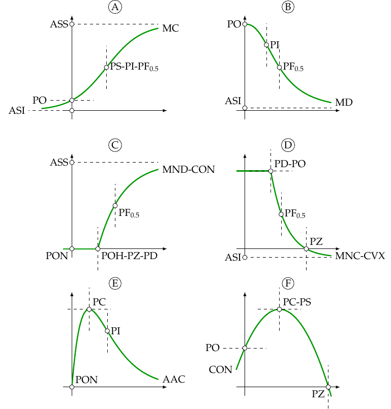

  * [points_and_shapes.pgf](https://github.com/walmes/Tikz/blob/master/src/points_and_shapes.pgf)

```tex
% http://stackoverflow.com/questions/2701902/standalone-diagrams-with-tikz

\def\ptsize{0.75pt}
\tikzset{
  mypoints/.style={fill=white,draw=black},
  pil/.style={->, shorten <=2pt, shorten >=2pt,}
}

\begin{tikzpicture}[>=latex, xscale=3, yscale=3]

  \begin{scope}
    \def\thetas{5}; \def\thetav{0.4}
    \draw[->] (-0.1,0) -- +(1.2,0);
    \draw[->] (0,-0.1) -- +(0,1.2);
    \draw[-, color=green!60!black, very thick, samples=100]
      plot[id=x, domain=-0.35:1]
      function{1/(1+exp(-\thetas*(x-\thetav)))}
      node[right, color=black] {MC};
    \draw[dashed] (0,1) -- (1,1);
    \fill[mypoints] (0,1) circle (\ptsize) node[left] {ASS};
    \draw[dashed] (0,0) -- (-0.5,0) node[left] {ASI};
    \fill[mypoints] (0,0) circle (\ptsize);
    \draw[dashed] ($(-0.25,0)+1/(1+exp(\thetas*\thetav))*(0,1)$)
      node[left] {PO} -- +(0.5,0);
    \fill[mypoints] ($(0,0)+1/(1+exp(\thetas*\thetav))*(0,1)$)
      circle (\ptsize);
    \draw[dashed] (\thetav,0.25) -- +(0,0.5);
    \fill[mypoints] (\thetav,0.5) circle (\ptsize)
      node[right] {PS-PI-PF$_{0.5}$};
    \node[draw, circle, inner sep=1pt] at (0.5,1.2) {A};
  \end{scope}

  \begin{scope}[xshift=2.0cm]
    \def\tpo{1}; \def\tc{2.5}; \def\tv{0.4}
    \draw[->] (-0.1,0) -- +(1.2,0);
    \draw[->] (0,-0.1) -- +(0,1.2);
    \draw[color=green!60!black, very thick, smooth, samples=100]
      plot[id=x, domain=0:1]
      function{\tpo/(1+(x/\tv)**\tc)}
      node[right, black] {MD};
    \draw[dashed] (\tv,0.5-0.25) -- +(0,0.5);
    \fill[mypoints] (\tv,0.5) circle (\ptsize)
      node[right] {PF$_{0.5}$};
    \draw[dashed] (\tv-0.15,0.76-0.25) -- +(0,0.5);
    \fill[mypoints] (\tv-0.15,0.76) circle (\ptsize)
      node[right] {PI};
    \fill[mypoints] (0,\tpo) circle (\ptsize)
      node[left] {PO};
    \draw[dashed] (0,0.03) -- +(1,0);
    \fill[mypoints] (0,0.03) circle (\ptsize)
      node[above left] {ASI};
    \node[draw, circle, inner sep=1pt] at (0.5,1.2) {B};
  \end{scope}

  \begin{scope}[yshift=-1.6cm]
    \def\thetah{0.3}; \def\thetac{3.6}; %\def\thetac{-2.8}
    \draw[->] (-0.1,0) -- +(1.2,0);
    \draw[->] (0,-0.1) -- +(0,1.2);
    \draw[-, color=green!60!black, very thick, samples=100]
      plot[id=x, domain=-0.1:\thetah]
      function{0};
    \draw[-, color=green!60!black, very thick, samples=100]
      plot[id=x, domain=\thetah:1]  
      function{1-exp(-\thetac*(x-\thetah))} node[right, black] {MND-CON};
    \draw[dashed] (0,1) -- (1,1);
    \fill[mypoints] (0,1) circle (\ptsize)
      node[left] {ASS};
    \fill[mypoints] (0,0) circle (\ptsize)
      node[below left] {PON};
    \draw[dashed] (\thetah,0-0.25) -- +(0,0.5);
    \fill[mypoints] (\thetah,0) circle (\ptsize)
      node[below right] {POH-PZ-PD};
    \draw[dashed] (0.5,0.5-0.25) -- +(0,0.5);
    \fill[mypoints] (0.5,0.5) circle (\ptsize)
      node[below right] {PF$_{0.5}$};
    \node[draw, circle, inner sep=1pt] at (0.5,1.2) {C};
  \end{scope}

  \begin{scope}[xshift=2cm, yshift=-1.6cm]
    \def\thetah{0.3}; \def\thetac{5.6}; %\def\thetac{-2.8}
    \draw[->] (-0.1,0) -- +(1.2,0);
    \draw[->] (0,-0.1) -- +(0,1.2);
    \draw[-, color=green!60!black, very thick, samples=100]
      plot[id=x, domain=-0.1:\thetah]  
      function{0.9};
    \draw[-, color=green!60!black, very thick, samples=100]
      plot[id=x, domain=\thetah:1]  
      function{-0.1+exp(-\thetac*(x-\thetah))}
      node[right, black] {MNC-CVX};
    \draw[dashed] (0,-0.1) -- +(1,0);
    \fill[mypoints] (0,-0.1) circle (\ptsize)
      node[left] {ASI};
    \draw[dashed] (\thetah,0.9-0.25) -- +(0,0.5);
    \draw[dashed] (\thetah-0.25,0.9) -- +(0.5,0);
    \fill[mypoints] (\thetah,0.9) circle (\ptsize)
      node[above right] {PD-PO};
    \draw[dashed] (0.71,0-0.25) -- +(0,0.5);
    \fill[mypoints] (0.71,0) circle (\ptsize)
      node[above right] {PZ};
    \draw[dashed] (0.42,0.4-0.25) -- +(0,0.5);
    \fill[mypoints] (0.42,0.4) circle (\ptsize)
      node[right] {PF$_{0.5}$};
    \node[draw, circle, inner sep=1pt] at (0.5,1.2) {D};
  \end{scope}

  \begin{scope}[xshift=0cm, yshift=-3.2cm]
    \def\ty{0.9}; \def\tx{0.2}; \def\tc{0.01}
    \draw[->] (-0.1,0) -- +(1.2,0);
    \draw[->] (0,-0.1) -- +(0,1.2);
    \draw[color=green!60!black, very thick, smooth, samples=100]
      plot[id=x, domain=0:1]
      function{\ty*(x/\tx)*(1-\tc*(1-x/\tx))**(-1/\tc)}
      node[right, black] {AAC};
    \draw[dashed] (\tx,\ty-0.25) -- +(0,0.5);
    \draw[dashed] (\tx-0.25,\ty) -- +(0.5,0);
    \fill[mypoints] (\tx,\ty) circle (\ptsize)
      node[above right] {PC};
    \fill[mypoints] (0,0) circle (\ptsize)
      node[above right] {PON};
    \draw[dashed] (0.41,0.65-0.25) -- +(0,0.5);
    \fill[mypoints] (0.41,0.65) circle (\ptsize)
      node[right] {PI};
    \node[draw, circle, inner sep=1pt] at (0.5,1.2) {E};
  \end{scope}

  \begin{scope}[xshift=2cm, yshift=-3.2cm]
    \def\thetay{0.9}; \def\thetax{0.4}; \def\thetac{-2.8}
    \draw[->] (-0.1,0) -- +(1.2,0);
    \draw[->] (0,-0.1) -- +(0,1.2);
    \draw[-, color=green!60!black, very thick, samples=100]
      plot[id=x, domain=-0.1:1]  
      function{\thetay+\thetac*(x-\thetax)**2};
    \node[left] at ($(-0.1,0)+{\thetay+\thetac*(-0.1-\thetax)^2}*(0,1)$)
      {CON};
    \draw[dashed] (\thetax-0.25,\thetay) -- +(0.5,0);
    \draw[dashed] (\thetax,\thetay-0.25) -- +(0,0.5);
    \fill[mypoints] (\thetax,\thetay) circle (\ptsize)
      node[above right] {PC-PS};
    \draw[dashed] ($(-0.25,0)+{\thetay+\thetac*(-\thetax)^2}*(0,1)$)
      node[left] {PO} -- +(0.5,0);
    \fill[mypoints] ($(0,0)+{\thetay+\thetac*(-\thetax)^2}*(0,1)$)
      circle (\ptsize);
    \draw[dashed] (0.965,0-0.25) -- +(0,0.5);
    \fill[mypoints] (0.965,0) circle (\ptsize)
      node[below left] {PZ};
    \node[draw, circle, inner sep=1pt] at (0.5,1.2) {F};
  \end{scope}

\end{tikzpicture}
```
****

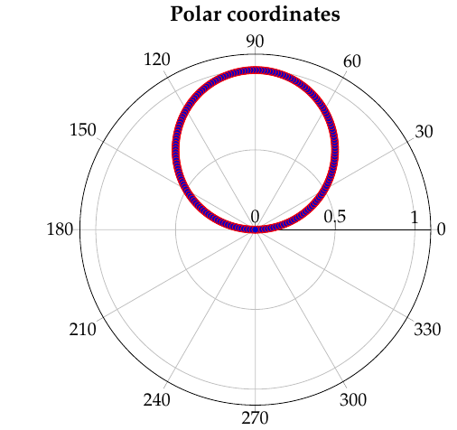

  * [polar.pgf](https://github.com/walmes/Tikz/blob/master/src/polar.pgf)

```tex
\usepgfplotslibrary{polar}

\begin{tikzpicture}
  \begin{polaraxis}[
    title=\large\bfseries{Polar coordinates}]
    \addplot+[red, domain=0:360, samples=360] {sin(\x)};
  \end{polaraxis}
\end{tikzpicture}
```
****

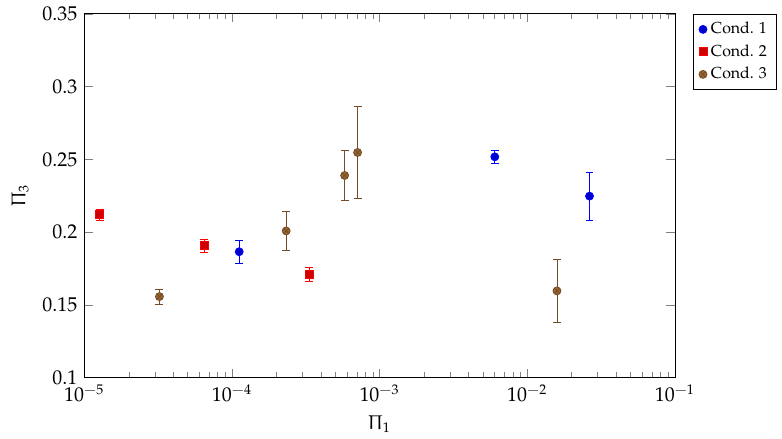

  * [ponto_erro.pgf](https://github.com/walmes/Tikz/blob/master/src/ponto_erro.pgf)

```tex
%% http://tex.stackexchange.com/questions/240180/pgfplots-conditional-data-filtering

\begin{filecontents*}{mydata.dat}
  C   P1      P2      P3      sigP3
  1   1.12E-4 0.06189 0.1865  0.0080
  1   6.03E-3 0.00000 0.2517  0.0046
  1   2.64E-2 0.00000 0.2247  0.0165
  2   6.49E-5 0.00000 0.1906  0.0043
  2   1.27E-5 0.00296 0.2120  0.0039
  2   3.34E-4 0.00865 0.1709  0.0050
  3   1.59E-2 0.01857 0.1596  0.0216
  3   7.10E-4 0.01857 0.2547  0.0316
  3   3.23E-5 0.00526 0.1557  0.0051
  3   2.33E-4 0.01857 0.2008  0.0136
  3   5.80E-4 0.01857 0.2389  0.0172
\end{filecontents*}

\pgfplotsset{
  legend cell align=right,
  legend style={font=\footnotesize,legend pos=outer north east}
}

\begin{tikzpicture}
  \begin{semilogxaxis}[
    enlargelimits=false, axis on top,
    width=12cm, height=8cm,
    xlabel={$\Pi_1$},
    ylabel={$\Pi_3$},
    ymin=0.1, ymax=0.35,
    xmin=1E-5, xmax=1E-1,
    log basis x=10]

    \pgfplotsinvokeforeach{1,2,3}{ 
      \addplot+[only marks, error bars/.cd, y dir=both, y explicit]
        table[x=P1,y=P3, y error=sigP3,
          restrict expr to domain={\thisrow{C}}{#1:#1}]{mydata.dat}; 
      \addlegendentry{Cond. #1};
    }
  \end{semilogxaxis}
\end{tikzpicture}
```
****

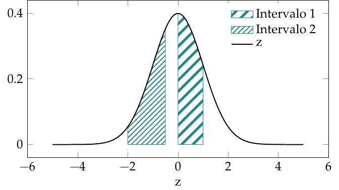

  * [preenchimento.pgf](https://github.com/walmes/Tikz/blob/master/src/preenchimento.pgf)

```tex
\makeatletter
\pgfdeclarepatternformonly[%
\hatchdistance,\hatchthickness]{flexible hatch}
{\pgfqpoint{0pt}{0pt}}
{\pgfqpoint{\hatchdistance}{\hatchdistance}}
{\pgfpoint{\hatchdistance-1pt}{\hatchdistance-1pt}}%
{
  \pgfsetcolor{\tikz@pattern@color}
  \pgfsetlinewidth{\hatchthickness}
  \pgfpathmoveto{\pgfqpoint{0pt}{0pt}}
  \pgfpathlineto{\pgfqpoint{\hatchdistance}{\hatchdistance}}
  \pgfusepath{stroke}
}
\makeatother

\begin{tikzpicture}[
  hatch distance/.store in=\hatchdistance,
  hatch distance=10pt,
  hatch thickness/.store in=\hatchthickness,
  hatch thickness=2pt]

  \begin{axis}[
    width=10cm, height=6cm,
    xlabel={z},
    axis on top,
    legend style={
      draw=none, legend cell align=left, legend plot pos=left}]

    \addplot [mark=none, domain=0:1, samples=100,
    pattern=flexible hatch, hatch distance=10pt,
    hatch thickness=2pt, draw=darkgreen, pattern color=darkgreen,
    area legend] {1/sqrt(2*pi)*exp(-x^2/2)} \closedcycle;
    \addlegendentry{Intervalo 1}

    \addplot [mark=none, domain=-2:-0.5, samples=100,
    pattern=flexible hatch, hatch distance=5pt,
    hatch thickness=0.75pt, draw=darkgreen, pattern color=darkgreen,
    area legend] {1/sqrt(2*pi)*exp(-x^2/2)} \closedcycle;    
    \addlegendentry{Intervalo 2}

    \addplot[color=black, thick, domain=-5:5, samples=100]
    {1/sqrt(2*pi)*exp(-x^2/2)};
    \addlegendentry{z}

  \end{axis}
\end{tikzpicture}
```
****

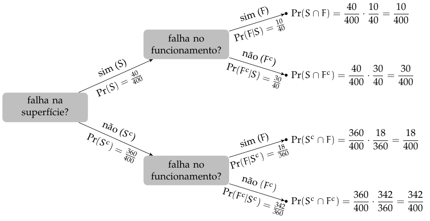

  * [probtree1.pgf](https://github.com/walmes/Tikz/blob/master/src/probtree1.pgf)

```tex
\tikzset{
  level 1/.style={level distance=3.5cm, sibling distance=4.5cm},
  level 2/.style={level distance=3.5cm, sibling distance=2.2cm},
  bag/.style={text width=8em, text centered, anchor=west,
    fill=gray!50, rounded corners, minimum height=3em},
  end/.style={circle, minimum width=3pt, fill, inner sep=0pt,
    anchor=west}
}

\begin{tikzpicture}[grow=right, sloped, ->, >=stealth']
  \node[bag] {falha na \\ superf\'icie?}
  child {
    node[bag] {falha no \\ funcionamento?}        
    child {
      node[end, label=right:
      {$\Pr(S^c\cap F^c)=\dfrac{360}{400}\cdot
        \dfrac{342}{360}=\dfrac{342}{400}$}] {}
      edge from parent
      node[above] {n\~ao $(F^c)$}
      node[below] {$\Pr(F^c|S^c)=\frac{342}{360}$}
    }
    child {
      node[end, label=right:
      {$\Pr(S^c\cap F)=\dfrac{360}{400}\cdot
        \dfrac{18}{360}=\dfrac{18}{400}$}] {}
      edge from parent
      node[above] {sim ($F$)}
      node[below] {$\Pr(F|S^c)=\frac{18}{360}$}
    }
    edge from parent 
    node[above] {n\~ao ($S^c$)}
    node[below] {$\Pr(S^c)=\frac{360}{400}$}
  }
  child {
    node[bag] {falha no \\ funcionamento?}        
    child {
      node[end, label=right:
      {$\Pr(S\cap F^c)=\dfrac{40}{400}\cdot
        \dfrac{30}{40}=\dfrac{30}{400}$}] {}
      edge from parent
      node[above] {n\~ao ($F^c$)}
      node[below] {$\Pr(F^c|S)=\frac{30}{40}$}
    }
    child {
      node[end, label=right:
      {$\Pr(S\cap F)=\dfrac{40}{400}\cdot
        \dfrac{10}{40}=\dfrac{10}{400}$}] {}
      edge from parent
      node[above] {sim ($F$)}
      node[below] {$\Pr(F|S)=\frac{10}{40}$}
    }
    edge from parent         
    node[above] {sim ($S$)}
    node[below] {$\Pr(S)=\frac{40}{400}$}
  };
\end{tikzpicture}
```
****

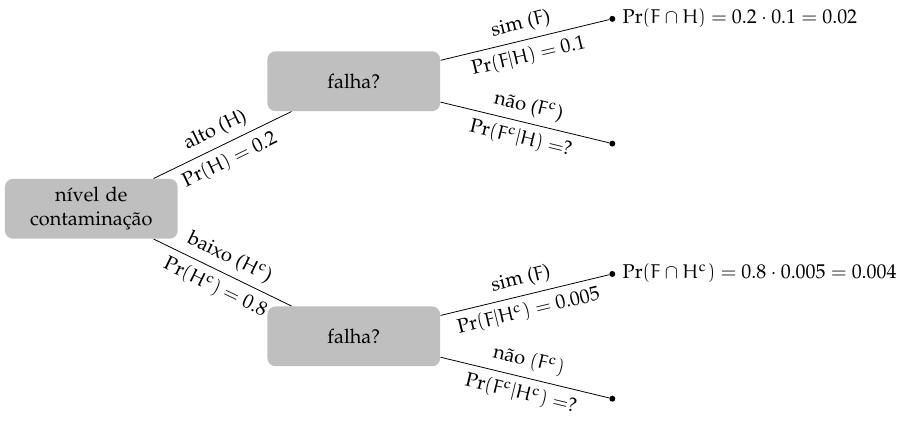

  * [probtree2.pgf](https://github.com/walmes/Tikz/blob/master/src/probtree2.pgf)

```tex
\tikzset{
  level 1/.style={level distance=3.1cm, sibling distance=4.5cm},
  level 2/.style={level distance=4.5cm, sibling distance=2.2cm},
  bag/.style={text width=8em, text centered, anchor=west,
    fill=gray!50, rounded corners, minimum height=3em},
  end/.style={circle, minimum width=3pt, fill, inner sep=0pt,
    anchor=west}
}

\begin{tikzpicture}[grow=right, sloped]
  \node[bag, text width=8em] {n\'ivel de \\ contamina\c{c}\~ao}
  child {
    node[bag] {falha?}
    child {
      node[end, label=right:
      {$$}] {}
      edge from parent
      node[above] {n\~ao $(F^c)$}
      node[below] {$\Pr(F^c|H^c)=?$}
    }
    child {
      node[end, label=right:
      {$\Pr(F\cap H^c)= 0.8\cdot 0.005=0.004$}] {}
      edge from parent
      node[above] {sim ($F$)}
      node[below] {$\Pr(F|H^c)=0.005$}
    }
    edge from parent 
    node[above] {baixo ($H^c$)}
    node[below] {$\Pr(H^c)=0.8$}
  }
  child {
    node[bag] {falha?}        
    child {
      node[end, label=right:
      {$$}] {}
      edge from parent
      node[above] {n\~ao ($F^c$)}
      node[below] {$\Pr(F^c|H)=?$}
    }
    child {
      node[end, label=right:
      {$\Pr(F\cap H) = 0.2\cdot 0.1= 0.02$}] {}
      edge from parent
      node[above] {sim ($F$)}
      node[below] {$\Pr(F|H)=0.1$}
    }
    edge from parent         
    node[above] {alto ($H$)}
    node[below] {$\Pr(H)=0.2$}
  };

\end{tikzpicture}
```
****

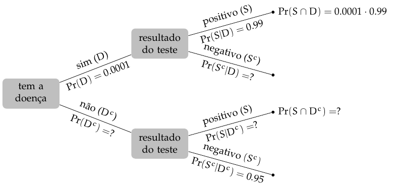

  * [probtree3.pgf](https://github.com/walmes/Tikz/blob/master/src/probtree3.pgf)

```tex
\tikzset{
  level 1/.style={level distance=3.5cm, sibling distance=3.5cm},
  level 2/.style={level distance=3.9cm, sibling distance=2.2cm},
  bag/.style={text width=5em, text centered, anchor=west,
    fill=gray!50, rounded corners, minimum height=3em},
  end/.style={circle, minimum width=3pt, fill, inner sep=0pt,
    anchor=west}
}

\begin{tikzpicture}[grow=right, sloped]
  \node[bag] {tem a doen\c{c}a}
  child {
    node[bag] {resultado do teste}
    child {
      node[end, label=right:
      {$$}] {}
      edge from parent
      node[above] {negativo $(S^c)$}
      node[below] {$\Pr(S^c|D^c)=0.95$}
    }
    child {
      node[end, label=right:
      {$\Pr(S\cap D^c)= ?$}] {}
      edge from parent
      node[above] {positivo ($S$)}
      node[below] {$\Pr(S|D^c)=?$}
    }
    edge from parent 
    node[above] {n\~ao ($D^c$)}
    node[below] {$\Pr(D^c)=?$}
  }
  child {
    node[bag] {resultado do teste}        
    child {
      node[end, label=right:
      {$$}] {}
      edge from parent
      node[above] {negativo ($S^c$)}
      node[below] {$\Pr(S^c|D)=?$}
    }
    child {
      node[end, label=right:
      {$\Pr(S\cap D) = 0.0001\cdot 0.99$}] {}
      edge from parent
      node[above] {positivo ($S$)}
      node[below] {$\Pr(S|D)=0.99$}
    }
    edge from parent         
    node[above] {sim ($D$)}
    node[below] {$\Pr(D)=0.0001$}
  };
\end{tikzpicture}
```
****

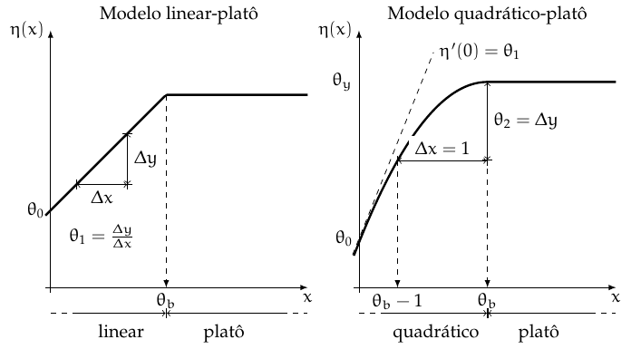

  * [quadratico_plato.pgf](https://github.com/walmes/Tikz/blob/master/src/quadratico_plato.pgf)

```tex
\tikzset{
  aponta/.style={-latex, dashed},
  eixos/.style={-latex},
  fun/.style={very thick}
}

\begin{tikzpicture}[domain=-0.2:10, xscale=0.5, yscale=0.5]

  \begin{scope}
    \draw[eixos] (-0.2,0) -- (10,0) node[below] {$x$};
    \draw[-latex] (0,-0.2) -- (0,10) node[left] (E) {$\eta(x)$};
    \def\A{3}; \def\B{1}; \def\C{4.5};
    \draw[fun]
      plot[id=x, samples=100]
      function{\A+\B*x*(x<\C)+\B*\C*(x>\C)};
    \coordinate (b) at (\C,\A+\B*\C);
    \draw (0,\A) node[left] {$\theta_0$};
    \draw[aponta] (b) -- (\C,0) node[below] {$\theta_b$};
    \draw[|<->|] (1,4) -- (3,4)
      node[midway, below, fill=white] {$\Delta x$};
    \draw[|<->|] (3,4) -- (3,6)
      node[midway, right, fill=white] {$\Delta y$};
    \node[fill=white] (b1) at (2,2)
      {$\theta_1 = \frac{\Delta y}{\Delta x}$};
    \def\desc{-1}
    \draw[->|] (1,\desc) -- (\C,\desc)
      node[midway, below=3pt] {linear};
    \draw[dashed] (0,\desc) -- (1,\desc);
    \draw[|<-] (\C,\desc) -- (9,\desc)
      node[midway, below=3pt] {plat\^o};
    \draw[dashed] (9,\desc) -- (10,\desc);
    \node[above] (titulo) at (5,10) {Modelo linear-plat{\^o}};
  \end{scope}

  \begin{scope}[xshift=12cm]
    \draw[eixos] (-0.2,0) -- (10,0) node[below] {$x$};
    \draw[-latex] (0,-0.2) -- (0,10) node[left] (E) {$\eta(x)$};
    \def\Y{8}; \def\X{5}; \def\C{-0.25};
    \draw[fun]
      plot[id=x, samples=100]
      function{\Y+\C*(x-\X)**2*(x<\X)};
    \draw[dashed]
      plot[id=x, samples=100, domain=-0.25:2.9]
      function{1.9+2.5*x}
      node[right, fill=white] {$\eta'(0) = \theta_1$};
    \coordinate (b) at (\X,\Y);
    \draw (0,1.9)  node[left] {$\theta_0$};
    \draw (0,\Y)  node[left] {$\theta_y$};
    \draw[aponta] (b) -- (\X,0) node[below] {$\theta_b$};
    \def\Xe{1.5}
    \coordinate (ye) at (\Xe,{\Y+\C*(\X-\Xe)^2});
    \draw[aponta] (ye) -- (\Xe,0) node[below] {$\theta_b-1$};
    \draw[|<->|] (ye) -- ++(\X-\Xe,0)
      node[midway, above, fill=white] {$\Delta x=1$};
    \draw[|<->|] (\X,\Y) -- (\X,4.95)
      node[midway, right, fill=white] {$\theta_2 = \Delta y$};
    \def\desc{-1}
    \draw[->|] (1,\desc) -- (\X,\desc)
      node[midway, below=3pt] {quadr{\'a}tico};
    \draw[dashed] (0,\desc) -- (1,\desc);
    \draw[|<-] (\X,\desc) -- (9,\desc)
      node[midway, below=3pt] {plat{\^o}};
    \draw[dashed] (9,\desc) -- (10,\desc);
    \node[above] (titulo) at (5,10) {Modelo quadr{\'a}tico-plat{\^o}};
  \end{scope}

\end{tikzpicture}
```
****

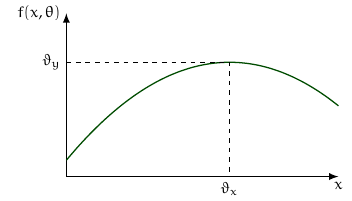

  * [quadratico.pgf](https://github.com/walmes/Tikz/blob/master/src/quadratico.pgf)

```tex
\def\by{2.1}
\def\bx{3}
\def\bc{-0.2}

\begin{tikzpicture}[domain=-3:5, xscale=1.2, yscale=1.2, >=latex]
  \draw[->, line width=1pt] (0,0) -- (5,0) node[below] {$x$};
  \draw[->, line width=1pt] (0,0) -- (0,3) node[left] {$f(x,\theta)$};
  \draw[color=green!30!black, thick, smooth]
    plot[id=x, domain=0:5] function{\by+\bc*(x-\bx)**2};
  \draw[dashed] (0, \by) node[left] {$\vartheta_y$} -| (\bx,0)
    node[below] {$\vartheta_x$};
\end{tikzpicture}
```
****

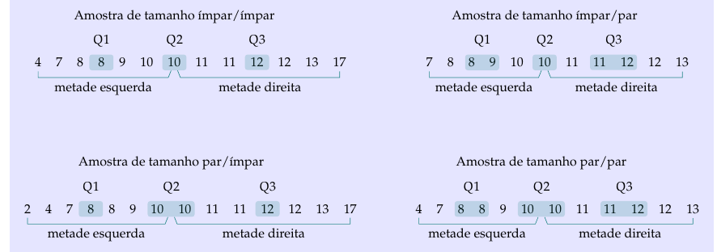

  * [quartis.pgf](https://github.com/walmes/Tikz/blob/master/src/quartis.pgf)

```tex
\tikzset{
  >=stealth',
  every path/.style={->, color=darkgreen, thin},
  every node/.style={color=black},
  cir/.style={draw, rounded corners=2pt,
    color=darkgreen, inner sep=7pt},
  mtx/.style={matrix of math nodes, column sep=1ex},
  hltr/.style={opacity=0.2,
    rounded corners=2pt, inner sep=-1pt, fill=darkgreen,
    minimum width=4ex},
  ar/.style={out=45, in=-45},
  node distance=0.5ex
}

\begin{tikzpicture}[
  background rectangle/.style={fill=blue!10!white},
  show background rectangle]

  \matrix[mtx] (A) at (-5,2){
    4 & 7 & 8 & 8 & 9 & 10 & 10 & 11 & 11 & 12 & 12 & 13 & 17 \\
  };
  %% Mediana.
  \node[hltr, fit=(A-1-7)] (q2) {};
  \node[above=of q2] (q2text) {$Q2$};
  %% 1 quartil.
  \node[hltr, fit=(A-1-4)] (q1) {};
  \node[above=of q1] (q1text) {$Q1$};
  %% 3 quartil.
  \node[hltr, fit=(A-1-10)] (q3) {};
  \node[above=of q3] (q3text) {$Q3$};
  \draw[-] (q2) -- ++(1ex,-2.5ex) -|
    node[near start, below] {metade direita} (A-1-13);
  \draw[-] (q2) -- ++(-1ex,-2.5ex) -|
    node[near start, below] {metade esquerda} (A-1-1);
  \node[above=of q2text] {Amostra de tamanho \'impar/\'impar};

  \matrix (B) at (5,2) [mtx] {
    7 & 8 & 8 & 9 & 10 & 10 & 11 & 11 & 12 & 12 & 13 \\
  };
  %% Mediana.
  \node[hltr, fit=(B-1-6)] (q2) {};
  \node[above=of q2] (q2text) {$Q2$};
  %% 1 quartil.
  \node[hltr, fit=(B-1-3)(B-1-4)] (q1) {};
  \node[above=of q1] (q1text) {$Q1$};
  %% 3 quartil.
  \node[hltr, fit=(B-1-8)(B-1-9)] (q3) {};
  \node[above=of q3] (q3text) {$Q3$};
  \draw[-] (q2) -- ++(1ex,-2.5ex) -|
    node[near start, below] {metade direita} (B-1-11);
  \draw[-] (q2) -- ++(-1ex,-2.5ex) -|
    node[near start, below] {metade esquerda} (B-1-1);
  \node[above=of q2text] {Amostra de tamanho \'impar/par};

  \matrix (D) at (-5,-2) [mtx] {
    2 & 4 & 7 & 8 & 8 & 9 & 10 & 10 & 11 & 11 & 12 & 12 & 13 & 17 \\
  };
  %% Mediana.
  \node[hltr, fit=(D-1-7)(D-1-8)] (q2) {};
  \node[above=of q2] (q2text) {$Q2$};
  %% 1 quartil.
  \node[hltr, fit=(D-1-4)] (q1) {};
  \node[above=of q1] (q1text) {$Q1$};
  %% 3 quartil.
  \node[hltr, fit=(D-1-11)] (q3) {};
  \node[above=of q3] (q3text) {$Q3$};
  \draw[-] (q2) -- ++(1ex,-2.5ex) -|
    node[near start, below] {metade direita} (D-1-14);
  \draw[-] (q2) -- ++(-1ex,-2.5ex) -|
    node[near start, below] {metade esquerda} (D-1-1);
  \node[above=of q2text] {Amostra de tamanho par/\'impar};

  \matrix (C) at (5,-2) [mtx] {
    4 & 7 & 8 & 8 & 9 & 10 & 10 & 11 & 11 & 12 & 12 & 13 \\
  };
  %% Mediana.
  \node[hltr, fit=(C-1-6)(C-1-7)] (q2) {};
  \node[above=of q2] (q2text) {$Q2$};
  %% 1 quartil.
  \node[hltr, fit=(C-1-3)(C-1-4)] (q1) {};
  \node[above=of q1] (q1text) {$Q1$};
  %% 3 quartil.
  \node[hltr, fit=(C-1-9)(C-1-10)] (q3) {};
  \node[above=of q3] (q3text) {$Q3$};
  \draw[-] (q2) -- ++(1ex,-2.5ex) -|
    node[near start, below] {metade direita} (C-1-12);
  \draw[-] (q2) -- ++(-1ex,-2.5ex) -|
    node[near start, below] {metade esquerda} (C-1-1);
  \node[above=of q2text] {Amostra de tamanho par/par};

  % \node[fit=(A)(B)(C)(D), draw] {};
  % \draw[help lines,step=1] (-10,-5) grid (10,5);
\end{tikzpicture}
```
****

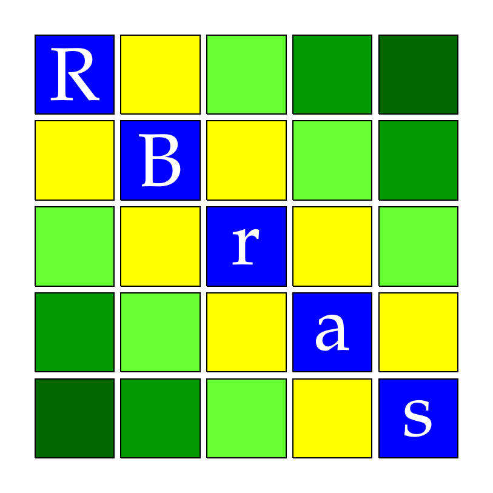

  * [rbras.pgf](https://github.com/walmes/Tikz/blob/master/src/rbras.pgf)

```tex
% Para fazer o quadrado.
\newcommand{\thesquare}[3]{%
  \def\dmin{0.04}
  \def\dmax{0.96}
  \draw[xshift = #1, yshift = #2, fill = #3]
    (\dmin, \dmin) -- (\dmax, \dmin) --
    (\dmax, \dmax) -- (\dmin, \dmax) -- (\dmin, \dmin);
}%

% Definicao das cores.
\definecolor{v3}{HTML}{006600}%
\definecolor{v2}{HTML}{009900}%
\definecolor{v1}{HTML}{66FF33}%
\definecolor{am}{HTML}{FFFF00}%
\definecolor{az}{HTML}{0000FF}%

\begin{tikzpicture}
  \def\dist{0cm}
  \thesquare{\dist}{0cm}{v3}
  \thesquare{\dist}{1cm}{v2}
  \thesquare{\dist}{2cm}{v1}
  \thesquare{\dist}{3cm}{am}
  \thesquare{\dist}{4cm}{az}

  \def\dist{1cm}
  \thesquare{\dist}{0cm}{v2}
  \thesquare{\dist}{1cm}{v1}
  \thesquare{\dist}{2cm}{am}
  \thesquare{\dist}{3cm}{az}
  \thesquare{\dist}{4cm}{am}

  \def\dist{2cm}
  \thesquare{\dist}{0cm}{v1}
  \thesquare{\dist}{1cm}{am}
  \thesquare{\dist}{2cm}{az}
  \thesquare{\dist}{3cm}{am}
  \thesquare{\dist}{4cm}{v1}

  \def\dist{3cm}
  \thesquare{\dist}{0cm}{am}
  \thesquare{\dist}{1cm}{az}
  \thesquare{\dist}{2cm}{am}
  \thesquare{\dist}{3cm}{v1}
  \thesquare{\dist}{4cm}{v2}

  \def\dist{4cm}
  \thesquare{\dist}{0cm}{az}
  \thesquare{\dist}{1cm}{am}
  \thesquare{\dist}{2cm}{v1}
  \thesquare{\dist}{3cm}{v2}
  \thesquare{\dist}{4cm}{v3}

  \node[color = white] at (0.5, 4.5) {\Huge R};
  \node[color = white] at (1.5, 3.5) {\Huge B};
  \node[color = white] at (2.5, 2.5) {\Huge r};
  \node[color = white] at (3.5, 1.5) {\Huge a};
  \node[color = white] at (4.5, 0.5) {\Huge s};
\end{tikzpicture}%
```
****

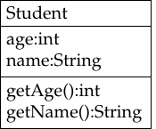

  * [rectangle_split.pgf](https://github.com/walmes/Tikz/blob/master/src/rectangle_split.pgf)

```tex
\begin{tikzpicture}
  \node[
    rectangle split,
    rectangle split parts=3,
    draw,
    text width=2.75cm]
  {Student
    \nodepart{second}
    age:int \\ name:String
    \nodepart{third}
    getAge():int \\ getName():String
  };
\end{tikzpicture}
```
****

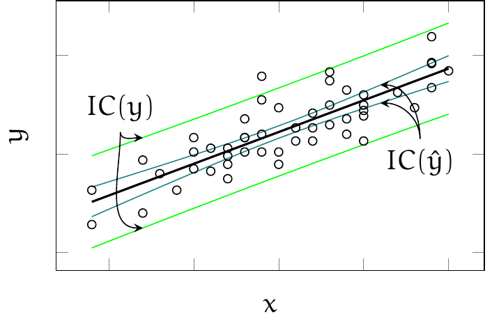

  * [reg_bands.pgf](https://github.com/walmes/Tikz/blob/master/src/reg_bands.pgf)

```tex
\begin{filecontents*}{cars.dat}
  x y
  4 1.4142135623731
  4 3.16227766016838
  7 2
  7 4.69041575982343
  8 4
  9 3.16227766016838
  10 4.24264068711928
  10 5.09901951359278
  10 5.8309518948453
  11 4.12310562561766
  11 5.29150262212918
  12 3.74165738677394
  12 4.47213595499958
  12 4.89897948556636
  12 5.29150262212918
  13 5.09901951359278
  13 5.8309518948453
  13 5.8309518948453
  13 6.78232998312527
  14 5.09901951359278
  14 6
  14 7.74596669241483
  14 8.94427190999916
  15 4.47213595499958
  15 5.09901951359278
  15 7.34846922834953
  16 5.65685424949238
  16 6.32455532033676
  17 5.65685424949238
  17 6.32455532033676
  17 7.07106781186548
  18 6.48074069840786
  18 7.48331477354788
  18 8.71779788708135
  18 9.16515138991168
  19 6
  19 6.78232998312527
  19 8.24621125123532
  20 5.65685424949238
  20 6.92820323027551
  20 7.21110255092798
  20 7.48331477354788
  20 8
  22 8.12403840463596
  23 7.34846922834953
  24 8.36660026534076
  24 9.59166304662544
  24 9.64365076099295
  24 10.9544511501033
  25 9.21954445729289
\end{filecontents*}

\begin{filecontents*}{predcars.dat}
 x    fit    lwr    upr    LWR     UPR
 4 2.5667 1.8154 3.3179 0.2263  4.9070
 5 2.8891 2.1918 3.5863 0.5655  5.2127
 6 3.2110 2.5672 3.8558 0.9032  5.5197
 7 3.5339 2.9412 4.1266 1.2395  5.8283
 8 3.8563 3.3135 4.3991 1.5743  6.1383
 9 4.1787 3.6836 4.6738 1.9076  6.4499
10 4.5011 4.0508 4.9515 2.2393  6.7629
11 4.8235 4.4140 5.2330 2.5695  7.0776
12 5.1460 4.7722 5.5197 2.8981  7.3938
13 5.4684 5.1235 5.8132 3.2252  7.7116
14 5.7900 5.4663 6.1153 3.5506  8.0309
15 6.1132 5.7988 6.4276 3.8745  8.3519
16 6.4356 6.1201 6.7511 4.1967  8.6745
17 6.7580 6.4302 7.0858 4.5174  8.9986
18 7.0804 6.7304 7.4304 4.8364  9.3244
19 7.4028 7.0224 7.7833 5.1539  9.6518
20 7.7253 7.3079 8.1426 5.4698  9.9807
21 8.0477 7.5886 8.5067 5.7841 10.3112
22 8.3701 7.8656 8.8745 6.0969 10.6433
23 8.6925 8.1399 9.2451 6.4081 10.9769
24 9.0149 8.4120 9.6178 6.7178 11.3120
25 9.3373 8.6825 9.9921 7.0261 11.6485
\end{filecontents*}

\begin{tikzpicture}[>=stealth]
  \begin{axis}[
    width=7cm, height=5cm,
    xlabel=$x$,
    ylabel=$y$,
    xticklabels=\empty,
    yticklabels=\empty]

    \addplot[only marks, mark=o, mark size=1.5]
      table[x=x, y=y] {cars.dat};
    \addplot[color=black, thick]
      table[x=x, y=fit] {predcars.dat};
    \addplot[color=darkgreen]
      table[x=x, y=lwr, mark=none] {predcars.dat};
    \addplot[color=darkgreen]
      table[x=x, y=upr, mark=none] {predcars.dat};
    \addplot[color=green]
      table[x=x, y=LWR, mark=none] {predcars.dat};
    \addplot[color=green]
      table[x=x, y=UPR, mark=none] {predcars.dat};

    \node (y) at (axis description cs:0.15,0.6) {$IC(y)$};
    \coordinate (yu) at (axis cs:7,5.82);
    \coordinate (yl) at (axis cs:7,1.24);
    \path[draw, ->] (y) to[out=-90, in=180] (yu);
    \path[draw, ->] (y) to[out=-90, in=180] (yl);

    \node (mu) at (axis description cs:0.85,0.4) {$IC(\hat{y})$};
    \coordinate (muu) at (axis cs:21,7.58);
    \coordinate (mul) at (axis cs:21,8.50);
    \path[draw, ->] (mu) to[out=90, in=0] (muu);
    \path[draw, ->] (mu) to[out=90, in=0] (mul);

  \end{axis}
\end{tikzpicture}
```
****

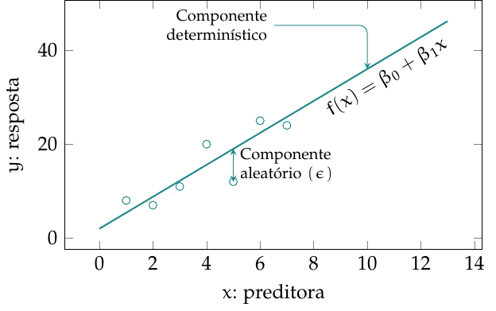

  * [reg_components.pgf](https://github.com/walmes/Tikz/blob/master/src/reg_components.pgf)

```tex
\begin{tikzpicture}[
  >=stealth,
  cx/.style={color=black, text width=2cm, font=\footnotesize},
  pil/.style={->, color=darkgreen, rounded corners},
  every node/.style={color=black}]

  \begin{axis}[
    width=9cm, height=6cm,
    xlabel=$x$: preditora, ylabel=$y$: resposta]

    \addplot[color=darkgreen, thick, mark=none, domain=0:13] {2+3.4*x}
      node[pos=0.8, sloped, below] {$f(x)=\beta_0+\beta_1 x$};
    \addplot[color=darkgreen, only marks, mark=o]
      coordinates {
        (1,8)
        (2,7)
        (3,11)
        (4,20)
        (5,12)
        (6,25)
        (7,24)
      };
    \coordinate (pontoreta) at (axis cs: 10, 36);
    \coordinate (yfit) at (axis cs: 5, 19);
    \coordinate (yobs) at (axis cs: 5, 12);
    \node[cx, align=flush right] (compdet)
      at (axis description cs: 0.35, 0.9)
      {Componente determin\'{i}stico};
    \draw[pil] (compdet) -| (pontoreta);
    \draw[pil, <->] (yfit) -- node[cx, right]
      {Componente aleat\'{o}rio $(\epsilon)$} (yobs);

  \end{axis}
\end{tikzpicture}
```
****

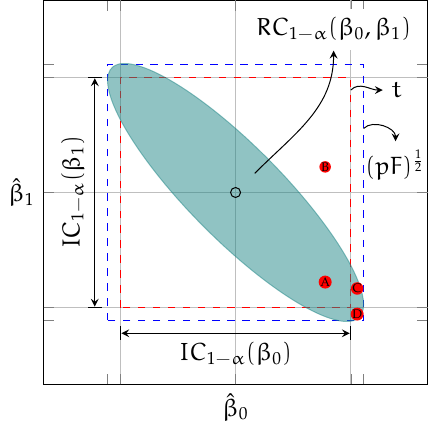

  * [reg_ellipse.pgf](https://github.com/walmes/Tikz/blob/master/src/reg_ellipse.pgf)

```tex
\begin{tikzpicture}[
  >=stealth,
  tx/.style={circle=1pt, inner sep=0pt, fill=red}]

  \begin{axis}[
    width=7cm, height=7cm,
    xmin=-3, xmax=3,
    ymin=-3, ymax=3,
    extra x ticks={0,-1.8,1.8},
    extra y ticks={0,-1.8,1.8},
    extra x tick labels={$\hat{\beta}_0$},
    extra y tick labels={$\hat{\beta}_1$},
    extra tick style={grid=major},
    xticklabels=\empty,
    yticklabels=\empty]

    \draw[fill=none, opacity=1, dashed, color=red]
      (axis cs:-1.8,-1.8) rectangle (axis cs:1.8,1.8);
    \draw[fill=none, opacity=1, dashed, color=blue]
      (axis cs:-2,-2) rectangle (axis cs:2,2);
    \path[draw, ->] (axis cs:1.8,1.6)
      to[out=45, in=180] (axis cs:2.3,1.6)
      node[right] {$t$};
    \path[draw, ->] (axis cs:2,1)
      to[out=45, in=90] (axis cs:2.5,0.8)
      node[below] {$(pF)^{\frac{1}{2}}$};

    \addplot[only marks, mark=o] coordinates { (0,0) };

    \draw[darkgreen, fill, opacity=0.5]

    \pgfextra{
      \pgfpathellipse{\pgfplotspointaxisxy{0}{0}}
      {\pgfplotspointaxisdirectionxy{-2}{1.75}}
      {\pgfplotspointaxisdirectionxy{0}{1}}
    };

    \node[anchor=north east, fill=white] (eq)
      at (axis description cs:0.98,0.98)
      {$RC_{1-\alpha}(\beta_0,\beta_1)$};

    \coordinate (in) at (axis description cs:0.55,0.55);
    \path[draw, ->] (in) to[out=45, in=-90] (eq);
    \draw[|<->|] (axis cs: -1.8,-2.2) -- node[below]
      {$IC_{1-\alpha}(\beta_0)$} (axis cs:1.8,-2.2); 
    \draw[|<->|] (axis cs: -2.2,-1.8) -- node[rotate=90, above]
      {$IC_{1-\alpha}(\beta_1)$} (axis cs:-2.2,1.8); 

    \node[tx] at (axis cs: 1.4,-1.4) {\tiny A};
    \node[tx] at (axis cs: 1.4,0.4) {\tiny B};
    \node[tx] at (axis cs: 1.9,-1.5) {\tiny C};
    \node[tx] at (axis cs: 1.9,-1.9) {\tiny D};

  \end{axis}
\end{tikzpicture}
```
****

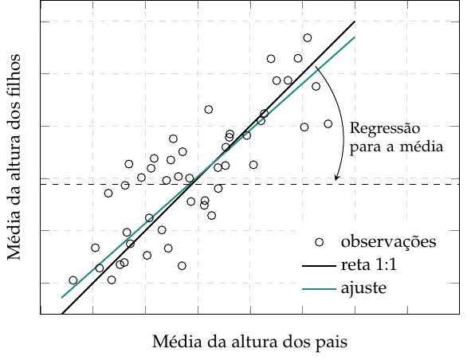

  * [reg_galton.pgf](https://github.com/walmes/Tikz/blob/master/src/reg_galton.pgf)

```tex
\begin{filecontents*}{galton.dat}
     x      y
1.9042 1.9618
1.6095 1.4159
1.6750 1.3323
1.5793 1.5033
1.7846 1.6441
1.6580 1.7589
1.8022 2.0789
1.8168 1.5724
1.5277 1.7982
2.2290 2.3234
1.8467 1.8012
1.2815 1.3210
1.5189 1.5609
1.3392 1.2647
1.4282 1.4376
2.3150 2.1893
1.0115 0.9544
2.1810 2.2179
0.9433 0.5742
2.2594 1.9946
2.2742 2.4213
1.5422 1.8452
1.4814 1.7540
2.0522 2.0247
2.0164 1.8147
1.3238 1.6789
2.3727 2.0102
1.6782 1.8770
1.7112 1.7508
1.4119 1.4921
1.3997 1.3480
1.8825 1.8111
1.4035 1.7164
1.9845 1.9546
1.2613 1.4185
2.0998 2.3210
1.6218 1.8376
1.9008 1.9458
1.1555 1.2630
1.3793 1.3378
1.6014 1.7404
1.4219 1.8182
1.5087 1.3820
1.7182 1.6391
1.8483 1.7016
1.7815 1.6210
2.0682 2.0595
1.6333 1.9390
1.8845 1.8987
2.1268 2.2169
\end{filecontents*}

\begin{tikzpicture}[>=stealth, font=\small]

  \begin{axis}[
    unit vector ratio*=1 1 1, % Para ter iso nos eixos.
    width=9cm,
    grid=major,
    grid style={dashed, gray!30},
    xlabel=M\'edia da altura dos pais,
    ylabel=M\'edia da altura dos filhos,
    xtick={1,1.25,...,3},
    ytick={1,1.25,...,2.5},
    xticklabels=\empty,
    yticklabels=\empty,
    xmin=1, xmax=3,
    ymin=1.1, ymax=2.6,
    domain=1.1:2.5,
    legend pos=south east,
    legend style={draw=none, legend cell align=left}]

    \addplot[only marks, mark=o] table {galton.dat};
    \addlegendentry{observa\c{c}\~oes};
    \addplot[thick] {x};
    \addlegendentry{reta 1:1};
    \addplot[thick, color=darkgreen] {0.2+0.89*x};
    \addlegendentry{ajuste};
    \addplot[domain=1:3, mark=none, samples=2, dashed] {1.72};

    \path[->, , shorten <=2pt, shorten >=2pt]
      (axis cs: 2.3, 2.3) edge[bend left]
      node[right, text width=1.8cm, font=\footnotesize, pos=0.65]
      {Regress\~ao para a m\'edia} (axis cs: 2.4, 1.72);

  \end{axis}
\end{tikzpicture}
```
****

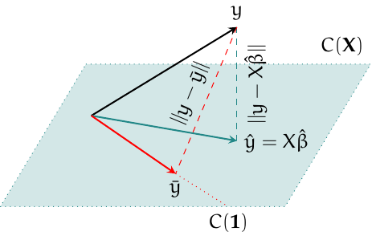

  * [reg_geom.pgf](https://github.com/walmes/Tikz/blob/master/src/reg_geom.pgf)

```tex
\begin{tikzpicture}[
  >=stealth,
  % x={(0.866cm, -0.5cm)},
  % y={(0.866cm, 0.5cm)},
  % z={(0cm, 1cm)},
  % scale=1.0,
  % inner sep=0pt,
  % outer sep=2pt,
  axis/.style={->},
  vec/.style={thick, ->},
  every node/.style={color=black}]

  \coordinate (O) at (-0.75,0.25,-0.5);
  \draw[dotted, draw=darkgreen, fill=darkgreen!20]
    (-2,0,-3.5) -- (3,0,-3.5) -- (4,0,3) -- (-1,0,3) -- cycle;
  % \draw[axis] (O) -- +(3, 0, 0) node [right] {x};
  % \draw[axis] (O) -- +(0, 2, 0) node [right] {y};
  % \draw[axis] (O) -- +(0, 0, 2) node [above] {z};
  \draw[vec] (O) -- (2, 2, 0) node [above] {$y$};
  \draw[vec, darkgreen] (O) -- (2, 0, 0)
    node[right] {$\hat{y}=X\hat{\beta}$};
  \draw[vec, red] (O) -- (1.5, 0, 1.5)
    node[below] {$\bar{y}$};
  \draw[red, dotted] (1.5,0,1.5) -- (3, 0, 3)
    node[below] {$C(\mathbf{1})$};
  \draw[dashed, darkgreen, sloped] (2, 0, 0) -- (2,2,0)
    node[midway, below] {$||y-X\hat{\beta}||$};
  \draw[red, dashed, sloped] (2,2,0) -- (1.5, 0, 1.5)
    node[midway, above] {$||y-\bar{y}||$};
  \node[above left] at (3,0,-3.5) {$C(\mathbf{X})$};
\end{tikzpicture}
```
****

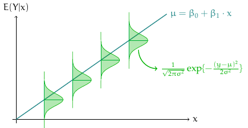

  * [reg_linear_simples.pgf](https://github.com/walmes/Tikz/blob/master/src/reg_linear_simples.pgf)

```tex
\begin{tikzpicture}[domain=0:8, scale=0.7]
  % \draw[very thin,color=gray!30] (-1.1,-1.1) grid (12.1,7.1);
  \draw[->] (-0.2,0) -- (9.2,0) node[right] {$x$};
  \draw[->] (0,-0.2) -- (0,5.5) node[above] {$E(Y|x)$};
  \draw[color=darkgreen, thick]
    plot[id=x] function{0+0.7*x}
    node[right] {$\mu = \beta_0+\beta_1\cdot x$};
  \foreach \x/\y in {1.5/1.05, 3/2.1, 4.5/3.15, 6/4.2}{
    \begin{scope}[
      xshift=\x cm, yshift=2cm +\y cm,
      rotate=-90, smooth, domain=0.5:3.5]
      \draw[color=green!70!blue] (1,0) -- (3,0);
      \draw[color=green!70!blue] (2,0) -- (2,1);
      \filldraw[
        color=green!70!black, fill opacity=0.3, fill=green!70!black]
        plot[id=x] function{exp(-(x-2)**2/0.2)};
    \end{scope}
  }
  \path[->, color=green!70!black, thick] (6.5,3.7) edge[bend right=45] 
    node[at end, right]
    {$\frac{1}{\sqrt{2\pi\sigma^2}}
      \exp\{-\frac{(y-\mu)^2}{2\sigma^2}\}$}
    +(1,-1);
\end{tikzpicture}
```
****

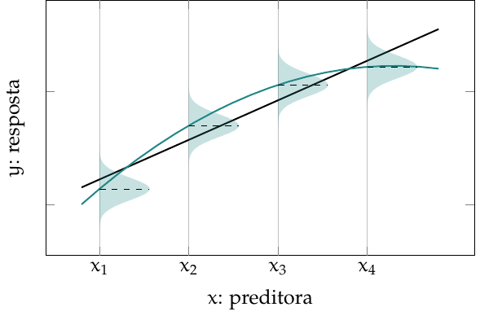

  * [reg_lof.pgf](https://github.com/walmes/Tikz/blob/master/src/reg_lof.pgf)

```tex
\begin{tikzpicture}[
  declare function={
    normal(\m,\s)=
    1/(2*\s*sqrt(pi))*exp(-(x-\m)^2/(2*\s^2));
  },
  declare function={
    reg(\x,\a,\b)=\a+\b*\x;
  },
  declare function={
    qua(\x,\a,\b,\c)=\a+\b*\x+\c*\x^2;
  },
  >=stealth,
  cx/.style={fill=white, font=\footnotesize},
  pth/.style={draw, ->, color=darkgreen}]

  \begin{axis}[
    width=9cm, height=6cm,
    xlabel=$x$: preditora,
    ylabel=$y$: resposta,
    xtick=\empty,
    xticklabels=\empty,
    yticklabels=\empty,
    extra x ticks={-0.9,-0.4,0.1,0.6},
    extra x tick labels={$x_1$,$x_2$,$x_3$,$x_4$},
    extra tick style={grid=major}]

    \addplot[color=black, thick, domain=-1:1, samples=2]
      (x, {reg(x,-0.75,3.5)});
    \addplot[color=black, thick, domain=-1:1,
      samples=20, color=darkgreen]
      (x, {qua(x,0,3,-2)});

    \draw[draw=red] (axis cs:9,9) -- node[pos=0.65, above, sloped]
      {\footnotesize $E(y) = \beta_0+\beta_1 x$} ++(axis cs:1.5,1.5);

    \pgfplotsinvokeforeach{-0.9,-0.4,0.1,0.6}{
      \addplot[domain=-2:2, samples=30,
        fill=darkgreen, fill opacity=0.25, draw=none]
        ({#1+0.5*normal(0,0.5)}, {x+qua(#1,0,3,-2)});
      \draw[dashed] (axis cs:#1, {qua(#1,0,3,-2)}) -- 
        (axis cs:#1+0.28, {qua(#1,0,3,-2)});
    }

  \end{axis}
\end{tikzpicture}
```
****

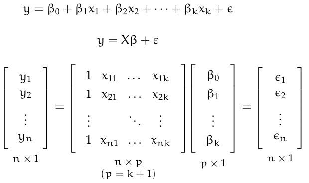

  * [reg_matricial.pgf](https://github.com/walmes/Tikz/blob/master/src/reg_matricial.pgf)

```tex
\begin{tikzpicture}[
  mtx/.style={
    matrix of math nodes,
    left delimiter={[},
    right delimiter={]}
  },
  subtxt/.style={below, font=\footnotesize}]

  \matrix[mtx] (Y) {%
    y_1 \\ y_2 \\ \vdots \\ y_n\\
  };
  \matrix[mtx, right=of Y] (X) {%
    1      & x_{11} & \ldots & x_{1k} \\
    1      & x_{21} & \ldots & x_{2k} \\
    \vdots &        & \ddots & \vdots \\
    1      & x_{n1} & \ldots & x_{nk} \\
  };
  \matrix[mtx, right=0.5cm of X] (beta) {%
    \beta_0 \\ \beta_1 \\ \vdots \\ \beta_k\\
  };
  \matrix[mtx, right=of beta] (E) {%
    \epsilon_1 \\ \epsilon_2 \\ \vdots \\ \epsilon_n\\
  };

  \node at ($(Y.east)!0.5!(X.west)$) {$=$};%
  \node at ($(beta.east)!0.5!(E.west)$) {$=$};%
  \node[above=2ex of X] (modmat) {$y = X \beta+\epsilon$};
  \node[above=2ex of modmat] (mod)
    {$y = \beta_0+\beta_1 x_1+\beta_2 x_2+\cdots+\beta_k x_k+\epsilon$};
  \node[subtxt] at (Y.south) {$n\times 1$};
  \node[subtxt, align=center] at (X.south) {$n\times p$\\ $(p=k+1)$};
  \node[subtxt] at (beta.south) {$p\times 1$};
  \node[subtxt] at (E.south) {$n\times 1$};
\end{tikzpicture}
```
****

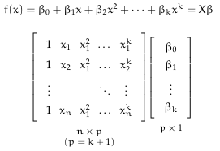

  * [reg_matriz_polin.pgf](https://github.com/walmes/Tikz/blob/master/src/reg_matriz_polin.pgf)

```tex
\begin{tikzpicture}[
  mtx/.style={
    matrix of math nodes,
    left delimiter={[},
    right delimiter={]}
  },
  subtxt/.style={below, font=\footnotesize}]

  \matrix[mtx] (X) {%
    1      & x_{1} & x_{1}^2 & \ldots & x_{1}^k \\
    1      & x_{2} & x_{1}^2 & \ldots & x_{2}^k \\
    \vdots &       &         & \ddots & \vdots  \\
    1      & x_{n} & x_{1}^2 & \ldots & x_{n}^k \\
  };
  \matrix[right=0.5cm of X] (beta) [mtx]{%
    \beta_0 \\ \beta_1 \\ \vdots \\ \beta_k\\
  };
  \node[xshift=0.6cm, above=2ex of X] (mod)
    {$f(x) = \beta_0+\beta_1 x+\beta_2
      x^2+\cdots+\beta_k x^k = X\beta$};
  \node[subtxt, align=center] at (X.south) {$n\times p$\\ $(p=k+1)$};
  \node[subtxt] at (beta.south) {$p\times 1$};
\end{tikzpicture}
```
****

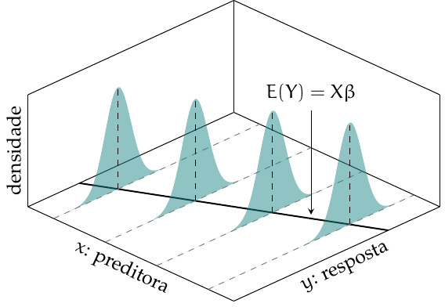

  * [reg_model_3d.pgf](https://github.com/walmes/Tikz/blob/master/src/reg_model_3d.pgf)

```tex
\begin{tikzpicture}[
  >=stealth,
  declare function={
    normal(\m,\s)=1/(2*\s*sqrt(pi))*exp(-(x-\m)^2/(2*\s^2));
  },
  declare function={
    reg(\x,\a,\b)=\a+\b*\x;
  }]

  \begin{axis}[
    width=9cm,
    height=7cm,
    view={45}{50},
    xlabel=$x$: preditora,
    ylabel=$y$: resposta,
    zlabel=densidade,
    xlabel style={rotate=-25},
    ylabel style={rotate=25},
    zlabel style={rotate=0},
    samples=60,
    domain=-4:12,
    % title=Regress\~{a}o linear simples,
    % grid=both,
    % minor tick num=2,
    % xtick={1,3,5,7},
    % xticklabel=\empty,
    xtick=\empty,
    ztick=\empty,
    ytick=\empty,
    samples y=0,
    zmin=0,
    area plot/.style={
      fill opacity=0.5,
      draw=none,
      fill=darkgreen,
      mark=none,
      smooth
    }]

    \addplot3[smooth, mark=none, color=black, thick,
      domain=0:8, samples=10] (x,{reg(x,0,1)},0);
    \pgfplotsinvokeforeach{1,3,...,7}{
      \addplot3 [area plot] (#1,x,{normal(#1,1)});
      \draw [dashed] (axis cs:#1,#1,0) -- (axis cs:#1,#1,0.28);
      \draw [gray, dashed] (axis cs:#1,-4,0) -- (axis cs:#1,12,0);
    }
    \draw[<-, shorten <=2pt, shorten >=0pt]
      (axis cs:6,6,0) -- (axis cs:6,6,0.3)
      node[above] {$E(Y)=X\beta$};
  \end{axis}
\end{tikzpicture}
```
****

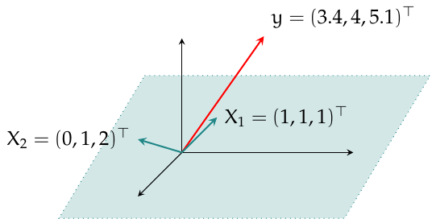

  * [reg_proj.pgf](https://github.com/walmes/Tikz/blob/master/src/reg_proj.pgf)

```tex
\begin{tikzpicture}[
  yshift=-1.3, xshift=0.7, >=stealth,
  axis/.style={->},
  vec/.style={thick, ->},
  every node/.style={color=black}]

  \coordinate (O) at (0,0,0);
  \draw[dotted, draw=darkgreen, fill=darkgreen!20]
    (-2,0,-3.5) -- (3,0,-3.5) -- (4,0,3) -- (-1,0,3) -- cycle;
  \draw[axis] (O) -- +(3, 0, 0);
  \draw[axis] (O) -- +(0, 2, 0);
  \draw[axis] (O) -- +(0, 0, 2);
  %% Vetor y.
  \draw[vec, color=red] (O) -- (3.4, 4, 5.1)
    node [above right] {$y = (3.4, 4, 5.1)^\top$};
  %% Colunas de X.
  \draw[vec, darkgreen] (O) -- (1, 1, 1)
    node [right] {$X_1 = (1, 1, 1)^\top$};
  \draw[vec, darkgreen] (O) -- (0, 1, 2)
    node [left] {$X_2 = (0,1,2)^\top$};
\end{tikzpicture}
```
****

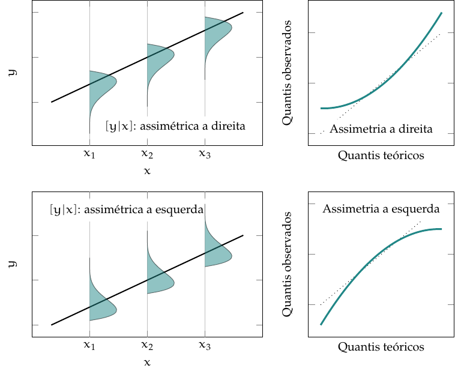

  * [reg_qqnorm.pgf](https://github.com/walmes/Tikz/blob/master/src/reg_qqnorm.pgf)

```tex
\pgfplotsset{
  myplot/.style={
    width=7cm, height=5cm,
    width=7cm, height=5cm,
    xlabel=$x$,
    ylabel=$y$,
    xtick=\empty,
    xticklabels=\empty,
    yticklabels=\empty,
    samples=50, domain=0:5, smooth, no marks,
    font=\footnotesize,
  }
}

\begin{tikzpicture}[
  declare function={
    reg(\x,\a,\b)=\a+\b*\x;
  },
  declare function={
    gamma(\z)=
    (2.506628274631*sqrt(1/\z)+0.20888568*(1/\z)^(1.5)+
    0.00870357*(1/\z)^(2.5)-(174.2106599*(1/\z)^(3.5))/25920-
    (715.6423511*(1/\z)^(4.5))/1244160)*exp((-ln(1/\z)-1)*\z);
  },
  declare function={
    beta(\a,\b)=gamma(\a)*gamma(\b)/gamma(\a+\b);
  },
  declare function={
    betapdf(\x,\a,\b)=\x^(\a-1)*(1-\x)^(\b-1)/beta(\a,\b);
  },
  >=stealth,
  cx/.style={fill=white, font=\footnotesize},
  pth/.style={draw, ->, color=darkgreen}]

  \begin{axis}[
    myplot,
    extra x ticks={2,5,8},
    extra x tick labels={$x_1$,$x_2$,$x_3$},
    extra tick style={grid=major}]

    \addplot[color=black, thick, domain=0:10, samples=2]
      (x,{reg(x,0,1)});
    \node[cx, anchor=north west] (dp)
      at (axis description cs:0.05,0.95)
      {$[y|x]$: assim\'etrica a esquerda};
    \pgfplotsinvokeforeach{2,5,8}{
      \addplot[domain=0:1, samples=30, fill=darkgreen, opacity=0.5]
      ({#1+0.5*betapdf(x,2,6)},7*x-1.5+#1);
    }
  \end{axis}

  \begin{axis}[
    myplot,
    xshift=6.5cm,
    width=5cm, height=5cm,
    xlabel=Quantis te\'{o}ricos,
    ylabel=Quantis observados]

    \addplot[color=black, dotted, domain=-1:1, samples=2]
      (x,{reg(x,0,1)});
    \addplot[color=black, very thick, domain=-1:1,
      samples=20, color=darkgreen] {0.5-0.5*(x-0.95)^2};
    \node[cx, anchor=north] (dp)
      at (axis description cs:0.5,0.95) {Assimetria a esquerda};
  \end{axis}

  \begin{axis}[
    myplot,
    yshift=4.5cm,
    extra x ticks={2,5,8},
    extra x tick labels={$x_1$,$x_2$,$x_3$},
    extra tick style={grid=major}]

    \addplot[color=black, thick, domain=0:10, samples=2]
      (x,{reg(x,0,1)});
    \node[cx, anchor=south east] (dp)
      at (axis description cs:0.95,0.05)
      {$[y|x]$: assim\'{e}trica a direita};
    \pgfplotsinvokeforeach{2,5,8}{
      \addplot[domain=0:1, samples=30, fill=darkgreen, opacity=0.5]
      ({#1+0.5*betapdf(x,6,2)},7*x-5.5+#1);
    }
  \end{axis}

  \begin{axis}[
    myplot,
    xshift=6.5cm, yshift=4.5cm,
    width=5cm, height=5cm,
    xlabel=Quantis te\'{o}ricos,
    ylabel=Quantis observados]

    \addplot[color=black, dotted, domain=-1:1, samples=2]
      (x,{reg(x,0,1)});
    \addplot[color=black, very thick, domain=-1:1,
      samples=20, color=darkgreen] {-0.5+0.5*(x+0.95)^2};
    \node[cx, anchor=south] (dp)
      at (axis description cs:0.5,0.05) {Assimetria a direita};
  \end{axis}
\end{tikzpicture}
```
****

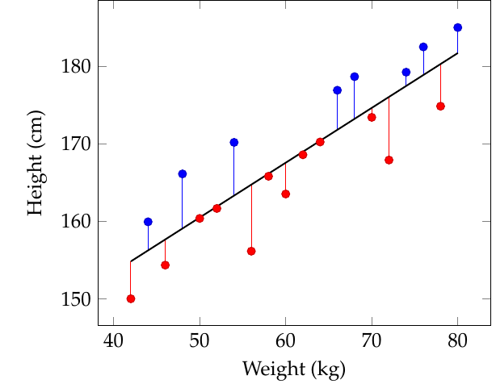

  * [reg_simples.pgf](https://github.com/walmes/Tikz/blob/master/src/reg_simples.pgf)

```tex
% Set the random seed.
\pgfmathsetseed{12}

% Define the equations for x and y.
\pgfplotstableset{
  create on use/x/.style={
    create col/expr={42+2*\pgfplotstablerow}},
  create on use/y/.style={
    create col/expr={(0.6*\thisrow{x}+130)+8*rand}}
}

% Create a new table with 30 rows and columns x and y:
\pgfplotstablenew[columns={x,y}]{20}\loadedtable

% Calculate the regression line.
\pgfplotstablecreatecol[linear regression]{regression}{\loadedtable}

\pgfplotsset{
  colored residuals/.style 2 args={
    only marks,
    scatter,
    point meta=explicit,
    colormap={redblue}{color=(#1) color=(#2)},
    error bars/y dir=minus,
    error bars/y explicit,
    error bars/draw error bar/.code 2 args={
      \pgfkeys{/pgf/fpu=true}
      \pgfmathtruncatemacro\positiveresidual{\pgfplotspointmeta<0}
      \pgfkeys{/pgf/fpu=false}
      \ifnum\positiveresidual=0
        \draw [#2] ##1 -- ##2;
      \else
        \draw [#1] ##1 -- ##2;
      \fi
    },
    /pgfplots/table/.cd,
    meta expr=(\thisrow{y}-\thisrow{regression})/
    abs(\thisrow{y}-\thisrow{regression}),
    y error expr=\thisrow{y}-\thisrow{regression}
  },
  colored residuals/.default={red}{blue}
}

\begin{tikzpicture}
  \begin{axis}[
    xlabel=Weight (kg),
    ylabel=Height (cm)]

    \makeatletter
    \addplot[colored residuals]
      table {\loadedtable};
    \addplot[no markers, thick, black]
      table [y=regression] {\loadedtable};
  \end{axis}
\end{tikzpicture}
```
****

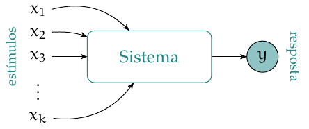

  * [reg_sistema.pgf](https://github.com/walmes/Tikz/blob/master/src/reg_sistema.pgf)

```tex
\begin{tikzpicture}[
  auto, >=stealth', node distance=0.0ex and 2em,
  pil/.style={->},
  punkt/.style={
    rectangle, rounded corners,
    draw=black, text width=6.5em,
    minimum height=3em, text centered},
  ann/.style={font=\footnotesize, color=darkgreen}]

  \node[punkt, color=darkgreen] (machine) at (0,0) {Sistema};
  \node[left=of machine] (x3) {$x_3$};
  \node[above=of x3] (x2) {$x_2$};
  \node[above=of x2] (x1) {$x_1$};
  \node[below=of x3] (x4) {$\vdots$};
  \node[below=of x4] (x5) {$x_k$};
  \node[ann, rotate=90, left=1pt of x3, anchor=south] {est\'{i}mulos};
  \node[right=of machine,
    % label={[darkgreen,font=\tiny]below:resposta},
    draw, circle, fill=darkgreen!50] (y) {$y$};
  \node[ann, rotate=-90, right=1pt of y, anchor=south] {resposta};

  \path[pil] (x1) edge[bend left] (machine);
  \path[pil] (x2) edge[bend left=10] (machine.162);
  \path[pil] (x3) edge (machine);
  \path[pil] (x5) edge[bend right] (machine);
  \path[pil] (machine) edge (y);
\end{tikzpicture}
```
****

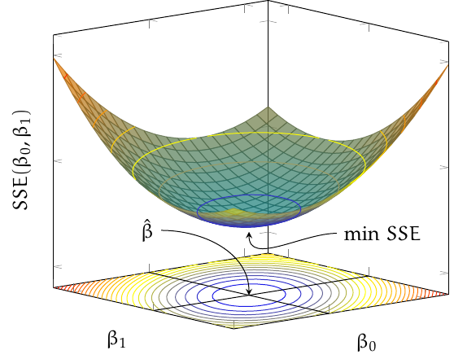

  * [reg_sqr.pgf](https://github.com/walmes/Tikz/blob/master/src/reg_sqr.pgf)

```tex
%% http://tex.stackexchange.com/questions/87674/how-to-coherently-combine-3d-and-contour-plots-with-pgfplots
\newcommand\expr[2]{5+#1^2+#2^2-0.9*#2*#1}%

\begin{tikzpicture}%
  \begin{axis}[
    domain=-2:2.5,
    domain y=-2:2.5,
    view={-40}{12},
    xlabel=$\beta_0$,
    ylabel=$\beta_1$,
    zlabel={$SSE(\beta_0, \beta_1)$},
    zmin=-2,
    xticklabels=\empty,
    yticklabels=\empty,
    zticklabels=\empty]

    \addplot3[
      contour gnuplot={
        output point meta=rawz,
        number=30,
        labels=false,
      },
      samples=30,
      z filter/.code=\def\pgfmathresult{-2},
    ] {\expr{x}{y}};

    \addplot3[
      surf,
      samples=20,
      opacity=0.75,
      mesh/interior colormap={blueblack}{
        color=(darkgreen) color=(orange)},
      miter limit=1, 
    ] {\expr{x}{y}};

    \addplot3[
      contour gnuplot={number=9, labels=false}
    ] {\expr{x}{y}};

    \draw (axis cs:-2,0,-2) -- (axis cs:2.5,0,-2);
    \draw (axis cs:0,-2,-2) -- (axis cs:0,2.5,-2);

    \path[draw, ->, >=stealth] (axis cs:1,-1,4)
      node[right] {$\min\, SSE$}
      to[out=180, in=-90] (axis cs:0,0,4);
    \path[draw, ->, >=stealth] (axis cs:-1,1,4)
      node[left] {$\hat\beta$}
      to[out=0, in=90] (axis cs:0,0,-2);

  \end{axis}
\end{tikzpicture}%
```
****

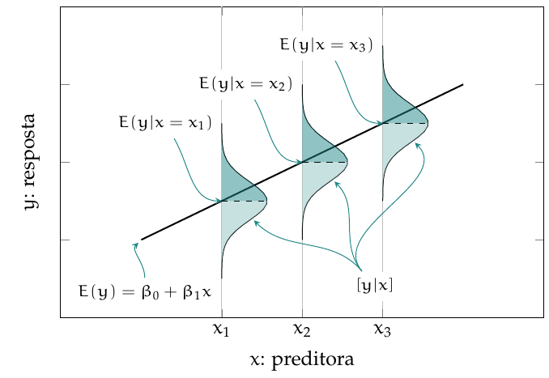

  * [reg_teorico.pgf](https://github.com/walmes/Tikz/blob/master/src/reg_teorico.pgf)

```tex
\def\hscale{1}
\def\stderr{0.5}
\def\fromto{2}

\begin{tikzpicture}[
  >=stealth,
  cx/.style={fill=white, font=\footnotesize},
  pth/.style={draw, ->, color=darkgreen},
  halves/.style={samples=30, fill opacity=0.5, draw=none},
  declare function={
    normal(\m,\s)=1/(2*\s*sqrt(pi))*exp(-(x-\m)^2/(2*\s^2));
  },
  declare function={
    reg(\x,\a,\b)=\a+\b*\x;
  }]

  \begin{axis}[
    width=10cm, height=7cm,
    xlabel=$x$: preditora,
    ylabel=$y$: resposta,
    xtick=\empty,
    xticklabels=\empty,
    yticklabels=\empty,
    extra x ticks={1,2,3},
    extra x tick labels={$x_1$,$x_2$,$x_3$},
    extra tick style={grid=major},
    samples=30, domain=-0:4,
    ymin=-2, ymax=6, xmin=-1, xmax=5]

    \addplot[color=black, thick, samples=2] (x, {reg(x,0,1)});

    \node[cx] (dp) at (axis description cs: 0.65, 0.1)
      {\footnotesize $[y|x]$};
    \node[cx, anchor=south west] (eq)
      at (axis description cs: 0.02, 0.03) {$E(y) = \beta_0+\beta_1 x$};
    \path[pth, shorten >=2pt] (eq) to[out=90, in=-135] (axis cs: 0, 0);

    \pgfplotsinvokeforeach{1,2,3}{
      \addplot[domain=-\fromto:\fromto]
        ({#1+\hscale*normal(0,\stderr)}, x+#1);
      \addplot[halves, domain=-\fromto:0, fill=darkgreen!50]
        ({#1+\hscale*normal(0,\stderr)}, x+#1) -- (axis cs:#1,#1);
      \addplot[halves, domain=0:\fromto, fill=darkgreen]
        ({#1+\hscale*normal(0,\stderr)}, x+#1) -- (axis cs: #1, #1);
      \draw[dashed] (axis cs:#1,#1) -- (axis cs: #1+0.6, #1);
      \path[pth] (dp) to[out=130, in=-45] (axis cs: #1+0.4, #1-\stderr);
      \node[cx] (x#1) at (axis cs: #1-0.7, #1+2) {$E(y|x=x_{#1})$};
      \path[pth] (x#1) to[out=-60, in=180] (axis cs: #1, #1);
    }
  \end{axis}
\end{tikzpicture}
```
****

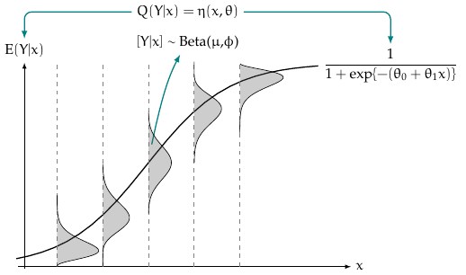

  * [regressao_beta.pgf](https://github.com/walmes/Tikz/blob/master/src/regressao_beta.pgf)

```tex
\begin{tikzpicture}[
  domain=-0.25:9, xscale=0.8, yscale=5,
  aponta/.style={
    color=green!50!blue, rounded corners=5pt, -latex, thick
  }]%

  \draw[-latex] (-0.2,0) -- (10,0) node[right] {$x$};
  \draw[-latex] (0,-0.01) -- (0,1) node[above] (E) {$\textrm{E}(Y|x)$};

  \def\A{-3}; \def\B{0.8};
  \draw[color=black, thick]
  plot[id=x] function{1/(1+exp(-\A-\B*x))}
  node[right] (eta)
    {$\displaystyle\frac{1}{1+\exp\{-(\theta_0+\theta_1 x)\}}$};

  \node (Q) at (5,25/20) {$Q(Y|x) = \eta(x, \theta)$};
  \node (N) at (5,22/20) {$[Y|x]\sim$ Beta($\mu$, $\phi$)};
  \path[aponta] (3.9,12/20) edge[bend left=10] (N);

  \draw[aponta] (Q) -| (E);
  \draw[aponta] (Q) -| (eta);

  \def\parphi{40}; 
  \def\parmu{0.5}; \def\factor{0.14}

  \foreach[evaluate=\x as \parmu using 1/(1+exp(-\A-\B*\x))]
    \x in {1, 2.4, ..., 7}{
      \draw[color=gray, dashed] (\x,0) -- ++(0,1);
      \begin{scope}[xshift=\x cm, rotate=90, yscale=1]
        % \draw (\parmu,0) -- ++(0,-0.5);
        \filldraw[fill opacity=0.3, fill=gray!70!black]
          plot[domain=(\parmu-0.25):(\parmu+0.25), smooth, samples=100]
          function {-\factor*gamma(\parphi)/(gamma(\parphi*\parmu)*
            gamma((1-\parmu)*\parphi))*x**(\parmu*\parphi-1)*
            (1-x)**((1-\parmu)*\parphi-1)};
      \end{scope}
    }

\end{tikzpicture}%
```
****

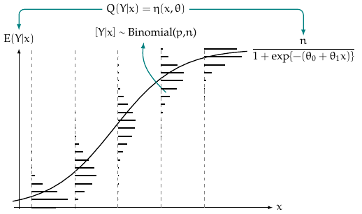

  * [regressao_binomial.pgf](https://github.com/walmes/Tikz/blob/master/src/regressao_binomial.pgf)

```tex
\begin{tikzpicture}[%
  domain=-0.25:9, xscale=0.8, yscale=0.25,
  aponta/.style={
    color=green!50!blue, rounded corners=5pt, -latex, thick
  }]

  \draw[-latex] (-0.2,0) -- (10,0) node[right] {$x$};
  \draw[-latex] (0,-0.2) -- (0,20) node[above] (E) {$\textrm{E}(Y|x)$};

  \def\A{-3}; \def\B{0.8};
  \draw[color=black, thick]
    plot[id=x] function{20/(1+exp(-\A-\B*x))}
    node[right] (eta)
    {$\displaystyle\frac{n}{1+\exp\{-(\theta_0+\theta_1 x)\}}$};

  \node (Q) at (5,25) {$Q(Y|x) = \eta(x, \theta)$};
  \node (N) at (5,22) {$[Y|x]\sim$ Binomial($p$, $n$)};
  \path[aponta] (5.8,14.5) edge[bend left=10] (N);

  \draw[aponta] (Q) -| (E);
  \draw[aponta] (Q) -| (eta);
  
  \foreach[evaluate=\x as \p using 1/(1+exp(-\A-\B*\x))]
    \x in {0.5, 2.2, ..., 8.5}{
      \draw[color=gray, dashed] (\x,0) -- ++(0,20);
      \def\lim{20};
      % \node[below] at (\x,0) {\p};
      \begin{scope}[xshift=\x cm, rotate=90, yscale=4]
        \draw[color=black, very thick]
        plot[ycomb, samples=\lim+1, domain=0:\lim]
        function {-(gamma(\lim+1)/(gamma(x+1)*
          (gamma(\lim-x+1))))*\p**x*(1-\p)**(\lim-x)};
      \end{scope}
    }
    
\end{tikzpicture}%
```
****

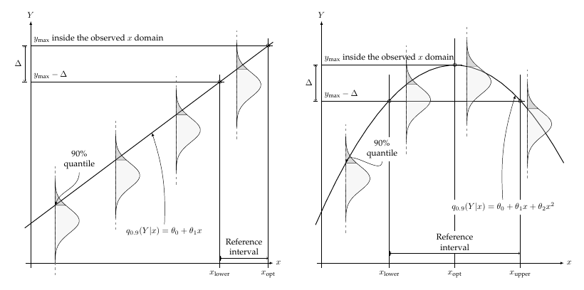

  * [regressao_linear_quantilica.pgf](https://github.com/walmes/Tikz/blob/master/src/regressao_linear_quantilica.pgf)

```tex
\begin{tikzpicture}[domain=-0.25:10]

  \begin{scope} %-------------------------------------------------------

  %   \draw [step=1.0, gray, very thin, dotted] (0, 0) grid (10, 10);

    \def\A{1};     % intercept.
    \def\B{0.75};  % slope.
    \def\S{0.5};   % variance.
    \def\Q{0.64};  % quantile from normal for 90% lower area.
    \def\D{0.44};  % density at \Q.

    \draw[-latex] (-0.2,0) -- (10,0) node[right] {$x$};
    \draw[-latex] (0,-0.2) -- (0,10) node[above] (E) {$Y$};
    \draw[color=black, thick] plot[id=x] function{\A + \Q + \B * x};

    \node[above] (eta) at (5.5, 1) {$q_{0.9}(Y|x) = \theta_0 + \theta_1 x$};
    \draw (eta) edge[bend right=10, ->, -latex] (5, \A + \Q + \B * 5);

    \foreach \x in {1.0, 3.5, 6, 8.5}{
      \def\sr{1.75}
      \begin{scope}[
        xshift=\x cm,
        yshift=\A cm + \B * \x cm,
        rotate=-90,
        smooth,
        domain=-\sr:\sr]

        \draw[color=gray, dashed] (2.25, 0) -- (-2.25, 0);
        \filldraw[fill opacity=0.3, fill=white!50!black]
          plot[id=x, domain=-\sr:-\Q] function{exp(-(x)**2/\S)} -- +(0, -\D) -- (-\sr, 0);
        \filldraw[fill opacity=0.3, fill=white!90!black]
          plot[id=x, domain=-\Q:\sr] function{exp(-(x)**2/\S)} -- (-\Q, 0);

        \ifthenelse{\lengthtest{\x pt=1 pt}}{
          % YES.
          \draw[align=center] (-2, 1) edge[out=0, in=160, ->, -latex] (-\Q, 0)
            node[above] {90\% \\ quantile};
          }{
          % NO.
        }
      \end{scope}
    }

    % Reference lines.
    \draw (0.0,  9.0) node[above right] {$y_\text{max}$ inside the observed $x$ domain} -- ++(10, 0);
    \draw (9.8, -0.2) node[below] {$x_\text{opt}$} -- ++(0, 9.5);
    \draw (9.8,  9.0) circle (2pt);

    \draw (0.0,  7.5) node[above right] {$y_\text{max} - \Delta$} -- ++(8, 0);
    \draw (7.8, -0.2) node[below] {$x_\text{lower}$} -- ++(0, 8);
    \draw (7.8,  7.5) circle (2pt);

    % Intervals.
    \draw[|<->|] (-0.25, 9.0) -- ++(0.0, -1.5) node[left, midway] {$\Delta$};
    \draw[|<->|] (  7.8, 0.2) -- ++(2.0,  0.0) node[above, midway, align=center] {Reference\\ interval};
  \end{scope}

  \begin{scope}[xshift=12cm] %------------------------------------------

  %   \draw [step=1.0, gray, very thin, dotted] (0, 0) grid (10, 10);

    \def\A{1.5};     % intercept.
    \def\B{2.2};  % slope.
    \def\C{-0.2};
    \def\S{0.5};   % variance.
    \def\Q{0.64};  % quantile from normal for 90% lower area.
    \def\D{0.44};  % density at \Q.

    \draw[-latex] (-0.2,0) -- (10,0) node[right] {$x$};
    \draw[-latex] (0,-0.2) -- (0,10) node[above] (E) {$Y$};
    \draw[color=black, thick] plot[id=x] function{\A + \Q + \B * x + \C * x**2};

    % Reference lines.
    \draw (0.0,  8.2) node[above right] {$y_\text{max}$ inside the observed $x$ domain} -- ++(5.8, 0);
    \draw (5.5, -0.2) node[below] {$x_\text{opt}$} -- ++(0, 9.5);
    \draw (5.5,  8.2) circle (2pt);

    \draw (0.0,  6.7) node[above right] {$y_\text{max} - \Delta$} -- ++(8.4, 0);
    \draw (8.2, -0.2) node[below] {$x_\text{upper}$} -- ++(0, 8);
    \draw (8.2,  6.7) circle (2pt);

    \draw (2.8, -0.2) node[below] {$x_\text{lower}$} -- ++(0, 8);
    \draw (2.8,  6.7) circle (2pt);

    \foreach \x in {1.0, 3.5, 6, 8.5}{
      \def\sr{1.75}
      \begin{scope}[
        xshift=\x cm,
        yshift=\A cm + \B * \x cm + \C * \x*\x cm,
        rotate=-90,
        smooth,
        domain=-\sr:\sr]

        \draw[color=gray, dashed] (2.25, 0) -- (-2.25, 0);
        \filldraw[fill opacity=0.3, fill=white!50!black]
          plot[id=x, domain=-\sr:-\Q] function{exp(-(x)**2/\S)} -- +(0, -\D) -- (-\sr, 0);
        \filldraw[fill opacity=0.3, fill=white!90!black]
          plot[id=x, domain=-\Q:\sr] function{exp(-(x)**2/\S)} -- (-\Q, 0);

        \ifthenelse{\lengthtest{\x pt=1 pt}}{
          % YES.
          \draw[align=center] (-0.7, 1.5) edge[out=0, in=160, ->, -latex] (-\Q, 0)
            node[above, fill=white] {90\% \\ quantile};
          }{
          % NO.
        }
      \end{scope}
    }

    % Intervals.
    \draw[|<->|] (-0.25, 8.2) -- ++(0.0, -1.5) node[left, midway] {$\Delta$};
    \draw[|<->|] (  2.8, 0.4) -- ++(5.4,  0.0) node[above, midway, align=center, fill=white] {Reference\\ interval};

    \node[above, fill=white] (eta) at (7.5, 2) {$q_{0.9}(Y|x) = \theta_0 + \theta_1 x + \theta_2 x^2$};
    \draw (eta) edge[bend left=10, ->, -latex] (8, \A + \Q + \B * 8 + \C * 8 * 8);
  \end{scope}

\end{tikzpicture}%
```
****

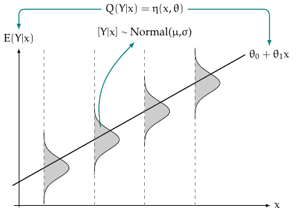

  * [regressao_linear_simples.pgf](https://github.com/walmes/Tikz/blob/master/src/regressao_linear_simples.pgf)

```tex
\begin{tikzpicture}[%
  domain=-0.25:8.75, xscale=0.8, yscale=0.25,
  aponta/.style={
    color=green!50!blue, rounded corners=5pt, -latex, thick
  }]
  \draw[-latex] (-0.2,0) -- (10,0) node[right] {$x$};
  \draw[-latex] (0,-0.2) -- (0,20) node[above] (E) {$\textrm{E}(Y|x)$};
  \def\A{3}; \def\B{1.8};
  \draw[color=black, thick]
    plot[id=x] function{\A+\B*x}
    node[right] (eta) {$\theta_0+\theta_1 x$};
  \node (Q) at (5,25) {$Q(Y|x) = \eta(x, \theta)$};
  \node (N) at (5,22) {$[Y|x]\sim$ Normal($\mu$, $\sigma$)};
  \path[aponta] (3.25,10) edge[bend left=10] (N);
  \draw[aponta] (Q) -| (E);
  \draw[aponta] (Q) -| (eta);
  \foreach \x in {1, 3, 5, 7}{
    \draw[color=gray, dashed] (\x,0) -- ++(0,20);
    \def\sr{4.5}
    \begin{scope}[
      xshift=\x cm, yshift=\A cm+\B*\x cm,
      rotate=-90, smooth, domain=-\sr:\sr]
      \filldraw[fill opacity=0.3, fill=gray!70!black]
        plot[id=x] function{exp(-(x)**2/3)};
      \draw[dotted] (0, 0) -- (0, 1);
    \end{scope}
  }
\end{tikzpicture}%
```
****

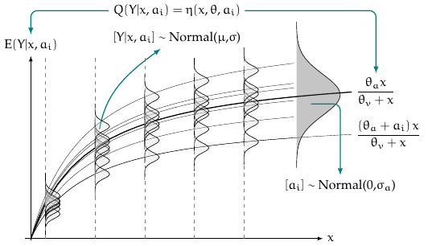

  * [regressao_nao_linear_aleatorio.pgf](https://github.com/walmes/Tikz/blob/master/src/regressao_nao_linear_aleatorio.pgf)

```tex
\begin{tikzpicture}[
  domain=0:9, xscale=0.8, yscale=0.25,
  aponta/.style={
    color=green!50!blue, rounded corners=5pt, -latex, thick}
  ]

  \draw[-latex] (-0.2,0) -- (10,0) node[right] {$x$};
  \draw[-latex] (0,-0.2) -- (0,20)
    node[above] (E) {$\textrm{E}(Y|x,a_i)$};
  \def\A{19}; \def\V{2};
  \draw[color=black, thick, domain=0:11]
    plot[id=x] function{\A*x/(\V+x)}
    node[right] (eta) {$\displaystyle\frac{\theta_a x}{\theta_v+x}$};
  \node (Q) at (5,25) {$Q(Y|x,a_i) = \eta(x, \theta, a_i)$};
  \node (N) at (5,22) {$[Y|x,a_i]\sim$ Normal($\mu$,$\sigma$)};
  \path[aponta] (2.35,12) edge[bend left=10] (N);
  \draw[aponta] (Q) -| (E);
  \draw[aponta] (Q) -| (eta);
  \draw[color=black, very thin, domain=0:11]
    plot[id=x, samples=100] function{(\A-5.5)*x/(\V+x)}
    node[right] {$\displaystyle\frac{(\theta_a+a_i)\, x}{\theta_v+x}$};
  \foreach \Aa in {-5.5,-2.7,-0.5,0,1.2,1.8,4.5}{
    \draw[color=black, very thin]
      plot[id=x, samples=100] function{(\A+\Aa)*x/(\V+x)};
    \foreach[evaluate=\x as \y using (\A+\Aa)*\x/(\V+\x)]
      \x in {0.5, 2.2, ..., 8.5}{
        \draw[color=gray, dashed] (\x,0) -- ++(0,20);
        \def\sr{2.5}
        \begin{scope}[
          xshift=\x cm, yshift=\y cm,
          rotate=-90, smooth, domain=-\sr:\sr]
          \filldraw[fill opacity=0.3, fill=white!85!black]
            plot[id=x] function{0.5*exp(-(x)**2/0.5)};
      \end{scope}
    }
  }

  \def\sr{8}
  \begin{scope}[
    xshift=9.1 cm, yshift=0.83*\A cm,
    rotate=-90, smooth, domain=-\sr:\sr]
    \filldraw[fill opacity=0.3, fill=gray!50!black]
      plot[id=x] function{1.5*exp(-(x)**2/10)};
    \node (a) at (10,1.5) {$[a_i]\sim$ Normal($0$,$\sigma_a$)};
    \draw[aponta] (1,0.5) |- (a);
  \end{scope}

\end{tikzpicture}
```
****

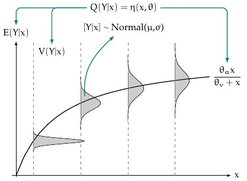

  * [regressao_nao_linear_hetero.pgf](https://github.com/walmes/Tikz/blob/master/src/regressao_nao_linear_hetero.pgf)

```tex
\begin{tikzpicture}[
  domain=0:9, xscale=0.8, yscale=0.25,
  aponta/.style={
    color=green!50!blue, rounded corners=5pt, -latex, thick
  }]

  \draw[-latex] (-0.2,0) -- (10,0) node[right] {$x$};
  \draw[-latex] (0,-0.2) -- (0,20) node[above] (E) {$\textrm{E}(Y|x)$};
  \def\A{18}; \def\V{2};
  \draw[color=black, thick]
    plot[id=x] function{\A*x/(\V+x)}
    node[right] (eta) {$\displaystyle\frac{\theta_a x}{\theta_v+x}$};
  \node (Q) at (5,25) {$Q(Y|x) = \eta(x, \theta)$};
  \node (N) at (5,22) {$[Y|x]\sim$ Normal($\mu$,$\sigma$)};
  \node[below right of=E, anchor=west] (V) {$\textrm{V}(Y|x)$};
  \path[aponta] (3.2,11.8) edge[bend left=10] (N);
  \draw[aponta] (Q) -| (E);
  \draw[aponta] (Q) -| (V);
  \draw[aponta] (Q) -| (eta);
  \foreach[
    evaluate=\x as \y using \A*\x/(\V+\x),
    evaluate=\y as \s using (\y^1.25)/20]
    \x in {0.8, 3, ..., 8}{
      \draw[color=gray, dashed] (\x,0) -- ++(0,20);
      \def\factor{2.3}
      \begin{scope}[
        xshift=\x cm, yshift=\y cm,
        rotate=-90, smooth, domain=(-4*\s):(4*\s)]
        \draw[color=gray] (-2*\s,0) -- (2*\s,0);
        \filldraw[fill opacity=0.3, fill=gray!70!black]
          plot[id=x]
          function{\factor*(2*3.14)**(-0.5)*(1/\s)*
            exp(-(x)**2/(2*\s**2))};
    \end{scope}
  }
\end{tikzpicture}
```
****


  * [regressao_nao_linear.pgf](https://github.com/walmes/Tikz/blob/master/src/regressao_nao_linear.pgf)

```tex
\begin{tikzpicture}[
  domain=0:9, xscale=0.8, yscale=0.25,
  aponta/.style={
    color=green!50!blue, rounded corners=5pt, -latex, thick
  }]
  \draw[-latex] (-0.2,0) -- (10,0) node[right] {$x$};
  \draw[-latex] (0,-0.2) -- (0,20) node[above] (E) {$\textrm{E}(Y|x)$};
  \def\A{20}; \def\V{2};
  \draw[color=black, thick]
    plot[id=x] function{\A*x/(\V+x)}
    node[right] (eta) {$\displaystyle\frac{\theta_a x}{\theta_v+x}$};
  \node (Q) at (5,25) {$Q(Y|x) = \eta(x, \theta)$};
  \node (N) at (5,22) {$[Y|x]\sim$ Normal($\mu$,$\sigma$)};
  \path[aponta] (2.35,12) edge[bend left=10] (N);
  \draw[aponta] (Q) -| (E);
  \draw[aponta] (Q) -| (eta);
  \foreach[evaluate=\x as \y using \A*\x/(\V+\x)]
    \x in {0.5, 2.2, ..., 8.5}{
      \draw[color=gray, dashed] (\x,0) -- ++(0,20);
      \def\sr{4.5}
      \begin{scope}[
        xshift=\x cm, yshift=\y cm,
        rotate=-90, smooth, domain=-\sr:\sr]
        % \draw[color=gray] (-\sr,0) -- (\sr,0);
        % \draw[color=gray] (0,0) -- (0,1);
        \filldraw[fill opacity=0.3, fill=gray!70!black]
          plot[id=x] function{exp(-(x)**2/3)};
      \end{scope}
  }
\end{tikzpicture}
```
****

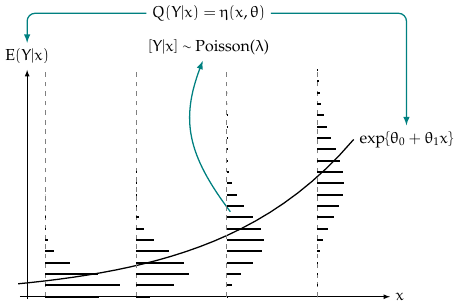

  * [regressao_poisson.pgf](https://github.com/walmes/Tikz/blob/master/src/regressao_poisson.pgf)

```tex
\begin{tikzpicture}[
  domain=-0.25:9, xscale=0.8, yscale=0.25,
  aponta/.style={
    color=green!50!blue, rounded corners=5pt, -latex, thick
  }]
  \draw[-latex] (-0.2,0) -- (10,0) node[right] {$x$};
  \draw[-latex] (0,-0.2) -- (0,20) node[above] (E) {$\textrm{E}(Y|x)$};
  \def\A{0.2}; \def\B{0.27};
  \draw[color=black, thick]
    plot[id=x] function{exp(\A+\B*x)}
    node[right] (eta) {$\exp\{\theta_0+\theta_1 x\}$};
  \node (Q) at (5,25) {$Q(Y|x) = \eta(x, \theta)$};
  \node (N) at (5,22) {$[Y|x]\sim$ Poisson($\lambda$)};
  \path[aponta] (5.6,7.5) edge[bend left=10] (N);
  \draw[aponta] (Q) -| (E);
  \draw[aponta] (Q) -| (eta);
  \foreach[evaluate=\x as \lambda using exp(\A+\B*\x)]
    \x in {0.5, 3, ..., 9}{
      \draw[color=gray, dashed] (\x,0) -- ++(0,20);
      \def\lim{20};
      \begin{scope}[xshift=\x cm, rotate=90, yscale=6]
        \draw[color=black, very thick]
          plot[ycomb, samples=\lim+1, domain=0:\lim]
          function {-exp(-\lambda)*(\lambda)**x/gamma(x+1)};
      \end{scope}
    }
\end{tikzpicture}%
```
****

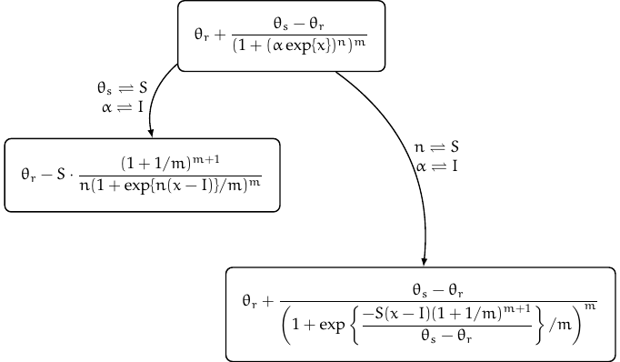

  * [reparamet_cra.pgf](https://github.com/walmes/Tikz/blob/master/src/reparamet_cra.pgf)

```tex
\tikzset{
  state/.style={
    rectangle, rounded corners, draw=black,
    thick, minimum height=2em,
    inner sep=10pt, text centered
  }
}

\begin{tikzpicture}[->, >=latex, line width=0.75pt]
  \node[state] (pr0) {
    $\theta_r+\displaystyle\frac{\theta_s-\theta_r}{
      (1+(\alpha\exp\{x\})^n)^m}$\\
  };
  \node[state, xshift=-3cm, below of=pr0,
  node distance=3cm, anchor=center] (pr1) {
    $\theta_r-S\cdot\displaystyle\frac{(1+1/m)^{m+1}}{
      n(1+\exp\{n(x-I)\}/m)^m}$\\
  };
  \node[state, xshift=3cm, below of=pr0,
  node distance=6cm, anchor=center] (pr2) {
    $\theta_r+\displaystyle\frac{\theta_s-\theta_r}{
      \left(1+\exp\left\{\displaystyle\frac{-S(x-I)(1+1/m)^{m+1}}{
            \theta_s-\theta_r}\right\}/m\right)^m}$\\
  };
  \path (pr0) edge[bend right=30]
    node[midway, right, align=center, anchor=east]
    {$\theta_s \rightleftharpoons S$ \\
      $\alpha \rightleftharpoons I $} (pr1)
    (pr0) edge[bend left=30]
    node[midway, left, align=center, anchor=west]
    {$n \rightleftharpoons S$\\ $\alpha \rightleftharpoons I $} (pr2);
\end{tikzpicture}
```
****

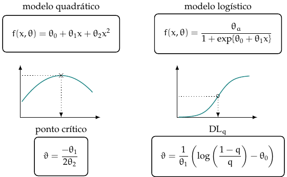

  * [reparamet_exemplos1.pgf](https://github.com/walmes/Tikz/blob/master/src/reparamet_exemplos1.pgf)

```tex
\tikzset{
  state/.style={
    rectangle, rounded corners, draw=black, thick,
    minimum height=4em, inner sep=10pt, text centered
  }
}

\begin{tikzpicture}[>=latex, line width=0.75pt]
  \begin{scope}[xshift=0cm, yshift=0cm, xscale=3, yscale=2]
    \coordinate (centro) at (0.5,0);
    \draw[<->] (-0.02,1) |- (1,0);
    \draw[-, color=darkgreen, thick, samples=50]
      plot[id=x, domain=0:0.9]
      function{0.8-2*(x-0.5)**2};
    \draw[<-,dotted] (0.5,0) |- (0,0.8);
    \node at (0.5,0.8) {$\times$};
    \node[state, above of=centro, node distance=3.2cm] (modelo1)
      {$f(x, \theta) = \theta_0+\theta_1 x+\theta_2 x^2$};
    \node[above of=modelo1] {modelo quadr\'atico};
    \node[state, yshift=0cm, below of=centro,
      node distance=1.5cm,  anchor=center]
      (g1) {$\vartheta = \displaystyle\frac{-\theta_1}{2\theta_2}$};
    \node[above of=g1] {ponto cr\'itico};
  \end{scope}
  \begin{scope}[xshift=6cm, yshift=0cm, xscale=3, yscale=2]
    \coordinate (centro) at (0.5,0);
    \draw[<->] (-0.02,1) |- (1,0);
    \draw[-, color=darkgreen, thick, samples=50]
      plot[id=x, domain=0:0.9]
      function{0.8/(1+exp(-(x-0.5)/0.09))};
    \draw[<-,dotted] (0.5,0) |- (0,0.4);
    \node at (0.5,0.4) {$\circ$};
    \node[state, above of=centro, node distance=3.2cm] (modelo1)
      {$f(x, \theta) = \displaystyle \frac{\theta_a}{
          1+\exp\{\theta_0+\theta_1 x\}}$};
    \node[above of=modelo1] {modelo log\'istico};
    \node[state, yshift=0cm, below of=centro,
      node distance=1.5cm,  anchor=center]
      (g1) {$\vartheta = \displaystyle\frac{1}{\theta_1}
        \left(\log\left(\frac{1-q}{q}\right)-\theta_0\right)$};
    \node[above of=g1] {DL$_{q}$};
  \end{scope}
\end{tikzpicture}
```
****

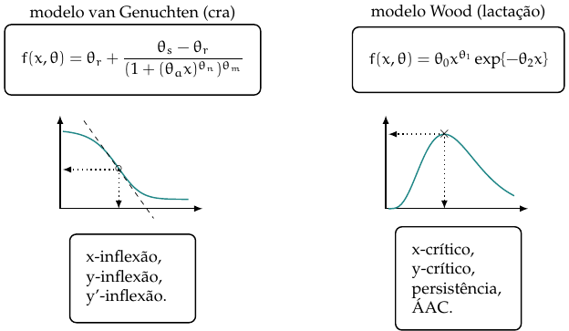

  * [reparamet_exemplos2.pgf](https://github.com/walmes/Tikz/blob/master/src/reparamet_exemplos2.pgf)

```tex
\tikzset{
  state/.style={
    rectangle, rounded corners, draw=black, thick,
    minimum height=4em, inner sep=10pt, text centered
  }
}

\begin{tikzpicture}[>=latex, line width=0.75pt]
  \begin{scope}[xshift=0cm, yshift=0cm, xscale=3, yscale=2]
    \def\tr{0.1}; \def\S{-2.10}; \def\I{0.4};
    \def\n{9.6}; \def\m{1.9}; \def\ti{0.42}
    \coordinate (centro) at (0.5,0);
    \draw[<->] (-0.02,1) |- (1,0);
    \draw[-, color=darkgreen, thick, samples=50]
      plot[id=x, domain=0:0.9]
      function{\tr-(\S/\n)*((1+1/\m)**(\m+1)/
        (1+exp(\n*(x-\I))/\m)**\m)};
    \draw[<->,dotted] (\I,0) |- (0,\ti);
    \draw[dashed, thin] plot[id=x, domain=0.15:0.65]
      function{\ti+\S*(x-\I)} node[right] {};
    \node at (\I,0.42) {$\circ$};
    \node[state, above of=centro, node distance=3.2cm] (modelo1)
      {$f(x, \theta) = \displaystyle \theta_r+\frac{\theta_s-\theta_r}{
          (1+(\theta_a x)^{\theta_n})^{\theta_m}}$};
    \node[above of=modelo1] {modelo van Genuchten (cra)};
    \node[state, yshift=0cm, below of=centro,
      node distance=1.5cm,  anchor=center]
      (g1) {\begin{minipage}{2cm}
          x-inflex\~{a}o,\\
          y-inflex\~{a}o,\\
          y'-inflex\~{a}o.
        \end{minipage}
    }; 
  \end{scope}
  \begin{scope}[xshift=7cm, yshift=0cm, xscale=3, yscale=2]
    \def\vy{0.8}; \def\vx{0.4}; \def\th{4}
    \coordinate (centro) at (0.5,0);
    \draw[<->] (-0.02,1) |- (1,0);
    \draw[-, color=darkgreen, thick, samples=50]
      plot[id=x, domain=0:0.9]
      function{\vy*(x/\vx)**\th*exp(\th*(1-x/\vx))};
    \draw[<->,dotted] (\vx,0) |- (0,\vy);
    \node at (\vx,\vy) {$\times$};
    \node[state, above of=centro, node distance=3.2cm] (modelo1)
      {$f(x, \theta) = \theta_0 x^{\theta_1} \exp\{-\theta_2 x\}$};
    \node[above of=modelo1] {modelo Wood (lacta\c{c}\~ao)};
    \node[state, yshift=0cm, below of=centro,
      node distance=1.5cm,  anchor=center]
      (g1) {\begin{minipage}{2cm}
          x-cr\'itico,\\
          y-cr\'itico,\\
          persist\^encia,\\
          \'AAC.
        \end{minipage}
    }; 
  \end{scope}
\end{tikzpicture}
```
****

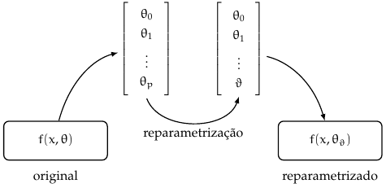

  * [reparametrizacao.pgf](https://github.com/walmes/Tikz/blob/master/src/reparametrizacao.pgf)

```tex
\tikzset{
  state/.style={
    rectangle, rounded corners, draw=black, thick,
    minimum height=2em, minimum width=8em, inner sep=10pt,
    text centered
  }
}

\begin{tikzpicture}[>=latex, line width=0.75pt]
  \begin{scope}
    \node[state] (modelo1) {$f(x, \theta)$};
    \node[below of=modelo1] {original};
    \node (m1) [above right of=modelo1, node distance=3.5cm,
      matrix of math nodes, left delimiter=[,right delimiter={]}]
      { \theta_0 \\ \theta_1 \\ \vdots \\ \theta_p \\};
    \node (m2) [right of=m1, node distance=2.5cm,
      matrix of math nodes, left delimiter=[,right delimiter={]}]
      { \theta_0 \\ \theta_1 \\ \vdots \\ \vartheta \\};
    \node (modelo2) [below right of=m2, state, node distance=3.5cm]
      (modelo2) {$f(x, \theta_\vartheta)$};
    \node[below of=modelo2] {reparametrizado};
    \path[->, shorten >=1em] (modelo1) edge[bend left=30] (m1.west);
    \path[->] (m1.south) edge[bend right=70]
      node [midway, below] {reparametriza\c{c}\~{a}o} (m2.south);
    \path[<-, shorten >=1em] (modelo2) edge[bend right=30] (m2);
  \end{scope}
\end{tikzpicture}
```
****

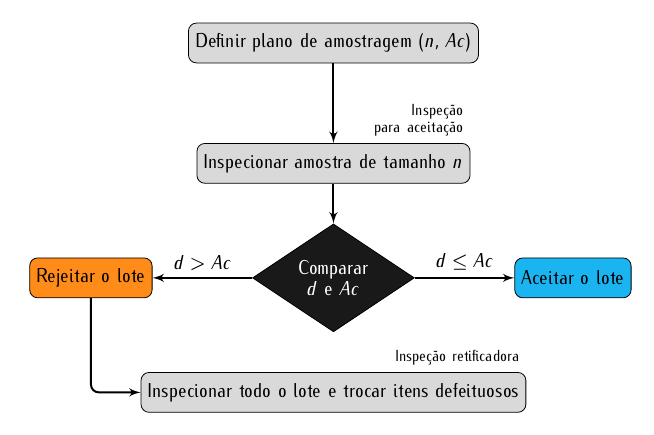

  * [sampling-plan-1.pgf](https://github.com/walmes/Tikz/blob/master/src/sampling-plan-1.pgf)

```tex
\begin{tikzpicture}[
  decision/.style = {
    diamond, 
    aspect=1.5, 
    draw,
    fill=gray!20!black,
    text=white,
    text width=5em,
    text centered,
    inner sep=1pt},
  block/.style = {
    rectangle, 
    draw,
    fill=gray!30!white, 
    minimum height=2em,
    text centered,
    rounded corners},
  line/.style = {
    draw,
    -latex',
    line width=1pt,
    rounded corners}]

\renewcommand{\baselinestretch}{0.5}

\node (def) [block] {Definir plano de amostragem ($n$, $Ac$)};
\node (ins) [block, below=4em of def] {Inspecionar amostra de tamanho $n$};
\node [above=0ex of ins.north east, anchor=south east, align=right, text width=2cm] {
  \footnotesize Inspe{\c c}{\~ a}o\\ para aceita{\c c}{\~ a}o};

\node (dAc) [decision, below=2em of ins] {Comparar $d$ e $Ac$};

\node (ace) [block, fill=cyan!90!white, right=5em of dAc] {Aceitar o lote};

\node (rej) [block, fill=orange!90!white, left=5em of dAc] {Rejeitar o lote};
\node (trc) [block, below=2em of dAc] {Inspecionar todo o lote e trocar itens defeituosos};
\node [above=0ex of trc.north east, anchor=south east] {
  \footnotesize Inspe{\c c}{\~ a}o retificadora};

\path [line] (def) -- (ins);
\path [line] (ins) -- (dAc);

\path [line] (dAc) -- node [above] {$d \leq Ac$} (ace);
\path [line] (dAc) -- node [above] {$d > Ac$} (rej);

\path [line] (rej) |- (trc);

\end{tikzpicture}%
```
****

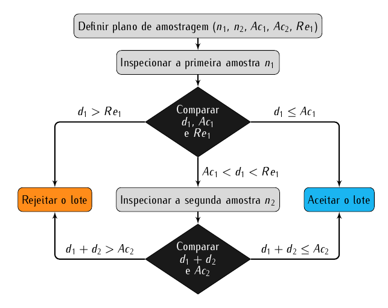

  * [sampling-plan-2.pgf](https://github.com/walmes/Tikz/blob/master/src/sampling-plan-2.pgf)

```tex
\begin{tikzpicture}[
  baseline,
  decision/.style = {
    diamond, 
    aspect=1.5, 
    draw,
    fill=gray!20!black,
    text=white,
    text width=4em,
    text centered,
    inner sep=1pt},
  block/.style = {
    rectangle, 
    draw,
    fill=gray!30!white, 
    minimum height=2em,
    text centered,
    text depth=0ex,
    rounded corners},
  line/.style = {
    draw,
    -latex',
    line width=1pt,
    rounded corners}]

\renewcommand{\baselinestretch}{0.5}

\node (def) [block] {Definir plano de amostragem ($n_1$, $n_2$, $Ac_1$, $Ac_2$, $Re_1$)};
\node (ins1) [block, below=1em of def] {Inspecionar a primeira amostra $n_1$};
\node (dAc1) [decision, below=1em of ins1] {Comparar $d_1$, $Ac_1$ e $Re_1$};

\node (ins2) [block, below=2.5em of dAc1] {Inspecionar a segunda amostra $n_2$};
\node (dAc2) [decision, below=1em of ins2] {Comparar $d_1 + d_2$ e $Ac_2$};

\node (ace) [block, fill=cyan!90!white, right=2em of ins2] {Aceitar o lote};
\node (rej) [block, fill=orange!90!white, left=2em of ins2] {Rejeitar o lote};

\path [line] (def) -- (ins1);
\path [line] (ins1) -- (dAc1);

\path [line] (dAc1) -| node [above, pos=0.25] {$d_1 \leq Ac_1$} (ace);
\path [line] (dAc1) -| node [above, pos=0.25] {$d_1 > Re_1$} (rej);

\path [line] (dAc1) -- node [right] {$Ac_1 < d_1 <Re_1$} (ins2);

\path [line] (ins2) -- (dAc2);

\path [line] (dAc2) -| node [above, pos=0.25] {$d_1 + d_2 \leq Ac_2$} (ace);
\path [line] (dAc2) -| node [above, pos=0.25] {$d_1 + d_2 > Ac_2$} (rej);

\end{tikzpicture}%
```
****

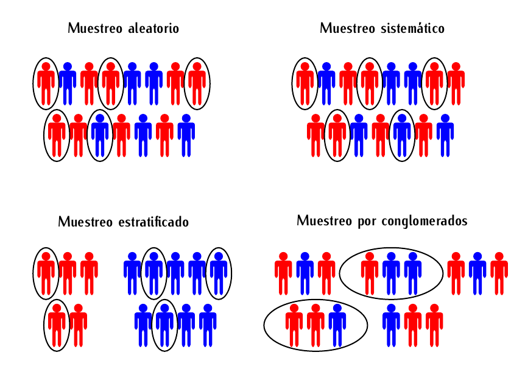

  * [sampling.pgf](https://github.com/walmes/Tikz/blob/master/src/sampling.pgf)

```tex
% Contribution to the gallery by Emilio Torres Manzanera (Fac. de
% Comercio - Universidad de Oviedo)

\newcommand{\man}[2]{%
  % #1 = draw options
  % #2 = location
  \begin{scope}[#1, shift = {(#2)}]
    \fill [rounded corners = 1.5]
    (0, 0.4) -- (0, 0.8) -- (0.4, 0.8) -- (0.4, 0.4) --
    (0.325, 0.4) -- (0.325, 0.7) -- (0.3, 0.7) -- (0.3, 0) --
    (0.225, 0) -- (0.225, 0.4) -- (0.175, 0.4) -- (0.175, 0) --
    (0.1, 0) -- (0.1, 0.7) -- (0.075, 0.7) -- (0.075, 0.4) -- cycle;
    \fill (0.2, 0.9) circle (0.1);
  \end{scope}}

\def\ellipseman(#1, #2);{%
  \draw [thick] (#1 + 0.2, #2 + 0.5)
    ellipse [x radius = 0.3cm, y radius = 0.6cm];
}

\begin{tikzpicture}
  % \draw [very thick] (0, 0) rectangle (11, 11);
  % \shadecircle(6, 7.3)(2.8);
  % \shadecircle(3.2, 7.5)(2.3);
  % \shadecircle(3.8, 4)(3.5);

  %--------------------------------------------------------------------
  \draw (2, 9) node {\textbf{Muestreo aleatorio}};

  % \man{blue}{1.5, 7.2};
  % \man{red}{1.5, 6};
  % \ellipseman(1.5, 6);

  \foreach \x in {0, 1, 1.5, 3, 3.5} {
    \man{red}{\x, 7.2}
  }
  \foreach \x in {0.5, 2, 2.5} {
    \man{blue}{\x, 7.2}
  }
  \foreach \x in {0.25, 0.75, 1.75, 2.75} {
    \man{red}{\x, 6}
  }
  \foreach \x in {1.25, 2.25, 3.25} {
    \man{blue}{\x, 6}
  }
  \foreach \x in {0, 1.5, 3.5} {
    \ellipseman(\x, 7.2);
  }
  \foreach \x in {0.25, 1.25} {
    \ellipseman(\x, 6);
  }

  %---------------------------------------------------------------------
  \draw (8, 9) node {\textbf{Muestreo sistem\'atico}};

  % \man{blue}{1.5, 7.2};
  % \man{red}{1.5, 6};
  % \ellipseman(1.5, 6);

  \foreach \x in {0, 1, 1.5, 3, 3.5} {
    \man{red}{\x+6, 7.2}
  }
  \foreach \x in {0.5, 2, 2.5} {
    \man{blue}{\x+6, 7.2}
  }
  \foreach \x in {0.25, 0.75, 1.75, 2.75} {
    \man{red}{\x+6, 6}
  }
  \foreach \x in {1.25, 2.25, 3.25} {
    \man{blue}{\x+6, 6}
  }
  \foreach \x in {0, 1.5, 3} {
    \ellipseman(\x+6, 7.2);
  }
  \foreach \x in {0.75, 2.25} {
    \ellipseman(\x+6, 6);
  }

  %---------------------------------------------------------------------
  \draw (2, 4.5) node {\textbf{Muestreo estratificado}};

  % \man{blue}{1.5, 7.2};
  % \man{red}{1.5, 6};
  %% \ellipseman(1.5, 6);

  \foreach \x in {0, 0.5, 1} {
    \man{red}{\x, 7.2-4.4}
  }
  \foreach \x in {2, 2.5, ..., 4} {
    \man{blue}{\x, 7.2-4.4}
  }
  \foreach \x in {0.25, 0.75} {
    \man{red}{\x, 6-4.4}
  }
  \foreach \x in {2.25, 2.75, 3.25, 3.75} {
    \man{blue}{\x, 6-4.4}
  }
  \foreach \x in {0, 2.5, 4} {
    \ellipseman(\x, 7.2-4.4);
  }
  \foreach \x in {0.25, 2.75} {
    \ellipseman(\x, 6-4.4);
  }

  %---------------------------------------------------------------------
  \draw (2+6, 4.5) node {\textbf{Muestreo por conglomerados}};

  % \man{blue}{1.5, 7.2};
  % \man{red}{1.5, 6};
  %% \ellipseman(1.5, 6);

  \foreach \x in {0, 1, 2, 4, 5} {
    \man{red}{\x+5.5, 7.2-4.4}
  }
  \foreach \x in {0.5, 2.5, 3, 4.5} {
    \man{blue}{\x+5.5, 7.2-4.4}
  }
  \foreach \x in {0.25, 0.75, 3, 3.5} {
    \man{red}{\x+5.5, 6-4.4}
  }
  \foreach \x in {1.25, 2.5} {
    \man{blue}{\x+5.5, 6-4.4}
  }

  \draw [thick] (6.0 + 2 + 0.2, 7.2 - 4.4 + 0.5)
    ellipse [x radius = 1.2cm, y radius = 0.6cm];
  \draw [thick] (5.5 + 0.75 + 0.2, 6 - 4.4 + 0.5)
    ellipse [x radius = 1.2cm, y radius = 0.6cm];

\end{tikzpicture}
```
****

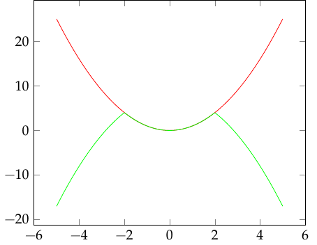

  * [segmentada.pgf](https://github.com/walmes/Tikz/blob/master/src/segmentada.pgf)

```tex
%% http://www.latex-community.org/forum/viewtopic.php?f=46&p=72503

\begin{tikzpicture}
  \begin{axis}[mark=none]
    \addplot[red, samples=100]
      {x^2};
    \addplot[green, samples=300]
      {x^2 > 4 ? -x^2+8 : x^2};
  \end{axis}
\end{tikzpicture}
```
****

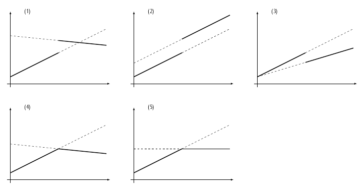

  * [segmented-linear.pgf](https://github.com/walmes/Tikz/blob/master/src/segmented-linear.pgf)

```tex
\begin{tikzpicture}[%
  > = latex, xscale = 4, yscale = 4,
  mypoints/.style = {fill = white, draw = black},
  pil/.style = {->, shorten< = 2pt, shorten> = 2pt}
  ]

  \def\num{(1)}
  \def\eixos{
    \draw[->] (-0.05, 0) -- +(1.5, 0);
    \draw[->] (0, -0.05) -- +(0, 1.1) node[right = 2em] {\num{}};
  }

  % Para fazer o quadrado.
  \newcommand{\segmentedlinear}[5]{%
    \draw[color = black, very thick, samples = 5]
      plot[id = x, domain = 0:#1] function{#2 + #3 * x};
    \draw[color = black, thin, dashed, samples = 5]
      plot[id = x, domain = #1:1.4] function{#2 + #3 * x};
    \draw[color = black, very thick, samples = 5]
      plot[id = x, domain = #1:1.4] function{#4 + #5 * x};
    \draw[color = black, thin, dashed, samples = 5]
      plot[id = x, domain = 0:#1] function{#4 + #5 * x};
  }%

  \begin{scope}
    \def\num{(1)}
    \eixos{}
    \segmentedlinear{0.7}{0.1}{0.5}{0.7}{-0.1}
  \end{scope}

  \begin{scope}[xshift = 1.8cm]
    \def\num{(2)}
    \eixos{}
    \segmentedlinear{0.7}{0.1}{0.5}{0.3}{0.5}
  \end{scope}

  \begin{scope}[xshift = 3.6cm]
    \def\num{(3)}
    \eixos{}
    \segmentedlinear{0.7}{0.1}{0.5}{0.1}{0.3}
  \end{scope}

  \begin{scope}[yshift = -1.4cm, xshift = 0cm]
    \def\num{(4)}
    \eixos{}
    \segmentedlinear{0.7}{0.1}{0.5}{0.52}{-0.1}
  \end{scope}

  \begin{scope}[yshift = -1.4cm, xshift = 1.8cm]
    \def\num{(5)}
    \eixos{}
    \segmentedlinear{0.7}{0.1}{0.5}{0.45}{0}
  \end{scope}

\end{tikzpicture}%
```
****

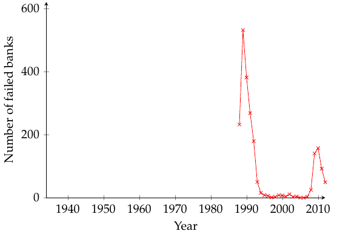

  * [serie_coordinate.pgf](https://github.com/walmes/Tikz/blob/master/src/serie_coordinate.pgf)

```tex
\begin{tikzpicture}
  \begin{axis}[
    width=0.8\textwidth, height=0.6\textwidth,
    axis x line=bottom,
    axis y line=left,
    xmin=1934, xmax=2012,
    ymin=0, ymax=620,
    xlabel={Year},
    ylabel={Number of failed banks},
    xlabel near ticks,
    ylabel near ticks,
    xticklabel style={/pgf/number format/1000 sep=}]

    \addplot [color=red, mark=x] coordinates {
      (1988,232)
      (1989,531)
      (1990,381)
      (1991,268)
      (1992,179)
      (1993,50)
      (1994,15)
      (1995,8)
      (1996,6)
      (1997,1)
      (1998,3)
      (1999,8)
      (2000,7)
      (2001,4)
      (2002,11)
      (2003,3)
      (2004,4)
      (2005,0)
      (2006,0)
      (2007,3)
      (2008,25)
      (2009,140)
      (2010,157)
      (2011,92)
      (2012,49)
    };
  \end{axis}
\end{tikzpicture}
```
****

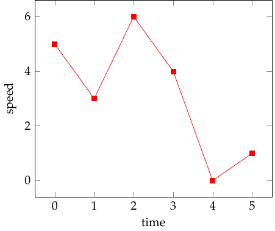

  * [serie_filecontents.pgf](https://github.com/walmes/Tikz/blob/master/src/serie_filecontents.pgf)

```tex
% http://tex.stackexchange.com/questions/94150/how-to-read-value-from-table-assign-to-variable-and-use-it-in-x-expr-thisrow

\begin{filecontents}{data.dat}
  #time speed
  3 5
  4 3
  5 6
  6 4
  7 0
  8 1
\end{filecontents}

\begin{tikzpicture}
  \begin{axis}[
    xlabel=time,
    ylabel=speed,
    x filter/.code={
      \ifnum\coordindex=0
      \xdef\firstvalue{\pgfmathresult}
      \fi
      \pgfmathparse{\pgfmathresult-\firstvalue}
    }]

    \addplot[color=red, mark=square*] file {data.dat};
  \end{axis}
\end{tikzpicture}
```
****

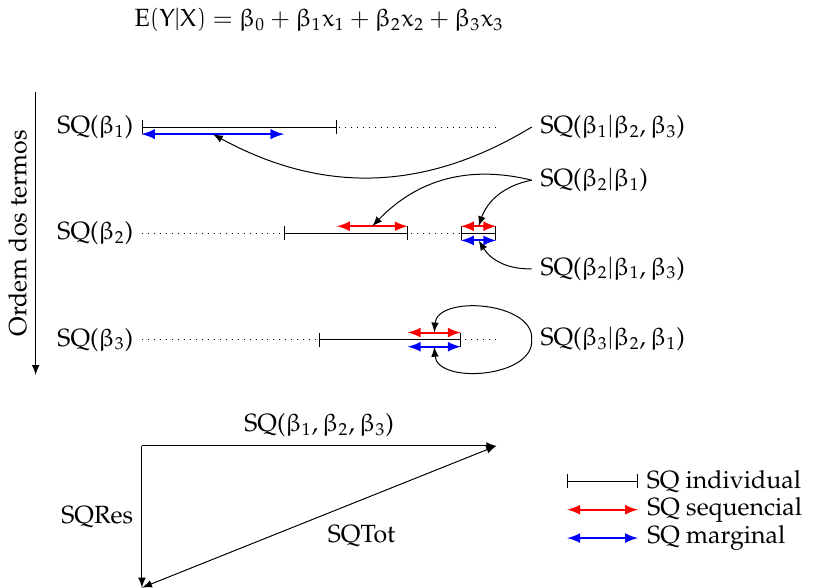

  * [sqreg_decomp.pgf](https://github.com/walmes/Tikz/blob/master/src/sqreg_decomp.pgf)

```tex
% http://stackoverflow.com/questions/2701902/standalone-diagrams-with-tikz

\begin{tikzpicture}[>=latex, xscale=5, yscale=5]
  % Titulo com expressao do modelo
  \node at (0.5, 1.2)
    {$\textrm{E}(Y|X)=\beta_0+\beta_1 x_1 +\beta_2 x_2 +\beta_3 x_3$};

  % Seta indicando a ordem de entrada
  \draw[<-] (-0.3,0.2) -- (-0.3,1) node[midway, above, rotate=90]
    {Ordem dos termos};

  % Rotulos na esquerda
  \node[left] at (0,0.9) {SQ($\beta_1$)};
  \node[left] at (0,0.6) {SQ($\beta_2$)};
  \node[left] at (0,0.3) {SQ($\beta_3$)};

  % Linhas de guia pontilhadas
  \draw[dotted] (0,0.3) -- (1,0.3);
  \draw[dotted] (0,0.6) -- (1,0.6);
  \draw[dotted] (0,0.9) -- (1,0.9);

  % SQ do modelo de regressao, residuos e total
  \draw[->] (0,0) -- (1,0) node[midway, above]
    {SQ($\beta_1, \beta_2, \beta_3$)};
  \draw[->] (0,0) -- (0,-0.4) node[midway, left] {SQRes};
  \draw[<->] (0,-0.4) -- (1,0) node[midway, below right] {SQTot};

  % SQ devido a beta1
  \draw[|-|] (0,0.9) -- (0.55,0.9);

  % SQ devido a beta2
  \draw[|-|] (0.4,0.6) -- (0.75,0.6);
  \draw[|-|] (0.9,0.6) -- (1,0.6);

  % SQ devido a beta2
  \draw[|-|] (0.5,0.3) -- (0.9,0.3);

  % SQ de b2|b1
  \draw[<->, color=red, thick] (0.55,0.62) -- (0.75,0.62);
  \draw[<->, color=red, thick] (0.9,0.62) -- (1,0.62);

  % SQ de b2|b1,b3
  \draw[<->, color=blue, thick] (0.9,0.58) -- (1,0.58);

  % SQ de b3|b2,b1
  \draw[<->, color=red, thick] (0.75,0.32) -- (0.9,0.32);
  \draw[<->, color=blue, thick] (0.75,0.28) -- (0.9,0.28);

  % SQ de b1|b2,b3
  \draw[<->, color=blue, thick] (0,0.88) -- (0.4,0.88);

  % SQ de b1|b2,b3
  \draw[<->, color=blue, thick] (0,0.88) -- (0.4,0.88);

  % Coordenadas
  \coordinate (b2seq) at (1.1,0.75);
  \coordinate (b3seq) at (1.1,0.3);
  \coordinate (b2mar) at (1.1,0.5);
  \coordinate (b1mar) at (1.1,0.9);

  % Textos para as coordenadas
  \node[right] at (b2seq) {SQ($\beta_2|\beta_1$)};
  \node[right] at (b3seq) {SQ($\beta_3|\beta_2,\beta_1$)};
  \node[right] at (b2mar) {SQ($\beta_2|\beta_1,\beta_3$)};
  \node[right] at (b1mar) {SQ($\beta_1|\beta_2,\beta_3$)};

  % Setas
  \path[<-] (0.65,0.62) edge[bend left] (b2seq);
  \path[<-] (0.95,0.62) edge[bend left] (b2seq);
  \path[<-] (0.95,0.58) edge[bend right] (b2mar);
  \path[<-] (0.825,0.32) edge[bend left=90] (b3seq);
  \path[<-] (0.825,0.28) edge[bend right=90] (b3seq);
  \path[<-] (0.2,0.88) edge[bend right] (b1mar);

  % Legenda
  \draw[|-|] (1.2,-0.10) -- (1.4,-0.10) node[right] {SQ individual};
  \draw[<->, color=red, thick] (1.2,-0.18) -- (1.4,-0.18)
    node[right, color=black] {SQ sequencial};
  \draw[<->, color=blue, thick] (1.2,-0.26) -- (1.4,-0.26)
    node[right, color=black] {SQ marginal};

\end{tikzpicture}
```
****

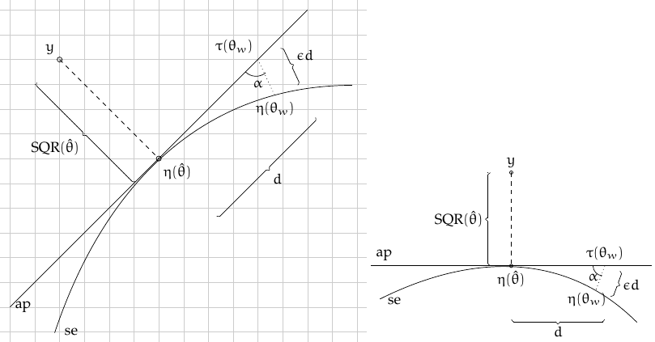

  * [superficie_minimos.pgf](https://github.com/walmes/Tikz/blob/master/src/superficie_minimos.pgf)

```tex
\begin{tikzpicture}[scale=1.2]
  \draw [step=0.5cm, black!20, very thin] (-0.2, -0.7) grid (7.2, 6.2);
  \draw (0,0) -- (6,6);
  \draw [dashed] (1,5) to (3,3);
  \draw [xshift=-0.1cm, yshift=0.48cm]
    (1,-1) .. controls (2,2) and (4,4) .. (7,4);
  \draw [dotted] (5,5) -- (5.35, 4.25);
  \draw (4.75, 4.75) arc (225:310:0.3);
  \draw (1,5) circle (0.5mm) node [anchor=south east] {$y$};
  \draw (3,3) circle (0.5mm)
    node [anchor=north west] {$\eta(\hat\theta)$};
  \draw (5,5) node[anchor=south east] {$\tau(\theta_w)$};
  \draw (5.35, 4.25) node[anchor=north] {$\eta(\theta_w)$};
  \draw (5, 4.5) node {$\alpha$};
  \draw [dotted, xshift=-0.5cm, yshift=-0.5cm] (1,5) to (3,3);
  \draw [xshift=-0.5cm, yshift=-0.5cm] (1,5)
    edge [<->, >=right to reversed, thin] (2,4);
  \draw [xshift=-0.5cm, yshift=-0.5cm] (2,4)
    edge [<->, >=left to reversed, thin] (3,3);
  \draw (1.5, 3.5) node[anchor=north east] {$\mathrm{SQR}(\hat\theta)$};
  \draw [xshift=0.5cm, yshift=0.25cm] (5,5)
    edge [<->, >=left to reversed, thin] (5.175,4.625);
  \draw[xshift=0.5cm, yshift=0.25cm] (5.175,4.625)
    edge [<->, >=right to reversed, thin] (5.35, 4.25);
  \draw[xshift=0.5cm, yshift=0.25cm] (5.175,4.625)
    node [anchor=south west] {$\epsilon d$};
  \draw[xshift=1.2cm, yshift=-1.2cm] (3,3)
    edge [<->, >=right to reversed, thin] (4,4);
  \draw[xshift=1.2cm, yshift=-1.2cm] (4,4)
    edge [<->, >=left to reversed, thin] (5,5);
  \draw[xshift=1.2cm, yshift=-1.2cm] (4,4)
    node [anchor=north west] {$d$};
  \draw (1,-0.5) node [anchor=west] {se};
  \draw (0,0) node [anchor=west] {ap};
\end{tikzpicture}

\begin{tikzpicture}[rotate=-45, scale=0.8]
  \draw (0,0) -- (6,6);
  \draw [dashed] (1,5) to (3,3);
  \draw [xshift=-0.1cm, yshift=0.48cm]
    (1,-1) .. controls (2,2) and (4,4) .. (7,4);
  \draw[dotted] (5,5) -- (5.35, 4.25);
  \draw (4.75, 4.75) arc (225:310:0.3);
  \draw (1,5) circle (0.5mm) node [anchor=south] {$y$};
  \draw (3,3) circle (0.5mm) node [anchor=north] {$\eta(\hat\theta)$};
  \draw (5,5) node [anchor=south] {$\tau(\theta_w)$};
  \draw (5.35, 3.9) node {$\eta(\theta_w)$};
  \draw (5, 4.5) node {$\alpha$};
  \draw [dotted, xshift=-0.5cm, yshift=-0.5cm] (1,5) to (3,3);
  \draw [xshift=-0.5cm, yshift=-0.5cm] (1,5)
    edge [<->, >=right to reversed, thin] (2,4);
  \draw [xshift=-0.5cm, yshift=-0.5cm] (2,4)
    edge [<->, >=left to reversed, thin] (3,3);
  \draw (1.5, 3.5) node[anchor=east] {$\mathrm{SQR}(\hat\theta)$};
  \draw [xshift=0.5cm, yshift=0.25cm] (5,5)
    edge [<->, >=left to reversed, thin] (5.175,4.625);
  \draw [xshift=0.5cm, yshift=0.25cm] (5.175,4.625)
    edge [<->, >=right to reversed, thin] (5.35, 4.25);
  \draw [xshift=0.5cm, yshift=0.25cm] (5.175,4.625)
    node[anchor=west] {$\epsilon d$};
  \draw [xshift=1.2cm, yshift=-1.2cm] (3,3)
    edge [<->, >=right to reversed, thin] (4,4);
  \draw [xshift=1.2cm, yshift=-1.2cm] (4,4)
    edge [<->, >=left to reversed, thin] (5,5);
  \draw [xshift=1.2cm, yshift=-1.2cm] (4,4)
    node[anchor=north] {$d$};
  \draw (1,-0.5) node[anchor=west] {se};
  \draw (0,0) node[anchor=south west] {ap};
\end{tikzpicture}
```
****


  * [surface_1.pgf](https://github.com/walmes/Tikz/blob/master/src/surface_1.pgf)

```tex
\begin{tikzpicture}
  \begin{axis}[samples=10]
    \addplot3[surf, domain=-2:2] {x^2-y^2};
  \end{axis}
  \begin{axis}[xshift=8cm, samples=50]
    \addplot3[surf, domain=-2:2] {x^2-y^2};
  \end{axis}
\end{tikzpicture}
```
****

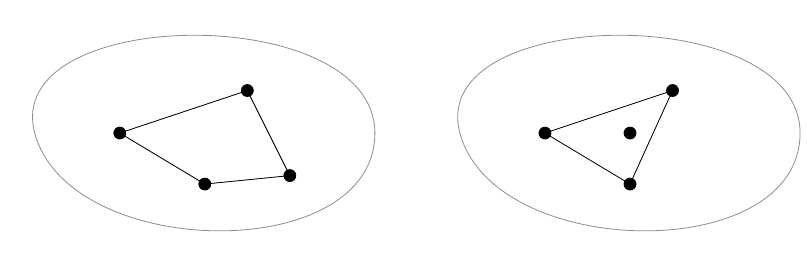

  * [sylvester-4-point-problem.pgf](https://github.com/walmes/Tikz/blob/master/src/sylvester-4-point-problem.pgf)

```tex
\begin{tikzpicture}[scale = 3]

  \begin{scope}
    \path[draw = gray!90] (-1, 0) edge[out = -75, in = -90] (+1, 0);
    \path[draw = gray!90] (+1, 0) edge[out = 90, in = 105] (-1, 0);
    \draw[fill = black, draw = black]
      (-0.50,  0   ) circle (1pt) --
      (+0.25, +0.25) circle (1pt) --
      (+0.50, -0.25) circle (1pt) --
      (+0,    -0.30) circle (1pt) -- (-0.5, 0);
  \end{scope}

  \begin{scope}[xshift = 2.5cm]
    \path[draw = gray!90] (-1, 0) edge[out = -75, in = -90] (+1, 0);
    \path[draw = gray!90] (+1, 0) edge[out = 90, in = 105] (-1, 0);
    \draw[fill = black, draw = black]
      (-0.50,  0   ) circle (1pt) --
      (+0.25, +0.25) circle (1pt) --
      (+0,    -0.30) circle (1pt) -- (-0.5, 0);
    \draw[fill = black, draw = black] (+0.0, -0.0) circle (1pt);
  \end{scope}

\end{tikzpicture}
```
****

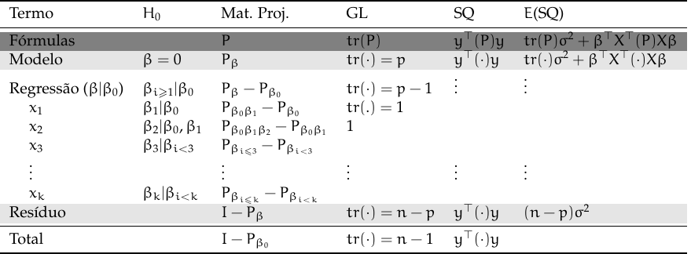

  * [tab_anova.pgf](https://github.com/walmes/Tikz/blob/master/src/tab_anova.pgf)

```tex
\pgfplotstabletypeset[
  col sep=&, row sep=\\,
  column type=l, %% Alinhamento.
  string type,
  % every even row/.style={
  %   before row={\rowcolor[gray]{0.9}}
  % },
  % every row 2 column 0/.style={
  %   postproc cell content/.style={@cell content=\textbf{##1}}
  % },
  every head row/.style={
    before row=\toprule, after row=\midrule
  },
  every first row/.style={
    before row=\rowcolor[gray]{0.5}
  },
  every last row/.style={
    before row=\midrule,
    after row=\bottomrule
  },
  every nth row={10[-9]}{
    before row=\rowcolor[gray]{0.9}
  }, %% Linha 2.
  every nth row={10[-2]}{
    before row=\rowcolor[gray]{0.9}
  }, %% Linha 8.
]{
  Termo & $H_0$ & Mat. Proj. & GL & SQ & $E$(SQ) \\
  F\'ormulas & & $P$ & $tr(P)$ & $y^\top (P)y$ 
    & $tr(P) \sigma^2 +\beta^\top X^\top (P) X \beta$ \\
  Modelo & $\beta=0 $ & $P_{\beta}$ & $tr(\cdot) = p$ 
    & $y^\top (\cdot)y$
    & $tr(\cdot) \sigma^2 +\beta^\top X^\top (\cdot) X \beta$ \\ 
  Regress\~ao ($\beta|\beta_0$) & $\beta_{i\geq 1}|\beta_0$
    & $P_{\beta}-P_{\beta_0}$ & $tr(\cdot) = p-1$ & $\vdots$
    & $\vdots$ \\
  ~$\quad x_1$ & $\beta_1|\beta_0$ & $P_{\beta_0 \beta_1}-P_{\beta_0}$
    & $tr(.) = 1$ & & \\
  ~$\quad x_2$ & $\beta_2|\beta_0, \beta_1$
    & $P_{\beta_0 \beta_1 \beta_2}-P_{\beta_0 \beta_1}$ & $1$ &  & \\
  ~$\quad x_3$ & $\beta_3|\beta_{i<3}$
    & $P_{\beta_{i\leq 3}}-P_{\beta_{i<3}}$ & $ $ &  & \\
  ~$\quad \vdots$ & & $\vdots$ & $\vdots$ & $\vdots$ & $\vdots$ \\
  ~$\quad x_k$ & $\beta_k|\beta_{i<k}$
    & $P_{\beta_{i\leq k}}-P_{\beta_{i<k}}$ &  &  & \\
  Res\'{i}duo & & $I-P_{\beta}$ & $tr(\cdot) = n-p$
    & $y^\top (\cdot)y$ & $(n-p) \sigma^2$ \\
  Total & & $I-P_{\beta_0}$ & $tr(\cdot) = n-1$ & $y^\top (\cdot)y$ & \\
}

% Seja a $y$ um vetor aleat\'orio tal que $E(y) = \mu$ e $V(y) =
% I\sigma^2$.  Assim, a esperan\c{c}a da forma quadr\'atica $y^\top A y$
% \'e: $$ E(y^\top A y) = \sigma^2 tr(A)+\mu^\top A \mu. $$
```
****

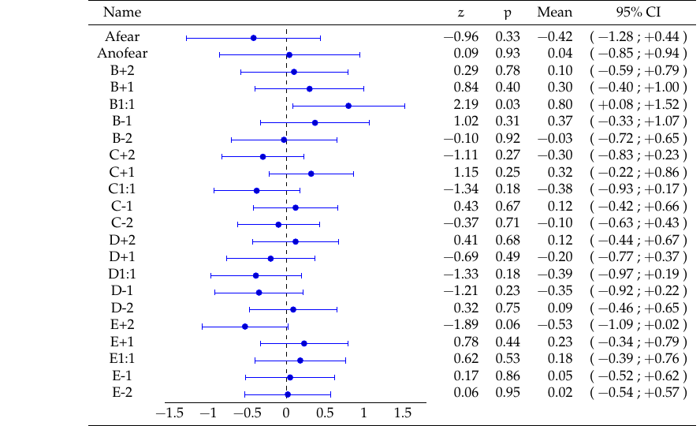

  * [tab_ic.pgf](https://github.com/walmes/Tikz/blob/master/src/tab_ic.pgf)

```tex
% Copiado de:
% http://tex.stackexchange.com/questions/19346/pgfplots-plot-graph-inside-table

% The data file.
% Use org-mode to edit.
\begin{filecontents}{data.txt}
| name    |     z |    p |  mean |   lci |  uci |
| Afear   | -0.96 | 0.33 | -0.42 | -1.28 | 0.44 |
| Anofear |  0.09 | 0.93 |  0.04 | -0.85 | 0.94 |
| B+2     |  0.29 | 0.78 |  0.10 | -0.59 | 0.79 |
| B+1     |  0.84 | 0.40 |  0.30 | -0.40 | 1.00 |
| B1:1    |  2.19 | 0.03 |  0.80 |  0.08 | 1.52 |
| B-1     |  1.02 | 0.31 |  0.37 | -0.33 | 1.07 |
| B-2     | -0.10 | 0.92 | -0.03 | -0.72 | 0.65 |
| C+2     | -1.11 | 0.27 | -0.30 | -0.83 | 0.23 |
| C+1     |  1.15 | 0.25 |  0.32 | -0.22 | 0.86 |
| C1:1    | -1.34 | 0.18 | -0.38 | -0.93 | 0.17 |
| C-1     |  0.43 | 0.67 |  0.12 | -0.42 | 0.66 |
| C-2     | -0.37 | 0.71 | -0.10 | -0.63 | 0.43 |
| D+2     |  0.41 | 0.68 |  0.12 | -0.44 | 0.67 |
| D+1     | -0.69 | 0.49 | -0.20 | -0.77 | 0.37 |
| D1:1    | -1.33 | 0.18 | -0.39 | -0.97 | 0.19 |
| D-1     | -1.21 | 0.23 | -0.35 | -0.92 | 0.22 |
| D-2     |  0.32 | 0.75 |  0.09 | -0.46 | 0.65 |
| E+2     | -1.89 | 0.06 | -0.53 | -1.09 | 0.02 |
| E+1     |  0.78 | 0.44 |  0.23 | -0.34 | 0.79 |
| E1:1    |  0.62 | 0.53 |  0.18 | -0.39 | 0.76 |
| E-1     |  0.17 | 0.86 |  0.05 | -0.52 | 0.62 |
| E-2     |  0.06 | 0.95 |  0.02 | -0.54 | 0.57 |
\end{filecontents}

% Read data file, create new column ``upper CI boundary - mean''.
\pgfplotstableread{data.txt}\data
\pgfplotstableset{
  create on use/error/.style={
    create col/expr={
      \thisrow{uci}-\thisrow{mean}
    }
  }
}

% Define the command for the plot.
\newcommand{\errplot}{%
  \begin{tikzpicture}[trim axis left, trim axis right]
    \begin{axis}[
      y=-\baselineskip,
      scale only axis,
      width=6.5cm,
      enlarge y limits={abs=0.5},
      axis y line*=middle,
      y axis line style=dashed,
      ytick=\empty,
      axis x line*=bottom
      ]
      \addplot+[only marks][error bars/.cd,x dir=both, x explicit]
      table[x=mean, y expr=\coordindex, x error=error] {\data};
    \end{axis}
  \end{tikzpicture}%
}

% Get number of rows in datafile.
\pgfplotstablegetrowsof{\data}
\let\numberofrows=\pgfplotsretval

% Print the table.
\pgfplotstabletypeset[
  columns={name, error, z, p, mean, ci},
  every head row/.style={before row=\toprule, after row=\midrule},
  every last row/.style={after row=[3ex]\bottomrule},
  columns/name/.style={string type, column name=Name},
  columns/error/.style={
    column name={},
    assign cell content/.code={% use \multirow for Z column:
      \ifnum\pgfplotstablerow=0
        \pgfkeyssetvalue{/pgfplots/table/@cell content}
        {\multirow{\numberofrows}{6.5cm}{\errplot}}%
      \else
        \pgfkeyssetvalue{/pgfplots/table/@cell content}{}%
      \fi
    }
  },
  columns/mean/.style={
    column name=Mean, fixed, fixed zerofill, dec sep align
  },
  columns/z/.style={
    column name=$z$, fixed, fixed zerofill, dec sep align
  },
  columns/p/.style={
    column name=$p$, fixed, fixed zerofill, dec sep align
  },
  columns/ci/.style={
    string type, column name=95\% CI
  },
  create on use/ci/.style={
    create col/assign/.code={\edef\value{(
        \noexpand\pgfmathprintnumber[showpos, fixed, fixed zerofill]{
          \thisrow{lci}} ;
        \noexpand\pgfmathprintnumber[showpos, fixed, fixed zerofill]{
          \thisrow{uci}}
        )}
      \pgfkeyslet{/pgfplots/table/create col/next content}\value
    }
  }
  ]{\data}
```
****

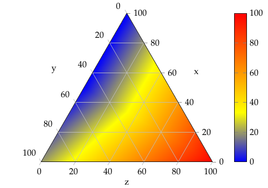

  * [ternario.pgf](https://github.com/walmes/Tikz/blob/master/src/ternario.pgf)

```tex
% http://tex.stackexchange.com/questions/276496/draw-a-surface-on-a-ternary-diagram-with-pgfplots

\usepgfplotslibrary{ternary}

\begin{tikzpicture}
  \begin{ternaryaxis}[
    axis on top,
    xlabel=x, ylabel=y, zlabel=z,
    colorbar]

    \addplot3 [patch, shader=interp, point meta=\thisrow{C}]
    table{
      X Y Z C
      0 0 1 100
      1 0 0 0
      0.5 0.5 0 0
      0.5 0.5 0 0
      0 1 0 20
      0 0 1 100
    };
  \end{ternaryaxis}
\end{tikzpicture}
```
****

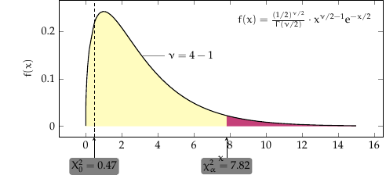

  * [testHipChi1.pgf](https://github.com/walmes/Tikz/blob/master/src/testHipChi1.pgf)

```tex
\def\chiright{7.82}
\def\xzero{0.47}
\def\grauliber{3}

\tikzset{
  >=stealth,
  Red/.style={
    draw=none, text opacity=1, fill=red!70!blue, fill opacity=0.75
  },
  Yellow/.style={
    draw=none, text opacity=1, fill=yellow, fill opacity=0.25
  },
  declare function={
    gamma(\z)=
    (2.506628274631*sqrt(1/\z)+0.20888568*(1/\z)^(1.5)+
    0.00870357*(1/\z)^(2.5)-(174.2106599*(1/\z)^(3.5))/25920-
    (715.6423511*(1/\z)^(4.5))/1244160)*exp((-ln(1/\z)-1)*\z);
  },
  declare function={
    chisquare(\x,\nu)=
    ((1/2)^(\nu/2))*\x^((\nu/2)-1)*exp(-(1/2)*\x)/gamma(\nu/2);
  },
  toleft/.style={
    anchor=mid east, xshift=-2em,
    append after command={
      (\tikzlastnode.east) edge[thin, gray] +(2em,0)
    }
  },
  toright/.style={
    anchor=mid west, xshift=2em,
    append after command={
      (\tikzlastnode.west) edge[thin, gray] +(-2em,0)
    }
  },
  rpath/.style={draw, rounded corners},
  qnode/.style={draw=none, fill=gray,
    inner sep=2pt, rounded corners=2pt}
}

\pgfplotsset{
  myplot/.style={
    width=12cm, height=6cm,
    xlabel=$x$, ylabel=$f(x)$,
    samples=30,
    % xlabel style={at={(1,0)}, anchor=west},
    % ylabel style={rotate=-90, at={(0,1)}, anchor=east},
    legend style={draw=none, fill=none},
  }
}

\begin{tikzpicture}
  \begin{axis}[myplot, clip=false]
    \addplot[Red, domain=\chiright:15]
      {chisquare(x,\grauliber)} \closedcycle;
    \addplot[Yellow, domain=0.01:\chiright]
      {chisquare(x,\grauliber)} \closedcycle;
    \addplot[samples at={0.2,0.19,...,0}, thick]
      {chisquare(x,\grauliber)} -- (0,0);
    \addplot[samples=50, thick, smooth, domain=0.2:15]
      {chisquare(x,\grauliber)} node[toright, pos=0.2] {$\nu=4-1$};
    \draw[densely dashed] ({rel axis cs:0,0} -| {axis cs: \xzero, 0})
      -- ({rel axis cs:0,1} -| {axis cs: \xzero, 0});
    \node[rotate=0, anchor=north east]
      at (axis description cs: 0.975, 0.95)
      {$f(x) = \frac{(1/2)^{\nu/2}}{\Gamma(\nu/2)}\cdot
        x^{\nu/2-1} \text{e}^{-x/2}$};
    \coordinate (A) at
      (axis cs: \xzero, \pgfkeysvalueof{/pgfplots/ymin});
    \coordinate (B) at
      (axis cs: \xzero, \pgfkeysvalueof{/pgfplots/ymax});
    \draw[<-] (A) -- ($(B)!1.15!(A)$)
      node[qnode, below] {$X_0^2=\xzero$};
    \coordinate (C) at
      (axis cs: \chiright, \pgfkeysvalueof{/pgfplots/ymin});
    \coordinate (D)
      at (axis cs: \chiright, \pgfkeysvalueof{/pgfplots/ymax});
    \draw[<-] (C) -- ($(D)!1.15!(C)$)
      node[qnode, below] {$\chi^2_{\alpha}=\chiright$};
  \end{axis}
\end{tikzpicture}
```
****

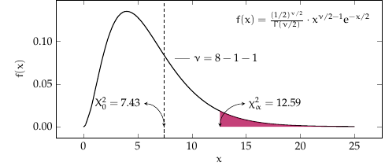

  * [testHipChi2.pgf](https://github.com/walmes/Tikz/blob/master/src/testHipChi2.pgf)

```tex
\def\chiright{12.59}
\def\xzero{7.43}
\def\grauliber{6}

\pgfplotsset{
  myplot/.style={
    width=12cm, height=6cm,
    xlabel=$x$, ylabel=$f(x)$,
    samples=30,
    % xlabel style={at={(1,0)}, anchor=west},
    % ylabel style={rotate=-90, at={(0,1)}, anchor=east},
    legend style={draw=none, fill=none},
    yticklabel style={
      /pgf/number format/fixed,
      /pgf/number format/fixed zerofill,
      /pgf/number format/precision=2
    }
  }
}

\begin{tikzpicture}[
  >=stealth,
  Red/.style={
    draw=none, text opacity=1, fill=red!70!blue, fill opacity=0.75
  },
  Yellow/.style={
    draw=none, text opacity=1, fill=yellow, fill opacity=0.25
  },
  declare function={
    gamma(\z)=
    (2.506628274631*sqrt(1/\z)+0.20888568*(1/\z)^(1.5)+
    0.00870357*(1/\z)^(2.5)-(174.2106599*(1/\z)^(3.5))/25920-
    (715.6423511*(1/\z)^(4.5))/1244160)*exp((-ln(1/\z)-1)*\z);
  },
  declare function={
    chisquare(\x,\nu)=
    ((1/2)^(\nu/2))*\x^((\nu/2)-1)*exp(-(1/2)*\x)/gamma(\nu/2);
  }]

  \begin{axis}[myplot]
    \addplot[samples at={0.2,0.19,...,0}, thick]
      {chisquare(x,\grauliber)} -- (0,0);
    \addplot[samples=50, thick, smooth, domain=0.2:25]
      {chisquare(x,\grauliber)}
      node[pos=0.3, right, pin={right:$\nu=8-1-1$}] {};
    \addplot[Red, domain=\chiright:25]
      {chisquare(x,\grauliber)} \closedcycle;
    \path[<->, draw] (axis cs: \chiright,0)
      to[out=90, in=180] (axis description cs: 0.58,0.25)
      node[right] {$\chi^2_{\alpha}=\chiright$};
    \path[<->, draw] (axis cs: \xzero,0)
      to[out=90, in=0] (axis description cs: 0.27,0.25)
      node[left] {$X_0^2=\xzero$};
    \draw[densely dashed] ({rel axis cs:0,0} -| {axis cs: \xzero, 0})
      -- ({rel axis cs:0,1} -| {axis cs: \xzero, 0});
    \node[rotate=0, anchor=north east]
      at (axis description cs: 0.975, 0.95)
      {$f(x) = \frac{(1/2)^{\nu/2}}{\Gamma(\nu/2)}\cdot
        x^{\nu/2-1} \text{e}^{-x/2}$};
  \end{axis}
\end{tikzpicture}
```
****

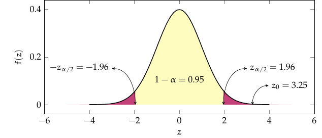

  * [testHipMedia1.pgf](https://github.com/walmes/Tikz/blob/master/src/testHipMedia1.pgf)

```tex
\def\zleft{-1.96}
\def\zright{1.96}
\def\muzero{0}
\def\muone{3.25}

\pgfplotsset{
  myplot/.style={
    width=12cm, height=6cm,
    xlabel=$z$, ylabel=$f(z)$,
    samples=50,
    legend style={draw=none, fill=none},
  }
}

\begin{tikzpicture}[
  >=stealth,
  every node/.style={rounded corners},
  Red/.style={
    draw=none, text opacity=1, fill=red!70!blue, fill opacity=0.75
  },
  Yellow/.style={
    draw=none, text opacity=1, fill=yellow, fill opacity=0.25
  },
  declare function={
    normalpdf(\x,\mu,\sigma)=
    (2*3.1415*\sigma^2)^(-0.5)*exp(-(\x-\mu)^2/(2*\sigma^2));
  }]

  \begin{axis}[myplot]
    \addplot[Red, smooth, domain=-5:\zleft]
      {normalpdf(x,\muzero,1)} \closedcycle;
    \addplot[Red, smooth, domain=\zright:5]
      {normalpdf(x,\muzero,1)} \closedcycle;
    \addplot[Yellow, smooth, domain=\zleft:\zright]
      {normalpdf(x,\muzero,1)} \closedcycle;
    \addplot[smooth, thick, domain=-4:4]
      {normalpdf(x,0,1)};
    \path[<->, draw] (axis cs: \zleft,0) to[out=90, in=0]
      (axis description cs: 0.25,0.4) node[left]
      {$-z_{\alpha/2}=\zleft$};
    \path[<->, draw] (axis cs: \zright,0) to[out=90, in=180]
      (axis description cs: 0.75,0.4) node[right]
      {$z_{\alpha/2}=\zright$};
    \path[<->, draw] (axis cs: \muone,0) to[out=90, in=180]
      (axis description cs: 0.83,0.25) node[right]
      {$z_0=\muone$};
    \node at (axis description cs: 0.5,0.3) {$1-\alpha = 0.95$};
  \end{axis}
\end{tikzpicture}
```
****

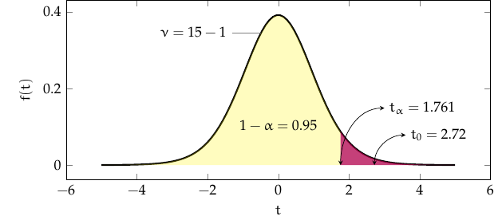

  * [testHipMedia2.pgf](https://github.com/walmes/Tikz/blob/master/src/testHipMedia2.pgf)

```tex
\def\tright{1.761}
\def\tzero{2.72}
\def\grauliber{14}

\pgfplotsset{
  myplot/.style={
    width=12cm, height=6cm,
    xlabel=$t$, ylabel=$f(t)$,
    samples=30,
    legend style={draw=none, fill=none},
  }
}

\begin{tikzpicture}[
  >=stealth,
  every node/.style={rounded corners},
  Red/.style={
    draw=none, text opacity=1, fill=red!70!blue, fill opacity=0.75
  },
  Yellow/.style={
    draw=none, text opacity=1, fill=yellow, fill opacity=0.25
  },
  declare function={
    normalpdf(\x,\mu,\sigma)=
    (2*3.1415*\sigma^2)^(-0.5)*exp(-(\x-\mu)^2/(2*\sigma^2));
  },
  declare function={
    gamma(\z)=
    (2.506628274631*sqrt(1/\z)+0.20888568*(1/\z)^(1.5)+
    0.00870357*(1/\z)^(2.5)-(174.2106599*(1/\z)^(3.5))/25920-
    (715.6423511*(1/\z)^(4.5))/1244160)*exp((-ln(1/\z)-1)*\z);
  },
  declare function={
    student(\x,\n)=
    gamma((\n+1)/2)/(sqrt(\n*pi)*
    gamma(\n/2))*((1+(\x*\x)/\n)^(-(\n+1)/2));
  }]

  \begin{axis}[myplot]
    \addplot[very thick, samples=100] {student(x,\grauliber)}
      node[pos=0.45, anchor=mid east, xshift=-2em,
      append after command={
        (\tikzlastnode.east) edge [thin, gray] +(2em,0)
      }] {$\nu=15-1$};
    \addplot[Red, domain=\tright:5]
      {student(x,\grauliber)} \closedcycle;
    \addplot[Yellow, domain=-5:\tright]
      {student(x,\grauliber)} \closedcycle;
    \path[<->, draw] (axis cs: \tright,0)
      to[out=90, in=180] (axis description cs: 0.75,0.4)
      node[right] {$t_{\alpha}=\tright$};
    \path[<->, draw] (axis cs: \tzero,0)
      to[out=90, in=180] (axis description cs: 0.8,0.25)
      node[right] {$t_0=\tzero$};
    \node at (axis description cs: 0.5,0.3) {$1-\alpha = 0.95$};
  \end{axis}
\end{tikzpicture}
```
****

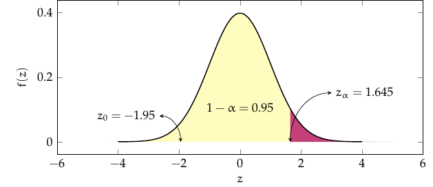

  * [testHipProp1.pgf](https://github.com/walmes/Tikz/blob/master/src/testHipProp1.pgf)

```tex
\def\zright{1.645}
\def\muzero{0}
\def\muone{-1.95}

\pgfplotsset{
  myplot/.style={
    width=12cm, height=6cm,
    xlabel=$z$, ylabel=$f(z)$,
    samples=50,
    legend style={draw=none, fill=none},
  }
}

\begin{tikzpicture}[
  >=stealth,
  every node/.style={rounded corners},
  Red/.style={
    draw=none, text opacity=1, fill=red!70!blue, fill opacity=0.75
  },
  Yellow/.style={
    draw=none, text opacity=1, fill=yellow, fill opacity=0.25
  },
  declare function={
    normalpdf(\x,\mu,\sigma)=
    (2*3.1415*\sigma^2)^(-0.5)*exp(-(\x-\mu)^2/(2*\sigma^2));
  }]

  \begin{axis}[myplot]
    \addplot[Red, smooth, domain=\zright:5]
      {normalpdf(x,\muzero,1)} \closedcycle;
    \addplot[Yellow, smooth, domain=-5:\zright]
      {normalpdf(x,\muzero,1)} \closedcycle;
    \addplot[smooth, thick, domain=-4:4]
      {normalpdf(x,0,1)};
    \path[<->, draw] (axis cs: \zright,0)
      to[out=90, in=180] (axis description cs: 0.75,0.4)
      node[right] {$z_{\alpha}=\zright$};
    \path[<->, draw] (axis cs: \muone,0)
      to[out=90, in=0] (axis description cs: 0.28,0.25)
      node[left] {$z_0=\muone$};
    \node at (axis description cs: 0.5,0.3) {$1-\alpha = 0.95$};
  \end{axis}
\end{tikzpicture}
```
****

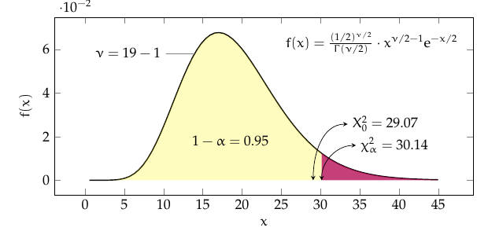

  * [testHipVar1.pgf](https://github.com/walmes/Tikz/blob/master/src/testHipVar1.pgf)

```tex
\def\chiright{30.14}
\def\xzero{29.07}
\def\grauliber{19}

\pgfplotsset{
  myplot/.style={
    width=12cm, height=6cm,
    xlabel=$x$, ylabel=$f(x)$,
    samples=30,
    legend style={draw=none, fill=none},
  }
}

\begin{tikzpicture}[
  >=stealth,
  Red/.style={
    draw=none, text opacity=1, fill=red!70!blue, fill opacity=0.75
  },
  Yellow/.style={
    draw=none, text opacity=1, fill=yellow, fill opacity=0.25
  },
  declare function={
    gamma(\z)=
    (2.506628274631*sqrt(1/\z)+0.20888568*(1/\z)^(1.5)+
    0.00870357*(1/\z)^(2.5)-(174.2106599*(1/\z)^(3.5))/25920-
    (715.6423511*(1/\z)^(4.5))/1244160)*exp((-ln(1/\z)-1)*\z);
  },
  declare function={
    chisquare(\x,\nu)=
    ((1/2)^(\nu/2))*\x^((\nu/2)-1)*exp(-(1/2)*\x)/gamma(\nu/2);
  }]

  \begin{axis}[myplot, domain=0:45]
    \addplot[samples=80, thick] {chisquare(x,\grauliber)}
      node[pos=0.3, anchor=mid east, xshift=-2em,
      append after command={
        (\tikzlastnode.east) edge [thin, gray] +(2em,0)
      }] {$\nu=\grauliber-1$};
    \addplot[Red, domain=\chiright:45]
      {chisquare(x,\grauliber)} \closedcycle;
    \addplot[Yellow, domain=0:\chiright]
      {chisquare(x,\grauliber)} \closedcycle;
    \path[<->, draw] (axis cs: \chiright,0)
      to[out=90, in=180] (axis description cs: 0.72,0.28)
      node[right] {$\chi^2_{\alpha}=\chiright$};
    \path[<->, draw] (axis cs: \xzero,0)
      to[out=90, in=180] (axis description cs: 0.7,0.4)
      node[right] {$X_0^2=\xzero$};
    \node at (axis description cs: 0.42,0.3) {$1-\alpha = 0.95$};
    \node[rotate=0, anchor=north east]
      at (axis description cs: 0.975, 0.95)
       {$f(x) = \frac{(1/2)^{\nu/2}}{\Gamma(\nu/2)}\cdot
         x^{\nu/2-1} \text{e}^{-x/2}$};
  \end{axis}
\end{tikzpicture}
```
****


  * [text_zoom.pgf](https://github.com/walmes/Tikz/blob/master/src/text_zoom.pgf)

```tex
% http://tex.stackexchange.com/questions/184911/magnify-text-using-spy-library

\tikzset{
  fancytitle/.style={fill=red, text=white, rounded corners},
  mybox/.style={
    draw=red, fill=blue!20, very thick,
    rectangle, rounded corners, inner sep=10pt, inner ysep=20pt
  }
}

\begin{tikzpicture}[
  spy using outlines={
    rectangle, magnification=2, size=4.5cm, height=2cm, connect spies
  }]
  \node [mybox] (box){%
    \begin{minipage}{0.50\textwidth}
      The Indexed Web contains at least 4.96 billion
      pages (as of Wednesday, 11 June, 2014). -- WorldWideWebSize.com
    \end{minipage}
  };
  \node[fancytitle, right=10pt] at (box.north west) {Did you know?};
  \node[fancytitle, rounded corners] at (box.east) {$\clubsuit$};
  \spy[red] on (-2.1,.25) in node[right] at (-1,-2);
\end{tikzpicture}%
```
****

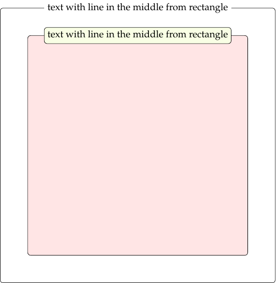

  * [textos_retangulos.pgf](https://github.com/walmes/Tikz/blob/master/src/textos_retangulos.pgf)

```tex
% http://tex.stackexchange.com/questions/70154/draw-only-part-of-a-rectangle-in-tikz

\begin{tikzpicture}
  % first solution
  \node (label) at (0,5) {text with line in the middle from rectangle};
  \draw[rounded corners=3pt] (label) -| (-5,-5) -| (5,5) -- (label);

  % second solution (with filled rectangle and node)
  \node[draw,fill=lime!10,rounded corners=3pt] (label) at (0,4)
    {text with line in the middle from rectangle};

  \begin{scope}[on background layer]
    \draw[rounded corners=3pt, fill=red!10]
      (label) -| (-4,-4) -| (4,4) -- (label);
  \end{scope}

\end{tikzpicture}
```
****

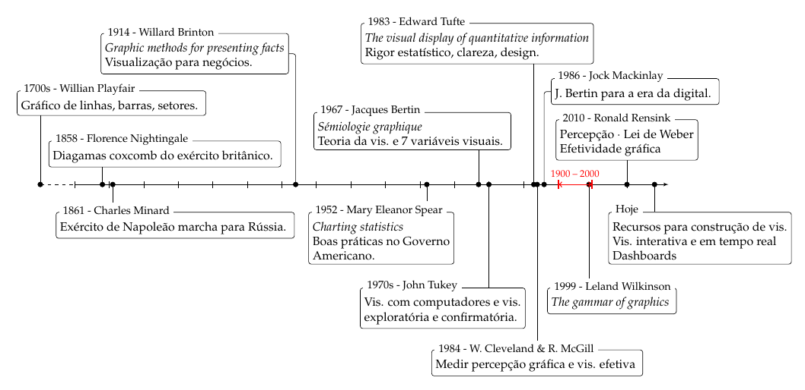

  * [timeline_dataviz.pgf](https://github.com/walmes/Tikz/blob/master/src/timeline_dataviz.pgf)

```tex
\newcommand{\mybox}[1]{%
   #1
}%

\newcommand{\mydraw}[7]{%
  \coordinate (#1) at (#2, 0);
  \draw[fill=black] (#1) circle (2pt);
  \coordinate (#1_box) at ($ (#1)+(#3) $);
  \node[
    #4,
    draw,
    rounded corners=2pt,
    fill=white,
    align=left] (#1_text) at (#1_box) {\\ \mybox{#6}};
  \path[draw, rounded corners=2pt] (#1) #7 (#1_box);
  \node[
    yshift=3pt,
    right=0.25em,
    fill=orange!90!gray,
    rounded corners=2pt,
    minimum height=1.5em,
    font=\small] at (#1_text.north west) {#5};
}%

\begin{tikzpicture}[xscale=1]%
  \draw[->, -latex'] (185.0, 0) -- (202.2, 0);
  \draw[dashed] (184.0, 0) -- (185.0, 0);

  \foreach \x in {185.0, 186.0, ..., 201.8} {
    \draw (\x, -0.1) -- (\x, 0.1);
  }

  \mydraw{playfair}{183.9}{0, 1.9}{anchor=-170} {1786 - Willian Playfair}{
    Gr\'afico de linhas, barras, setores.
  }{--}

  \mydraw{snow}{185.4}{0, -2.5}{anchor=140}{1854 - John Snow}{
    Mapeamento e descoberta\\ da fonte de c\'olera.
  }{--}

  \mydraw{florence}{185.8}{0, 0.5}{anchor=-168.5}{1858 - Florence Nightingale}{
    Diagamas ``coxcomb'' do ex\'ercito brit\^anico.
  }{--}

  \mydraw{minard}{186.1}{0, -0.8}{anchor=158}{1861 - Charles Minard}{
    Ex\'ercito de Napole\~ao\\ marcha para R\'ussia.
  }{|-}

  \mydraw{brinton}{191.4}{ -0.2,  3.8}{anchor=0}{1914 - Willard Brinton}{
    \emph{Graphic methods for presenting facts}\\
    Visualiza\c c\~ao para neg\'ocios.
  }{|-}

  \mydraw{bertin}{196.7}{0, 1.0}{anchor=-16}{1967 - Jacques Bertin}{
    \emph{S\'emiologie graphique}\\
    Teoria da vis. e 7 vari\'aveis visuais.
  }{--}

  \mydraw{tufte}{198.3}{0, 3.7}{anchor=-20}{1983 - Edward Tufte}{
    \emph{The visual display of quantitative information}\\
    Rigor estat\'istico, clareza, design.
  }{--}

  \mydraw{mackinlay}{198.6}{0.2, 2.8}{anchor=180}{1986 - Jock Mackinlay}{
    Tese sobre J. Bertin para a era da digital.
  }{|-}

  \mydraw{spear}{195.2}{0, -0.8}{anchor=30}{1952 - Mary Eleanor Spear}{
    \emph{Charting statistics}\\
    Boas pr\'aticas no Governo\\ Americano.
  }{--}

  \mydraw{tukey}{197.0}{0, -3.0}{anchor=24}{1970s - John Tukey}{
    Vis. com computadores e vis.\\ explorat\'oria e confirmat\'oria.
  }{|-}

  \mydraw{hoje}{201.8}{0, -0.8}{anchor=150}{Hoje}{
    Recursos para constru\c c\~ao de vis.\\
    Vis. interativa e em tempo real\\
    Dashboards
  }{--}

  \mydraw{cleveland}{198.4}{0, -5.2}{anchor=90}{1984 - W. Cleveland \& R. McGill}{
    Medir percep\c c\~ao gr\'afica e vis. efetiva.
  }{--}

  \mydraw{rensink}{201.0}{0, 0.7}{anchor=-90}{2010 - Ronald Rensink}{
    Percep\c c\~ao $\cdot$ Lei de Weber\\
    Efetividade gr\'afica.
  }{--}

  \mydraw{wilkinson}{199.9}{0, -3.0}{anchor=150}{1999 - Leland Wilkinson}{
    \emph{The gammar of graphics}\\
    Gram\'atica concisa para repres.\\ componentes gr\'aficos.
  }{--}

  \draw[|<->|, thick, red] (199.0, 0) --
    (200.0, 0) node[midway, above=2pt, font=\footnotesize] {1900 -- 2000};

\end{tikzpicture}%
```
****

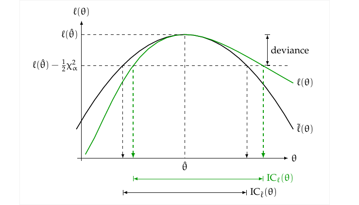

  * [tipos_de_IC.pgf](https://github.com/walmes/Tikz/blob/master/src/tipos_de_IC.pgf)

```tex
\def\Y{9}
\def\X{5}
\def\C{-0.25}
\def\dX{3}
\def\dY{2.25}
\def\D{1.5}
\def\xshift{1}

\tikzset{
  aponta/.style={
    color=green!50!blue, rounded corners=5pt, -latex, thick
  },
  cotas/.style={|<->|, >=latex}
}

\begin{tikzpicture}[domain=-0.25:10.25, xscale=0.75, yscale=0.5]
  % \draw[very thin,color=gray!30] (0,0) grid (10,20);
  \draw[draw=gray!10] (-3,-3.4) rectangle (12,11.5);
  \draw[-latex] (-0.2,0) -- (10,0) node[right] {$\theta$};
  \draw[-latex] (0,-0.2) -- (0,10) node[above] (E) {$\ell(\theta)$};

  \draw[color=black, thick]
    plot[id=x] function{\Y+\C*(x-\X)**2}
    node[right] {$\tilde{\ell}(\theta)$};
  \draw[color=green!60!black, thick, thick]
    plot[id=x] function{\Y*(x/\X)**\D*exp(\D*(1-x/\X))}
    node[color=black, right] {$\ell(\theta)$};

  \coordinate (llmax) at (\X,\Y);
  \coordinate (llmaxy) at (0,\Y);
  \coordinate (llmaxx) at (\X,0);

  \coordinate (llhzero) at (\X+\dX,\Y-\dY);
  \coordinate (llhzeroy) at (0,\Y-\dY);
  \coordinate (llhzerox) at (\X+\dX,0);

  \draw[dashed] (llmaxy)
    node[left] {$\ell(\hat\theta)$} -| (llmaxx)
    node[below] {$\hat\theta$};

  \draw[dashed] (llhzeroy)
    node[left] {$\ell(\hat{\theta})-\frac{1}{2}\chi_{\alpha}^2$}
    -- ++(10,0);
  \draw[latex-, dashed] (2,0) -- ++(llhzeroy);
  \draw[latex-, dashed] (8,0) -- ++(llhzeroy);
  \draw[latex-, dashed, color=green!60!black,thick]
    (2.5,0) -- ++(llhzeroy);
  \draw[latex-, dashed, color=green!60!black,thick]
    (8.8,0) -- ++(llhzeroy);

  \draw[yshift=-2.5cm, cotas] (2,0) -- (8,0)
    node [right] {IC$_{\tilde{\ell}}(\theta)$};
  \draw[yshift=-1.5cm, color=green!60!black, cotas] (2.5,0) -- (8.8,0)
    node [right] {IC$_{\ell}(\theta)$};

  \draw[cotas] (\X+\dX+\xshift,\Y) -- ++(0,-\dY)
    node [midway, right, text width=3cm] {deviance\\};

\end{tikzpicture}
```
****

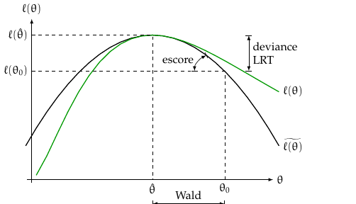

  * [tipos_de_testes.pgf](https://github.com/walmes/Tikz/blob/master/src/tipos_de_testes.pgf)

```tex
\begin{tikzpicture}[
  domain=-0.25:10.25, xscale=0.75, yscale=0.5,
  aponta/.style={
    color=green!50!blue, rounded corners=5pt, -latex, thick
  },
  cotas/.style={|<->|, >=latex}]

  \draw[-latex] (-0.2,0) -- (10,0) node[right] {$\theta$};
  \draw[-latex] (0,-0.2) -- (0,10) node[above] (E) {$\ell(\theta)$};
  \def\Y{9}; \def\X{5}; \def\C{-0.25}
  \def\dX{3}; \def\dY{2.25}; \def\D{1.5}
  \draw[color=black, thick]
    plot[id=x] function{\Y+\C*(x-\X)**2}
    node[right] {$\widetilde{\ell(\theta)}$};
  \draw[color=green!60!black, thick, thick]
    plot[id=x] function{\Y*(x/\X)**\D*exp(\D*(1-x/\X))}
    node[color=black, right] {$\ell(\theta)$};
  \coordinate (llmax) at (\X,\Y);
  \coordinate (llmaxy) at (0,\Y);
  \coordinate (llmaxx) at (\X,0);
  \coordinate (llhzero) at (\X+\dX,\Y-\dY);
  \coordinate (llhzeroy) at (0,\Y-\dY);
  \coordinate (llhzerox) at (\X+\dX,0);
  \draw[dashed] (llmaxy) node[left] {$\ell(\hat\theta)$} -|
    (llmaxx) node[below] {$\hat\theta$};
  \draw[dashed] (llhzeroy) node[left] {$\ell(\theta_0)$} -|
    (llhzerox) node[below] {$\theta_0$};
  \def\yshift{-1.5}
  \draw[cotas] (\X,\yshift) -- ++(\dX,0) node [midway, above] {Wald};
  \def\xshift{1}
  \draw[cotas] (\X+\dX+\xshift,\Y) -- ++(0,-\dY)
    node [midway, right, text width=3cm] {deviance\\ LRT};
  \def\raio{1.25}
  \draw[cotas] (\X+\dX-\raio,\Y-\dY) arc (180:127:\raio cm);
  \node[left] at (\X+\dX/1.6,\Y-\dY/1.4) {escore};
\end{tikzpicture}
```
****

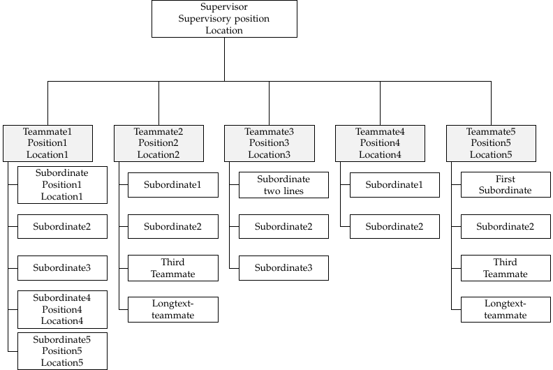

  * [tree_1.pgf](https://github.com/walmes/Tikz/blob/master/src/tree_1.pgf)

```tex
% \tikzstyle{every node}=[
%   draw=black,thin,anchor=west, minimum height=2.5em]
\tikzset{
  every node/.style={
    draw=black,thin,anchor=west, minimum height=2.5em}
}

\begin{tikzpicture}[
  supervisor/.style={%
    edge from parent fork down,
    level distance=2.5cm,
    text centered, text width=5cm},
  teammate/.style={%
    text centered, text width=3cm,
    level distance=2.5cm,
    fill=gray!10},
  subordinate/.style={%
    grow=down, xshift=-1.1cm, % Horizontal position of the child node
    text centered, text width=3cm,
    edge from parent path={
      (\tikzparentnode.205) |- (\tikzchildnode.west)
    }},
  level1/.style ={level distance=1.5cm},
  level2/.style ={level distance=3cm},
  level3/.style ={level distance=4.5cm},
  level4/.style ={level distance=6cm},
  level5/.style ={level distance=7.5cm},
  level 1/.style={sibling distance=4cm},
  level 1/.append style={level distance=4.5cm}]
  % \draw[help lines] (0,0) grid (4,3);

  % Supervisor
  \node [anchor=south, supervisor]
    {Supervisor\\Supervisory position\\Location}
  [edge from parent fork down]

  % Teammate and Subordinates
  child {node [teammate] {Teammate1\\Position1\\Location1}
    child [subordinate,level1]
      {node {Subordinate\\Position1\\Location1}}
    child [subordinate,level2]
      {node {Subordinate2}}
    child [subordinate,level3]
      {node {Subordinate3}}
    child [subordinate,level4]
      {node {Subordinate4\\Position4\\Location4}}
    child [subordinate,level5]
      {node {Subordinate5\\Position5\\Location5}}}
  child{node [teammate] {Teammate2\\Position2\\Location2}
    child[subordinate,level1]
      {node {Subordinate1}}
    child[subordinate,level2]
      {node {Subordinate2}}
    child[subordinate,level3]
      {node {Third\\Teammate}}
    child[subordinate,level4]
      {node {Longtext-\\teammate}}}
  child{node [teammate] {Teammate3\\Position3\\Location3}
    child[subordinate,level1]
      {node {Subordinate\\two lines}}
    child[subordinate,level2]
      {node {Subordinate2}}     
    child[subordinate,level3]
      {node {Subordinate3}}}
  child{node [teammate] {Teammate4\\Position4\\Location4}
    child[subordinate,level1]
      {node {Subordinate1}}
    child[subordinate,level2]
      {node {Subordinate2}}}
  child{node [teammate] {Teammate5\\Position5\\Location5}
    child[subordinate,level1]
      {node {First\\Subordinate}}
    child[subordinate,level2]
      {node {Subordinate2}}
    child[subordinate,level3]
      {node {Third\\Teammate}}
    child[subordinate,level4]
      {node {Longtext-\\teammate}}};
\end{tikzpicture}
```
****

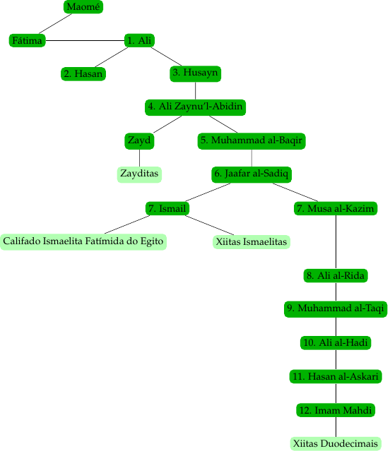

  * [tree_2.pgf](https://github.com/walmes/Tikz/blob/master/src/tree_2.pgf)

```tex
\begin{tikzpicture}[
  draw,
  every node/.style={
    fill=green!70!black,
    rectangle,
    rounded corners
  },
  sibling distance=4cm,
  level distance=12mm,
  level 6/.style={
    sibling distance=6cm
  }]

  \node {Maom{\'e}}
  child {node (fatima) {F{\'a}tima}}
  child {node (ali) {1. Ali} edge from parent [draw=none]
    child {node {2. Hasan}}
    child {node {3. Husayn} 
      child {node {4. Ali Zaynu'l-Abidin}
        child {node {Zayd} child {node [fill=green!30]{Zayditas}}}
        child {node {5. Muhammad al-Baqir}
          child {node {6. Jaafar al-Sadiq}
            child {node {7. Ismail}
              child {node [fill=green!30]
                {Califado Ismaelita Fat{\'i}mida do Egito}}
              child {node [fill=green!30]{Xiitas Ismaelitas}}}
            child {node {7. Musa al-Kazim}
              child [level distance=24mm] {node {8. Ali al-Rida}
                child [level distance=12mm] {node {9. Muhammad al-Taqi}
                  child {node {10. Ali al-Hadi}
                    child {node {11. Hasan al-Askari}
                      child {node {12. Imam Mahdi}
                        child {node [fill=green!30]
                          {Xiitas Duodecimais}}
                      }
                    }
                  }
                }
              }
            }
          }
        }
      }
    }
  };

  \draw (fatima) -- (ali);
\end{tikzpicture}
```
****

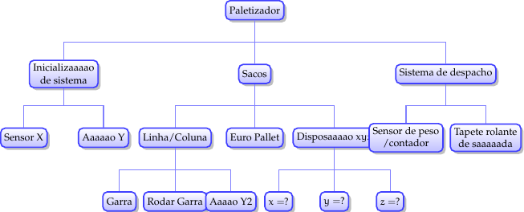

  * [tree_3.pgf](https://github.com/walmes/Tikz/blob/master/src/tree_3.pgf)

```tex
\usetikzlibrary{trees}%
\begin{tikzpicture}[
  font=\small,
  every node/.style={
%     top color=white,
%     bottom color=blue!25,
    rectangle,
    rounded corners,
    minimum size=6mm,
%     draw=blue!75,
    very thick,
%     drop shadow,
    align=center
  },
  edge from parent/.style={draw=blue!50,thick},
  level 1/.style={sibling distance=6cm},
  level 2/.style={sibling distance=2.5cm},
  level 3/.style={sibling distance=1.75cm},
  level distance=2cm,
  edge from parent fork down
]

  \node {Paletizador} % root
  child { node {Inicializaaaao\\de sistema}
    child { node {Sensor X}}
    child { node {Aaaaao Y}}
  }
  child { node {Sacos}
    child { node {Linha/Coluna}
      child { node {Garra}}
      child { node {Rodar Garra}}
      child { node {Aaaao Y2}}
    }
    child { node {Euro Pallet}}
    child { node {Disposaaaao $xyz$}
      child { node {$x=?$}}
      child { node {$y=?$}}
      child { node {$z=?$}}
    }
  }
  child { node {Sistema de despacho}
    child { node {Sensor de peso\\/contador}}
    child { node {Tapete rolante\\de saaaaada}}
  }
  ;
\end{tikzpicture}
```
****

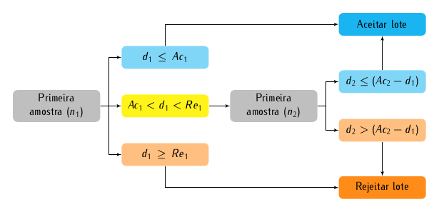

  * [two-phases-sampling.pgf](https://github.com/walmes/Tikz/blob/master/src/two-phases-sampling.pgf)

```tex
\usetikzlibrary{trees}%
\begin{tikzpicture}[
  grow = right,
  ->,
  >=latex',
  level 1/.style = {level distance = 2.0cm, sibling distance = 1.5cm},
  edge from parent path = {
    (\tikzparentnode.east) -| +(0.25,0) |- (\tikzchildnode.west)
  },
  % edge from parent fork right,
  bag/.style={
    text width = 7em,
    text centered,
    anchor = west,
    fill = gray!50,
    rounded corners,
    minimum height = 2em},
  ]

  \node[bag] {Primeira amostra ($n_1$)} 
    child  {
      node[bag, fill = orange!50!white] (rj1) {$d_1 \geq Re_1$}
    } 
    child { 
      node[bag, fill = yellow!90!white] {$Ac_1 < d_1 < Re_1$}
      child  {
        node[bag] {Primeira amostra ($n_2$)}
          child {
            node (b) [bag, fill = orange!50!white] {$d_2 > (Ac_2 - d_1)$}
          }
          child {
            node (a) [bag, fill = cyan!50!white] {$d_2 \leq (Ac_2 - d_1)$}
          }
      }
    } 
    child {
      node[bag, fill = cyan!50!white] (ac1) {$d_1 \leq Ac_1$}
    }
  ;

  \node[bag, above = 3em of a, fill = cyan!90!white] (ac) {Aceitar lote};
  \node[bag, below = 3em of b, fill = orange!90!white] (rj) {Rejeitar lote};

  \path[draw] (ac1) |- (ac);
  \path[draw] (rj1) |- (rj);

  \path[draw] (a) -- (ac);
  \path[draw] (b) -- (rj);

\end{tikzpicture}%
```
****


  * [ubuntu.pgf](https://github.com/walmes/Tikz/blob/master/src/ubuntu.pgf)

```tex
% http://tex.stackexchange.com/questions/250198/draw-the-ubuntu-logo-with-tikz

\begin{tikzpicture}

  \pgfdeclarelayer{fg}   
  \pgfsetlayers{main,fg}
  \newcommand\rad{3cm}
  \definecolor{myred}{RGB}{212,0,0}
  \definecolor{myorange}{RGB}{244,72,0}
  \definecolor{myyellow}{RGB}{251,139,0}

  \newcommand{\hug}[3]{
    \begin{scope}[shift={(0,0)}, rotate=#1]%
      \draw[#2, line width=1.5cm] (\rad,0) arc (0:120:\rad)%
      node[circle, fill=#3, minimum size=1.9cm,%
      draw=white, line width=2.8mm] at (57.5:\rad*1.3) {};%
      \begin{pgfonlayer}{fg}%
        \node[rectangle, fill=white, rotate=#1,%
        minimum height=3mm, minimum width=1.6cm] at (\rad,0) {};%
      \end{pgfonlayer}%
    \end{scope}%
  }

  \foreach \angle/\cola/\colb in {
    0/myorange/myred,
    120/myyellow/myorange,
    240/myred/myyellow}{
    \hug{\angle}{\cola}{\colb}
  }

\end{tikzpicture}
```
****

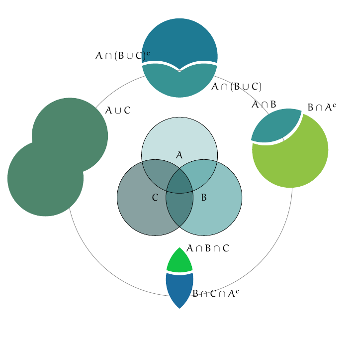

  * [union_intersec.pgf](https://github.com/walmes/Tikz/blob/master/src/union_intersec.pgf)

```tex
\def\firstcircle{(90:1cm) circle (1.35cm)}
\def\secondcircle{(-30:1cm) circle (1.35cm)}
\def\thirdcircle{(-150:1cm) circle (1.35cm)}

\begin{tikzpicture}

  %% 3 circulos.
  \begin{scope}[fill opacity=0.5]
    \coordinate (ori) at (0,0);
    \fill[darkgreen!50!white] \firstcircle;
    \fill[darkgreen] \secondcircle;
    \fill[darkgreen!50!black] \thirdcircle;
  \end{scope}

  %% Contornos.
  \begin{scope}
    \draw \firstcircle node {$A$};
    \draw \secondcircle node {$B$};
    \draw \thirdcircle node {$C$};
  \end{scope}

  \path[draw, name path=bigcircle, gray] (0,0) circle (4cm);

  \begin{scope}[shift={(31:3.5cm)}]
    \clip \firstcircle node {$A\cap B$};
    \fill[darkgreen!90!white] \secondcircle;
  \end{scope}

  \begin{scope}[shift={(29:3.5cm)}]
    \begin{scope}[even odd rule]% first circle without the second
      \clip \firstcircle (-3,-3) rectangle (3,3);
      \fill[darkgreen!50!yellow] \secondcircle;
    \end{scope}
    \node at (2,1) {$B \cap A^c$};
  \end{scope}

  \begin{scope}[shift={(-90:2.8cm)}]
    \begin{scope}
      \clip \firstcircle;
      \clip \secondcircle;
      \fill[darkgreen!50!green] \thirdcircle;
    \end{scope}
    \node at (1,0.5) {$A\cap B \cap C$};
  \end{scope}

  \begin{scope}[shift={(-90:2.9cm)}]
    \begin{scope}[even odd rule]
      \clip \firstcircle (-3,-3) rectangle (3,3);
      \clip \secondcircle;
      \fill[darkgreen!80!blue] \thirdcircle;
    \end{scope}
    \node at (1.3,-1) {$B \cap C \cap A^c$};
  \end{scope}

  \begin{scope}[shift={(90:3.4cm)}]
    \begin{scope}
      \clip \firstcircle;
      \fill[darkgreen!90!white] \secondcircle;
      \clip \firstcircle;
      \fill[darkgreen!90!white] \thirdcircle;
    \end{scope}
    % \node[right] at (1,0) {$(A\cap B) \cup (A\cap C)$};
    \node[right] at (1,0) {$A\cap (B\cup C)$};
  \end{scope}

  \begin{scope}[shift={(90:3.5cm)}]
    \begin{scope}[even odd rule]
      \clip \thirdcircle (-3,-3) rectangle (3,3); %% rect U A
      \clip \secondcircle (-3,-3) rectangle (3,3);
      \fill[darkgreen!90!blue] \firstcircle;
    \end{scope}
    \node at (-2,1) {$A \cap (B \cup C)^c$};
  \end{scope}

  \begin{scope}[shift={(170:3.95cm)}]
    \begin{scope}
      \fill[darkgreen!80!orange] \firstcircle;
      \fill[darkgreen!80!orange] \thirdcircle;
    \end{scope}
    \node at (1.7,1.9) {$A \cup C$};
  \end{scope}

\end{tikzpicture}
```
****

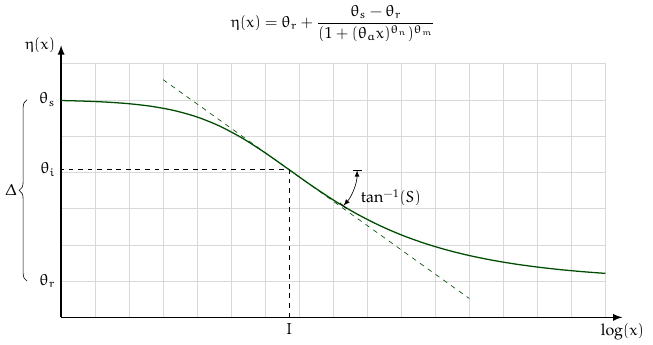

  * [vangenuchten.pgf](https://github.com/walmes/Tikz/blob/master/src/vangenuchten.pgf)

```tex
\begin{tikzpicture}[domain=-3:5, xscale=1.5, yscale=8, >=latex]
  \def\tr{0.1}; \def\ts{0.6}; \def\al{1.3}
  \def\n{1.6}; \def\I{0.3506}
  % -log(al)+log(m)/n = -log(al)+log(1-1/n)/n
  \def\ti{0.4071}; \def\S{-0.1340}; \def\Sangle{-42}; \def\f1{0.8}
  \draw[very thin,color=gray!30] (-3,0)
    grid[xstep=0.5, ystep=0.1] (5,0.7);
  \draw[->, line width=1pt] (-3,0) -- (5.25,0) node[below] {$\log(x)$};
  \draw[->, line width=1pt] (-3,0) -- (-3,0.75) node[left] {$\eta(x)$};
  \draw[color=green!30!black, thick, smooth]
    plot[id=x, domain=-3:5]
    function{\tr+(\ts-\tr)/(1+(\al*exp(x))**\n)**(1-1/\n)}
    node[right] {};
  \node[left] (tr) at (-3,\tr) {$\theta_r$};
  \node[left] (ts) at (-3,\ts) {$\theta_s$};
  \draw[dashed] (\I,0) node[below] {$I$} -- (\I,\ti) -- (-3,\ti)
    node[left] {$\theta_i$};
  \draw[color=green!30!black, dashed]
    plot[id=x, domain=-1.5:3]
    function{\ti+\S*(x-\I)}
    node[right] {};
  \draw [decorate, decoration={brace,amplitude=5pt}]
    (-3.5,\tr) -- (-3.5,\ts) node [black,midway,left=3pt] {$\Delta$};
  \draw[|<->|] (\I,\ti)++(1,0) arc (0:\Sangle:0.8 and 0.15);
  \path (\I,\ti)++(0.5*1.5\Sangle/8:1)
    node[right=-1pt] {$\tan^{-1}(S)$};
  \node[anchor=base] (vg) at (1,0.8)
    {$\eta(x) = \theta_r+\displaystyle\frac{\theta_s-\theta_r}{
        (1+(\theta_a x)^{\theta_n})^{\theta_m}}$};
\end{tikzpicture}
```
****

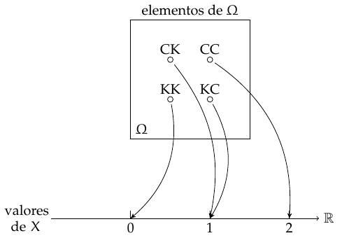

  * [variavel_aleatoria1.pgf](https://github.com/walmes/Tikz/blob/master/src/variavel_aleatoria1.pgf)

```tex
\begin{tikzpicture}
  \draw (0,0) rectangle (3,3) node[above right] at (0,0) {$\Omega$};
  \node[above] at (1.5,3) {elementos de $\Omega$};
  \node (CC) at (2,2) {};
  \node (CK) at (1,2) {};
  \node (KC) at (2,1) {};
  \node (KK) at (1,1) {};
  \node[left, text width=3em, text centered] (arrowstart) at (-2,-2)
    {valores de $X$};
  \node (arrowend) at (5,-2) {$\mathbb{R}$};
  \draw (CC) circle (2pt) node[above] {CC};
  \draw (KC) circle (2pt) node[above] {KC};
  \draw (CK) circle (2pt) node[above] {CK};
  \draw (KK) circle (2pt) node[above] {KK};
  \draw[->] (arrowstart) -- (arrowend);
  \foreach \x/\y in {0/0,2/1,4/2}
  \draw (\x,-1.8) -- (\x,-2) node[anchor=north] {\y};
  \path[->,>=stealth']
    (CC) edge[bend left] (4,-2)
    (CK) edge[bend left=25] (2,-2)
    (KC) edge[bend left] (2,-2)
    (KK) edge[bend left] (0,-2);
\end{tikzpicture}
```
****

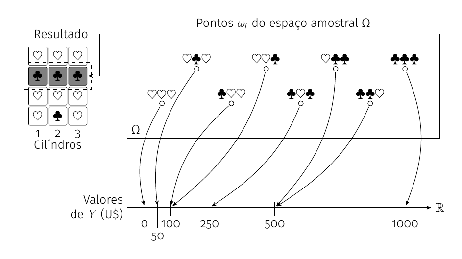

  * [variavel_aleatoria2.pgf](https://github.com/walmes/Tikz/blob/master/src/variavel_aleatoria2.pgf)

```tex
\def\A{\clubsuit}
\def\B{\heartsuit}

\begin{tikzpicture}
  \draw (-2,0) rectangle (7,3) node[above right] at (-2,0) {$\Omega$};
  \node[above] at (2.5,3) {elementos de $\Omega$};
  \node (111) at (6,2) {};
  \node (110) at (5,1) {};
  \node (011) at (4,2) {};
  \node (101) at (3,1) {};
  \node (001) at (2,2) {};
  \node (100) at (1,1) {};
  \node (010) at (0,2) {};
  \node (000) at (-1,1) {};
  \node[left, text width=3em, text centered] (arrowstart) at (-2,-2)
    {valores de $X$ (U\$)};
  \node (arrowend) at (7,-2) {$\mathbb{R}$};
  \draw (111) circle (2pt) node[above] {$\A\A\A$};
  \draw (110) circle (2pt) node[above] {$\A\A\B$};
  \draw (011) circle (2pt) node[above] {$\B\A\A$};
  \draw (101) circle (2pt) node[above] {$\A\B\A$};
  \draw (001) circle (2pt) node[above] {$\B\B\A$};
  \draw (100) circle (2pt) node[above] {$\A\B\B$};
  \draw (010) circle (2pt) node[above] {$\B\A\B$};
  \draw (000) circle (2pt) node[above] {$\B\B\B$};
  \draw[->] (arrowstart) -- (arrowend);
  \foreach \x/\y in {0/0,1/50,2/100,3/250,4/500,5/1000}{
    \draw (\x,-1.8) -- (\x,-2) node[anchor=north] {\y};
  }
  \path [->,>=stealth']
    (111) edge[bend left] (5,-2)
    (110) edge[bend left] (4,-2)
    (011) edge[bend left] (4,-2)
    (101) edge[bend left] (3,-2)
    (001) edge[bend left] (2,-2)
    (100) edge[bend right] (2,-2)
    (010) edge[bend right] (1,-2)
    (000) edge[bend right] (0,-2);
\end{tikzpicture}
```
****

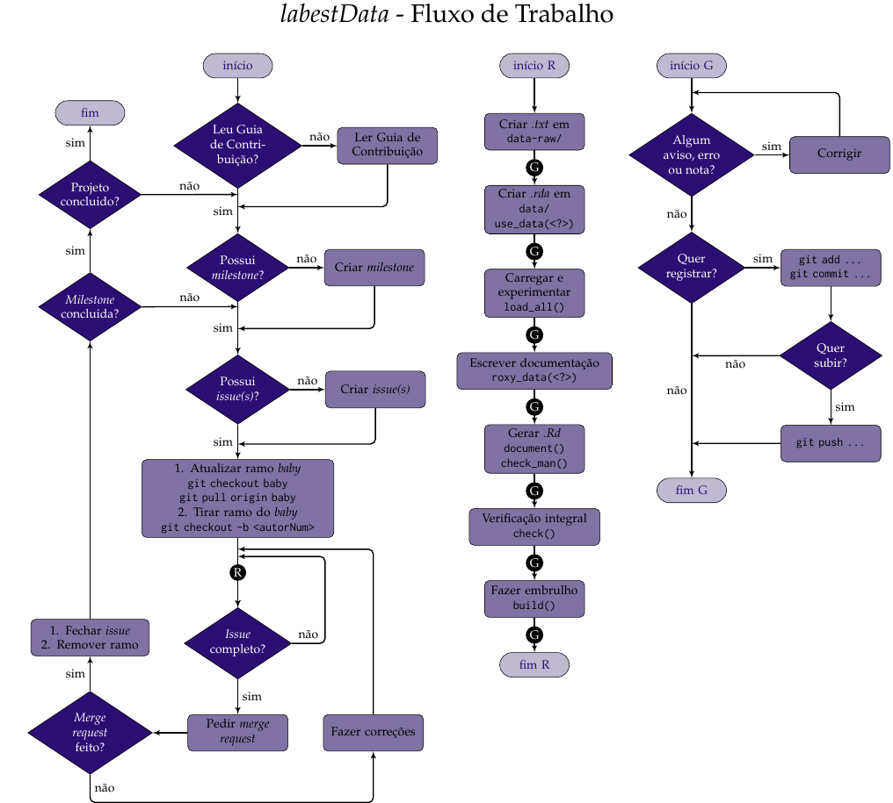

  * [workflow-labestData.pgf](https://github.com/walmes/Tikz/blob/master/src/workflow-labestData.pgf)

```tex
% http://www.texample.net/tikz/examples/simple-flow-chart/

% 2a0e72, 8072a3, bfb9d1
\definecolor{color1}{HTML}{BFB9D1}
\definecolor{color2}{HTML}{8072A3}
\definecolor{color3}{HTML}{2A0E72}

\tikzstyle{decision} = [diamond, aspect=1.5, draw, fill=color3, text=white,
    text width=5em, text badly centered, node distance=3.5cm, inner sep=1pt]
\tikzstyle{term} = [rectangle, draw, fill=color1, text=color3,
    text width=5em, text centered, rounded corners = 1em, minimum height=2em]
\tikzstyle{block} = [rectangle, draw, fill=color2, 
    text width=7.5em, text centered, rounded corners, minimum height=3em]
\tikzstyle{line} = [draw, -latex', line width=1pt, rounded corners]
\tikzstyle{lineyn} = [line, auto]

\tikzset{
    cir/.style={draw, circle, fill, inner sep=1pt, text=white},
}

\begin{tikzpicture}

\def\nao{n\~{a}o}
\def\sim{sim}

\node (ini) at (0,0) [term] {in\'{i}cio};

\node (leu) [decision, below=2em of ini] {Leu Guia de Contribui\c{c}\~{a}o?};
\path [line] (ini) -- (leu);

\node (ler) [block, right=1cm of leu] {Ler Guia de Contribui\c{c}\~{a}o};
\path [lineyn] (leu) -- node {\nao} (ler);

\node (mil) [decision, below of=leu] {Possui \emph{milestone}?};

\path [lineyn] (ler) |- ($(leu)!0.5!(mil)$);
\path [lineyn] (leu) -- node[left] {\sim} (mil);

\node (cml) [block, right=1cm of mil] {Criar \emph{milestone}};
\path [lineyn] (mil) -- node {\nao} (cml);

\node (iss) [decision, below of=mil] {Possui \emph{issue(s)}?};
\path [lineyn] (cml) |- ($(mil)!0.5!(iss)$);
\path [lineyn] (mil) -- node[left] {\sim} (iss);

\node (cis) [block, right=1cm of iss] {Criar \emph{issue(s)}};
\path [lineyn] (iss) -- node {\nao} (cis);

\node (atl) [block, below=1cm of iss, text width=15em] {
  1. Atualizar ramo \emph{baby}\\  
   \texttt{git checkout baby}\\ \texttt{git pull origin baby}\\
  2. Tirar ramo do \emph{baby}\\
  \texttt{git checkout -b <autorNum>}};
\path [lineyn] (cis) |- ($(iss)!0.5!(atl)$);
\path [lineyn] (iss) -- node[left] {\sim} (atl);

\node (isc) [decision, below=2cm of atl] {\emph{Issue} completo?};
\path [lineyn] (atl) -- (isc);

\path [line] (atl) -- node [cir] {R} (isc);

\node (pmr) [block, below=1cm of isc] {Pedir \emph{merge request}};
\path [lineyn] (isc) -- node {\sim} (pmr);
\path [lineyn] (isc) -- node {\nao} +(2.5,0) |- ($(atl)!0.4!(isc)$);

\node (mra) [decision, left=1cm of pmr] {\emph{Merge request} feito?};
\path [lineyn] (pmr) -- (mra);

\node (doa) [block, right=1cm of pmr] {Fazer corre\c{c}\~{o}es};
\path [lineyn] (mra) -- node {\nao} +(0, -2) -| (doa);
\path [lineyn] (doa) |- ($(atl)!0.35!(isc)$);

\node (lim) [block, above=1cm of mra, text width=9em] {1. Fechar \emph{issue}\\ 2. Remover ramo};
\path [lineyn] (mra) -- node {\sim} (lim);

\node (mlc) [decision, above=7.97cm of lim] {\emph{Milestone} concluida?};
\path [lineyn] (lim) -- (mlc);
\path [lineyn] (mlc) -- node {\nao} ($(mil)!0.32!(iss)$);

\node (pro) [decision, above=1.24cm of mlc] {Projeto concluido?};
\path [lineyn] (mlc) -- node {sim} (pro);
\path [lineyn] (pro) -- node {\nao} ($(leu)!0.4!(mil)$);

\node (fim) [term, above=1cm of pro] {fim};
\path [lineyn] (pro) -- node {sim} (fim);

%------------------------------------------------------------------------------

\node (str) [term, right=6.5cm of ini] {in\'{i}cio R};

\node (tsv) [block, below=1cm of str] {Criar \emph{.txt} em\\\texttt{data-raw/}};
\path [line] (str) -- (tsv);

\node (rda) [block, below=1cm of tsv] {Criar \emph{.rda} em \\\texttt{data/}\\\texttt{use\_data(<?>)}};
\path [line] (tsv) -- node [cir] {G} (rda);

\node (loa) [block, below=1cm of rda] {Carregar e experimentar\\\texttt{load\_all()}};
\path [line] (rda) -- node [cir] {G} (loa);

\node (rox) [block, below=1cm of loa, text width=12em] {Escrever documenta\c{c}\~{a}o\\\texttt{roxy\_data(<?>)}};
\path [line] (loa) -- node [cir] {G} (rox);

\node (rdo) [block, below=1cm of rox] {Gerar \emph{.Rd}\\\texttt{document()}\\\texttt{check\_man()}};
\path [line] (rox) -- node [cir] {G} (rdo);

\node (che) [block, below=1cm of rdo, text width=10em] {Verifica\c{c}\~{a}o integral\\\texttt{check()}};
\path [line] (rdo) -- node [cir] {G} (che);

\node (bui) [block, below=1cm of che] {Fazer embrulho\\\texttt{build()}};
\path [line] (che) -- node [cir] {G} (bui);

\node (end) [term, below=1cm of bui] {fim R};
\path [line] (bui) -- node [cir] {G} (end);

%------------------------------------------------------------------------------

\node (ig) [term, right=2.5cm of str] {in\'{i}cio G};
\node (g1) [decision, below=1cm of ig] {Algum aviso, erro ou nota?};
\path [line] (ig) -- (g1);

\node (fix) [block, right=1cm of g1] {Corrigir};
\path [lineyn] (g1) -- node {\sim} (fix);

\node (g2) [decision, below=1cm of g1] {Quer registrar?};
\path [lineyn] (g1) -- node [left] {\nao} (g2);
\path [lineyn] (fix) |- ($(ig)!0.3!(g1)$);

\node (com) [block, right=1cm of g2] {\texttt{git add ...}\\ \texttt{git commit ...}};
\path [lineyn] (g2) -- node {\sim} (com);

\node (g3) [decision, below=1cm of com] {Quer subir?};
\path [line] (com) -- (g3);

\node (sub) [block, below=1cm of g3] {\texttt{git push ...}};
\path [lineyn] (g3) -- node {\sim} (sub);

\node (fg) [term, below=5cm of g2] {fim G};
\path [lineyn] (g2) -- node [left] {\nao} (fg);
\path [lineyn] (g3) -- node {\nao} ($(g2)!0.395!(fg)$);
\path [lineyn] (sub) -- ($(g2)!0.789!(fg)$);

% \node[draw, fit=(mra.west)(mra.south)(fix)(ini), color=gray] {};

\node at (6, 1.5) {\huge \emph{labestData} - Fluxo de Trabalho};

\end{tikzpicture}
```
****

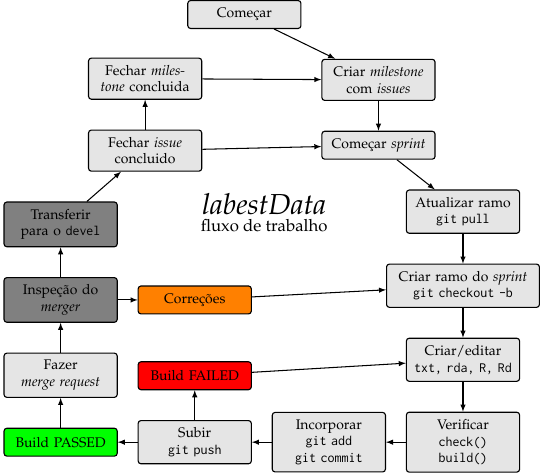

  * [workflow.pgf](https://github.com/walmes/Tikz/blob/master/src/workflow.pgf)

```tex
\tikzset{
  state/.style={
    rectangle, rounded corners=2pt, draw=black, fill=gray!20, thick,
    minimum height=2em, inner sep=5pt, text centered, text width=2.5cm
  }
}

\begin{tikzpicture}[
  ->, >=latex, line width=0.75pt, 
  align=center, node distance=0.75cm and 0.5cm]

  \node [state] (start) {Come\c{c}ar};
  \node [state, below right=of start] (miles) {Criar \emph{milestone} com \emph{issues}};
  \node [state, below=of miles] (sprint) {Come\c{c}ar \emph{sprint}};
  \node [state, below right=0.75cm and -0.75cm of sprint] (atual) {Atualizar ramo\\ \texttt{git pull}};
  \node [state, below=of atual, text width=3.5cm] (branch) {Criar ramo do \emph{sprint}\\ \texttt{git checkout -b}};
  \node [state, below=of branch, text width=2.5cm] (todo) {Criar/editar\\ \texttt{txt, rda, R, Rd}};
  \node [state, below=of todo] (check) {Verificar\\ \texttt{check()\\ build()}};
  \node [state, left=of check] (add) {Incorporar\\ \texttt{git add\\ git commit}};
  \node [state, left=of add] (push) {Subir\\ \texttt{git push}};
  \node [state, above=of push, fill=red] (icfail) {Build FAILED};
  \node [state, left=of push, fill=green] (icpass) {Build PASSED};
  \node [state, above=of icpass] (mr) {Fazer\\ \emph{merge request}};
  \node [state, above=of mr, fill=gray] (merger) {Inspe\c{c}\~{a}o do\\ \emph{merger}};
  \node [state, right=of merger, fill=orange] (mfail) {Corre\c{c}\~{o}es};
  \node [state, above=of merger, fill=gray] (mpass) {Transferir para o \texttt{devel}};
  \node [state, above right=0.75cm and -0.75cm of mpass] (fissue) {Fechar \emph{issue} concluido};
  \node [state, above=of fissue] (fmiles) {Fechar \emph{milestone} concluida};
  \node (texto) at (0.5,-5) {\huge\emph{labestData}\\ \large fluxo de trabalho};
   \path
   (start) edge (miles)
   (miles) edge (sprint)
   (sprint) edge (atual)
   (atual) edge (branch)
   (branch) edge (todo)
   (todo) edge (check)
   (check) edge (add)
   (add) edge (push)
   (push) edge (icfail)
   (icfail) edge (todo)
   (push) edge (icpass)
   (icpass) edge (mr)
   (mr) edge (merger)
   (merger) edge (mfail)
   (mfail) edge (branch)
   (merger) edge (mpass)
   (mpass) edge (fissue)
   (fissue) edge (fmiles)
   (fissue) edge (sprint)
   (fmiles) edge (miles)
;

\end{tikzpicture}
```
